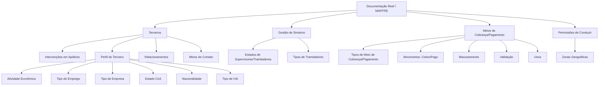

# Catálogo de Tipos e Classificações de Terceiros, Cobrança/Pagamento e Permissões de Conduzir

## 1. Metadados do Documento
- **Arquivo de Origem:** Não identificado no conteúdo extraído
- **Tipo de Documento:** Especificação Funcional / Catálogo de Dados
- **Domínio / Sistema:** Reef / MAPFRE — gestão de terceiros, sinistros, cobrança, pagamento e permissões de conduzir
- **Público-Alvo:** Desenvolvedores, Arquitetos, Analistas Funcionais, Operação e Negócio
- **Data/Versão Identificada:** Não identificada

---

## 2. Resumo Executivo & Contexto de Negócio

O documento apresenta um catálogo de tipos, códigos e descrições empregados no domínio de terceiros no contexto Reef/MAPFRE. O conteúdo especifica classificações funcionais para pessoas físicas ou jurídicas, sua atuação em apólices, vínculos empresariais, meios de contato, meios de cobrança/pagamento, características fiscais, estados operacionais e relações entre terceiros.

As classificações documentadas apoiam a padronização de dados em processos de seguros. Entre os exemplos estão os tipos de intervenção de um terceiro em uma apólice — como tomador, segurado, condutor, proprietário e beneficiário — e os tipos de tramitadores e supervisores associados à operação de sinistros.

O catálogo também define códigos para atributos cadastrais e relacionais de terceiros, incluindo atividade econômica, emprego, empresa, estado civil, nacionalidade, grupos de relacionamento e status de terceiro não desejado. Essas classificações permitem representar o perfil, a situação e os relacionamentos de terceiros de maneira consistente no sistema.

No domínio financeiro e de contato, o documento especifica meios de cobrança/pagamento, tipos de movimento, modalidades de mascaramento e validação, além de meios de contato e seus respectivos usos. O sistema permite configurar os tipos de uso dos meios de cobrança/pagamento conforme a operação local da entidade MAPFRE.

O material não descreve APIs, contratos JSON, estruturas físicas de banco de dados, URLs, ambientes, tecnologias de implementação ou mecanismos de integração. As informações apresentadas são predominantemente funcionais e referenciais, na forma de tabelas de domínio controlado.

---

## 3. Arquitetura, Componentes & Tecnologias Envolvidas

Os componentes e contextos explicitamente citados são:

| Componente / Contexto | Papel identificado no documento |
| :--- | :--- |
| **Reef** | Contexto de documentação referenciado como “DOCUMENTACIÓN Reef”. |
| **MAPFRE** | Entidade mencionada na nota sobre configuração local dos tipos de uso de meios de cobrança/pagamento. |
| **Mapfredocument** | Referência apresentada na navegação/documentação extraída. |
| **Terceiros** | Pessoas físicas ou jurídicas classificadas por papéis, atributos, relacionamentos, contato e cobrança/pagamento. |
| **Apólice** | Contexto no qual terceiros podem intervir em papéis como tomador, segurado, condutor e beneficiário. |
| **Sinistros** | Contexto associado a supervisores, tramitadores e tramitadores de sinistros. |
| **Meios de Cobrança/Pagamento** | Entidades classificadas por tipo, movimento, uso, mascaramento e validação. |
| **Permissões de Conduzir** | Entidades associadas a zonas geográficas de uso pelos segurados. |



> **Nota de Análise:** O diagrama representa relações funcionais inferidas diretamente das categorias documentadas. O conteúdo não detalha integrações técnicas, microsserviços, bancos de dados, APIs, protocolos ou fluxos de execução.

---

## 4. Regras de Negócio, Especificações Funcionais & Processos

### 4.1 Intervenções de terceiros em apólices

O sistema classifica as formas pelas quais um terceiro pode intervir em uma apólice. Os papéis incluem tomador, tomadores alternos, segurados, condutores, proprietários, beneficiários, proponente, endossatário, preventor, subagentes, pagador e beneficiários especializados.

### 4.2 Classificações cadastrais de terceiros

O catálogo estabelece domínios controlados para atributos de terceiros:

- A **atividade econômica** do terceiro pode ser classificada como Caución, Económica ou Comercial.
- O **tipo de emprego** distingue um terceiro **Por Cuenta Ajena** de um terceiro **Por Cuenta Propia**.
- O **tipo de empresa** permite identificar a natureza da empresa em que o terceiro trabalha ou atua.
- O **estado civil** do terceiro pode ser solteiro, casado, viúvo, divorciado, separado, sob Lei Comum ou em União Civil.
- A **nacionalidade** é apresentada com exemplos de códigos para Nacional, Comunitario e No Comunitario.
- O **tipo de IVA** associado ao terceiro pode ser Normal, Reducido ou Exento.

### 4.3 Cargos em empresas

O tipo de cargo/posto representa obrigações, funções ou tarefas que um terceiro pode desempenhar em uma posição atribuída no organograma de uma empresa. Os valores apresentados incluem Director, Contable, Empleado, Propietario, Administrador, Encargado e Dignatario.

### 4.4 Relacionamentos e terceiros não desejados

O documento define:

- Estados para o registro de um terceiro como **Tercero No Deseado**: Control Asignado, Liberado Permanentemente e Liberado Temporalmente.
- Tipos de grupos em terceiros relacionados: **Familia** e **Jerarquía**.

O texto não detalha as regras operacionais que levam à atribuição, alteração ou liberação desses estados.

### 4.5 Supervisores, tramitadores e sinistros

Os supervisores e tramitadores de sinistros possuem estados operacionais próprios: Activo, De Baja, De Baja Definitiva, Suspendido e Suspendido de Asignación.

A tipologia de tramitadores inclui:

- Tramitador;
- Recepcionista;
- Centro Telefónico - Cabina;
- Tramitador Abogado;
- Colaborador.

> **Nota de Análise:** O documento apresenta os códigos de estado e tipologia, mas não detalha permissões, transições de estado, critérios de atribuição de sinistros ou responsabilidades por perfil.

### 4.6 Meios de cobrança/pagamento

Os meios de cobrança/pagamento utilizados por pessoas físicas ou jurídicas com a entidade seguradora incluem conta bancária, cartão bancário, pagamento móvel/celular, carteira virtual, moeda virtual e pagamento on-line.

Cada meio pode ser associado a:

1. **Movimento:** Cobro ou Pago.
2. **Mascaramento:** Conta bancária, número telefônico, cartão bancário ou correio eletrônico.
3. **Validação:** Conta bancária, número telefônico, cartão bancário ou correio eletrônico.
4. **Uso:** O documento apresenta o valor `1 — CUALQUIERA`.

O sistema permite configurar os tipos de uso de meios de cobrança/pagamento conforme a operação local da entidade MAPFRE.

### 4.7 Meios de contato

Os meios de contato possíveis incluem correio eletrônico, telefone, móvel/SMS, correio postal, fax, página web, outros, WhatsApp, Messenger, notificações de aplicativo e “BUSCA”.

Os usos de meios de contato incluem os contextos pessoal, lar, trabalho, principal, assistente, outro, familiar, bancária, comercial, agente residente e responsável.

> **Nota de Análise:** O termo `BUSCA` aparece como descrição do código `11` para meio de contato. O documento não explica seu significado funcional, nem fornece expansão ou definição adicional.

### 4.8 Rating de resseguradoras

O tipo de rating de terceiros resseguradoras classifica o código de qualificação do terceiro nas seguintes categorias:

- Calificación Crediticia Emisor - Largo Plazo;
- Calificación Crediticia Emisor - Corto Plazo;
- Fortaleza Financiera.

### 4.9 Permissões de conduzir e zonas geográficas

As zonas geográficas definem o âmbito no qual uma permissão de conduzir de segurados pode ser utilizada. Os exemplos extraídos incluem:

- `001 — Ámbito Nacional`;
- `002 — Ámbito Comunitario (UE)`.

O documento indica a existência de valores adicionais por meio de reticências, mas não os especifica.

---

## 5. Tabelas de Parâmetros, Ambientes e Estruturas de Dados

### 5.1 Tipos de intervenção de terceiros em apólices

| Item / Parâmetro | Descrição / Função | Tipo / Valores / Formato | Ambiente / Observações |
| :--- | :--- | :--- | :--- |
| Tipo de intervenção | Forma pela qual um terceiro pode intervir em uma apólice | `0` — TOMADOR | Terceiros / Apólices |
| Tipo de intervenção | Forma pela qual um terceiro pode intervir em uma apólice | `1` — TOMADORES ALTERNOS | Terceiros / Apólices |
| Tipo de intervenção | Forma pela qual um terceiro pode intervir em uma apólice | `2` — ASEGURADOS | Terceiros / Apólices |
| Tipo de intervenção | Forma pela qual um terceiro pode intervir em uma apólice | `3` — CONDUCTORES | Terceiros / Apólices |
| Tipo de intervenção | Forma pela qual um terceiro pode intervir em uma apólice | `4` — PROPIETARIOS | Terceiros / Apólices |
| Tipo de intervenção | Forma pela qual um terceiro pode intervir em uma apólice | `5` — BENEFICIARIOS | Terceiros / Apólices |
| Tipo de intervenção | Forma pela qual um terceiro pode intervir em uma apólice | `6` — BENEFICIARIOS VIDA | Terceiros / Apólices |
| Tipo de intervenção | Forma pela qual um terceiro pode intervir em uma apólice | `7` — PROPONENTE | Terceiros / Apólices |
| Tipo de intervenção | Forma pela qual um terceiro pode intervir em uma apólice | `8` — ENDOSATARIO | Terceiros / Apólices |
| Tipo de intervenção | Forma pela qual um terceiro pode intervir em uma apólice | `9` — PREVENTOR | Terceiros / Apólices |
| Tipo de intervenção | Forma pela qual um terceiro pode intervir em uma apólice | `11` — BENEFS. CONTINGENTE VIDA | Terceiros / Apólices |
| Tipo de intervenção | Forma pela qual um terceiro pode intervir em uma apólice | `12` — CONSORCIO | Terceiros / Apólices |
| Tipo de intervenção | Forma pela qual um terceiro pode intervir em uma apólice | `13` — ACE | Terceiros / Apólices |
| Tipo de intervenção | Forma pela qual um terceiro pode intervir em uma apólice | `14` — TUTOR LEGAL | Terceiros / Apólices |
| Tipo de intervenção | Forma pela qual um terceiro pode intervir em uma apólice | `20` — SUBAGENTES | Terceiros / Apólices |
| Tipo de intervenção | Forma pela qual um terceiro pode intervir em uma apólice | `21` — PAGADOR | Terceiros / Apólices |
| Tipo de intervenção | Forma pela qual um terceiro pode intervir em uma apólice | `22` — BENEFICIARIO IRREVOCABLE | Terceiros / Apólices |
| Tipo de intervenção | Forma pela qual um terceiro pode intervir em uma apólice | `23` — BENEFICIARIO CESION DERECHOS/PIGNORACION | Terceiros / Apólices |
| Tipo de intervenção | Forma pela qual um terceiro pode intervir em uma apólice | `24` — BENEFICIARIOS LEGALES | Terceiros / Apólices |

### 5.2 Atividade econômica, cargo, emprego e empresa

| Item / Parâmetro | Descrição / Função | Tipo / Valores / Formato | Ambiente / Observações |
| :--- | :--- | :--- | :--- |
| Tipo de atividade econômica | Determina a atividade econômica do terceiro | `1` — Caución | Idioma espanhol |
| Tipo de atividade econômica | Determina a atividade econômica do terceiro | `2` — Económica | Idioma espanhol |
| Tipo de atividade econômica | Determina a atividade econômica do terceiro | `3` — Comercial | Idioma espanhol |
| Tipo de cargo/posto | Obrigações, funções ou tarefas desempenhadas pelo terceiro em posição do organograma empresarial | `1` — DIRECTOR | Idioma espanhol |
| Tipo de cargo/posto | Idem | `2` — CONTABLE | Idioma espanhol |
| Tipo de cargo/posto | Idem | `3` — EMPLEADO | Idioma espanhol |
| Tipo de cargo/posto | Idem | `4` — PROPIETARIO | Idioma espanhol |
| Tipo de cargo/posto | Idem | `5` — ADMINISTRADOR | Idioma espanhol |
| Tipo de cargo/posto | Idem | `6` — ENCARGADO | Idioma espanhol |
| Tipo de cargo/posto | Idem | `7` — DIGNATARIO | Idioma espanhol |
| Tipo de emprego | Distingue se o terceiro é assalariado ou autônomo | `CP` — Por Cuenta Ajena | Idioma espanhol |
| Tipo de emprego | Distingue se o terceiro é assalariado ou autônomo | `CA` — Por Cuenta Propia | Idioma espanhol |
| Tipo de empresa | Tipo de empresa em que o terceiro trabalha ou labora | `EI` — Empresario Individual | Terceiros / Pessoas físicas |
| Tipo de empresa | Idem | `SL` — Sociedad Limitada (S.L) | Terceiros / Pessoas físicas |
| Tipo de empresa | Idem | `SA` — Sociedad Anónima (S.A.) | Terceiros / Pessoas físicas |
| Tipo de empresa | Idem | `ASL` — Asociaciones sin Ánimo de Lucro | Terceiros / Pessoas físicas |
| Tipo de empresa | Idem | `COL` — Sociedad Colectiva | Terceiros / Pessoas físicas |
| Tipo de empresa | Idem | `COM` — Sociedad Comanditaria | Terceiros / Pessoas físicas |
| Tipo de empresa | Idem | `CBN` — Por Cuenta Ajena | Terceiros / Pessoas físicas |
| Tipo de empresa | Idem | `SCP` — Sociedad Cooperativa | Terceiros / Pessoas físicas |
| Tipo de empresa | Idem | `ONG` — Organización No Gubernamental | Terceiros / Pessoas físicas |

### 5.3 Estado civil, IVA, nacionalidade e relacionamentos

| Item / Parâmetro | Descrição / Função | Tipo / Valores / Formato | Ambiente / Observações |
| :--- | :--- | :--- | :--- |
| Estado civil | Determina o estado civil do terceiro no sistema | `S` — Soltero/a | Idioma espanhol |
| Estado civil | Determina o estado civil do terceiro no sistema | `C` — Casado/a | Idioma espanhol |
| Estado civil | Determina o estado civil do terceiro no sistema | `V` — Viudo/a | Idioma espanhol |
| Estado civil | Determina o estado civil do terceiro no sistema | `D` — Divorciado/a | Idioma espanhol |
| Estado civil | Determina o estado civil do terceiro no sistema | `P` — Separado/a | Idioma espanhol |
| Estado civil | Determina o estado civil do terceiro no sistema | `L` — Ley Común | Idioma espanhol |
| Estado civil | Determina o estado civil do terceiro no sistema | `U` — Union Civil | Idioma espanhol |
| Tipo de IVA | Tipo de Impuesto sobre el Valor Añadido associado ao terceiro | `N` — NORMAL | Terceiros |
| Tipo de IVA | Tipo de Impuesto sobre el Valor Añadido associado ao terceiro | `R` — REDUCIDO | Terceiros |
| Tipo de IVA | Tipo de Impuesto sobre el Valor Añadido associado ao terceiro | `E` — EXENTO | Terceiros |
| Tipo de nacionalidade | Determina o tipo de nacionalidade do terceiro | `001` — Nacional | Exemplo apresentado no documento |
| Tipo de nacionalidade | Determina o tipo de nacionalidade do terceiro | `002` — Comunitario | Exemplo apresentado no documento |
| Tipo de nacionalidade | Determina o tipo de nacionalidade do terceiro | `003` — No Comunitario | Exemplo apresentado no documento |
| Grupo de terceiros relacionados | Determina tipos de relações entre terceiros | `F` — FAMILIA | Terceiros relacionados |
| Grupo de terceiros relacionados | Determina tipos de relações entre terceiros | `H` — JERARQUÍA | Terceiros relacionados |

### 5.4 Estados de operação e tipologias de sinistros

| Item / Parâmetro | Descrição / Função | Tipo / Valores / Formato | Ambiente / Observações |
| :--- | :--- | :--- | :--- |
| Estado de supervisor/tramitador | Determina o estado de supervisores e tramitadores de sinistros | `A` — Activo | Sinistros |
| Estado de supervisor/tramitador | Idem | `B` — De Baja | Sinistros |
| Estado de supervisor/tramitador | Idem | `D` — De Baja Definitiva | Sinistros |
| Estado de supervisor/tramitador | Idem | `S` — Suspendido | Sinistros |
| Estado de supervisor/tramitador | Idem | `SA` — Suspendido de Asignación | Sinistros |
| Estado de terceiro não desejado | Determina o estado do terceiro ao registrá-lo como terceiro não desejado | `CA` — Control Asignado | Terceiros |
| Estado de terceiro não desejado | Idem | `LP` — Liberado Permanentemente | Terceiros |
| Estado de terceiro não desejado | Idem | `LT` — Liberado Temporalmente | Terceiros |
| Tipo de tramitador | Determina a tipologia de tramitadores de sinistros | `T` — Tramitador | Sinistros |
| Tipo de tramitador | Idem | `R` — Recepcionista | Sinistros |
| Tipo de tramitador | Idem | `C` — Centro Telefónico - Cabina | Sinistros |
| Tipo de tramitador | Idem | `A` — Tramitador Abogado | Sinistros |
| Tipo de tramitador | Idem | `CO` — Colaborador | Sinistros |
| Tipo de rating de resseguradora | Classifica o código de qualificação do terceiro ressegurador | `1` — CALIFICACIÓN CREDITICIA EMISOR - LARGO PLAZO | Terceiros resseguradoras |
| Tipo de rating de resseguradora | Idem | `2` — CALIFICACIÓN CREDITICIA EMISOR - CORTO PLAZO | Terceiros resseguradoras |
| Tipo de rating de resseguradora | Idem | `3` — FORTALEZA FINANCIERA | Terceiros resseguradoras |

### 5.5 Meios de cobrança/pagamento, validação e mascaramento

| Item / Parâmetro | Descrição / Função | Tipo / Valores / Formato | Ambiente / Observações |
| :--- | :--- | :--- | :--- |
| Meio de cobrança/pagamento | Meio usado por pessoa física ou jurídica com a entidade seguradora | `1` — Cuenta Bancaria | Cobrança/Pagamento |
| Meio de cobrança/pagamento | Idem | `2` — Tarjeta Bancaria | Cobrança/Pagamento |
| Meio de cobrança/pagamento | Idem | `3` — Pago Móvil/Celular | Cobrança/Pagamento |
| Meio de cobrança/pagamento | Idem | `4` — Monedero Virtual | Cobrança/Pagamento |
| Meio de cobrança/pagamento | Idem | `5` — Moneda Virtual | Cobrança/Pagamento |
| Meio de cobrança/pagamento | Idem | `6` — Pago On-Line | Cobrança/Pagamento |
| Movimento de cobrança/pagamento | Determina se o meio será usado para operações de cobrança ou pagamento | `1` — COBRO | Cobrança/Pagamento |
| Movimento de cobrança/pagamento | Determina se o meio será usado para operações de cobrança ou pagamento | `2` — PAGO | Cobrança/Pagamento |
| Mascaramento | Mascara valores introduzidos conforme o tipo de meio associado | `1` — Enmascaramiento de Cuenta Bancaria | Cobrança/Pagamento |
| Mascaramento | Mascara valores introduzidos conforme o tipo de meio associado | `2` — Enmascaramiento de número Telefónico | Cobrança/Pagamento |
| Mascaramento | Mascara valores introduzidos conforme o tipo de meio associado | `3` — Enmascaramiento de Tarjeta Bancaria | Cobrança/Pagamento |
| Mascaramento | Mascara valores introduzidos conforme o tipo de meio associado | `4` — Enmascaramiento de Correo Electrónico | Cobrança/Pagamento |
| Validação | Valida valores introduzidos conforme o tipo de meio associado | `1` — Validación de Cuenta Bancaria | Cobrança/Pagamento |
| Validação | Valida valores introduzidos conforme o tipo de meio associado | `2` — Validación de número Telefónico | Cobrança/Pagamento |
| Validação | Valida valores introduzidos conforme o tipo de meio associado | `3` — Validación de Tarjeta Bancaria | Cobrança/Pagamento |
| Validação | Valida valores introduzidos conforme o tipo de meio associado | `4` — Validación de Correo Electrónico | Cobrança/Pagamento |
| Uso de meio de cobrança/pagamento | Determina os usos possíveis de meios de cobrança/pagamento de terceiros | `1` — CUALQUIERA | Configurável conforme operação local MAPFRE |

### 5.6 Meios de contato e usos

| Item / Parâmetro | Descrição / Função | Tipo / Valores / Formato | Ambiente / Observações |
| :--- | :--- | :--- | :--- |
| Meio de contato | Possível meio de contato com pessoa física ou jurídica | `1` — CORREO ELECTRÓNICO | Entidade seguradora |
| Meio de contato | Idem | `2` — TELÉFONO | Entidade seguradora |
| Meio de contato | Idem | `3` — MÓVIL - SMS | Entidade seguradora |
| Meio de contato | Idem | `4` — CORREO POSTAL | Entidade seguradora |
| Meio de contato | Idem | `5` — FAX | Entidade seguradora |
| Meio de contato | Idem | `6` — PÁGINA WEB | Entidade seguradora |
| Meio de contato | Idem | `7` — OTROS | Entidade seguradora |
| Meio de contato | Idem | `8` — WHATSAPP | Entidade seguradora |
| Meio de contato | Idem | `9` — MESSENGER | Entidade seguradora |
| Meio de contato | Idem | `10` — NOTIFICACIONES - APP | Entidade seguradora |
| Meio de contato | Idem | `11` — BUSCA | Significado não detalhado |
| Uso de meio de contato | Determina usos de meios de contato | `1` — Personal | Pessoas físicas ou jurídicas |
| Uso de meio de contato | Idem | `2` — Hogar | Pessoas físicas ou jurídicas |
| Uso de meio de contato | Idem | `3` — Trabajo | Pessoas físicas ou jurídicas |
| Uso de meio de contato | Idem | `4` — Principal | Pessoas físicas ou jurídicas |
| Uso de meio de contato | Idem | `5` — Asistente | Pessoas físicas ou jurídicas |
| Uso de meio de contato | Idem | `6` — Otro | Pessoas físicas ou jurídicas |
| Uso de meio de contato | Idem | `7` — Familiar | Pessoas físicas ou jurídicas |
| Uso de meio de contato | Idem | `8` — Bancaria | Pessoas físicas ou jurídicas |
| Uso de meio de contato | Idem | `9` — Comercial | Pessoas físicas ou jurídicas |
| Uso de meio de contato | Idem | `10` — Agente Residente | Pessoas físicas ou jurídicas |
| Uso de meio de contato | Idem | `11` — Responsable | Pessoas físicas ou jurídicas |

### 5.7 Zonas geográficas de permissões de conduzir

| Item / Parâmetro | Descrição / Função | Tipo / Valores / Formato | Ambiente / Observações |
| :--- | :--- | :--- | :--- |
| Zona geográfica | Determina o âmbito geográfico de uso da permissão de conduzir de segurados | `001` — Ámbito Nacional | Permissões de conduzir |
| Zona geográfica | Determina o âmbito geográfico de uso da permissão de conduzir de segurados | `002` — Ámbito Comunitario (UE) | Permissões de conduzir |
| Zona geográfica | O documento indica valores adicionais | `...` — `...` | Valores não especificados |

---

## 6. Bateria de Perguntas & Respostas para RAG (FAQ Sintético)

### P1: Quais tipos de intervenção um terceiro pode ter em uma apólice?
**R:** O catálogo documenta os papéis de TOMADOR (`0`), TOMADORES ALTERNOS (`1`), ASEGURADOS (`2`), CONDUCTORES (`3`), PROPIETARIOS (`4`), BENEFICIARIOS (`5`), BENEFICIARIOS VIDA (`6`), PROPONENTE (`7`), ENDOSATARIO (`8`), PREVENTOR (`9`), BENEFS. CONTINGENTE VIDA (`11`), CONSORCIO (`12`), ACE (`13`), TUTOR LEGAL (`14`), SUBAGENTES (`20`), PAGADOR (`21`), BENEFICIARIO IRREVOCABLE (`22`), BENEFICIARIO CESION DERECHOS/PIGNORACION (`23`) e BENEFICIARIOS LEGALES (`24`).

### P2: Como o catálogo diferencia o tipo de emprego de um terceiro?
**R:** O tipo de emprego distingue se o terceiro é assalariado ou autônomo. O código `CP` significa **Por Cuenta Ajena** e o código `CA` significa **Por Cuenta Propia**.

### P3: Quais são os meios de cobrança e pagamento suportados para terceiros?
**R:** O documento lista seis meios de cobrança/pagamento: `1` Cuenta Bancaria, `2` Tarjeta Bancaria, `3` Pago Móvil/Celular, `4` Monedero Virtual, `5` Moneda Virtual e `6` Pago On-Line. Esses meios são aplicáveis a pessoas físicas ou jurídicas em sua relação com a entidade seguradora.

### P4: Quais movimentos podem ser associados a um meio de cobrança/pagamento?
**R:** Um meio de cobrança/pagamento pode ser utilizado para `1` COBRO ou `2` PAGO. O documento define essa classificação como o indicador de uso do meio para operações de cobranças ou de pagamentos.

### P5: Quais mecanismos de mascaramento existem para dados de cobrança/pagamento?
**R:** O catálogo lista quatro mecanismos: `1` Enmascaramiento de Cuenta Bancaria, `2` Enmascaramiento de número Telefónico, `3` Enmascaramiento de Tarjeta Bancaria e `4` Enmascaramiento de Correo Electrónico. Cada mecanismo é aplicável de acordo com o tipo de meio de cobrança/pagamento associado.

### P6: Quais validações podem ser aplicadas aos meios de cobrança/pagamento?
**R:** Existem quatro modalidades: `1` Validación de Cuenta Bancaria, `2` Validación de número Telefónico, `3` Validación de Tarjeta Bancaria e `4` Validación de Correo Electrónico. O documento não detalha os algoritmos, serviços ou critérios de validação.

### P7: Quais são os estados possíveis para supervisores e tramitadores de sinistros?
**R:** Os estados são `A` Activo, `B` De Baja, `D` De Baja Definitiva, `S` Suspendido e `SA` Suspendido de Asignación. O documento não descreve transições permitidas ou regras de autorização entre esses estados.

### P8: Quais são as tipologias de tramitadores de sinistros?
**R:** O catálogo define `T` Tramitador, `R` Recepcionista, `C` Centro Telefónico - Cabina, `A` Tramitador Abogado e `CO` Colaborador.

### P9: Como são classificados os terceiros não desejados?
**R:** Um terceiro registrado como terceiro não desejado pode receber os estados `CA` Control Asignado, `LP` Liberado Permanentemente ou `LT` Liberado Temporalmente. Não há detalhamento sobre os critérios para atribuir, liberar ou alterar esses estados.

### P10: Quais meios de contato estão previstos no catálogo?
**R:** Os meios de contato incluem correio eletrônico, telefone, móvel/SMS, correio postal, fax, página web, outros, WhatsApp, Messenger, notificações de aplicativo e BUSCA. O termo BUSCA aparece no código `11`, mas não possui descrição adicional no material.

### P11: Quais usos podem ser atribuídos a um meio de contato?
**R:** Os usos documentados são Personal, Hogar, Trabajo, Principal, Asistente, Otro, Familiar, Bancaria, Comercial, Agente Residente e Responsable. Esses usos qualificam o contexto de aplicação de um meio de contato de pessoas físicas ou jurídicas.

### P12: Quais classificações de rating são usadas para terceiros resseguradoras?
**R:** O documento apresenta três tipos: `1` CALIFICACIÓN CREDITICIA EMISOR - LARGO PLAZO, `2` CALIFICACIÓN CREDITICIA EMISOR - CORTO PLAZO e `3` FORTALEZA FINANCIERA.

### P13: Quais zonas geográficas são apresentadas para permissões de conduzir?
**R:** Os exemplos fornecidos são `001` Ámbito Nacional e `002` Ámbito Comunitario (UE). O catálogo indica que existem outros valores, mas eles não são apresentados no conteúdo extraído.

---

## 7. Glossário de Termos, Siglas & Conceitos-Chave

- **ACE:** Código de tipo de intervenção de terceiro em apólice; o documento não expande a sigla.
- **ASL:** `Asociaciones sin Ánimo de Lucro`, tipo de empresa.
- **CA:** `Control Asignado` no contexto de terceiro não desejado; também `Por Cuenta Propia` no contexto de tipo de emprego. O significado depende do domínio do atributo.
- **CBN:** `Por Cuenta Ajena`, valor apresentado no catálogo de tipo de empresa.
- **CO:** `Colaborador`, tipo de tramitador.
- **CP:** `Por Cuenta Ajena`, tipo de emprego.
- **IVA:** `Impuesto sobre el Valor Añadido`, imposto associado ao terceiro.
- **LP:** `Liberado Permanentemente`, estado de terceiro não desejado.
- **LT:** `Liberado Temporalmente`, estado de terceiro não desejado.
- **MAPFRE:** Entidade mencionada como referência para configuração local dos tipos de uso de meios de cobrança/pagamento.
- **ONG:** `Organización No Gubernamental`, tipo de empresa.
- **Reef:** Contexto/sistema de documentação citado no material.
- **S.L.:** `Sociedad Limitada`, tipo de empresa.
- **S.A.:** `Sociedad Anónima`, tipo de empresa.
- **SA:** `Suspendido de Asignación`, estado de supervisor ou tramitador.
- **SCP:** `Sociedad Cooperativa`, tipo de empresa.
- **Tercero:** Pessoa física ou jurídica classificada no sistema por atributos, relacionamentos, meios de contato, meios de cobrança/pagamento e papéis em apólices.
- **Tramitador:** Perfil ou tipologia associada à tramitação de sinistros.

---

## 8. Notas Críticas, Riscos & Limitações

- O conteúdo é um catálogo funcional de valores controlados; não apresenta APIs, endpoints, contratos de mensagens, estruturas de banco de dados, versões de software ou tecnologias de implementação.
- Não há detalhamento de validações técnicas, regras de obrigatoriedade de campos, transições de estado, permissões ou fluxos de aprovação.
- O código `CA` é reutilizado em contextos distintos: `Por Cuenta Propia` para tipo de emprego e `Control Asignado` para estado de terceiro não desejado. Implementações devem sempre interpretar o código junto ao respectivo domínio de atributo.
- O termo `BUSCA`, listado como meio de contato de código `11`, não é explicado no documento.
- O valor `ACE`, usado como tipo de intervenção, não é expandido ou definido.
- A lista de nacionalidades é apresentada como exemplo e contém reticências; não deve ser tratada como catálogo exaustivo.
- A lista de zonas geográficas de permissões de conduzir também contém reticências; apenas os códigos `001` e `002` são explicitamente sustentados pelo texto.
- A configuração de tipos de uso de meios de cobrança/pagamento pode variar de acordo com a operação local da entidade MAPFRE.
- Há caracteres de extração potencialmente corrompidos em palavras como “De Baja Definitiva”, “clasificación”, “configuración” e “geográfico”; a interpretação adotada preserva o sentido textual aparente sem acrescentar informação externa.

---

## 9. Conteúdo Bruto Estruturado (Referência Fiel)

```text
--- [PÁGINA 1 DE 8] ---

TIPOS (TERCEROS)
INTERVENCIONES DE CLIENTE
Formas en las que un tercero puede intervenir en una póliza
TIPO DESCRIPCIÓN
0 TOMADOR
1 TOMADORES ALTERNOS
2 ASEGURADOS
3 CONDUCTORES
4 PROPIETARIOS
5 BENEFICIARIOS
6 BENEFICIARIOS VIDA
7 PROPONENTE
8 ENDOSATARIO
9 PREVENTOR
11 BENEFS. CONTINGENTE VIDA
12 CONSORCIO
13 ACE
14 TUTOR LEGAL
20 SUBAGENTES
21 PAGADOR
22 BENEFICIARIO IRREVOCABLE
23 BENEFICIARIO CESION DERECHOS/PIGNORACION
Documentation / DOCUMENTACIÓN Reef
DOCUMENTACIÓN Reef
Mapfredocument
DOCUMENTACIÓN Reef
Owner
user:agonzalez_mapfre.com
Lifecycle
Approved Source
 /
 VL
Buscar Inicio Soluciones Arquitecturas APIs Componentes Cloud Documentación Zeus Reef Ayuda
ES

--- [PÁGINA 2 DE 8] ---

TIPO DESCRIPCIÓN
24 BENEFICIARIOS LEGALES
TIPO de ACTIVIDAD ECONÓMICA de los Terceros
Determina la Actividad Económica del Tercero.
En idioma español la relación de posibles valores es:
TIPO DESCRIPCIÓN
1 Caución
2 Económica
3 Comercial
TIPO de los CARGOS/PUESTOS en las Empresas
Determina los posibles Cargos de la Persona en la Empresa entendiendo como tales a las obligaciones, funciones o tareas que el Tercero
puede desempeñar para una posición asignada en el organigrama de la empresa.
En idioma español la relación de posibles valores es:
TIPO DESCRIPCIÓN
1 DIRECTOR
2 CONTABLE
3 EMPLEADO
4 PROPIETARIO
5 ADMINISTRADOR
6 ENCARGADO
7 DIGNATARIO
TIPO de ENMASCARAMIENTO en los Medios de Cobro/Pago
Determina las posibles maneras que se pueden utilizar para enmascarar los valores introducidos en los medios de cobro/pago de acuerdo
con el tipo de medio de Cobro/Pago que tenga asociado.
En idioma español la relación de posibles valores es:
TIPO DESCRIPCIÓN
1 Enmascaramiento de Cuenta Bancaria
2 Enmascaramiento de número Telefónico
3 Enmascaramiento de Tarjeta Bancaria

--- [PÁGINA 3 DE 8] ---

TIPO DESCRIPCIÓN
4 Enmascaramiento de Correo Electrónico
TIPO de EMPLEO para los Terceros
Determina el tipo de empleo del Tercero y distinguir si éste es un Asalariado o un Autónomo.
En idioma español la relación de posibles valores es:
TIPO DESCRIPCIÓN
CP Por Cuenta Ajena
CA Por Cuenta Propia
TIPO de EMPRESA en los Terceros/Personas Físicas
Determina el tipo de empresa en la que trabaja o labora el Tercero.
En idioma español la relación de posibles valores es:
TIPO DESCRIPCIÓN
EI Empresario Individual
SL Sociedad Limitada (S.L)
SA Sociedad Anónima (S.A.)
ASL Asociaciones sin Ánimo de Lucro
COL Sociedad Colectiva
COM Sociedad Comanditaria
CBN Por Cuenta Ajena
SCP Sociedad Cooperativa
ONG Organización No Gubernamental
TIPO de ESTADOS CIVILES de los Terceros
Determina el estado civil de los Terceros en el Sistema.
En idioma español la relación de posibles valores es:
TIPO DESCRIPCIÓN
S Soltero/a
C Casado/a
V Viudo/a

--- [PÁGINA 4 DE 8] ---

TIPO DESCRIPCIÓN
D Divorciado/a
P Separado/a
L Ley Común
U Union Civil
TIPO de ESTADOS de los SUPERVISORES y TRAMITADORES
Determina el estado de los Supervisores/Tramitadores de Siniestros en el Sistema.
En idioma español la relación de posibles valores es:
TIPO DESCRIPCIÓN
A Activo
B De Baja
D De Baja Definitiva
S Suspendido
SA Suspendido de Asignación
TIPO de ESTADOS en los Terceros No Deseados
Determina el estado del Tercero al registrarlo como Tercero No Deseado.
En idioma español la relación de posibles valores es:
TIPO DESCRIPCIÓN
CA Control Asignado
LP Liberado Permanentemente
LT Liberado Temporalmente
TIPO de GRUPOS en Terceros Relacionados
Determina los posibles Tipos de Relaciones entre los Terceros.
En idioma español la relación de posibles valores es:
TIPO DESCRIPCIÓN
F FAMILIA
H JERARQUÍA

--- [PÁGINA 5 DE 8] ---

TIPO de IVA de los Terceros
Determina el tipo de Impuesto sobre el Valor Añadido asociado al Tercero.
En idioma español la relación de posibles valores es:
TIPO DESCRIPCIÓN
N NORMAL
R REDUCIDO
E EXENTO
TIPO de MEDIOS de COBRO/PAGO
Determina los medios de cobro/pago de las Personas Físicas o Jurídicas con la entidad Aseguradora.
En idioma español la relación de posibles valores es:
TIPO DESCRIPCIÓN
1 Cuenta Bancaria
2 Tarjeta Bancaria
3 Pago Móvil/Celular
4 Monedero Virtual
5 Moneda Virtual
6 Pago On-Line
TIPO de MEDIOS de CONTACTO
Determina los posibles medios de contacto de las Personas Físicas o Jurídicas con la entidad Aseguradora.
En idioma español la relación de posibles valores es:
TIPO DESCRIPCIÓN
1 CORREO ELECTRÓNICO
2 TELÉFONO
3 MÓVIL - SMS
4 CORREO POSTAL
5 FAX
6 PÁGINA WEB
7 OTROS

--- [PÁGINA 6 DE 8] ---

TIPO DESCRIPCIÓN
8 WHATSAPP
9 MESSENGER
10 NOTIFICACIONES - APP
11 BUSCA
TIPO de MOVIMIENTOS en los Medios de Cobro/Pago
Determina si el Medio de Cobro/Pago va a ser utilizado para Realizar Operaciones de Cobros o de Pagos.
En idioma español la relación de posibles valores es:
TIPO DESCRIPCIÓN
1 COBRO
2 PAGO
TIPO de NACIONALIDAD para los Terceros
Determina el tipo de nacionalidad del Tercero.
A modo de ejemplo y en Idioma Español, sus valores podrían ser:
Tipo de NACIONALIDAD DESCRIPCIÓN
001 Nacional
002 Comunitario
003 No Comunitario
... ...
TIPO de RATING en los Terceros Reaseguradoras
Determina la clasificación del código de calificación del Tercero.
En idioma español la relación de posibles valores es:
TIPO DESCRIPCIÓN
1 CALIFICACIÓN CREDITICIA EMISOR - LARGO PLAZO
2 CALIFICACIÓN CREDITICIA EMISOR - CORTO PLAZO
3 FORTALEZA FINANCIERA
TIPO de TRAMITADORES
Determina la Tipología de los Tramitadores de Siniestros en el Sistema.

--- [PÁGINA 7 DE 8] ---

En idioma español la relación de posibles valores es:
TIPO DESCRIPCIÓN
T Tramitador
R Recepcionista
C Centro Telefónico - Cabina
A Tramitador Abogado
CO Colaborador
TIPO de USOS de los MEDIOS de CONTACTO
Determina los posibles usos de los Medios de Contacto de las Personas Físicas o Jurídicas con la entidad Aseguradora.
En idioma español la relación de posibles valores es:
USOS. DESCRIPCIÓN
1 Personal
2 Hogar
3 Trabajo
4 Principal
5 Asistente
6 Otro
7 Familiar
8 Bancaria
9 Comercial
10 Agente Residente
11 Responsable
TIPO de USOS de los Medios de COBRO/PAGO
Determina los posibles usos en los que se pueden emplear los medios de Cobro/Pago de los Terceros.
En idioma español la relación de posibles valores es:
TIPO DESCRIPCIÓN
1 CUALQUIERA
NOTA: El Sistema permite la configuración de los tipos de Usos de acuerdo con la operativa local de la entidad MAPFRE.

--- [PÁGINA 8 DE 8] ---

TIPO de VALIDACIÓN en los Medios de Cobro/Pago
Determina las posibles maneras que se pueden utilizar para validar los valores introducidos en los medios de cobro/pago de acuerdo con el
tipo de medio de Cobro/Pago que tenga asociado.
En idioma español la relación de posibles valores es:
TIPO DESCRIPCIÓN
1 Validación de Cuenta Bancaria
2 Validación de número Telefónico
3 Validación de Tarjeta Bancaria
4 Validación de Correo Electrónico
TIPO de ZONAS GEOGRÁFICAS en los Permisos de Conducir de los Asegurados
Determina el ámbito geográfico en el que se puede utilizar el Permiso de Conducir de los Asegurados.
En idioma español la relación de posibles valores es:
CÓDIGO ZONAL | DESCRIPCIÓN
001 | Ámbito Nacional
002 | Ámbito Comunitario (UE)
... | ...
```
