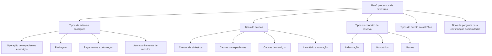

# Catálogo de Tipos para Processos de Siniestros no Reef

## 1. Metadados do Documento
- **Arquivo de Origem:** Não identificado no conteúdo fornecido
- **Tipo de Documento:** Manual Operacional / Catálogo de Referência
- **Domínio / Sistema:** Reef — gestão de siniestros, expedientes, peritagens, reservas e serviços
- **Público-Alvo:** Operação, tramitadores, supervisores, peritos, analistas funcionais e desenvolvedores
- **Data/Versão Identificada:** Não identificada

---

## 2. Resumo Executivo & Contexto de Negócio

O documento apresenta um catálogo de códigos funcionais usados em processos de **siniestros** no contexto do Reef. O conteúdo organiza tipologias de avisos, anotações, causas, conceitos de reserva, eventos catastróficos e perguntas para confirmação do tramitador.

Os códigos representam estados, notificações, ações operacionais, resultados de perícia, situações de pagamento e cobrança, progresso de serviços e decisões sobre expedientes. A padronização permite classificar eventos e etapas relevantes ao ciclo de vida de um siniestro.

O documento também contém causas numeradas para operações como criação, modificação, reabilitação, terminação e reabertura de siniestros, expedientes e serviços. Existem ainda códigos específicos para inspeção, liquidações, inventário, valoração e rejeições.

A seção de conceitos de reserva diferencia os valores reservados ou pagos conforme sua finalidade: indenização, honorários de profissionais ou gastos de profissionais. A classificação de eventos catastróficos contempla terremoto, furacão, tornado, erupção vulcânica, incêndio e inundação.

> **Nota de Análise:** O documento é predominantemente um catálogo de códigos e descrições. Não detalha contratos de API, métodos HTTP, modelos de dados, persistência, integrações técnicas, URLs, ambientes ou regras de transição entre estados.

---

## 3. Arquitetura, Componentes & Tecnologias Envolvidas

O conteúdo menciona o **Reef** como contexto documental e apresenta classificações funcionais aplicáveis ao domínio de siniestros. Também são citadas referências de navegação/documentação, incluindo “Documentación Reef”, “Mapfredocument”, “Zeus”, “Cloud”, “APIs”, “Componentes” e “Arquitecturas”.

Não há uma arquitetura de software explicitamente descrita, nem relações técnicas comprovadas entre Reef, Mapfredocument, Zeus, APIs ou Cloud. Portanto, o diagrama abaixo representa somente a organização conceitual das categorias documentadas.



### Componentes e domínios citados

| Componente / Termo | Papel identificado no conteúdo | Observações |
| :--- | :--- | :--- |
| Reef | Contexto documental e domínio dos catálogos apresentados | Não há detalhamento técnico do sistema |
| Siniestros | Domínio central de processos, causas, avisos e eventos | Termo em espanhol; relacionado a sinistros |
| Expedientes | Entidades/processos sujeitos a abertura, reabilitação, terminação e rejeição | Não há definição formal adicional |
| Tramitador | Papel associado à confirmação e a decisões sobre expedientes | O documento não detalha responsabilidades completas |
| Supervisor | Papel citado em anotações e em ditame do supervisor | Sem matriz de permissões |
| Perito / Peritación | Papel/processo associado a avaliação e resultado de peritagem | Não há método ou fluxo detalhado |
| Mapfredocument | Referência de documentação | Relação técnica com Reef não descrita |
| Zeus | Item disponível na navegação documental | Função não detalhada |
| APIs | Categoria presente na navegação documental | Nenhuma API é descrita |
| Cloud | Categoria presente na navegação documental | Nenhum ambiente cloud é especificado |

---

## 4. Regras de Negócio, Especificações Funcionais & Processos

### 4.1 Tipos de avisos e anotações

O documento define códigos para avisos e anotações associados a operações de siniestros, expedientes, serviços, pagamentos, cobranças, revisão de processos e acompanhamento de veículos.

Os códigos incluem situações como:
- abertura automática ou possível abertura de expediente;
- término de expediente;
- solicitação, resultado, frustração ou cancelamento de peritagem;
- contato com segurado, profissional, agente, perito ou médico supervisor;
- revisão de fatura, execução, finalização e fechamento de processo;
- pagamentos e cobranças realizados corretamente ou com incidências;
- reatribuição de tramitador;
- notificações relacionadas a possível fraude;
- acompanhamento do ciclo de reparação de veículo.

### 4.2 Tipos de causas

Os códigos numéricos de causas são aplicáveis a diferentes processos de siniestros. As categorias documentadas abrangem:
1. origem de siniestros;
2. modificação e reabilitação de siniestros;
3. modificação, reabilitação, abertura e terminação de expedientes;
4. retificação de liquidações;
5. inspeção;
6. terminação de siniestros;
7. reabertura de juízo;
8. gastos não amparados;
9. rejeição por C.T. para siniestro ou expediente;
10. liberação e anulação de inventário;
11. mudança de valoração;
12. cancelamento e reabertura de serviço;
13. resultado de peritagem.

### 4.3 Conceitos de reserva

O tipo de conceito de reserva determina a finalidade do importe reservado ou pago:
- **I — Indemnización:** importe destinado à indenização.
- **H — Honorarios:** importe destinado a honorários de profissionais.
- **G — Gastos:** importe destinado a gastos de profissionais.

### 4.4 Eventos catastróficos

A tipologia `TIP_EVENTO` classifica a natureza de eventos catastróficos:
- terremoto;
- furacão;
- tornado;
- erupção vulcânica;
- incêndio;
- inundação.

### 4.5 Confirmação do tramitador

O documento lista perguntas, decisões e estados usados na confirmação do tramitador. Entre os elementos identificados estão:
- rejeição de expediente;
- análise de coberturas e recibos;
- perda total;
- substituição de veículo;
- confirmação de documentos recebidos;
- confirmação de recibos pagos e estado de apólice;
- resultado da peritagem;
- confirmação de perda total pelo segurado;
- possível fraude;
- comunicação com papéis operacionais;
- abertura com expediente;
- expediente completo;
- localização realizada;
- atribuição de recuperador;
- resultados e necessidades de análise, ditame médico, ditame do tramitador e ditame do supervisor;
- informação a resseguro;
- aprovação de reclamação;
- confirmação de ingresso de veículo;
- recebimento de fatura.

> **Nota de Análise:** O documento identifica os códigos e respectivas descrições, mas não especifica regras condicionais, obrigatoriedade de preenchimento, prioridade, sequência de execução, responsáveis formais ou transições válidas entre códigos.

---

## 5. Tabelas de Parâmetros, Ambientes e Estruturas de Dados

### 5.1 Tipos de avisos e anotações

| Item / Parâmetro | Descrição / Função | Tipo / Valores / Formato | Ambiente / Observações |
| :--- | :--- | :--- | :--- |
| D | Aviso Definido | Código alfanumérico | Tipos de avisos e anotações |
| PN | Pago Anulado | Código alfanumérico | Tipos de avisos e anotações |
| C | Control Técnico | Código alfanumérico | Tipos de avisos e anotações |
| RP | Resultado de la Peritación | Código alfanumérico | Tipos de avisos e anotações |
| CT | Aviso del Centro Telefónico | Código alfanumérico | Tipos de avisos e anotações |
| G | Genérico | Código alfanumérico | Tipos de avisos e anotações |
| PA | Posible Apertura de Expediente | Código alfanumérico | Tipos de avisos e anotações |
| AP | Apertura Automática | Código alfanumérico | Tipos de avisos e anotações |
| FP | Peritación Frustrada | Código alfanumérico | Tipos de avisos e anotações |
| CP | Peritación Cancelada | Código alfanumérico | Tipos de avisos e anotações |
| TE | Terminación de Expediente | Código alfanumérico | Tipos de avisos e anotações |
| QUI | Aviso Quincenal | Código alfanumérico | Tipos de avisos e anotações |
| SP | Solicitud de Peritación | Código alfanumérico | Tipos de avisos e anotações |
| SU | Anotaciones del Supervisor | Código alfanumérico | Tipos de avisos e anotações |
| SEM | Semanal | Código alfanumérico | Tipos de avisos e anotações |
| AA | Aviso Liquid. Inmovilizar | Código alfanumérico | Tipos de avisos e anotações |
| SE | Siniestro de la Agencia | Código alfanumérico | Tipos de avisos e anotações |
| DAN | Aviso Tramitador Daños | Código alfanumérico | Tipos de avisos e anotações |
| ZZZ | Genérico | Código alfanumérico | Tipos de avisos e anotações |
| PRF | Pendiente de Revisar Factura | Código alfanumérico | Tipos de avisos e anotações |
| CAS | Contacto con el Asegurado | Código alfanumérico | Tipos de avisos e anotações |
| RPS | Revisar progreso del servicio | Código alfanumérico | Tipos de avisos e anotações |
| PES | El plazo de ejecución del servicio ha vencido | Código alfanumérico | Tipos de avisos e anotações |
| CUR | Aviso en Curso CCA | Código alfanumérico | Tipos de avisos e anotações |
| CPR | Contacto con el Profesional | Código alfanumérico | Tipos de avisos e anotações |
| PF | Peritación Frustrada | Código alfanumérico | Tipos de avisos e anotações |
| ML | Correo Clientes | Código alfanumérico | Tipos de avisos e anotações |
| RPE | Revisar Proceso de Ejecución | Código alfanumérico | Tipos de avisos e anotações |
| FPE | Finalización Proceso de Ejecución | Código alfanumérico | Tipos de avisos e anotações |
| RPF | Revisar Proceso Finalización | Código alfanumérico | Tipos de avisos e anotações |
| FPF | Finalización Proceso de Finalización | Código alfanumérico | Tipos de avisos e anotações |
| RPC | Revisar Proceso Cerrado | Código alfanumérico | Tipos de avisos e anotações |
| FPC | Finalizar Proceso Cerrado | Código alfanumérico | Tipos de avisos e anotações |
| FME | Finalización Proceso Ejecución | Código alfanumérico | Tipos de avisos e anotações |
| FMF | Finalización Proceso Finalización | Código alfanumérico | Tipos de avisos e anotações |
| FMC | Finalización Proceso Cerrado | Código alfanumérico | Tipos de avisos e anotações |
| FLE | Finalización Proceso Ejecución | Código alfanumérico | Tipos de avisos e anotações |
| FLF | Finalización Proceso Finalización | Código alfanumérico | Tipos de avisos e anotações |
| FLC | Finalización Proceso Cerrado | Código alfanumérico | Tipos de avisos e anotações |
| COK | Cobro Realizado Correctamente | Código alfanumérico | Tipos de avisos e anotações |
| CKO | Cobro con Incidencias | Código alfanumérico | Tipos de avisos e anotações |
| POK | Pago Realizado Correctamente | Código alfanumérico | Tipos de avisos e anotações |
| PKO | Pago con Incidencias | Código alfanumérico | Tipos de avisos e anotações |
| RT | Re-asignación de Tramitador | Código alfanumérico | Tipos de avisos e anotações |
| CC1 | Entrada Vehículo Taller | Código alfanumérico | Acompanhamento de veículo |
| CC2 | Comienza Reparación Vehículo | Código alfanumérico | Acompanhamento de veículo |
| CC3 | Fecha de entrega esperada | Código alfanumérico | Acompanhamento de veículo |
| CC4 | Avance Recepción de Piezas | Código alfanumérico | Acompanhamento de veículo |
| CC5 | Avance Fin de Reparación | Código alfanumérico | Acompanhamento de veículo |
| CC6 | Avance Entrega Vehículo | Código alfanumérico | Acompanhamento de veículo |
| CC7 | Cancelación Servicio | Código alfanumérico | Acompanhamento de veículo |
| FRA | Notificación Posible Fraude (Proveedor) | Código alfanumérico | Tipos de avisos e anotações |

### 5.2 Tipos de causas

| Item / Parâmetro | Descrição / Função | Tipo / Valores / Formato | Ambiente / Observações |
| :--- | :--- | :--- | :--- |
| 1 | Causas Origen de Siniestros | Código numérico | Tipos de causas |
| 2 | Modificación de Siniestros | Código numérico | Tipos de causas |
| 3 | Rehabilitación de Siniestros | Código numérico | Tipos de causas |
| 4 | Modificación de Expedientes | Código numérico | Tipos de causas |
| 5 | Rehabilitación de Expedientes | Código numérico | Tipos de causas |
| 6 | Terminación de Expedientes | Código numérico | Tipos de causas |
| 7 | Rectificación de Liquidaciones | Código numérico | Tipos de causas |
| 8 | Causas de Inspección | Código numérico | Tipos de causas |
| 9 | Terminación de Siniestros | Código numérico | Tipos de causas |
| 10 | Causas Reapertura Juicio | Código numérico | Tipos de causas |
| 11 | Causas Gastos No Amparados | Código numérico | Tipos de causas |
| 12 | Causas Rechazo C.T. Siniestro | Código numérico | Tipos de causas |
| 14 | Causas Rechazo C.T. Expediente | Código numérico | Tipos de causas |
| 15 | Apertura de Expedientes | Código numérico | Tipos de causas |
| 16 | Resultado de la Peritación | Código numérico | Tipos de causas |
| 17 | Liberación del Inventario | Código numérico | Tipos de causas |
| 18 | Anulación del Inventario | Código numérico | Tipos de causas |
| 19 | Cambio de Valoración | Código numérico | Tipos de causas |
| 20 | Cancelación Servicio | Código numérico | Tipos de causas |
| 21 | Reapertura Servicio | Código numérico | Tipos de causas |

### 5.3 Conceitos de reserva e eventos catastróficos

| Item / Parâmetro | Descrição / Função | Tipo / Valores / Formato | Ambiente / Observações |
| :--- | :--- | :--- | :--- |
| I | Indemnización | Código alfabético | Conceito de reserva |
| H | Honorarios | Código alfabético | Conceito de reserva |
| G | Gastos | Código alfabético | Conceito de reserva |
| 1 | Terremoto | Código numérico | `TIP_EVENTO` |
| 2 | Huracán | Código numérico | `TIP_EVENTO` |
| 3 | Tornado | Código numérico | `TIP_EVENTO` |
| 4 | Erupción Volcánica | Código numérico | `TIP_EVENTO` |
| 5 | Incendio | Código numérico | `TIP_EVENTO` |
| 6 | Inundación | Código numérico | `TIP_EVENTO` |

### 5.4 Perguntas para confirmação do tramitador

| Item / Parâmetro | Descrição / Função | Tipo / Valores / Formato | Ambiente / Observações |
| :--- | :--- | :--- | :--- |
| AY | Se rechaza el expediente | Código alfanumérico | Confirmação do tramitador |
| AC | Análisis de coberturas y recibos O.K. | Código alfanumérico | Confirmação do tramitador |
| PT | Perdida Total | Código alfanumérico | Confirmação do tramitador |
| SV | Sustitución de Vehículo | Código alfanumérico | Confirmação do tramitador |
| CF | Todos los documentos han sido recepcionados total | Código alfanumérico | Confirmação do tramitador |
| CP | Recibos pagados, estado póliza | Código alfanumérico | Confirmação do tramitador |
| CR | Resultado de la Peritación | Código alfanumérico | Confirmação do tramitador |
| CA | Asegurado confirma perdida total | Código alfanumérico | Confirmação do tramitador |
| FA | Posible Fraude | Código alfanumérico | Confirmação do tramitador |
| MS | Comunicación con el Medico Supervisor | Código alfanumérico | Confirmação do tramitador |
| PC | Persona de Contacto | Código alfanumérico | Confirmação do tramitador |
| AG | Comunicación con el Agente | Código alfanumérico | Confirmação do tramitador |
| TA | Se apertura con el expediente | Código alfanumérico | Confirmação do tramitador |
| GR | Expediente Completo | Código alfanumérico | Confirmação do tramitador |
| LO | Ya se realizo la localización | Código alfanumérico | Confirmação do tramitador |
| RE | Asignación de Recuperador | Código alfanumérico | Confirmação do tramitador |
| AE | Se rechaza el expediente | Código alfanumérico | Confirmação do tramitador |
| PE | Comunicación con el Perito | Código alfanumérico | Confirmação do tramitador |
| MT | Muerte | Código alfanumérico | Confirmação do tramitador |
| IT | Incapacidad Temporal | Código alfanumérico | Confirmação do tramitador |
| IP | Incapacidad Permanente | Código alfanumérico | Confirmação do tramitador |
| 1A | Rechaza Exp. en Análisis | Código alfanumérico | Confirmação do tramitador |
| 1B | Requiere Información para Análisis | Código alfanumérico | Confirmação do tramitador |
| 1C | Tiene Duda en Docto o Firma | Código alfanumérico | Confirmação do tramitador |
| 1D | Procede Análisis del Tram | Código alfanumérico | Confirmação do tramitador |
| 1E | Rechaza Exp. en Dict. Med. | Código alfanumérico | Confirmação do tramitador |
| 1F | Req. Inf. para Dict. Med. | Código alfanumérico | Confirmação do tramitador |
| 1G | Procede Dictamen Medico | Código alfanumérico | Confirmação do tramitador |
| 1H | Recibió Información de Comité de Siniestros | Código alfanumérico | Confirmação do tramitador |
| 1I | Recibió Resultado de Investigación | Código alfanumérico | Confirmação do tramitador |
| 1K | Procede Dictamen del Tramitador | Código alfanumérico | Confirmação do tramitador |
| 1L | Rechaza Exp. en Dict. Trami. | Código alfanumérico | Confirmação do tramitador |
| 1M | Req. Inf. para Dict. Trami. | Código alfanumérico | Confirmação do tramitador |
| 1N | Procede Dictamen del Supervisor | Código alfanumérico | Confirmação do tramitador |
| D1 | Requiere Informar a Reaseguro | Código alfanumérico | Confirmação do tramitador |
| IJ | Recibido Información Requerida | Código alfanumérico | Confirmação do tramitador |
| CT | Confirmación del Tramitador? | Código alfanumérico | Confirmação do tramitador |
| AR | Aprobar Reclamo | Código alfanumérico | Confirmação do tramitador |
| CV | Confirmación Ingreso Vehículo | Código alfanumérico | Confirmação do tramitador |
| RF | Recibido Factura | Código alfanumérico | Confirmação do tramitador |

---

## 6. Bateria de Perguntas & Respostas para RAG (FAQ Sintético)

### P1: Qual código identifica uma abertura automática de expediente?
**R:** O código **AP** corresponde a **“Apertura Automática”** no catálogo de tipos de avisos e anotações.

### P2: Como é classificada uma peritagem frustrada?
**R:** O documento apresenta **FP — Peritación Frustrada** e também **PF — Peritación Frustrada** como códigos de tipos de avisos e anotações. O documento não explica a diferença operacional entre os códigos FP e PF.

### P3: Qual código deve ser usado para registrar um pagamento realizado corretamente?
**R:** O código **POK** significa **“Pago Realizado Correctamente”**. Para pagamento com incidências, o código listado é **PKO — Pago con Incidencias**.

### P4: Quais são os tipos de conceito de reserva no processo de siniestros?
**R:** Existem três tipos: **I — Indemnización**, para valores destinados à indenização; **H — Honorarios**, para honorários de profissionais; e **G — Gastos**, para gastos de profissionais.

### P5: Qual código representa resultado de peritagem?
**R:** O código **RP** representa **“Resultado de la Peritación”** nos tipos de avisos e anotações. O código numérico **16** também corresponde a **“Resultado de la Peritación”** na tabela de tipos de causas. Na confirmação do tramitador, o código é **CR**.

### P6: Quais eventos catastróficos são suportados pela classificação `TIP_EVENTO`?
**R:** A classificação `TIP_EVENTO` inclui: **1 — Terremoto**, **2 — Huracán**, **3 — Tornado**, **4 — Erupción Volcánica**, **5 — Incendio** e **6 — Inundación**.

### P7: Qual código informa que o prazo de execução de um serviço venceu?
**R:** O código **PES** corresponde a **“El plazo de ejecución del servicio ha vencido”**.

### P8: Qual código representa reatribuição de tramitador?
**R:** O código **RT** representa **“Re-asignación de Tramitador”**.

### P9: Como registrar uma notificação de possível fraude associada a fornecedor?
**R:** O código **FRA** corresponde a **“Notificación Posible Fraude (Proveedor)”**. O catálogo de confirmação do tramitador também inclui **FA — Posible Fraude**, sem especificar a diferença entre os contextos de uso de FRA e FA.

### P10: Quais códigos acompanham o ciclo de reparação de um veículo?
**R:** Os códigos são: **CC1** para entrada do veículo na oficina, **CC2** para início da reparação, **CC3** para data de entrega esperada, **CC4** para avanço no recebimento de peças, **CC5** para avanço/fim da reparação, **CC6** para avanço na entrega do veículo e **CC7** para cancelamento do serviço.

### P11: Qual causa deve ser utilizada para reabertura de serviço?
**R:** O código de causa **21** corresponde a **“Reapertura Servicio”**.

### P12: Quais códigos tratam de ditame médico, do tramitador e do supervisor?
**R:** Para ditame médico, o catálogo contém **1E** (rejeita expediente em ditame médico), **1F** (requer informação para ditame médico) e **1G** (procede ditame médico). Para o tramitador, há **1K**, **1L** e **1M**. Para o supervisor, há **1N — Procede Dictamen del Supervisor**.

---

## 7. Glossário de Termos, Siglas & Conceitos-Chave

- **Aviso:** Classificação de notificação operacional associada a processos de siniestros.
- **Anotación:** Registro ou classificação de informação associada a um processo.
- **C.T.:** Sigla presente em “Causas Rechazo C.T.” e “Aviso del Centro Telefónico”; o documento não fornece expansão única e explícita para todos os usos.
- **CCA:** Sigla presente em “Aviso en Curso CCA”; não definida no documento.
- **Concepto de Reserva:** Tipo que determina se um importe reservado ou pago se destina a indenização, honorários ou gastos.
- **Dictamen:** Parecer ou decisão referida no contexto médico, do tramitador ou do supervisor.
- **Expediente:** Entidade/processo administrativo relacionado a siniestros.
- **Peritación:** Processo ou resultado de avaliação pericial.
- **Reaseguro:** Destinatário de informação conforme o código D1.
- **Reef:** Contexto/sistema mencionado pela documentação de referência.
- **Siniestro:** Domínio operacional central do catálogo; o documento utiliza o termo sem definição formal.
- **Tramitador:** Papel envolvido na confirmação, análise e ditame de expedientes.
- **TIP_EVENTO:** Classificação da tipologia e natureza de eventos catastróficos.

---

## 8. Notas Críticas, Riscos & Limitações

- O documento não identifica arquivo de origem, versão, data, autor técnico ou responsável pela manutenção dos códigos.
- Há caracteres corrompidos na extração, como `denidos`, `catastrócos` e `Noticación`; a interpretação foi preservada conforme o contexto textual.
- Alguns códigos possuem descrições iguais ou muito semelhantes, como **FP** e **PF** para “Peritación Frustrada”, sem explicação de diferenciação.
- O código **CP** aparece com significados distintos: “Peritación Cancelada” em tipos de avisos e “Recibos pagados, estado póliza” em confirmação do tramitador. O contexto da tabela é necessário para desambiguação.
- O código **CT** aparece como “Aviso del Centro Telefónico” e também como “Confirmación del Tramitador?”, reforçando a necessidade de contextualização por categoria.
- O documento não define fluxos de estado, pré-condições, pós-condições, responsabilidades, permissões ou regras de validação para os códigos.
- Não há detalhes de integração, persistência, APIs, estruturas JSON, ambientes, URLs, logs, servidores, autenticação ou contratos técnicos.
- Termos como **CCA**, **C.T.**, **Tram**, **Dict. Med.** e **Dict. Trami.** não possuem expansão formal completa no conteúdo fornecido.

---

## 9. Conteúdo Bruto Estruturado (Referência Fiel)

```text
--- [PÁGINA 1 DE 6] ---

TIPOS (SINIESTROS)
TIPOS DE AVISOS Y ANOTACIONES
Esto son algunos de los tipos de Avisos y de Anotaciones denidos, que pueden servir de ayuda.
TIPO DESCRIPCIÓN
D Aviso Denido
PN Pago Anulado
C Control Técnico
RP Resultado de la Peritación
CT Aviso del Centro Telefónico
G Genérico
PA Posible Apertura de Expediente
AP Apertura Automática
FP Peritación Frustrada
CP Peritación Cancelada
TE Terminación de Expediente
QUI Aviso Quincenal
SP Solicitud de Peritación
SU Anotaciones del Supervisor
SEM SEMANAL
AA Aviso Liquid. Inmovilizar
SE Siniestro de la Agencia
DAN Aviso Tramitador Daños
Documentation / DOCUMENTACIÓN Reef
DOCUMENTACIÓN Reef
Mapfredocument
DOCUMENTACIÓN Reef
Owner
user:agonzalez_mapfre.com
Lifecycle
Approved Source
 /
VL
Buscar Inicio Soluciones Arquitecturas APIs Componentes Cloud Documentación Zeus Reef Ayuda
ES

--- [PÁGINA 2 DE 6] ---

TIPO DESCRIPCIÓN
ZZZ Genérico
PRF Pendiente de Revisar Factura
CAS Contacto con el Asegurado
RPS Revisar progreso del servicio
PES El plazo de ejecución del servicio ha vencido
CUR Aviso en Curso CCA
CPR Contacto con el Profesional
PF Peritación Frustrada
ML Correo Clientes
RPE Revisar Proceso de Ejecución
FPE Finalización Proceso de Ejecución
RPF Revisar Proceso Finalización
FPF Finalización Proceso de Finalización
RPC Revisar Proceso Cerrado
FPC Finalizar Proceso Cerrado
FME Finalización Proceso Ejecución
FMF Finalización Proceso Finalización
FMC Finalización Proceso Cerrado
FLE Finalización Proceso Ejecución
FLF Finalización Proceso Finalización
FLC Finalización Proceso Cerrado
COK Cobro Realizado Correctamente
CKO Cobro con Incidencias
POK Pago Realizado Correctamente
PKO Pago con Incidencias
RT Re-asignación de Tramitador

--- [PÁGINA 3 DE 6] ---

TIPO DESCRIPCIÓN
CC1 Entrada Vehículo Taller
CC2 Comienza Reparación Vehículo
CC3 Fecha de entrega esperada
CC4 Avance Recepción de Piezas
CC5 Avance Fin de Reparación
CC6 Avance Entrega Vehículo
CC7 Cancelación Servicio
FRA Noticación Posible Fraude (Proveedor)
TIPOS DE CAUSAS
Diferentes tipologías de causas que se utilizarán para los diferentes procesos de siniestros.
TIPO DESCRIPCIÓN
1 CAUSAS ORIGEN DE SINIESTROS
2 MODIFICACIÓN DE SINIESTROS
3 REHABILITACIÓN DE SINIESTROS
4 MODIFICACIÓN DE EXPEDIENTES
5 REHABILITACIÓN DE EXPEDIENTES
6 TERMINACIÓN DE EXPEDIENTES
7 RECTIFICACIÓN DE LIQUIDACIONES
8 CAUSAS DE INSPECCIÓN
9 TERMINACIÓN DE SINIESTROS
10 CAUSAS REAPERTURA JUICIO
11 CAUSAS GASTOS NO AMPARADOS
12 CAUSAS RECHAZO C.T. SINIESTRO
14 CAUSAS RECHAZO C.T. EXPEDIENTE
15 APERTURA DE EXPEDIENTES
16 RESULTADO DE LA PERITACIÓN

--- [PÁGINA 4 DE 6] ---

TIPO DESCRIPCIÓN
17 LIBERACIÓN DEL INVENTARIO
18 ANULACIÓN DEL INVENTARIO
19 CAMBIO DE VALORACIÓN
20 CANCELACIÓN SERVICIO
21 REAPERTURA SERVICIO
TIPOS DE CONCEPTO RESERVA
El tipo de Concepto de Reserva determina si el importe reservado o pagado es para indemnizar, para honorarios de profesionales o para
gastos de profesionales.
TIPO DESCRIPCIÓN
I INDEMNIZACIÓN
H HONORARIOS
G GASTOS
TIP_EVENTO
Tipología, naturaleza de los eventos catastrócos
TIPO DESCRIPCIÓN
1 TERREMOTO
2 HURACÁN
3 TORNADO
4 ERUPCIÓN VOLCÁNICA
5 INCENDIO
6 INUNDACIÓN
TIPO DE PREGUNTA PARA LA CONFIRMACIÓN DEL TRAMITADOR
Aquí se muestran las diferentes preguntas que están denidas para la Conrmación del Tramitador
TIPO DESCRIPCIÓN
AY SE RECHAZA EL EXPEDIENTE
AC ANÁLISIS DE COBERTURAS Y RECIBOS O.K.

--- [PÁGINA 5 DE 6] ---

TIPO DESCRIPCIÓN
PT PERDIDA TOTAL
SV SUSTITUCIÓN DE Vehículo
CF TODOS LOS DOCUMENTOS HAN SIDO RECEPCIONADOS TOTAL
CP RECIBOS PAGADOS, ESTADO PÓLIZA
CR RESULTADO DE LA PERITACIÓN
CA ASEGURADO CONFIRMA PERDIDA TOTAL
FA POSIBLE FRAUDE
MS COMUNICACIÓN CON EL MEDICO SUPERVISOR
PC PERSONA DE CONTACTO
AG COMUNICACIÓN CON EL AGENTE
TA SE APERTURA CON EL EXPEDIENTE
GR EXPEDIENTE COMPLETO
LO YA SE REALIZO LA LOCALIZACIÓN
RE ASIGNACIÓN DE RECUPERADOR
AE SE RECHAZA EL EXPEDIENTE
PE COMUNICACIÓN CON EL PERITO
MT MUERTE
IT INCAPACIDAD TEMPORAL
IP INCAPACIDAD PERMANENTE
1A RECHAZA EXP. EN ANÁLISIS
1B REQUIERE INFORMACIÓN. PARA ANÁLISIS
1C TIENE DUDA EN DOCTO O FIRMA
1D PROCEDE ANÁLISIS DEL TRAM
1E RECHAZA EXP. EN DICT. MED.
1F REQ. INF. PARA DICT. MED.
1G PROCEDE DICTAMEN MEDICO

--- [PÁGINA 6 DE 6] ---

TIPO DESCRIPCIÓN
1H RECIBIÓ INFORMACIÓN DE COMITÉ DE SINIESTROS
1I RECIBIÓ RESULTADO DE INVESTIGACIÓN
1K PROCEDE DICTAMEN DEL TRAMITADOR
1L RECHAZA EXP. EN DICT. TRAMI.
1M REQ. INF. PARA DICT. TRAMI.
1N PROCEDE DICTAMEN DEL SUPERVISOR
D1 REQUIERE INFORMAR A REASEGURO
IJ RECIBIDO INFORMACIÓN REQUERIDA
CT CONFIRMACIÓN DEL TRAMITADOR?
AR APROBAR RECLAMO
CV CONFIRMACIÓN INGRESO Vehículo
RF RECIBIDO FACTURA
```
