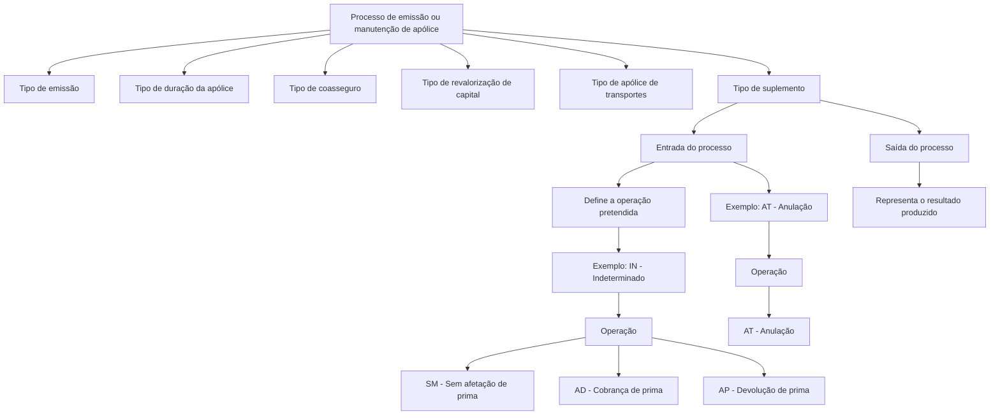
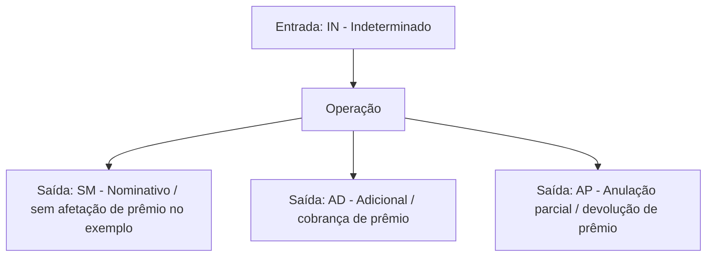

_Transient error (attempt 1/3): Post "https://axet.nttdata.com/api/llm-enabler/v3/ntt/v1/responses": read tcp 100.64.0.1:52319->150.171.110.36:443: read: connection reset by peer. Retrying…_

# Tipologias de Emissão, Apólices, Coasseguro, Revalorização e Suplementos — Documentação Reef

## 1. Metadados do Documento
- **Arquivo de Origem:** Não identificado no conteúdo extraído
- **Tipo de Documento:** Especificação Técnica
- **Domínio / Sistema:** Reef / Mapfre — emissão e administração de apólices
- **Público-Alvo:** Desenvolvedores, Arquitetos, Analistas Funcionais e Operação
- **Data/Versão Identificada:** Não identificada

---

## 2. Resumo Executivo & Contexto de Negócio

O documento apresenta catálogos de tipos utilizados no domínio de emissão e manutenção de apólices no contexto Reef/Mapfre. Os catálogos definem códigos e descrições para a participação de agentes, modalidades de anulação, coasseguro, duração da apólice, emissão, revalorização de capital, apólices de transportes e suplementos.

Os tipos documentados funcionam como valores de classificação e controle para processos de negócio de seguros. Por exemplo, os códigos de emissão determinam o movimento pretendido, enquanto os códigos de suplemento podem representar tanto a intenção de uma operação quanto o resultado gerado após o processamento da apólice.

A seção de suplementos detalha uma regra importante: nem todos os tipos podem ser utilizados indistintamente na entrada e na saída de processos. Alguns códigos são válidos nos dois momentos, outros apenas como entrada e outros apenas como saída. O documento ilustra essa distinção com os tipos genéricos `A`, `B` e `C`, bem como com os casos de anulação total (`AT`) e suplemento indeterminado (`IN`).

O conteúdo não especifica contratos de API, bancos de dados, interfaces de usuário, métodos HTTP, URLs de ambiente, tecnologias de implementação ou regras de persistência. A fonte citada na extração é “Documentation / DOCUMENTACIÓN Reef”, com indicação de proprietário `user:agonzalez_mapfre.com` e ciclo de vida `Approved Source`.

---

## 3. Arquitetura, Componentes & Tecnologias Envolvidas

### Sistemas, componentes e referências identificadas

| Componente / Termo | Papel identificado no documento | Observações |
| :--- | :--- | :--- |
| Reef | Sistema ou domínio documental associado aos catálogos de seguros. | O documento menciona “DOCUMENTACIÓN Reef”. |
| Mapfre | Contexto corporativo associado ao domínio de seguros e ao coasseguro. | O tipo de coasseguro é definido conforme a intervenção de MAPFRE. |
| Mapfredocument | Referência textual de documentação. | Não há detalhamento adicional. |
| Zeus | Item exibido na navegação documental. | Não há relação funcional descrita com Reef no conteúdo. |
| Agente | Entidade que pode intervir em uma apólice. | Possui classificações como produtor, organizador e assessor. |
| Apólice | Entidade central tratada pelos tipos de emissão, duração, coasseguro, revalorização e suplemento. | O documento não apresenta seu modelo de dados. |
| Suplemento | Operação ou resultado de modificação sobre uma apólice. | Possui regras de validade para entrada e saída de processos. |
| Risco | Elemento mencionado em anulação e extinção de risco. | Não há detalhamento adicional do modelo de risco. |
| Transportes | Tratamento específico para criação de tipos de apólice. | Inclui apólice fixa e apólice marco. |

### Fluxo conceitual de classificação de apólices e suplementos



> **Nota de Análise:** O diagrama representa exclusivamente as relações conceituais explicitadas pelo texto. O documento não detalha integrações técnicas, microsserviços, APIs, bancos de dados ou mecanismos de processamento.

---

## 4. Regras de Negócio, Especificações Funcionais & Processos

### 4.1 Participação de agentes em apólices

O tipo de intervenção de agente especifica de que forma um agente participa em uma apólice. Os tipos identificados são:

- `P`: Produtor.
- `O`: Organizador.
- `A`: Assessor.
- `2`: Segunda intervenção.
- `3`: Terceira intervenção.
- `4`: Quarta intervenção.

### 4.2 Anulação a escala

O tipo de anulação a escala determina a forma de cálculo do valor quando ocorre anulação de uma apólice ou de um risco.

- `1`: Direto sem percentual de anulação.
- `3`: Proporcional sem percentual de constituição.
- `2`: Proporcional sem percentual de anulação.

> **Nota de Análise:** O documento não define fórmulas, variáveis monetárias, bases de cálculo ou exemplos numéricos para os tipos de anulação a escala.

### 4.3 Coasseguro

O tipo de coasseguro identifica a condição do coasseguro de uma apólice de acordo com a forma de intervenção da MAPFRE.

- `0`: Exento.
- `1`: Cedido.
- `2`: Aceito.

### 4.4 Duração de apólice

O tipo de duração determina a duração aplicável à apólice.

- `1`: Anual prorrogável.
- `2`: Temporal não renovável.
- `4`: Temporal renovável por seu período.
- `5`: Temporal renovável por sua temporalidade.
- `6`: Temporal renovável.

### 4.5 Emissão

O tipo de emissão determina o movimento que se pretende realizar.

- `C`: Solicitação.
- `P`: Apólice.
- `S`: Suplemento.
- `R`: Apólice grupo.
- `Z`: Substituída.
- `A`: Aplicações.
- `U`: Suplemento aplicação.
- `D`: Declarações prévias.
- `X`: Substituída renovação.

### 4.6 Revalorização de capital

O tipo de revalorização de capital determina como a cobertura revalorizará, caso haja revalorização.

- `1`: Não regulariza.
- `2`: Especial.
- `3`: Por risco.

Quando o tipo de revalorização de capital for especial, o tipo de revalorização especial poderá ser:

- `0`: Não regulariza.
- `1`: Capital atual.
- `2`: Capital inicial.
- `3`: IPC.
- `4`: Outro índice.
- `5`: Objeto.

> **Nota de Análise:** O documento não define o significado expandido de `IPC`, a origem dos índices, periodicidade de cálculo, fórmulas de atualização ou critérios para seleção de “Outro índice”.

### 4.7 Apólices de transportes

Quando o tratamento for de transportes, o tipo de apólice determina a apólice que será criada.

- `F`: Apólice fixa.
- `C`: Apólice marco com prêmio em depósito.
- `S`: Apólice marco sem prêmio em depósito.

### 4.8 Suplementos: intenção de operação e resultado

O tipo de suplemento determina tanto a modificação pretendida para uma apólice quanto o resultado produzido por essa modificação.

O tipo de suplemento possui duas facetas:

1. **Entrada de um processo:** determina o que se pretende fazer com uma apólice, como renovar, anular ou reabilitar.
2. **Saída de um processo:** determina o que ocorreu efetivamente com a apólice, como devolução parcial de prêmio, anulação ou reabilitação.

Os tipos de suplemento possuem regras de validade entre entrada e saída:

| Tipo genérico | Válido na entrada | Válido na saída | Interpretação documentada |
| :--- | :--- | :--- | :--- |
| `A` | Sim | Sim | Tipo válido tanto para entrada quanto para saída. |
| `B` | Sim | Não | Tipo válido somente na entrada. |
| `C` | Não | Sim | Tipo válido somente na saída. |

#### Exemplo: anulação total

Um suplemento definido na entrada como anulação total (`AT`) produz também saída de anulação total (`AT`).


#### Exemplo: suplemento indeterminado

Um suplemento definido na entrada como indeterminado (`IN`) pode produzir resultados diferentes ao final da operação:

- `SM`: Não houve afetação de prêmio.
- `AD`: Houve cobrança de prêmio.
- `AP`: Houve devolução de prêmio.



> **Nota de Análise:** O texto associa `SM`, `AD` e `AP` aos resultados “No se afectó a la prima”, “Se cobró prima” e “Se devolvió prima”, respectivamente. Na tabela final, as descrições formais apresentadas são `SM NOMINATIVO`, `AD ADICIONAL` e `AP ANULACIÓN PARCIAL`. O documento não explica explicitamente essa diferença terminológica.

### 4.9 Catálogo de tipos de suplemento

| Código | Descrição |
| :--- | :--- |
| `IN` | Indeterminado |
| `AT` | Anulação |
| `RE` | Reabilitação |
| `CV` | Mudança de forma de pagamento |
| `CA` | Mudança de agente |
| `MV` | Extensão de vigência |
| `RF` | Renovação |
| `RG` | Regularização |
| `XX` | Emissão |
| `AN` | Antecipação |
| `CN` | Recobro de antecipação |
| `RS` | Resgate |
| `RD` | Redução |
| `RR` | Reabilitação de apólice reduzida |
| `AE` | Aportes extraordinários |
| `AS` | Anulação de suplemento |
| `ER` | Extinção do risco |
| `PG` | Seguro prorrogado (vida) |
| `DS` | Diminuição por sinistro |
| `LT` | Liquidação de transportes |
| `AP` | Anulação parcial |
| `RC` | Restituição de capital |
| `AD` | Adicional |
| `SA` | Suplemento de anualidade anterior |
| `AA` | Anulação de suplemento de anualidade anterior |
| `AX` | Anulação de suplemento temporal |
| `RP` | Resgate parcial |
| `SM` | Nominativo |

---

## 5. Tabelas de Parâmetros, Ambientes e Estruturas de Dados

### 5.1 Tipo de intervenção de agente

| Item / Parâmetro | Descrição / Função | Tipo / Valores / Formato | Ambiente / Observações |
| :--- | :--- | :--- | :--- |
| Tipo de intervenção de agente | Especifica como um agente intervém em uma apólice. | `P` — Produtor | Não especificado |
| Tipo de intervenção de agente | Especifica como um agente intervém em uma apólice. | `O` — Organizador | Não especificado |
| Tipo de intervenção de agente | Especifica como um agente intervém em uma apólice. | `A` — Assessor | Não especificado |
| Tipo de intervenção de agente | Especifica como um agente intervém em uma apólice. | `2` — Segunda intervenção | Não especificado |
| Tipo de intervenção de agente | Especifica como um agente intervém em uma apólice. | `3` — Terceira intervenção | Não especificado |
| Tipo de intervenção de agente | Especifica como um agente intervém em uma apólice. | `4` — Quarta intervenção | Não especificado |

### 5.2 Tipo de anulação a escala

| Item / Parâmetro | Descrição / Função | Tipo / Valores / Formato | Ambiente / Observações |
| :--- | :--- | :--- | :--- |
| Tipo de anulação a escala | Determina como é calculado o valor em caso de anulação da apólice ou risco. | `1` — Direto sem percentual de anulação | Fórmula não especificada |
| Tipo de anulação a escala | Determina como é calculado o valor em caso de anulação da apólice ou risco. | `3` — Proporcional sem percentual de constituição | Fórmula não especificada |
| Tipo de anulação a escala | Determina como é calculado o valor em caso de anulação da apólice ou risco. | `2` — Proporcional sem percentual de anulação | Fórmula não especificada |

### 5.3 Tipo de coasseguro

| Item / Parâmetro | Descrição / Função | Tipo / Valores / Formato | Ambiente / Observações |
| :--- | :--- | :--- | :--- |
| Tipo de coasseguro | Identifica a forma de coasseguro segundo a intervenção da MAPFRE. | `0` — Exento | Não especificado |
| Tipo de coasseguro | Identifica a forma de coasseguro segundo a intervenção da MAPFRE. | `1` — Cedido | Não especificado |
| Tipo de coasseguro | Identifica a forma de coasseguro segundo a intervenção da MAPFRE. | `2` — Aceito | O código aparece no início da página 2. |

### 5.4 Tipo de duração de apólice

| Item / Parâmetro | Descrição / Função | Tipo / Valores / Formato | Ambiente / Observações |
| :--- | :--- | :--- | :--- |
| Tipo de duração de apólice | Determina a duração da apólice. | `1` — Anual prorrogável | Não especificado |
| Tipo de duração de apólice | Determina a duração da apólice. | `2` — Temporal não renovável | Não especificado |
| Tipo de duração de apólice | Determina a duração da apólice. | `4` — Temporal renovável por seu período | Não especificado |
| Tipo de duração de apólice | Determina a duração da apólice. | `5` — Temporal renovável por sua temporalidade | Não especificado |
| Tipo de duração de apólice | Determina a duração da apólice. | `6` — Temporal renovável | Não especificado |

### 5.5 Tipo de emissão

| Item / Parâmetro | Descrição / Função | Tipo / Valores / Formato | Ambiente / Observações |
| :--- | :--- | :--- | :--- |
| Tipo de emissão | Determina o movimento a realizar. | `C` — Solicitação | Não especificado |
| Tipo de emissão | Determina o movimento a realizar. | `P` — Apólice | Não especificado |
| Tipo de emissão | Determina o movimento a realizar. | `S` — Suplemento | Não especificado |
| Tipo de emissão | Determina o movimento a realizar. | `R` — Apólice grupo | Não especificado |
| Tipo de emissão | Determina o movimento a realizar. | `Z` — Substituída | Não especificado |
| Tipo de emissão | Determina o movimento a realizar. | `A` — Aplicações | Não especificado |
| Tipo de emissão | Determina o movimento a realizar. | `U` — Suplemento aplicação | Não especificado |
| Tipo de emissão | Determina o movimento a realizar. | `D` — Declarações prévias | Não especificado |
| Tipo de emissão | Determina o movimento a realizar. | `X` — Substituída renovação | Não especificado |

### 5.6 Tipos de revalorização

| Item / Parâmetro | Descrição / Função | Tipo / Valores / Formato | Ambiente / Observações |
| :--- | :--- | :--- | :--- |
| Tipo de revalorização de capital | Define como a cobertura revaloriza, caso haja revalorização. | `1` — Não regulariza | Não especificado |
| Tipo de revalorização de capital | Define como a cobertura revaloriza, caso haja revalorização. | `2` — Especial | Pode utilizar um tipo de revalorização especial. |
| Tipo de revalorização de capital | Define como a cobertura revaloriza, caso haja revalorização. | `3` — Por risco | Não especificado |
| Tipo de revalorização especial | Define a modalidade de revalorização especial. | `0` — Não regulariza | Não especificado |
| Tipo de revalorização especial | Define a modalidade de revalorização especial. | `1` — Capital atual | Não especificado |
| Tipo de revalorização especial | Define a modalidade de revalorização especial. | `2` — Capital inicial | Não especificado |
| Tipo de revalorização especial | Define a modalidade de revalorização especial. | `3` — IPC | Sigla não expandida no documento. |
| Tipo de revalorização especial | Define a modalidade de revalorização especial. | `4` — Outro índice | Índice não especificado. |
| Tipo de revalorização especial | Define a modalidade de revalorização especial. | `5` — Objeto | Não especificado |

### 5.7 Tipo de apólice de transportes

| Item / Parâmetro | Descrição / Função | Tipo / Valores / Formato | Ambiente / Observações |
| :--- | :--- | :--- | :--- |
| Tipo de apólice de transportes | Determina a apólice criada em tratamento de transportes. | `F` — Apólice fixa | Não especificado |
| Tipo de apólice de transportes | Determina a apólice criada em tratamento de transportes. | `C` — Apólice marco com prêmio em depósito | Não especificado |
| Tipo de apólice de transportes | Determina a apólice criada em tratamento de transportes. | `S` — Apólice marco sem prêmio em depósito | Não especificado |

### 5.8 Fonte documental identificada

| Item / Parâmetro | Descrição / Função | Tipo / Valores / Formato | Ambiente / Observações |
| :--- | :--- | :--- | :--- |
| Fonte | Referência da documentação. | `Documentation / DOCUMENTACIÓN Reef` | Fonte aprovada conforme extração. |
| Owner | Proprietário indicado na navegação documental. | `user:agonzalez_mapfre.com` | Mantido como apresentado no conteúdo. |
| Lifecycle | Estado de ciclo de vida da documentação. | `Approved Source` | Não há definição complementar. |
| Navegação | Itens apresentados na interface documental. | Buscar, Inicio, Soluciones, Arquitecturas, APIs, Componentes, Cloud, Documentación, Zeus, Reef, Ayuda | Itens de navegação; não representam necessariamente componentes integrados. |
| Idioma | Idioma indicado na interface. | `ES` | O conteúdo primário está em espanhol. |

---

## 6. Bateria de Perguntas & Respostas para RAG (FAQ Sintético)

### P1: Qual código representa um agente produtor na participação de uma apólice?
**R:** O código `P` representa `PRODUCTOR`. O tipo de intervenção de agente especifica de que forma um agente participa em uma apólice.

### P2: Quais são os tipos de coasseguro documentados para a intervenção da MAPFRE?
**R:** O documento define três tipos de coasseguro: `0` para `EXENTO`, `1` para `CEDIDO` e `2` para `ACEPTADO`. A classificação identifica como é o coasseguro da apólice conforme a forma de intervenção da MAPFRE.

### P3: Qual é a diferença entre o tipo de duração temporal não renovável e temporal renovável?
**R:** O código `2` corresponde a `TEMPORAL NO RENOVABLE`. Os códigos `4`, `5` e `6` representam modalidades temporais renováveis: renovável por seu período, renovável por sua temporalidade e renovável, respectivamente. O documento não detalha critérios adicionais que diferenciem essas três modalidades renováveis.

### P4: Quais códigos de emissão podem ser utilizados para uma solicitação, uma apólice e um suplemento?
**R:** O tipo de emissão `C` representa `SOLICITUD`, o tipo `P` representa `PÓLIZA` e o tipo `S` representa `SUPLEMENTO`. O tipo de emissão determina o movimento que se pretende realizar.

### P5: Como o documento classifica a revalorização de capital?
**R:** O tipo de revalorização de capital possui os valores `1` para `NO REGULARIZA`, `2` para `ESPECIAL` e `3` para `POR RIESGO`. Quando a revalorização é especial, há classificações adicionais, incluindo capital atual, capital inicial, IPC, outro índice e objeto.

### P6: Quais tipos de revalorização especial estão disponíveis?
**R:** Os tipos de revalorização especial são: `0` não regulariza, `1` capital atual, `2` capital inicial, `3` IPC, `4` outro índice e `5` objeto. A documentação não especifica o significado expandido de IPC nem como os índices são calculados ou selecionados.

### P7: Quais tipos de apólice podem ser criados no tratamento de transportes?
**R:** Para transportes, o documento define `F` para apólice fixa, `C` para apólice marco com prêmio em depósito e `S` para apólice marco sem prêmio em depósito.

### P8: O que representa o tipo de suplemento em uma operação de apólice?
**R:** O tipo de suplemento possui duas facetas. Na entrada de um processo, indica a ação pretendida sobre a apólice, como renovar, anular ou reabilitar. Na saída, indica o resultado efetivamente produzido, como cobrança de prêmio, devolução de prêmio, anulação ou reabilitação.

### P9: Um tipo de suplemento pode ser válido apenas na entrada ou apenas na saída?
**R:** Sim. O documento informa que existem tipos válidos tanto na entrada quanto na saída, tipos válidos apenas na entrada e tipos válidos apenas na saída. No exemplo genérico, o tipo `A` é válido em ambos os momentos, `B` é válido somente na entrada e `C` é válido somente na saída.

### P10: Qual é o resultado de uma anulação total definida como suplemento AT?
**R:** O documento apresenta que um suplemento de entrada `AT`, correspondente a anulação total, também produz saída `AT`. Portanto, no exemplo fornecido, a operação preserva a classificação de anulação tanto na entrada quanto no resultado.

### P11: Quais resultados podem ser produzidos por um suplemento indeterminado IN?
**R:** Para uma entrada `IN` — indeterminado —, a operação pode gerar `SM` quando não há afetação de prêmio, `AD` quando há cobrança de prêmio ou `AP` quando há devolução de prêmio. A tabela final também associa os códigos `SM`, `AD` e `AP` a nominativo, adicional e anulação parcial, sem esclarecer a diferença terminológica.

### P12: O que significa o suplemento ER?
**R:** O código `ER` significa `EXTINCIÓN DEL RIESGO`, ou extinção do risco. O documento não descreve condições, validações ou consequências operacionais adicionais para esse tipo de suplemento.

### P13: Qual código representa mudança de agente em um suplemento?
**R:** O código `CA` representa `CAMBIO DE AGENTE`, isto é, mudança de agente.

### P14: Onde o documento identifica a fonte e o proprietário da documentação Reef?
**R:** A extração apresenta a referência `Documentation / DOCUMENTACIÓN Reef`, o proprietário `user:agonzalez_mapfre.com`, o ciclo de vida `Approved Source` e a indicação de idioma `ES`.

---

## 7. Glossário de Termos, Siglas & Conceitos-Chave

- **AD:** `ADICIONAL`; no exemplo de suplemento indeterminado, também é associado ao resultado “Se cobró prima”.
- **AE:** `APORTACIONES EXTRAORDINARIAS`.
- **AN:** `ANTICIPO`.
- **AP:** `ANULACIÓN PARCIAL`; no exemplo de suplemento indeterminado, também é associado ao resultado “Se devolvió prima”.
- **AS:** `ANULACIÓN DE SUPLEMENTO`.
- **AT:** `ANULACIÓN`.
- **CA:** `CAMBIO DE AGENTE`.
- **CN:** `RECOBRO DE ANTICIPO`.
- **Coasseguro:** Classificação da apólice segundo a forma de intervenção da MAPFRE.
- **CV:** `CAMBIO FORMA PAGO`.
- **DS:** `DISMINUCIÓN POR SINIESTRO`.
- **Emissão:** Movimento que se pretende realizar no processo de apólice.
- **ER:** `EXTINCIÓN DEL RIESGO`.
- **IN:** `INDETERMINADO`.
- **IPC:** Tipo de revalorização especial; o significado da sigla não é definido no documento.
- **LT:** `LIQUIDACIÓN DE TRANSPORTES`.
- **MAPFRE:** Entidade corporativa mencionada como referência para a intervenção no coasseguro.
- **MV:** `EXTENSIÓN VIGENCIA`.
- **PG:** `SEGURO PRORROGADO (VIDA)`.
- **RC:** `RESTITUCIÓN DE CAPITAL`.
- **RD:** `REDUCCIÓN`.
- **RE:** `REHABILITACIÓN`.
- **Reef:** Sistema ou domínio documental mencionado na fonte “DOCUMENTACIÓN Reef”.
- **RF:** `RENOVACIÓN`.
- **RG:** `REGULARIZACIÓN`.
- **RP:** `RESCATE PARCIAL`.
- **RR:** `REHABILITACIÓN PÓLIZA REDUCIDA`.
- **RS:** `RESCATE`.
- **SA:** `SUPLEMENTO ANUALIDAD ANTERIOR`.
- **SM:** `NOMINATIVO`; no exemplo de suplemento indeterminado, também é associado a “No se afectó a la prima”.
- **Suplemento:** Tipo que indica a modificação pretendida sobre uma apólice e/ou o resultado produzido após o processo.
- **Tipo de anulação a escala:** Classificação que determina a forma de cálculo do valor em caso de anulação de apólice ou risco.
- **Tipo de duração de apólice:** Classificação que define a duração e condição de renovação da apólice.
- **Tipo de emissão:** Classificação que define o movimento pretendido.
- **Tipo de revalorização de capital:** Classificação que define como a cobertura pode revalorizar.
- **XX:** `EMISIÓN`.

---

## 8. Notas Críticas, Riscos & Limitações

- O conteúdo é predominantemente um catálogo de códigos de negócio; não contém modelos de dados, contratos de integração, endpoints, payloads, esquemas JSON, tabelas de banco ou detalhes de implementação.
- Não foram identificados ambientes técnicos, URLs, portas, credenciais, caminhos de logs, pipelines de CI/CD ou versões de software.
- O documento não apresenta fórmulas para cálculo de anulação a escala, revalorização de capital ou efeitos financeiros sobre prêmios.
- A sigla `IPC` é citada como tipo de revalorização especial, mas não é expandida nem definida.
- O exemplo do suplemento `IN` associa `SM`, `AD` e `AP` a efeitos sobre o prêmio, enquanto a tabela final atribui as descrições `NOMINATIVO`, `ADICIONAL` e `ANULACIÓN PARCIAL`. A documentação não esclarece se as duas classificações coexistem ou se representam contextos diferentes.
- A presença de itens como “APIs”, “Cloud”, “Zeus” e “Componentes” ocorre na navegação documental extraída; não há evidência textual de integração, dependência ou arquitetura entre esses itens e Reef.
- O nome do arquivo de origem, a data e a versão do documento não foram fornecidos na extração.

---

## 9. Conteúdo Bruto Estruturado (Referência Fiel)

```text
--- [PÁGINA 1 DE 5] ---

TIPOS (EMISIÓN)
FORMA EN LA QUE INTERVIENE UN AGENTE
Especica de qué forma interviene un agente en la póliza
TIPO DESCRIPCIÓN
P PRODUCTOR
O ORGANIZADOR
A ASESOR
2 2DA INTERVENCIÓN
3 3RA INTERVENCIÓN
4 4TA INTERVENCIÓN
TIPO DE ANULACIÓN A ESCALA
Determina la forma en la que se halla el importe en caso de anulación de la póliza o riesgo
TIPO DESCRIPCIÓN
1 DIRECTO S/% ANULACION
3 PROPORCIONAL S/% CONSTITUCION
2 PROPORCIONAL S/% ANULACION
TIPO DE COASEGURO
Identica la como es el coaseguro de una póliza según la forma en la que interviene MAPFRE
TIPO DESCRIPCIÓN
0 EXENTO
1 CEDIDO
Documentation / DOCUMENTACIÓN Reef
DOCUMENTACIÓN Reef
Mapfredocument
DOCUMENTACIÓN Reef
Owner
user:agonzalez_mapfre.com
Lifecycle
Approved Source
 / 
 VL
Buscar Inicio Soluciones Arquitecturas APIs Componentes Cloud Documentación Zeus Reef Ayuda
ES


--- [PÁGINA 2 DE 5] ---

TIPO DESCRIPCIÓN
2 ACEPTADO
TIPO DE DURACIÓN DE PÓLIZA
Determina la duración de la póliza
TIPO DESCRIPCIÓN
1 ANUAL PRORROGABLE
2 TEMPORAL NO RENOVABLE
4 TEMPORAL RENOVABLE POR SU PERIODO
5 TEMPORAL RENOVABLE POR SU TEMPORALIDAD
6 TEMPORAL RENOVABLE
TIPO DE EMISIÓN
Determina el movimiento que se pretende realizar
TIPO DESCRIPCIÓN
C SOLICITUD
P PÓLIZA
S SUPLEMENTO
R PÓLIZA GRUPO
Z REMPLAZADA
A APLICACIONES
U SUPLEMENTO APLICACIÓN
D DECLARACIONES PREVIAS
X REEMPLAZADA RENOVACIÓN
TIPO DE REVALORIZACIÓN DE CAPITAL
Determina la forma en la que la cobertura revalorizará (si revaloriza)
TIPO DESCRIPCIÓN
1 NO REGULARIZA
2 ESPECIAL


--- [PÁGINA 3 DE 5] ---

TIPO DESCRIPCIÓN
3 POR RIESGO
TIPO DE REVALORIZACIÓN ESPECIAL
TIPO DESCRIPCIÓN
0 NO REGULARIZA
1 CAPITAL ACTUAL
2 CAPITAL INICIAL
3 IPC
4 OTRO INDICE
5 OBJETO
TIPO DE PÓLIZA DE TRANSPORTES
Determina el tipo de póliza que se creará cuando el tratamiento es de transportes
TIPO DESCRIPCIÓN
F PÓLIZA FIJA
C PÓLIZA MARCO CON PRIMA EN DEPOSITO
S PÓLIZA MARCO SIN PRIMA EN DEPOSITO
TIPO DE SUPLEMENTO
Determina que modicación se pretende realizar a una póliza y también que resultado produjo esa modicación. Es decir, tiene dos facetas:
1. En la entrada de un proceso, determina que se pretende hacer con una póliza, Por ejemplo, renovar, anular, rehabilitar, ...
2. En la salida de un proceso, determina que ocurrió con esa póliza. Por ejemplo, se devolvió parte de la prima, se anuló, se rehabilitó, ...
Por otro lado, existen tipos que son válidos tanto para la entrada como para la salida del proceso. Otros tipos son válidos para la entrada,
pero no para la salida del proceso. Y por último, hay tipos que no son válidos para la entrada y si para la salida del proceso. Esto es:
TIPO VÁLIDO ENTRADA VÁLIDO SALIDA
"A" SI SI
"B" SI NO
"C" NO SI
Por ejemplo, un suplemento denido de entrada como Anulación total (AT), la salida también es Anulación total (AT).
AT OPERACIÓN AT


--- [PÁGINA 4 DE 5] ---

En cambio, un suplemento que se dene de entrada como indeterminado (IN), cuando naliza la operación, los cambios efectuados pueden
generar salidas del tipo:
Se cobró prima (AD)
Se devolvió prima (AP)
No se afectó a la prima (SM)
IN OPERACIÓN
SM
AD
AP
A continuación se detallan los tipos denidos:
TIPO DESCRIPCIÓN
IN INDETERMINADO
AT ANULACIÓN
RE REHABILITACIÓN
CV CAMBIO FORMA PAGO
CA CAMBIO DE AGENTE
MV EXTENSIÓN VIGENCIA
RF RENOVACIÓN
RG REGULARIZACIÓN
XX EMISIÓN
AN ANTICIPO
CN RECOBRO DE ANTICIPO
RS RESCATE
RD REDUCCIÓN
RR REHABILITACIÓN PÓLIZA REDUCIDA
AE APORTACIONES EXTRAORDINARIAS
AS ANULACIÓN DE SUPLEMENTO
ER EXTINCIÓN DEL RIESGO
PG SEGURO PRORROGADO (VIDA)


--- [PÁGINA 5 DE 5] ---

TIPO DESCRIPCIÓN
DS DISMINUCIÓN POR SINIESTRO
LT LIQUIDACIÓN DE TRANSPORTES
AP ANULACIÓN PARCIAL
RC RESTITUCIÓN DE CAPITAL
AD ADICIONAL
SA SUPLEMENTO ANUALIDAD ANTERIOR
AA ANULACIÓN SUPLEMENTO ANUALIDAD ANTERIOR
AX ANULACIÓN SUPLEMENTO TEMPORAL
RP RESCATE PARCIAL
SM NOMINATIVO
Checking links...
```
