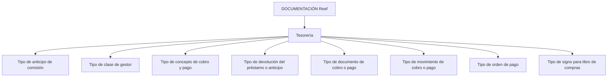

# Tipologias de Tesouraria, Cobrança e Pagamento — Documentação Reef

## 1. Metadados do Documento
- **Arquivo de Origem:** Não identificado — conteúdo bruto fornecido na solicitação
- **Tipo de Documento:** Especificação Técnica
- **Domínio / Sistema:** Reef — Tesorería / Cobros y Pagos
- **Público-Alvo:** Desenvolvedores, Arquitetos, Operação e Negócio
- **Data/Versão Identificada:** Não identificada

---

## 2. Resumo Executivo & Contexto de Negócio

O documento apresenta um catálogo de tipologias utilizadas no domínio de **Tesouraria**, especialmente para classificar operações de antecipação de comissão, empréstimos, gestores, conceitos, documentos, movimentos e ordens de pagamento.

As classificações definem critérios operacionais para distinguir operações de **cobro**, **pagamento**, ambos os contextos e domínios específicos, como sinistros, resseguro, cosseguro, agentes, vida e devolução de prémios.

O conteúdo também estabelece tipos relacionados à devolução de empréstimos ou antecipações de comissão. As modalidades identificadas são devolução por número de prestações, vencimento ou percentagem.

A documentação está publicada no contexto de **DOCUMENTACIÓN Reef / Mapfredocument**, com ciclo de vida indicado como **Approved**. Não há descrição de arquitetura de software, APIs, contratos JSON, endpoints, bases de dados ou fluxos executáveis.

---

## 3. Arquitetura, Componentes & Tecnologias Envolvidas

Os elementos identificados são classificações funcionais do domínio de Tesouraria. O documento não descreve componentes técnicos, microsserviços, integrações, ambientes, tecnologias, URLs operacionais ou mecanismos de persistência.



> **Nota de Análise:** O documento lista a navegação “Soluciones”, “Arquitecturas”, “APIs”, “Componentes”, “Cloud”, “Documentación”, “Zeus” e “Reef”, mas não descreve relações técnicas, serviços ou interfaces entre esses itens.

---

## 4. Regras de Negócio, Especificações Funcionais & Processos

### 4.1 Tipo de anticipo de comisión

O tipo de antecipação de comissão identifica a operação de antecipação que está a ser executada.

- Código `1`: **ANTICIPO**
- Código `2`: **PRESTAMO**
- Código `3`: **MONTOS**

### 4.2 Tipo de clase de gestor

O tipo de classe de gestor determina as atividades de terceiro com as quais o gestor será validado. A classificação também identifica quando um recibo passa ao processo de **impagos**.

As categorias previstas incluem agente, banco, cobrador, débito automático em conta, gestor direto, gestor piloto de cosseguro, oficina comercial, débito com cartão de crédito e gestor de impagos.

### 4.3 Tipo de concepto de cobro y pago

O tipo de conceito de cobrança e pagamento identifica a classificação à qual pertence um conceito de cobrança ou pagamento. Essa classificação determina o âmbito de uso do conceito.

Os âmbitos identificados são: sinistros, resseguro, cosseguro cedido, cosseguro aceito, cobranças e pagamentos vários, comissões de agentes, e conceitos de vida.

### 4.4 Tipo de devolución del préstamo o anticipo de comisión

O tipo de devolução identifica a forma pela qual um empréstimo ou uma antecipação de comissão será devolvido.

- Por número de prestações.
- Por vencimento.
- Por percentagem.

### 4.5 Tipo de documento de cobro o pago

O tipo de documento determina se um documento pode ser usado em operações de cobrança, em operações de pagamento ou em ambos os contextos.

- `C`: documento de cobrança.
- `P`: documento de pagamento.
- `A`: documento aplicável a cobrança e/ou pagamento.

### 4.6 Tipo de movimiento de cobro o pago

O tipo de movimento identifica se a operação representa uma cobrança ou um pagamento.

- `C`: cobrança.
- `P`: pagamento.

### 4.7 Tipo de orden de pago

O tipo de ordem de pagamento categoriza a origem ou domínio da ordem de pagamento em Tesouraria, Sinistros, Remessas de Resseguro, Remessas de Cosseguro, Comissões de Agentes, Devolução de Prémios ou Vida.

### 4.8 Tipo de signo para libro de compras

O tipo de sinal para livro de compras identifica se um documento é registado com sinal positivo ou negativo, considerando se o documento corresponde a um pagamento ou a uma cobrança.

> **Nota de Análise:** O documento associa os códigos `P` e `C` a pagamento e cobrança, respetivamente, mas não explicita qual dos dois representa sinal positivo ou negativo.

---

## 5. Tabelas de Parâmetros, Ambientes e Estruturas de Dados

| Item / Parâmetro | Descrição / Função | Tipo / Valores / Formato | Ambiente / Observações |
| :--- | :--- | :--- | :--- |
| Tipo de anticipo de comisión | Identifica a operação de antecipação de comissão executada | `1` = ANTICIPO; `2` = PRESTAMO; `3` = MONTOS | Tesorería |
| Tipo de clase de gestor | Determina atividades de terceiro para validação do gestor e identifica passagem de recibo para impagos | `1` = AGENTE; `2` = BANCO; `3` = COBRADOR; `4` = DEBITO AUTOMATICO EN CUENTA; `5` = GESTOR DIRECTO; `6` = GESTOR PILOTO COASEGURO; `7` = OFICINA COMERCIAL; `8` = DEBITO CON TARJETA DE CREDITO; `10` = GESTOR DE IMPAGOS | Tesorería |
| Tipo de concepto de cobro y pago | Classifica o conceito de cobrança ou pagamento e determina o respetivo âmbito de uso | `SI` = SINIESTROS; `RE` = REASEGURO; `CC` = COASEGURO CEDIDO; `CA` = COASEGURO ACEPTADO; `CP` = COBROS Y PAGOS VARIOS; `AC` = AGENTES COMISIONES; `VI` = CONCEPTOS VIDA | Cobros y Pagos |
| Tipo de devolución del préstamo o anticipo de comisión | Identifica a modalidade de devolução de empréstimo ou antecipação de comissão | `1` = POR NUMERO DE CUOTAS; `2` = VENCIMIENTO; `3` = PORCENTAJE | Tesorería |
| Tipo de documento de cobro o pago | Determina a utilização de um documento em operações de cobrança e/ou pagamento | `C` = COBRO; `P` = PAGO; `A` = AMBOS (COBRO Y/O PAGO) | Cobros y Pagos |
| Tipo de movimiento de cobro o pago | Identifica se uma operação é cobrança ou pagamento | `C` = COBRO; `P` = PAGO | Cobros y Pagos |
| Tipo de orden de pago | Classifica a ordem de pagamento por domínio operacional | `T` = TESORERIA; `S` = SINIESTROS; `R` = REMESAS DE REASEGURO; `C` = REMESAS DE COASEGURO; `A` = COMISIONES AGENTES; `D` = DEVOLUCION DE PRIMAS; `V` = VIDA | Tesorería |
| Tipo de signo para libro de compras | Identifica o sinal aplicável ao registo de documento no livro de compras | `P` = PAGO; `C` = COBRO | O sinal positivo ou negativo não é explicitado |

---

## 6. Bateria de Perguntas & Respostas para RAG (FAQ Sintético)

### P1: Quais operações podem ser identificadas pelo tipo de anticipo de comisión?
**R:** O tipo de anticipo de comisión identifica três operações: `1` para **ANTICIPO**, `2` para **PRESTAMO** e `3` para **MONTOS**.

### P2: Qual classificação de gestor é usada para identificar recibos que passam ao processo de impagos?
**R:** A classificação `10`, denominada **GESTOR DE IMPAGOS**, é a categoria de gestor explicitamente relacionada ao processo de impagos.

### P3: Qual é a finalidade do tipo de clase de gestor?
**R:** O tipo de clase de gestor determina as atividades de terceiro usadas para validar o gestor. Além disso, a classificação permite identificar quando um recibo passa ao processo de impagos.

### P4: Como classificar um conceito associado a resseguro?
**R:** Um conceito de cobrança ou pagamento associado a resseguro deve ser classificado com o código `RE`, correspondente a **REASEGURO**.

### P5: Qual código representa conceitos de cobranças e pagamentos diversos?
**R:** O código `CP` representa **COBROS Y PAGOS VARIOS** no tipo de concepto de cobro y pago.

### P6: Quais modalidades de devolução de empréstimo ou antecipação de comissão são previstas?
**R:** Existem três modalidades: `1` para devolução **POR NUMERO DE CUOTAS**, `2` para devolução por **VENCIMIENTO** e `3` para devolução por **PORCENTAJE**.

### P7: Como identificar se um documento pode ser usado tanto para cobrança quanto para pagamento?
**R:** O código `A` no tipo de documento de cobro o pago significa **AMBOS (COBRO Y/O PAGO)** e indica que o documento pode ser utilizado nos dois contextos.

### P8: Qual é a diferença entre tipo de documento e tipo de movimento de cobro o pago?
**R:** O tipo de documento determina se o documento pode ser utilizado para cobrança, pagamento ou ambos. O tipo de movimento identifica se a operação realizada é uma cobrança (`C`) ou um pagamento (`P`).

### P9: Qual código de ordem de pagamento deve ser utilizado para remessas de cosseguro?
**R:** O código `C` corresponde a **REMESAS DE COASEGURO** no tipo de orden de pago.

### P10: Quais são os códigos de ordem de pagamento para Tesouraria e Sinistros?
**R:** O código `T` corresponde a **TESORERIA** e o código `S` corresponde a **SINIESTROS**.

### P11: O documento define qual sinal é positivo ou negativo no libro de compras?
**R:** Não. O documento informa que o tipo de signo para libro de compras depende de pagamento (`P`) ou cobrança (`C`), mas não especifica explicitamente qual código produz sinal positivo ou sinal negativo.

---

## 7. Glossário de Termos, Siglas & Conceitos-Chave

- **Reef:** Nome presente na documentação e no contexto de “DOCUMENTACIÓN Reef”.
- **Tesorería:** Domínio de Tesouraria associado às classificações apresentadas.
- **Cobro:** Cobrança.
- **Pago:** Pagamento.
- **Anticipo:** Antecipação.
- **Prestamo:** Empréstimo.
- **Cuotas:** Prestações.
- **Vencimiento:** Vencimento.
- **Porcentaje:** Percentagem.
- **Gestor:** Entidade ou classe utilizada na validação de atividades de terceiro.
- **Impagos:** Processo mencionado para recibos classificados como relacionados a falta de pagamento.
- **Siniestros:** Sinistros.
- **Reaseguro:** Resseguro.
- **Coaseguro cedido:** Cosseguro cedido.
- **Coaseguro aceptado:** Cosseguro aceito.
- **Libro de compras:** Livro de compras.
- **SI:** Código para SINIESTROS.
- **RE:** Código para REASEGURO.
- **CC:** Código para COASEGURO CEDIDO.
- **CA:** Código para COASEGURO ACEPTADO.
- **CP:** Código para COBROS Y PAGOS VARIOS.
- **AC:** Código para AGENTES COMISIONES.
- **VI:** Código para CONCEPTOS VIDA.

---

## 8. Notas Críticas, Riscos & Limitações

- O documento não identifica nome de arquivo, data, versão ou autor técnico; apenas apresenta o utilizador `agonzalez_mapfre.com` como **Owner**.
- O ciclo de vida visível é **Approved**, mas não há informação sobre a data da aprovação.
- Não há descrição de APIs, métodos HTTP, contratos de dados, regras de persistência, integrações ou ambientes técnicos.
- O tipo de signo para libro de compras não esclarece qual código corresponde a sinal positivo ou negativo.
- O código `3` do tipo de anticipo de comisión é apresentado como **MONTOS**, sem detalhamento funcional adicional.
- O documento não detalha critérios de transição, validação ou tratamento operacional para recibos que entram no processo de impagos.

---

## 9. Conteúdo Bruto Estruturado (Referência Fiel)

```text
--- [PÁGINA 1 DE 3] ---

TIPOS (TESORERÍA)
TIPO DE ANTICIPO DE COMISIÓN
Identifica el tipo de operación de anticipo que se está ejecutando.
TIPO DESCRIPCIÓN
1 ANTICIPO
2 PRESTAMO
3 MONTOS
TIPO DE CLASE DE GESTOR
Determina las actividades de tercero con las que se validará el gestor, además de identificar cuando un recibo pasa al proceso de impagos.
TIPO DESCRIPCIÓN
1 AGENTE
2 BANCO
3 COBRADOR
4 DEBITO AUTOMATICO EN CUENTA
5 GESTOR DIRECTO
6 GESTOR PILOTO COASEGURO
7 OFICINA COMERCIAL
8 DEBITO CON TARJETA DE CREDITO
10 GESTOR DE IMPAGOS
TIPO DE CONCEPTO DE COBRO Y PAGO
Identifica la clasificación a la que pertenece el concepto de cobro y pago, esta clasificación determina el ámbito de uso del mismo.
Documentation / DOCUMENTACIÓN Reef
DOCUMENTACIÓN Reef
Mapfredocument
DOCUMENTACIÓN Reef
Owner
user:agonzalez_mapfre.com
Lifecycle
Approved Source
/
VL
Buscar Inicio Soluciones Arquitecturas APIs Componentes Cloud Documentación Zeus Reef Ayuda
ES

--- [PÁGINA 2 DE 3] ---

TIPO DESCRIPCIÓN
SI SINIESTROS
RE REASEGURO
CC COASEGURO CEDIDO
CA COASEGURO ACEPTADO
CP COBROS Y PAGOS VARIOS.
AC AGENTES COMISIONES
VI CONCEPTOS VIDA
TIPO DE DEVOLUCIÓN DEL PRÉSTAMO O ANTICIPO DE COMISIÓN
Identifica la forma en la que se va a devolver un préstamo o un anticipo de comisión.
TIPO DESCRIPCIÓN
1 POR NUMERO DE CUOTAS
2 VENCIMIENTO
3 PORCENTAJE
TIPO DE DOCUMENTO DE COBRO O PAGO
Determina si el documento se puede utilizar en operaciones de cobro o en operaciones de pago.
TIPO DESCRIPCIÓN
C COBRO
P PAGO
A AMBOS (COBRO Y/O PAGO)
TIPO DE MOVIMIENTO DE COBRO O PAGO
Identifica si la operación es un cobro o un pago.
TIPO DESCRIPCIÓN
C COBRO
P PAGO
TIPO DE ORDEN DE PAGO

--- [PÁGINA 3 DE 3] ---

TIPO DESCRIPCIÓN
T TESORERIA
S SINIESTROS
R REMESAS DE REASEGURO
C REMESAS DE COASEGURO
A COMISIONES AGENTES
D DEVOLUCION DE PRIMAS
V VIDA
TIPO DE SIGNO PARA LIBRO DE COMPRAS
Identifica si un documento se registra el libro de compras con signo positivo o negativo, atendiendo a que se trate de un pago o un cobro.
TIPO DESCRIPCIÓN
P PAGO
C COBRO
```
