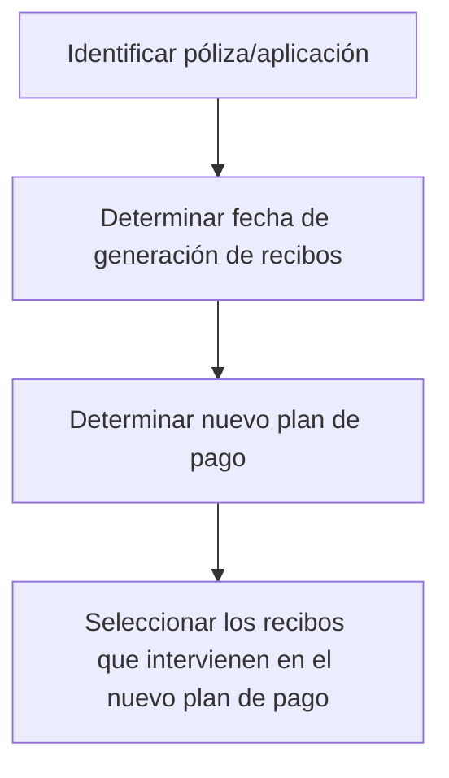
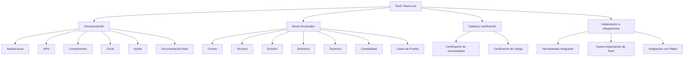

# Documentação e Elementos Funcionais do Reef.core — Dicionário, Emissão, Sinistros, Tesouraria, Contabilidade e Qualidade

## 1. Metadados do Documento
- **Arquivo de Origem:** Não identificado no conteúdo fornecido
- **Tipo de Documento:** Apresentação Executiva / Documentação de Referência
- **Domínio / Sistema:** Reef.core / Reef
- **Público-Alvo:** Desenvolvedores, Arquitetos, Operação, Negócio e equipes de documentação
- **Data/Versão Identificada:** Não identificada

---

## 2. Resumo Executivo & Contexto de Negócio

O conteúdo apresenta uma visão de navegação e documentação corporativa associada ao ecossistema **Reef** e **Reef.core**. A estrutura central organiza conhecimentos em domínios funcionais como Comum, Terceiros, Emissão, Sinistros, Tesouraria, Contabilidade e Casos de Prueba, além de referências a documentação, arquitetura, APIs, componentes, cloud e ajuda.

A documentação do Reef.core visa fornecer conhecimento sobre a arquitetura da plataforma, orientar o desenvolvimento, apresentar normas e regras de desenvolvimento, registrar projetos evolutivos e corretivos e apoiar a certificação de funcionalidade e código. O material também cita ferramentas integradas ao Reef.core e conteúdos necessários para realizar uma nova implantação de Reef.

No domínio de emissão, o documento apresenta um fluxo relacionado à alteração de plano de pagamento. O fluxo identifica a apólice ou aplicação, determina a data de geração de recibos, define um novo plano de pagamento e seleciona os recibos que participam do novo plano.

O conteúdo funcional mais detalhado está no nível **Común**, que agrupa definições não exclusivas do módulo de emissão, mas necessárias para configurar ou definir operações de emissão. Entre essas definições estão companhia, moeda, estrutura comercial, estrutura de produto, canal, quadro de comissão, agente, conceito econômico, documentos de entrada e saída, controle técnico e Platea.

O documento também contém elementos visuais e de interface, incluindo diagramas, listas ordenadas e não ordenadas, cartões com ícone, cartões com asterisco, botões e ícones de ação para criar, modificar, apagar, inabilitar e consulta. Não há detalhamento técnico sobre implementação, endpoints, contratos de integração, bancos de dados, ambientes, versões ou métodos HTTP.

---

## 3. Arquitetura, Componentes & Tecnologias Envolvidas

Os componentes e áreas citados no conteúdo são:

- **Reef:** Ecossistema de documentação e navegação corporativa.
- **Reef.core:** Plataforma citada como objeto de arquitetura, desenvolvimento, certificação, módulos, funcionalidade, integrações e implantação.
- **Zeus:** Item disponível na navegação principal, sem detalhamento adicional.
- **Mapfredocument:** Referência presente no conteúdo, sem descrição funcional adicional.
- **Platea:** Aplicação para a qual existe uma definição necessária à integração.
- **Documentación Reef:** Área ou referência repetida de documentação do Reef.
- **Reef.calidad.es:** Referência para certificação de funcionalidade e código de Reef.
- **Reef.core.es:** Referência para módulos e funcionalidades de Reef.core.
- **Reef.core.en:** Referência em inglês para módulos e funcionalidades de Reef.core.

### Áreas funcionais e documentais citadas

| Componente / Área | Descrição sustentada pelo conteúdo |
| :--- | :--- |
| Común | Contém definições necessárias à emissão que não são exclusivas do módulo de emissão. |
| Terceros | Área que inclui “Definición Proveedores”. |
| Emisión | Área que inclui termos de emissão, tipos de emissão, introdução, definição de ramo, definição de cobertura, emissão de apólice e alteração de plano de pagamento. |
| Siniestros | Área que inclui gerador de produtos, definição de autos, formação de tipos de expediente, causas-consequências de tipo de expediente, operações de autos, certificação de sinistros e introdução de sinistros. |
| Tesorería | Área com introdução, operações para criar antecipação de comissão e definição de conceito de cobrança/pagamento. |
| Contabilidad | Área com introdução à contabilidade. |
| Casos de Prueba | Área de casos de teste. |
| Documentación Reef | Referência de documentação do Reef. |
| Arquitecturas | Item de navegação relacionado a arquiteturas. |
| APIs | Item de navegação relacionado a APIs. |
| Componentes | Item de navegação relacionado a componentes. |
| Cloud | Item de navegação relacionado a cloud. |
| Zeus | Item de navegação, sem explicação adicional. |
| Ayuda | Item de navegação de ajuda. |

### Fluxo funcional de alteração de plano de pagamento



### Organização documental e funcional citada



> **Nota de Análise:** O conteúdo menciona arquitetura, APIs, componentes, cloud, ferramentas integradas e implantação de Reef, mas não descreve tecnologias, topologia de infraestrutura, protocolos, métodos HTTP, contratos JSON, URLs completas, ambientes ou mecanismos de autenticação.

---

## 4. Regras de Negócio, Especificações Funcionais & Processos

### 4.1 Processo de alteração de plano de pagamento

O documento descreve as seguintes etapas para alteração de plano de pagamento:

1. **Identificar póliza/aplicación:** identificar a apólice ou aplicação envolvida no processo.
2. **Determinar fecha de generación de recibos:** determinar a data de geração de recibos.
3. **Determinar nuevo plan de pago:** determinar o novo plano de pagamento.
4. **Seleccionar los recibos que intervienen en el nuevo plan de pago:** selecionar os recibos que participam do novo plano de pagamento.

> **Nota de Análise:** O conteúdo não especifica critérios de elegibilidade de recibos, regras de cálculo, efeitos financeiros, persistência da alteração, validações, responsáveis pela aprovação ou tratamento de exceções.

### 4.2 Definições comuns necessárias à emissão

O nível **Común** concentra definições que não são exclusivas do módulo de emissão, mas são necessárias para realizar a definição no contexto de emissão.

| Definição comum | Especificação funcional descrita |
| :--- | :--- |
| Compañía | Definição da entidade ou entidades com as quais serão criadas as apólices e, consequentemente, os demais elementos. |
| Moneda | Definição das divisas com as quais o Reef.core realizará as diferentes operações da companhia. |
| Estructura Comercial | Definição de como será estabelecida a organização territorial da companhia. |
| Estructura Producto | Definição de como estarão organizados os ramos comercializados. |
| Canal | Definição das diferentes vias pelas quais a nova produção chegará à companhia. |
| Cuadro Comisión | Definição dos agrupadores que determinam as comissões a pagar aos agentes. |
| Agente | Definição dos terceiros que atuarão como intermediários entre o cliente e a companhia. |
| Concepto Económico | Definição dos conceitos que farão parte da informação econômica do recibo. |
| Documentos de Entrada/Salida | Definição dos documentos que devem ser emitidos durante uma operação e dos documentos que devem ser solicitados durante uma operação. |
| Control Técnico | Definição dos parâmetros necessários para realizar validações que permitam ou não finalizar a operação. |
| Platea | Definição necessária para a integração com a aplicação Platea. |

### 4.3 Capacidades documentais do Reef.core

O conteúdo declara que a documentação permite:

- Encontrar informações relativas ao que sustenta Reef.
- Adquirir conhecimento sobre a arquitetura de Reef.core e sobre como desenvolver com Reef.core.
- Aprender como são documentados projetos, evolutivos, corretivos, software e outros conteúdos no Reef.
- Conhecer normas e regras sobre como desenvolver em Reef.core.
- Descobrir como obter certificação de funcionalidade e de código de Reef.
- Descobrir módulos de Reef.core e a funcionalidade oferecida por cada módulo.
- Consultar ferramentas com as quais Reef.core se integra ou que fornecem maior funcionalidade ao Reef.
- Encontrar o necessário para realizar uma nova implantação de Reef.

### 4.4 Áreas funcionais citadas sem detalhamento suficiente

| Área | Conteúdo listado |
| :--- | :--- |
| Terceros | Definición Proveedores. |
| Emisión | Términos emisión, Tipos emisión, Introducción, Definición ramo, Definir cobertura, Emitir póliza, Alterar plan pago. |
| Siniestros | Generador productos, Definición autos, Formación definición de tipos de expediente, Formación definición de causas-consecuencias tipo de expediente, Operaciones autos, Certificación siniestros, Introducción siniestros. |
| Tesorería | Introducción Tesorería, Operación-crear-anticipo-comision, Crear-anticipo-comision, Definicion-Tesoreria-concepto-cobro-pago. |
| Contabilidad | Introducción Contabilidad. |
| Casos de Prueba | Casos de prueba. |

> **Nota de Análise:** O documento apresenta os títulos dessas áreas e conteúdos, mas não detalha suas regras de negócio, estruturas de dados, pré-condições, pós-condições, exceções, responsáveis ou interfaces técnicas.

---

## 5. Tabelas de Parâmetros, Ambientes e Estruturas de Dados

### 5.1 Parâmetros e entidades funcionais identificados

| Item / Parâmetro | Descrição / Função | Tipo / Valores / Formato | Ambiente / Observações |
| :--- | :--- | :--- | :--- |
| Póliza / Aplicación | Elemento inicial a ser identificado no fluxo de alteração de plano de pagamento. | Não especificado. | Associado ao processo de alteração de plano de pagamento. |
| Fecha de generación de recibos | Data que deve ser determinada no fluxo de alteração de plano de pagamento. | Data; formato não especificado. | Associada aos recibos do plano de pagamento. |
| Nuevo plan de pago | Plano de pagamento a ser determinado no processo. | Não especificado. | Associado à alteração de plano de pagamento. |
| Recibos | Recibos que devem ser selecionados para participação no novo plano de pagamento. | Não especificado. | Associados à apólice ou aplicação identificada. |
| Compañía | Entidade ou entidades com as quais serão criadas apólices e outros elementos. | Entidade corporativa; formato não especificado. | Definição comum necessária à emissão. |
| Moneda | Divisas utilizadas pelo Reef.core nas operações da companhia. | Moeda/divisa; valores não especificados. | Definição comum necessária à emissão. |
| Estructura Comercial | Organização territorial da companhia. | Estrutura organizacional; formato não especificado. | Definição comum necessária à emissão. |
| Estructura Producto | Organização dos ramos comercializados. | Estrutura de produto; formato não especificado. | Definição comum necessária à emissão. |
| Canal | Via pela qual a nova produção chega à companhia. | Canal; valores não especificados. | Definição comum necessária à emissão. |
| Cuadro Comisión | Agrupadores que determinam comissões a pagar aos agentes. | Agrupadores; regras de cálculo não especificadas. | Definição comum necessária à emissão. |
| Agente | Terceiro que atua como intermediário entre cliente e companhia. | Terceiro/intermediário; formato não especificado. | Definição comum necessária à emissão. |
| Concepto Económico | Conceito integrante da informação econômica de um recibo. | Conceito econômico; valores não especificados. | Definição comum necessária à emissão. |
| Documentos de Entrada/Salida | Documentos a emitir ou solicitar durante uma operação. | Documento; formato não especificado. | Definição comum necessária à emissão. |
| Control Técnico | Parâmetros usados em validações que permitem ou impedem a finalização de uma operação. | Parâmetro de validação; regras não especificadas. | Definição comum necessária à emissão. |
| Platea | Elemento de definição necessário para integração com a aplicação Platea. | Integração; contrato não especificado. | Definição comum necessária à emissão. |

### 5.2 Referências de navegação e documentação

| Item / Parâmetro | Descrição / Função | Tipo / Valores / Formato | Ambiente / Observações |
| :--- | :--- | :--- | :--- |
| Reef.calidad.es | Referência para certificação de funcionalidade e código de Reef. | Referência textual/link; URL completa não fornecida. | O conteúdo apresenta a identificação entre colchetes. |
| Reef.core.es | Referência para módulos de Reef.core e funcionalidades de cada módulo. | Referência textual/link; URL completa não fornecida. | Idioma espanhol indicado pelo sufixo `.es`. |
| Reef.core.en | Referência em inglês para módulos e funcionalidades de Reef.core. | Referência textual/link; URL completa não fornecida. | Idioma inglês indicado pelo sufixo `.en`. |
| Buscar | Item de navegação. | Função de busca; comportamento não especificado. | Barra de navegação. |
| Inicio | Item de navegação. | Página inicial; comportamento não especificado. | Barra de navegação. |
| Soluciones | Item de navegação. | Seção; conteúdo não especificado. | Barra de navegação. |
| Arquitecturas | Item de navegação. | Seção; conteúdo não especificado. | Barra de navegação. |
| APIs | Item de navegação. | Seção; conteúdo não especificado. | Barra de navegação. |
| Componentes | Item de navegação. | Seção; conteúdo não especificado. | Barra de navegação. |
| Cloud | Item de navegação. | Seção; conteúdo não especificado. | Barra de navegação. |
| Documentación | Item de navegação. | Seção; conteúdo não especificado. | Barra de navegação. |
| Zeus | Item de navegação. | Seção ou sistema; conteúdo não especificado. | Barra de navegação. |
| Reef | Item de navegação. | Seção ou sistema; conteúdo não especificado. | Barra de navegação. |
| Ayuda | Item de navegação. | Ajuda; conteúdo não especificado. | Barra de navegação. |
| ES | Indicador de idioma. | Espanhol. | Barra de navegação. |

### 5.3 Ações de interface identificadas

| Item / Parâmetro | Descrição / Função | Tipo / Valores / Formato | Ambiente / Observações |
| :--- | :--- | :--- | :--- |
| CREAR | Ação de criar. | Ícone; representação gráfica não extraída. | Seção de ícones. |
| MODIFICAR | Ação de modificar. | Ícone; representação gráfica não extraída. | Seção de ícones. |
| BORRAR | Ação de apagar. | Ícone; representação gráfica não extraída. | Seção de ícones. |
| INHABILITAR | Ação de inabilitar. | Ícone; representação gráfica não extraída. | Seção de ícones. |
| TIENE CONSULTA | Indicação de que existe consulta. | Ícone; representação gráfica não extraída. | Seção de ícones. |
| BOTÓN SIN IMAGEN | Botão sem imagem. | Componente de interface. | O texto exibido é “Texto del botón”. |
| BOTÓN CON IMAGEN | Botão com imagem. | Componente de interface. | Conteúdo adicional não especificado. |
| DESARROLLO | Texto associado a elemento visual. | Não especificado. | Apresentado próximo aos botões e ícones. |

---

## 6. Bateria de Perguntas & Respostas para RAG (FAQ Sintético)

### P1: Qual é o objetivo da documentação do Reef.core apresentada no documento?
**R:** A documentação apresentada busca disponibilizar informações sobre o que sustenta Reef, a arquitetura de Reef.core, o desenvolvimento com Reef.core, as normas e regras de desenvolvimento, a documentação de projetos evolutivos, corretivos e de software, a certificação de funcionalidade e código, os módulos de Reef.core, suas integrações e os requisitos para uma nova implantação de Reef.

### P2: Quais são as etapas do fluxo de alteração de plano de pagamento?
**R:** O fluxo contém quatro etapas: identificar a apólice ou aplicação, determinar a data de geração de recibos, determinar o novo plano de pagamento e selecionar os recibos que participam do novo plano de pagamento.

### P3: O que representa a definição de Compañía no nível Común?
**R:** Compañía é a definição da entidade ou das entidades com as quais serão criadas as apólices e, consequentemente, os demais elementos relacionados. O documento apresenta Compañía como uma definição comum necessária ao contexto de emissão.

### P4: Para que serve a definição de Moneda no Reef.core?
**R:** Moneda define as divisas com as quais o Reef.core realizará as diferentes operações da companhia. O documento não informa uma lista de moedas, formatos de código, regras de conversão ou critérios de cotação.

### P5: Como o documento define Estructura Comercial?
**R:** Estructura Comercial é a definição de como será estabelecida a organização territorial da companhia. Não há detalhamento sobre níveis hierárquicos, regiões, regras de associação ou persistência dessa estrutura.

### P6: Qual é a função do Cuadro Comisión?
**R:** Cuadro Comisión define os agrupadores que determinam as comissões que serão pagas aos agentes. O documento não descreve fórmulas de cálculo, percentuais, periodicidade, condições de pagamento ou critérios de elegibilidade.

### P7: Quem é considerado Agente no conteúdo apresentado?
**R:** Agente corresponde aos terceiros que atuarão como intermediários entre o cliente e a companhia. O documento não especifica tipos de agente, requisitos de cadastro, permissões ou responsabilidades operacionais.

### P8: O que são Documentos de Entrada/Salida?
**R:** Documentos de Entrada/Salida são os documentos que devem ser emitidos quando uma operação é realizada e os documentos que devem ser solicitados quando uma operação é realizada. O documento não lista tipos documentais, formatos, canais de emissão ou regras de obrigatoriedade.

### P9: Como o Control Técnico influencia a finalização de uma operação?
**R:** Control Técnico define os parâmetros necessários para realizar validações que permitem ou não finalizar a operação. O conteúdo não identifica os parâmetros concretos, mensagens de erro, severidades, responsáveis pelas validações ou mecanismos técnicos de execução.

### P10: Qual é o papel de Platea no documento?
**R:** Platea é uma aplicação para a qual é necessária uma definição voltada à integração. O documento não apresenta o protocolo de integração, interfaces, dados trocados, endpoints, autenticação ou dependências técnicas.

### P11: Quais áreas funcionais são citadas além de Emisión?
**R:** Além de Emisión, o documento cita Común, Terceros, Siniestros, Tesorería, Contabilidad e Casos de Prueba. Também apresenta referências de navegação para Arquiteturas, APIs, Componentes, Cloud, Documentación, Zeus, Reef e Ayuda.

### P12: O documento detalha APIs, métodos HTTP ou contratos JSON do Reef.core?
**R:** Não. Embora a navegação inclua a seção “APIs”, o conteúdo fornecido não detalha endpoints, métodos HTTP, payloads JSON, contratos de integração, esquemas de autenticação, códigos de resposta ou versões de API.

---

## 7. Glossário de Termos, Siglas & Conceitos-Chave

- **Reef:** Ecossistema ou sistema citado como objeto de documentação, certificação, integrações e implantação.
- **Reef.core:** Plataforma citada em relação à arquitetura, desenvolvimento, módulos, funcionalidades, normas, certificação e integrações.
- **Común:** Nível que contém definições necessárias para emissão, mas não exclusivas do módulo de emissão.
- **Terceros:** Área funcional citada que inclui definição de provedores.
- **Emisión:** Área funcional relacionada a termos de emissão, tipos de emissão, ramos, coberturas, emissão de apólice e alteração de plano de pagamento.
- **Siniestros:** Área funcional relacionada a produtos, autos, expedientes, causas-consequências, operações e certificação de sinistros.
- **Tesorería:** Área funcional relacionada à tesouraria, antecipação de comissão e conceito de cobrança/pagamento.
- **Contabilidad:** Área funcional relacionada à contabilidade.
- **Póliza:** Apólice identificada como possível elemento inicial do fluxo de alteração de plano de pagamento.
- **Aplicación:** Aplicação identificada como possível elemento inicial do fluxo de alteração de plano de pagamento.
- **Recibos:** Recibos selecionados para participar de um novo plano de pagamento.
- **Plan de pago:** Plano de pagamento definido no fluxo apresentado.
- **Compañía:** Entidade ou entidades com as quais são criadas apólices e demais elementos.
- **Moneda:** Divisa utilizada pelo Reef.core nas operações da companhia.
- **Estructura Comercial:** Organização territorial da companhia.
- **Estructura Producto:** Organização dos ramos comercializados.
- **Canal:** Via pela qual nova produção chega à companhia.
- **Cuadro Comisión:** Agrupadores que determinam comissões a pagar aos agentes.
- **Agente:** Terceiro intermediário entre o cliente e a companhia.
- **Concepto Económico:** Conceito que compõe a informação econômica de um recibo.
- **Control Técnico:** Conjunto de parâmetros para validações que podem permitir ou impedir a finalização de uma operação.
- **Platea:** Aplicação citada como alvo de uma integração.
- **Zeus:** Item de navegação, sem definição adicional no conteúdo.
- **APIs:** Item de navegação relacionado a interfaces de programação, sem detalhes técnicos no conteúdo.
- **Cloud:** Item de navegação relacionado a cloud, sem detalhes técnicos no conteúdo.

---

## 8. Notas Críticas, Riscos & Limitações

- O nome do arquivo de origem, data, versão, autor e contexto de aprovação não foram identificados no conteúdo fornecido.
- O documento contém uma estrutura de apresentação e navegação, mas não fornece especificações técnicas completas de arquitetura, infraestrutura, tecnologias, bancos de dados, mensageria, protocolos, URLs completas, portas, ambientes ou credenciais.
- As referências `Reef.calidad.es`, `Reef.core.es` e `Reef.core.en` aparecem como identificadores de links, mas o conteúdo não fornece URLs completas nem permite confirmar a acessibilidade dos destinos.
- O processo de alteração de plano de pagamento apresenta apenas quatro passos de alto nível. Não há definição de regras de elegibilidade, cálculos, aprovações, transações, exceções, auditoria ou reversão.
- As áreas Terceros, Emisión, Siniestros, Tesorería, Contabilidad e Casos de Prueba são majoritariamente listadas por título, sem detalhamento suficiente para implementação ou operação autônoma.
- O termo **Reef** e a designação **Reef.core** são usados no conteúdo, mas não há expansão formal de siglas ou definição corporativa oficial.
- O texto extraído possui caracteres corrompidos, como `Denición`, `certicación` e `nalizar`. A interpretação foi preservada somente quando o termo permanece semanticamente reconhecível no próprio contexto.
- Os ícones de criar, modificar, apagar, inabilitar e consulta são citados sem representação gráfica recuperável e sem definição de permissões, estados ou efeitos de cada ação.
- O conteúdo inclui textos em espanhol e inglês; não há indicação de que as versões sejam semanticamente equivalentes, controladas por versão ou destinadas a públicos distintos.

---

## 9. Conteúdo Bruto Estruturado (Referência Fiel)

```text
--- [PÁGINA 1 DE 4] ---

DICCIONARIO
DICCIONARIO
COMÚN
Compensación  Comunes old
TERCEROS
Denición Proveedores
EMISIÓN
Términos emisión  Tipos emisión  Introducción
DEFINICIÓN ramo  DEFINIR cobertura
EMITIR Póliza  ALTERAR plan pago
SINIESTROS
GENERADOR PRODUCTOS  DEFINICIÓN AUTOS
FORMACIÓN DEFINICIÓN DE TIPOS DE EXPEDIENTE
FORMACIÓN DEFINICIÓN DE CAUSAS-CONSECUENCIAS TIPO DE EXPEDIENTE  OPERACIONES AUTOS
CERTIFICACIÓN SINIESTROS  INTRODUCCIÓN SINIESTROS
TESORERÍA
Introducción Tesorería  OPERACION-CREAR-anticipo-comision  CREAR-anticipo-comision
DEFINICION-Tesoreria-concepto-cobro-pago
CONTABILIDAD
Introducción Contabilidad
CASOS DE PRUEBA
Documentation / DOCUMENTACIÓN Reef
DOCUMENTACIÓN Reef
Mapfredocument
DOCUMENTACIÓN Reef
Owner
user:agonzalez_mapfre.com
Lifecycle
Approved Source
 / 
 VL
Buscar Inicio Soluciones Arquitecturas APIs Componentes Cloud Documentación Zeus Reef Ayuda
ES


--- [PÁGINA 2 DE 4] ---

DIAGRAMA
Identificar
póliza/aplicación
Determinar fecha de
generación de recibos
Determinar nuevo
plan de pago
Seleccionar los
recibos que intervienen
en el nuevo plan de pago
DIAGRAMA CON RELLENO
RIESGO
VIGENCIA TERCEROS ATRIBUTOS COBERTURAS
LISTAS
ORDENADAS
1. Primer elemento
2. Segundo elemento
3. Tercer elemento
SIN ORDEN
Primer elemento
Segundo elemento
Tercer elemento
TARJETAS (CON ICONO)
Aquí podrás encontrar toda la información
relativa a aquello que sustenta a Reef
Here you can nd all the information
related to what supports Reef
Encuentra la documentación que permite
adquirir conocimientos sobre la
arquitectura de Reef.core y como
desarrollar con ella
Find the documentation that allows you to
acquire knowledge about the Reef.core
architecture and how to develop with it
Aprende como se documentan los
proyectos, evolutivos, correctivos,
software y mucho más en Reef
Learn how projects are documented,
evolutionary, corrective, software and
much more in Reef
Conoce las normas, reglas, de como
desarrollar en Reef.core
Know the norms, rules, how to develop in
Reef.core
[Descubre como se consigue la
certicación tanto de la funcionalidad
como del código de Reef][Reef.calidad.es]
[
  Accede][Reef.calidad.es]
[Descubre todos los módulos de Reef.core
y la funcionalidad que ofrece cada uno de
ellos][Reef.core.es]
[
  Accede][Reef.core.es]


--- [PÁGINA 3 DE 4] ---

Find out how to get certied for both the
functionality and the Reef code
[Discover the Reef.core modules and the
functionality each of them offers]
[Reef.core.en]
[
  Access][Reef.core.en]
Comprueba aquellas herramientas con las
que Reef.core se integra y/o aportan
mayor funcionalidad a Reef
Check those tools with which Reef.core
integrates and/or provide greater
functionality to Reef
Encuentra todo lo necesario para realizar
una nueva implantación de Reef
Find everything you need to carry out a
new Reef implementation
TARJETAS CON ASTERISCO
COMÚN
En este nivel se encuentran deniciones que no son exclusivas del módulo de emisión, pero son necesarias
para poder realizar la denición. Entre otras deniciones se encuentra:
COMPAÑÍA 
Denición de la entidad o entidades con
las que se van a crear las pólizas y por
consiguiente el resto de elementos
MONEDA 
Denición de las divisas con las que
Reef.core va a realizar las distintas
operaciones de la compañía
ESTRUCTURA COMERCIAL 
Denición de como se va a establecer la
organización territorial de la compañía
ESTRUCTURA PRODUCTO 
Denición de como estarán organizados
los ramos que se comercializan
CANAL 
Denición de las distintas vías por las que
llegará la nueva producción a la compañía
CUADRO COMISIÓN 
Denición de los agrupadores que
determinan las comisiones que se van a
pagar a los agentes
AGENTE 
Denición de los terceros que ejercerán de
intermediarios entre el cliente y la
compañía
CONCEPTO ECONÓMICO 
Denición de los conceptos que formarán
parte de la información económica del
recibo
DOCUMENTOS DE ENTRADA/SALIDA 
Denición de los documentos que deben
salir cuando se realiza una operación y de
los documentos que son necesarios
solicitar cuando se realiza una operación
CONTROL TÉCNICO 
Denición de los parámetros necesarios
para realizar validaciones que permitan o
no nalizar la operación
PLATEA 
Denición necesaria para la integración
con esta aplicación
BOTÓN SIN IMAGEN


--- [PÁGINA 4 DE 4] ---

Texto del botón
BOTÓN CON IMAGEN
 DESARROLLO
ICONOS
 CREAR ( )
 MODIFICAR ( )
 BORRAR ( )
 INHABILITAR ( )
 TIENE CONSULTA ( )
```
