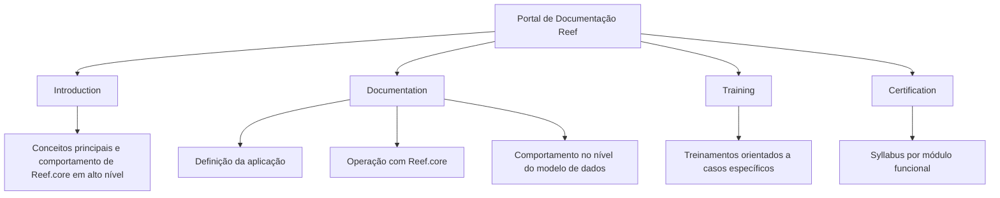

# Documentação Reef.core — Portal de Conhecimento, Treinamento e Certificação

## 1. Metadados do Documento
- **Arquivo de Origem:** Não identificado no conteúdo fornecido
- **Tipo de Documento:** Manual Operacional / Portal de Documentação
- **Domínio / Sistema:** Reef.core / Reef
- **Público-Alvo:** Perfis funcionais e técnicos interessados em compreender, definir, operar, treinar ou certificar-se em Reef.core
- **Data/Versão Identificada:** Não identificada

---

## 2. Resumo Executivo & Contexto de Negócio

O conteúdo descreve uma área de conhecimento relacionada a **Reef.core**, organizada para apoiar a aquisição de conhecimento funcional e técnico sobre a aplicação. A área também inclui cursos relacionados à definição e à operação com Reef.core.

A documentação é estruturada em quatro perspectivas: **Introduction**, **Documentation**, **Training** e **Certification**. Essa organização separa materiais de visão geral, documentação de definição e operação, conteúdos de treinamento para casos específicos e programas de certificação por módulo funcional.

A perspectiva **Introduction** tem como propósito apresentar os conceitos principais da aplicação e permitir a compreensão do comportamento de Reef.core em alto nível. A perspectiva **Documentation** aprofunda o entendimento sobre definição, operação e comportamento da aplicação no nível do modelo de dados.

A perspectiva **Training** disponibiliza elementos de capacitação orientados a casos específicos. A perspectiva **Certification** concentra os programas das diferentes certificações, divididos por módulo funcional.

O portal também apresenta elementos de navegação para soluções, arquiteturas, APIs, componentes, Cloud, documentação, Zeus, Reef e ajuda. O conteúdo fornecido não detalha contratos técnicos, APIs, modelos de dados, fluxos operacionais específicos ou critérios das certificações.

---

## 3. Arquitetura, Componentes & Tecnologias Envolvidas

Os elementos identificados no conteúdo são:

| Componente / Elemento | Papel identificado no documento |
| :--- | :--- |
| Reef.core | Aplicação para a qual são disponibilizados conteúdos funcionais, técnicos, operacionais, de treinamento e certificação. |
| Introduction | Perspectiva destinada aos conceitos principais e ao comportamento de Reef.core em alto nível. |
| Documentation | Perspectiva destinada à definição, operação e compreensão do comportamento de Reef.core no nível do modelo de dados. |
| Training | Perspectiva com elementos de treinamento orientados a casos específicos. |
| Certification | Perspectiva com syllabus de níveis de certificação divididos por módulo funcional. |
| Soluciones | Item de navegação do portal. |
| Arquitecturas | Item de navegação do portal. |
| APIs | Item de navegação do portal. |
| Componentes | Item de navegação do portal. |
| Cloud | Item de navegação do portal. |
| Documentación | Item de navegação do portal. |
| Zeus | Item de navegação do portal. |
| Reef | Item de navegação do portal. |
| Ayuda | Item de navegação do portal. |



> *Nota de Análise: O conteúdo não apresenta uma arquitetura técnica de software, integrações, servidores, microsserviços, protocolos, métodos HTTP, contratos JSON, URLs de ambiente ou tecnologias de implementação.*

---

## 4. Regras de Negócio, Especificações Funcionais & Processos

### Organização do conhecimento sobre Reef.core

1. A documentação disponibilizada permite adquirir conhecimento funcional e técnico sobre Reef.core.
2. A área inclui cursos relacionados à definição e à operação com Reef.core.
3. As informações são organizadas em quatro perspectivas: Introduction, Documentation, Training e Certification.

### Perspectiva Introduction

1. A perspectiva Introduction reúne documentos para compreender os conceitos principais da aplicação.
2. A perspectiva Introduction permite conhecer o comportamento de Reef.core em alto nível.

### Perspectiva Documentation

1. A perspectiva Documentation reúne documentos que ajudam a definir a aplicação.
2. A perspectiva Documentation reúne documentos que ajudam a operar com a aplicação.
3. A perspectiva Documentation permite compreender o comportamento de Reef.core no nível do modelo de dados.
4. A perspectiva Documentation é apresentada como um local em que diferentes perfis podem compreender como Reef.core funciona.

### Perspectiva Training

1. A perspectiva Training reúne diferentes elementos de treinamento.
2. Os elementos de treinamento são orientados a casos específicos.
3. O objetivo dos treinamentos é permitir a aquisição de conhecimento funcional e técnico do sistema.

### Perspectiva Certification

1. A perspectiva Certification disponibiliza o syllabus dos diferentes níveis de certificação.
2. Os níveis de certificação são divididos por módulo funcional.

> *Nota de Análise: O conteúdo não especifica regras de cálculo, condições de validação, etapas transacionais, papéis de acesso, matrizes de permissão ou procedimentos operacionais detalhados.*

---

## 5. Tabelas de Parâmetros, Ambientes e Estruturas de Dados

| Item / Parâmetro | Descrição / Função | Tipo / Valores / Formato | Ambiente / Observações |
| :--- | :--- | :--- | :--- |
| Sistema | Aplicação coberta pelos conteúdos de documentação, treinamento e certificação. | Reef.core | Não informado |
| Perspectiva de conhecimento | Categorias de organização das informações do portal. | Introduction; Documentation; Training; Certification | Não informado |
| Introduction | Apresenta conceitos principais e comportamento da aplicação em alto nível. | Seção documental | Não informado |
| Documentation | Apoia a definição, operação e compreensão do modelo de dados da aplicação. | Seção documental | Não informado |
| Training | Disponibiliza treinamentos para casos específicos. | Seção de treinamento | Não informado |
| Certification | Disponibiliza syllabus de certificações por módulo funcional. | Seção de certificação | Não informado |
| Owner | Proprietário exibido no registro de documentação. | `user:agonzalez_mapfre.com` | Exibido como “Owner” |
| Lifecycle | Estado de ciclo de vida do conteúdo. | `Approved` | Exibido como “Lifecycle” |
| Source | Identificador de origem exibido no portal. | `VL` | Exibido como “Source” |
| Idioma de navegação | Idioma exibido no portal. | `ES` | Interface apresenta termos em espanhol e conteúdo em inglês |
| Navegação do portal | Categorias de acesso exibidas. | Buscar, Inicio, Soluciones, Arquitecturas, APIs, Componentes, Cloud, Documentación, Zeus, Reef, Ayuda | Não informado |

> *Nota de Análise: O conteúdo não informa ambientes de execução, hosts, portas, URLs, credenciais, configurações de log, variáveis técnicas ou estruturas de campos.*

---

## 6. Bateria de Perguntas & Respostas para RAG (FAQ Sintético)

### P1: Qual é o objetivo da documentação relacionada a Reef.core?
**R:** A documentação relacionada a Reef.core tem o objetivo de permitir a aquisição de conhecimento funcional e técnico sobre a aplicação, além de disponibilizar cursos relacionados à definição e à operação com Reef.core.

### P2: Como o conteúdo de conhecimento de Reef.core está organizado?
**R:** O conteúdo é organizado em quatro perspectivas: Introduction, Documentation, Training e Certification.

### P3: O que pode ser encontrado na perspectiva Introduction de Reef.core?
**R:** A perspectiva Introduction contém documentos para compreender os conceitos principais da aplicação e conhecer o comportamento de Reef.core em alto nível.

### P4: Qual é a finalidade da perspectiva Documentation?
**R:** A perspectiva Documentation contém documentos que ajudam a definir e operar com a aplicação. Ela também permite compreender o comportamento de Reef.core no nível do modelo de dados e serve para que diferentes perfis entendam como Reef.core funciona.

### P5: A documentação de Reef.core aborda o modelo de dados?
**R:** Sim. O conteúdo informa que a perspectiva Documentation ajuda a compreender o comportamento de Reef.core no nível do modelo de dados. Entretanto, o texto fornecido não apresenta entidades, atributos, relacionamentos ou diagramas do modelo de dados.

### P6: Que tipo de conteúdo está disponível na área Training?
**R:** A área Training disponibiliza diferentes elementos de treinamento orientados a casos específicos, com o objetivo de apoiar a aquisição de conhecimento funcional e técnico do sistema.

### P7: Como as certificações de Reef.core são organizadas?
**R:** A área Certification disponibiliza o syllabus dos diferentes níveis de certificação, divididos por módulo funcional.

### P8: O documento informa APIs ou contratos técnicos de Reef.core?
**R:** Não. Embora “APIs” apareça como item de navegação do portal, o conteúdo fornecido não descreve APIs, endpoints, métodos HTTP, contratos JSON, autenticação ou integrações técnicas.

### P9: Há informações sobre ambientes, URLs ou servidores de Reef.core?
**R:** Não. O conteúdo fornecido não identifica ambientes, URLs, servidores, portas, configurações de infraestrutura ou parâmetros de implantação.

### P10: Quem é indicado como proprietário da documentação?
**R:** O campo Owner apresenta `user:agonzalez_mapfre.com`.

### P11: Qual é o status de ciclo de vida mostrado para o conteúdo?
**R:** O campo Lifecycle apresenta o status `Approved`.

### P12: Quais áreas podem ser acessadas pela navegação exibida no portal?
**R:** A navegação exibida inclui Buscar, Inicio, Soluciones, Arquitecturas, APIs, Componentes, Cloud, Documentación, Zeus, Reef e Ayuda.

---

## 7. Glossário de Termos, Siglas & Conceitos-Chave

- **Reef.core:** Aplicação mencionada como objeto dos materiais de introdução, documentação, treinamento e certificação.
- **Introduction:** Perspectiva destinada ao entendimento dos conceitos principais e do comportamento de Reef.core em alto nível.
- **Documentation:** Perspectiva destinada à definição, à operação e ao entendimento de Reef.core no nível do modelo de dados.
- **Training:** Perspectiva que reúne elementos de treinamento orientados a casos específicos.
- **Certification:** Perspectiva que reúne o syllabus dos níveis de certificação por módulo funcional.
- **Syllabus:** Conteúdo programático das certificações.
- **Modelo de dados:** Nível de compreensão do comportamento de Reef.core citado na perspectiva Documentation; o documento não detalha sua estrutura.
- **Lifecycle:** Campo que indica o ciclo de vida do conteúdo; o valor apresentado é `Approved`.
- **Owner:** Campo que identifica o proprietário do conteúdo; o valor apresentado é `user:agonzalez_mapfre.com`.
- **Source:** Campo de origem exibido com o valor `VL`.
- **Zeus:** Item de navegação exibido no portal, sem detalhamento adicional no conteúdo fornecido.

---

## 8. Notas Críticas, Riscos & Limitações

- O conteúdo fornecido é predominantemente descritivo e apresenta a estrutura de um portal de documentação, sem especificações técnicas aprofundadas.
- Não há detalhamento de arquitetura de software, tecnologias, integrações, APIs, protocolos, ambientes, URLs, servidores ou mecanismos de autenticação.
- Não há descrição de entidades, atributos, relacionamentos ou regras de integridade do modelo de dados, apesar de a perspectiva Documentation mencionar esse nível de compreensão.
- Não há detalhamento dos casos específicos tratados pelos treinamentos.
- Não há detalhamento dos módulos funcionais, níveis, pré-requisitos, critérios de aprovação ou conteúdos dos programas de certificação.
- O campo `Source` apresenta o valor `VL`, porém o documento não explica o significado dessa sigla.
- O item de navegação `Zeus` é citado, mas não recebe contextualização funcional ou técnica.

---

## 9. Conteúdo Bruto Estruturado (Referência Fiel)

```text
--- [PÁGINA 1 DE 1] ---

TRAINING
 In this section you will nd the documentation that allows you to acquire both functional and technical knowledge,
as well as different courses related to the denition and operation with Reef.core. The information is organized into four
perspectives:
Introduction
Documentation
Training
Certication
INTRODUCTION
In this part you will nd the documents that help you understand the main concepts of the application, as well as knowing the behaviour of
Reef.core at a high level.
DOCUMENTATION
Here you will nd the documents that help dene, operate with the application, as well as understand the behaviour of Reef.core at the data
model level. It is a place where different proles can understand how Reef.core works.
TRAINING
Here you will nd different training elements oriented to specic cases that allow you to acquire both functional and technical knowledge of
the system.
CERTIFICATION
Here you will nd the syllabus of the different certication levels divided by functional module.
Documentation / DOCUMENTACIÓN Reef
DOCUMENTACIÓN Reef
Mapfredocument
DOCUMENTACIÓN Reef
Owner
user:agonzalez_mapfre.com
Lifecycle
Approved Source
 / 
 VL
Buscar Inicio Soluciones Arquitecturas APIs Componentes Cloud Documentación Zeus Reef Ayuda
ES
```
