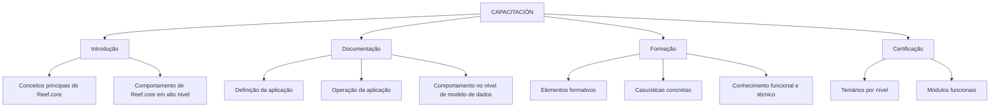

# Capacitação e Documentação Reef.core — Perspectivas de Conhecimento, Formação e Certificação

## 1. Metadados do Documento
- **Arquivo de Origem:** Não identificado
- **Tipo de Documento:** Manual Operacional / Portal de Documentação
- **Domínio / Sistema:** Reef.core / Reef
- **Público-Alvo:** Desenvolvedores, usuários funcionais, operadores e profissionais em formação/certificação
- **Data/Versão Identificada:** Não identificada

---

## 2. Resumo Executivo & Contexto de Negócio

O documento apresenta a seção **CAPACITACIÓN** de um ambiente de documentação relacionado ao sistema **Reef.core**. Essa seção reúne materiais para aquisição de conhecimentos funcionais e técnicos, além de cursos associados à definição e à operação da aplicação.

A organização do conteúdo é dividida em quatro perspectivas: **Introdução**, **Documentação**, **Formação** e **Certificação**. Cada perspectiva atende a uma necessidade distinta de aprendizagem, consulta ou validação de conhecimento sobre Reef.core.

A perspectiva de **Introdução** concentra documentos voltados ao entendimento dos conceitos principais e ao comportamento de Reef.core em alto nível. A perspectiva de **Documentação** disponibiliza materiais para definir e operar a aplicação, incluindo entendimento do comportamento do sistema no nível de modelo de dados.

A perspectiva de **Formação** reúne elementos formativos direcionados a casuísticas concretas, permitindo desenvolver conhecimentos funcionais e técnicos. A perspectiva de **Certificação** disponibiliza os programas de conteúdos dos diferentes níveis de certificação, organizados por módulo funcional.

O conteúdo apresentado não descreve arquitetura técnica interna, integrações, APIs, ambientes, contratos, métodos HTTP, regras de cálculo ou procedimentos operacionais detalhados de Reef.core.

---

## 3. Arquitetura, Componentes & Tecnologias Envolvidas

O documento cita o sistema **Reef.core** e uma área de documentação denominada **DOCUMENTACIÓN Reef**. Também apresenta elementos de navegação do portal, incluindo Soluções, Arquiteturas, APIs, Componentes, Cloud, Documentação, Zeus, Reef e Ajuda.

Não há descrição de componentes de software, microsserviços, banco de dados, tecnologias de desenvolvimento, protocolos, URLs de integração ou topologia de infraestrutura.



**Nota de Análise:** o documento apresenta uma organização de conteúdos educacionais e documentais, não uma arquitetura de software. Não há detalhamento técnico adicional dos menus ou dos itens de navegação citados.

---

## 4. Regras de Negócio, Especificações Funcionais & Processos

1. A seção **CAPACITACIÓN** contém documentação destinada à aquisição de conhecimentos funcionais e técnicos.
2. A seção **CAPACITACIÓN** também inclui cursos relacionados à definição e à operação com Reef.core.
3. O conteúdo é organizado em quatro perspectivas:
   - Introdução;
   - Documentação;
   - Formação;
   - Certificação.
4. A perspectiva **Introdução** deve apoiar o entendimento dos conceitos principais da aplicação e do comportamento de Reef.core em alto nível.
5. A perspectiva **Documentação** deve apoiar a definição e a operação com a aplicação, além da compreensão do comportamento de Reef.core no nível de modelo de dados.
6. A perspectiva **Documentação** é destinada à compreensão do funcionamento de Reef.core por distintos perfis.
7. A perspectiva **Formação** contém elementos formativos orientados a casuísticas concretas.
8. A perspectiva **Formação** permite adquirir conhecimentos funcionais e técnicos do sistema.
9. A perspectiva **Certificação** contém os temários dos diferentes níveis de certificação.
10. Os temários de certificação são divididos por módulo funcional.

**Nota de Análise:** o documento não define critérios de aprovação, pré-requisitos, responsáveis pelos cursos, fluxos de inscrição, níveis concretos de certificação ou módulos funcionais específicos.

---

## 5. Tabelas de Parâmetros, Ambientes e Estruturas de Dados

| Item / Parâmetro | Descrição / Função | Tipo / Valores / Formato | Ambiente / Observações |
| :--- | :--- | :--- | :--- |
| CAPACITACIÓN | Área que reúne documentação e cursos para conhecimento funcional e técnico. | Seção de portal | Relacionada a Reef.core |
| Introdução | Apresenta documentos para entendimento dos conceitos principais e do comportamento de Reef.core em alto nível. | Perspectiva de conteúdo | Não detalha documentos específicos |
| Documentação | Disponibiliza documentos para definir e operar a aplicação e compreender o modelo de dados. | Perspectiva de conteúdo | Destinada a distintos perfis |
| Formação | Reúne elementos formativos para casuísticas concretas. | Perspectiva de conteúdo | Abrange conhecimento funcional e técnico |
| Certificação | Reúne temários de diferentes níveis de certificação. | Perspectiva de conteúdo | Dividida por módulo funcional |
| Reef.core | Aplicação ou sistema abordado pela documentação. | Sistema / domínio | Sem arquitetura técnica detalhada |
| DOCUMENTACIÓN Reef | Nome exibido para a documentação relacionada a Reef. | Área documental | Também aparece como “Documentation / DOCUMENTACIÓN Reef” |
| Owner | Proprietário exibido para o conteúdo documental. | Identificador de usuário | `user:agonzalez_mapfre.com` |
| Lifecycle | Situação de ciclo de vida exibida. | Estado | `Approved` |
| Source | Identificador de origem exibido. | Referência | `/ VL` |
| Idioma | Idioma exibido no portal. | Código | `ES` |

---

## 6. Bateria de Perguntas & Respostas para RAG (FAQ Sintético)

### P1: Qual é o objetivo da seção CAPACITACIÓN relacionada ao Reef.core?
**R:** A seção CAPACITACIÓN reúne documentação para aquisição de conhecimentos funcionais e técnicos, além de cursos relacionados à definição e à operação com Reef.core.

### P2: Quais são as quatro perspectivas de conteúdo apresentadas para Reef.core?
**R:** As quatro perspectivas são Introdução, Documentação, Formação e Certificação.

### P3: O que pode ser encontrado na perspectiva Introdução?
**R:** A perspectiva Introdução contém documentos que ajudam a entender os principais conceitos da aplicação e o comportamento de Reef.core em alto nível.

### P4: Qual é o propósito da área Documentação de Reef.core?
**R:** A área Documentação reúne materiais que ajudam a definir e operar a aplicação, além de permitir compreender o comportamento de Reef.core no nível de modelo de dados.

### P5: A documentação de Reef.core é destinada somente a desenvolvedores?
**R:** Não. O texto informa que distintos perfis podem compreender como Reef.core funciona por meio da documentação, mas não especifica quais perfis são esses.

### P6: O que a perspectiva Formação oferece aos usuários?
**R:** A perspectiva Formação oferece elementos formativos orientados a casuísticas concretas para aquisição de conhecimentos funcionais e técnicos do sistema.

### P7: Como os conteúdos de Certificação são organizados?
**R:** Os temários dos diferentes níveis de certificação são divididos por módulo funcional.

### P8: O documento informa os níveis existentes de certificação Reef.core?
**R:** Não. O documento informa que existem diferentes níveis de certificação, mas não lista os níveis nem seus conteúdos.

### P9: O documento descreve APIs, microsserviços ou integrações de Reef.core?
**R:** Não. O documento cita menus como APIs, Arquiteturas e Componentes, mas não fornece contratos, endpoints, tecnologias, integrações ou detalhes arquiteturais de Reef.core.

### P10: Quem é o proprietário exibido para a documentação Reef?
**R:** O proprietário exibido é `user:agonzalez_mapfre.com`.

---

## 7. Glossário de Termos, Siglas & Conceitos-Chave

- **Reef.core:** Aplicação ou sistema mencionado como objeto central da documentação, formação e certificação.
- **CAPACITACIÓN:** Seção de capacitação que contém documentação e cursos para conhecimentos funcionais e técnicos.
- **Introdução:** Perspectiva documental voltada aos conceitos principais e ao comportamento de Reef.core em alto nível.
- **Documentação:** Perspectiva voltada à definição, operação e compreensão do comportamento de Reef.core no nível de modelo de dados.
- **Formação:** Perspectiva com elementos formativos para casuísticas concretas.
- **Certificação:** Perspectiva que reúne temários de diferentes níveis organizados por módulo funcional.
- **Lifecycle:** Campo exibido no portal com o valor `Approved`.
- **Owner:** Campo exibido no portal que identifica o proprietário do conteúdo.
- **VL:** Referência exibida no campo `Source`; o significado não é detalhado no documento.
- **ES:** Código de idioma exibido no portal; o documento não explicita seu significado.

---

## 8. Notas Críticas, Riscos & Limitações

- O arquivo de origem, a data e a versão do documento não foram identificados.
- O conteúdo não detalha arquitetura, componentes técnicos, integrações, APIs, contratos, tecnologias, servidores, ambientes ou logs.
- O documento não informa nomes de cursos, documentos específicos, módulos funcionais ou níveis de certificação.
- Os significados de `VL`, `Mapfredocument`, `Zeus` e dos demais menus do portal não são explicados.
- O texto extraído contém caracteres potencialmente corrompidos, como `denición` e `perles`; a análise preserva o conteúdo sem inferir palavras ausentes.
- O status `Approved` é exibido como lifecycle, mas o documento não define seu processo de aprovação ou governança.

---

## 9. Conteúdo Bruto Estruturado (Referência Fiel)

```text
--- [PÁGINA 1 DE 1] ---

CAPACITACIÓN
 En este apartado se encuentra la documentación que permite adquirir conocimientos tanto funcionales como
técnicos, así como distintos cursos relacionados con la denición y operación con Reef.core. La información está
organizada en cuatro perspectivas:
Introducción
Documentación
Formación
Certicación
INTRODUCCIÓN
En esta parte se encuentran los documentos que ayudan a entender, los principales conceptos de la aplicación, así como conocer el
comportamiento de Reef.core a alto nivel.
DOCUMENTACIÓN
En este lugar se encuentran los documentos que ayudan a denir, operar con la aplicación, así como conocer el comportamiento de Reef.core
a nivel de modelo de datos. Es un lugar donde distintos perles pueden comprender como Reef.core funciona.
FORMACIÓN
Aquí se encuentran distintos elementos formativos orientados a casuísticas concretas que permiten adquirir tanto conocimientos
funcionales como técnicos del sistema.
CERTIFICACIÓN
Aquí se encuentran los temarios de los distintos niveles de certicación divididos por módulo funcional.
Documentation / DOCUMENTACIÓN Reef
DOCUMENTACIÓN Reef
Mapfredocument
DOCUMENTACIÓN Reef
Owner
user:agonzalez_mapfre.com
Lifecycle
Approved Source
 / 
 VL
Buscar Inicio Soluciones Arquitecturas APIs Componentes Cloud Documentación Zeus Reef Ayuda
ES
```
