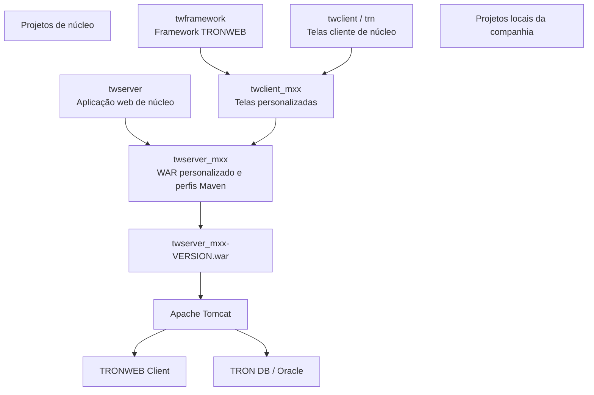
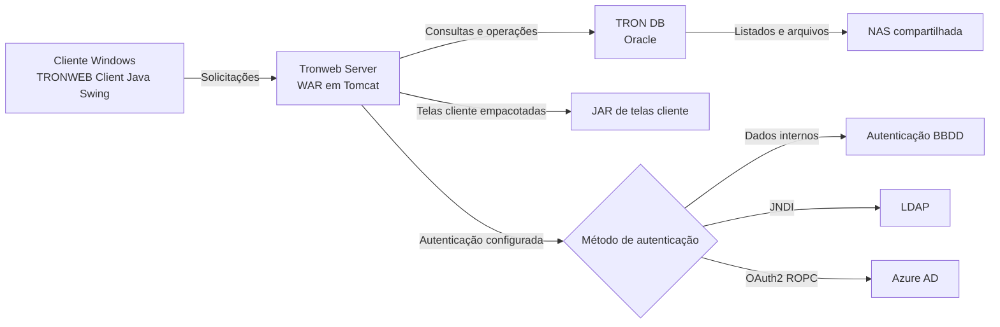
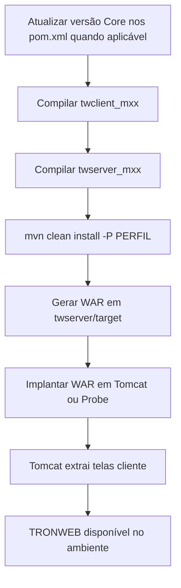
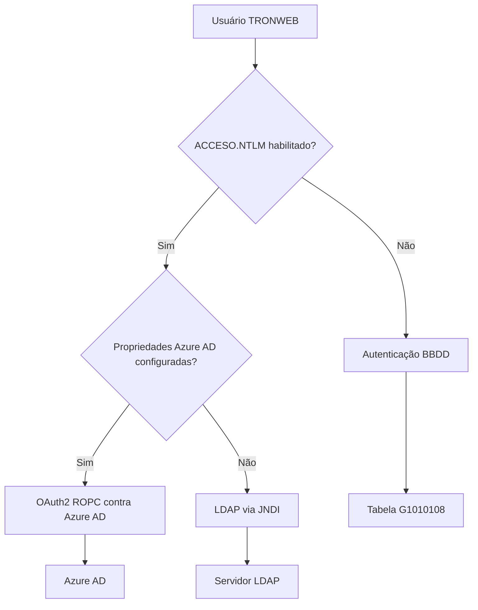

# Guia Técnico de Instalação, Evolução, Construção e Autenticação do TRONWEB

## 1. Metadados do Documento
- **Arquivo de Origem:** Texto bruto fornecido — documentação `TRONWEB`
- **Tipo de Documento:** Manual Operacional e Especificação Técnica
- **Domínio / Sistema:** TRONWEB / Tronweb Server / TRON DB
- **Público-Alvo:** Desenvolvedores, Arquitetos, Operação, Administradores de Banco de Dados e Administradores de Aplicação
- **Data/Versão Identificada:** Referências a 2016, 2018, release 21.09 e release 23.01; versão consolidada do documento não identificada

---

## 2. Resumo Executivo & Contexto de Negócio

O documento descreve a evolução, instalação, configuração, construção, execução e autenticação da aplicação corporativa TRONWEB. TRONWEB possui uma arquitetura composta por cliente Java Swing, aplicação servidora empacotada como WAR e uma base de dados Oracle. A documentação também descreve projetos de núcleo e projetos locais de personalização por companhia ou país.

A modernização do TRONWEB substitui a dependência operacional do mecanismo de sincronização baseado em CVS ou Subversion por uma estrutura Mavenizada. A mudança permite construir o artefato WAR de forma padronizada, incluir as telas cliente como JAR no servidor `twserver`, reduzir tarefas manuais de instalação e facilitar a atualização de CIMS Java por alteração da versão de Core nos arquivos `pom.xml`.

A evolução é necessária para países que atualizam CIMS para 2016 ou superior, pois a aplicação de CIMS posteriores deixa de possuir um mecanismo simples e padronizado sem a modernização Maven. Entre os benefícios explicitamente citados estão a modernização dos repositórios Java, a simplificação da geração de WAR, a adoção de automatismos DevOps, rastreabilidade PECA, autenticação LDAP e OAuth2, além de correções de desempenho.

A instalação exige infraestrutura baseada em Red Hat Enterprise Linux 6 ou superior, Apache Tomcat, Oracle Database e, quando os componentes não estão na mesma máquina, armazenamento compartilhado NAS. O documento define parâmetros de capacidade, estruturas de diretórios, usuários de sistema, permissões Oracle, tabelas de configuração, parâmetros de relatórios e configuração de envio de e-mails pela base de dados.

A autenticação evoluiu de um mecanismo legado baseado em SMB1 para LDAP por JNDI a partir da release 21.09. A partir da release 23.01, TRONWEB também oferece autenticação OAuth2 contra Azure AD com fluxo ROPC. Quando as propriedades de Azure AD estão configuradas e a propriedade `ACCESO.NTLM` está habilitada, Azure AD é o método de autenticação prioritário; caso contrário, é utilizada a autenticação LDAP.

---

## 3. Arquitetura, Componentes & Tecnologias Envolvidas

### Componentes identificados

| Componente | Função identificada | Observações |
| :--- | :--- | :--- |
| TRONWEB Client | Cliente Java Swing executado em clientes Windows | Executado com Java 1.3. |
| Tronweb Server / `twserver` | Parte servidora de TRONWEB | Aplicação WAR normalmente implantada em Tomcat; alguns países usam WAS ou JBoss. |
| TRON DB | Base de dados TRONWEB | Oracle Database. |
| `twframework` | Framework TRONWEB | Inclui utilidades para cliente e servidor. |
| `twclient` / `trn` | Telas cliente de núcleo | Projeto de núcleo; não deve ser modificado pelos países. |
| `twclient_mxx` | Telas personalizadas da companhia | `MXX` pode ser MPT, MTR, MPA ou outro identificador local. |
| `twserver_mxx` | Aplicação web TRONWEB personalizada | Contém perfis Maven de ambientes. |
| `twframework` local | Personalizações de classes de framework do país | O documento recomenda não possuir classes neste módulo. |
| Apache Tomcat | Servidor de aplicações | Referência a Tomcat 7.0.88 e Tomcat 7.0.XX. |
| Oracle Database | Servidor de banco de dados | Versão mínima Oracle 11.2.0.2. |
| NAS | Recurso compartilhado para arquivos | Compartilhado entre Oracle e Tomcat. |
| Maven | Gestão de dependências e construção | Ambiente de compilação Maven 3.6.x e Java 1.8. |
| Azure Artifacts | Repositório de artefatos Maven | Requer configuração por `settings.xml`. |
| Eclipse / MAPFRE Tool Suite | Ambiente de desenvolvimento | Permite importação Maven, build e execução local. |
| Plastic SCM / Git / Subversion | Controle de versões | Plastic SCM é indicado como ferramenta corporativa do momento; Git e Subversion são alternativas mencionadas. |
| LDAP | Diretório para autenticação | Usado por JNDI desde a release 21.09. |
| Azure AD | Provedor de autenticação OAuth2 | Disponível a partir da release 23.01. |
| Probe | Ferramenta de implantação/gestão Tomcat | O documento indica o acesso via `http://servidor:puerto/probe`. |
| `wtw_report.war` | Aplicação de relatórios | Requer leitura de `JasperReports_in_Tronweb_and_WebTronWeb.pdf` para implantação correta. |

### Estrutura Maven de projetos



### Arquitetura operacional



### Fluxo de construção e implantação



### Nota de Análise

O documento cita os módulos `twserver`, `twframework`, `twclient`, `twclient_mxx` e `twserver_mxx`, mas não detalha contratos HTTP, APIs REST, métodos HTTP, estruturas JSON ou interfaces formais entre os componentes.

---

## 4. Regras de Negócio, Especificações Funcionais & Processos

### 4.1 Evolução Maven e atualização de CIMS

1. A modernização de TRONWEB Core ocorreu em 2016.
2. Países que evoluírem seus projetos TRONWEB para Maven devem atualizar no mínimo para CIMS de 2016.
3. Países que atualizarem CIMS para 2016 ou superior devem realizar a evolução Maven, pois não existirá forma simples e padronizada de aplicar CIMS de sistemas posteriores sem essa mudança.
4. Após a entrega de um repositório Mavenizado, o país deve realizar testes de regressão.
5. A atualização de Core não requer copiar classes de Core para o projeto local.
6. A atualização de Core é realizada alterando a propriedade `TRONWEB_SERVER_VERSION` nos arquivos `pom.xml` dos dois projetos locais.
7. Após alterar a versão de Core, deve-se recompilar primeiro o cliente e depois o servidor, implantando em seguida o WAR gerado.

### 4.2 Regras para projetos locais

1. O desenvolvimento local deve ser realizado nos projetos `twserver_mxx` e `twclient_mxx`.
2. As telas locais devem ficar no subprojeto `client`, no pacote `mapfre.m??`.
3. Telas no pacote `mapfre.trn` podem ser mantidas quando houver referências ou comentários que indiquem modificações locais; deve ser realizada análise para removê-las ou transferir a implementação para `mapfre.m??`.
4. Arquivos renomeados para extensão `.BAK` representam classes que não compilaram corretamente.
5. Classes removidas podem ter sido excluídas por funcionalidades não aplicáveis ao cliente, localização inadequada ou outros critérios.
6. Se uma funcionalidade removida precisar ser preservada, ela poderá ser recuperada do histórico.
7. O documento recomenda não manter classes no módulo `twframework` personalizado.

### 4.3 Mecanismo anterior de sincronização

O mecanismo anterior dependia de CVS ou Subversion:

1. O desenvolvedor realizava commit no repositório RCS.
2. O repositório de fontes Java de TRONWEB, atuando como cliente RCS, era atualizado automaticamente.
3. O cliente TRONWEB solicitava um programa ao servidor quando não o possuía localmente.
4. O servidor TRONWEB obtinha o programa no repositório de fontes Java.
5. O servidor devolvia o programa ao cliente.

O problema identificado estava na atualização automática do repositório de fontes Java: ela requeria disparadores executados após commits. Dessa forma, desenvolvimento e instalação do cliente TRONWEB ficavam acoplados ao servidor de controle de versões.

A instalação no modelo anterior exigia:

- Implantação do WAR `twserver`.
- Instalação do controle de versões na máquina que hospeda o WAR.
- Configuração de disparador no controle de versões.
- Commit da parte cliente para provocar sincronização inicial.
- Cadastro da aplicação na tabela `TRONWEB_SERVIDORES`.

### 4.4 Mudanças da nova configuração

| Mudança | Efeito descrito |
| :--- | :--- |
| Inclusão das telas cliente como JAR no servidor `twserver` | As telas cliente passam a ser empacotadas com a aplicação servidora. |
| Extração no deploy | No momento da implantação, o conteúdo do JAR de telas é extraído em `RUTA.REPOSITORIOREMOTO`; se não existir, em `$temp/$contexto`. Antes são removidos `.class` e JARs. |
| Geração de etiquetas no startup | A geração de etiquetas passa a ser forçada na inicialização; ainda pode ser iniciada pela página. |
| Arquivos `.bat` variáveis | Os arquivos são gerados em tempo real e não precisam ser editados antes da implantação. |
| Unificação de JARs | Todos os projetos `TWJAR_*` foram unidos em um único projeto. |
| Eliminação de `dirtw` | O executável foi removido, eliminando uma etapa em novas instalações. |
| Limpeza de JARs | JARs repetidos e não utilizados foram removidos. |
| Alteração de properties | Foi modificado o arquivo que contém a lista de arquivos copiados ao cliente TRONWEB. |
| Mavenização | Projetos passaram a utilizar Maven e alguns nomes foram alterados. |
| Logs por ambiente | Cada ambiente passa a gerar o seu próprio arquivo de log. |
| Valores sem cadastro em `TRONWEB_SERVIDORES` | A aplicação passa a usar valores corretos mesmo quando não está cadastrada na tabela. |
| Definição de implantação Core/personalizações | O documento passa a definir como implantar núcleo e personalizações de companhias. |

### 4.5 Compilação dos projetos

#### Pré-requisitos de compilação

- Maven 3.6.x.
- Java 1.8.
- Maven configurado para Azure Artifacts.
- Arquivo `settings.xml` fornecido em documentação corporativa indicada no conteúdo de origem.

#### Linha de comando

```text
mvn clean install -P PERFIL
```

- O comando deve ser executado no diretório raiz do projeto.
- `PERFIL` deve corresponder a um perfil definido no `pom` de `server/`.
- No ambiente de desenvolvimento distribuído, deve-se executar `start-cmd.bat`, posicionar-se na raiz do projeto e executar Maven.
- Para compilar sem informar perfil, o exemplo fornecido é:

```text
mvn clean install
```

#### Ordem obrigatória de compilação manual

1. Compilar `twclient_mxx`.
2. Compilar `twserver_mxx`.
3. Implantar o WAR gerado.

#### Localização do WAR

- Diretório: `twserver/target/`
- Padrão de nome: `twserver_mxx-VERSION.war`
- Exemplo: `twserver_mmt-003.001.01.02-SNAPSHOT.war`

### 4.6 Perfis Maven

1. `twserver_mxx` pode possuir múltiplos perfis no arquivo `pom.xml`.
2. Cada perfil contém propriedades para compilar e executar a aplicação em um ambiente específico.
3. As propriedades correspondem ao arquivo `conf.properties` do TRONWEB.
4. Um perfil pode possuir bloco `activation`, tornando-se o perfil padrão.
5. O exemplo do documento cita:
   - Perfil `DES02` para ambiente da Turquia (`mtr`), incluindo telas de núcleo e telas personalizadas.
   - Perfil `DES01` para ambiente de núcleo (`trn`), incluindo somente telas de núcleo.

### 4.7 Configuração e criptografia de senha

A partir de `CIMS_TRN_SIS_2018_2.00.00`:

1. A aplicação deixa de utilizar o usuário conectado na base de dados.
2. É utilizado um usuário genérico, por padrão `TRON2000_APP`.
3. O usuário e sua senha devem estar definidos em `conf.properties`.
4. A senha é criptografada com `javax.crypto`, algoritmo AES e uma semente definida pelo TRONWEB.
5. A criptografia pode ser realizada pelo script `Encrypt.sh`.
6. Em projetos personalizados, o script pode ser obtido após compilação Maven.
7. O resultado deve ser utilizado em `SERVIDOR_CLAVE` no perfil Maven correspondente ou no arquivo `conf.properties` da instalação servidora.

Comando informado:

```text
java -cp ./WEB-INF/lib/twserver.jar mapfre.utl.Encryptor {CONTRASEÑA}
```

### 4.8 Execução em Eclipse

#### Execução do cliente

1. Abrir `Run -> Run Configurations`.
2. Criar configuração do tipo `Java Application`.
3. Informar um nome, por exemplo `twclient`.
4. Selecionar o projeto cliente TRONWEB.
5. Informar a classe principal:

```text
mapfre.trn.utilidades.JMenuTron
```

6. Na aba de argumentos, informar os argumentos na ordem:

```text
CONTEXTO:PUERTO NOMBRE_SERVIDOR
```

7. Configurar JRE 1.3, necessária para funcionamento do cliente.
8. Executar a configuração.

#### Execução do servidor

1. Configurar o perfil Maven no projeto `twserver`; caso não seja configurado, será usado o perfil padrão `DES01`.
2. Adicionar o projeto ao servidor Tomcat local na visão `Servers`, por meio da opção `Add and remove...`.
3. Executar `Clean` antes de iniciar.
4. Iniciar em modo normal, debug ou profiling.

### 4.9 Infraestrutura e instalação

#### Infraestrutura mínima

A instalação ocorre sobre Red Hat Enterprise Linux versão 6 ou superior e possui:

1. Servidor de aplicações.
2. Servidor de base de dados.
3. Servidor NAS.

Quando os servidores de aplicação e banco estão na mesma máquina, o NAS não é estritamente necessário. Essa configuração é permitida, por exemplo, para desenvolvimento e recepção.

Também deve existir um sistema de controle de versões para publicação de fontes. O documento cita Plastic SCM como ferramenta corporativa, além de Git e Subversion como alternativas.

#### Diretórios

| Diretório | Finalidade / regra |
| :--- | :--- |
| `ap/lis` | Diretório para listados. |
| `ap/sql` | Diretório necessário ao funcionamento. |
| `ap/ld0` | Exemplo de substituição de `ap/lis` para conter listados somente de um ambiente, como DES00. |
| `ap/tron2000` | Diretório criado com usuário e grupo `tronweb`. |

A alteração de `ap/lis` para outra estrutura exige alteração em:

- Tabela `g000000`.
- Pacote `trn_k_g000000`.

#### Usuários e grupos

| Elemento | Função |
| :--- | :--- |
| `oracle` | Usuário proprietário da base de dados. |
| `tronweb` | Usuário responsável por iniciar o servidor Tomcat. |
| Grupo `tronweb` | Grupo necessário para permissões de acesso. |
| Grupo `oinstall` | Grupo necessário para permissões de acesso. |

### 4.10 Instalação e configuração Oracle

#### Instalação padrão

1. Instalar Oracle 11.X em servidores corporativos cluster ativo/passivo.
2. Realizar Full Import com DataPump.
3. Compilar pacotes.
4. Executar permissões indicadas como usuário `SYS`.
5. Compilar a base de dados com:

```sql
EXEC UTL_RECOMP.recomp_parallel(4, 'TRON2000');
```

#### Instalação de versão 0

1. Seguir o procedimento de instalação de banco, exceto a importação DataPump.
2. Instalar fontes por `CIMS_INSTALL`.
3. Verificar ou criar tablespace `DATOS`.
4. Criar schemas `TRON2000` e `TRON2000_APP`.
5. Criar roles:
   - `ROL_TRON2000_APP`
   - `ROL_TRON2000_SEL`
   - `ROL_TRON2000_ALL`
6. Conceder permissões ao usuário `TRON2000`.
7. Executar a versão 0 conforme o documento:

```text
V0_TRN_2016_1.00\dat\V0_TRN_2016_1.00.doc
```

### 4.11 Parâmetros e e-mail

1. Para permitir senhas Oracle sem diferenciação entre maiúsculas e minúsculas:

```sql
ALTER SYSTEM SET SEC_CASE_SENSITIVE_LOGON = FALSE SCOPE=SPFILE;
```

2. Para permitir escrita Oracle, substituindo `*` pelos diretórios necessários:

```sql
ALTER SYSTEM SET utl_file_dir = * SCOPE=SPFILE
```

3. Atualizar strings de conexão na tabela `g1010108`:

```sql
update g1010108 set TXT_CADENA_BBDD='SERVIDOR:PUERTO:INSTANCIA'
```

4. Na versão 0, a tabela deve estar vazia antes da alteração de parâmetros de contexto em `tronweb_servidores`.
5. `COD_SERVICIO` corresponde ao contexto ou ambiente.
6. `NOM_SERVIDOR` deve conter o servidor Linux onde o Tomcat está instalado quando não existir Apache à frente.
7. `num_puerto` contém a porta Apache — exemplo `80` — ou a porta do Tomcat quando não houver Apache. A porta Tomcat pode ser obtida em `server.xml`.
8. Os parâmetros de relatórios ficam em `tron2000.TRONWEB_SETUP`.
9. O envio de e-mail requer configuração de ACL Oracle, permissão ao schema `TRON2000` e uso de `UTL_MAIL`.

### 4.12 Implantação de WAR e administração

1. O documento indica implantar `probe.war` pelo Tomcat Manager.
2. O serviço Probe é verificado em:

```text
http://servidor:puerto/probe
```

3. O WAR TRONWEB pode ser implantado no Probe com usuário `admin` ou `tomcat`.
4. Também deve ser implantado `wtw_report.war`.
5. A página administrativa deixa de usar validação própria de usuário e senha TRONWEB e passa a usar autenticação Tomcat.
6. Devem existir os papéis:
   - `tronwebadmin`: acesso à página administrativa completa.
   - `tronwebuser`: acesso somente ao download do cliente TRONWEB.
7. As URLs de download informadas são:

```text
http://[machine]:[port]/[twserver]/install.html
http://[maquina]:[puerto]/[twserver]/instalar.html
```

### 4.13 Senhas Tomcat

1. Gerar hash SHA usando `digest.sh` em `${tomcat_home}/bin/`.
2. Inserir a chave gerada no campo de senha de `tomcat-users.xml`.
3. Editar `server.xml` para configurar SHA como método digest de autenticação de usuários no elemento `<Host>`.

### 4.14 Autenticação



#### Métodos disponíveis

| Método | Disponibilidade / comportamento | Fonte de credenciais |
| :--- | :--- | :--- |
| Autenticação BBDD | Método baseado em dados de Oracle | Colunas `COD_SAPTRON` e `TXT_CLAVE_SAPTRON` da tabela `G1010108`. |
| Diretório Ativo legado | Até a versão 21.09 | Biblioteca com protocolo SMB1, considerado inseguro. |
| LDAP | A partir da release 21.09 | JNDI. |
| Azure AD | A partir da release 23.01 | OAuth2 com fluxo ROPC. |

#### Regras de ativação LDAP/Azure AD

Para um usuário específico:

| `COD_USR` | `COD_GRUPO` | `TXT_NOMBRE_VARIABLE` | `TXT_VALOR_VARIABLE` |
| :--- | :--- | :--- | :--- |
| `[NUMMA]` | `DEFECTO` | `ACCESO.NTLM` | `S` |

Para todos os usuários:

| `COD_USR` | `COD_GRUPO` | `TXT_NOMBRE_VARIABLE` | `TXT_VALOR_VARIABLE` |
| :--- | :--- | :--- | :--- |
| `DEFECTO` | `DEFECTO` | `ACCESO.NTLM` | `S` |

#### Prioridade de autenticação

1. A propriedade `ACCESO.NTLM` deve estar habilitada para o usuário ou para o usuário padrão.
2. Se LDAP estiver habilitado e as propriedades Azure AD estiverem configuradas, TRONWEB utiliza Azure AD por padrão.
3. Se as propriedades Azure AD não estiverem configuradas, TRONWEB utiliza LDAP.
4. A configuração antiga por SMB1 deve ser substituída por LDAP em TRONWEB 21.09 ou superior.

---

## 5. Tabelas de Parâmetros, Ambientes e Estruturas de Dados

### Requisitos de infraestrutura

| Item / Parâmetro | Descrição / Função | Tipo / Valores / Formato | Ambiente / Observações |
| :--- | :--- | :--- | :--- |
| Sistema operacional | Plataforma de instalação | Red Hat Enterprise Linux 6 ou superior | Aplicação, banco e infraestrutura associada. |
| Servidor de aplicações | Hospedagem de TRONWEB Server | Apache Tomcat 7.0.XX; referência específica 7.0.88 | Tomcat. |
| Java de servidor | Compilação e execução de `twserver` | Mínimo 1.5; superior até 1.8 | Documento também requer Java 1.8 para compilação Maven. |
| Armazenamento servidor de aplicações | Capacidade de disco | 50 GB | Servidor de aplicações. |
| Memória servidor de aplicações | Memória mínima | 2 GB | Servidor de aplicações. |
| Banco de dados | Persistência TRONWEB | Oracle 11.2.0.2 ou superior | Servidor de banco. |
| Memória Oracle | Memória mínima por instância | 2 GB | Oracle. |
| Database Oracle | Tamanho mínimo | 100 GB | Oracle. |
| Archive log | Tamanho mínimo | 50 GB | Oracle. |
| Character set | Jogo de caracteres | `WE8ISO8859P9` | Oracle. |
| `NLS_NCHAR_CHARACTERSET` | Configuração nacional de caracteres | `AL16UTF16` | Oracle. |
| `NLS_LANGUAGE` | Idioma Oracle | `AMERICAN` | Oracle. |
| `UTL_FILE_DIR` | Escrita de arquivos via Oracle | Escrita permitida | Deve contemplar diretórios necessários. |
| NAS | Compartilhamento para listados Oracle | 20 GB | Visível para Oracle e Tomcat. |
| SCM | Gestão de fontes | Plastic SCM, Git ou Subversion | Necessário em paralelo aos ambientes de trabalho. |

### Tablespaces Oracle

| Tablespace | Tamanho inicial | Incremento | Tamanho máximo |
| :--- | :--- | :--- | :--- |
| `DATOS` | 500 MB | 250 MB | 50 GB |
| `INDICES` | 500 MB | 250 MB | 50 GB |

### Dependências e versões de execução

| Item / Parâmetro | Descrição / Função | Tipo / Valores / Formato | Ambiente / Observações |
| :--- | :--- | :--- | :--- |
| Maven | Ferramenta de build | 3.6.x | Compilação de projetos evolucionados. |
| Java para build Maven | JVM para compilação | Java 1.8 | Requisito explícito. |
| Java do cliente e framework | JVM do cliente | Java 1.3 | Necessária no Eclipse para executar o cliente. |
| Java de `twserver` | JVM de servidor | Java 1.5 a 1.8 | Documento informa que pode ser compilado com versões superiores nesse intervalo. |
| `TRONWEB_SERVER_VERSION` | Versão de Core | Propriedade Maven em `pom.xml` | Atualizar em ambos os projetos locais para atualizar Core. |
| Perfil Maven | Configura ambiente | `-P PERFIL` | Definido no `pom.xml` de `twserver_mxx`. |
| Perfil padrão | Perfil ativado automaticamente | Exemplo: `DES01` | Configurado por bloco `activation`. |

### Configuração Oracle e conexão

| Item / Parâmetro | Descrição / Função | Tipo / Valores / Formato | Ambiente / Observações |
| :--- | :--- | :--- | :--- |
| `TXT_CADENA_BBDD` | String de conexão de banco | `SERVIDOR:PUERTO:INSTANCIA` | Tabela `g1010108`. |
| `NOM_SERVIDOR` | Servidor da aplicação | Exemplo: `XX.mapfre.net` | Tabela `tronweb_servidores`; sem Apache, usar host Linux com Tomcat. |
| `COD_SERVICIO` | Contexto/ambiente | Exemplo: `int` | Tabela `tronweb_servidores`. |
| `num_puerto` | Porta do serviço | Exemplo: `80` | Porta Apache ou porta Tomcat se não houver Apache. |
| `SERVIDOR_CLAVE` | Senha criptografada do usuário técnico | Saída do `Encrypt.sh` / `Encryptor` | Perfil Maven ou `conf.properties`. |
| Usuário técnico padrão | Usuário genérico de banco | `TRON2000_APP` | A partir de `CIMS_TRN_SIS_2018_2.00.00`. |
| Algoritmo de criptografia | Proteção de senha interna | AES por `javax.crypto` | Semente definida por TRONWEB. |

### Configuração de relatórios e e-mail

| Grupo | Variável | Valor / formato informado | Observações |
| :--- | :--- | :--- | :--- |
| `webservice` | `reports` | `http://[server]:[port]/wtw_reports/services/Reporter` | Registro em `tron2000.TRONWEB_SETUP`. |
| `mailserver` | `host` | `[mail server name]` | Registro em `tron2000.TRONWEB_SETUP`. |
| `mailserver` | `from_reports` | `servicio.informes.wtw@mapfre.com` | Registro em `tron2000.TRONWEB_SETUP`. |
| `G1010107` | `HOST.SMTP` | Consultável na tabela | Configuração SMTP. |
| `G1010107` | `PUERTO.SMTP` | Consultável na tabela | Configuração SMTP. |
| `G1010107` | `HOST.POP3` | Consultável na tabela | Configuração POP3. |
| `G1010107` | `PUERTO.POP3` | Consultável na tabela | Configuração POP3. |
| `G1010107` | `USER.POP3` | Consultável na tabela | Configuração POP3. |
| `G1010107` | `PASS.POP3` | Consultável na tabela | Configuração POP3. |

### Propriedades LDAP

| Propriedade | Descrição / Função | Exemplo ou formato informado | Observações |
| :--- | :--- | :--- | :--- |
| `LDAP.URL` | URL do provedor LDAP | `ldap://somehost:389` | Obrigatória quando LDAP estiver habilitado. |
| `LDAP.USER` | UPN do usuário de conexão LDAP | `APP-TRONWEB@mapfre.net` | Conta de conexão ao diretório. |
| `LDAP.PASSWORD` | Senha do usuário LDAP | Valor criptografado | Deve ser criptografada conforme procedimento TRONWEB. |
| `LDAP.SEARCH.BASE` | DN do contexto inicial de busca | `dc=mapfre,dc=net` | Base da consulta LDAP. |
| `LDAP.SEARCH.FILTER` | Filtro da busca LDAP | `sAMAccountName` | Critério de pesquisa LDAP. |
| `DOMAINCONTROLLER` | Controlador de domínio legado | Exemplo: `mapfre.net` | Configuração antiga baseada em SMB1. |
| `DOMAIN` | Domínio de usuários legado | Exemplo: `es.mapfre.net` | Configuração antiga baseada em SMB1. |

### Propriedades Azure AD

| Propriedade | Descrição / Função | Tipo / Valores / Formato | Ambiente / Observações |
| :--- | :--- | :--- | :--- |
| `OAUTH.CLIENTID` | Identificador do registro de aplicação | ID de App Registration | Azure AD. |
| `OAUTH.CLIENTSECRET` | Segredo de cliente | Valor criptografado | Criado no App Registration. |
| `OAUTH.PROXY.HOST` | Host proxy | Opcional | Azure AD. |
| `OAUTH.PROXY.PORT` | Porta proxy | Opcional | Azure AD. |
| `OAUTH.SCOPE` | Escopos Azure AD | Escopos configurados no tenant | Azure AD. |
| `OAUTH.TENANT` | Tenant de autenticação | Tenant Azure AD | Azure AD. |
| `OAUTH.TIMEOUT` | Tempo limite de requisição Azure | Opcional; padrão 10 segundos | Azure AD. |

### Papéis Tomcat

| Papel | Permissão |
| :--- | :--- |
| `tronwebadmin` | Acesso completo à página de administração TRONWEB. |
| `tronwebuser` | Acesso somente à página de download do cliente TRONWEB. |

---

## 6. Bateria de Perguntas & Respostas para RAG (FAQ Sintético)

### P1: Qual é a finalidade da evolução Maven do TRONWEB?
**R:** A evolução Maven moderniza os repositórios Java do TRONWEB, padroniza a construção do WAR implantável, simplifica a aplicação de CIMS Java e elimina a dependência operacional do cliente TRONWEB em CVS ou Subversion. A mudança também é necessária para automatismos DevOps e para aplicar atualizações como rastreabilidade PECA, LDAP, OAuth2 e melhorias de desempenho.

### P2: Quais projetos podem ser modificados por um país ou companhia?
**R:** Os projetos de núcleo `twserver`, `twframework` e `twclient` não admitem modificação pelos países. As personalizações devem ser realizadas principalmente em `twclient_mxx`, para telas personalizadas, e em `twserver_mxx`, para a aplicação web personalizada e seus perfis Maven. O documento recomenda evitar classes no módulo `twframework` personalizado.

### P3: Qual é a ordem correta para compilar um TRONWEB personalizado?
**R:** Em uma construção manual, primeiro deve ser compilado o projeto de telas personalizadas `twclient_mxx`. Depois deve ser compilado `twserver_mxx`, que depende do cliente personalizado. O comando Maven indicado é `mvn clean install -P PERFIL`, e o WAR resultante é gerado em `twserver/target/`.

### P4: Como atualizar a versão de Core em um projeto TRONWEB local?
**R:** A atualização de Core deve ser feita alterando a propriedade `TRONWEB_SERVER_VERSION` nos arquivos `pom.xml` dos dois projetos locais. Após a alteração, devem ser recompilados o projeto cliente e, em seguida, o projeto servidor. Finalmente, o WAR gerado deve ser implantado.

### P5: Onde fica o WAR gerado pelo build Maven de TRONWEB?
**R:** O WAR pode ser localizado no repositório Maven local e também no diretório `twserver/target/`. O padrão de nome informado é `twserver_mxx-VERSION.war`, como no exemplo `twserver_mmt-003.001.01.02-SNAPSHOT.war`.

### P6: Quais são os requisitos mínimos de infraestrutura para TRONWEB?
**R:** O documento define Red Hat Enterprise Linux 6 ou superior, um servidor de aplicações com Apache Tomcat 7.0.XX, Oracle Database 11.2.0.2 ou superior, e NAS quando banco e aplicação estiverem em máquinas separadas. O servidor de aplicações requer 50 GB de armazenamento e pelo menos 2 GB de memória; a instância Oracle requer pelo menos 2 GB de memória, database de 100 GB e archive log de 50 GB.

### P7: Como funciona a autenticação LDAP no TRONWEB?
**R:** A partir da release 21.09, o TRONWEB usa LDAP por JNDI, substituindo a abordagem anterior baseada em SMB1, considerada insegura. A ativação é feita com `ACCESO.NTLM=S` na tabela `G1010107`, para um usuário específico ou para o usuário `DEFECTO`. Também devem ser configuradas as propriedades `LDAP.URL`, `LDAP.USER`, `LDAP.PASSWORD`, `LDAP.SEARCH.BASE` e `LDAP.SEARCH.FILTER`.

### P8: Quando o TRONWEB utiliza Azure AD em vez de LDAP?
**R:** A autenticação Azure AD está disponível a partir da release 23.01. Quando a autenticação está habilitada com `ACCESO.NTLM` e as propriedades Azure AD estão configuradas, o TRONWEB usa Azure AD por padrão. Se as propriedades Azure AD não estiverem configuradas, o TRONWEB utiliza LDAP.

### P9: Quais propriedades configuram OAuth2 contra Azure AD?
**R:** As propriedades são `OAUTH.CLIENTID`, `OAUTH.CLIENTSECRET`, `OAUTH.PROXY.HOST`, `OAUTH.PROXY.PORT`, `OAUTH.SCOPE`, `OAUTH.TENANT` e `OAUTH.TIMEOUT`. `OAUTH.CLIENTSECRET` deve ser criptografado, e `OAUTH.TIMEOUT` é opcional, com padrão de 10 segundos.

### P10: Como criptografar uma senha usada internamente pelo TRONWEB?
**R:** A senha pode ser criptografada pelo script `Encrypt.sh` ou com o comando `java -cp ./WEB-INF/lib/twserver.jar mapfre.utl.Encryptor {CONTRASEÑA}`. O resultado deve ser copiado para a propriedade correspondente no perfil Maven ou em `conf.properties`, como `SERVIDOR_CLAVE` ou `LDAP.PASSWORD`.

### P11: Quais papéis Tomcat são utilizados na administração do TRONWEB?
**R:** O papel `tronwebadmin` possui acesso completo à página de administração do TRONWEB. O papel `tronwebuser` possui acesso apenas às páginas de download do cliente: `install.html` ou `instalar.html`. A autenticação da página administrativa passa a ser controlada pelo Tomcat.

### P12: Como o TRONWEB envia e-mails pela base Oracle?
**R:** O envio de e-mails requer permissões e ACL Oracle para o schema `TRON2000`. O documento utiliza o pacote `UTL_MAIL`, que deve ser compilado pelo usuário `SYS` com os scripts Oracle correspondentes, e o usuário `TRON2000` deve receber permissão de execução. A ACL deve conceder privilégio de conexão ao host SMTP na porta configurada.

---

## 7. Glossário de Termos, Siglas & Conceitos-Chave

- **AES:** Algoritmo de criptografia utilizado para proteger senhas internas do TRONWEB por meio de `javax.crypto`.
- **Azure AD:** Serviço de diretório Azure utilizado pelo TRONWEB para autenticação OAuth2 a partir da release 23.01.
- **CIMS:** Mecanismo de atualização referido para componentes TRONWEB; o documento associa a evolução Maven à aplicação de CIMS posteriores a 2016.
- **Core:** Projetos e artefatos de núcleo do TRONWEB, sem personalizações de um país ou companhia.
- **CVS:** Sistema de controle de versões citado como parte do mecanismo antigo de sincronização.
- **DataPump:** Mecanismo Oracle utilizado para Full Import na instalação padrão de banco de dados.
- **DN:** Distinguished Name; contexto inicial de pesquisa no LDAP, configurado em `LDAP.SEARCH.BASE`.
- **JNDI:** Mecanismo Java usado pelo TRONWEB para autenticação LDAP a partir da release 21.09.
- **JRE:** Java Runtime Environment; no Eclipse, o cliente TRONWEB requer JRE 1.3.
- **LDAP:** Serviço de diretório utilizado para autenticação TRONWEB.
- **Maven:** Ferramenta de gestão de projetos, dependências e construção de artefatos Java.
- **NAS:** Armazenamento compartilhado necessário para arquivos/listados quando Oracle e Tomcat estão em máquinas distintas.
- **OAuth2:** Protocolo de autorização/autenticação utilizado contra Azure AD.
- **PECA:** Funcionalidade de rastreabilidade mencionada como benefício das atualizações TRONWEB; o documento não detalha sua expansão.
- **ROPC:** Fluxo OAuth2 utilizado pelo TRONWEB para Azure AD, conforme o documento.
- **RCS:** Revision Control System; referência genérica a CVS ou SVN no mecanismo anterior.
- **SCM:** Source Control Management; ferramenta para armazenar e publicar fontes.
- **SMB1:** Protocolo utilizado na autenticação antiga de Diretório Ativo, declarado inseguro.
- **SVN / Subversion:** Sistema de controle de versões citado no mecanismo anterior e como alternativa de SCM.
- **Tomcat:** Servidor de aplicações usado para implantar o WAR TRONWEB.
- **TRON DB:** Base de dados Oracle do TRONWEB.
- **UPN:** User Principal Name; formato de usuário de conexão LDAP, como `APP-TRONWEB@mapfre.net`.
- **WAR:** Web Application Archive; artefato Java implantável em Tomcat.
- **`twclient`:** Projeto de telas cliente de núcleo.
- **`twclient_mxx`:** Projeto de telas cliente personalizadas da companhia.
- **`twframework`:** Projeto de framework TRONWEB.
- **`twserver`:** Projeto da aplicação web TRONWEB de núcleo.
- **`twserver_mxx`:** Projeto da aplicação web TRONWEB personalizada da companhia.

---

## 8. Notas Críticas, Riscos & Limitações

- **Atualização obrigatória de autenticação:** A autenticação de Diretório Ativo anterior à release 21.09 utiliza SMB1, protocolo declarado inseguro. O documento determina atualização obrigatória quando a autenticação anterior estiver habilitada por `ACCESO.NTLM`.
- **Compatibilidade de CIMS:** Países com CIMS 2016 ou superior devem realizar a evolução Maven para manter um processo simples e padronizado de atualização.
- **Testes de regressão:** Após a entrega de um repositório Mavenizado, o país precisa realizar testes de regressão.
- **Dependência de versões Java:** O cliente e o framework executam com Java 1.3, enquanto a construção Maven requer Java 1.8. O workspace Eclipse deve comportar ambas as versões de JVM.
- **Segurança de credenciais:** Senhas de `TRON2000_APP`, LDAP e Azure AD devem ser criptografadas pelo mecanismo informado. O conteúdo de origem não detalha gestão de chaves, rotação de segredos ou integração com um cofre de credenciais.
- **Parâmetro Oracle permissivo:** O documento apresenta `utl_file_dir = *` como configuração. A adoção de um valor abrangente demanda avaliação de segurança e deve ser restrita aos diretórios efetivamente necessários, conforme a própria orientação de substituir `*` pelos diretórios requeridos.
- **Permissões elevadas:** A instalação atribui permissões Oracle amplas ao usuário `TRON2000`, incluindo criação e remoção de contextos e sinônimos, criação de usuários e tablespace ilimitado. O documento não apresenta matriz de segregação de funções ou princípio de menor privilégio.
- **Fluxo ROPC:** Azure AD é configurado com fluxo ROPC e requer habilitação de fluxos públicos de cliente. O documento não detalha controles complementares, políticas de senha, MFA ou tratamento de tokens.
- **Informações incompletas de implantação:** O documento referencia `JasperReports_in_Tronweb_and_WebTronWeb.pdf` para a implantação de `wtw_report.war`, mas não fornece o procedimento detalhado desse componente no texto analisado.
- **Contratos não documentados:** Não são detalhadas APIs, contratos de integração, endpoints funcionais, payloads, regras de autorização de negócio ou esquemas completos das tabelas TRONWEB.
- **Exemplos com placeholders:** Valores como `[server]`, `[port]`, `[mail server name]`, `XX.mapfre.net`, `[NUMMA]` e `{CONTRASEÑA}` são modelos de configuração, não valores operacionais finais.

---

## 9. Conteúdo Bruto Estruturado (Referência Fiel)

```text
--- [PÁGINA 1 DE 31] ---

TRONWEB
Índice
Introducción
Evolución de Tronweb
Evolución de Tronweb en los proyectos locales
Construcción de los proyectos Tronweb evolucionados
Anterior mecanismo de sincronización
Cambios respecto a la anterior configuración
Estructura actual de proyectos
Entorno de Trabajo
Versiones de Java
Importación de proyectos en el workspace de Eclipse
Desarrollo de las pantallas personalizadas
Configuración Maven
Versiones de los artefactos
Actualización de Core
Configuración de los perfiles Maven
Configuración de la contraseña
Construcción de los proyectos
Por línea de comando
Localización del war generado
Eclipse
Ejecución en entorno de desarrollo
Ejecución del cliente
Servidor de Tronweb en Eclipse
Prueba de la aplicación en Eclipse
Procedimiento de instalación
Infraestructura
Servidor de aplicaciones
Servidor de Base de Datos
Recurso Compartido NAS
Directorios necesarios
Usuarios necesarios
Documentation / DOCUMENTACIÓN Reef
Owner: user:agonzalez_mapfre.com
Lifecycle: Approved Source

--- [PÁGINA 2 DE 31] ---

Instalación y configuración Base de Datos
Instalación
Instalación para versión 0
Configuración parámetros
Configuración envío de correos
Despliegue de los war
Página de administración de Tronweb
Pasos para cifrar las passwords de tomcat
Configuración de la Autenticación (LDAP / Azure AD)

El presente documento contiene la guía de instalación de la aplicación Tronweb.
Documenta la estructura de los proyectos que componen la aplicación y las
configuraciones y tareas necesarias para construir tanto el núcleo como la
parte específica de las compañías.

El proyecto Java de Tronweb evolucionó para utilizar Maven. Maven simplifica
y automatiza la construcción del artefacto desplegable, el WAR implantado
en Tomcat.

La modernización se realizó en Tronweb Core en 2016. Los países que evolucionen
deben actualizar, como mínimo, a CIMS de 2016. Todo país que actualice CIMS a
2016 o superior debe realizar este cambio.

Desde 2016 existen actualizaciones para requisitos de DCS y Auditoría:
actualización del método de autenticación, inclusión de PECA y mejoras de
seguridad.

Beneficios:
- Modernización de repositorios Java de Tronweb.
- Rapidez de instalación de CIMS Java mediante cambio de versión de Core.
- Sencillez de generación de artefactos desplegables.
- Necesario para automatismos DevOps.
- Necesario para actualizaciones como trazabilidad PECA, LDAP, OAuth2 y
  parche de rendimiento.

--- [PÁGINA 3 DE 31] ---

Después de recibir un repositorio Mavenizado, el país debe realizar pruebas
de regresión.

Proyecto normal:
- client: contiene pantallas del país.
- server: contiene la parte servidora de Tronweb, permite personalización y
  configura perfiles de distintos entornos.
- twframework: opcional; contiene personalizaciones de clases framework.
  Se recomienda no tener clases en este módulo.

Reglas:
1. Las pantallas del país se encuentran en client, paquete mapfre.m??.
2. Pantallas en mapfre.trn con posibles cambios locales requieren análisis
   para eliminarse o trasladarse a mapfre.m??.
3. Archivos .BAK son clases que no compilaron correctamente.
4. Funcionalidades eliminadas que deban mantenerse pueden recuperarse del
   historial.

Compilación:
- Maven 3.6.x.
- Java 1.8.
- Maven debe usar Azure Artifacts.
- Comando:
  mvn clean install -P PERFIL

El WAR desplegable se genera en server/target.

--- [PÁGINA 4 DE 31] ---

Mecanismo de sincronización anterior:
1a. El desarrollador realiza commit en RCS, CVS o SVN.
1b. El repositorio de fuentes Java de Tronweb se actualiza automáticamente.
2a. El cliente solicita al servidor un programa no disponible localmente.
2b/2c. El servidor obtiene el programa desde el repositorio de fuentes Java.
2d. El servidor devuelve el programa al cliente.

El problema se encuentra en 1b: son necesarios disparadores que ejecuten una
tarea cuando se realiza un commit. El desarrollo e instalación del cliente
quedan ligados al servidor de control de versiones.

Tareas mínimas de instalación anterior:
- Despliegue del WAR twserver.
- Instalación de control de versiones en la misma máquina.
- Configuración de disparador.
- Commit de parte cliente para primera sincronización.
- Alta de aplicación en TRONWEB_SERVIDORES.

Cambios:
1. Inclusión, como JAR, de las pantallas cliente en twserver.
2. En despliegue se extrae el contenido de pantallas en
   RUTA.REPOSITORIOREMOTO y, si no existe, en $temp/$contexto.
   Antes se borran .class y JAR.

--- [PÁGINA 5 DE 31] ---

Cambios adicionales:
3. Al arrancar se fuerza la generación de etiquetas.
4. Los BAT son variables y se generan en tiempo real.
5. Se unen los proyectos TWJAR_*.
6. Se elimina dirtw.
7. Limpieza de JAR repetidos y no usados.
8. Modificación de properties con lista de archivos a copiar al cliente.
9. Mavenización y cambios de nombres de proyectos.
10. Cada entorno genera su propio archivo de log.
11. La aplicación toma valores correctos sin alta en TRONWEB_SERVIDORES.
12. Se define despliegue de núcleo y personalizaciones.

Proyectos:
- twserver: aplicación web de núcleo.
- twframework: framework TRONWEB.
- twclient (trn): pantallas cliente de núcleo.
- twclient_mxx: pantallas personalizadas.
- twserver_mxx: aplicación web personalizada.

Los tres primeros son proyectos de núcleo y no admiten modificación por países.
Los dos últimos se entregan a países para autonomía de desarrollo y despliegue.

MAPFRE Tool Suite:
https://mar.mapfre.com/tooling/mapfre-toolsuite/anexos-y-manuales/

Java:
- Framework y cliente: Java 1.3.
- twserver: Java 1.5 a 1.8.
- Eclipse: Window -> Preferences -> Java -> Installed JREs.

--- [PÁGINA 6 A 8 DE 31] ---

Eclipse:
- En entornos de país trabajar solamente con twserver_mxx y twclient_mxx.
- Importar como Maven -> Existing Maven Projects.
- Importar primero twserver_mxx y repetir para twclient_mxx.
- El desarrollo de pantallas personalizadas se realiza en twclient_mxx.

--- [PÁGINA 9 E 10 DE 31] ---

Dependencias Maven:
- twserver_mxx depende de twserver de núcleo y twclient_mxx.
- twclient_mxx depende de twframework y twclient de núcleo.

Actualización de Core:
- Cambiar TRONWEB_SERVER_VERSION en pom.xml de dos proyectos.
- Compilar primero cliente y después servidor.
- Desplegar WAR generado.

Perfiles Maven:
- twserver_mxx puede definir distintos perfiles en pom.xml.
- Cada perfil contiene propiedades equivalentes a conf.properties.
- Ejemplo DES02 para Turquía (mtr), con núcleo y personalización.
- Ejemplo DES01 para núcleo (trn), con pantallas de núcleo.
- activation puede definir perfil por defecto.

--- [PÁGINA 11 A 12 DE 31] ---

Desde CIMS_TRN_SIS_2018_2.00.00:
- No se utiliza usuario conectado en BBDD.
- Usuario genérico por defecto: TRON2000_APP.
- Usuario y password se definen en conf.properties.
- Password cifrada con javax.crypto, AES y semilla de Tronweb.

Cifrado:
java -cp ./WEB-INF/lib/twserver.jar mapfre.utl.Encryptor {CONTRASEÑA}

El resultado se usa en SERVIDOR_CLAVE del perfil Maven o conf.properties.

Construcción:
1. Compilar twclient_mxx.
2. Compilar twserver_mxx.
3. Construcción Maven por línea de comandos o Eclipse.

En Windows:
1. Ejecutar start-cmd.bat.
2. Posicionarse en raíz del proyecto.
3. Ejecutar mvn clean install o mvn clean install -P PERFIL.

WAR:
twserver/target/twserver_mxx-VERSION.war

--- [PÁGINA 13 A 19 DE 31] ---

Ejecución del cliente Eclipse:
- Crear Java Application.
- Main Class: mapfre.trn.utilidades.JMenuTron
- Argumentos:
  CONTEXTO:PUERTO NOMBRE_SERVIDOR
- Configurar JRE 1.3.

Servidor Eclipse:
- Configurar perfil Maven en twserver; sin perfil usa DES01.
- En Servers: Add and remove...
- Añadir proyecto al Tomcat local.
- Ejecutar Clean.
- Iniciar en modo normal, debug o profiling.

--- [PÁGINA 20 A 21 DE 31] ---

Infraestructura:
- Red Hat Enterprise Linux 6 o superior.
- Servidor de aplicaciones.
- Servidor de base de datos.
- NAS.

NAS no es estrictamente necesario cuando aplicación y base de datos están en
la misma máquina, por ejemplo en desarrollo y recepción.

SCM:
- Plastic SCM indicado como herramienta corporativa.
- También se mencionan Git y Subversion.

Servidor de aplicaciones:
- Tomcat 7.0.XX.
- Java mínima 1.5, superior 1.8.
- 50 GB almacenamiento.
- 2 GB memoria mínima.

Servidor Oracle:
- Oracle mínimo 11.2.0.2.
- Java instalado como componente.
- WE8ISO8859P9.
- 2 GB memoria mínima por instancia.
- Escritura UTL_FILE_DIR.
- AL16UTF16.
- NLS_LANGUAGE AMERICAN.
- Database mínima 100 GB.
- Archivelog mínimo 50 GB.

Tablespaces:
DATOS: 500 MB inicial, 250 MB incremento, 50 GB máximo.
INDICES: 500 MB inicial, 250 MB incremento, 50 GB máximo.

NAS:
- 20 GB para listados Oracle.
- Visible para Oracle y Tomcat.

Directorios:
- ap/lis
- ap/sql
- ap/tron2000

Usuarios:
- oracle: propietario de base de datos.
- tronweb: arranca Tomcat.
- Grupos: tronweb y oinstall.

--- [PÁGINA 22 A 26 DE 31] ---

Instalación Oracle:
1. Oracle 11.X en cluster corporativo activo/pasivo.
2. Full import con DataPump.
3. Compilación de paquetes.
4. Permisos como SYS.
5. Compilación:
   EXEC UTL_RECOMP.recomp_parallel(4, 'TRON2000');

Versión 0:
- No realizar importación DataPump.
- Instalar fuentes con CIMS_INSTALL.
- Crear o verificar tablespace DATOS.
- Crear TRON2000 y TRON2000_APP.
- Crear ROL_TRON2000_APP, ROL_TRON2000_SEL y ROL_TRON2000_ALL.
- Conceder permisos a TRON2000.
- Ejecutar V0_TRN_2016_1.00\dat\V0_TRN_2016_1.00.doc.

Parámetros:
ALTER SYSTEM SET SEC_CASE_SENSITIVE_LOGON = FALSE SCOPE=SPFILE;
ALTER SYSTEM SET utl_file_dir = * SCOPE=SPFILE;
update g1010108 set TXT_CADENA_BBDD='SERVIDOR:PUERTO:INSTANCIA';

TRONWEB_SERVIDORES:
UPDATE tronweb_servidores set NOM_SERVIDOR='XX.mapfre.net';
UPDATE tronweb_servidores set COD_SERVICIO='int';
UPDATE tronweb_servidores set num_puerto = '80';

TRONWEB_SETUP:
insert into tron2000.TRONWEB_SETUP (GROUP_NAME, VARIABLE_NAME, VARIABLE_VALUE)
values ('webservice', 'reports',
'http://[server]:[port]/wtw_reports/services/Reporter');

insert into tron2000.TRONWEB_SETUP (GROUP_NAME, VARIABLE_NAME, VARIABLE_VALUE)
values ('mailserver', 'host', '[mail server name]');

insert into tron2000.TRONWEB_SETUP (GROUP_NAME, VARIABLE_NAME, VARIABLE_VALUE)
values ('mailserver', 'from_reports',
'servicio.informes.wtw@mapfre.com');

Correo:
- Compilar UTL_MAIL como SYS.
- Ejecutar utlmail.sql y prvtmail.plb.
- Conceder execute on utl_mail a TRON2000.
- Crear ACL utlpkg.xml.
- Conceder conexión a TRON2000.
- Asociar ACL al host SMTP en puerto 25.

--- [PÁGINA 27 DE 31] ---

Despliegue:
- Desplegar probe.war con Tomcat Manager.
- Validar http://servidor:puerto/probe.
- Desplegar WAR TRONWEB desde Probe con usuario admin o tomcat.
- Desplegar también wtw_report.war.
- Consultar JasperReports_in_Tronweb_and_WebTronWeb.pdf para wtw_report.war.

Administración:
- Se elimina validación propia TRONWEB.
- Se usa autenticación Tomcat.
- Roles:
  - tronwebadmin: administración completa.
  - tronwebuser: solo descarga de cliente.

URLs de descarga:
http://[machine]:[port]/[twserver]/install.html
http://[maquina]:[puerto]/[twserver]/instalar.html

Tomcat:
1. Generar clave SHA con ${tomcat_home}/bin/digest.sh.
2. Pegar clave en tomcat-users.xml.
3. Configurar digest SHA en server.xml.

--- [PÁGINA 28 A 31 DE 31] ---

Autenticación:
- Release 21.09: autenticación anterior de Directorio Activo declarada obsoleta
  por inseguridad; se incorpora LDAP.
- Configuración ACCESO.NTLM previa debe actualizarse.
- Release 23.01: autenticación OAuth contra Azure AD.
- Azure AD es predeterminado cuando sus propiedades están configuradas y
  ACCESO.NTLM está habilitado.

Capas:
- Cliente TRONWEB: cliente Java Swing en Windows.
- Tronweb Server: WAR normalmente en Tomcat; algunos países usan WAS o JBoss.
- TRON DB: base de datos TRONWEB.

Métodos:
- BBDD: G1010108.COD_SAPTRON y G1010108.TXT_CLAVE_SAPTRON.
- Directorio Activo antiguo: SMB1, hasta versión 21.09.
- LDAP: JNDI, desde 21.09.
- Azure AD: OAuth2 ROPC, desde 23.01.

Activación:
[NUMMA] | DEFECTO | ACCESO.NTLM | S
DEFECTO | DEFECTO | ACCESO.NTLM | S

LDAP:
LDAP.URL: ldap://somehost:389
LDAP.USER: APP-TRONWEB@mapfre.net
LDAP.PASSWORD: contraseña cifrada
LDAP.SEARCH.BASE: dc=mapfre,dc=net
LDAP.SEARCH.FILTER: sAMAccountName

Legacy:
DOMAINCONTROLLER: mapfre.net
DOMAIN: es.mapfre.net

Azure AD:
OAUTH.CLIENTID
OAUTH.CLIENTSECRET
OAUTH.PROXY.HOST
OAUTH.PROXY.PORT
OAUTH.SCOPE
OAUTH.TENANT
OAUTH.TIMEOUT: opcional, 10 segundos por defecto.

App Registration:
- En autenticación/configuración avanzada, habilitar flujos de cliente públicos.
- En manifiesto, configurar oauth2AllowImplicitFlow a true.
- Opcionalmente crear grupos de usuarios con políticas condicionales.

Cifrado de contraseñas:
java -cp ./WEB-INF/lib/twserver.jar mapfre.utl.Encryptor {CONTRASEÑA}

El resultado se copia en la propiedad de contraseña del perfil Maven o
conf.properties, por ejemplo LDAP.PASSWORD o SERVIDOR.CLAVE.
```
