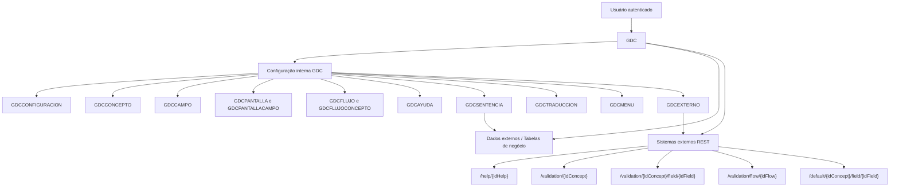
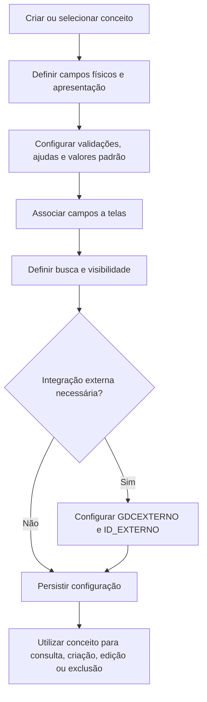

# Guia de Desenvolvimento TRON GDC — Configuração de Conceitos, Campos, Fluxos e Integrações

## 1. Metadados do Documento
- **Arquivo de Origem:** Não identificado; conteúdo extraído de documentação Reef/Mapfre.
- **Tipo de Documento:** Manual Operacional e Especificação Técnica.
- **Domínio / Sistema:** TRON GDC — gestão/configuração de conceitos lógicos.
- **Público-Alvo:** Administradores GDC, desenvolvedores, arquitetos, operação e analistas funcionais.
- **Data/Versão Identificada:** Não identificada.

---

## 2. Resumo Executivo & Contexto de Negócio

O documento descreve o GDC como uma aplicação de parametrização para manutenção de conceitos lógicos respaldados por uma ou mais tabelas de banco de dados. O GDC permite configurar a estrutura de conceitos, campos, telas, fluxos, menus, validações, ajudas, formatos, traduções, sentenças de banco de dados e integrações com sistemas externos.

A configuração separa dados internos do GDC — usados para definir a aplicação e mantidos pelo próprio GDC — dos dados externos, onde residem os conceitos lógicos e as fontes de dados de ajudas. Todos os campos físicos que compõem as tabelas de um conceito, inclusive companhia e auditoria, devem possuir definição correspondente na configuração do GDC.

O modelo suporta versionamento por data para conceitos, campos, telas e fluxos. Para cada entidade versionada, a definição válida é aquela com a data de versão mais recente. O GDC também admite conceitos distribuídos em múltiplas tabelas, desde que compartilhem a mesma chave primária, mesmo quando as colunas físicas tenham nomes diferentes.

A solução fornece recursos de validação local, por limites, obrigatoriedade, expressão regular, tipo de dado e chamadas REST para lógica funcional externa. Além disso, permite obter valores padrão e listas de valores a partir de valores fixos, consultas de banco de dados, dados do usuário, dados do fluxo ou sistemas externos.

---

## 3. Arquitetura, Componentes & Tecnologias Envolvidas

### Componentes identificados

| Componente | Função |
| :--- | :--- |
| **GDC** | Aplicação de configuração e manutenção de conceitos lógicos. |
| **Origem interna GDC** | Banco/tabelas de configuração administradas pela aplicação. |
| **Origem externa** | Tabelas e dados de negócio que respaldam conceitos lógicos e ajudas. |
| **GDCCONFIGURACION** | Configuração da aplicação por companhia. |
| **GDCCONCEPTO** | Definição dos conceitos lógicos. |
| **GDCCAMPO** | Definição de campos dos conceitos lógicos. |
| **GDCPANTALLA / GDCPANTALLACAMPO** | Seções de formulário e composição de telas. |
| **GDCFLUJO / GDCFLUJOCONCEPTO** | Fluxos e relações hierárquicas entre conceitos. |
| **GDCAYUDA** | Definição de listas de valores e ajudas. |
| **GDCSENTENCIA** | Consultas dinâmicas para ajudas e valores padrão. |
| **GDCEXTERNO** | Sistemas REST externos e credenciais de autenticação básica. |
| **GDCFORMATO** | Formatos e validações por expressão regular. |
| **GDCTRADUCCION** | Traduções e rótulos multilíngues. |
| **GDCMENU** | Menu multinível para conceitos, fluxos e composições. |
| **API de Comunes de TRON** | Serviço genérico de acesso a ajudas TRON. |
| **Swagger fornecido pelo GDC** | Contrato estrutural exigido para os sistemas externos. |



### Fluxo de manutenção de conceito



---

## 4. Regras de Negócio, Especificações Funcionais & Processos

### Regras estruturais fundamentais

1. O GDC permite conceitos lógicos com ou sem campo de companhia.
2. Todos os campos das tabelas físicas que respaldam o conceito devem estar configurados no GDC, inclusive campos ocultos de companhia e auditoria.
3. A exclusão de registros é física: o registro é removido da base de dados.
4. Um conceito pode ser respaldado por múltiplas tabelas; a chave primária deve ser a mesma em todas elas, embora os nomes das colunas possam diferir.
5. A versão válida de conceitos, campos, telas, fluxos e associações é a de maior `FECHA_VERSION`.
6. Um conceito é mantenível por padrão quando `MANTENIBLE` é nulo. Conceitos não manteníveis não aparecem no menu.
7. Para um campo aparecer no formulário de edição, ele deve pertencer a uma tela/seção.
8. Para um campo participar da busca, `NUM_BUSCADOR_LISTADO` deve ser diferente de zero. O valor determina a ordem de exibição.
9. Campos invisíveis também podem participar da busca, por exemplo para aplicar a companhia do usuário como filtro.
10. A busca `LIKE` só se aplica a campos textuais.
11. Validação externa pode executar no cliente quando `MCA_VALIDA_SALIDA = 1`; mesmo sem validação no cliente, a validação ocorre no servidor no momento de salvar.
12. O GDC trata internamente datas no formato ISO-8601 `yyyy-mm-ddThh:mi:ss`.
13. Campos numéricos (`T_TIPO = N`) recebem validação automática de número decimal válido.
14. Para campos de tipo data (`T_TIPO = D`), o GDC valida a validade da data.
15. Campos checkbox sempre enviam algum valor, definido pelas configurações `checkSi` e `checkNo`; portanto, não precisam ser obrigatórios.
16. Valores padrão são aplicados na criação. Em edição, `MCA_VALOR_DEFECTO_ACT` define se o valor existente permanece ou se o padrão é recalculado.
17. Valores padrão podem afetar o formulário de busca quando `MCA_VALOR_DEFECTO_BUS = 1`.
18. Campos dependentes podem recalcular o valor padrão (`ESCENARIO_DEPENDEDE = V`) ou ser limpos (`NULO`) após mudança no campo pai.
19. O evento de validação de campo ocorre ao alterar o campo; para campos texto, existe espera de debounce para evitar chamadas contínuas.
20. Fluxos têm um conceito principal, raiz da árvore. Os conceitos relacionados podem usar, além dos próprios dados, dados do conceito principal selecionado.

### Tipos de campo suportados

| Tipo | Descrição | Parâmetros/Comportamento citado |
| :--- | :--- | :--- |
| `ARE` | Área de texto. | — |
| `TXT` | Campo de entrada textual normal. | Pode usar ajuda em popup. |
| `NUM` | Campo de entrada numérico. | Validação numérica e `NUM_STEP`. |
| `FEC` | Campo de data. | Usa componente de data e `FORMATO_FECHA`. |
| `SEL` | Campo select. | Exibe ajuda como lista selecionável. |
| `RDO` | Radio buttons. | Exibe ajuda como radio buttons. |
| `CHK` | Checkbox. | Usa `checkSi` e `checkNo`. |
| `PAS` | Campo de senha. | — |
| `AUT` | Input com autocompletar. | Mostra descrições; mantém código no campo. |
| `AUM` | Autocompletar de múltipla seleção. | Seleções são adicionadas a uma lista removível. |
| `JSE` | Editor JSON. | `simple` controla string JSON ou estrutura JSON. |
| `RDE` | Radio estendido. | `simple` e `show` para propriedades extras da ajuda. |
| `MAP` | Google Maps. | `simple`, `lat`, `lng`, `zoom`. |
| `FLE` | Arquivos. | `maxsize`, `maxfiles`, `types`, `simple`, `showerror`. |
| `DSE` | Select duplo. | `simple` e `stringify`. |

### Valores padrão

| Tipo | Código | Origem | Valor de configuração |
| :--- | :--- | :--- | :--- |
| Fixo | `F` | Valor estático. | Valor diretamente informado em `VALOR_DEFECTO`. |
| Expressão | `R` | Dados disponíveis no cliente. | `usuario.id`, `usuario.compania`, `sysdate`, `datehms`, `date`. |
| Sentença | `S` | Consulta configurada em `GDCSENTENCIA`. | Identificador da sentença. |
| Sistema externo | `V` | Lógica ad hoc REST. | Identificador do sistema externo. |
| Fluxo | `W` | Campo do conceito pai no fluxo. | Código do campo do formulário do pai. |

### Regras de ajudas

- Uma ajuda é uma lista de valores válidos associável a um campo por `ID_AYUDA`.
- A apresentação depende do tipo de campo: `SEL`, `DSE`, `RDO`, `RDE`, `TXT`, `NUM`, `AUT` ou `AUM`.
- A ajuda pode ter origem fixa (`F`), consulta SQL (`S`) ou sistema externo (`V`).
- Consultas de ajuda devem identificar código com `AS CODE` e descrição com `AS LABEL`.
- Ajudas não diretas exigem que o usuário pesquise antes de visualizar registros.
- Ajudas não diretas são voltadas a grandes volumes e não preenchem descrição quando o usuário digita diretamente um código.
- Na ajuda não direta, `DIRECTA_FILTER` mapeia os filtros: `codigo`, `label` e chaves correspondentes a propriedades em `LABELS_CUSTOM`.
- Para usar a ajuda genérica TRON, a ajuda deve ser do tipo acesso externo, apontar para a API de Comunes de TRON e usar identificador `@`.

### Regras de importação e exportação

- A exportação de conceito exige o código do conceito; a versão é opcional e, na ausência, usa a última versão.
- Sem elementos adicionais, a exportação inclui conceito, campos, telas e associações tela-campo.
- Com elementos adicionais, inclui também sentenças, ajudas, formatos, traduções e sistemas externos vinculados.
- Existem exportações `CSV` para importação pelo GDC e `SQL` para importação manual no banco.
- A importação gera arquivo CSV de erros, vazio quando não há falhas.
- `Atualizar se existe` vem marcado por padrão; quando desmarcado, duplicidades são registradas com `EXISTS`.
- O arquivo de importação de conceito possui:
  1. Linha 1: `GDC_CONCEPT,`
  2. Linha 2: campos separados por vírgula.
  3. Linhas seguintes: valores entre aspas duplas, separados por vírgula.
- Aspas duplas em valores são escapadas por outra aspa dupla.
- O formato de data para importação é ISO-8601 estendido.

---

## 5. Tabelas de Parâmetros, Ambientes e Estruturas de Dados

### Tabelas internas do GDC

| Item / Parâmetro | Descrição / Função | Tipo / Valores / Formato | Ambiente / Observações |
| :--- | :--- | :--- | :--- |
| `GDCCONFIGURACION` | Configuração da aplicação por companhia. | `COD_CIA`, `PROPIEDAD`, `VALOR`. | Carregada por serviço ao acessar a aplicação. |
| `GDCEXTERNO` | Sistemas externos para validações, ajudas e valores padrão. | URL, usuário e senha de autenticação básica. | Acesso REST externo. |
| `GDCSENTENCIA` | Sentenças de banco para ajudas e valores padrão. | Campos de código, label, entrada e customização. | Suporta tabela temporária entre parênteses. |
| `GDCFORMATO` | Formatos e validação por regex. | `FORMATO`, `PATRON`, `NUM_STEP`, `MENSAJE`. | Pode definir valores de checkbox. |
| `GDCTIPOCAMPO` | Tipos de campo aceitos pelo GDC. | `TIPO_CAMPO`, `DESCRIPCION`. | Não criar novos tipos sem desenvolvimento. |
| `GDCAYUDA` | Definições de ajudas reutilizáveis. | Tipos `S`, `F`, `V`; JSON para valores fixos. | Ajudas administrativas são externas. |
| `GDCCONCEPTO` | Conceitos lógicos mantidos pelo GDC. | Versão, widget externo, validação e manutenção. | Pode representar uma ou mais tabelas. |
| `GDCCAMPO` | Campos de conceitos lógicos. | Apresentação, validação, banco, ajuda, padrões e estilos. | Deve refletir todos os campos físicos. |
| `GDCPANTALLA` | Seções de um formulário de conceito. | Identificador, ordem, versão e label. | Organiza usabilidade do formulário. |
| `GDCPANTALLACAMPO` | Associação de campos às telas. | Tela, índice, versão, campo e `DIV`. | Define posição do campo na seção. |
| `GDCTRADUCCION` | Traduções da aplicação. | `LABEL`, `IDIOMA`, `TEXTO`. | Usada em rótulos e mensagens. |
| `GDCFLUJO` | Definição de fluxos. | Código, versão, ID externo e validação externa. | Fluxo identificado por companhia. |
| `GDCFLUJOCONCEPTO` | Árvore de conceitos em fluxos. | Conceito, pai e expressão selecionada. | Conceito sem pai é a raiz. |
| `GDCMENU` | Estrutura de menu multinível. | Fluxo `F`, conceito `C`, composição `P`. | Relação por `ID_MENU_PADRE`. |

### Configurações GDC

| Parâmetro | Descrição / Função | Tipo / Valores / Formato | Ambiente / Observações |
| :--- | :--- | :--- | :--- |
| `checkNo` | Valor enviado por checkbox desmarcado. | Valor configurado. | Aplicável a campos `CHK`. |
| `checkSi` | Valor enviado por checkbox marcado. | Valor configurado. | Aplicável a campos `CHK`. |
| `dateFormat` | Formato padrão de data em tela. | `YYYY`, `YY`, `MM`, `MMM`, `DD`, `Do`, `DDD`, `HH`, `hh`, `mm`, `ss`. | É substituído por `FORMATO_FECHA` do campo quando informado. |
| `fecActu` | Formato de data de auditoria ao usar `sysdate`. | `date` ou `datehms`. | Padrão sem configuração: data com hora. |
| `numericCharacters` | Separadores numéricos nos listados. | Primeiro caractere decimal; segundo caractere milhar. | Exemplo `.,`: decimal ponto, milhar vírgula. |

### Campos relevantes de `GDCCAMPO`

| Item / Parâmetro | Descrição / Função | Tipo / Valores / Formato | Ambiente / Observações |
| :--- | :--- | :--- | :--- |
| `COD_WIDGET` | Código interno do conceito. | Identificador. | Parte da chave lógica de configuração. |
| `COD_CAMPO` | Código do campo. | Maiúsculas. | Usado por formulários e serviços externos. |
| `TIPO_CAMPO` | Componente visual. | `ARE`, `TXT`, `NUM`, `FEC`, etc. | Tipos suportados listados na seção 4. |
| `FORMATO` | Referência à validação regex. | ID em `GDCFORMATO`. | Também controla valores de `CHK`. |
| `MCA_MAYUSCULAS` | Converte edição em maiúsculas. | `0` ou `1`. | Aplicado no cliente. |
| `MCA_OBLIGATORIO` | Campo obrigatório. | `0` ou `1`. | — |
| `MCA_VISIBLE` | Visibilidade no formulário. | `0` ou `1`. | Campo invisível pode participar da busca. |
| `MCA_MODIFICABLE` | Permite edição. | `0` ou `1`. | Não modificável aparece desabilitado. |
| `T_TABLA` | Tabelas que respaldam o conceito. | Lista separada por vírgula. | Pode conter múltiplas tabelas. |
| `T_COLUMNA` | Colunas físicas correspondentes. | Lista separada por vírgula. | Deve acompanhar a quantidade de tabelas. |
| `T_PK` | Indica chave primária. | Indicador. | Deve ser PK em todas as tabelas relacionadas. |
| `T_TIPO` | Tipo físico de dado. | `N`, `S`, `D`. | Deve ser igual em todas as tabelas relacionadas. |
| `NUM_BUSCADOR_LISTADO` | Participação e ordem na busca. | `0`, positivo ou negativo. | Diferente de zero participa. |
| `MCA_BUSCADOR_LIKE` | Busca aproximada. | `0` ou `1`. | Apenas textos. |
| `MAX_VAL` | Máximo numérico ou comprimento máximo. | Número. | Interpretação depende de `T_TIPO`. |
| `MIN_VAL` | Mínimo numérico ou comprimento mínimo. | Número. | Interpretação depende de `T_TIPO`. |
| `COD_CAMPO_DEPENDEDE` | Campo pai de dependência. | Código de campo. | Campo do mesmo conceito. |
| `ESCENARIO_DEPENDEDE` | Reação à alteração do pai. | `NULO` ou `V`. | Limpa ou recalcula padrão. |
| `ID_AYUDA` | Ajuda associada ao campo. | ID em `GDCAYUDA`. | — |
| `TIPO_VALOR_DEFECTO` | Origem do valor padrão. | `F`, `S`, `V`, `R`, `W`. | — |
| `MCA_ENCRIPTAR` | Armazenamento criptografado. | Indicador. | Documento não detalha mecanismo criptográfico. |
| `CSS` | Classes CSS específicas. | JSON de dois níveis. | `formulario` ou `buscador`. |
| `STYLES` | Estilos inline adicionais. | JSON de dois níveis. | Complementa estilos existentes. |
| `PARAMETROS` | Parâmetros por tipo de campo. | JSON. | Exemplo para upload: tamanho, arquivos e tipos. |

### Serviços REST externos

| Serviço | Rota relativa | Entrada | Saída | Observações |
| :--- | :--- | :--- | :--- | :--- |
| Ajuda | `/help/{idHelp}` | `DataIn`: `user`, `data`. | Array `HelpValue`. | Retorna `code`, `label`, `custom`. |
| Validação de conceito | `/validation/{idConcept}` | `DataInExtended`: `user`, `data`, `dataOld`. | Array `ValidationError`. | `dataOld` é vazio/nulo para criação. |
| Validação de campo | `/validation/{idConcept}/field/{idField}` | `DataIn`. | Array `ValidationError`. | Recebe formulário completo, não só o campo. |
| Validação de fluxo | `/validation/flow/{idFlow}` | `DataIn`. | Array `ValidationError`. | `data` é o valor do conceito principal. |
| Valor padrão de campo | `/default/{idConcept}/field/{idField}` | `DataIn`. | `DefaultValue`. | Retorna propriedade `value`. |

### Estruturas de integração

| Estrutura | Campo | Tipo | Descrição |
| :--- | :--- | :--- | :--- |
| `DataIn` | `user` | `UserInfo` | Dados do usuário conectado. |
| `DataIn` | `data` | `any` | Dados do formulário em tela. |
| `DataInExtended` | `dataOld` | `any` | Dados originais em edição; nulo/vazio em criação. |
| `HelpValue` | `code` | `string` | Código retornado pela ajuda. |
| `HelpValue` | `label` | `string` | Rótulo/descrição retornada. |
| `HelpValue` | `custom` | `any` | Propriedades extras em JSON. |
| `ValidationError` | `code` | `string` | Código/mensagem do erro. |
| `ValidationError` | `field` | `string` | Campo originador do erro. |
| `ValidationError` | `value` | `string` | Valor que originou o erro. |
| `ValidationError` | `format` | `string` | Condição usada para completar mensagem. |
| `ValidationError` | `vformat` | `string` | Valor da condição. |
| `DefaultValue` | `value` | `string` | Valor padrão encontrado. |

---

## 6. Bateria de Perguntas & Respostas para RAG (FAQ Sintético)

### P1: O que é um conceito lógico no GDC?
**R:** Um conceito lógico é a unidade básica de configuração do GDC. Ele representa dados mantidos pela aplicação e é respaldado por uma ou mais tabelas de banco de dados. Cada campo físico das tabelas que respaldam o conceito deve possuir uma definição correspondente em `GDCCAMPO`, inclusive campos ocultos como companhia e auditoria.

### P2: Como o GDC determina qual versão de um conceito ou campo deve ser utilizada?
**R:** O GDC usa o campo `FECHA_VERSION`. Para conceitos, campos, telas, fluxos e suas associações, a definição válida é a que possui a data de versão mais recente.

### P3: Um conceito GDC pode ser suportado por várias tabelas?
**R:** Sim. O GDC permite conceitos lógicos divididos em múltiplas tabelas. A chave primária deve ser a mesma em todas as tabelas, ainda que as colunas físicas tenham nomes diferentes. Em `GDCCAMPO`, as tabelas são registradas em `T_TABLA` e as colunas correspondentes em `T_COLUMNA`, separadas por vírgulas.

### P4: Quais formas de validação de campo existem no GDC?
**R:** O GDC suporta validações fixas por obrigatoriedade, mínimo e máximo; validação de data; validação automática de valores numéricos; validação por expressão regular via `GDCFORMATO`; e validação funcional externa via serviço REST identificado por `ID_EXTERNO`.

### P5: Como funciona a validação externa de um conceito?
**R:** O GDC chama a rota `/validation/{idConcept}` do sistema externo configurado. A chamada recebe dados do usuário, dados atuais do formulário e, em edição, dados originais em `dataOld`. A resposta é uma lista de `ValidationError`; uma lista vazia indica ausência de erros.

### P6: Quais são as origens possíveis para valores padrão de campos?
**R:** Os valores padrão podem ser fixos (`F`), derivados de dados do cliente como `usuario.id`, `usuario.compania`, `sysdate`, `datehms` e `date` (`R`), obtidos por sentença de banco (`S`), calculados por sistema externo (`V`) ou recebidos de campo de conceito pai em um fluxo (`W`).

### P7: Como configurar um campo invisível para filtrar resultados pela companhia do usuário?
**R:** O campo deve ser obrigatório, invisível e não modificável; deve participar da busca com `NUM_BUSCADOR_LISTADO` diferente de zero; deve ter tipo de valor padrão `R`, valor `usuario.compania`; e `MCA_VALOR_DEFECTO_BUS` deve estar marcado para aplicar o valor também ao formulário de busca.

### P8: Qual a diferença entre ajuda direta e ajuda não direta?
**R:** A ajuda direta mostra valores imediatamente. A ajuda não direta exige que o usuário execute uma busca antes de visualizar resultados, sendo adequada para listas volumosas. A ajuda não direta usa `DIRECTA_FILTER` para mapear campos de busca, e não completa a descrição quando o usuário digita diretamente um código.

### P9: Como uma ajuda de banco de dados deve ser estruturada?
**R:** A sentença configurada em `GDCSENTENCIA` deve expor o valor de código como `AS CODE` e a descrição como `AS LABEL`. Campos adicionais podem ser definidos em `CAMPOS_CUSTOM` como JSON. Parâmetros de entrada são configurados em `CAMPOS_IN`.

### P10: Como o GDC organiza campos no formulário de edição?
**R:** O GDC usa `GDCPANTALLA` para definir seções e `GDCPANTALLACAMPO` para associar campos às seções, com ordenação por `INDICE_ELEMENTO`. Um campo que precisa aparecer no formulário deve estar associado a pelo menos uma tela.

### P11: Como funcionam fluxos no GDC?
**R:** Um fluxo é uma associação hierárquica de conceitos. Existe um conceito principal sem pai, que forma a raiz da árvore. Os demais conceitos têm um `COD_WIDGET_PADRE`. Cada conceito no fluxo pode usar seus próprios dados e os dados do conceito principal selecionado.

### P12: O que é removido quando um conceito é excluído?
**R:** A exclusão de conceito remove o conceito selecionado, seus campos, telas, associações entre telas e campos e os menus diretos associados ao conceito. O documento também estabelece que o borrado é físico no banco de dados.

---

## 7. Glossário de Termos, Siglas & Conceitos-Chave

- **GDC:** Aplicação de configuração e manutenção de conceitos lógicos.
- **TRON:** Contexto tecnológico que disponibiliza, entre outros elementos, uma API de Comunes para ajudas.
- **Conceito lógico:** Entidade configurável no GDC, respaldada por uma ou mais tabelas físicas.
- **Widget:** Identificador de conceito usado em integrações externas.
- **Ajuda:** Lista de valores permitidos para um campo.
- **Sentença:** Consulta dinâmica de banco de dados usada para ajudas ou valores padrão.
- **Fluxo:** Associação hierárquica de conceitos, organizada como árvore.
- **MCA:** Prefixo de indicadores/flags de configuração.
- **PK:** Chave primária de tabela.
- **BBDD:** Base de dados.
- **CSV:** Formato de exportação e importação de dados do GDC.
- **ISO-8601:** Formato de data interno do GDC: `yyyy-mm-ddThh:mi:ss`.
- **REST:** Estilo de serviços externos invocados pelo GDC.
- **Swagger:** Definição de contrato de serviços fornecida para integrações externas.
- **`COD_CIA`:** Código da companhia do usuário autenticado.
- **`COD_WIDGET`:** Código interno do conceito lógico.
- **`ID_WIDGET`:** Identificador alfanumérico do conceito informado a sistemas externos.
- **`ID_EXTERNO`:** Identificador de um sistema externo configurado no GDC.
- **`MCA_VALIDA_SALIDA`:** Indica se uma validação externa também ocorre no cliente.
- **`MCA_VALOR_DEFECTO_BUS`:** Define se o valor padrão também se aplica à busca.
- **`MCA_VALOR_DEFECTO_ACT`:** Define se o valor padrão é recalculado em edição.
- **`DIRECTA_FILTER`:** Mapeamento de filtros para ajudas não diretas.

---

## 8. Notas Críticas, Riscos & Limitações

- O documento informa que a exclusão é física; essa característica exige controles operacionais antes de exclusões.
- Campos de todos os dados físicos devem ser configurados no GDC, inclusive campos ocultos. Configuração incompleta pode impedir manutenção adequada de conceitos.
- A definição de novos tipos em `GDCTIPOCAMPO` não é recomendada, pois exige desenvolvimento para renderização na aplicação.
- O uso de `TEMPLATE` em campos também pressupõe desenvolvimento prévio pela equipe de aplicação.
- Campos criptografados são identificados por `MCA_ENCRIPTAR`, mas o documento não descreve algoritmo, gerenciamento de chaves, escopo de criptografia ou procedimento de rotação.
- Sistemas externos são configurados com URL, usuário e senha de autenticação básica; o documento não detalha gestão, proteção, rotação ou armazenamento seguro dessas credenciais.
- A URL `http://localhost:8080` aparece apenas como exemplo de sistema externo, não como endpoint corporativo de produção.
- A aplicação depende de permissões do usuário de banco do GDC e de sinônimos para localizar e manter tabelas de outros esquemas.
- A ordem dos campos em seção gerada automaticamente não é fixa; depende da resposta do banco de dados.
- Conceitos não manteníveis são associados a fluxos estendidos, mas o documento referencia documentação externa para detalhar esse recurso.
- O documento menciona composições no menu (`TIPO_ENTIDAD = P`), mas não detalha sua estrutura ou comportamento.
- O documento lista o contrato Swagger para sistemas externos, porém não apresenta a especificação Swagger literal completa.

---

## 9. Conteúdo Bruto Estruturado (Referência Fiel)

```text
--- [PÁGINAS 1 A 3 DE 62] ---

Título identificado: “TRON GDC guía de desarrollo”.

O índice apresenta tópicos sobre introdução, modelo de dados, configuração do GDC, conceitos, campos, telas, fluxos, menu, formatos, ajudas, sentenças, sistemas externos, exemplos de criação, importação/exportação, estilos personalizados e geração automática de conceitos.

Introdução literal relevante:
“El presente documento pretende actuar como guía en la configuración de conceptos dentro de GDC, detallando el modelo de datos y las diferentes opciones de configuración que permite la aplicación, así como su impacto en la visualización de la misma.”

--- [PÁGINAS 4 A 13 DE 62] ---

Características e limitações:
- GDC permite conceitos lógicos com e sem campo de companhia.
- Todos os campos/colunas do conceito lógico devem ser referenciados na configuração GDC, inclusive companhia e auditoria.
- O borrado elimina fisicamente o registro em banco.
- Conceitos podem abranger várias tabelas com a mesma chave primária.

Fontes de dados:
- Interna: tabelas próprias do GDC, mantidas pela aplicação.
- Externa: conceitos lógicos, dados origem de ajudas e demais dados.

Tabelas definidas:
GDCCONFIGURACION, GDCEXTERNO, GDCSENTENCIA, GDCFORMATO,
GDCTIPOCAMPO, GDCAYUDA, GDCCONCEPTO, GDCCAMPO,
GDCPANTALLA, GDCPANTALLACAMPO, GDCTRADUCCION,
GDCFLUJO, GDCFLUJOCONCEPTO e GDCMENU.

--- [PÁGINAS 13 A 20 DE 62] ---

Configurações:
- checkNo: valor de checkbox não marcado.
- checkSi: valor de checkbox marcado.
- dateFormat: formato padrão de data.
- fecActu: `date` ou `datehms`.
- numericCharacters: primeiro caractere para decimal; segundo para milhares.

Conceitos:
- `COD_CIA` é recuperado do usuário conectado.
- `COD_WIDGET` é identificador interno único por companhia.
- A versão mais recente prevalece.
- `LABEL` pode ser texto ou referência a tradução.
- `NUM_REGISTROS_MAX` limita registros recuperados.
- Conceitos administrativos criados pelo usuário são externos.
- Conceito não mantenível não aparece no menu.

Campos:
- Todos os campos físicos devem ser refletidos no GDC.
- Tipos citados: ARE, TXT, NUM, FEC, SEL, RDO, CHK, PAS, AUT, AUM, JSE, RDE, MAP, FLE e DSE.
- As validações incluem obrigatoriedade, máximo, mínimo, data, regex, número e serviço REST.

--- [PÁGINAS 20 A 33 DE 62] ---

Busca:
- Campo participa quando `BUSCADOR <> 0`.
- Ordem do número define posição.
- Campos invisíveis podem participar da busca.
- `LIKE` aplica-se apenas a texto.

Ajudas:
- Podem ser fixas, por sentença ou por acesso externo.
- Podem ser renderizadas como select, radio, popup, autocomplete ou seleção múltipla.
- TXT e NUM usam popup de seleção, com filtro exato por código e aproximado por descrição.
- AUT exibe texto com autocomplete; AUM mantém lista de valores selecionados.

Dependência:
- Campo depende de outro pelo atributo `COD_CAMPO_DEPENDEDE`.
- Cenário `V` recalcula padrão; outro comportamento limpa o campo.

Telas:
- São seções do formulário.
- Todo campo exibido no formulário precisa estar associado a tela.

Fluxos:
- São associações de conceitos baseadas no conceito pai.
- Há um conceito principal que é raiz da árvore.
- Conceitos relacionados podem usar seus dados e dados do conceito principal.

--- [PÁGINAS 34 A 43 DE 62] ---

Formatos:
- `PATRON` contém regex.
- `NUM_STEP` define incremento HTML5 para números.
- `MENSAJE` pode ser tradução.

Ajudas não diretas:
- Exigem busca prévia.
- Adequadas para grande volume.
- Requerem configuração de mapeamentos para filtros.

Sentenças:
- Consultas podem fornecer ajudas e valores padrão.
- Campos de entrada podem vir do usuário ou do formulário.
- Dados de usuário: `usuario.id`, `usuario.compania`, `usuario.idioma`.

Sistemas externos:
- URL base, usuário e password com autenticação básica.
- Rotas:
  /help/{idHelp}
  /validation/{idConcept}
  /validation/{idConcept}/field/{idField}
  /validation/flow/{idFlow}
  /default/{idConcept}/field/{idField}

--- [PÁGINAS 43 A 56 DE 62] ---

Exemplo de conceito:
- Tabela `NUEVOCONCEPTO`.
- Chave primária: `(COD_CIA, CODIGO)`.
- Campos de companhia e auditoria são ocultos e obtidos por padrão.
- `COD_CIA` usa `usuario.compania`.
- `COD_USR` usa `usuario.id`.
- `FEC_ACTU` usa `sysdate` ou `date`.
- Campo `CODIGO` pode ser preenchido por sentença com máximo existente mais um.
- Campo `TIPO` utiliza ajuda fixa JSON.
- `FECHA_VIGENCIA` usa formato de data de tela.
- `MCA_ACTIVO` é exibido como checkbox.
- `REFERENCIA` usa ajuda baseada em sentença.
- `CODIGO_EXTERNO` pode usar formato regex.

Exemplo de fluxo:
- Tabela relacionada `NUEVOCONCEPTOASOC`.
- Campo associado ao conceito pai pode ser oculto, obrigatório, participante da busca e preenchido por valor de tipo Fluxo (`W`).
- O conceito principal não recebe pai.
- Conceitos restantes recebem pai para compor árvore e navegação linear.

--- [PÁGINAS 57 A 62 DE 62] ---

Exportação:
- Exporta conceito, campos, telas e relações.
- Com elementos adicionais: sentenças, ajudas, formatos, traduções e sistemas externos.
- Formatos: CSV e SQL.

Importação:
- Aceita CSV por seleção ou arrastar arquivo.
- Produz CSV de erros.
- Permite atualizar registros existentes.
- Arquivo de importação começa com `GDC_CONCEPT,`.

Estilos personalizados:
- Podem ser folha externa publicada em servidor ou CSS inserido diretamente.
- Existe indicador para desabilitar estilos sem apagar configuração.

Geração automática:
- Procura tabelas pelo nome, inclusive `ESQUEMA.TABELA`.
- Requer permissões de banco e sinônimo para manutenção.
- Cria conceito e campos baseado nos atributos da tabela.
- Tipos automáticos: `NUM` para número, `FEC` para datas, `TXT` para os demais.
- Usa NOT NULL como obrigatoriedade.
- Inclui no buscador apenas campos de chave primária.
- Reconhece `COD_CIA` ou `CMP_VAL` como companhia.
- Reconhece `USR_VAL` ou `COD_USR` como auditoria de usuário.
- Reconhece `FEC_ACTU` ou `MDF_DAT` como auditoria de data.
- Cria uma tela única; a ordem dos campos depende da resposta do banco.
```
