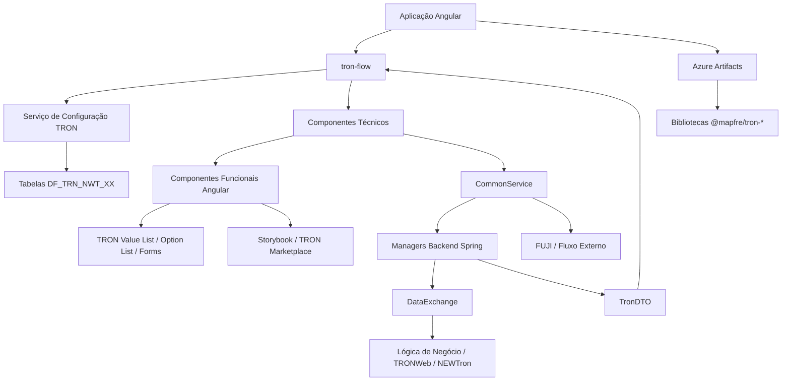
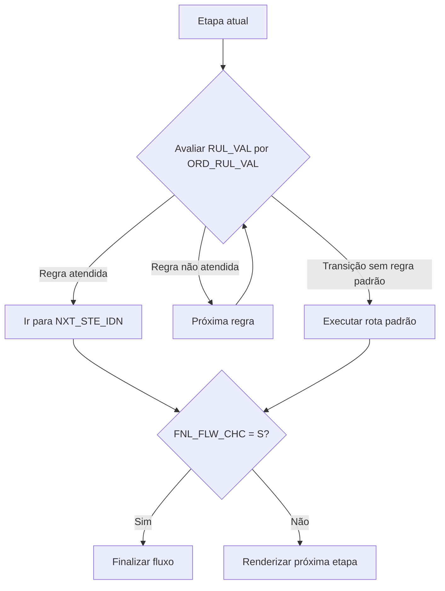
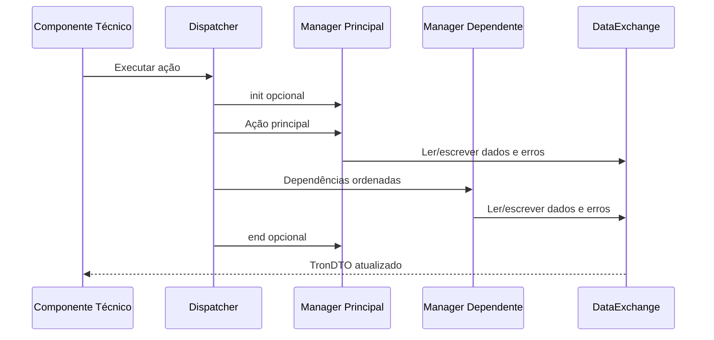

# Guia de Desenvolvimento de Microfrontends TRON — Parametrização, Componentes Angular e Managers Backend

## 1. Metadados do Documento
- **Arquivo de Origem:** Não identificado no texto extraído
- **Tipo de Documento:** Especificação Técnica / Guia de Desenvolvimento
- **Domínio / Sistema:** TRON new front architecture / MAPFRE
- **Público-Alvo:** Desenvolvedores Angular e Java, arquitetos, analistas funcionais e equipes de operação
- **Data/Versão Identificada:** Não identificada

---

## 2. Resumo Executivo & Contexto de Negócio

O documento descreve o modelo de desenvolvimento da arquitetura **TRON new front**, orientado à construção de fluxos de frontend por parametrização. O objetivo central é permitir que analistas e desenvolvedores implementem fluxos compostos por telas, objetos de negócio, componentes técnicos, ações e regras de navegação com pouco ou nenhum código novo no frontend.

A arquitetura separa responsabilidades entre componentes funcionais Angular, componentes técnicos reutilizáveis e managers backend Spring. Os componentes funcionais representam objetos de negócio e são registrados no frontend; os componentes técnicos controlam apresentação, ações, listas, navegação, tabs e agrupamentos; os managers executam ou orquestram a lógica de negócio no servidor.

A reutilização é baseada no repositório de artefatos MAPFRE Azure Artifacts e na documentação centralizada por Storybook, denominada TRON Marketplace. Componentes funcionais podem ser distribuídos como bibliotecas Angular, registrados pela aplicação consumidora e parametrizados por tabelas de fluxo.

A parametrização é persistida em tabelas que definem fluxos, etapas, transições, objetos de tela, ações, dependências entre ações, managers e objetos complexos. Há suporte a personalização por instalação/país e empresa, com `TRN` identificado como a parametrização CORE.

---

## 3. Arquitetura, Componentes & Tecnologias Envolvidas

| Categoria | Elementos identificados | Função documentada |
| :--- | :--- | :--- |
| Frontend | Angular 11 ou superior | Plataforma para aplicações de fluxo TRON. |
| Componentes funcionais | Implementações Angular de `FunctionalInterface` | Representam objetos de negócio e expõem `loadData`, `getData`, `isValid` e, opcionalmente, `valueChanges`. |
| Componentes técnicos | Flow, Action, Wrapper, Editable List, Navigation, Tabs, Side Collapser, Top Information | Renderizam e coordenam objetos funcionais, ações, dados e navegação. |
| Backend | Spring Beans / Managers | Executam lógica de negócio e são associados às ações por parametrização. |
| Persistência de configuração | Tabelas `DF_TRN_NWT_XX_*` | Armazenam a definição de fluxos, telas, transições, objetos, ações, dependências e dispatchers. |
| Artefatos | MAPFRE Azure Artifacts | Repositório de bibliotecas e componentes reutilizáveis. |
| Documentação | Storybook / TRON Marketplace | Documentação interativa de componentes funcionais. |
| Tradução | `@ngx-translate/core` | Tradução de labels e textos. |
| Dados tabulares | AG Grid | Dependência do componente `tron-list-editable`. |
| Formatação | Moment, ngx-currency, Bootstrap 4.6.0, `tron-material-theme` | Datas, números, moeda e estilos. |
| Integrações externas | FUJI / External Flow | Início, finalização e redirecionamento de fluxos entre aplicações. |
| Cache | Spring Cache, GaiaCache, Ehcache | Cache opcional compatível com Spring. |



### Bibliotecas frontend citadas

| Biblioteca | Função |
| :--- | :--- |
| `@mapfre/tron-commons` | Elementos comuns, `CommonService`, registro de componentes, spinner, interceptor de erros. |
| `@mapfre/tron-flow` | Componente principal de fluxo. |
| `@mapfre/tron-action` | Componentes Action e Wrapper. |
| `@mapfre/tron-list-editable` | Listas editáveis. |
| `@mapfre/tron-navigation` | Navegação de tela e fluxo. |
| `@mapfre/tron-tabs` | Agrupamento de objetos em abas. |
| `@mapfre/tron-option-list` | Listas de opções TRON. |
| `@mapfre/tron-value-list` | Listas de valores TRON. |
| `@mapfre/tron-forms` | Componentes básicos de formulário. |

---

## 4. Regras de Negócio, Especificações Funcionais & Processos

### 4.1 Definição e navegação de fluxos

1. Um fluxo deve ser definido nas tabelas de fluxo, etapas e transições.
2. As transições podem possuir uma regra em `RUL_VAL`, avaliada contra o DTO da tela.
3. `ORD_RUL_VAL` determina a sequência de avaliação das regras de transição.
4. Uma transição sem regra, com a menor ordem aplicável, pode atuar como rota padrão.
5. `FNL_FLW_CHC` indica que uma transição conduz a uma etapa final.
6. A propriedade `INI_CHC` somente se aplica à etapa inicial e adia o início do fluxo até que dados sejam recebidos de outra aplicação por FUJI.
7. `STE_CHC` define se o fluxo exibe stepper.
8. `BCK_STE_CHC` define se o stepper permite retorno a etapas anteriores.



### 4.2 Personalização por país e empresa

- `INS_VAL` identifica a instalação ou país; `TRN` identifica a parametrização CORE.
- `CMP_VAL` identifica a empresa dentro da instalação.
- Registros específicos de país podem sobrescrever registros CORE.
- Para personalizar transições por país, é necessário redefinir **todas** as opções de navegação da etapa de origem. O serviço de navegação mantém a personalização nacional quando ela existe.
- Para personalizar dependências de ações por país, é necessário redefinir **todas** as dependências da ação principal. O serviço de ações mantém a personalização nacional quando ela existe.
- Para alterar a ordem de objetos ou ações em uma tela por país, todos os elementos afetados pela mudança de ordem devem ser redefinidos.
- Para remover um objeto da tela em uma personalização, o documento informa duas opções: definir `TCH_VAL` como nulo ou definir `OPR_STS_TYP_VAL = 2`.

### 4.3 Estados operacionais de objetos

| `OPR_STS_TYP_VAL` | Estado | Efeito documentado |
| :--- | :--- | :--- |
| `0` | Visível e inválido | Habilita Verify em condições padrão; impede Next/Finish padrão. |
| `1` | Visível e válido | Permite navegação padrão quando todos os objetos não estão inválidos. |
| `2` | Não visível | O objeto não é exibido. |
| `3` | Desabilitado | O componente funcional deve desabilitar os elementos de formulário necessários. |

### 4.4 Regras de habilitação de ações

| Contexto | Regra padrão |
| :--- | :--- |
| Navigation: `BACK`, `LEAVE`, `EXIT` | Habilitadas quando presentes. |
| Navigation: `NEXT` e `FINISH` | Habilitadas quando todos os objetos possuem estado diferente de `0`. |
| Navigation: `VERIFY` | Habilitada se algum objeto possuir estado `0`. |
| Action / Editable List: `VERIFY` | Sem `ENB_LGC`, habilitada se o estado do componente for `0`. |
| Action / Editable List: `CANCEL` | Sem `ENB_LGC`, habilitada se o estado for `1`; não chama backend, restaura valor anterior e muda o estado para `0`. |
| Outras ações | Sem função de habilitação, são habilitadas por padrão; em listas com seletor, dependem da seleção de ao menos um registro. |
| Ação com `ENB_LGC` | A função de habilitação sobrescreve o comportamento padrão aplicável. |

### 4.5 Ordem de execução de managers

1. Ações principais são executadas conforme a ordem dos objetos na tela.
2. Ações dependentes são executadas após sua ação principal, conforme `DEP_ACN_ORD`.
3. Ações especiais `init` e `end` são executadas, respectivamente, no início e no fim do bloco da ação principal.
4. Se um manager retorna erro e `MCA_MNR_RUN = S`, managers pendentes não são executados.
5. Se um manager retorna erro e `MCA_MNR_RUN = N`, managers pendentes continuam sendo executados.



### 4.6 Componentes técnicos e códigos `TCH_VAL`

| `TCH_VAL` | Componente técnico | Característica |
| :--- | :--- | :--- |
| `0` | Action | Trabalha com um objeto e ações. |
| `1` | Editable List | Trabalha com listas de registros. |
| `2` | Tabs | Agrupa objetos em várias abas. |
| `3` | Side Collapser | Agrupa objetos em uma área colapsável lateral. |
| `5` | Top Information | Agrupa objetos em área colapsável no topo direito. |
| `6` | Wrapper | Trabalha com um objeto sem ações; atualiza dados e validade automaticamente. |

### 4.7 Editable List

- O componente usa `TCH_VAL = 1`.
- O atributo obrigatório `stateProperty`, cujo padrão é `acnTypVal`, armazena o estado do registro.
- A propriedade `<stateProperty>___old` é reservada para uso interno.
- Estados de registro:
  - `0` ou não informado: não modificado;
  - `1`: novo;
  - `2`: modificado;
  - `3`: apagado.
- `onDelete = true` remove o registro efetivamente.
- `onDelete = false` marca o registro como apagado.
- `select` habilita seleção múltipla.
- `radio` habilita seleção simples.
- `selectOnly` envia apenas os registros selecionados às ações.
- `selectProperty` identifica a propriedade booleana usada para armazenar a seleção.
- `maxRows = -1`, conforme a parametrização geral, exibe todos os itens na mesma página; outra seção informa que `maxRows = 0` significa ausência de paginação e renderização com rolagem vertical. Esta diferença deve ser validada contra a versão da biblioteca adotada.

### 4.8 Managers backend e DataExchange

- Cada manager configurado deve existir em código como Spring Bean, por exemplo `@Component` ou `@Service`.
- O manager implementa `Manager.execute(TronDispatcher td)` ou pode estender `BaseManager`.
- O `BaseManager` permite seleção de método conforme `MNR_CPO_FUN` e convenções descritas no documento.
- `DataExchange` possui escopo de requisição e permite:
  - recuperar dados recebidos da tela;
  - publicar dados de saída;
  - compartilhar dados entre managers;
  - registrar erros;
  - emitir alertas, mensagens, arquivos, URI e dados persistentes do fluxo;
  - alterar a navegação do fluxo.

### 4.9 Alteração de navegação pelo manager

| Método / propriedade | Efeito |
| :--- | :--- |
| `stopExit(true)` | Interrompe a navegação ou saída associada à ação. |
| `skipToStep(stepId)` | Sobrescreve a próxima etapa configurada quando ocorre `NEXT`. |
| `nextAsFinish(true)` | Faz `NEXT` ter comportamento de `FINISH`. |
| `startExternalFlow(ExternalFlowDTO)` | Inicia fluxo externo. |
| `setFlowData(key, value)` | Persiste dado compartilhado entre telas do fluxo. |
| `cleanFlowData()` | Limpa dados persistentes do fluxo. |
| `setGlobalCustomData(key, data)` | Disponibiliza dado global para a requisição atual. |

---

## 5. Tabelas de Parâmetros, Ambientes e Estruturas de Dados

### 5.1 Tabelas de parametrização

| Tabela | Finalidade | Chave de personalização indicada |
| :--- | :--- | :--- |
| `DF_TRN_NWT_XX_FLW_SCR` | Definição do fluxo. | `FLW_IDN` |
| `DF_TRN_NWT_XX_FLW_STE` | Telas ou etapas do fluxo. | `FLW_IDN`, `STE_IDN` |
| `DF_TRN_NWT_XX_FLW_TSN` | Transições entre etapas. | `FLW_IDN`, `STE_IDN` |
| `DF_TRN_NWT_XX_FLW_ELM_SCR` | Objetos em tela. | `FLW_IDN`, `STE_IDN`, `CPO_IDN` |
| `DF_TRN_NWT_XX_FLW_ACN_CPO` | Ações de componentes técnicos e navegação. | `FLW_IDN`, `STE_IDN`, `CPO_IDN`, `ACN_IDN_RUN` |
| `DF_TRN_NWT_XX_FLW_ACN_DEP` | Dependências entre ações. | `FLW_IDN`, `STE_IDN`, `CPO_IDN`, `ACN_IDN_RUN` |
| `DF_TRN_NWT_XX_FLW_CFG_DSH` | Dispatcher e managers backend. | `FLW_IDN`, `STE_IDN`, `CPO_IDN`, `ACN_IDN_RUN` |
| `DF_TRN_NWT_XX_FLW_ELM_CPO` | Grupos de objetos complexos, como tabs e side collapser. | Conforme documento: inclui `FLW_IDN`, etapa, objeto principal e ordem do grupo. |
| `DF_TRN_NWT_XX_FLW_ELM_DEP` | Objetos internos de objetos complexos. | `FLW_IDN`, `STE_IDN`, `CPO_IDN` |

### 5.2 Campos principais de fluxo e etapas

| Item / Parâmetro | Descrição / Função | Tipo / Valores / Formato | Ambiente / Observações |
| :--- | :--- | :--- | :--- |
| `INS_VAL` | Identificador de instalação/país. | Texto; `TRN` para CORE. | Usado para personalização por país. |
| `CMP_VAL` | Identificador de empresa. | Número; `999` como padrão. | Permite configuração por empresa. |
| `FLW_IDN` | Identificador de fluxo. | Texto. | Identificador funcional do fluxo. |
| `FLW_DSP` | Descrição administrativa do fluxo. | Texto. | Informativo. |
| `STE_IDN` | Identificador de etapa. | Texto. | Usado em navegação e parametrização. |
| `LBL_STE_VAL` | Label traduzível da etapa. | Tag de tradução. | Aplicação aplica idioma selecionado. |
| `ITA_FLW_CHC` | Indica etapa inicial. | `S` / `N`. | `S` com `FNL_FLW_CHC = S` significa fluxo de uma etapa. |
| `FNL_FLW_CHC` | Indica etapa final. | `S` / `N`. | Pode existir na etapa ou transição. |
| `SCR_PSZ_NAM` | Componente de tela personalizado. | Nome lógico opcional. | Para tela fora do comportamento padrão. |
| `INI_CHC` | Aguarda dados recebidos via FUJI. | `S` / `N`, opcional. | Somente etapa inicial. |

### 5.3 Configuração de objetos, ações e managers

| Item / Parâmetro | Descrição / Função | Tipo / Valores / Formato | Ambiente / Observações |
| :--- | :--- | :--- | :--- |
| `CPO_IDN` | Identificador único do objeto na tela. | Texto. | Usado pela lógica backend para recuperar dados. |
| `ORD_CPO` | Ordem do objeto na tela. | Número. | Também influencia ordem de managers principais. |
| `LBL_CPO` | Label do objeto. | Tag de tradução. | Traduzido pelo frontend. |
| `MCA_CPO_CBC` | Inclusão em accordion. | `S` / `N`. | Aplicável ao componente técnico. |
| `OBJ_TYP_VAL` | Nome Java do objeto de dados. | Texto. | Framework não utiliza; pode ficar vazio. |
| `CFG_TCH_VAL` | Configuração JSON de componente técnico. | JSON. | Interpretada pelo componente técnico. |
| `CFG_FUN_VAL` | Configuração JSON de campos funcionais. | JSON. | Responsabilidade do componente funcional. |
| `DYN_LBL_CPO` | Configuração de label dinâmica. | JSON. | Baseada em dados do objeto funcional. |
| `SHW_MDL` | Exibição em popup. | `S` / `N`. | Exibe objeto como modal. |
| `ACN_IDN_RUN` | Identificador da ação. | Texto. | Possui ações reservadas. |
| `ACN_ORD` | Ordem da ação. | Número. | Navegação possui posições pré-definidas para ações padrão. |
| `ENB_LGC` | Corpo JavaScript de habilitação. | Código de função. | Interface é fornecida pelo componente técnico. |
| `MCA_RGT` | Ação em nível de registro. | `S` / `N`. | Para Editable List. |
| `MNR_CPO` | Nome lógico do Spring Bean. | Texto. | Implementa lógica de negócio. |
| `MCA_MNR_RUN` | Interrompe execução após erro. | `S` / `N`. | `S` aborta managers seguintes. |
| `MNR_CPO_FUN` | Método específico do manager. | Texto opcional. | Requer extensão de `BaseManager`. |
| `MNR_CPO_VAL` | Dados de parametrização para manager. | JSON opcional. | Entregue ao manager. |

### 5.4 Ações reservadas

| Ação | Significado documentado |
| :--- | :--- |
| `BACK` | Retorno pela navegação. |
| `INITIALIZE` | Carregamento ou inicialização prévia da tela. |
| `LEAVE` | Saída pelo botão Leave. |
| `EXIT` | Saída pelo botão Exit. |
| `CANCEL` | Restaura valor anterior sem invocar servidor. |
| `VERIFY` | Verificação de dados. |
| `FINISH` | Finalização do fluxo. |
| `NEXT` | Avanço para próxima etapa. |

### 5.5 DTOs e estruturas de dados

| Estrutura | Campos ou conceitos relevantes |
| :--- | :--- |
| `FieldDTO` | `field`, `vsb`, `mdf`, `req`. Configura visibilidade, edição e obrigatoriedade. |
| `ObjectDTO` | Identificação do fluxo, etapa e objeto; ação de backend; estado; `data`; `custom`; `prc`. |
| `TronDTO` | `cmpVal`, mapa `dto`, `ext`, `errT`, `flowData`, `cleanFlowData`, `stopExit`, `skipToStep`, `asFinish`. |
| `ActionDTO` | `action`, `order`, `label`, `icon`, `logic`, `registry`, `focusTo`. |
| `ViewComponentDTO` | Dados de renderização do objeto, ações, componente técnico, componente funcional, objetos relacionados e label dinâmica. |
| `Message` | `type`, `kind`, `header`, `text` e botões opcionais. |
| `FileDTO` | `name`, `mediaType`, `content`. |
| `ExternalFlowDTO` | `app`, `url`, `data`. |

### 5.6 Configuração backend identificada

| Item / Parâmetro | Descrição / Função | Tipo / Valores / Formato | Ambiente / Observações |
| :--- | :--- | :--- | :--- |
| `com.mapfre.tron.nfront.installation` | Instalação TRON. | Exemplo: `TRN`. | Requerida na aplicação servidor. |
| Bean `com.mapfre.tron.nfront.dao` | DataSource para tabelas de configuração. | Spring Bean. | Necessário para acesso à parametrização. |
| Bean `dataSource` primário | DataSource para procedimentos TW com OSM. | Spring Bean. | Necessário quando OSM é usado. |
| `com.mapfre.tron.nfront.cmnapi.user` | Usuário CMNAPI. | Texto. | Exemplo expõe `APITRON`. |
| `com.mapfre.tron.nfront.cmnapi.pass` | Senha CMNAPI. | Segredo. | Valor não exposto no documento. |
| `com.mapfre.tron.nfront.cmnapi.url` | Endpoint CMNAPI. | URL. | Exemplo presente no conteúdo bruto. |
| `com.mapfre.tron.nfront.cmnapi.timeout` | Timeout CMNAPI. | Exemplo: `5000`. | Unidade não explicitada. |
| `com.mapfre.tron.nfront.cache` | Nome do cache. | Cache Spring. | Pode ser implementado por cache compatível com Spring. |

---

## 6. Bateria de Perguntas & Respostas para RAG (FAQ Sintético)

### P1: Como um fluxo TRON escolhe a próxima tela quando há caminhos condicionais?
**R:** O fluxo consulta as transições cadastradas em `DF_TRN_NWT_XX_FLW_TSN`. A regra `RUL_VAL` é avaliada contra o DTO da tela atual, e `ORD_RUL_VAL` define a ordem de avaliação. Uma transição sem regra pode ser configurada como rota padrão, desde que possua a menor ordem aplicável.

### P2: Qual é a diferença entre um componente funcional e um componente técnico na arquitetura TRON?
**R:** O componente funcional Angular representa o objeto de negócio e implementa `FunctionalInterface`, disponibilizando dados, carregamento e validação. O componente técnico controla a apresentação e a integração desse objeto com ações, navegação, listas, tabs ou agrupamentos. Exemplos de componentes técnicos são Action, Editable List, Wrapper e Navigation.

### P3: Como personalizar a navegação de um fluxo para um país específico?
**R:** Deve-se cadastrar uma parametrização com o `INS_VAL` do país, sobrescrevendo a definição CORE identificada por `TRN`. Para transições, a personalização nacional deve redefinir todas as possibilidades de navegação de cada etapa de origem, pois o serviço mantém a configuração específica do país quando ela existe.

### P4: O que ocorre quando um manager backend retorna erro?
**R:** O comportamento depende de `MCA_MNR_RUN`. Se estiver como `S`, a execução dos managers pendentes é interrompida e o estado atual retorna ao frontend. Se estiver como `N`, os managers pendentes continuam sendo executados.

### P5: Como o estado `OPR_STS_TYP_VAL` afeta a navegação?
**R:** Estado `0` representa objeto visível e inválido; `1`, visível e válido; `2`, oculto; e `3`, desabilitado. As ações padrão `NEXT` e `FINISH` são habilitadas quando todos os objetos da tela têm estado diferente de `0`. A ação `VERIFY` é habilitada quando ao menos um objeto está inválido.

### P6: Como funciona a ação `CANCEL` nos componentes TRON?
**R:** Sem uma função `ENB_LGC`, `CANCEL` fica habilitada quando o estado do componente é válido (`OPR_STS_TYP_VAL = 1`). Ela não invoca o backend: restaura o valor anterior do objeto e altera o estado para inválido (`OPR_STS_TYP_VAL = 0`).

### P7: Como registrar um componente funcional para uso pela parametrização?
**R:** A aplicação deve usar `ComponentFactoryService`, disponibilizado por `@mapfre/tron-commons`, e registrar o componente com um nome lógico. Esse nome é posteriormente informado na configuração funcional do objeto de tela para que o frontend consiga localizar a implementação Angular correspondente.

### P8: Como um manager envia dados, erros ou alterações de comportamento para a tela?
**R:** O manager utiliza o Spring Bean `DataExchange`. Entre os métodos documentados estão `getData`, `setDataExit`, `getDataExit`, `addError`, `setActionUri`, `setCustom`, `getCustom`, `setFlowData`, `skipToStep` e `setFile`. O manager pode também devolver `ObjectDTO.prc` para alterar visibilidade, obrigatoriedade ou edição de campos.

### P9: Qual tabela associa uma ação a um manager backend?
**R:** A associação é registrada em `DF_TRN_NWT_XX_FLW_CFG_DSH`. Essa tabela informa o nome lógico do Spring Bean em `MNR_CPO`, o comportamento de interrupção por erro em `MCA_MNR_RUN`, o método opcional em `MNR_CPO_FUN` e os parâmetros JSON em `MNR_CPO_VAL`.

### P10: Como são modelados tabs e side collapser?
**R:** O objeto principal deve existir em `DF_TRN_NWT_XX_FLW_ELM_SCR`. A composição do objeto complexo é definida em `DF_TRN_NWT_XX_FLW_ELM_CPO`, e seus objetos internos são definidos em `DF_TRN_NWT_XX_FLW_ELM_DEP`. Tabs podem possuir múltiplas entradas; Side Collapser possui uma única entrada de grupo.

### P11: Como funciona a seleção de registros no Editable List?
**R:** `select` habilita seleção múltipla e `radio` habilita seleção simples. `selectProperty` define a propriedade que armazena o estado booleano de seleção, e `selectOnly` restringe o valor enviado às ações aos registros selecionados. O componente funcional deve preservar a propriedade configurada para não perder a seleção.

### P12: Como iniciar um fluxo externo?
**R:** O frontend pode usar `CommonService.startExternalFlow`, informando aplicação, URL relativa e dados. A configuração deve conter entradas `app.env.externalFlow.XXX=YYY`, onde `XXX` é o identificador da aplicação e `YYY` sua URL-base. O documento também descreve mapeamentos por `app.env.externalFlowMapping.XXX.N`.

---

## 7. Glossário de Termos, Siglas & Conceitos-Chave

- **Action:** Componente técnico para um único objeto com ações associadas.
- **Azure Artifacts:** Repositório MAPFRE de artefatos e bibliotecas.
- **BaseManager:** Implementação base para managers que permite resolução de métodos de lógica.
- **BM25:** Método de recuperação lexical; pertinente ao uso do documento em busca híbrida, mas não descrito pelo documento de origem.
- **CMNAPI:** Serviço de configuração citado nas propriedades de backend.
- **CommonService:** Serviço de `@mapfre/tron-commons` para dados de usuário, ações, fluxo externo e integração de componentes.
- **CORE:** Parametrização base identificada pela instalação `TRN`.
- **DataExchange:** Componente Spring de escopo de requisição para troca de dados entre tela, managers e resposta de serviço.
- **DTO:** Data Transfer Object.
- **FUJI:** Ambiente ou mecanismo citado para integração, recebimento de dados e eventos de saída entre aplicações.
- **Manager:** Spring Bean que executa ou orquestra lógica backend associada a ações parametrizadas.
- **MCA_MNR_RUN:** Indicador que define se erro de manager interrompe managers pendentes.
- **NFRONT / TRON new front:** Arquitetura de frontend descrita no documento.
- **ObjectDTO:** DTO de um objeto funcional em tela.
- **RUL_VAL:** Regra utilizada para determinar uma transição.
- **Storybook:** Ferramenta de documentação interativa de componentes Angular.
- **TRON Marketplace:** Site comum de publicação e consulta de documentação Storybook.
- **TRONWeb / NEWTron:** Tipos de aplicações de lógica de negócio mencionados como independentes do frontend parametrizado.
- **TW-OSM:** Conector citado nos anexos e nas dependências de backend.
- **Wrapper:** Componente técnico sem ações que atualiza continuamente os dados e a validade do objeto.

---

## 8. Notas Críticas, Riscos & Limitações

- **Nota de Análise:** O documento não informa nome de arquivo, versão formal, data de publicação ou responsável técnico além da referência de owner visível no conteúdo bruto.
- **Nota de Análise:** O material descreve `TRON new front` com Angular 11 ou superior; a compatibilidade com versões atuais do Angular não é especificada.
- **Risco de personalização incompleta:** Personalizações por país de transições e dependências exigem definição completa dos caminhos e dependências afetados. Omitir registros pode remover comportamentos CORE efetivos.
- **Risco de segurança:** O conteúdo bruto contém exemplos de endpoint CMNAPI, usuário de integração e configuração de repositório. Credenciais reais, URLs internas e arquivos `.npmrc` não devem ser indexados em bases de conhecimento com acesso inadequado.
- **Ambiguidade de documentação:** A seção de `BaseManager` apresenta uma descrição aparentemente inconsistente da ordem de busca de métodos. Deve-se validar o comportamento na versão efetivamente utilizada da biblioteca.
- **Ambiguidade de paginação:** Há descrições diferentes para `maxRows`: uma seção cita `-1` para todos os itens em uma página; outra cita `0` para ausência de paginação e rolagem vertical. A versão da biblioteca deve ser confirmada antes da implementação.
- **Limitação de Side Collapser e Top Information:** O documento afirma que esses componentes não foram desenhados para uso fora da composição de fluxo padrão.
- **Dependência de implementação:** A configuração JSON de componentes técnicos e funcionais somente produz efeito se a implementação correspondente respeitar os parâmetros recebidos.
- **Dependência de recursos estáticos:** Ícones de ações devem ser fornecidos pela aplicação no diretório de assets Angular.
- **Dependência de autenticação:** A autenticação do Azure Artifacts pode expirar e se manifestar como erro `401`, exigindo nova execução de `vsts-npm-auth`.

---

## 9. Conteúdo Bruto Estruturado (Referência Fiel)

> **Nota de auditoria:** O conteúdo bruto fornecido contém a extração de 69 páginas do guia “TRON microfrontends guía de desarrollo”, incluindo índice, explicações, tabelas, exemplos Angular/Java, URLs e anexos. A referência literal integral está presente no material de entrada desta análise.  
> **Limitação de apresentação:** Para evitar duplicação massiva do conteúdo de origem nesta resposta, esta seção preserva o índice fiel e os principais blocos identificadores do texto bruto. Para auditoria textual por página, a fonte original fornecida deve ser mantida como documento anexo da base RAG.

```text
--- [PÁGINA 1 DE 69] ---
TRON microfrontends guía de desarrollo
Índice: parametrização, frontend application, server side application e anexos.

--- [PÁGINAS 4 A 17] ---
Introduction e Parametrization:
- Definição de fluxos, etapas e transições.
- Tabelas DF_TRN_NWT_XX_FLW_SCR, DF_TRN_NWT_XX_FLW_STE e DF_TRN_NWT_XX_FLW_TSN.
- Personalização por país.
- Definição de objetos, ações, managers, dependências e objetos complexos.

--- [PÁGINAS 18 A 55] ---
Frontend application:
- Angular 11 ou superior.
- Bibliotecas @mapfre/tron-*.
- Flow, Editable List, Action, Wrapper, Navigation, Tabs, Side Collapser e Top Information.
- FunctionalInterface, Template-Driven Forms, Reactive Forms.
- Option List, Value List, Typeahead e TRON Forms.
- Storybook e TRON Marketplace.

--- [PÁGINAS 55 A 62] ---
Server side application:
- Dependências Maven.
- Configuração Spring, datasource, CMNAPI e cache.
- Interface Manager, BaseManager e DataExchange.
- Mensagens, download de arquivos, flow data e alteração de navegação.
- Exemplo de manager Java.

--- [PÁGINAS 63 A 69] ---
Anexos:
- Modelo de dados das tabelas DF_TRN_NWT_XX_*.
- MAPFRE Azure Artifacts.
- Projeto inicial em Bitbucket.
- Documentação do conector TW-OSM.
```
