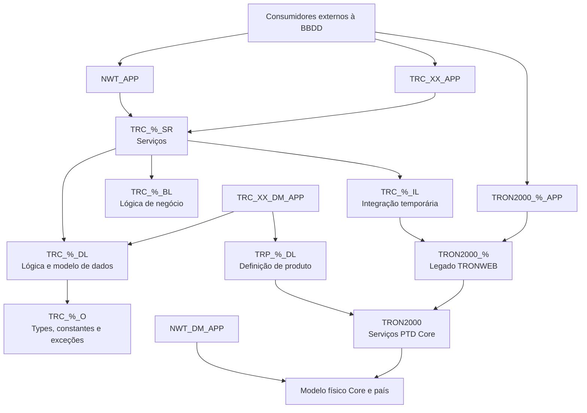

# Modelo de Desenvolvimento BBDD — Personalização TRON REEF

## 1. Metadados do Documento
- **Arquivo de Origem:** `Não identificado no conteúdo extraído`
- **Tipo de Documento:** `Arquitetura de Software / Especificação Técnica`
- **Domínio / Sistema:** `TRON, NEWTron, TRONWEB e REEF`
- **Público-Alvo:** `Desenvolvedores Backend Oracle, Arquitetos, Equipas de Personalização por País e Operação Técnica`
- **Data/Versão Identificada:** `Não identificada para o documento; exemplos de código incluem versões e datas entre 2021 e 2023.`

---

## 2. Resumo Executivo & Contexto de Negócio

O documento define o modelo de desenvolvimento de personalizações de base de dados para instâncias nacionais do sistema TRON em REEF. O objetivo é permitir que cada país implemente lógica de negócio, modelo de dados e definição de produto próprios sem modificar objetos pertencentes ao Núcleo TRON. A separação entre Núcleo e personalização nacional é apresentada como condição para reutilização, estabilidade, integridade dos dados e evolução independente do produto corporativo.

A arquitetura propõe esquemas Oracle especializados para cada responsabilidade: objetos e tipos, modelo de dados, lógica de negócio, serviços, integração temporária com legado, definição de produto e código TRONWEB legado. Os esquemas nacionais utilizam o código ISO de duas posições do país como parte da nomenclatura, por exemplo, `TRC_PA_DL`, `TRC_PA_BL` e `TRON2000_PA`.

A personalização de processos existentes no TRON não deve ocorrer por substituição de sinónimos em instalações REEF. Em vez disso, a personalização deve ser realizada por parametrização do processo, podendo a parametrização indicar um procedimento executado dinamicamente. Para novas operações, devem ser criados os elementos correspondentes nas diferentes camadas, incluindo permissões e sinónimos necessários para consumo externo à base de dados.

O documento também estabelece um caminho de modernização. O esquema `TRON2000_%` hospeda código legado do país baseado na normativa TRONWEB, mas é explicitamente tratado como dívida técnica efémera, com eliminação planeada no curto prazo. A camada `TRC_%_IL` integra temporariamente o modelo NEWTron, baseado em type objects, com o legado TRONWEB, baseado em type records.

As políticas do Núcleo proíbem modificações nos esquemas corporativos, privilégios ou sinónimos públicos, acesso direto de esquemas `TRC` ao modelo físico do Núcleo e uso de `UTL_HTTP` ou `UTL_FILE`. O modelo físico do Núcleo deve ser manipulado exclusivamente pelas lógicas de Núcleo, preservando integridade e reduzindo acoplamento físico.

---

## 3. Arquitetura, Componentes & Tecnologias Envolvidas

### Componentes e tecnologias identificados

| Componente / Tecnologia | Papel identificado |
| :--- | :--- |
| REEF | Ambiente no qual os desenvolvimentos são promovidos e onde se aplica o modelo de personalização. |
| TRON | Nome genérico para versões do sistema implantadas em companhias do Seguro Direto Internacional; agrupa lógica de negócio, dados, processos e um modelo de dados. |
| NEWTron | Modelo arquitetural baseado em type objects; utiliza esquemas `TRC_%`. |
| TRONWEB | Código original/legado, baseado em type records e associado a esquemas `TRON2000` e `TRON2000_%`. |
| Oracle 19 | Release compatível requerida para o cliente Oracle do posto de trabalho. |
| Bitbucket | Repositório de código para desenvolvimento e promoção entre ambientes REEF. |
| Git | Cliente para gestão e envio de desenvolvimentos ao repositório. |
| PL/SQL Developer | Ferramenta Oracle indicada; requer licença. |
| Oracle SQL Developer | Ferramenta Oracle indicada; não requer licença. |
| Visual Studio Code plugin | Ferramenta gráfica de apoio à gestão de repositórios; não requer licença. |
| SourceTree | Ferramenta gráfica de gestão Git; não requer licença. |
| AQ | Filas AQ consumidas por `NWT_AQ_APP` no módulo de eventos. |
| PTD | Serviços de definição de produto fornecidos pelo Core através de `TRON2000`. |
| PDC | Ficheiros necessários para criar permissões e sinónimos de objetos do país em determinados esquemas. |

### Esquemas de personalização

| Esquema | Responsabilidade |
| :--- | :--- |
| `TRC_%_O` | Objetos, packages de constantes, definição e exceções específicos do país. |
| `TRC_%_DL` | Modelo de dados do país — exceto dados exclusivos de definição de produto — e lógica de dados interna e de escaparate. |
| `TRC_%_BL` | Packages de validação e lógica de negócio específica para atributos dos conceitos de negócio. |
| `TRC_%_SR` | Packages de serviço: interface de serviço, orquestrador de conceitos e orquestrador de propriedades. |
| `TRC_%_IL` | Integração temporária entre desenvolvimentos NEWTron e código legado do país em `TRON2000_%`. |
| `TRP_%_DL` | Definição de produto própria do país; consome serviços PTD de Core em `TRON2000`. |
| `TRON2000_%` | Código original/legado do país segundo a normativa TRONWEB; representa dívida técnica efémera. |

### Utilizadores de acesso a artefactos Core

| Utilizador | Função |
| :--- | :--- |
| `NWT_APP` | Consome serviços das camadas `NWT_SR` e `TRC_XX_SR` do país. |
| `TRON2000_APP` | Consome packages TRONWEB. |
| `NWT_DM_APP` | Consome o modelo físico de Núcleo e de país. |
| `NWT_AQ_APP` | Consome filas AQ do módulo de eventos. |
| `TGC_APP` | Utilizador de ligação do módulo GDC. |

### Utilizadores de acesso a artefactos do país

| Utilizador | Função |
| :--- | :--- |
| `TRC_XX_APP` | Consome serviços do país em `TRC_XX_SR`; não tem acesso aos serviços Core nem aos seus objetos. |
| `TRON2000_%_APP` | Consome packages TRONWEB próprias do país ou de Core, presentes em `TRON2000_%` e `TRON2000`. |
| `TRC_XX_DM_APP` | Consome o modelo físico do país nos esquemas `TRC_XX_DL` e `TRP_XX_DL`. |



> **Nota de Análise:** O documento anuncia diagramas de relação entre esquemas, esquemas de Núcleo e privilégios, mas esses diagramas não estão disponíveis na extração textual. O diagrama Mermaid acima representa apenas as relações explicitamente descritas.

---

## 4. Regras de Negócio, Especificações Funcionais & Processos

### 4.1 Preparação do desenvolvimento

1. Para desenvolver e promover código entre ambientes REEF, são fornecidos dois repositórios Bitbucket:
   - `XX_TRC_BK`, em que `XX` representa o código ISO do país, para código dos esquemas de personalização `TRC`.
   - `XX_TRP_CMN_BK`, em que `XX` representa o código ISO do país, para código de definição de produto.

2. A estrutura do repositório `XX_TRC_BK` possui:
   - Pasta `LINE-OF-BUSINESS`.
   - Uma pasta por família do sistema.
   - Em cada família, uma pasta `BACK-END`.
   - Em `BACK-END`, uma pasta por esquema de personalização.
   - Uma pasta adicional chamada `tron2000_local` para o esquema próprio do país.
   - Packages com código desenvolvido nas pastas de esquemas de personalização, exceto em `tron2000_local`.

3. O repositório `XX_TRP_CMN_BK` contém:
   - `LINE-OF-BUSINESS/BACK-END/PROGRAM`, com pastas por tipo de objeto: scripts SQL, packages, funções, procedimentos e permissões de execução a partir de `TRON2000`.
   - Adiantamentos necessários de PTDs de Core para responder rapidamente a necessidades de integração de serviços Core.

4. O posto de trabalho Oracle exige:
   - Cliente Oracle compatível com Oracle 19.
   - Entradas `tnsnames` das bases de dados a utilizar.
   - Cliente Git.
   - Ferramentas opcionais: PL/SQL Developer, Oracle SQL Developer, plugin Visual Studio Code e SourceTree.

### 4.2 Regras de personalização em REEF

1. Objetos dos esquemas de Núcleo não podem ser modificados.
2. A única interação permitida para lógica nacional é atribuir permissões sobre objetos do país para que a lógica seja utilizada a partir do Núcleo.
3. A personalização por substituição de sinónimos deixa de fazer sentido numa instalação REEF.
4. A personalização de um fluxo TRON existente deve ocorrer por parametrização do processo.
5. A parametrização pode definir um procedimento a executar dinamicamente.
6. Para novas operações, devem ser criados elementos nas respetivas camadas, permissões e sinónimos para execução externa à base de dados.

### 4.3 Parametrizações exemplificadas para sinistros

| Elemento | Valores ou finalidade indicada |
| :--- | :--- |
| `T_LSF_TRN_D_LSF` | Armazena valores para acionar ações ao finalizar a abertura de sinistro antes dos expedientes, finalizar abertura incluindo expedientes, finalizar modificação, finalizar reabilitação, validar matrícula do terceiro e obter importes totais do sinistro. |
| `DF_LSF_NWT_XX_DLD` | Armazena valores por defeito: data/hora de ocorrência, data/hora de denúncia, consideração de suplementos temporais, definição de extemporaneidade e dados da pessoa de contacto conforme relação com o segurado. |

### 4.4 `TRC_%_O`: objetos, constantes, definição e exceções

1. `TRC_%_O` aloja objetos do país, packages de constantes, definição e exceções.
2. O símbolo `%` deve ser substituído pelo código ISO de duas posições do país.
3. O exemplo utiliza `TRC_PA_O.o_cmn_tid_mpa_s`, type object com atributos:
   - `cmp_val NUMBER(2)`
   - `agn_val NUMBER(6)`
   - `day_val NUMBER(2)`
   - `dsb_row VARCHAR2(1)`
   - `mdf_val DATE`
   - `usr_val VARCHAR2(8)`
4. Objetos do país que componham objetos Core não podem ser consumidos a partir dos esquemas de aplicação do próprio país, como `TRC_XX_APP`.

### 4.5 `TRC_%_DL`: modelo de dados e lógica de dados

O esquema `TRC_%_DL` aloja o modelo de dados próprio do país que não seja exclusivo da definição de produto e implementa dois níveis de lógica:

| Nível | Finalidade | Visibilidade / convenção |
| :--- | :--- | :--- |
| Lógica de tabela ou lógica interna de dados | CRUD de acesso à tabela com dados intercambiados pelo modelo lógico, incluindo type objects de BBDD, `TRC_%_O` e `NWT_O`. | Visível apenas dentro do esquema `DL`; segue o padrão de nomenclatura TRON `dl_`. |
| Lógica de escaparate | Lógica de objeto visível para outros esquemas do sistema. | Segue o padrão de nomenclatura TRON `dl_`. |

No exemplo de `dl_cmn_tid_mpa.f_get_001`:

1. A função recebe `pm_cmp_val`, `pm_agn_val`, `pm_lng_val` e `pm_usr_val`.
2. A lógica de escaparate delega em `dl_df_cmn_nwt_pa_tid_agn_ntf.f_get_001`.
3. A lógica de tabela consulta `df_cmn_nwt_pa_tid_agn_ntf`.
4. A consulta filtra por `cmp_val`, `agn_val` e `dsb_row = nwt_o.c_ins.no`.
5. Quando não existe resultado, a lógica adiciona anexos de erro para `CMP_VAL`, `AGN_VAL` e `USR_VAL`.
6. O erro é apresentado por `dl_trn_err.p_shw` com `pm_err_val => 20001` e `pm_tem_val => 'TID'`.

### 4.6 `TRC_%_BL`: lógica de negócio

1. `TRC_%_BL` aloja packages específicos de validação e lógica de negócio para atributos pertencentes a cada conceito de negócio.
2. O exemplo `TRC_PA_BL.bl_cmn_sdv_mpa` é identificado como lógica de negócio do conceito lógico “VALIDACION ESTANDAR” da família “COMUN”.
3. O package define constantes numéricas entre `30` e `450`, em incrementos de `30`.
4. A função `f_thp_adr_bnf` devolve o endereço de um terceiro da apólice conforme `tip_benef`.
5. A função obtém dados de `nwt_dl.dl_ply_ine.f_get_035`.
6. Se existir uma sequência de endereço (`adr_sqn_val`), a função usa `nwt_dl.dl_thp_adr_trn.f_get_020`.
7. Se não existir sequência de endereço, a função usa `nwt_dl.dl_thp_adr_trn.f_get_015`.
8. Em qualquer exceção, a lógica inicializa o resultado com `nwt_dl.dl_thp_adr_trn.p_inl`.

### 4.7 `TRC_%_SR`: serviços e orquestração

O esquema `TRC_%_SR` aloja packages de serviço distribuídos em três categorias:

| Tipo de package | Responsabilidade |
| :--- | :--- |
| Interface de serviço | Package visível pelo esquema `APP`, chamado externamente à base de dados. |
| Orquestrador de conceitos | Gere os objetos utilizados na lógica do serviço a implementar. |
| Orquestrador de propriedades | Executa a lógica de negócio `TRC_%_BL` de cada atributo interveniente no processo. |

No exemplo de interface `sr_ply_pli_snd_nte_mpa`:

1. O procedimento `p_prc` é responsável pelo envio de notificações de recibos vencidos.
2. O procedimento invoca `op_ply_pli_snd_nte_mpa.p_prc`.

No exemplo de orquestrador de propriedades:

1. Quando ocorre um erro não tratado (`WHEN OTHERS`), a lógica adiciona o erro `SQLCODE` e `SQLERRM` ao processo por `dl_trn_err.p_add`.
2. A lógica regista o erro em `dl_trn_dbg.p_set_err`.
3. A variável `lv_all_gnt` recebe o valor “NO”.
4. A variável `lv_err_exs` recebe o valor booleano verdadeiro.
5. No tratamento de `nwt_o.e_trn.ERR`, os erros existentes em `lv_o_ply_grv_pt` são transferidos para `pm_o_ply_gni_p.trn_prc_s.trn_err_t`.

No exemplo `op_ply_pli_snd_nte_mpa`:

1. O procedimento privado `pp_get_prc` gera o processo de envio de notificações de recibos vencidos.
2. A lógica procura a configuração do agente por `dl_cmn_tid_mpa.f_get_001`.
3. `day_val` e `agn_val` são obtidos do objeto retornado.
4. Quando há erro durante a consulta, `day_val` é reiniciado para zero e o agente é definido como nulo.
5. O texto do código explica a verificação de presença na “tabela de 30 dias” e o envio de notificação quando os dias forem cumpridos.

### 4.8 `TRC_%_IL`: integração NEWTron e TRONWEB

1. `TRC_%_IL` contém lógica para integrar novos desenvolvimentos nacionais dos esquemas `TRC` com código antigo em `TRON2000_%`.
2. Este esquema é efémero e deve ser removido quando o código correspondente for reprogramado nos restantes esquemas `TRC`.
3. A camada integra:
   - NEWTron, baseado em type objects.
   - TRONWEB, baseado em type records.
4. A camada disponibiliza ao NEWTron a funcionalidade original do país implementada em TRONWEB.
5. A camada permite chamadas de novos desenvolvimentos `TRC` para packages originais existentes em `TRON2000_%`.

### 4.9 `TRP_%_DL`: definição de produto

1. `TRP_%_DL` contém a definição de produto específica do país.
2. O esquema apenas consome serviços PTD Core fornecidos pelo esquema `TRON2000`.
3. O esquema não possui acesso ao modelo de dados de `TRON2000`.
4. O Core também disponibiliza produtos aos países, cuja codificação está em `TRP_XX_DL`.
5. A definição de produto continua a usar a nomenclatura tradicional TRONWEB.

### 4.10 `TRON2000_%`: legado e dívida técnica

1. `TRON2000_%` aloja packages originais do país desenvolvidos segundo a normativa TRONWEB.
2. O símbolo `%` deve ser substituído pelo código ISO de duas posições do país, como em `TRON2000_PA`.
3. O esquema é dívida técnica nacional e deve ter uma data acordada para eliminação.
4. Os objetos deste esquema utilizam a partícula `%` como prefixo.
5. Tabelas e vistas do país não devem ser alojadas em `TRON2000_%`; devem residir em `TRC_%_DL` ou `TRP_%_DL`.
6. A dívida técnica cria acoplamento físico entre o modelo original TRON e os packages personalizados do país, dificultando a evolução.
7. Inicialmente, `TRON2000_%` tem visibilidade de todas as tabelas e packages em `TRON2000`, permissões de execução em objetos e permissões CRUD sobre tabelas.
8. O objetivo recomendado é evitar permissões sobre tabelas e utilizar lógica TRONWEB correspondente, reduzindo acoplamento com o Núcleo e preservando integridade dos dados.
9. Apenas packages, funções e procedimentos originais do país podem ser incluídos em `TRON2000_%`.
10. Nova funcionalidade do país deve ser implementada nos esquemas `TRC_%` e `TRP_%_DL` apropriados.
11. A eliminação da dívida técnica deve ser planeada no curto prazo.

### 4.11 Regras de redução de acoplamento no legado

| Problema | Regra de atualização |
| :--- | :--- |
| Definição de tipos | Types não podem referenciar types ou rowtypes de tabelas. Devem utilizar types definidos em packages de `TRON2000` ou types próprios do país. |
| `SELECT` a tabelas de Núcleo | Devem ser eliminados e substituídos por invocações a funções ou procedimentos dos packages de Núcleo. |

### 4.12 Permissões e sinónimos para objetos em `TRON2000_%`

Os objetos criados em `TRON2000_%` não são visíveis por defeito para outros esquemas e não possuem permissões de execução. O país deve gerar ficheiros `.pdc` para integrar esses objetos.

| Esquema destinatário | Integração necessária |
| :--- | :--- |
| `TRON2000` | `GRANT EXECUTE` sobre `TRON2000_%` para execução dinâmica de procedimentos. |
| `TRON2000_APP` | `CREATE SYNONYM` e permissões de execução sobre `TRON2000_%` quando o package precisa ser executado pelo frontal TRONWEB. |
| `TRC_%_IL` | `CREATE SYNONYM` e permissões de execução sobre `TRON2000_%` quando uma funcionalidade NEWTron precisa chamar o legado. |

### 4.13 Políticas de Núcleo TRON

| Política | Regra |
| :--- | :--- |
| Privilégios públicos | Não conceder privilégios a `PUBLIC`. |
| Sinónimos públicos | Não criar sinónimos públicos. |
| Modificação de Núcleo | Não modificar objetos de esquemas de Núcleo. |
| Criação em Núcleo | Não criar objetos em esquemas de Núcleo. |
| Acesso a dados Core | Esquemas `TRC` não podem aceder diretamente ao modelo de dados do Núcleo. |
| Privilégios `TRC` no modelo Core | Não conceder privilégios sobre o modelo Core a `TRC`. |
| Sinónimos para modelo Core | Não criar sinónimos em `TRC` que apontem ao modelo de Núcleo. |
| Vistas sobre modelo Core | Não criar vistas em `TRC` sobre o modelo de Núcleo. |
| Manipulação do modelo Core | O modelo Core deve ser manipulado por lógicas de Núcleo para garantir integridade e evitar acoplamento. |
| Qualificação de esquema | Não qualificar referências com o proprietário do objeto; utilizar sinónimos, exceto para esquemas `xxx_O`. |
| Integração HTTP | Não utilizar `UTL_HTTP` para integração externa a partir da BBDD. |
| Sistema de ficheiros | Não utilizar `UTL_FILE` para leitura ou escrita de ficheiros na BBDD. |
| Geração de ficheiros | Evitar processos de escrita de ficheiros na BBDD; existem sobrecargas de packages de listagens para armazenar ficheiros em tabela temporária. |
| Integração recomendada | Integração a partir de camadas externas à BBDD ou de forma assíncrona por eventos. |

### 4.14 Atualização de release do Núcleo

1. A versão de Núcleo deve ser retrocompatível com versões anteriores para os esquemas de personalização.
2. A exceção é `TRON2000_XX`, devido à dependência do modelo físico.
3. Os restantes esquemas trabalham com modelo lógico baseado em type objects, permitindo retrocompatibilidade.
4. A existência dos esquemas `TRC` e as políticas de Núcleo foram definidas para assegurar a evolução do Núcleo independentemente da personalização de cada país.

---

## 5. Tabelas de Parâmetros, Ambientes e Estruturas de Dados

### Repositórios e estrutura de código

| Item / Parâmetro | Descrição / Função | Tipo / Valores / Formato | Ambiente / Observações |
| :--- | :--- | :--- | :--- |
| `XX_TRC_BK` | Repositório para código de personalização `TRC` do país. | `XX` = código ISO do país. | Bitbucket; desenvolvimento e promoção em REEF. |
| `XX_TRP_CMN_BK` | Repositório de código de definição de produto. | `XX` = código ISO do país. | Bitbucket. |
| `LINE-OF-BUSINESS` | Pasta raiz de famílias do sistema. | Estrutura de diretórios. | Repositórios apresentados. |
| `BACK-END` | Pasta que contém esquemas ou programas backend. | Estrutura de diretórios. | Dentro de famílias. |
| `tron2000_local` | Pasta destinada ao esquema próprio do país. | Diretório. | Exceção à regra de packages nas pastas de personalização. |
| `PROGRAM` | Pasta para scripts SQL, packages, funções, procedimentos e permissões. | Diretório. | Em `LINE-OF-BUSINESS/BACK-END/PROGRAM`. |
| `.pdc` | Ficheiro para integrar permissões e sinónimos de objetos nacionais. | Ficheiro de configuração/deploy. | Necessário para objetos de `TRON2000_%` expostos a outros esquemas. |
| Plantilhas PDC | Modelos de ficheiros PDC para esquemas de personalização. | URL. | `https://tron.es.mapfre.net/es/plantillas-trc/` |

### Ferramentas e configuração do posto de trabalho

| Item / Parâmetro | Descrição / Função | Tipo / Valores / Formato | Ambiente / Observações |
| :--- | :--- | :--- | :--- |
| Cliente Oracle | Cliente necessário para desenvolvimento Backend Oracle. | Compatível com Oracle 19. | Posto de trabalho. |
| `tnsnames` | Configuração de ligações às BBDD. | Entradas para BBDD a conectar. | Posto de trabalho. |
| PL/SQL Developer | Ferramenta de desenvolvimento Oracle. | Requer licença. | Opcional, indicada pelo documento. |
| Oracle SQL Developer | Ferramenta de desenvolvimento Oracle. | Não requer licença. | Opcional, indicada pelo documento. |
| Cliente Git | Gestão e envio de código. | Cliente Git. | Necessário para repositórios de código. |
| Plugin Visual Studio Code | Apoio gráfico à gestão Git. | Não requer licença. | Opcional. |
| SourceTree | Gestão gráfica de repositórios. | Não requer licença. | Opcional. |

### Estrutura do type object `TRC_PA_O.o_cmn_tid_mpa_s`

| Item / Parâmetro | Descrição / Função | Tipo / Valores / Formato | Ambiente / Observações |
| :--- | :--- | :--- | :--- |
| `cmp_val` | Atributo do objeto de informação TID. | `NUMBER(2)` | Exemplo no esquema `TRC_PA_O`. |
| `agn_val` | Atributo do objeto de informação TID. | `NUMBER(6)` | Exemplo no esquema `TRC_PA_O`. |
| `day_val` | Atributo de dias. | `NUMBER(2)` | Usado no fluxo de notificações de recibos vencidos. |
| `dsb_row` | Indicador de estado da linha. | `VARCHAR2(1)` | Filtro utiliza `nwt_o.c_ins.no`. |
| `mdf_val` | Data de modificação. | `DATE` | Exemplo de type object. |
| `usr_val` | Utilizador associado ao registo. | `VARCHAR2(8)` | Exemplo de type object. |

### Parâmetros da função `f_get_001`

| Item / Parâmetro | Descrição / Função | Tipo / Valores / Formato | Ambiente / Observações |
| :--- | :--- | :--- | :--- |
| `pm_cmp_val` | Valor de companhia usado na pesquisa. | `nwt_o.d_cfd.cmp_val` | Usado no filtro de `df_cmn_nwt_pa_tid_agn_ntf`. |
| `pm_agn_val` | Valor do agente usado na pesquisa. | `nwt_o.d_thp.agn_val` | Usado no filtro de `df_cmn_nwt_pa_tid_agn_ntf`. |
| `pm_lng_val` | Idioma usado em mensagens de erro. | `nwt_o.d_cmn.lng_val` | Passado a `dl_trn_err.p_shw`. |
| `pm_usr_val` | Utilizador associado à operação. | `nwt_o.d_thp.usr_val` | Incluído em informação anexa de erro. |
| Retorno | Objeto de informação TID. | `trc_pa_o.o_cmn_tid_mpa_p` | Retornado pela função de escaparate e pela lógica de tabela. |
| Erro de inexistência | Erro mostrado quando nenhum registo é localizado. | Código `20001`; tema `TID`. | Inclui anexos `CMP_VAL`, `AGN_VAL` e `USR_VAL`. |

### URLs corporativas identificadas

| Item / Parâmetro | Descrição / Função | Tipo / Valores / Formato | Ambiente / Observações |
| :--- | :--- | :--- | :--- |
| Wiki de nomenclatura TRON | Normativa de nomenclatura para elementos construídos nos esquemas. | URL | `https://internos.mapfre.com/tronweb/desarrollo-nomenclatura/#Tabla_(tbl)` |
| Wiki NEWTron | Documentação completa de NEWTron. | URL | `https://internos.mapfre.com/tronweb/homepage/` |
| Plantilhas `TRC` | Plantilhas PDC para esquemas de personalização. | URL | `https://tron.es.mapfre.net/es/plantillas-trc/` |

---

## 6. Bateria de Perguntas & Respostas para RAG (FAQ Sintético)

### P1: Qual é a forma permitida de personalizar um processo TRON existente em REEF?
**R:** A personalização de um fluxo TRON existente deve ser realizada por parametrização do processo. Essa parametrização pode indicar um procedimento que será executado dinamicamente conforme a definição configurada. O modelo de substituição de sinónimos não é aplicável a instalações REEF.

### P2: Posso modificar tabelas, packages ou outros objetos dos esquemas de Núcleo TRON?
**R:** Não. O documento proíbe modificar qualquer objeto dos esquemas de Núcleo e também proíbe criar objetos nesses esquemas. A personalização do país deve ser implementada nos esquemas `TRC_%`, `TRP_%_DL` ou, temporariamente para legado, em `TRON2000_%`.

### P3: Qual é a responsabilidade do esquema `TRC_%_DL`?
**R:** `TRC_%_DL` aloja o modelo de dados do país que não seja exclusivo da definição de produto. Também implementa a lógica de tabela — CRUD interno visível apenas no próprio esquema — e a lógica de escaparate, que expõe lógica de objetos para outros esquemas do sistema.

### P4: Como o esquema `TRC_%_SR` organiza os serviços?
**R:** O esquema `TRC_%_SR` organiza a lógica de serviço em interface de serviço, orquestrador de conceitos e orquestrador de propriedades. A interface é visível a partir do esquema `APP`; o orquestrador de conceitos gere os objetos do serviço; e o orquestrador de propriedades executa a lógica de negócio `TRC_%_BL` dos atributos envolvidos no processo.

### P5: Para que serve o esquema `TRC_%_IL`?
**R:** `TRC_%_IL` é uma camada de integração temporária entre novos desenvolvimentos NEWTron em esquemas `TRC` e código legado do país em `TRON2000_%`. Esta camada traduz a integração entre o modelo NEWTron baseado em type objects e o modelo TRONWEB baseado em type records. Deve ser removida quando a funcionalidade legada for reprogramada nas camadas `TRC`.

### P6: Onde deve ser criada uma nova funcionalidade específica de um país?
**R:** Nova funcionalidade do país deve ser desenvolvida nos esquemas de personalização apropriados, principalmente `TRC_%` para componentes NEWTron e `TRP_%_DL` para definição de produto. O esquema `TRON2000_%` deve conter apenas packages, funções e procedimentos originais legados do país.

### P7: Por que `TRON2000_%` é considerado dívida técnica?
**R:** `TRON2000_%` mantém código TRONWEB original do país e cria acoplamento físico entre o modelo original TRON e packages personalizados. Esse acoplamento limita a evolução do sistema. Por esse motivo, o esquema é efémero e a sua eliminação deve ser planeada no curto prazo.

### P8: Um esquema `TRC` pode consultar diretamente tabelas do modelo físico de Núcleo?
**R:** Não. As políticas de Núcleo proíbem privilégios de `TRC` sobre o modelo de dados Core, sinónimos em `TRC` que apontem para o modelo Core, vistas em `TRC` sobre o modelo Core e acesso direto ao modelo físico. O acesso deve ocorrer por lógicas de Núcleo para preservar integridade e evitar acoplamento.

### P9: Que permissões devem ser criadas para expor um objeto de `TRON2000_%`?
**R:** Para objetos de `TRON2000_%`, o país deve gerar ficheiros `.pdc`. O esquema `TRON2000` precisa de `GRANT EXECUTE` para chamadas dinâmicas; `TRON2000_APP` precisa de sinónimo e permissão de execução quando o frontal TRONWEB consome o objeto; e `TRC_%_IL` precisa de sinónimo e permissão de execução quando uma funcionalidade NEWTron consome o legado.

### P10: Quais utilizadores consomem serviços e dados do país?
**R:** `TRC_XX_APP` consome exclusivamente serviços do país em `TRC_XX_SR` e não possui acesso a serviços ou objetos Core. `TRON2000_%_APP` consome packages TRONWEB nacionais ou Core. `TRC_XX_DM_APP` consome o modelo físico do país nos esquemas `TRC_XX_DL` e `TRP_XX_DL`.

### P11: O que acontece quando `dl_df_cmn_nwt_pa_tid_agn_ntf.f_get_001` não encontra dados?
**R:** A função adiciona informação anexa referente a `CMP_VAL`, `AGN_VAL` e `USR_VAL`. Em seguida, chama `dl_trn_err.p_shw` com código de erro `20001`, tema `TID`, idioma recebido em `pm_lng_val` e o nome do programa associado à função.

### P12: Posso usar `UTL_HTTP` ou `UTL_FILE` numa personalização TRON?
**R:** Não. O documento proíbe o uso de `UTL_HTTP` para integração com serviços externos a partir da BBDD e proíbe `UTL_FILE` para leitura ou escrita de ficheiros. A integração deve ocorrer em camadas externas à base de dados ou de forma assíncrona por eventos. Para listagens, o documento menciona sobrecargas que armazenam ficheiros em tabela temporária.

---

## 7. Glossário de Termos, Siglas & Conceitos-Chave

- **AQ:** Filas AQ consumidas pelo utilizador `NWT_AQ_APP` no módulo de eventos.
- **APP:** Sufixo de esquemas/utilizadores de aplicação destinados ao consumo de serviços ou packages.
- **BBDD:** Base de Dados.
- **BL:** Camada de Business Logic; esquema de lógica de negócio e validações específicas do país.
- **Core / Núcleo:** Conjunto reutilizável de lógicas de negócio, dados, processos e componentes que resolvem operações básicas de uma companhia.
- **CRUD:** Operações de acesso e manipulação de dados; o documento cita permissões de Read, Update e Delete em tabelas do legado.
- **DL:** Camada de Data Logic; modelo de dados e lógica de tabela/escaparate.
- **DM_APP:** Utilizador de aplicação para consumo de modelo físico.
- **GDC:** Módulo ao qual o utilizador `TGC_APP` se liga.
- **IL:** Camada de integração entre NEWTron e código legado TRONWEB.
- **ISO do país:** Código ISO de duas posições inserido nos nomes de esquemas, por exemplo `PA`.
- **NEWTron:** Modelo de desenvolvimento baseado em type objects.
- **NWT:** Prefixo relacionado ao Núcleo/NEWTron, usado em esquemas, utilizadores, packages, objetos e tipos.
- **PDC:** Ficheiro usado para integrar permissões e sinónimos de objetos entre esquemas.
- **PTD:** Serviços de definição de produto disponibilizados pelo Core através de `TRON2000`.
- **REEF:** Ambiente/plataforma onde os desenvolvimentos são promovidos e em que o modelo de personalização descrito é aplicado.
- **SR:** Camada de serviços que contém interfaces, orquestradores de conceitos e orquestradores de propriedades.
- **TRC:** Prefixo de esquemas de personalização nacional NEWTron.
- **TRONWEB:** Modelo/código original baseado em type records e packages tradicionais.
- **TRP:** Prefixo relacionado à definição de produto do país.
- **Type object:** Estrutura de objeto de base de dados utilizada pelo modelo lógico NEWTron.
- **Type record:** Estrutura utilizada pelo código TRONWEB legado.
- **UTL_FILE:** Utilidade PL/SQL de acesso a ficheiros; uso proibido pela política descrita.
- **UTL_HTTP:** Utilidade PL/SQL de integração HTTP; uso proibido pela política descrita.

---

## 8. Notas Críticas, Riscos & Limitações

1. **Diagramas ausentes na extração:** O documento refere diagramas de relação entre esquemas, relação com Núcleo, privilégios e esquemas de Núcleo, mas as imagens ou tabelas correspondentes não foram extraídas. Não é possível inferir privilégios específicos não visíveis no texto.

2. **`TRON2000_%` é dívida técnica:** O esquema tem dependência do modelo físico, reduz a capacidade de evolução do sistema e deve ter eliminação planeada no curto prazo. A retrocompatibilidade do release de Núcleo não é garantida para `TRON2000_XX`.

3. **Risco de acoplamento ao Núcleo:** Acesso direto a tabelas Core, types ou rowtypes de tabelas e qualificação explícita de proprietário de esquema introduzem acoplamento físico. O documento determina que esses padrões devem ser evitados ou eliminados.

4. **Integração direta desde a BBDD é restringida:** `UTL_HTTP` e `UTL_FILE` não podem ser utilizados. Integrações devem ser deslocadas para camadas externas à BBDD ou implementadas de forma assíncrona por eventos.

5. **Visibilidade não é automática:** Objetos criados em `TRON2000_%` não ficam automaticamente visíveis ou executáveis por outros esquemas. A equipa do país precisa criar ficheiros `.pdc` para permissões e sinónimos.

6. **Limitação de detalhe nas permissões:** O texto informa repetidamente que os privilégios entre esquemas são mostrados “na seguinte tabela”, mas as tabelas de permissões não estão presentes na extração. Portanto, não foram inventadas matrizes de acesso.

7. **Exemplos de código não são contratos completos:** Os trechos PL/SQL mostram padrões de implementação, mas não documentam todos os contratos, regras completas de validação ou fluxos de dados. Por exemplo, o package `thp_api` não é mencionado, e o documento não detalha métodos HTTP ou contratos JSON.

---

## 9. Conteúdo Bruto Estruturado (Referência Fiel)

```text
--- [PÁGINA 1 DE 23] ---

Modelo de Desarrollo BBDD Personalización Tron REEF

Índice:
1. Introducción
2. Pasos Previos
2.1. Repositorios Bitbucket
2.2. Configuración del Puesto de Trabajo
3. Desarrollo de Personalización en la BBDD
4. Esquemas BBDD
4.1. Esquema TRC_%_O
4.2 Esquema TRC_%_DL
4.3 Esquema TRC_%_BL
4.4 Esquema TRC_%_SR
4.5 Esquema TRC_%_IL
4.6 Esquema TRP_%_DL
4.7 Esquema TRON2000_%
4.8 Resumen relación de esquemas
5. Políticas de Núcleo TRON
6. Esquemas Núcleo
7. Actualización Release de Núcleo

1. Introducción
El presente documento trata de recopilar la información necesaria para poder desarrollar tanto la lógica de negocio, como la personalización de núcleo para poder dar cobertura a las necesidades funcionales de un país.

El documento contiene información sobre los esquemas que dan forma a una instancia TRON, el propósito de cada uno, permisos y sinónimos hacia el resto de esquemas.

Los elementos construidos en cada esquema deben seguir la nomenclatura de TRON:
https://internos.mapfre.com/tronweb/desarrollo-nomenclatura/#Tabla_(tbl)

La documentación completa de NEWTron está accesible en:
https://internos.mapfre.com/tronweb/homepage/

--- [PÁGINA 2 DE 23] ---

2.1. Repositorios Bitbucket

Para realizar desarrollos y promocionarlos a los entornos REEF, se proporcionan dos repositorios Bitbucket.

XX_TRC_BK (XX código ISO del país): contiene código asociado a esquemas de personalización TRC del país.

Estructura:
- LINE-OF-BUSINESS.
- Una carpeta por cada familia del sistema.
- Dentro de cada familia, BACK-END.
- Dentro de BACK-END, una carpeta por esquema de personalización.
- Nueva carpeta tron2000_local para el esquema propio del país.
- En estas carpetas, excepto tron2000_local, se incorporan los packages desarrollados.

--- [PÁGINA 3 DE 23] ---

XX_TRP_CMN_BK (XX código ISO del país): contiene código asociado al esquema de definición de producto.

Estructura:
- LINE-OF-BUSINESS/BACK-END/PROGRAM: carpeta por tipo de objeto de definición de producto: scripts SQL, packages, funciones, procedimientos y permisos de ejecución desde TRON2000.
- Adiantamentos requeridos de PTDs Core para necesidades ágiles de integración de servicios Core.

2.2. Configuración del Puesto de Trabajo
- Cliente Oracle compatible con release Oracle 19.
- Tnsnames de las BBDD a las que se vaya a conectar.
- PL/SQL Developer, requiere licencia.
- Oracle SQL Developer, no requiere licencia.
- Cliente Git para subir desarrollos al repositorio.

--- [PÁGINA 4 DE 23] ---

Herramientas gráficas para simplificar gestión Git:
- Plugin Visual Studio Code, no requiere licencia.
- SourceTree, no requiere licencia.

--- [PÁGINA 5 DE 23] ---

3. Desarrollo de Personalización en la BBDD

No se pueden modificar objetos de esquemas de Núcleo.
Se pueden asignar permisos sobre objetos del país para manejar lógica codificada desde Núcleo.
La personalización por sustitución de sinónimos deja de tener sentido en REEF.
La personalización de un flujo TRON existente se realiza mediante parametrización; la parametrización puede incluir un procedimiento ejecutado dinámicamente.

Parametrización de apertura de siniestros:
T_LSF_TRN_D_LSF:
- Acción al finalizar apertura de siniestro antes de apertura de expedientes.
- Acción al finalizar apertura de siniestro, incluida apertura de expedientes.
- Acción al finalizar modificación de siniestro.
- Acción al finalizar rehabilitación de siniestro.
- Validar matrícula del contrario.
- Obtener importes totales del siniestro.

DF_LSF_NWT_XX_DLD:
- Valores por defecto de fecha/hora de ocurrencia y denuncia.
- Consideración de suplementos temporales.
- Consideración de definición de extemporaneidad.
- Datos de persona de contacto según relación con asegurado.

Usuarios Core:
- NWT_APP: consume servicios NWT_SR y TRC_XX_SR.
- TRON2000_APP: consume paquetería TRONWEB.
- NWT_DM_APP: consume modelo físico de Núcleo y país.
- NWT_AQ_APP: consume colas AQ del módulo de eventos.

--- [PÁGINA 6 DE 23] ---

- TGC_APP: usuario de conexión del módulo GDC.

Usuarios del país:
- TRC_XX_APP: consume servicios propios TRC_XX_SR; no tiene acceso a servicios Core ni a sus objetos.
- TRON2000_%_APP: consume paquetería TRONWEB propia del país o Core.
- TRC_XX_DM_APP: consume modelo físico del país en TRC_XX_DL y TRP_XX_DL.

4. Esquemas BBDD
Los objetos de esquemas originales de Núcleo no pueden ser modificados por personalizaciones de países.

4.1. Esquema TRC_%_O
Esquema para objetos, packages de constantes, definición y excepciones propios del país.

--- [PÁGINA 7 DE 23] ---

Los objetos del país que compongan objetos Core no pueden ser consumidos desde los esquemas de aplicación propios del país, como TRC_XX_APP.

4.2. Esquema TRC_%_DL
Esquema del modelo de datos del país no exclusivo de definición de producto.

Incluye:
- Lógica de tabla o interna: CRUD de tabla con datos intercambiados mediante modelo lógico; visible solo desde el esquema DL; patrón dl_.
- Lógica de escaparate: lógica de objeto visible desde otros esquemas; patrón dl_.

% se sustituye por código ISO de dos posiciones del país, por ejemplo TRC_PA_DL.

Ejemplo:
CREATE OR REPLACE TYPE TRC_PA_O.o_cmn_tid_mpa_s FORCE
AS OBJECT (
   cmp_val NUMBER(2),
   agn_val NUMBER(6),
   day_val NUMBER(2),
   dsb_row VARCHAR2(1),
   mdf_val DATE,
   usr_val VARCHAR2(8),
   CONSTRUCTOR FUNCTION o_cmn_tid_mpa_s RETURN SELF AS RESULT,
   CONSTRUCTOR FUNCTION o_cmn_tid_mpa_s(
      pm_cmp_val NUMBER,
      pm_agn_val NUMBER,
      pm_day_val NUMBER,
      pm_dsb_row VARCHAR2,
      pm_mdf_val DATE,
      pm_usr_val VARCHAR2
   ) RETURN SELF AS RESULT
);

--- [PÁGINA 8 DE 23] ---

Ejemplo de lógica de escaparate:

PACKAGE BODY TRC_PA_DL.dl_cmn_tid_mpa:
- Constante c_pgm_nam = 'dl_cmn_tid_mpa'.
- Función f_get_001 recupera detalle de tabla df_cmn_nwt_pa_tid_agn_ntf filtrado por agente.
- Recibe pm_cmp_val, pm_agn_val, pm_lng_val y pm_usr_val.
- Invoca dl_df_cmn_nwt_pa_tid_agn_ntf.f_get_001.
- Retorna trc_pa_o.o_cmn_tid_mpa_p.

--- [PÁGINA 9 DE 23] ---

Ejemplo de lógica de tabla:

PACKAGE BODY TRC_PA_DL.dl_df_cmn_nwt_pa_tid_agn_ntf:
- Descripción: lógica de datos de tabla df_cmn_nwt_pa_tid_agn_ntf.
- Función f_get_001 filtra detalle por agente.
- Cursor consulta df_cmn_nwt_pa_tid_agn_ntf.
- Filtros:
  a.cmp_val = pc_cmp_val
  a.agn_val = pc_agn_val
  a.dsb_row = nwt_o.c_ins.no

--- [PÁGINA 10 DE 23] ---

Cuando el resultado es nulo:
- Añade anexos CMP_VAL, AGN_VAL y USR_VAL.
- Muestra error mediante dl_trn_err.p_shw.
- Código de error: 20001.
- Tema: TID.
- Devuelve el objeto lv_o_cmn_tid_mpa_p.

--- [PÁGINA 11 DE 23] ---

4.3. Esquema TRC_%_BL

Esquema que aloja packages específicos de validación, es decir, lógica de negocio de atributos de cada concepto de negocio.

% se sustituye por código ISO de dos posiciones, por ejemplo TRC_PA_BL.

Ejemplo:
PACKAGE BODY TRC_PA_BL.bl_cmn_sdv_mpa
- Lógica de negocio del concepto lógico VALIDACION ESTANDAR de la familia COMUN.
- Incluye constantes 30, 60, 90, 120, 150, 180, 210, 240, 270, 300, 330, 360, 390, 420 y 450.
- Incluye función f_thp_adr_bnf.

--- [PÁGINA 12 DE 23] ---

f_thp_adr_bnf:
- Devuelve dirección del tercero de la póliza conforme a tip_benef.
- Recibe valores de compañía, póliza, aplicación, endoso, riesgo, tipo de beneficiario, tercero, uso de dirección, origen, idioma y tipo de obtención de nombre.
- Inicializa objetos de información de póliza y dirección.
- Consulta nwt_dl.dl_ply_ine.f_get_035.

--- [PÁGINA 13 DE 23] ---

Si existe información de póliza:
- Obtiene tipo/documento de tercero y secuencia de dirección.
- Si existe adr_sqn_val, usa nwt_dl.dl_thp_adr_trn.f_get_020.
- Si no existe adr_sqn_val, usa nwt_dl.dl_thp_adr_trn.f_get_015.
- En WHEN OTHERS, inicializa el resultado con nwt_dl.dl_thp_adr_trn.p_inl.
- Retorna lv_o_thp_adr_p.

--- [PÁGINA 14 DE 23] ---

4.4. Esquema TRC_%_SR

Esquema de paquetería de servicios distribuida en:
- Interfaz de servicio: visible desde APP y llamada desde fuera de BBDD.
- Orquestador de conceptos: gestiona objetos usados por la lógica del servicio.
- Orquestador de propiedades: aplica lógica TRC_%_BL de atributos participantes.

Ejemplo sr_ply_pli_snd_nte_mpa:
- Procedures y funciones para envío de notificaciones.
- Procedimiento p_prc para envío de notificaciones de recibos vencidos.
- p_prc llama a op_ply_pli_snd_nte_mpa.p_prc.

--- [PÁGINA 15 DE 23] ---

Ejemplo de orquestación de propiedades:
- Ante WHEN OTHERS, apila SQLCODE y SQLERRM con dl_trn_err.p_add.
- Registra error con dl_trn_dbg.p_set_err.
- lv_all_gnt toma valor NO.
- lv_err_exs toma valor verdadero.
- Ante nwt_o.e_trn.ERR, transfiere errores de valores garantizados al error del proceso general.

--- [PÁGINA 16 DE 23] ---

PACKAGE BODY TRC_PA_SR.op_ply_pli_snd_nte_mpa:
- Genera proceso de envío de notificaciones de recibos vencidos.
- Obtiene idioma y usuario mediante dl_trn_vrb.f_get_chr.
- Consulta dl_cmn_tid_mpa.f_get_001 para recuperar day_val y agn_val.
- Verifica si existe configuración en tabla de 30 días y, si cumple días, envía notificación.
- Ante excepción, day_val se establece a cero y agn_val queda nulo.

--- [PÁGINA 17 DE 23] ---

4.5. Esquema TRC_%_IL

Esquema de integración entre nuevos desarrollos TRC y código antiguo TRON2000_%.
Es efímero y se elimina al reprogramar la funcionalidad en esquemas TRC.
Integra:
- NEWTron basado en type objects.
- TRONWEB basado en type records.
Disponibiliza en NEWTron funcionalidad original del país codificada en TRONWEB.
Permite llamadas desde TRC a packages originales presentes en TRON2000_%.

4.6. Esquema TRP_%_DL

Esquema de definición de producto propia del país.
Solo consume servicios PTD Core proporcionados por TRON2000.
No tiene acceso al modelo de datos TRON2000.
La definición de producto sigue codificándose con nomenclatura tradicional TRONWEB.

--- [PÁGINA 18 DE 23] ---

4.7. Esquema TRON2000_%

Esquema de paquetería original del país bajo normativa TRONWEB.
% se sustituye por código ISO de dos posiciones, ejemplo TRON2000_PA.
El esquema contiene deuda técnica del país y es efímero, con fecha pactada de eliminación.

Ejemplo ea_k_300_cob_mpa:
- Package para manejo de coberturas.
- Ramo 300: AUTO.PARTICULARES/AUTO FLOTAS.
- Incluye validaciones de cobertura:
  - 3029 - Subsidio Carnet Conducir.
  - 3030 - Avería Mecánica.

--- [PÁGINA 19 DE 23] ---

Todos los objetos de TRON2000_% usan partícula % como prefijo.
Las tablas y vistas propias del país no se alojan en este esquema; se alojan en TRC_%_DL o TRP_%_DL.

La deuda técnica bloquea la evolución por acoplamiento físico entre modelo original TRON y paquetería personalizada.

TRON2000_%:
- Tiene visibilidad inicial de tablas y paquetería de TRON2000.
- Tiene permisos de ejecución sobre objetos.
- Tiene permisos CRUD sobre tablas.
- Los permisos se gestionan automáticamente desde corporativo.
- Se recomienda evitar permisos sobre tablas y utilizar lógica TRONWEB para reducir acoplamiento y garantizar integridad.

Solo incluye packages, funciones y procedimientos originales del país.
Nueva funcionalidad se programa en TRC_% y TRP_%_DL.
La eliminación de deuda técnica debe planificarse a corto plazo.

Para minimizar impacto frente a evoluciones de Núcleo:
- Types no pueden referenciar types o rowtypes de tablas.
- Deben usarse types definidos en packages TRON2000 o propios del país.
- SELECT a tablas de Núcleo debe eliminarse y sustituirse por funciones o procedimientos de packages Núcleo.

Objetos creados en TRON2000_% no son visibles por defecto ni tienen permisos de ejecución.
El país debe generar ficheros .pdc:
- TRON2000: GRANT EXECUTE para ejecución dinámica.
- TRON2000_APP: CREATE SYNONYM y permisos de ejecución para frontal TRONWEB.
- TRC_%_IL: CREATE SYNONYM y permisos de ejecución para funcionalidades NEWTron.

--- [PÁGINA 20 DE 23] ---

Se mencionan:
- Diagrama general de relación entre esquemas de personalización.
- Diagrama de relación entre esquemas de personalización y Núcleo.
- Resumen de permisos de esquemas principales.

Los diagramas no están presentes en la extracción textual.

--- [PÁGINA 21 DE 23] ---

Se mencionan:
- Privilegios y sinónimos para NWT_DM_APP y TRC_%_DM_APP.
- Privilegios y sinónimos para TRC_% sobre NWT_%.
- Plantillas PDC:
  https://tron.es.mapfre.net/es/plantillas-trc/

5. Políticas de Núcleo TRON

Propósito:
Garantizar reutilización, estabilidad, evolución y uso común de elementos ofertados desde Núcleo.

Antecedentes:
TRON agrupa versiones del sistema implantado en compañías del Seguro Directo Internacional.
TRON contiene lógicas de negocio, datos, procesos y un modelo de datos único.
Estos elementos constituyen el Núcleo.
El Núcleo resuelve operaciones básicas de negocio de una compañía.
Cada compañía debe tener una capa de personalización específica de país.

--- [PÁGINA 22 DE 23] ---

Directrices:
- No grants public.
- No se puede otorgar ningún privilegio a PUBLIC.
- No sinónimos públicos.
- No modificar objetos de esquemas de Núcleo.
- No crear objetos en esquemas de Núcleo.
- Desde TRC no se puede acceder directamente al modelo de datos de Núcleo.
- No dar privilegios a TRC sobre modelo de Núcleo.
- No crear sinónimos en TRC apuntando a modelo de Núcleo.
- No crear vistas en TRC sobre modelo de Núcleo.
- No acceder directamente al modelo físico de Núcleo.
- El modelo de Núcleo debe manipularse mediante lógicas de Núcleo.
- No cualificar esquema delante de referencias; utilizar sinónimos, excepto esquemas xxx_O.
- No uso de UTL_HTTP para integración con servicios externos desde BBDD.
- No uso de UTL_FILE para acceso a sistema de ficheros.
- Evitar escritura de ficheros en BBDD; hay sobrecargas de paquetería de listados para almacenar ficheros en tabla temporal.
- Integración desde capas externas a BBDD.
- Integración asíncrona mediante eventos.

6. Esquemas Núcleo
Se indica que se mostrarán esquemas de despliegue de código de Núcleo y relaciones, pero el diagrama no se extrae.

7. Actualización Release de Núcleo

--- [PÁGINA 23 DE 23] ---

La versión de Núcleo debe ser retrocompatible respecto a versiones anteriores sobre esquemas de personalización, excepto para TRON2000_XX debido a dependencia de modelo físico.

El resto de esquemas trabaja con modelo lógico basado en type objects, que permite retrocompatibilidad.

La existencia y definición de esquemas TRC, junto con políticas de Núcleo, garantizan la evolución de Núcleo con independencia de personalizaciones de cada país.
```
