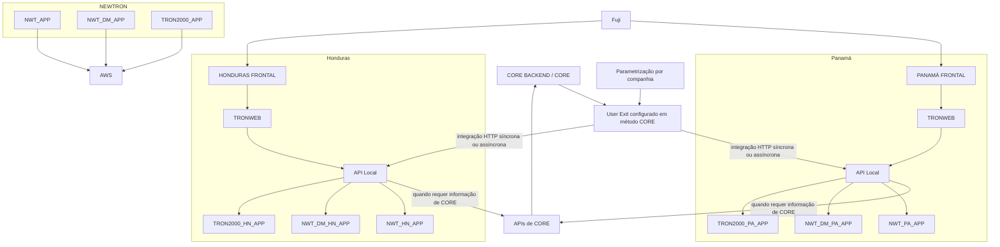
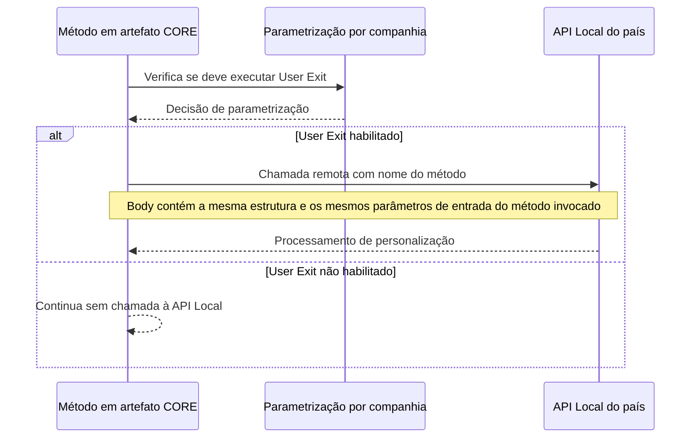
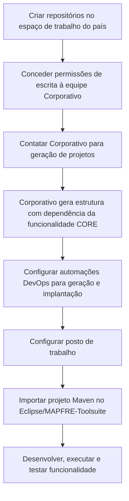

# Modelo de Desenvolvimento Java TRON REEF — Personalização por User Exit e API Local de País

## 1. Metadados do Documento
- **Arquivo de Origem:** Não identificado no conteúdo extraído; documentação intitulada “Modelo de desarrollo Java TRON REEF”.
- **Tipo de Documento:** Arquitetura de Software / Procedimento de Desenvolvimento.
- **Domínio / Sistema:** REEF, CORE, TRON, NEWTRON, APIs locais de país e MAPFRE-Toolsuite.
- **Público-Alvo:** Desenvolvedores, arquitetos, equipes de país, equipe Corporativo e operação DevOps.
- **Data/Versão Identificada:** Não identificada. O ciclo de vida apresentado é `Approved Source / VL`.

---

## 2. Resumo Executivo & Contexto de Negócio

O documento descreve o modelo de desenvolvimento Java para REEF e a estratégia de personalização específica por país. A abordagem substitui a personalização baseada na extensão de componentes por um mecanismo denominado **User Exit**, incorporado ao artefato CORE publicado em REEF.

O objetivo arquitetural é reduzir a quantidade de artefatos locais mantidos por cada país. Em vez de possuir um artefato local para cada módulo, como frontais e APIs, cada país passa a concentrar o código de personalização e as novas APIs necessárias em um projeto/artefato de APIs locais. Países também possuem um projeto Frontal adicional para implementar novos fluxos, que são orquestrados por Fuji.

A atualização transparente dos artefatos é um dos benefícios explícitos do modelo. O documento afirma que a atualização de artefatos elimina a necessidade de implantar outros artefatos em decorrência de uma atualização. O mesmo artefato CORE é publicado no REEF, contendo pontos específicos de personalização sob demanda por meio de User Exit.

A arquitetura estabelece limites claros de acoplamento. A API local de país não pode utilizar bibliotecas de CORE nem realizar chamadas diretas a SR de CORE. Quando a API local necessitar de informações do CORE, deverá invocar APIs destinadas a essa finalidade. Essa restrição preserva o desacoplamento entre personalizações locais e componentes centrais.

O documento também define responsabilidades operacionais: países criam e hospedam seus repositórios em espaço de trabalho próprio; a equipe Corporativo gera estruturas de projetos com dependências de CORE e, inicialmente, configura automações DevOps para geração e implantação dos artefatos nos ambientes.

---

## 3. Arquitetura, Componentes & Tecnologias Envolvidas

### Componentes identificados

| Componente / Tecnologia | Papel descrito no documento |
| :--- | :--- |
| REEF | Plataforma na qual é publicado o mesmo artefato de CORE e na qual são desenvolvidas personalizações. |
| CORE | Conjunto de artefatos centrais que contém pontos de personalização denominados User Exit. |
| User Exit | Mecanismo de personalização sob demanda, configurado em pontos específicos dos artefatos CORE. |
| API Local de País | Projeto backend Java que recebe serviços de personalização do país e novos serviços locais definidos a partir de Swagger. |
| Spring Boot (Gaia Boot) | Base tecnológica da API de País. |
| Frontal adicional de país | Projeto Frontal adicional destinado a incorporar novos fluxos construídos pelo país. |
| Fuji | Orquestrador dos novos fluxos criados nos projetos Frontais adicionais. |
| TRONWEB | Elemento apresentado na arquitetura associado aos Frontais e APIs locais de Panamá e Honduras. |
| NEWTRON | Camada apresentada na arquitetura contendo aplicações específicas de país e aplicações CORE. |
| APIs de CORE | Meio pelo qual a API local deve obter informações do CORE, em vez de realizar chamadas diretas a SR de CORE. |
| AWS | Ambiente indicado no diagrama arquitetural. |
| Git | Sistema de controle de versões. |
| MAPFRE-Toolsuite | IDE baseado em Eclipse, com plugins e configuração inicial. |
| Eclipse | Base da MAPFRE-Toolsuite e ambiente citado para importação/configuração de projetos Maven. |
| Maven | Ferramenta de gestão de projetos, compilação e administração de dependências. |
| Azure Artifacts | Destino configurado no `settings.xml` do Maven. |
| Tomcat | Servidor web citado como utilitário disponível na MAPFRE-Toolsuite. |
| Soap UI | Ferramenta citada para teste de serviços web. |
| Visual Studio | Ferramenta utilizada para desenvolvimentos de frontal e como ambiente visual para Git. |
| Oracle SQL Developer | Ferramenta para trabalhar com bases de dados Oracle. |

### Arquitetura e relação entre os componentes



> **Nota de Análise:** O diagrama representa relações explicitamente descritas ou apresentadas visualmente no conteúdo extraído. O documento não detalha contratos HTTP, endpoints concretos, portas, métodos HTTP, payloads JSON, versões de Spring Boot, topologia de AWS ou significado expandido das siglas `NWT`, `DM`, `SR` e `TRON2000`.

### Fluxo padronizado de User Exit



---

## 4. Regras de Negócio, Especificações Funcionais & Processos

### 4.1 Princípios de personalização em REEF

1. A personalização deixa de se basear na extensão de componentes e passa a utilizar o conceito de **User Exit**.
2. O mesmo artefato de CORE é publicado em REEF.
3. O artefato CORE inclui a capacidade de personalização User Exit em pontos específicos e sob demanda.
4. A atualização de artefatos deve ocorrer de forma transparente, eliminando a necessidade de implantar outros artefatos devido a uma atualização.
5. O país não deve possuir um artefato local para cada módulo, incluindo frontais e APIs.
6. O país deve gerenciar um projeto/artefato de APIs que contenha:
   - código de personalização;
   - novas APIs que o país necessite implementar.
7. Não é permitida a modificação dos fluxos Frontais atuais de CORE.
8. A personalização de fluxos somente é permitida por:
   - menu de opções;
   - tarefas;
   - novos fluxos;
   - capacidades de parametrização do fluxo correspondente.
9. Cada país possui um projeto Frontal adicional para incluir código de novos fluxos.
10. Os novos fluxos dos projetos Frontais adicionais são orquestrados por Fuji.
11. Personalizações que alterem o comportamento de um fluxo CORE e possam ser resolvidas por parametrização devem ser incorporadas ao CORE.
12. A incorporação ao CORE busca minimizar personalizações e disponibilizar as novas capacidades aos demais países.
13. A nova arquitetura impacta diretamente os processos de Tarefas Java e o Módulo de notificações de saída.
14. Tarefas Java e o Módulo de notificações de saída devem ser adaptados para permitir integração com projetos API locais, onde reside a funcionalidade local.

### 4.2 Regras para User Exit

| Regra | Especificação |
| :--- | :--- |
| Gatilho de execução | Os artefatos CORE podem adicionar uma modificação para determinar se uma chamada a método remoto da API Local do país deve ser executada. |
| Critério de decisão | A verificação é realizada com base em parametrização. |
| Modalidade de invocação | São permitidas invocações síncronas e assíncronas, conforme a necessidade. |
| Requisito de elegibilidade | O mecanismo somente pode ser incluído em métodos que tenham a companhia como parâmetro de entrada, pois a companhia integra a configuração. |
| Restrição de serialização | Não é permitido estender métodos que tenham atributos não serializáveis. |
| Formato da chamada | A chamada remota segue uma forma padronizada. |
| Corpo da requisição | Em princípio, o body contém a mesma estrutura de informação de parâmetros do método invocado. |
| Serviço na API local | A API do país constrói um serviço REST com o nome do método personalizado. |
| Entrada do serviço local | O serviço REST recebe o mesmo body, contendo os mesmos parâmetros originais de entrada. |
| Aceleradores | O padrão permite gerar aceleradores para construir os controllers pertinentes com base nos métodos que serão parametrizados. |

### 4.3 Regras da API de País

1. A API de País é um projeto backend Java baseado em Spring Boot (Gaia Boot).
2. A API de País incorpora os serviços de personalização necessários para o país.
3. A API de País inclui chamadas provenientes de todos os artefatos de CORE.
4. Para cada método a personalizar, deve ser incorporado um controller com a mesma interface do método.
5. A partir do Swagger de definição de API, o país constrói seus próprios serviços locais.
6. Os módulos devem ser distinguidos por nomenclatura.
7. A API de País não pode utilizar bibliotecas de CORE, para evitar acoplamento.
8. A API de País não pode realizar chamadas diretas a SR de CORE, pelo mesmo motivo de evitar acoplamento.
9. Quando a API de País necessitar de informação de CORE, deve realizar invocações às APIs destinadas a esse propósito.

### 4.4 Processo de desenvolvimento de personalizações



### 4.5 Criação de repositórios

1. Antes de iniciar desenvolvimentos, devem existir repositórios para cada projeto personalizado.
2. Os repositórios devem ser hospedados em espaço de trabalho próprio do país.
3. A responsabilidade pela criação dos repositórios é do país.
4. A nomenclatura apresentada para repositórios de APIs e Newtron utiliza `xx` como código do país ou países.
5. O repositório de API local identificado é `xx_tron_api`.
6. Após a criação dos repositórios, deve-se conceder permissões de escrita a várias pessoas da equipe Corporativo.
7. O contato da equipe Corporativo deve ser consultado para definir as pessoas que receberão permissão de escrita.

### 4.6 Geração de projetos

1. A geração de projetos cria estrutura e configuração para os desenvolvimentos das aplicações personalizadas.
2. Para cada projeto, é gerada uma dependência da funcionalidade CORE correspondente.
3. A tarefa é responsabilidade da equipe Corporativo.
4. A equipe do país deve contatar Corporativo para executar a geração.

### 4.7 Automação DevOps

1. A automação DevOps configura mecanismos e automatismos para geração e implantação dos artefatos nos diferentes ambientes.
2. Inicialmente, a responsabilidade da automação DevOps é de Corporativo.

### 4.8 Configuração do posto de trabalho

| Requisito | Configuração exigida |
| :--- | :--- |
| IDE preferencial | MAPFRE-Toolsuite. |
| Uso de IDE alternativo | Permitido, desde que a configuração exigida seja respeitada. |
| Java | Versão 1.8. |
| Maven | Versão 3.6.x. |
| Maven `settings.xml` | Deve apontar para Azure Artifacts. |
| Encoding | UTF-8. |
| Diretório da MAPFRE-Toolsuite | Pasta `MAPFRE-toolsuite` na raiz de `C:/`. |
| Arquivos de inicialização | Existem dois arquivos `.BAT`: um abre o IDE e outro abre uma janela CMD com variáveis de ambiente criadas. |

### 4.9 Abertura do Eclipse e configuração do Maven

1. Entrar na pasta `MAPFRE-toolsuite`, localizada na raiz de `C:/`.
2. Identificar os dois arquivos `.BAT`:
   - um arquivo abre o IDE;
   - outro arquivo abre uma janela CMD com as variáveis de ambiente criadas.
3. Clicar no arquivo `.BAT` que abre o IDE.
4. Confirmar que o `settings.xml` do Maven aponta para Azure Artifacts.
5. Configurar o `settings.xml` com o token do usuário.
6. No Eclipse, acessar `Window > Preferences`.
7. Buscar e selecionar `Maven`.
8. Selecionar `User Settings`.
9. Clicar no link `open file` para abrir o `settings.xml`.
10. Seguir as instruções do link citado no documento para configurar corretamente o arquivo.

> **Nota de Análise:** O conteúdo extraído menciona “Sigue las instrucciones de este este enlace”, mas não fornece a URL ou o conteúdo desse link. Portanto, os detalhes adicionais de configuração do Azure Artifacts não estão disponíveis no documento.

### 4.10 Importação de projetos Maven

1. Abrir o Eclipse.
2. Selecionar `File > Import > Existing Maven Project`.
3. Selecionar o diretório raiz do projeto a importar.
4. Clicar em `Aceptar`.

### 4.11 Testing

O documento declara que a seção Testing explicará como executar o projeto e testar sua funcionalidade. Entretanto, o conteúdo extraído não apresenta procedimentos, comandos, ferramentas adicionais, casos de teste ou critérios de aprovação para essa seção.

### 4.12 Atualizações da release de Core

O documento apresenta o título “Actualizaciones de la release de Core”, mas o conteúdo extraído não contém detalhamento adicional sobre alterações, versões, procedimentos de atualização ou impactos da release de CORE.

---

## 5. Tabelas de Parâmetros, Ambientes e Estruturas de Dados

| Item / Parâmetro | Descrição / Função | Tipo / Valores / Formato | Ambiente / Observações |
| :--- | :--- | :--- | :--- |
| User Exit | Capacidade de personalização incorporada em pontos específicos do CORE. | Mecanismo sob demanda. | A execução depende de parametrização. |
| Companhia | Parte da configuração usada para determinar a execução de User Exit. | Parâmetro de entrada do método CORE elegível. | Métodos sem companhia como entrada não são elegíveis. |
| Tipo de invocação | Forma de integração entre CORE e API Local. | Síncrona ou assíncrona. | Selecionada segundo a necessidade. |
| Atributos do método | Dados aceitos no método elegível para extensão. | Não podem ser não serializáveis. | Métodos com atributos não serializáveis não podem ser estendidos. |
| Nome do serviço REST | Nome do método que se deseja personalizar. | Nome do método invocado. | O serviço REST da API Local recebe esse nome. |
| Body da requisição | Conteúdo enviado do CORE para a API Local. | Mesma estrutura e mesmos parâmetros de entrada do método original. | Padrão de chamada indicado “em princípio”. |
| Controller da API Local | Interface para tratamento da personalização. | Mesma interface do método que se deseja personalizar. | Implementado no projeto API de País. |
| API Local de País | Projeto que concentra personalizações e novas APIs do país. | Backend Java com Spring Boot (Gaia Boot). | Não utiliza bibliotecas CORE nem chama SR de CORE diretamente. |
| Repositório API local | Repositório do projeto local de API do país. | `xx_tron_api`. | `xx` deve ser substituído pelo código do país ou países. |
| Java | Versão exigida para desenvolvimento. | `1.8`. | Configuração mínima do posto de trabalho. |
| Maven | Ferramenta de compilação e dependências. | `3.6.x`. | O `settings.xml` deve apontar para Azure Artifacts. |
| Encoding | Codificação do ambiente de desenvolvimento. | `UTF-8`. | Deve ser respeitada mesmo usando IDE alternativo. |
| Azure Artifacts | Repositório indicado para configuração Maven. | Referência no `settings.xml`. | Deve ser configurado com token do usuário. |
| Diretório da Toolsuite | Localização indicada da MAPFRE-Toolsuite. | `C:/MAPFRE-toolsuite`. | Contém dois arquivos `.BAT`. |
| Arquivo `.BAT` do IDE | Inicializa o ambiente de desenvolvimento. | Arquivo Batch. | Um dos dois `.BAT` abre o IDE. |
| Arquivo `.BAT` de CMD | Abre janela CMD com variáveis de ambiente criadas. | Arquivo Batch. | Disponível na pasta da MAPFRE-Toolsuite. |
| Importação Maven | Procedimento de importação de projeto. | `File > Import > Existing Maven Project`. | Requer seleção do diretório raiz do projeto. |
| Tarefas Java | Processo existente impactado pela nova arquitetura. | Processo a adaptar. | Deve permitir integração com projetos API locais. |
| Módulo de notificações de saída | Processo existente impactado pela nova arquitetura. | Módulo a adaptar. | Deve permitir integração com projetos API locais. |

---

## 6. Bateria de Perguntas & Respostas para RAG (FAQ Sintético)

### P1: Qual é a mudança central no modelo de personalização do REEF?
**R:** O modelo substitui a personalização baseada na extensão de componentes pelo conceito de **User Exit**. O mesmo artefato CORE é publicado em REEF e oferece pontos específicos de personalização sob demanda, configurados por parametrização.

### P2: Quais componentes locais cada país deve manter nesse modelo?
**R:** O país não deve manter um artefato local para cada módulo, como frontais e APIs. O país passa a gerenciar um projeto/artefato de APIs que concentra o código de personalização e as novas APIs necessárias. Além disso, cada país possui um projeto Frontal adicional para novos fluxos, orquestrados por Fuji.

### P3: Um país pode alterar diretamente os fluxos Frontais existentes do CORE?
**R:** Não. O documento determina que os fluxos Frontais atuais de CORE não podem ser modificados. A personalização é permitida por meio de menu de opções, tarefas, novos fluxos ou capacidades de parametrização do fluxo correspondente.

### P4: Em quais condições um método CORE pode utilizar o mecanismo de User Exit?
**R:** O mecanismo só pode ser adicionado a métodos que tenham a companhia como parâmetro de entrada, porque a companhia faz parte da configuração. Também não é permitido estender métodos que possuam atributos não serializáveis.

### P5: Como o CORE invoca uma personalização implementada pela API Local de um país?
**R:** Após verificar a parametrização, o CORE pode realizar uma chamada remota síncrona ou assíncrona à API Local. O serviço REST da API Local possui o nome do método personalizado e recebe no body a mesma estrutura de parâmetros e os mesmos parâmetros de entrada do método CORE originalmente invocado.

### P6: A API Local de País pode usar bibliotecas do CORE ou chamar SR de CORE diretamente?
**R:** Não. A API Local de País não pode usar bibliotecas de CORE e não pode realizar chamadas diretas a SR de CORE, para evitar acoplamento. Quando precisar de informações do CORE, deve utilizar as APIs destinadas a esse propósito.

### P7: Qual tecnologia é usada para implementar a API de País?
**R:** A API de País é descrita como um projeto backend Java baseado em Spring Boot, especificamente identificado no documento como Gaia Boot. O projeto contém serviços de personalização e serviços locais construídos a partir do Swagger de definição de API.

### P8: Quem é responsável por criar os repositórios e quem gera a estrutura dos projetos?
**R:** A criação e hospedagem dos repositórios em um espaço de trabalho próprio são responsabilidade do país. A geração da estrutura e configuração dos projetos, com dependência da funcionalidade CORE correspondente, é responsabilidade da equipe Corporativo.

### P9: Qual é o nome padrão do repositório da API local de país?
**R:** O repositório é denominado `xx_tron_api`, em que `xx` deve ser substituído pelo código do país ou dos países. O documento o identifica como o projeto de API local.

### P10: Quais configurações mínimas são necessárias no ambiente de desenvolvimento?
**R:** O ambiente deve utilizar preferencialmente MAPFRE-Toolsuite, embora outras IDEs sejam permitidas se respeitarem Java 1.8, Maven 3.6.x, `settings.xml` apontando para Azure Artifacts e encoding UTF-8.

### P11: Como configurar o Maven no Eclipse para os projetos REEF?
**R:** O `settings.xml` do Maven deve apontar para Azure Artifacts e ser configurado com o token do usuário. No Eclipse, o caminho indicado é `Window > Preferences`, buscar `Maven`, selecionar `User Settings` e clicar no link `open file` para abrir o arquivo.

### P12: Quais processos existentes são diretamente impactados pela nova arquitetura?
**R:** O documento identifica as Tarefas Java e o Módulo de notificações de saída como processos diretamente impactados. Ambos devem ser adaptados para permitir integração com os projetos API locais, onde reside a funcionalidade local.

---

## 7. Glossário de Termos, Siglas & Conceitos-Chave

- **API:** Interface de programação utilizada, no contexto do documento, para integrar CORE e APIs locais e para expor serviços locais.
- **API Local / API de País:** Projeto backend Java por país que concentra personalizações e novas APIs locais.
- **AWS:** Ambiente indicado no diagrama de arquitetura. O documento não detalha os serviços AWS utilizados.
- **Azure Artifacts:** Destino que deve ser configurado no arquivo `settings.xml` do Maven.
- **Body:** Corpo da requisição HTTP que contém a estrutura e os parâmetros de entrada do método invocado.
- **CORE:** Artefatos e funcionalidades centrais publicados em REEF.
- **DevOps:** Mecanismos e automatismos para geração e implantação dos artefatos nos ambientes.
- **Eclipse:** IDE que serve como base para a MAPFRE-Toolsuite.
- **Fuji:** Componente responsável por orquestrar os novos fluxos dos projetos Frontais adicionais.
- **Gaia Boot:** Denominação apresentada para a base Spring Boot usada pela API de País.
- **Git:** Sistema de controle de versões.
- **MAPFRE-Toolsuite:** Ambiente de desenvolvimento baseado em Eclipse, com plugins e configuração inicial.
- **Maven:** Ferramenta para compilação, gestão de projetos e administração de dependências.
- **NEWTRON:** Camada apresentada no diagrama arquitetural. O documento não expande a sigla.
- **REST:** Estilo de serviço utilizado para os controllers e serviços da API Local.
- **REEF:** Plataforma e contexto de desenvolvimento no qual os artefatos CORE e as personalizações são gerenciados.
- **SR de CORE:** Elemento que a API Local não pode chamar diretamente. O documento não define a sigla `SR`.
- **Swagger:** Definição de API usada pelo país para construir seus próprios serviços locais.
- **TRONWEB:** Componente apresentado na arquitetura junto aos Frontais e APIs locais. O documento não detalha sua função.
- **User Exit:** Mecanismo de personalização sob demanda, acionado por parametrização em métodos elegíveis do CORE.
- **UTF-8:** Encoding exigido para o ambiente de desenvolvimento.

---

## 8. Notas Críticas, Riscos & Limitações

- A API Local de País não pode utilizar bibliotecas de CORE nem chamar diretamente SR de CORE. Implementações que ignorem essa regra criam acoplamento contrário ao modelo arquitetural descrito.
- User Exit somente pode ser aplicado a métodos que tenham a companhia como parâmetro de entrada.
- Métodos com atributos não serializáveis não podem ser estendidos pelo mecanismo de User Exit.
- Os fluxos Frontais existentes de CORE não podem ser modificados diretamente.
- Personalizações de comportamento de CORE que possam ser atendidas por parametrização devem ser incorporadas ao CORE, reduzindo customizações locais.
- A criação dos repositórios é responsabilidade do país, mas a geração dos projetos depende de contato e execução pela equipe Corporativo.
- A automação DevOps é inicialmente responsabilidade de Corporativo, indicando dependência operacional entre equipes.
- A configuração do Maven depende de token para Azure Artifacts, mas o documento não fornece processo de obtenção, renovação, armazenamento seguro ou escopo desse token.
- O documento cita um link de instruções para configurar o `settings.xml`, mas o link não está presente no conteúdo extraído.
- A seção Testing não contém comandos, critérios de aceitação, estratégia de testes, ferramentas de automação ou exemplos de execução.
- A seção “Actualizaciones de la release de Core” não contém informações sobre versões, alterações ou procedimento de atualização.
- O diagrama cita componentes como `NWT_APP`, `NWT_DM_APP`, `TRON2000_APP`, `TRONWEB`, AWS e SR de CORE, mas não detalha contratos, responsabilidades, protocolos completos ou significados de siglas.

---

## 9. Conteúdo Bruto Estruturado (Referência Fiel)

```text
--- [PÁGINA 1 DE 4] ---

Modelo de desarrollo Java TRON REEF
Modelo de desarrollo Java TRON REEF
Introducción
Arquitectura
Detalle de la implementación
User Exit
API de País
Desarrollo
Creación de los repositorios
Generación de los proyectos
Configuración del puesto de trabajo
Comenzando con MAPFRE-Toolsuite
Testing
Actualizaciones de la release de Core
Introducción
El presente documento explica como se manejan los artefactos en REEF y como se permite la personalización específica de los países. La
personalización como se entendía hasta ahora se basaba en la extensión de componentes. A partir de ahora la personalización se realiza
utilizando el concepto de user exit:
Actualización de artefactos: Se añade la capacidad de actualizar los artefactos de manera transparente, eliminando la necesidad de
desplegar otros artefactos debido a una actualización.
Artefacto CORE en REEF: Se publica en REEF el mismo artefacto de CORE. Este artefacto incluye la capacidad de personalización
llamada "User Exit". La capacidad se añade en puntos específicos de CORE y se realiza bajo demanda.
Artefacto local del país: Con este enfoque, el país no tendrá un artefacto local para cada uno de los módulos (frontal, apis, etc.). En
cambio, solo manejará un proyecto/artefacto de APIS, que incluirá tanto su código de personalización como las nuevas APIs que
necesite implementar.
Para proporcionar esta personalización se definen los siguientes principios:
Personalización de los flujos: No se permite la modificación de los flujos de frontal actuales de CORE. La personalización sólo se
permitirá a través de un menú de opciones, ya sea mediante tareas, flujos nuevos, o por capacidades de parametrización del flujo
correspondiente.
Proyecto Frontal adicional: Cada país tendrá un proyecto Frontal adicional para incorporar el código de los nuevos flujos que construya.
Estos flujos serán orquestados a través de Fuji.
Incorporación de funcionalidad a CORE: Las personalizaciones que alteran el comportamiento del flujo de CORE y que puedan
satisfacerse vía parametrización, deberían ser incorporadas al CORE. Esto minimiza la personalización y ofrece al resto de países estas
nuevas capacidades.
Documentation / DOCUMENTACIÓN Reef
DOCUMENTACIÓN Reef
Mapfredocument
DOCUMENTACIÓN Reef
Owner
user:agonzalez_mapfre.com
Lifecycle
Approved Source
 /
VL
Buscar Inicio Soluciones Arquitecturas APIs Componentes Cloud Documentación Zeus Reef Ayuda
ES

--- [PÁGINA 2 DE 4] ---

Impacto en procesos existentes: Esta nueva arquitectura impacta directamente en procesos como las Tareas Java y el Módulo de
notificaciones de salida. Estos procesos se adaptarán para permitir la integración de los proyectos API locales donde residirá toda su
funcionalidad.
Arquitectura
CORE BACKEND
NEWTRON
PANAMÁ
HONDURAS
FRONTALES
APIS
CORE
PANAMÁ
FRONTAL
API Local
TRONWEB
HONDURAS
FRONTAL
API Local
TRONWEB
integración http integración http
CORE
NWT_PA_APP
NWT_DM_PA_APP
TRON2000_PA_APP
NWT_HN_APP
NWT_DM_HN_APP
TRON2000_HN_APP
NWT_APP
NWT_DM_APP
TRON2000_APP
AWS
Detalle de la implementación
User Exit
En los distintos artefactos de CORE se permitirá añadir una modificación que permita determinar si se ha de ejecutar una llamada a un
método remoto del API Local del país. Esta comprobación se hará en base a una parametrización.
Se permitirán invocaciones síncrona y asíncronas en fucion de la necesidad.
Sólo se permitirá añadir este mecanismo en métodos que dispongan de la compañía como parámetros de entrada, puesto qe será parte de la
configuración.
No se permitiará extender métodos que dispongan de atributos no serializables.
Se define una forma estándar de realizar estas llamadsa. En principio, en el body de la petición se enviará la misma estructura de información
de parámetros que el método invocado, de tal manera, que en el API del país, se construirá un servicio REST con el nombre del método y
recibirá como entrada el mismo body conteniendo los mismos parámetros de entrada originales. Esto, nos permitirá generar aceleradores
para construir los controllers pertinentes en base a los métodos que se quieran parametrizar.
API de País
Se trata del proyecto backend java, basado en Spring Boot (Gaia Boot), en el que se incorporará los servicios de personalización que necesite
el país. Incluirá las llamadas que se ralicen desde todos los artefactos de CORE.
Para ello, se incorporará un controller con la misma interfaz que el método que se quiere personalizar.
Además, será el proyecto donde el país a partir del swagger de definición de API, construirá sus propios servicios locales. Para ello, se
distinguirá cada uno de los módulos en base a nomenclatura.

--- [PÁGINA 3 DE 4] ---

Este API del país, no puede usar ninguna librería de core para evitar el acoplamiento. De la misma manera, no puede hacer llamadas directa a
SR de CORE por el mismo motivo. Para ello, cuando requiera de información del core, tendrá que realizar invocaciones a las APIS para dicho
propósito.
Desarrollo
Este apartado explica los pasos que se deben llevar a cabo para empezar a desarrollar en REEF las personalizaciones. Se tratan los
siguientes puntos:
Creación repositorios. Este paso consiste en crear el espacio de trabajo en el control de versiones utilizado. Es responsabilidad del país.
Generación proyectos. Este paso consiste en generar la estructura de los proyectos en los que se realizarán los desarrollos.
Automatización DevOps. Este paso consiste en configurar los mecanismos y automatismos que permiten la generación y despliegue de
los artefactos en los distintos ambientes. Inicialmente es responsabilidad de Corporativo.
Creación de los repositorios
Previo a comenzar los desarrollos es necesario tener creados los repositorios para cada uno de los proyectos personalizados. Los
repositorios deben ser alojados en un espacio de trabajo propio del país. Estos repositorios deben tener una nomenclatura concreta. Los
repositorios que se crean actualmente (dentro de APIs y Newtron) son los siguientes, sustituyendo la "xx" por el código del país/países:
APIs
xx_tron_api. Proyecto de API local
Una vez creados los repositorios se debe dar permisos de escritura a varias personas del equipo de Corporativo. Para ello se debe consultar
con la persona de contacto de Corporativo.
Generación de los proyectos
Este paso consiste en generar la estructura y configuración de los proyectos en los que se desarrollarán las aplicaciones personalizadas.
Para cada uno se genera un proyecto con dependencia a la funcionalidad correspondiente de core. Esta tarea es responsabilidad del equipo
de Corporativo por lo que se debe contactar con Corporativo para realizar este paso.
Configuración del puesto de trabajo
Para hacer los desarrollos se suelen utilizan las siguientes herramientas en los puestos de trabajo:
MAPFRE-Toolsuite: Se basa en Eclipse que es un IDE popular para el desarrollo de software. Cuenta con una colección de varios plugins
preinstalados y una configuración inicial.
Tiene incluidas las siguientes utilidades/aplicaciones que pueden ser instaladas y utilizadas aparte: - Tomcat: Servidor web que se utiliza
para ejecutar aplicaciones Java. - Maven: Herramienta de gestión de proyectos utilizada para compilar y administrar dependencias. -
Soap UI: Herramienta para probar servicios web.
Se puede descargar aquí.
Git: Sistema de control de versiones.
Visual Studio: Para desarrollos de frontal. También se utiliza como entorno visual para trabajar Git.
Oracle SQL Developer: Herramienta para trabajar con bases de datos Oracle.
Comenzando con MAPFRE-Toolsuite
El IDE será preferentemente MAPFRE-Toolsuite pero se pueden utilizar otros siempre y cuando se respeten la siguiente configuración:
Versión de Java 1.8.
Versión de Maven 3.6.x.
Configuración del settings.xml apuntando a Azure Artifacts.
Configuración del encoding UTF-8.
Para abrir Eclipse, seguir estos pasos:
Entrar en la carpeta MAPFRE-toolsuite que se encuentra en la carpeta raíz C:/.
Dentro de esa carpeta, hay dos archivos .BAT: uno abre el IDE y el otro abre una ventana de CMD con todas las variables del entorno
creadas.

--- [PÁGINA 4 DE 4] ---

Hacer clic en el archivo .BAT que abre el IDE.
Para asegurar que el archivo settings.xml de Maven sea correcto, este debe apuntar a Azure Artifacts y debemos configurarlo con nuestro
token. Para configurar el archivo settings.xml de Maven en Eclipse se pueden seguir estos pasos:
Hacer clic en Window > Preferences.
Buscar Maven y hacer clic en él.
Seleccionar User Settings.
Hacer clic en el enlace "open file" para abrir el settings.xml.
Sigue las instrucciones de este este enlace para configurarlo correctamente.
Una vez abierto el Eclipse, se pueden importar los distintos proyectos siguiendo estos pasos:
Hacer clic en File > Import > Existing Maven Project.
Seleccionar el directorio raíz del proyecto a importar.
Hacer clic en Aceptar.
Testing
En este apartado explicaremos como ejecutar nuestro proyecto y como probar su funcionalidad.
Actualizaciones de la release de Core
```
