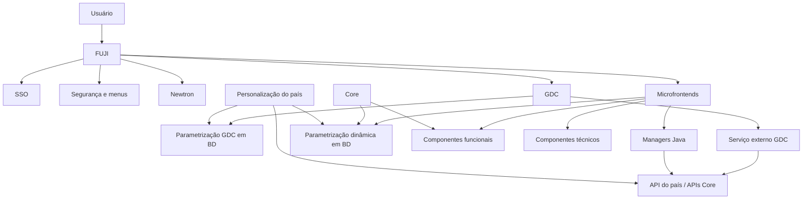
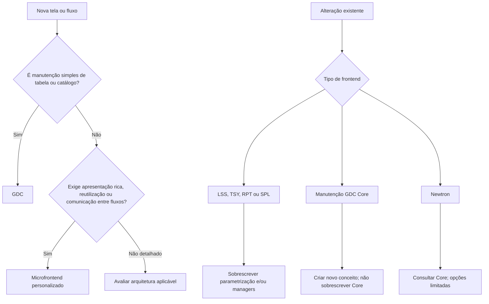

# Modelo de Desenvolvimento Front TRON REEF — Personalização de Newtron, GDC e Microfrontends

## 1. Metadados do Documento
- **Arquivo de Origem:** Não identificado no conteúdo extraído
- **Tipo de Documento:** Arquitetura de Software / Guia de Desenvolvimento
- **Domínio / Sistema:** TRON REEF, Newtron, GDC e microfrontends
- **Público-Alvo:** Desenvolvedores, Arquitetos, Operação e equipes corporativas/locais
- **Data/Versão Identificada:** Não identificada

---

## 2. Resumo Executivo & Contexto de Negócio

O documento descreve o modelo de personalização da camada frontend do TRON REEF para instalações nacionais. O escopo abrange três modalidades de interface: Newtron, GDC (Generador de Conceptos) e microfrontends personalizados. A aplicação FUJI atua como lançador unificado de fluxos, segurança, menus, companhia, idioma e SSO.

Antes do desenvolvimento, cada país deve criar repositórios com nomenclatura definida, solicitar à equipe Corporativa a geração de projetos dependentes da funcionalidade Core e configurar o posto de trabalho com ferramentas como Eclipse, Visual Studio Code, Tomcat, Maven, Git, Soap UI e SQL Developer.

A seleção da abordagem de desenvolvimento depende da complexidade funcional. Manutenções simples de tabelas ou catálogos, sem necessidade de apresentação diferenciada, reutilização ou comunicação com outros fluxos, devem usar GDC. Telas e fluxos mais complexos, reutilizáveis, ricos em componentes ou integrados com outras telas devem ser implementados como microfrontends personalizados.

A personalização prioriza configurações por instalação ou país. Nas parametrizações de microfrontends, registros locais podem sobrescrever registros Core quando utilizam o código de instalação do país. Entretanto, determinadas configurações, como transições de navegação e dependências de managers, devem ser redefinidas integralmente para cada origem ou ação principal quando existir uma personalização local.

Newtron possui restrições de extensão: suas telas normalmente não são personalizáveis. O documento prevê menu de opções e extensão por dados variáveis apenas para os conceitos OPlyIneP, OPlyIneCPT e OThpAcvP. Outras extensões dependem de avaliação do Core.

---

## 3. Arquitetura, Componentes & Tecnologias Envolvidas

| Componente / Tecnologia | Papel identificado |
| :--- | :--- |
| TRON REEF | Plataforma que reúne os frontends Core e personalizados. |
| FUJI | Lançador de fluxos que unifica interfaces, comunicação, segurança, menus, companhia, idioma e SSO. |
| GDC | Generador de Conceptos; cria CRUDs de tabelas por parametrização em banco de dados e editor WYSIWYG. |
| Newtron | Camada frontal com possibilidades limitadas de personalização. |
| Microfrontends | Frontends dinâmicos personalizados, configurados por componentes funcionais, parametrização e managers. |
| Core | Camada corporativa de funcionalidades, componentes e parametrizações reutilizáveis. |
| API do país | Camada onde devem residir validações de negócio de GDC e managers personalizados. |
| CMN_API | API Core onde, no momento descrito, são desenvolvidas lógicas Core. |
| Azure Artifacts | Fonte indicada para obtenção de versões de dependências funcionais. |
| Azure AD | Origem do NUUMA do usuário, utilizado no campo `COD_SAPTRON`. |
| Bitbucket | Repositório utilizado para versionamento e passagem de configurações GDC entre ambientes. |
| Eclipse / MAPFRE-Toolsuite | IDE e conjunto corporativo de plugins/configuração. |
| Visual Studio Code | Ambiente para desenvolvimento frontend e trabalho visual com Git. |
| Tomcat | Servidor web para executar aplicações Java. |
| Maven | Compilação e administração de dependências. |
| Git | Controle de versão. |
| Soap UI | Teste de serviços web. |
| SQL Developer | Trabalho com banco de dados. |



### Modelo de desenvolvimento por tipo de necessidade



---

## 4. Regras de Negócio, Especificações Funcionais & Processos

### 4.1 Preparação de repositórios

Os repositórios personalizados devem ser hospedados em um espaço de trabalho próprio. A nomenclatura utiliza `XXX` como código do país ou países.

| Tipo | Repositório | Finalidade |
| :--- | :--- | :--- |
| GDC | `xx_gdc_conf` | Transportar entre ambientes a parametrização das telas GDC. |
| Newtron | `xx_tron_fe_nwt` | Projeto da camada frontal Newtron. |
| Microfrontends | `xx_tron_fe` | Projeto da camada frontal de microfrontends. |

Após a criação, várias pessoas da equipe Corporativa devem receber permissão de escrita. O documento orienta consultar a pessoa de contato Corporativa.

### 4.2 Geração de projetos

A equipe Corporativa é responsável por gerar a estrutura e configuração dos projetos personalizados. Cada projeto gerado depende da funcionalidade correspondente do Core.

### 4.3 Seleção entre GDC e microfrontends

- Use **GDC** para CRUDs simples, tabelas ou fluxos dependentes de tabelas quando:
  - não há necessidade de apresentação diferenciada;
  - não há necessidade de reutilização;
  - não há comunicação com outras telas ou fluxos.
- Use **microfrontends personalizados** para telas ou fluxos que:
  - exigem apresentação mais complexa;
  - precisam de componentes mais ricos;
  - exigem reutilização;
  - comunicam-se com outras telas ou fluxos.

### 4.4 Desenvolvimento GDC

GDC cria CRUDs de tabelas por editor WYSIWYG e por parametrização de banco de dados. A aplicação gera telas em tempo de execução, a partir de parâmetros que definem campos, ordem, visibilidade e componentes de apresentação.

GDC suporta listas de valores, listas de opções, dependências entre campos, valores padrão, valores autocalculados, ajudas, usuários, papéis e permissões de ações sobre registros.

Há dois perfis identificados:
1. Usuário final: utiliza as telas disponíveis no REEF.
2. Usuário configurador: cria telas no editor e as disponibiliza na aplicação.

Para cada manutenção GDC, devem ser desenvolvidos:
1. Parametrização da tela.
2. Lógica de negócio, apenas quando necessária.

#### Regras de parametrização GDC

- Todas as tabelas que definem uma manutenção possuem a coluna `COD_CIA`.
- `COD_CIA` deve sempre receber a companhia da instalação.
- Cada país deve informar nessa coluna o código de sua própria companhia.
- Os códigos dos conceitos devem seguir uma numeração que não colida com códigos Core.
- A numeração deve ser consultada com a equipe Corporativa.
- O acelerador GDC é usado para criar o esqueleto inicial da manutenção.
- Após criar o CRUD, o configurador ajusta telas, rótulos, campos, componentes de apresentação e lógicas de apresentação.

#### URL de acesso a um conceito GDC

```text
https://{$contexto}/GDC/#/menu/conceptos/XXXX?cmpVal=X&lngVal=xx
```

- `XXXX`: identificador único do conceito.
- `cmpVal`: identificador numérico da companhia.
- `lngVal`: idioma de visualização; os rótulos devem existir no idioma selecionado.

#### Promoção entre ambientes GDC

1. Exportar conceitos para CSV pela ferramenta GDC.
2. Subir os arquivos ao repositório Bitbucket do país.
3. Promover arquivos entre branches.
4. Executar os automatismos de implantação nos ambientes correspondentes.

### 4.5 Validações GDC

As validações devem ser implementadas integralmente na API. O documento afirma que não devem ser desenvolvidas em PL para posterior chamada pela camada Java.

Estrutura indicada:

| Item | Local / Regra |
| :--- | :--- |
| Projeto API | Projeto API do país. |
| Módulo GDC | `nwt_xxx_api_PAIS-gdc` |
| Módulo DL API | `nwt_xxx_api_PAIS_be-dl-api` |
| Módulo DL Implementação | `nwt_xxx_api_PAIS_be-dl-impl` |
| Pacote de validação | `com.mapfre.tron.PAIS.gdc.bl` |
| Placeholder `xxx` | Módulo funcional da validação, como `cmn`, `isu` ou `lss`. |
| Classe de validação | `ValidationApiServiceIDExterno` |
| Interface Core | `ValidationApiService` |

A classe deve utilizar o identificador externo configurado no conceito GDC. O documento cita os métodos:

```java
List<ValidationError> conceptValidation(DataInExtended body)
List<ValidationError> fieldValidation(DataInExtended body)
```

As validações recebem os dados da tela e os dados anteriores quando ocorre modificação. O resultado é uma lista de erros de validação; quando não há erros, a lista deve estar vazia.

Casos de uso mencionados:
- bloquear modificação de campo não modificável;
- distinguir criação de novo registro de alteração de registro existente;
- verificar existência de dados por DAO;
- validar dados com constantes;
- acumular erros e retornar a lista de erros.

#### Regras para DAOs de validação

| Item | Regra |
| :--- | :--- |
| Interface DAO | Criar em `nwt_xxx_api_PAIS_be-dl-api`. |
| Nomenclatura | `IDlFamiliaConceptoDAO`. |
| Pacote | `com.mapfre.tron.PAIS.api.xxx.FAMILIA.CONCEPTO.dl`. |
| Implementação | Criar em `nwt_xxx_api_PAIS_be-dl-impl`, no mesmo pacote. |
| Injeção | Incluir a interface com `@Autowired` na classe de validação. |
| Mapeamento | `OCmnGrzRowMapper` mapeia tabela e campo para o objeto devolvido. |

#### Serviço externo GDC

Após implementar a API, deve-se criar um serviço externo na tabela **GDC Externo**, configurando-o para invocar a API. Os placeholders, como `${baseurl}`, são configurados em **GDC Configuración**.

A URL base e a URL de contexto devem possuir placeholders, pois dependem do ambiente e do destino da API. A ausência de placeholders impede sobrescrita pelo Core ou pela promoção entre ambientes.

O serviço externo deve ser associado ao conceito em **GDC Concepto** ou ao campo em **GDC Campo**. Antes de gravar o conceito no banco de dados, GDC executa as validações e devolve os erros encontrados.

### 4.6 Desenvolvimento de microfrontends

A personalização parte de um microfrontend provido pelo Core. O projeto frontend deve declarar, no `package.json`, as dependências das famílias funcionais Core exigidas pela release em uso.

Exemplo fornecido:

```json
"@mapfre/tron-lss-functional": "22.6.8"
```

A versão deve ser obtida no Azure Artifacts ou consultada com o Core para a release correspondente.

A arquitetura é baseada em:
1. componentes funcionais;
2. parametrização de apresentação;
3. managers Java que resolvem funcionalidades e invocam APIs.

#### Componentes funcionais

Componentes funcionais representam objetos de negócio, como atividade, endereço e informações gerais. São reutilizáveis em toda a aplicação. A parametrização define visibilidade e obrigatoriedade dos campos.

Apenas objetos específicos do país devem ser criados, pois objetos Core já existem. Para um novo objeto, ele deve estar cadastrado no modelo de dados e sua criação deve ser solicitada via Service Manager.

O retorno esperado da solicitação inclui:
- HTML;
- TypeScript;
- arquivo de testes;
- TypeScript do modelo;
- story para Storybook.

| Artefato | Destino |
| :--- | :--- |
| Arquivos do componente Angular | `nfront/projects/mapfre/tron-xx-functional/src/lib/ofam-obj-s` |
| Story `.stories.ts` | `nfront/projects/mapfre/tron-xx-functional/src/stories` |

A apresentação padrão pode ser ajustada com alteração do número de colunas, ordenação e agrupamento de elementos, além de listas de opções e valores necessárias.

#### Parametrização dos fluxos microfrontend

As telas são renderizadas dinamicamente em tempo de execução com base na parametrização de banco de dados.

| Tabela / Entidade | Responsabilidade |
| :--- | :--- |
| Fluxos | Define o fluxo criado. |
| Vistas | Cria telas e associa telas ao fluxo. |
| Objetos | Associa objetos funcionais a componentes técnicos, como acordeões, abas e botoneiras; define ordem. |
| Transições | Define passos entre vistas. |
| Ações | Configura botões de componentes técnicos e de navegação. |
| Managers | Configura managers que resolvem ações. |

Todas as tabelas possuem `INS_VAL`. Essa coluna deve receber o código de instalação do país. Quando uma parametrização específica do país sobrescreve uma parametrização Core, o serviço de recuperação dá prioridade à parametrização local.

Para novas parametrizações, é necessário criar toda a definição. A parametrização deve ser gerada com script reentrante para facilitar versionamento no modelo de dados conforme a release.

### 4.7 Alteração de fluxos Core LSS, TSY, RPT e SPL

Existem duas camadas de personalização:
1. camada de apresentação por parametrização;
2. camada frontal servidora por manager.

Um fluxo ou tela Core é redefinido criando um registro equivalente ao Core, com o código de instalação do país, e modificando a coluna necessária. Quando o lado servidor retorna a parametrização, a instalação local prevalece sobre o Core.

#### Personalização de fluxo e transições

O documento demonstra `DF_TRN_NWT_XX_FLW_SCR`, `DF_TRN_NWT_XX_FLW_STE` e `DF_TRN_NWT_XX_FLW_TSN`.

Regra crítica: para redefinir navegação em um país, todas as opções de navegação de cada passo de origem devem ser redefinidas integralmente. O serviço de navegação preserva a personalização do país quando ela existe.

No exemplo:
- Core: `view1` vai para `view21` quando a regra é cumprida e para `view22` por padrão.
- Personalização do país: a definição é invertida.

#### Personalização de objetos

Para alterar um objeto em uma tela, deve-se criar novo registro de parametrização com a personalização do país.

Para alterar a ordem, todos os objetos afetados pela mudança devem ser redefinidos.

Para remover um objeto:
- redefinir a entrada Core e deixar `tch_val` nulo; ou
- alterar o estado inicial do objeto para não visível, com `opr_sts_typ_val = 2`.

#### Personalização de ações

Ações são alteradas mediante novo registro para o objeto com a personalização local. Para alterar a ordem de ações, todas as ações afetadas pela mudança de ordem devem ser redefinidas.

#### Personalização de managers e dependências

A associação entre ação e manager pode ser sobrescrita por parametrização local.

Regra crítica: a personalização local deve definir todas as dependências de ações para cada ação principal. O serviço de ações mantém a personalização local se ela existir.

Ordem Core mostrada no documento:
1. `lob-init`
2. `lob-SEARCH`
3. `cnr-INITIALIZE`
4. `cmp-INITIALIZE`
5. `lob-end`

Ordem de exemplo para personalização local:
1. `lob-SEARCH`
2. `cnr-INITIALIZE`
3. `lob-end`

Na camada frontal servidora, deve-se gerar manager que resolve a ação disparada pelo cliente. O manager é associado pela tabela `DF_TRN_NWT_XX_FLW_CFG_DSH`, alterando a coluna `MNR_CPO`.

### 4.8 Alteração de manutenção GDC Core

Não é permitido sobrescrever uma manutenção GDC Core. Caso seja necessário alterar um conceito, deve-se desenvolver outro conceito que mantenha a mesma tabela, com apresentação ou lógicas de apresentação e negócio próprias. O novo conceito pode ser adicionado ao menu como se fosse o ponto de menu Core.

### 4.9 Alteração de tela Newtron

Telas Newtron, em regra, não podem ser personalizadas. A necessidade deve ser consultada com o Core; o Core avalia se o requisito pode ser incorporado ou propõe outra solução.

Há duas opções descritas:
1. desenvolver tarefa chamada por menu de opções;
2. estender atributos por dados variáveis, apenas para:
   - tomador: `OPlyIneP`;
   - intervenientes de apólice tipo cliente: `OPlyIneCPT`;
   - atividade: `OThpAcvP`.

Outros conceitos exigem contato com o Core para avaliação de viabilidade e geração do código necessário.

#### Extensão do conceito PlyIne

No arquivo `plyAtrPsz.json`, em `FE/zeroConfig`, deve-se definir uma tarefa associada ao conceito lógico para cada operação.

A classe Java `PlyAtrPszService`, em FE, possui o método `setPrr`. Esse método recebe o conceito lógico, consulta no JSON `plyAtrPsz` a tarefa correspondente considerando a operação do contexto e devolve a lista de atributos pelo prévio de tarefas.

O prévio deve invocar `PlyAtrPszService.setPrr` e atribuir a lista de atributos à propriedade `atrPT`, presente no objeto processo ligado ao conceito lógico estendido.

As telas de intervenções e atividade de terceiros Core já estão preparadas para mostrar a extensão antes ou depois dos campos de tipo e número de documento.

#### Dados variáveis e tarefas

A funcionalidade é originária do TRONWEB e presente no Newtron. Ela permite solicitar dados variáveis ao usuário em execução e, no cenário descrito, utiliza somente o prévio para apresentar e capturar dados. O documento afirma que os atributos não são consolidados e a ação definida na tarefa não é executada.

| Tabela / Entidade | Finalidade |
| :--- | :--- |
| `G2000010` — Dados Variáveis | Verificar ou criar dados variáveis necessários. A nomenclatura deve iniciar por `JBXXXXXXX`. |
| `G0200001` — TAREAS | Criar a tarefa quando ela não existir. |
| `G0200002` — PARÂMETROS DE TAREAS | Associar dados variáveis à tarefa. |
| PROGRAMAS — PROGRAMAS DE LA APLICACION | Registrar programa associado à tarefa; o programa é o identificador da tarefa. |
| `G1010210` — ROLES PERMITIDOS PARA ACCEDER A UN PROGRAMA | Associar papel novo ou existente para acesso à tarefa. |

Regra de posicionamento:
- Deve existir, por padrão, um dado variável numérico invisível na primeira posição.
- Esse atributo determina a posição dos demais campos no widget:
  - valor `1`: apresentar antes de `tip_docum` e `cod_docum`;
  - valor `2`: apresentar depois de `tip_docum` e `cod_docum`.

Para validar a configuração, deve-se acessar a opção **Lanzador de Tareas**, selecionar a tarefa e verificar a apresentação. Dados informados via tela seguem com o objeto até a camada backend, sem persistência em banco de dados, e podem ser acessados em `atrPT` dentro do objeto processo.

### 4.10 Integração com FUJI e usuários

FUJI integra Newtron, GDC e microfrontends em uma única interface. Além de segurança, usuário conectado e múltiplos idiomas, FUJI também gerencia SSO.

Usuários devem ser cadastrados na tabela `G1010108`.

| Campo | Regra |
| :--- | :--- |
| `COD_SAPTRON` | Deve informar o NUUMA do usuário criado no Azure AD. |
| `TXT_USUSARIO_BBDD` | Deve informar o usuário TRON utilizado anteriormente, preservando privilégios e operações pré-existentes. |

Para acesso a manutenções GDC, o COAS de cada país deve atribuir um dos papéis adequados:

| Papel | Permissão descrita |
| :--- | :--- |
| `GCLO-GDCGESTOR` | Acesso somente a serviços externos, ajudas e configuração. |
| `GCLO-GDCUSUARIO` | Usuário final. |
| `GCLO-GDCADMINISTRADOR` | Acesso total. |
| `GCLO-GDCCONFIGURADOR` | Configurador de telas. |

A inclusão de novo ponto de menu exige:
1. registrar a aplicação na tabela de programas com a URL base;
2. incluir o ponto de menu que será adicionado ao FUJI;
3. conceder acesso aos usuários cadastrados.

---

## 5. Tabelas de Parâmetros, Ambientes e Estruturas de Dados

| Item / Parâmetro | Descrição / Função | Tipo / Valores / Formato | Ambiente / Observações |
| :--- | :--- | :--- | :--- |
| `COD_CIA` | Companhia da instalação em parametrizações GDC. | Código da companhia. | Obrigatório em todas as tabelas que definem manutenção GDC. |
| `INS_VAL` | Código de instalação. | Código da instalação do país. | Prioriza parametrização local sobre Core em microfrontends. |
| `cmpVal` | Companhia na URL de conceito GDC. | Identificador numérico. | Usado na URL GDC. |
| `lngVal` | Idioma de visualização GDC. | Código de idioma. | Requer rótulos no idioma selecionado. |
| `${baseurl}` | Placeholder de URL base. | Placeholder configurado. | Deve existir para suportar ambiente e sobrescrita. |
| `MNR_CPO` | Nome do manager configurado. | Nome do manager. | Usado em `DF_TRN_NWT_XX_FLW_CFG_DSH`. |
| `tch_val` | Indicador usado para consideração do objeto na tela. | Nulo para não considerar o objeto. | Mecanismo de remoção de objeto. |
| `opr_sts_typ_val` | Estado inicial do objeto. | `2` para não visível. | Mecanismo alternativo de remoção. |
| `atrPT` | Lista de atributos da extensão por dados variáveis. | Propriedade no objeto processo. | Viaja até backend sem persistência em BD. |
| `JBSCREEN_POSITION` | Define posição dos atributos variáveis. | `1` antes; `2` depois dos campos de documento. | Primeiro atributo numérico invisível. |
| `COD_SAPTRON` | Identificação do usuário Azure AD no TRON. | NUUMA. | Tabela `G1010108`. |
| `TXT_USUSARIO_BBDD` | Usuário TRON anterior do usuário FUJI. | Usuário TRON. | Preserva privilégios e operações existentes. |

### Exemplos de estruturas de parametrização mencionadas

| Estrutura | Campos identificados |
| :--- | :--- |
| `DF_TRN_NWT_XX_FLW_SCR` | `INS_VAL`, `CMP_VAL`, `FLW_IDN`, `FLW_DSP` |
| `DF_TRN_NWT_XX_FLW_STE` | `INS_VAL`, `CMP_VAL`, `FLW_IDN`, `STE_IDN`, `LBL_STE_VAL`, `LBL_STE_DSP`, `ITA_FLW_CHC`, `FNL_FLW_CHC` |
| `DF_TRN_NWT_XX_FLW_TSN` | `INS_VAL`, `CMP_VAL`, `FLW_IDN`, `STE_IDN`, `NXT_STE_IDN`, `RUL_VAL`, `ORD_RUL_VAL`, `FNL_FLW_CHC` |
| Parametrização de objetos | `INS_VAL`, `CMP_VAL`, `FLW_IDN`, `STE_IDN`, `CPO_IDN`, `LBL_CPO`, `MCA_CPO_CBC`, `OPR_STS_TYP_VAL` |
| Parametrização de ações | `INS_VAL`, `CMP_VAL`, `FLW_IDN`, `STE_IDN`, `CPO_IDN`, `ACN_IDN_RUN`, `ACN_ORD`, `ACN_LBL`, `ACN_ICN` |
| Configuração de manager | `INS_VAL`, `CMP_VAL`, `FLW_IDN`, `STE_IDN`, `CPO_IDN`, `ACN_IDN_RUN`, `MNR_CPO`, `MCA_MNR_RUN` |
| Dependências de manager | `INS_VAL`, `CMP_VAL`, `FLW_IDN`, `STE_IDN`, `CPO_IDN`, `ACN_IDN_RUN`, `DEP_CPO_IDN`, `DEP_ACN_IDN` |

---

## 6. Bateria de Perguntas & Respostas para RAG (FAQ Sintético)

### P1: Quando deve ser usado GDC em vez de um microfrontend personalizado?
**R:** GDC deve ser utilizado para manutenções simples de tabelas ou catálogos e para fluxos baseados em tabelas dependentes quando não houver necessidade de apresentação diferenciada, reutilização ou comunicação com outras telas e fluxos. Microfrontends personalizados devem ser utilizados quando a solução precisa de componentes mais ricos, apresentação complexa, reutilização ou comunicação com outros fluxos.

### P2: Qual é a regra para a coluna `COD_CIA` na parametrização de GDC?
**R:** Todas as tabelas que definem uma manutenção GDC possuem a coluna `COD_CIA`. Essa coluna deve sempre conter a companhia da instalação. Cada país deve informar o código de sua própria companhia em `COD_CIA`.

### P3: Como uma validação de negócio GDC deve ser implementada?
**R:** A validação deve ser implementada integralmente na API, e não em PL chamado pela camada Java. A classe deve ser criada no pacote `com.mapfre.tron.PAIS.gdc.bl`, implementar `ValidationApiService` e ser nomeada como `ValidationApiServiceIDExterno`, usando o identificador externo definido no conceito GDC.

### P4: Quais métodos de validação são citados para GDC?
**R:** O documento cita `conceptValidation(DataInExtended body)` para validação do conceito e `fieldValidation(DataInExtended body)` para validação de campo. Ambos devolvem `List<ValidationError>`; uma lista vazia significa ausência de erros.

### P5: Como transportar parametrizações GDC entre ambientes?
**R:** Os conceitos devem ser exportados para CSV pela ferramenta GDC. Em seguida, os arquivos devem ser enviados ao repositório Bitbucket do país e promovidos entre branches para que os automatismos façam a implantação nos ambientes correspondentes.

### P6: Como a parametrização local sobrescreve a parametrização Core em microfrontends?
**R:** As tabelas de parametrização possuem a coluna `INS_VAL`. Quando existe registro com o código de instalação do país, o serviço de recuperação prioriza a parametrização local em relação à parametrização Core. Para novos fluxos, deve ser criada toda a definição; para determinadas sobrescritas, como navegação e dependências, a definição local deve ser completa.

### P7: O que é obrigatório ao personalizar transições de um fluxo Core?
**R:** É obrigatório redefinir todas as opções de navegação para cada passo de origem. O serviço de navegação preserva a personalização por país quando existe; portanto, uma definição parcial pode excluir opções Core que não tenham sido reproduzidas localmente.

### P8: Como remover um objeto de uma tela personalizada de microfrontend?
**R:** O documento apresenta duas opções: redefinir a entrada Core e deixar `tch_val` nulo para que o objeto não seja considerado; ou definir o estado inicial do objeto como não visível com `opr_sts_typ_val = 2`.

### P9: É permitido sobrescrever um conceito GDC Core?
**R:** Não. Quando for necessário alterar uma manutenção GDC Core, deve-se criar um novo conceito que mantenha a tabela correspondente, com apresentação e lógicas próprias. Esse novo conceito pode ser incluído no menu como se fosse o ponto de menu Core.

### P10: Quais conceitos Newtron podem receber extensão por dados variáveis?
**R:** A extensão por dados variáveis é permitida apenas para tomador `OPlyIneP`, intervenientes de apólice do tipo cliente `OPlyIneCPT` e atividade `OThpAcvP`. A extensão de outros conceitos exige consulta ao Core para avaliação de viabilidade e geração de código.

### P11: Como o atributo `JBSCREEN_POSITION` controla a exibição de dados variáveis?
**R:** `JBSCREEN_POSITION` é o atributo numérico invisível que deve estar na primeira posição. Se seu valor for `1`, os demais atributos são mostrados antes de `tip_docum` e `cod_docum`. Se o valor for `2`, os atributos são mostrados depois desses campos.

### P12: Como um usuário FUJI preserva privilégios TRON já existentes?
**R:** O usuário deve ser cadastrado em `G1010108`, com `COD_SAPTRON` preenchido pelo NUUMA criado no Azure AD e `TXT_USUSARIO_BBDD` preenchido pelo usuário TRON usado anteriormente. Essa associação mantém os privilégios e operações existentes.

---

## 7. Glossário de Termos, Siglas & Conceitos-Chave

- **API:** Camada de serviços onde são implementadas validações GDC e managers personalizados.
- **Azure AD:** Diretório de identidade citado como origem do NUUMA usado em `COD_SAPTRON`.
- **Azure Artifacts:** Repositório citado para obtenção das versões das dependências funcionais.
- **BD / BBDD:** Banco de dados.
- **CMN_API:** API Core indicada como local atual de desenvolvimento de lógicas Core.
- **COAS:** Responsável, por país, pela atribuição de papéis GDC aos usuários.
- **Core:** Camada corporativa base, com funcionalidades, componentes e parametrizações reutilizáveis.
- **CRUD:** Operações de criação, leitura, atualização e exclusão de registros.
- **DAO:** Objeto de acesso a dados.
- **DL:** Módulos de acesso a dados, com API e implementação.
- **FE:** Frontend.
- **FUJI:** Lançador de fluxos que integra frontends, segurança, menus, companhia, idioma e SSO.
- **GDC:** Generador de Conceptos, ferramenta WYSIWYG para criação de CRUDs configuráveis.
- **MCA:** Campo de marcação presente em estruturas de parametrização.
- **Manager:** Classe Java que resolve funcionalidades ou ações de tela e chama APIs.
- **Microfrontend:** Frontend modular que renderiza telas e fluxos de modo dinâmico por parametrização.
- **Newtron:** Frontend evoluído do TRONWEB, com opções específicas e restritas de personalização.
- **NUUMA:** Identificador do usuário criado no Azure AD e usado em `COD_SAPTRON`.
- **PL:** Tecnologia que o documento proíbe usar para lógica GDC chamada pela camada Java.
- **REEF:** Plataforma que reúne Newtron, GDC e microfrontends.
- **SSO:** Autenticação única gerenciada pelo FUJI.
- **TRONWEB:** Sistema original cuja funcionalidade de tarefas e dados variáveis é mencionada como herdada pelo Newtron.
- **WYSIWYG:** Editor visual utilizado pelo GDC para configurar telas.
- **`atrPT`:** Propriedade do objeto processo que armazena atributos de dados variáveis.
- **`INS_VAL`:** Código de instalação usado para distinguir e priorizar parametrização de país.
- **`COD_CIA`:** Código de companhia da instalação para parametrizações GDC.

---

## 8. Notas Críticas, Riscos & Limitações

- **Nota de Análise:** O conteúdo menciona diversos “links” para guias completos de GDC, microfrontends, componentes funcionais, managers e scripts reentrantes, mas não fornece as URLs nem o conteúdo desses materiais.
- **Limitação Newtron:** Telas Newtron não são, de modo geral, personalizáveis. Ajustes devem ser avaliados pelo Core.
- **Restrição GDC Core:** Não é permitido sobrescrever manutenção GDC Core; a alternativa é criar um novo conceito.
- **Risco de navegação incompleta:** Ao personalizar transições por país, é obrigatório informar todas as opções de navegação do passo de origem.
- **Risco de dependências incompletas:** Ao personalizar dependências de managers, é obrigatório definir todas as dependências para cada ação principal.
- **Risco de promoção entre ambientes:** URLs de serviços externos GDC devem usar placeholders, incluindo URL base e contexto, para possibilitar sobrescrita conforme ambiente.
- **Dependência Corporativa:** A geração de projetos personalizados depende da equipe Corporativa.
- **Dependência de versão:** Dependências funcionais de microfrontends devem corresponder à release utilizada; a versão deve ser obtida no Azure Artifacts ou confirmada com o Core.
- **Dependência de segurança:** A atribuição de papéis GDC é responsabilidade do COAS de cada país.
- **Nota de Análise:** O documento cita uma tabela de “GDC Externo”, mas não detalha sua estrutura de colunas, método HTTP, contratos JSON, autenticação ou tratamento de falhas da integração.
- **Nota de Análise:** O documento menciona diagramas e imagens em várias páginas, mas o conteúdo bruto fornecido não contém os elementos visuais nem seus detalhes completos.

---

## 9. Conteúdo Bruto Estruturado (Referência Fiel)

```text
--- [PÁGINAS 1 A 2] ---

Título: Modelo de desarrollo Front TRON REEF

Objetivo declarado:
“El presente documento pretende mostrar las posibilidades de personalización en la capa de frontend de TRON REEF.”

Passos prévios ao desenvolvimento:
- Creación repositorios — Responsable: Local.
- Generación proyectos — Responsable: Corporativo.
- Automatización DevOps — Responsable: Corporativo.

Repositórios:
- GDC: xx_gdc_conf. Repo para pasar entre entornos la parametrización de las pantallas de GDC.
- Newtron: xx_tron_fe_nwt. Proyecto de capa frontal de Newtron.
- Microfrontends: xx_tron_fe. Proyecto de capa frontal de microfrontends.

Ferramentas de posto de trabalho:
- Eclipse / MAPFRE-Toolsuite.
- Visual Studio Code.
- Tomcat.
- Maven.
- Git.
- Soap UI.
- SQL Developer.

--- [PÁGINAS 3 A 4] ---

Critério de decisão:
- GDC para mantenimientos de tablas sencillos o flujos basados en tablas dependientes, sin presentación diferente, reutilización o comunicación con otras pantallas o flujos.
- Microfrontales para flujos o pantallas con presentación compleja, componentes ricos, reutilización o comunicación con otras pantallas y flujos.

GDC:
- Generador De Conceptos.
- Crea CRUDs de tablas sencillos con herramienta WYSIWYG.
- Permite lógicas de presentación, listas de valores, listas de opciones y validaciones Java.
- Gestiona usuarios y roles.
- Genera pantallas en ejecución leyendo parametrización BD.
- La parametrización define campos, visibilidad, orden y componente de presentación.
- Dispone de acelerador para crear esqueleto funcional.
- Lógicas de negocio se desarrollan en API; en Core se están desarrollando en CMN_API.

Parametrización:
- Todas las tablas de mantenimiento tienen columna COD_CIA.
- COD_CIA debe llevar siempre la compañía de la instalación.
- Los conceptos deben usar numeración que no coincida con Core.
- Se recomienda consultar la numeración con Corporativo.

--- [PÁGINAS 5 A 9] ---

URL GDC:
https://{$contexto}/GDC/#/menu/conceptos/XXXX?cmpVal=X&lngVal=xx

Valores:
- XXXX: Identificador único del concepto.
- cmpVal: Identificador numérico de la compañía.
- lngVal: Idioma de visualización; requiere etiquetas en esos idiomas.

Paso entre entornos:
- Exportar conceptos a CSV desde GDC.
- Subir al repo Bitbucket del país.
- Llevar entre ramas para despliegue en ambientes.

Validaciones:
- No deben desarrollarse en PL y ser llamadas desde capa Java.
- Deben desarrollarse íntegramente en API.
- Módulos: nwt_xxx_api_PAIS-gdc, nwt_xxx_api_PAIS_be-dl-api y nwt_xxx_api_PAIS_be-dl-impl.
- Paquete: com.mapfre.tron.PAIS.gdc.bl.
- Clase: ValidationApiServiceIDExterno.
- Debe implementar ValidationApiService.
- Métodos citados:
  List<ValidationError> conceptValidation(DataInExtended body)
  List<ValidationError> fieldValidation(DataInExtended body)

DAO:
- Interfaz en nwt_xxx_api_PAIS_be-dl-api.
- Nomenclatura IDlFamiliaConceptoDAO.
- Paquete com.mapfre.tron.PAIS.api.xxx.FAMILIA.CONCEPTO.dl.
- Implementación en nwt_xxx_api_PAIS_be-dl-impl.
- Uso de @Autowired.
- OCmnGrzRowMapper mapea tabla y campo del objeto devuelto.

Servicio externo:
- Crear en tabla GDC Externo.
- Placeholders como ${baseurl} se configuran en GDC Configuración.
- Deben existir placeholders para URL base y URL de contexto.
- Asociar servicio en GDC Concepto o GDC Campo.
- GDC ejecuta validaciones antes de guardar en BD.

--- [PÁGINAS 9 A 13] ---

Microfrontends:
- Parten de microfrontend personalizado provisto desde Core.
- package.json debe incluir dependencias funcionales Core necesarias.
- Ejemplo: "@mapfre/tron-lss-functional": "22.6.8".
- La versión se obtiene de Azure Artifacts o se consulta a Core.

Pilares:
1. Creación de componentes funcionales.
2. Parametrización de presentación.
3. Creación de managers Java que llaman a API.

Componentes:
- Objetos como actividad, dirección e información general.
- Solo se crearán objetos específicos del país.
- Deben estar dados de alta en modelo de datos.
- Se solicitan mediante Service Manager.
- Se reciben HTML, TS, tests, TS de modelo y story.

Rutas:
- Componentes: nfront/projects/mapfre/tron-xx-functional/src/lib/ofam-obj-s.
- Stories: nfront/projects/mapfre/tron-xx-functional/src/stories.

Tablas principales de parametrización:
- Flujos.
- Vistas.
- Objetos.
- Transiciones.
- Acciones.
- Managers.

Regla INS_VAL:
- Todas las tablas tienen columna INS_VAL.
- Debe configurarse el código de instalación del país.
- La parametrización local tiene prioridad sobre Core.
- Para parametrizaciones nuevas se requiere definición completa.
- Se usa script reentrante para versionado por release.

--- [PÁGINAS 13 A 16] ---

Personalización de flujos Core:
- Puede añadir objetos, alterar orden, alterar flujo, cambiar navegación y managers.
- Un registro igual al Core con código de instalación local permite sobrescribir columnas.

Tablas y ejemplos citados:
- DF_TRN_NWT_XX_FLW_SCR: definición de flujo.
- DF_TRN_NWT_XX_FLW_STE: vistas del flujo.
- DF_TRN_NWT_XX_FLW_TSN: transiciones del flujo.

Regla crítica de transiciones:
- La personalización del país debe redefinir todas las opciones de navegación para cada paso de origen.

Objetos:
- Para cambiar orden, deben redefinirse todos los objetos afectados.
- Para eliminar: tch_val nulo o opr_sts_typ_val = 2.

Acciones:
- Para cambiar orden, deben redefinirse todas las acciones afectadas.

Managers:
- La personalización puede cambiar manager asociado a acción.
- Deben definirse todas las dependencias de acciones por acción principal.

Orden Core citado:
1 - lob-init
2 - lob-SEARCH
3 - cnr-INITIALIZE
4 - cmp-INITIALIZE
5 - lob-end

Capa frontal servidora:
- Generar manager que resuelva funcionalidad o acción.
- Asociar en DF_TRN_NWT_XX_FLW_CFG_DSH modificando MNR_CPO.

GDC Core:
- No se permite sobrescribir mantenimiento Core.
- Debe crearse nuevo concepto para mantener la tabla con presentación/lógicas propias.

--- [PÁGINAS 16 A 23] ---

Newtron:
- En general, los frontales Newtron no se pueden personalizar.
- Opción 1: tarea llamada desde menú de opciones.
- Opción 2: extensión por datos variables en OPlyIneP, OPlyIneCPT y OThpAcvP.
- Otros conceptos requieren consulta a Core.

Extensión PlyIne:
- Definir tarea en plyAtrPsz.json dentro de FE/zeroConfig.
- PlyAtrPszService.setPrr recibe nombre del concepto lógico.
- Busca tarea en plyAtrPsz considerando operación del contexto.
- Devuelve lista de atributos mediante previo de tareas.
- Asignar lista a atrPT del objeto proceso.
- Pantallas Core de intervenciones y actividad tercero muestran extensión antes/después de tipo y número de documento.

Tareas:
- Es funcionalidad de TRONWEB presente en Newtron.
- Se usa previo para presentar y capturar datos variables.
- No se consolidan atributos ni se ejecuta la acción de tarea.

Modelo:
- G2000010: Datos Variables; nomenclatura JBXXXXXXX.
- Primer atributo: numérico, no visible y en primera posición.
- Valor 1: antes de tip_docum y cod_docum.
- Valor 2: después de tip_docum y cod_docum.
- G0200001: TAREAS.
- G0200002: PARÁMETROS DE TAREAS.
- PROGRAMAS: programa asociado a tarea.
- G1010210: roles permitidos de acceso a programa.
- Validar desde Lanzador de Tareas.
- Datos viajan hasta BE sin llegar a BBDD.
- Acceso mediante atrPT en objeto proceso.

--- [PÁGINAS 23 A 25] ---

Frontales integrados:
- Newtron.
- GDC.
- Microfrontends.

FUJI:
- Unifica llamadas a elementos.
- Gestiona seguridad, puntos de menú, compañía, idioma y SSO.
- Personalización de flujos Core y país mediante parametrización en BD.

Usuarios:
- Alta en G1010108.
- COD_SAPTRON: NUUMA creado en Azure AD.
- TXT_USUSARIO_BBDD: usuario TRON anterior para mantener privilegios.

Roles GDC:
- GCLO-GDCGESTOR: acceso solo a servicios externos, ayudas y configuración.
- GCLO-GDCUSUARIO: usuario final.
- GCLO-GDCADMINISTRADOR: acceso total.
- GCLO-GDCCONFIGURADOR: configurador de pantallas.

Menú FUJI:
1. Registrar aplicación en tabla de programas con URL base.
2. Incluir punto de menú.
3. Conceder acceso a usuarios dados de alta.
```
