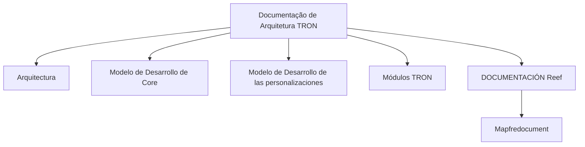

# Documentação de Arquitetura TRON — Seção de Arquitetura e Desenvolvimento

## 1. Metadados do Documento
- **Arquivo de Origem:** `Não informado`
- **Tipo de Documento:** `Arquitetura de Software`
- **Domínio / Sistema:** `TRON / Reef / Mapfre`
- **Público-Alvo:** `Arquitetos e desenvolvedores`
- **Data/Versão Identificada:** `Não identificada`

---

## 2. Resumo Executivo & Contexto de Negócio

O conteúdo apresenta a seção **ARQUITECTURA** de uma documentação associada ao sistema ou plataforma **TRON**. O objetivo declarado é disponibilizar documentação para aquisição de conhecimento sobre a arquitetura de TRON e sobre o desenvolvimento utilizando essa arquitetura.

A documentação de arquitetura é organizada em quatro tópicos explicitamente listados: **Arquitectura**, **Modelo de Desarrollo de Core**, **Modelo de Desarrollo de las personalizaciones** e **Módulos TRON**. Esses tópicos indicam que o repositório documental cobre tanto a arquitetura base quanto os modelos de desenvolvimento do núcleo e das personalizações.

O conteúdo também evidencia integração contextual com a área de documentação **Reef**, incluindo referências a **DOCUMENTACIÓN Reef** e **Mapfredocument**. A navegação disponível menciona categorias corporativas como Soluções, Arquiteturas, APIs, Componentes, Cloud, Documentação, Zeus, Reef e Ajuda.

A página está marcada com ciclo de vida **Approved Source** e indica o proprietário `user:agonzalez_mapfre.com`. Não há detalhes técnicos adicionais sobre componentes internos, contratos, protocolos, APIs, tecnologias, ambientes, versões ou regras de implementação de TRON.

---

## 3. Arquitetura, Componentes & Tecnologias Envolvidas

Os elementos identificados no conteúdo são:

| Componente / Elemento | Papel identificado no documento |
| :--- | :--- |
| TRON | Sistema ou domínio cuja arquitetura e desenvolvimento são documentados. |
| Arquitectura | Tópico documental sobre a arquitetura de TRON. |
| Modelo de Desarrollo de Core | Tópico documental referente ao desenvolvimento do núcleo. |
| Modelo de Desarrollo de las personalizaciones | Tópico documental referente ao desenvolvimento de personalizações. |
| Módulos TRON | Tópico documental referente aos módulos de TRON. |
| Reef | Área ou contexto de documentação citado como `DOCUMENTACIÓN Reef`. |
| Mapfredocument | Referência documental exibida na página. |
| Zeus | Categoria disponível na navegação do portal. |
| APIs | Categoria disponível na navegação do portal. |
| Cloud | Categoria disponível na navegação do portal. |



**Nota de Análise:** o conteúdo não descreve integrações técnicas, comunicação entre módulos, fluxos de dados, endpoints, tecnologias de implementação ou dependências entre os módulos TRON.

---

## 4. Regras de Negócio, Especificações Funcionais & Processos

O documento não apresenta regras de negócio, fórmulas de cálculo, validações funcionais, critérios de elegibilidade, fluxos operacionais ou contratos técnicos detalhados.

O processo documental explicitamente apresentado é:

1. Acessar a seção **ARQUITECTURA**.
2. Consultar a documentação para obter conhecimento sobre a arquitetura de TRON e sobre o desenvolvimento com TRON.
3. Navegar pelos tópicos disponíveis:
   - Arquitectura;
   - Modelo de Desarrollo de Core;
   - Modelo de Desarrollo de las personalizaciones;
   - Módulos TRON.

**Nota de Análise:** não há detalhamento adicional sobre o conteúdo, a sequência de execução ou as responsabilidades técnicas de cada tópico listado.

---

## 5. Tabelas de Parâmetros, Ambientes e Estruturas de Dados

| Item / Parâmetro | Descrição / Função | Tipo / Valores / Formato | Ambiente / Observações |
| :--- | :--- | :--- | :--- |
| Seção | Área documental apresentada | `ARQUITECTURA` | Página 1 de 1 |
| Sistema / domínio | Objeto principal da documentação arquitetural | `TRON` | Sem versão identificada |
| Tópico documental | Documentação sobre a arquitetura de TRON | `Arquitectura` | Sem detalhamento técnico na extração |
| Tópico documental | Modelo de desenvolvimento do núcleo | `Modelo de Desarrollo de Core` | Sem detalhamento técnico na extração |
| Tópico documental | Modelo de desenvolvimento de personalizações | `Modelo de Desarrollo de las personalizaciones` | Sem detalhamento técnico na extração |
| Tópico documental | Documentação de módulos | `Módulos TRON` | Sem lista de módulos na extração |
| Área documental | Referência à documentação Reef | `DOCUMENTACIÓN Reef` | Citada mais de uma vez |
| Referência documental | Nome exibido no conteúdo | `Mapfredocument` | Sem explicação adicional |
| Proprietário | Responsável identificado pela página | `user:agonzalez_mapfre.com` | Campo `Owner` |
| Ciclo de vida | Estado da fonte documental | `Approved Source` | Campo `Lifecycle` |
| Idioma de navegação | Idioma exibido | `ES` | Interface em espanhol |
| Navegação | Categorias do portal | `Buscar`, `Inicio`, `Soluciones`, `Arquitecturas`, `APIs`, `Componentes`, `Cloud`, `Documentación`, `Zeus`, `Reef`, `Ayuda` | Não representam necessariamente componentes de TRON |

---

## 6. Bateria de Perguntas & Respostas para RAG (FAQ Sintético)

### P1: Qual é o objetivo da seção ARQUITECTURA da documentação TRON?
**R:** A seção ARQUITECTURA disponibiliza documentação para adquirir conhecimento sobre a arquitetura de TRON e sobre como desenvolver utilizando essa arquitetura.

### P2: Quais tópicos são listados na documentação de arquitetura TRON?
**R:** Os tópicos listados são: Arquitectura, Modelo de Desarrollo de Core, Modelo de Desarrollo de las personalizaciones e Módulos TRON.

### P3: O documento detalha quais módulos fazem parte de TRON?
**R:** Não. O documento lista o tópico `Módulos TRON`, mas não informa os nomes, as responsabilidades ou as dependências dos módulos.

### P4: O que o documento informa sobre o modelo de desenvolvimento Core?
**R:** O documento apenas lista `Modelo de Desarrollo de Core` como um dos tópicos disponíveis. Não apresenta práticas, linguagens, fluxos de entrega, padrões ou regras do modelo.

### P5: O documento explica como desenvolver personalizações para TRON?
**R:** Não em detalhe. O conteúdo somente referencia o tópico `Modelo de Desarrollo de las personalizaciones`, sem explicar o processo, as restrições ou os mecanismos técnicos de personalização.

### P6: Qual é o proprietário identificado para a documentação?
**R:** O proprietário identificado no campo `Owner` é `user:agonzalez_mapfre.com`.

### P7: Qual é o ciclo de vida indicado para a fonte documental?
**R:** O campo `Lifecycle` apresenta o valor `Approved Source`, indicando que a fonte está marcada com esse estado no portal.

### P8: Qual é a relação explicitamente apresentada entre TRON e Reef?
**R:** O documento apresenta referências a `DOCUMENTACIÓN Reef` e `Mapfredocument` no mesmo contexto da documentação TRON. Contudo, não especifica uma integração técnica, relação de dependência ou fluxo entre TRON e Reef.

### P9: Há URLs, servidores, portas ou ambientes técnicos documentados?
**R:** Não. A extração não contém URLs, endereços de servidores, portas, ambientes, credenciais ou parâmetros de infraestrutura.

### P10: O documento descreve APIs ou contratos de integração de TRON?
**R:** Não. A navegação do portal menciona a categoria `APIs`, mas não há qualquer endpoint, método HTTP, payload, contrato ou integração de TRON detalhado no conteúdo.

---

## 7. Glossário de Termos, Siglas & Conceitos-Chave

- **TRON:** Sistema ou domínio mencionado como objeto da documentação de arquitetura e desenvolvimento. O significado da sigla não é informado.
- **Core:** Termo presente em `Modelo de Desarrollo de Core`; o documento não define seu significado técnico específico.
- **Reef:** Área ou contexto documental referido como `DOCUMENTACIÓN Reef`; o documento não explica sua função.
- **Mapfredocument:** Referência documental exibida no conteúdo, sem definição adicional.
- **Owner:** Campo que identifica o proprietário da documentação.
- **Lifecycle:** Campo que identifica o estado do ciclo de vida da fonte documental.
- **Approved Source:** Valor exibido no campo `Lifecycle`.
- **APIs:** Categoria de navegação do portal; não há APIs específicas documentadas na extração.
- **Zeus:** Categoria de navegação do portal; não há definição adicional no conteúdo.

---

## 8. Notas Críticas, Riscos & Limitações

- O conteúdo possui somente uma página e apresenta predominantemente títulos de navegação e tópicos documentais.
- Não há descrição técnica da arquitetura de TRON, seus componentes, tecnologias, interfaces, integrações ou topologia.
- Não há especificação do modelo de desenvolvimento Core nem do modelo de desenvolvimento de personalizações.
- Não há relação de módulos TRON, contratos de APIs, exemplos de implementação, procedimentos operacionais ou critérios de validação.
- As referências a Reef, Mapfredocument e Zeus não possuem detalhamento que permita inferir responsabilidades ou dependências.
- A condição `Approved Source` é exibida, mas o documento não define os critérios de aprovação ou governança associados a esse estado.

---

## 9. Conteúdo Bruto Estruturado (Referência Fiel)

```text
--- [PÁGINA 1 DE 1] ---

[
]
ARQUITECTURA
En este apartado se encuentra la documentación que permite adquirir conocimientos sobre la arquitectura de TRON y como desarrollar con
ella. Cuenta con los siguientes apartados:
Arquitectura
Modelo de Desarrollo de Core
Modelo de Desarrollo de las personalizaciones
Módulos TRON
Documentation / DOCUMENTACIÓN Reef
DOCUMENTACIÓN Reef
Mapfredocument
DOCUMENTACIÓN Reef
Owner
user:agonzalez_mapfre.com
Lifecycle
Approved Source
 / 
 VL
Buscar Inicio Soluciones Arquitecturas APIs Componentes Cloud Documentación Zeus Reef Ayuda
ES
```
