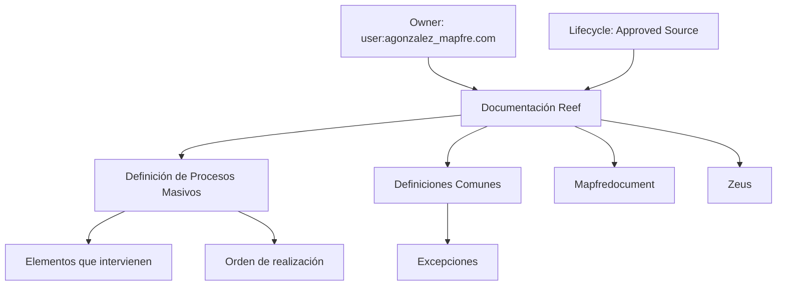

# Definição de Processos Massivos — Documentação Reef

## 1. Metadados do Documento
- **Arquivo de Origem:** Não identificado no conteúdo fornecido
- **Tipo de Documento:** Procedimento
- **Domínio / Sistema:** Reef; referências a Mapfre e Zeus
- **Público-Alvo:** Não identificado no conteúdo fornecido
- **Data/Versão Identificada:** Não identificada

---

## 2. Resumo Executivo & Contexto de Negócio

O conteúdo apresenta o tópico **“Definición de Procesos Masivos”**, associado à documentação do sistema ou domínio **Reef**. A definição central indica que existem elementos que intervêm na definição dos processos massivos e na ordem em que esses processos devem ser executados.

O material também referencia **definições comuns**, **exceções** e a área de **Documentación Reef**. A presença desses itens sugere uma estrutura documental para consulta de conceitos, tratamento de situações excepcionais e governança do conteúdo relacionado ao Reef.

Há referências textuais a **Mapfredocument**, ao proprietário identificado como `user:agonzalez_mapfre.com`, ao ciclo de vida **Approved Source** e à marcação **VL**. O documento não detalha o significado operacional desses identificadores nem descreve funcionalidades, APIs, contratos ou regras de execução dos processos massivos.

**Nota de Análise:** O conteúdo fornecido é extremamente resumido e não apresenta etapas, parâmetros, componentes técnicos, regras de negócio detalhadas ou fluxos executáveis para os processos massivos.

---

## 3. Arquitetura, Componentes & Tecnologias Envolvidas

Os elementos explicitamente citados são:

- **Reef:** domínio ou sistema associado à documentação.
- **Mapfredocument:** referência textual presente no conteúdo.
- **Zeus:** item disponível na navegação documental.
- **Documentación Reef / DOCUMENTACIÓN Reef:** área ou categoria documental.
- **Owner:** metadado de proprietário.
- **Lifecycle:** metadado de ciclo de vida.
- **Approved Source:** valor associado ao ciclo de vida.
- **VL:** marcador textual associado ao conteúdo.
- **Excepciones:** tópico relacionado às definições comuns.
- **Procesos Masivos:** tema principal do documento.



**Nota de Análise:** O documento não descreve arquitetura de software, integrações, microsserviços, protocolos, tecnologias de implementação, URLs de ambiente ou fluxos de dados.

---

## 4. Regras de Negócio, Especificações Funcionais & Processos

### Definição de processos massivos
- Processos massivos possuem **elementos que intervêm em sua definição**.
- Processos massivos possuem uma **ordem na qual devem ser realizados**.
- O conteúdo não identifica quais são esses elementos.
- O conteúdo não especifica a sequência de execução.
- O conteúdo não apresenta critérios de validação, condições de entrada, condições de saída ou tratamento detalhado de falhas.

### Definições comuns e exceções
- O documento contém as categorias **“DEFINICIONES COMUNES”** e **“Excepciones”**.
- Não há explicação adicional sobre quais definições são comuns.
- Não há descrição de cenários de exceção, responsáveis, impactos ou procedimentos de tratamento.

### Governança documental identificada
- O proprietário indicado é `user:agonzalez_mapfre.com`.
- O ciclo de vida identificado é **Approved Source**.
- O marcador **VL** aparece no conteúdo, sem definição complementar.

---

## 5. Tabelas de Parâmetros, Ambientes e Estruturas de Dados

| Item / Parâmetro | Descrição / Função | Tipo / Valores / Formato | Ambiente / Observações |
| :--- | :--- | :--- | :--- |
| Tema principal | Definição de processos massivos | Texto: `DEFINICIÓN DE PROCESOS MASIVOS` | Não há detalhamento funcional adicional |
| Elementos intervenientes | Elementos envolvidos na definição dos processos massivos | Não especificado | O documento não lista os elementos |
| Ordem de realização | Sequência em que os processos massivos devem ser realizados | Não especificado | A ordem não é apresentada |
| Definições comuns | Categoria documental | Texto: `DEFINICIONES COMUNES` | Sem conteúdo explicativo adicional |
| Exceções | Categoria ou tópico documental | Texto: `Excepciones` | Sem cenários ou tratamento descritos |
| Documentação | Área documental relacionada ao tema | `Documentation / DOCUMENTACIÓN Reef` | Referência recorrente a Reef |
| Sistema / domínio | Sistema ou domínio citado | `Reef` | Não há descrição técnica do sistema |
| Referência adicional | Nome presente no conteúdo | `Mapfredocument` | Função não identificada |
| Referência adicional | Item disponível na navegação | `Zeus` | Função não identificada |
| Owner | Proprietário indicado | `user:agonzalez_mapfre.com` | Valor literal extraído |
| Lifecycle | Estado de ciclo de vida | `Approved Source` | Associado ao rótulo `Lifecycle` |
| Marcador | Identificador textual | `VL` | Significado não identificado |
| Idioma de interface | Idioma indicado na navegação | `ES` | O conteúdo contém texto em espanhol |

---

## 6. Bateria de Perguntas & Respostas para RAG (FAQ Sintético)

### P1: Qual é o assunto principal da documentação Reef fornecida?
**R:** O assunto principal é a **definição de processos massivos** (`DEFINICIÓN DE PROCESOS MASIVOS`).

### P2: O que o documento informa sobre processos massivos?
**R:** O documento informa que existem elementos que intervêm na definição dos processos massivos e que deve existir uma ordem em que esses processos são realizados. Os elementos e a ordem específica não são detalhados.

### P3: Quais são os elementos que participam da definição dos processos massivos?
**R:** O conteúdo afirma que há elementos envolvidos na definição dos processos massivos, mas não identifica nem descreve quais são esses elementos.

### P4: Qual é a sequência de execução dos processos massivos?
**R:** O documento menciona que existe uma ordem para a realização dos processos massivos, porém não apresenta a sequência, as etapas ou os critérios de ordenação.

### P5: O documento descreve regras de exceção para processos massivos?
**R:** O conteúdo contém o tópico **“Excepciones”**, mas não descreve regras, cenários, fluxos de tratamento ou responsáveis por exceções.

### P6: Qual sistema ou domínio está associado ao documento?
**R:** O conteúdo está associado a **Reef**, citado em expressões como `Documentation / DOCUMENTACIÓN Reef` e `DOCUMENTACIÓN Reef`.

### P7: Quem é o proprietário indicado na documentação?
**R:** O proprietário indicado no conteúdo é `user:agonzalez_mapfre.com`.

### P8: Qual é o ciclo de vida identificado para o conteúdo?
**R:** O ciclo de vida exibido é **Approved Source**, associado ao rótulo `Lifecycle`.

### P9: O que significa o marcador VL no documento?
**R:** O marcador `VL` aparece no conteúdo, mas o documento não fornece definição ou contexto suficiente para determinar seu significado.

### P10: O documento apresenta APIs, métodos HTTP ou contratos JSON do Reef?
**R:** Não. O conteúdo não descreve APIs, métodos HTTP, contratos JSON, URLs, tecnologias, integrações ou detalhes de implementação técnica.

---

## 7. Glossário de Termos, Siglas & Conceitos-Chave

- **Procesos Masivos:** Tema principal do documento; são processos cuja definição possui elementos intervenientes e uma ordem de realização.
- **Reef:** Sistema ou domínio associado à documentação.
- **Documentación Reef:** Área ou conjunto de documentação relacionado ao Reef.
- **Definiciones Comunes:** Categoria textual presente no conteúdo, sem definição complementar.
- **Excepciones:** Categoria textual presente no conteúdo, sem detalhamento de regras ou tratamento.
- **Mapfredocument:** Referência textual citada; o conteúdo não define sua função.
- **Zeus:** Referência disponível na navegação; o conteúdo não define sua função.
- **Owner:** Campo de propriedade documental.
- **Lifecycle:** Campo de ciclo de vida documental.
- **Approved Source:** Valor exibido para o campo `Lifecycle`.
- **VL:** Marcador textual sem significado definido no conteúdo.

---

## 8. Notas Críticas, Riscos & Limitações

- O conteúdo não fornece a lista dos elementos que compõem a definição dos processos massivos.
- O conteúdo não apresenta a ordem de execução dos processos massivos.
- Não há fluxos operacionais detalhados, critérios de validação, entradas, saídas, responsáveis ou mecanismos de tratamento de erro.
- O tópico **Excepciones** é mencionado sem detalhamento.
- Não há informações sobre APIs, integrações, infraestrutura, ambientes, URLs, credenciais, logs ou contratos de dados.
- Os significados de **Mapfredocument**, **Zeus** e **VL** não podem ser inferidos com segurança a partir do conteúdo fornecido.
- Há um caractere de extração aparentemente corrompido em `denición`; a transcrição abaixo preserva o conteúdo bruto fornecido.

---

## 9. Conteúdo Bruto Estruturado (Referência Fiel)

```text
--- [PÁGINA 1 DE 1] ---

DEFINICIÓN DE PROCESOS MASIVOS
 Elementos que intervienen en la denición y orden en el que se debe realizar.
DEFINICIONES COMUNES
Excepciones
Documentation / DOCUMENTACIÓN Reef
DOCUMENTACIÓN Reef
Mapfredocument
DOCUMENTACIÓN Reef
Owner
user:agonzalez_mapfre.com
Lifecycle
Approved Source
 / 
 VL
Buscar Inicio Soluciones Arquitecturas APIs Componentes Cloud Documentación Zeus Reef Ayuda
ES
```
