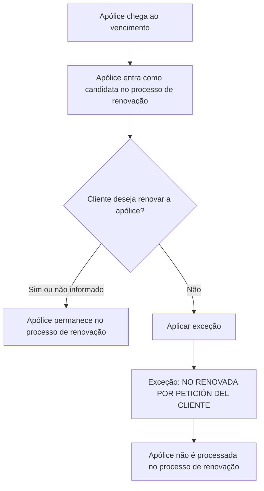

# Definição de Exceções no Processo Massivo de Renovação — Documentação Reef

## 1. Metadados do Documento
- **Arquivo de Origem:** `Não identificado no conteúdo fornecido`
- **Tipo de Documento:** `Especificação Técnica`
- **Domínio / Sistema:** `Reef / Mapfre`
- **Público-Alvo:** `Negócio, Analistas Funcionais, Desenvolvedores e Operação`
- **Data/Versão Identificada:** `Não identificada`

---

## 2. Resumo Executivo & Contexto de Negócio

O documento define o conceito de **exceções** aplicadas a elementos candidatos em processos massivos. Uma exceção determina que determinado elemento não deve continuar no processamento, mesmo que tenha sido inicialmente selecionado como candidato.

O exemplo apresentado refere-se a uma apólice próxima ao vencimento. A apólice pode ingressar no processo de renovação como candidata, mas deve ser excluída caso o cliente manifeste que não deseja renová-la.

Para evitar o processamento ou a renovação dessa apólice, o processo deve associar uma exceção ao elemento candidato. O documento exemplifica a descrição da exceção como **“NO RENOVADA POR PETICIÓN DEL CLIENTE”**.

Cada exceção deve possuir uma chave única, utilizada como identificador, e um nome ou descrição que permita reconhecer claramente a causa da exclusão.

---

## 3. Arquitetura, Componentes & Tecnologias Envolvidas

Os componentes e conceitos explicitamente citados são:

- **Reef:** contexto documental no qual a definição de exceções está registrada.
- **Mapfre:** organização ou domínio associado ao conteúdo.
- **Processo massivo:** processo que recebe elementos candidatos para processamento.
- **Processo de renovação:** exemplo de processo massivo aplicado a apólices.
- **Exceção:** regra ou registro que retira um elemento candidato do processamento.
- **Apólice:** elemento de negócio utilizado como exemplo.
- **Cliente:** origem da decisão de não renovação da apólice.



**Nota de Análise:** o documento não detalha sistemas técnicos, APIs, métodos HTTP, contratos JSON, banco de dados, jobs, filas, interfaces ou mecanismos de persistência usados para cadastrar ou aplicar exceções.

---

## 4. Regras de Negócio, Especificações Funcionais & Processos

### 4.1 Objetivo das exceções

Uma exceção deve ser utilizada para registrar as causas pelas quais um elemento candidato de um processo massivo ficará fora do processo.

Quando uma exceção é aplicada:

1. O elemento pode ter sido inicialmente selecionado como candidato.
2. O elemento é retirado do processamento do processo massivo.
3. O elemento não deve ser processado.
4. No exemplo de renovação, a apólice não deve ser renovada.

### 4.2 Regra de exclusão de candidato

| Regra | Descrição |
| :--- | :--- |
| Elegibilidade inicial | Um elemento pode entrar em um processo massivo como candidato. |
| Aplicação de exceção | Uma exceção identifica uma causa para retirar o elemento candidato do processo. |
| Efeito da exceção | O elemento excepcionalizado não será processado. |
| Exemplo de processo | Uma apólice candidata ao processo de renovação pode ser excluída. |
| Motivo exemplificado | O cliente decide não renovar a apólice. |
| Resultado operacional | A apólice não deve ser renovada. |

### 4.3 Atributos obrigatórios da exceção

Toda exceção deve conter:

1. **Chave única:** atua como identificador da exceção.
2. **Nome da exceção:** descrição que identifica a exceção.

### 4.4 Exemplo funcional documentado

| Etapa | Evento / Condição | Resultado |
| :--- | :--- | :--- |
| 1 | Uma apólice chega ao vencimento. | A apólice pode participar do contexto de renovação. |
| 2 | A apólice entra no processo de renovação como candidata. | A apólice está apta a ser processada inicialmente. |
| 3 | O cliente decide não renovar a apólice. | Deve ser aplicada uma exceção. |
| 4 | A exceção é identificada pela descrição `NO RENOVADA POR PETICIÓN DEL CLIENTE`. | A causa de exclusão é registrada. |
| 5 | A exceção é aplicada à apólice candidata. | A apólice não é processada nem renovada. |

---

## 5. Tabelas de Parâmetros, Ambientes e Estruturas de Dados

| Item / Parâmetro | Descrição / Função | Tipo / Valores / Formato | Ambiente / Observações |
| :--- | :--- | :--- | :--- |
| Exceção | Registro ou conceito utilizado para excluir um elemento candidato de um processo massivo. | Não especificado. | Aplicável a processos massivos. |
| Chave única da exceção | Identificador da exceção. | Chave única; formato não especificado. | Obrigatória para toda exceção. |
| Nome da exceção | Descrição utilizada para identificar a exceção. | Texto; formato não especificado. | Obrigatório conforme a seção de atributos. |
| Elemento candidato | Elemento inicialmente considerado para participação em um processo massivo. | Não especificado. | Pode ser retirado do processo por uma exceção. |
| Apólice | Exemplo de elemento candidato no processo de renovação. | Não especificado. | Associada ao caso de vencimento e não renovação. |
| Processo de renovação | Processo massivo usado como exemplo. | Não especificado. | A apólice excepcionalizada não é renovada. |
| `NO RENOVADA POR PETICIÓN DEL CLIENTE` | Exemplo de descrição de uma exceção. | Texto descritivo. | Aplicável quando o cliente não deseja renovar a apólice. |
| Owner | Informação exibida na página documental. | `user:agonzalez_mapfre.com` | O documento não detalha a responsabilidade associada ao campo. |
| Lifecycle | Campo exibido na página documental. | `Approved Source` | Não há explicação adicional no conteúdo. |
| Idioma exibido | Identificador de idioma da interface documental. | `ES` | O conteúdo bruto está majoritariamente em espanhol. |

---

## 6. Bateria de Perguntas & Respostas para RAG (FAQ Sintético)

### P1: Qual é o objetivo de uma exceção em um processo massivo?
**R:** Uma exceção detalha a causa pela qual um elemento candidato deve ficar fora de um processo massivo. Quando a exceção é aplicada, o elemento não será processado.

### P2: Uma exceção pode ser aplicada a um elemento que já entrou como candidato no processo?
**R:** Sim. O documento descreve que o elemento pode ingressar no processo massivo como candidato e, posteriormente, ser excepcionalizado para não continuar no processamento.

### P3: O que acontece com uma apólice candidata à renovação quando o cliente não quer renová-la?
**R:** A apólice deve receber uma exceção para que não seja processada no processo de renovação e, consequentemente, não seja renovada.

### P4: Qual é o exemplo de descrição de exceção fornecido para uma apólice não renovada?
**R:** O exemplo apresentado é `NO RENOVADA POR PETICIÓN DEL CLIENTE`.

### P5: Quais atributos toda exceção deve possuir?
**R:** Toda exceção deve possuir uma chave única, que atua como identificador, e um nome da exceção, que é a descrição usada para identificá-la.

### P6: Qual é a finalidade da chave única de uma exceção?
**R:** A chave única atua como identificador da exceção.

### P7: O documento define o formato técnico da chave única da exceção?
**R:** Não. O documento informa somente que a exceção deve possuir uma chave única como identificador, sem especificar formato, tamanho, tecnologia ou regra de geração.

### P8: O documento informa APIs ou contratos JSON para cadastrar exceções?
**R:** Não. O conteúdo não descreve métodos HTTP, endpoints, contratos JSON, integrações ou mecanismos técnicos de cadastro e aplicação das exceções.

### P9: O processo de renovação é o único processo que pode utilizar exceções?
**R:** Não é possível afirmar isso. O documento define exceções para elementos candidatos em processos massivos e usa a renovação de apólices apenas como exemplo.

### P10: Qual é a consequência operacional de aplicar uma exceção a uma apólice candidata?
**R:** A apólice deixa de ser processada no processo de renovação. No exemplo fornecido, isso impede a renovação da apólice.

### P11: O documento detalha quem pode criar, alterar ou remover exceções?
**R:** Não. Embora a página apresente o campo `Owner` com o valor `user:agonzalez_mapfre.com`, o conteúdo não descreve permissões, papéis ou procedimentos de administração de exceções.

---

## 7. Glossário de Termos, Siglas & Conceitos-Chave

- **Exceção:** registro ou condição que determina que um elemento candidato não deve ser processado em um processo massivo.
- **Elemento candidato:** elemento inicialmente incluído para avaliação ou processamento em um processo massivo.
- **Processo massivo:** processo que trata elementos candidatos em escala; o documento não fornece detalhamento técnico adicional.
- **Processo de renovação:** processo usado como exemplo para uma apólice próxima ao vencimento.
- **Apólice:** elemento de negócio apresentado no exemplo de renovação.
- **Reef:** nome exibido no contexto da documentação.
- **Mapfre:** nome exibido no contexto da documentação e no identificador de proprietário.
- **Lifecycle:** campo de ciclo de vida exibido na página documental.
- **Approved Source:** valor exibido para o campo `Lifecycle`; seu significado operacional não é explicado no documento.

---

## 8. Notas Críticas, Riscos & Limitações

- O documento não especifica como uma exceção é criada, armazenada, atualizada, removida ou associada a um elemento candidato.
- Não há definição de formato, unicidade técnica, validação ou ciclo de vida da chave única da exceção.
- Não são apresentados fluxos alternativos para situações em que a decisão de não renovação seja alterada posteriormente.
- Não há detalhamento de responsabilidades operacionais, apesar de a página indicar o campo `Owner` como `user:agonzalez_mapfre.com`.
- Não são descritos ambientes, URLs, servidores, logs, integrações, APIs, interfaces ou contratos de dados.
- **Nota de Análise:** o documento apresenta uma definição conceitual e um exemplo funcional de exclusão de apólice, mas não detalha a implementação técnica da funcionalidade de exceções.

---

## 9. Conteúdo Bruto Estruturado (Referência Fiel)

```text
--- [PÁGINA 1 DE 1] ---

DEFINICIÓN de Excepciones
Objetivo
Detallar causas por las que un elemento candidato en un proceso masivo quedaría fuera del proceso. Es decir, el elemento no será
procesado. Un ejemplo podría ser una póliza que llega a su vencimiento y NO debe renovarse. Esta póliza pasa al proceso de renovación
como candidata, pero el cliente decide no renovar la póliza. Para que la póliza no sea procesada (renovada en el ejemplo), debe
excepcionarse. En este caso, podría existir una excepción cuya descripción podría ser: "NO RENOVADA POR PETICIÓN DEL CLIENTE".
ATRIBUTOS
Excepción
Toda excepción debe contener una clave única, la cual actúa como identicador de esta.
Nombre de la excepción
Descripción que identicará la excepción. Sirva como ejemplo el visto anteriormente cuando el cliente no desea renovar su póliza.
Documentation / DOCUMENTACIÓN Reef
DOCUMENTACIÓN Reef
Mapfredocument
DOCUMENTACIÓN Reef
Owner
user:agonzalez_mapfre.com
Lifecycle
Approved Source
 / 
 VL
Buscar Inicio Soluciones Arquitecturas APIs Componentes Cloud Documentación Zeus Reef Ayuda
ES
```
