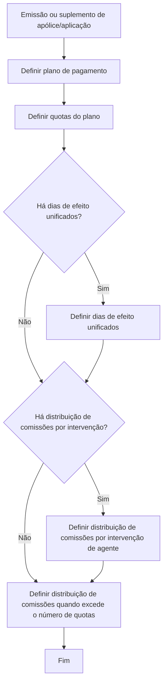
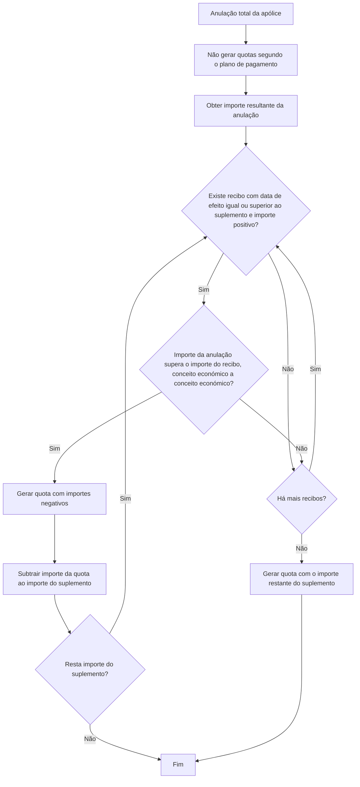

# Definição de Plano de Pagamento — Documentação Reef / Mapfre

## 1. Metadados do Documento
- **Arquivo de Origem:** Não identificado no conteúdo extraído
- **Tipo de Documento:** Especificação Técnica / Manual Funcional
- **Domínio / Sistema:** Reef / Mapfre — definição de plano de pagamento de apólices/aplicações
- **Público-Alvo:** Analistas funcionais, desenvolvedores, arquitetos e equipes de operação
- **Data/Versão Identificada:** Não identificada

---

## 2. Resumo Executivo & Contexto de Negócio

O documento define o conceito de **plano de pagamento** no contexto de uma emissão ou suplemento de uma apólice/aplicação. O objetivo é estabelecer como o valor gerado pela criação ou modificação de uma apólice/aplicação será distribuído em frações, denominadas **quotas**.

A quantidade de quotas é livre: um plano de pagamento pode conter de **1 a 99 quotas**. Portanto, a distribuição não precisa atender a uma periodicidade padrão, como mensal, trimestral ou semestral. Um exemplo citado é um plano com cinco quotas.

O plano de pagamento não se limita a repartir proporcionalmente os importes calculados na apólice. Cada quota pode ter importes e comissões não proporcionais ao período entre efeito e vencimento. O processo também pode calcular conceitos próprios durante a distribuição, como recargos por fracionamento e os respetivos impostos.

Em caso de anulação total da apólice, o documento define um fluxo específico: não são geradas quotas conforme o plano de pagamento. O importe a devolver é utilizado para cancelar recibos já gerados com importe positivo, respeitando a validação de que cada conceito económico do recibo candidato deve suportar o valor restante da anulação.

---

## 3. Arquitetura, Componentes & Tecnologias Envolvidas

O conteúdo não descreve infraestrutura, APIs, tecnologias, ambientes, servidores, bases de dados ou microsserviços. Os componentes funcionais identificados são:

- **Plano de pagamento:** mecanismo de distribuição do importe gerado por emissão ou suplemento.
- **Quota:** cada fração que compõe um plano de pagamento.
- **Apólice/aplicação:** entidade cuja criação, modificação ou anulação gera importes tratados pelo plano.
- **Suplemento:** referência usada no fluxo de anulação para determinar o importe remanescente.
- **Recibo:** documento/registro já gerado na apólice, potencialmente cancelado durante uma anulação total.
- **Conceito económico:** componente económico que deve ser validado individualmente no recibo candidato ao cancelamento.
- **Agente principal, organizador ou outra figura:** intervenientes para os quais pode existir distribuição diferenciada de comissões.



### Fluxo de anulação total



> **Nota de Análise:** O documento apresenta fluxos funcionais, mas não detalha contratos HTTP, modelos de dados, persistência, APIs, tecnologias de implementação ou responsabilidades entre sistemas.

---

## 4. Regras de Negócio, Especificações Funcionais & Processos

### Conceito de plano de pagamento

Um plano de pagamento é a forma pela qual o importe gerado pela criação ou modificação de uma apólice/aplicação é distribuído em frações. Cada fração recebe o nome de **quota**.

### Número de quotas

- A quantidade de quotas é livre.
- Um plano de pagamento pode ter entre **1 e 99 quotas**.
- Um plano de pagamento não precisa obedecer a uma distribuição padrão, como semestral ou trimestral.
- O documento cita explicitamente a possibilidade de um plano de pagamento com **5 quotas**.

### Importes, prémios, impostos e recargos

- O importe e/ou a comissão de uma quota não precisam ser proporcionais ao efeito/vencimento.
- Um plano de pagamento pode calcular importes próprios durante a distribuição.
- Os exemplos de conceitos próprios citados são:
  - Recargos por fracionamento.
  - Impostos associados aos recargos, quando necessário.
- Um plano de pagamento não é apenas a distribuição dos importes calculados na apólice.
- A primeira quota é sempre calculada por diferença, para assegurar a correta distribuição dos importes entre as quotas.

A regra de cálculo apresentada é:

```text
quota_1 := importe_total - SUMA(quota_2..quota_n)
```

### Anulação total da apólice

Em uma anulação total:

1. Não são geradas quotas conforme o plano de pagamento.
2. O objetivo é aplicar o importe a devolver resultante da anulação total contra recibos já gerados na apólice.
3. Somente recibos com importe positivo são candidatos a cancelamento.
4. A pesquisa deve considerar recibos com data de efeito igual ou superior ao suplemento, iniciando pelo vencimento.
5. Para cancelar um recibo com o importe da anulação total, todos os conceitos económicos do recibo candidato devem superar o importe remanescente da anulação total.
6. Quando a validação é atendida, é gerada uma quota com importes negativos.
7. O importe da quota gerada é subtraído do importe do suplemento.
8. O processo continua enquanto existir importe remanescente do suplemento e houver recibos a avaliar.
9. Caso não haja mais recibos, é gerada uma quota com o importe restante do suplemento.

### Comissões

- A comissão não precisa ser proporcional ao efeito/vencimento da quota.
- Uma quota pode não possuir comissão.
- As intervenções de agentes não precisam possuir a mesma proporção de comissão.
- O agente principal pode ter uma distribuição de comissões distinta da distribuição definida para o organizador ou outra figura.

### Processo de definição de um plano de pagamento

A definição de um plano de pagamento é composta pelos seguintes passos. O documento afirma que nem todos são obrigatórios:

1. Definir plano de pagamento.
2. Definir quotas do plano de pagamento.
3. Definir dias de efeito unificados, quando existirem.
4. Definir distribuição de comissões por intervenção de agente, quando existir.
5. Definir distribuição de comissões quando excede o número de quotas.

---

## 5. Tabelas de Parâmetros, Ambientes e Estruturas de Dados

| Item / Parâmetro | Descrição / Função | Tipo / Valores / Formato | Ambiente / Observações |
| :--- | :--- | :--- | :--- |
| Plano de pagamento | Distribui em frações o importe gerado por criação ou modificação de apólice/aplicação. | Plano funcional de distribuição. | Não é detalhada implementação técnica. |
| Quota | Fração individual de um plano de pagamento. | De 1 a 99 quotas por plano. | Cada quota pode ter importe e comissão próprios. |
| `quota_1` | Primeira quota do plano. | `importe_total - SUMA(quota_2..quota_n)` | É sempre calculada por diferença. |
| `importe_total` | Importe total a distribuir pelo plano. | Valor económico. | Fórmula apresentada no documento. |
| `quota_2..quota_n` | Quotas posteriores à primeira quota. | Conjunto de valores económicos. | A soma dessas quotas é usada para calcular `quota_1`. |
| Importe da quota | Valor atribuído a uma quota. | Valor económico. | Não precisa ser proporcional ao efeito/vencimento. |
| Comissão da quota | Comissão atribuída a uma quota. | Valor económico; pode não existir. | Não precisa ser proporcional ao efeito/vencimento. |
| Recargo por fracionamento | Conceito próprio que pode ser calculado pelo plano. | Valor económico. | Pode ser acompanhado de impostos quando necessário. |
| Impostos | Impostos associados a conceitos calculados no plano. | Valor económico. | Citados no contexto de recargos por fracionamento. |
| Anulação total | Processo de devolução/cancelamento relacionado a uma apólice. | Evento funcional. | Não gera quotas segundo o plano de pagamento. |
| Recibo candidato | Recibo previamente gerado que pode ser cancelado. | Recibo com importe positivo. | Deve possuir data de efeito igual ou superior ao suplemento. |
| Conceito económico | Componente económico de um recibo. | Valor económico por conceito. | Deve superar o importe remanescente da anulação para permitir o cancelamento. |
| Importe do suplemento | Importe usado no fluxo de anulação. | Valor económico. | É reduzido pelo importe de cada quota negativa gerada. |
| Dias de efeito unificados | Configuração opcional do plano de pagamento. | Regra/configuração funcional. | Só é definida se houver dias de efeito unificados. |
| Distribuição de comissões por intervenção | Configuração opcional de comissão por agente/interveniente. | Regra/configuração funcional. | Pode diferenciar agente principal, organizador e outras figuras. |
| Distribuição quando excede quotas | Etapa de definição prevista pelo processo. | Regra/configuração funcional. | O documento não detalha os critérios de distribuição. |

> **Nota de Análise:** O conteúdo não fornece URLs, ambientes, nomes de servidores, rotas de logs, formatos JSON, estruturas de banco de dados ou tipos de dados técnicos.

---

## 6. Bateria de Perguntas & Respostas para RAG (FAQ Sintético)

### P1: O que é um plano de pagamento no contexto Reef/Mapfre?
**R:** Um plano de pagamento é a forma de distribuir em frações o importe gerado pela criação ou modificação de uma apólice/aplicação. Cada fração do plano de pagamento é denominada quota.

### P2: Quantas quotas um plano de pagamento pode ter?
**R:** Um plano de pagamento pode ter de 1 a 99 quotas. A quantidade é livre e não precisa seguir uma periodicidade padrão, como distribuição trimestral ou semestral.

### P3: A distribuição dos importes das quotas precisa ser proporcional ao efeito e vencimento?
**R:** Não. O importe e/ou a comissão de cada quota não precisam ser proporcionais ao período entre efeito e vencimento. O plano de pagamento pode definir uma distribuição diferente daquela que seria obtida por proporcionalidade temporal.

### P4: Como é calculada a primeira quota de um plano de pagamento?
**R:** A primeira quota é sempre calculada por diferença: `quota_1 := importe_total - SUMA(quota_2..quota_n)`. Essa regra assegura que os importes sejam corretamente distribuídos entre as quotas, mesmo diante de problemas na definição do plano.

### P5: Um plano de pagamento pode gerar valores que não existiam originalmente na apólice?
**R:** Sim. O documento afirma que o plano de pagamento não é somente uma distribuição dos importes calculados na apólice. Durante a distribuição, podem ser calculados conceitos próprios, como recargos por fracionamento e, quando necessário, os respetivos impostos.

### P6: O que acontece com as quotas em uma anulação total de apólice?
**R:** Em uma anulação total não são geradas quotas de acordo com o plano de pagamento. O importe a devolver da anulação é usado para cancelar recibos já gerados na apólice que possuam importe positivo.

### P7: Quais recibos podem ser usados para cancelar o importe de uma anulação total?
**R:** O fluxo procura recibos com data de efeito igual ou superior ao suplemento e com importe positivo, começando pelo vencimento. Além disso, cada conceito económico do recibo candidato deve superar o importe restante da anulação total para que o cancelamento seja possível.

### P8: O que ocorre quando um recibo é elegível para cancelamento durante uma anulação total?
**R:** Quando o importe da anulação supera o importe do recibo conceito económico a conceito económico, o processo gera uma quota com importes negativos e subtrai o importe dessa quota do importe do suplemento. O fluxo continua enquanto ainda houver importe do suplemento.

### P9: As quotas precisam obrigatoriamente ter comissão?
**R:** Não. O documento afirma que uma quota pode não dispor de comissão. Quando existe, a comissão também não é obrigada a ser proporcional ao efeito/vencimento da quota.

### P10: A comissão do agente principal deve ter a mesma proporção da comissão do organizador?
**R:** Não. Nem todas as intervenções de agente precisam ter a mesma proporção de comissão. O agente principal pode ter uma distribuição de comissões diferente da definida para o organizador ou outra figura.

### P11: Quais são os passos para definir um plano de pagamento?
**R:** O processo contém cinco etapas: definir o plano de pagamento; definir as quotas; definir dias de efeito unificados, se existirem; definir distribuição de comissões por intervenção de agente, se existir; e definir distribuição de comissões quando excede o número de quotas. O documento informa que nem todas as etapas são obrigatórias.

### P12: O documento detalha como implementar tecnicamente o plano de pagamento?
**R:** Não. O conteúdo define regras funcionais e fluxos de negócio, mas não especifica APIs, métodos HTTP, contratos JSON, persistência, tecnologias, serviços, ambientes ou modelos de dados.

---

## 7. Glossário de Termos, Siglas & Conceitos-Chave

- **Plano de pagamento:** Mecanismo que distribui em quotas o importe gerado por criação ou modificação de uma apólice/aplicação.
- **Quota:** Fração individual de um plano de pagamento.
- **Apólice/aplicação:** Entidade de negócio cuja criação, modificação ou anulação gera importes.
- **Suplemento:** Referência utilizada no fluxo de anulação para identificação de recibos e gestão do importe remanescente.
- **Recibo:** Registro/documento já gerado na apólice, com potencial de cancelamento em uma anulação total.
- **Importe:** Valor económico tratado no plano de pagamento, quotas, recibos e suplemento.
- **Conceito económico:** Componente económico individual de um recibo, avaliado no fluxo de anulação.
- **Recargo por fracionamento:** Conceito económico próprio que pode ser calculado durante a distribuição do plano de pagamento.
- **Dias de efeito unificados:** Configuração opcional prevista na definição do plano de pagamento.
- **Intervenção de agente:** Participação de um agente, organizador ou outra figura para a qual pode ser configurada distribuição de comissões.
- **Reef:** Nome presente na documentação e navegação corporativa; o conteúdo fornecido não expande a sigla ou descreve tecnicamente o sistema.
- **Mapfre:** Organização/domínio citado na documentação; o conteúdo fornecido não apresenta definição adicional.

---

## 8. Notas Críticas, Riscos & Limitações

- O documento não identifica arquivo de origem, data, versão, autor técnico, sistema de origem detalhado ou histórico de alterações.
- O texto não detalha a ordem completa de seleção de recibos além da indicação “comenzando por el vencimiento”.
- O critério “todos os conceitos económicos do recibo candidato devem superar o importe restante” é apresentado sem exemplos numéricos completos.
- A etapa “definir distribuição de comissões quando excede o número de quotas” é citada, mas não possui regras, fórmulas ou condições detalhadas.
- Não há especificação de APIs, contratos de integração, estruturas de dados, formatos de mensagens, persistência, tratamento de erros ou observabilidade.
- Não são apresentados ambientes, URLs, servidores, rotas de log, credenciais, versões de tecnologia ou responsabilidades de equipes.
- O texto extraído contém caracteres corrompidos em palavras como “definición”, “modificación”, “unificados” e “figura”; esta estrutura preserva o sentido aparente sem inferir conteúdo ausente.

---

## 9. Conteúdo Bruto Estruturado (Referência Fiel)

```text
--- [PÁGINA 1 DE 2] ---

DEFINICIÓN de plan de pago
Objetivo
Realizar una denición completa de como distribuir el importe generado por una emisión o suplemento.
¿En que consiste?
Un plan de pago es la forma en la que se distribuye en fracciones el importe generado por la creación o modicación de una
póliza/aplicación. A cada fracción se la denomina cuota.
Características generales
Número de cuotas
Es libre. un plan de pago puede tener 1 o 99 cuotas. Es decir, no tiene porque atender al criterio de una distribución estándar como puede
ser semestral, trimestral, etc. Un plan de pago puede ser de 5 cuotas
Importes (primas, impuestos, recargos...)
No es obligatorio que el importe y/o comisión de la cuota sea proporcional al efecto/vencimiento.
Los planes de pago pueden calcular importes como por ejemplo recargos por fraccionamiento, junto con sus impuestos si fuera
necesario. Es decir, un plan de pago no es la distribución de los importes calculados en la póliza, un plan de pago puede disponer de
conceptos propios hallados en el momento de la distribución del mismo
Siempre, la primera cuota se halla por diferencia. Esto asegura que el plan de pago distribuya correctamente los importes en las cuotas si
hubiera algún problema en la denición. Es decir:
En caso de anulación total de la póliza, no se generan cuotas según el plan de pago. En este caso, el objetivo es con el importe a devolver
resultante de la anulación total de la póliza, se toman recibos ya generados en la póliza y que tengan importe positivo para cancelarlos
con el importe de la anulación total. Hay que tener en cuenta que para poder cancelar un recibo con el importe de la anulación total,
todos los conceptos económicos del recibo candidato a cancelar, deben superar el importe que queda de la anulación total.
Los pasos que se siguen son los siguientes:
Ejemplo:
1
cuota_1 := importe_total - SUMA(cuota_2..cuota_n)
Documentation / DOCUMENTACIÓN Reef
DOCUMENTACIÓN Reef
Mapfredocument
DOCUMENTACIÓN Reef
Owner
user:agonzalez_mapfre.com
Lifecycle
Approved Source
 /
VL
Buscar Inicio Soluciones Arquitecturas APIs Componentes Cloud Documentación Zeus Reef Ayuda
ES

--- [PÁGINA 2 DE 2] ---

SI
NO
SI
NO
SI
NO
SI
NO
¿EXISTE un recibo
con fecha de
efecto igual
o superior
al suplemento
con importe
positivo
comenzando por
el vencimiento?
¿El importe de
la anulación
supera al
importe del
recibo
(concepto económico
a concepto económico)?
GENERAR cuota
con los
importes en
negativo
RESTAR el
importe de
la cuota
al importe
del suplemento
¿Queda importe
del suplemento?
¿Hay más
recibos?
GENERAR cuota
con el
importe que
resta del
suplemento
FIN
Comisiones
No es obligatorio que sea proporcional al efecto/vencimiento de la cuota. Incluso es posible que una cuota no disponga de comisión
No todas las intervenciones de agente están obligadas a disponer de la misma proporción. Es decir, el agente principal puede disponer
de una distribución de sus comisiones y el organizador (u otra gura), puede disponer de otra distribución distinta
Proceso a seguir
La denición de un plan de pago se realiza completando los pasos mostrados a continuación aunque todos no son obligatorios.
SI
NO
SI
NO
DEFINIR
plan pago
(1)
DEFINIR
cuotas del
plan pago
(2)
¿Hay días
de efecto
unificados? DEFINIR
días de efecto
unificados
(3)
¿Hay distribución
de comisiones
por intervención?
DEFINIR
distribución de
comisiones por
intervención de
agente
(4)
DEFINIR
distribución de
comisiones cuando
excede el número
de cuotas
(5)
FIN
1. DEFINIR plan pago
2. DEFINIR cuotas del plan de pago
3. DEFINIR días de efecto unicados
4. DEFINIR distribución de comisiones por intervención de agente
5. DEFINIR distribución de comisiones cuando excede el número de cuotas
Checking links...
Ejemplo:
```
