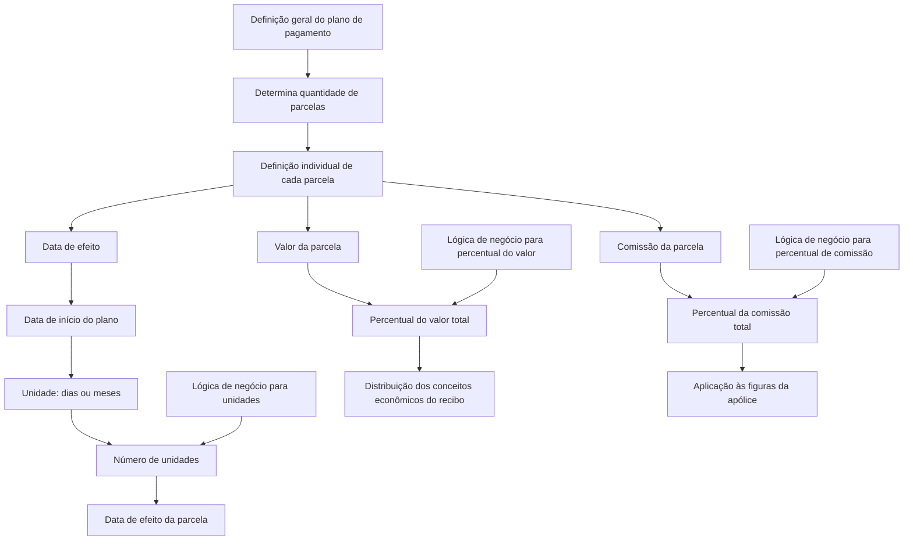

# Definição de Planos de Pagamento por Parcelas no Reef.core

## 1. Metadados do Documento
- **Arquivo de Origem:** Não identificado no texto extraído
- **Tipo de Documento:** Especificação Técnica
- **Domínio / Sistema:** Reef / Reef.core / Mapfre
- **Público-Alvo:** Desenvolvedores, Arquitetos, Analistas Funcionais e Operação
- **Data/Versão Identificada:** Não identificada

---

## 2. Resumo Executivo & Contexto de Negócio

O documento define o comportamento individual das parcelas que compõem um plano de pagamento no Reef.core. A definição geral do plano de pagamento, realizada em uma etapa anterior não incluída na extração, determina características globais, incluindo a quantidade de parcelas a serem geradas. A especificação analisada concentra-se na configuração específica de cada parcela.

Cada parcela é definida por propriedades que determinam: a data de efeito, o valor da parcela e a comissão associada. A data de efeito é calculada a partir da data de início definida na configuração geral do plano de pagamento, usando unidades em dias ou meses e um número de unidades positivo, zero ou negativo.

A distribuição do valor total e da comissão total ocorre por percentuais atribuídos às parcelas. Para garantir a correção da distribuição, o sistema calcula uma parcela por diferença quando a soma dos percentuais configurados não atingir 100. Para valores de recibo, conceitos econômicos que não fracionam são refletidos apenas na primeira parcela.

O documento também prevê regras de negócio para calcular dinamicamente o número de unidades, o percentual do valor e o percentual de comissão quando esses valores não são constantes ou dependem de circunstâncias não definidas no Reef.core. A extração menciona exemplos, porém não contém seus conteúdos estruturados.

---

## 3. Arquitetura, Componentes & Tecnologias Envolvidas

| Componente / Conceito | Papel identificado |
| :--- | :--- |
| Reef | Sistema/documentação em que a definição de plano de pagamento está registrada. |
| Reef.core | Componente citado como não responsável por definir determinadas circunstâncias usadas em lógicas de negócio dinâmicas. |
| Plano de pagamento | Definição global que determina, entre outras características, a quantidade de parcelas. |
| Parcela / quota | Unidade individual do plano de pagamento, configurada com data de efeito, valor e comissão. |
| Lógica de negócio | Mecanismo que devolve valores dinâmicos para número de unidades, percentual de valor ou percentual de comissão. |
| Apólice | Entidade cujo vencimento pode ser usado como data de início na geração de parcelas. |
| Recibo | Contexto dos conceitos econômicos aos quais pode ser aplicada a distribuição por percentual. |
| Figuras da apólice | Entidades existentes na apólice às quais o percentual de comissão é aplicado. |



---

## 4. Regras de Negócio, Especificações Funcionais & Processos

### 4.1 Definição individual das parcelas

A etapa documentada define cada parcela individualmente após a definição geral do plano de pagamento. As propriedades da parcela são agrupadas em:

1. Propriedades que determinam a data de efeito da parcela.
2. Propriedades que determinam o valor da parcela.
3. Propriedades que determinam a comissão da parcela.

### 4.2 Data de efeito da parcela

A data de efeito da parcela é calculada a partir da data de início declarada na definição geral do plano de pagamento.

- A unidade para geração pode ser **dias** ou **meses**.
- Quando a unidade é **dias**, são adicionados dias à data de início.
- Quando a unidade é **meses**, são adicionados meses à data de início.
- O número de unidades é aplicado sempre sobre a data de início, e não sobre a data de efeito de outra parcela.
- Duas parcelas com o mesmo tipo de unidade e o mesmo número de unidades terão a mesma data de efeito.
- O número de unidades pode ser zero. Nesse caso, a data de efeito da parcela é a própria data de início.
- O número de unidades pode ser negativo.
- Valores negativos são particularmente relevantes quando a geração das parcelas ocorre no sentido de vencimento para efeito: se a data de início for o vencimento da apólice, unidades não negativas poderiam fazer a data de efeito ultrapassar o vencimento da apólice.
- Unidades de dias e meses podem ser combinadas em uma mesma definição de plano de pagamento.
- O texto informa que o comportamento difere conforme a unidade escolhida, mas a extração não preserva os detalhamentos ou exemplos dessa diferença.

### 4.3 Lógica de negócio para número de unidades

A propriedade **Nome da lógica de negócio que determina o número de unidades** referencia uma lógica de negócio cujo objetivo é retornar o número de unidades a aplicar na parcela definida.

Essa lógica é usada quando o número de unidades não é constante e varia em função de circunstâncias que não estão definidas no Reef.core.

### 4.4 Valor da parcela

A propriedade **Porcentagem do valor total na parcela** determina qual percentual do valor calculado no processo de cálculo será aplicado à parcela definida.

Regras associadas:

1. A soma dos percentuais de todas as parcelas do plano de pagamento deve totalizar 100.
2. O sistema calcula uma parcela por diferença como mecanismo de segurança.
3. Mesmo que a configuração não some 100, a distribuição garante que o resultado seja correto.
4. O percentual afeta todos os conceitos econômicos de recibo definidos.
5. Conceitos econômicos que **não fracionam** são refletidos apenas na primeira parcela.

### 4.5 Lógica de negócio para percentual do valor

A propriedade **Nome da lógica de negócio que determina a porcentagem do valor** referencia uma lógica de negócio que devolve o percentual de valor aplicável à parcela.

Essa lógica é usada quando o percentual não é constante e varia conforme circunstâncias não definidas no Reef.core.

### 4.6 Comissão da parcela

A propriedade **Porcentagem da comissão total na parcela** determina qual percentual do valor total de comissão calculado será aplicado à parcela definida.

Regras associadas:

1. A primeira parcela é calculada por diferença, de modo equivalente ao mecanismo utilizado para o percentual do valor.
2. O cálculo por diferença evita problemas na distribuição das comissões quando houver problemas na definição dos percentuais.
3. O percentual de comissão é aplicado a todas as figuras existentes na apólice.

### 4.7 Lógica de negócio para percentual de comissão

A propriedade **Nome da lógica de negócio que determina a porcentagem de comissões** referencia uma lógica de negócio que devolve o percentual de comissão aplicável à parcela.

Essa lógica é utilizada quando o percentual de comissão não é constante e varia segundo circunstâncias não definidas no Reef.core.

---

## 5. Tabelas de Parâmetros, Ambientes e Estruturas de Dados

| Item / Parâmetro | Descrição / Função | Tipo / Valores / Formato | Ambiente / Observações |
| :--- | :--- | :--- | :--- |
| Número da parcela | Determina qual parcela está sendo definida. | Número da parcela | O documento não especifica formato, intervalo ou unicidade. |
| Unidades para geração de parcela | Determina a unidade usada para criar a data de efeito da parcela. | Dias ou meses | Aplicada sobre a data de início do plano de pagamento. |
| Número de unidades | Determina a quantidade de dias ou meses adicionada à data de início. | Número positivo, zero ou negativo | Mesmo tipo e número de unidades produzem a mesma data de efeito para parcelas distintas. |
| Data de início | Data-base declarada na definição geral do plano de pagamento. | Data | Pode corresponder ao vencimento da apólice no fluxo de geração de vencimento para efeito. |
| Data de efeito | Data resultante para a parcela. | Data | Calculada a partir da data de início e das unidades configuradas. |
| Nome da lógica de negócio que determina o número de unidades | Identifica lógica que devolve dinamicamente o número de unidades. | Nome de lógica de negócio | Usada quando o número de unidades varia por circunstâncias não definidas no Reef.core. |
| Percentual do valor total na parcela | Define a parte do valor calculado atribuída à parcela. | Percentual | Os percentuais das parcelas devem somar 100; uma parcela é calculada por diferença. |
| Conceitos econômicos que não fracionam | Conceitos econômicos de recibo excluídos do fracionamento. | Não especificado | Refletidos somente na primeira parcela. |
| Nome da lógica de negócio que determina o percentual de valor | Identifica lógica que devolve dinamicamente o percentual de valor. | Nome de lógica de negócio | Usada quando o percentual não é constante. |
| Percentual da comissão total na parcela | Define a parte da comissão total atribuída à parcela. | Percentual | A primeira parcela é calculada por diferença. |
| Figuras da apólice | Entidades existentes na apólice que recebem a aplicação do percentual de comissão. | Não especificado | O documento não enumera as figuras. |
| Nome da lógica de negócio que determina o percentual de comissões | Identifica lógica que devolve dinamicamente o percentual de comissão. | Nome de lógica de negócio | Usada quando o percentual não é constante. |

---

## 6. Bateria de Perguntas & Respostas para RAG (FAQ Sintético)

### P1: Qual é o objetivo da definição de parcelas em um plano de pagamento no Reef.core?
**R:** O objetivo é definir individualmente o comportamento de cada parcela que compõe o plano de pagamento. A definição geral, realizada anteriormente, determina características globais, como a quantidade de parcelas; a definição individual determina a data de efeito, o valor e a comissão de cada parcela.

### P2: Como é calculada a data de efeito de uma parcela?
**R:** A data de efeito é calculada a partir da data de início declarada na definição geral do plano de pagamento. São adicionados dias ou meses, conforme a unidade para geração de parcela configurada, usando o número de unidades definido para aquela parcela.

### P3: O número de unidades é aplicado sobre a parcela anterior ou sobre a data de início do plano?
**R:** O número de unidades é aplicado sempre sobre a data de início declarada na definição geral do plano de pagamento. Portanto, parcelas com o mesmo tipo de unidade e o mesmo número de unidades terão a mesma data de efeito.

### P4: O que acontece quando o número de unidades de uma parcela é igual a zero?
**R:** Quando o número de unidades é zero, a data de efeito resulta da data de início acrescida de zero dias ou zero meses. Consequentemente, a data de efeito da parcela será igual à data de início do plano de pagamento.

### P5: Quando o número de unidades deve ser negativo?
**R:** O número de unidades pode ser negativo e é especialmente importante quando a geração de parcelas ocorre no sentido de vencimento para efeito. Se a data de início for o vencimento da apólice, unidades não negativas podem fazer a data de efeito ultrapassar o vencimento da apólice.

### P6: A definição de um plano de pagamento pode combinar parcelas calculadas em dias e em meses?
**R:** Sim. O documento afirma que o tipo de unidade pode ser combinado, permitindo uma definição com parcelas baseadas em dias e outras baseadas em meses.

### P7: O que acontece se os percentuais de valor das parcelas não totalizarem 100?
**R:** Embora os percentuais de todas as parcelas devam somar 100, o sistema possui uma parcela calculada por diferença como mecanismo de segurança. Assim, a distribuição é garantida mesmo quando a configuração não soma exatamente 100.

### P8: Como os conceitos econômicos de recibo que não fracionam são distribuídos?
**R:** Os conceitos econômicos de recibo que não fracionam não são distribuídos proporcionalmente entre todas as parcelas. Esses conceitos são refletidos somente na primeira parcela.

### P9: Como o percentual de comissão é distribuído entre as parcelas?
**R:** O percentual de comissão define qual parte da comissão total calculada é aplicada a cada parcela. A primeira parcela é calculada por diferença, o que evita problemas na distribuição quando houver inconsistências na definição dos percentuais.

### P10: A quais entidades o percentual de comissão da parcela é aplicado?
**R:** O percentual de comissão é aplicado a todas as figuras existentes na apólice. A extração não detalha quais tipos de figuras podem existir em uma apólice.

### P11: Quando deve ser usada uma lógica de negócio para determinar o número de unidades?
**R:** A lógica de negócio deve ser usada quando o número de unidades não é constante e depende de circunstâncias que não estão definidas no Reef.core. A lógica retorna o número de unidades a aplicar à parcela.

### P12: Quando deve ser usada uma lógica de negócio para determinar percentuais de valor ou comissão?
**R:** Deve ser usada quando o percentual de valor ou o percentual de comissão não é constante e varia conforme circunstâncias não definidas no Reef.core. A lógica de negócio retorna o percentual aplicável à parcela.

---

## 7. Glossário de Termos, Siglas & Conceitos-Chave

- **Reef:** Sistema ou domínio documental citado como contexto da definição de planos de pagamento.
- **Reef.core:** Componente citado como não definindo determinadas circunstâncias usadas por lógicas de negócio dinâmicas.
- **Plano de pagamento:** Configuração que define características gerais do pagamento, incluindo a geração de parcelas.
- **Parcela / quota:** Unidade individual de um plano de pagamento, com propriedades de data de efeito, valor e comissão.
- **Data de início:** Data declarada na definição geral do plano de pagamento e usada como referência para calcular a data de efeito.
- **Data de efeito:** Data calculada para uma parcela com base na data de início, unidade e número de unidades.
- **Vencimento:** Data de vencimento da apólice, que pode ser a data de início em uma geração no sentido de vencimento para efeito.
- **Conceito econômico de recibo:** Elemento econômico definido para o recibo e afetado pela distribuição percentual das parcelas.
- **Não fraciona:** Característica de um conceito econômico de recibo que faz com que ele seja refletido somente na primeira parcela.
- **Figura da apólice:** Entidade existente na apólice à qual se aplica o percentual de comissão.
- **Lógica de negócio:** Regra ou mecanismo que retorna dinamicamente um número de unidades ou percentual aplicável a uma parcela.

---

## 8. Notas Críticas, Riscos & Limitações

- **Nota de Análise:** O documento menciona diversos exemplos, mas o conteúdo dos exemplos não foi preservado na extração fornecida.
- **Nota de Análise:** O texto afirma que o comportamento varia entre unidades em dias e meses, porém não apresenta os comportamentos específicos a considerar para cada unidade.
- **Nota de Análise:** Não são informados métodos, contratos, interfaces, APIs, telas ou modelos de dados relacionados ao Reef.core.
- **Risco de configuração:** Unidades não negativas no fluxo de geração de vencimento para efeito podem fazer a data de efeito ultrapassar o vencimento da apólice.
- **Risco de configuração:** Percentuais de valor e comissão devem ser configurados com atenção, embora o mecanismo de cálculo por diferença proteja a distribuição contra totais que não atinjam 100.
- **Limitação funcional:** O documento não detalha quais conceitos econômicos não fracionam, nem quais figuras de apólice recebem comissão.
- **Dependência:** As lógicas de negócio são necessárias quando números de unidades ou percentuais variam conforme circunstâncias não definidas no Reef.core.

---

## 9. Conteúdo Bruto Estruturado (Referência Fiel)

```text
--- [PÁGINA 1 DE 3] ---

DEFINICIÓN de plan de pago - cuotas
Objetivo
Denir el comportamiento de cada una de las cuotas que forman el plan de pago. Es decir, en el paso anterior se denió el comportamiento
general del plan de pago (entre otras características se determinó cuantas cuotas se generarán), en este paso se dene cada una de las
cuotas de forma individualizada.
-Propiedades que determinan la fecha de efecto de la cuota
-Propiedades que determinan el importe de la cuota
-Propiedades que determinan la comisión de la cuota
Propiedades que determinan la fecha de efecto de la cuota
Número de cuota
En este punto se determina como será la denición de la cuota indicada en este atributo
Unidades para generación de cuota
Medida que se utilizará para la creación de la fecha de efecto de la cuota. Existen las siguientes opciones:
1. Días
2. Meses
1. Días
Para determinar la fecha de efecto de la cuota, a la fecha de inicio declarada en la denición general del plan de pago, se le añadirán días.
2. Meses
Para determinar la fecha de efecto de la cuota, a la fecha de inicio declarada en la denición general del plan de pago, se le añadirán
meses.
Número de unidades
Este atributo determina el número de unidades que se añadirán del tipo unidades denido anteriormente a la fecha de inicio declarada en la
denición general del plan de pago. Es importante destacar que el número de unidades se aplica siempre sobre la fecha de inicio. Es decir, si
dos cuotas tienen el mismo tipo y número de unidades, el resultado es que ambas tendrán el mismo día de efecto.
Ejemplo:
Documentation / DOCUMENTACIÓN Reef
DOCUMENTACIÓN Reef
Mapfredocument
DOCUMENTACIÓN Reef
Owner
user:agonzalez_mapfre.com
Lifecycle
Approved Source
 / 
 VL
Buscar Inicio Soluciones Arquitecturas APIs Componentes Cloud Documentación Zeus Reef Ayuda
ES

--- [PÁGINA 2 DE 3] ---

También es posible que el número de unidades sea cero (0). Esto quiere decir que el efecto de la cuota será la fecha de inicio más cero
días/meses y el efecto de la cuota será la misma fecha de inicio.
Es factible que el número de unidades sea negativo. Realmente es importante que sea negativo cuando el sentido de la generación de cuotas
sea de vencimiento a efecto, ya que como la fecha de inicio fecha de inicio es el vencimiento de la póliza, si las unidades no son negativas, el
efecto de la cuota sobrepasaría el vencimiento de la póliza.
También hay que destacar que dependiendo del tipo de unidad elegida (días o meses), el comportamiento es distinto. A continuación se
comentan alguno de estos y que se debe tener en cuenta a la hora de denir un plan de pago:
Por último, comentar que el tipo de unidad se puede combinar. Es decir, sería factible disponer de la siguiente denición:
Nombre de la lógica de negocio que determina el número de unidades
Corresponde con una lógica de negocio cuyo cometido es devolver cual es el número de unidades a aplicar en la cuota denida. Se utiliza
cuando el número de unidades no es una constante y varía dependiendo de circunstancias que no están denidas en Reef.core.
Propiedades que determinan el importe de la cuota
Porcentaje del importe total en la cuota
En esta propiedad se determina, del importe hallado en el proceso de cálculo, qué porcentaje se aplica a la cuota que se está deniendo.
Hay una serie de consideraciones que hay que tener en cuenta relacionadas con este atributo.
1. La suma de los porcentajes de todas las cuotas del plan de pago debe sumar 100, pero hay que recordar que el sistema, por seguridad
tiene una cuota que se siempre halla por diferencia, por lo que si la denición no suma 100, la distribución garantizará que sea correcta.
1. Este porcentaje afecta a todos los conceptos económicos de recibo denidos, salvo a aquellos que NO fraccionan. En este caso, se
reejan solo en la primera cuota.
Nombre de la lógica de negocio que determina el porcentaje de importe
Corresponde con una lógica de negocio cuyo cometido es devolver cual es el porcentaje de importe a aplicar en la cuota denida. Se utiliza
cuando el porcentaje no es una constante y varía dependiendo de circunstancias que no están denidas en Reef.core.
Propiedades que determinan la comisión de la cuota
Porcentaje de la comisión total en la cuota
En esta propiedad se determina, del importe total de comisión hallado, qué porcentaje se aplica a la cuota que se está deniendo.
Hay una serie de consideraciones que hay que tener en cuenta relacionadas con este atributo.
1. Al igual que el porcentaje de importe visto en el atributo "Porcentaje del importe total en la cuota", la primera cuota se halla por
diferencia, por lo que si hay cualquier problema en la denición, esta acción hace que no se produzcan problemas en la distribución de
Ejemplo:
Ejemplo:
Ejemplo:
Ejemplo:
Ejemplo:
Ejemplo:
Ejemplo:

--- [PÁGINA 3 DE 3] ---

las comisiones en este caso.
2. Este porcentaje se aplica a todas las guras que existan en la póliza. A continuación se muestra un ejemplo:
Nombre de la lógica de negocio que determina el porcentaje de comisiones
Corresponde con una lógica de negocio cuyo cometido es devolver cual es el porcentaje de comisión a aplicar en la cuota denida. Se utiliza
cuando el porcentaje no es una constante y varía dependiendo de circunstancias que no están denidas en Reef.core.
Ejemplo:
```
