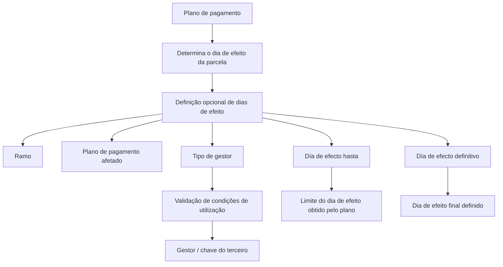

# Definição de Plano de Pagamento — Dias de Efeito dos Recibos

## 1. Metadados do Documento
- **Arquivo de Origem:** Não identificado no conteúdo fornecido
- **Tipo de Documento:** Especificação Técnica / Documentação Funcional
- **Domínio / Sistema:** Reef / MAPFRE — Plano de Pagamento e Gestão de Cobrança
- **Público-Alvo:** Analistas funcionais, desenvolvedores, arquitetura e operação de cobrança
- **Data/Versão Identificada:** Não identificada

---

## 2. Resumo Executivo & Contexto de Negócio

O documento descreve uma definição opcional de plano de pagamento destinada a estabelecer dias concretos de efeito para recibos associados a um plano de pagamento. O plano de pagamento determina originalmente o dia de efeito de cada parcela, enquanto a definição documentada pode alterar esse dia calculado.

A configuração é direcionada por ramo, plano de pagamento e tipo de gestor. O tipo de gestor identifica qual atividade de terceiro será responsável pela gestão da cobrança dos recibos e possui uma classe de gestor associada. A elegibilidade de cada tipo de gestor depende de condições relacionadas ao pagador, à apólice ou à existência de determinadas figuras na companhia.

O documento também define como a chave do terceiro gestor deve ser associada para cada tipo de gestor. Dependendo do tipo selecionado, a chave pode representar agente principal, entidade bancária e escritório bancário, cobrador, escritório de nível 3 ou entidade seguradora líder da apólice.

Por fim, a definição contém os atributos “Día de efecto hasta” e “Día de efecto definitivo”. Esses atributos estabelecem, respectivamente, até qual dia de efeito previamente obtido pelo plano de pagamento a regra se aplica e qual será o dia de efeito definitivo.

---

## 3. Arquitetura, Componentes & Tecnologias Envolvidas

Os elementos funcionais identificados no documento são:

- **Reef:** contexto de documentação no qual a definição está registrada.
- **MAPFRE:** organização mencionada nas descrições de cobrança bancária.
- **Plano de pagamento:** componente que determina o dia de efeito inicial de cada parcela.
- **Definição de dias de efeito:** configuração opcional que pode alterar o dia de efeito calculado pelo plano de pagamento.
- **Recibos:** itens de cobrança associados às parcelas do plano de pagamento.
- **Ramo:** referência ao ramo impactado pela definição.
- **Tipo de gestor:** classificação da atividade de terceiro encarregada da cobrança.
- **Gestor:** terceiro cuja chave é indicada segundo a classe/tipo de gestor.
- **Apólice:** entidade cujas características podem condicionar a utilização de determinados tipos de gestor.
- **Pagador:** entidade que deve possuir conta bancária ou cartão de crédito para determinados tipos de cobrança.



**Nota de Análise:** O conteúdo fornecido não detalha arquitetura de software, APIs, métodos HTTP, contratos JSON, bases de dados, URLs de ambientes, tecnologias de implementação ou integrações técnicas.

---

## 4. Regras de Negócio, Especificações Funcionais & Processos

### 4.1. Finalidade da definição

1. A definição de plano de pagamento para dias de efeito é **opcional**.
2. A definição permite estabelecer dias concretos de efeito para recibos associados ao plano de pagamento.
3. Todo plano de pagamento possui uma definição que determina, para cada parcela, qual efeito terá o recibo.
4. Após o cálculo do efeito pelo plano de pagamento, a definição de dias de efeito pode alterar o dia de efeito calculado.
5. A definição não substitui a determinação inicial do plano de pagamento; a definição atua como mecanismo de alteração do dia de efeito previamente determinado.

### 4.2. Propriedades da definição

- **Ramo:** aponta para o ramo ao qual a definição afeta.
- **Plano de pagamento:** determina qual plano de pagamento é afetado pela definição.
- **Tipo de gestor:** identifica qual atividade de terceiro é responsável por gerenciar a cobrança dos recibos.
- **Gestor:** informa a chave do terceiro que atuará como gestor, considerando o tipo e a classe de gestor.
- **Día de efecto hasta:** determina até qual dia de efeito, encontrado pelo plano de pagamento, a definição se aplica.
- **Día de efecto definitivo:** determina o dia de efeito definitivo.

### 4.3. Regras de utilização por tipo de gestor

1. O tipo de gestor possui um tipo de classe de gestor associado.
2. O tipo de gestor determina quais características a apólice deve possuir para que esse gestor possa ser utilizado na cobrança.
3. Os tipos **Banco**, **Débito automático em conta** e **Débito com cartão de crédito** exigem que o pagador possua o respectivo meio de pagamento indicado.
4. O tipo **Cobrador** somente pode ser utilizado quando a figura de cobrador estiver definida na companhia.
5. O tipo **Gestor piloto coaseguro** somente pode ser utilizado quando a apólice for de coasseguro aceito.
6. O tipo **Gestor de impagos** nunca pode ser utilizado nesta definição, pois é exclusivo do processo de inadimplência.

### 4.4. Processo funcional de determinação do dia de efeito

1. O plano de pagamento determina o dia de efeito do recibo para cada parcela.
2. A definição opcional é associada a um ramo e a um plano de pagamento.
3. A definição identifica o tipo de gestor da cobrança.
4. A utilização do tipo de gestor é validada conforme as condições aplicáveis ao pagador, à apólice ou à companhia.
5. A chave do gestor é associada conforme a regra do tipo de gestor selecionado.
6. O atributo **Día de efecto hasta** estabelece o limite referente ao dia de efeito encontrado pelo plano de pagamento.
7. O atributo **Día de efecto definitivo** estabelece o dia de efeito final.

---

## 5. Tabelas de Parâmetros, Ambientes e Estruturas de Dados

### 5.1. Propriedades da definição

| Item / Parâmetro | Descrição / Função | Tipo / Valores / Formato | Ambiente / Observações |
| :--- | :--- | :--- | :--- |
| Ramo | Aponta para o ramo afetado pela definição. | Não especificado | Propriedade da definição. |
| Plano de pagamento | Determina o plano de pagamento afetado pela definição. | Não especificado | O plano de pagamento determina inicialmente o dia de efeito das parcelas. |
| Tipo de gestor | Identifica a atividade de terceiro encarregada de gerir a cobrança dos recibos. | Tipos 1, 2, 3, 4, 5, 6, 7, 8 e 10 | Possui classe de gestor associada e regras de elegibilidade. |
| Gestor | Indica a chave do terceiro que atuará como gestor. | Depende do tipo de gestor | A chave varia entre agente, banco, cobrador, escritório ou entidade seguradora. |
| Día de efecto hasta | Determina até qual dia de efeito encontrado pelo plano de pagamento. | Não especificado | Atua como limite relacionado ao dia de efeito inicial. |
| Día de efecto definitivo | Determina o dia de efeito definitivo. | Não especificado | Define o dia de efeito final. |

### 5.2. Tipos de gestor e condições de utilização

| Item / Parâmetro | Descrição / Função | Tipo / Valores / Formato | Ambiente / Observações |
| :--- | :--- | :--- | :--- |
| Tipo de gestor 1 | Agente | `1 - AGENTE` | Pode ser utilizado sempre. |
| Tipo de gestor 2 | Banco | `2 - BANCO` | Pode ser utilizado quando o pagador possuir conta bancária. |
| Tipo de gestor 3 | Cobrador | `3 - COBRADOR` | Pode ser utilizado quando essa figura estiver definida na companhia. |
| Tipo de gestor 4 | Débito automático em conta | `4 - DÉBITO AUTOMÁTICO EN CUENTA` | Pode ser utilizado quando o pagador possuir conta bancária. |
| Tipo de gestor 5 | Gestor direto | `5 - GESTOR DIRECTO` | Pode ser utilizado sempre. |
| Tipo de gestor 6 | Gestor piloto coaseguro | `6 - GESTOR PILOTO COASEGURO` | Pode ser utilizado quando a apólice for de coasseguro aceito. |
| Tipo de gestor 7 | Oficina comercial | `7 - OFICINA COMERCIAL` | Pode ser utilizado sempre. |
| Tipo de gestor 8 | Débito com cartão de crédito | `8 - DÉBITO CON TARJETA DE CRÉDITO` | Pode ser utilizado quando o pagador possuir cartão de crédito. |
| Tipo de gestor 10 | Gestor de impagos | `10 - GESTOR DE IMPAGOS` | Nunca pode ser utilizado; é exclusivo do processo de impagos. |

### 5.3. Associação da chave do gestor

| Tipo | Descrição | Chave que se associa |
| :--- | :--- | :--- |
| 1 | Agente | Chave do agente principal da apólice. |
| 2 | Banco | Entidade junto à oficina bancária do terceiro encarregado de cobrar os recibos para MAPFRE. |
| 3 | Cobrador | Chave do cobrador encarregado de recolher os valores dos recibos. |
| 4 | Débito automático em conta | Entidade junto à oficina bancária do terceiro encarregado de cobrar os recibos para MAPFRE. |
| 5 | Gestor direto | Oficina de nível 3. |
| 6 | Gestor piloto coaseguro | Entidade seguradora que atua como líder na apólice. |
| 7 | Oficina comercial | Oficina de nível 3. |
| 8 | Débito com cartão de crédito | Entidade junto à oficina bancária do terceiro encarregado de cobrar os recibos para MAPFRE. |
| 10 | Gestor de impagos | Não aplicável. |

---

## 6. Bateria de Perguntas & Respostas para RAG (FAQ Sintético)

### P1: Qual é o objetivo da definição de plano de pagamento para dias de efeito?
**R:** A definição é opcional e permite estabelecer dias concretos de efeito para os recibos associados a um plano de pagamento. O plano de pagamento calcula inicialmente o dia de efeito de cada parcela, e a definição pode alterar esse dia calculado.

### P2: A definição de dias de efeito substitui o cálculo feito pelo plano de pagamento?
**R:** Não. O plano de pagamento determina inicialmente o dia de efeito do recibo para cada parcela. A definição de dias de efeito pode alterar o dia de efeito que foi previamente determinado pelo plano de pagamento.

### P3: Quais propriedades compõem a definição de plano de pagamento documentada?
**R:** As propriedades identificadas são: ramo, plano de pagamento, tipo de gestor, gestor, día de efecto hasta e día de efecto definitivo.

### P4: O que representa o atributo Ramo na definição?
**R:** O atributo Ramo aponta para o ramo ao qual a definição de dias de efeito afeta.

### P5: Quando o tipo de gestor Banco pode ser utilizado?
**R:** O tipo de gestor `2 - BANCO` pode ser utilizado quando o pagador possuir conta bancária.

### P6: Qual é a condição para usar o tipo Gestor piloto coaseguro?
**R:** O tipo `6 - GESTOR PILOTO COASEGURO` pode ser utilizado quando a apólice for de coasseguro aceito.

### P7: O tipo Gestor de impagos pode ser configurado para esta definição?
**R:** Não. O tipo `10 - GESTOR DE IMPAGOS` nunca pode ser utilizado nesta definição porque é exclusivo do processo de impagos.

### P8: Qual chave deve ser informada para o tipo de gestor Agente?
**R:** Para o tipo `1 - AGENTE`, deve ser associada a chave do agente principal da apólice.

### P9: Qual chave é associada ao tipo Gestor direto?
**R:** Para o tipo `5 - GESTOR DIRECTO`, a chave associada é uma oficina de nível 3.

### P10: O que representa o atributo Día de efecto hasta?
**R:** O atributo Día de efecto hasta determina até qual dia de efeito encontrado pelo plano de pagamento a definição se aplica.

### P11: O que representa o atributo Día de efecto definitivo?
**R:** O atributo Día de efecto definitivo determina o dia de efeito definitivo.

### P12: Quais tipos de gestor exigem que o pagador possua meio de pagamento específico?
**R:** Banco e Débito automático em conta exigem que o pagador possua conta bancária. Débito com cartão de crédito exige que o pagador possua cartão de crédito.

---

## 7. Glossário de Termos, Siglas & Conceitos-Chave

- **MAPFRE:** organização citada nas descrições de cobrança por entidade e oficina bancária.
- **Reef:** contexto/plataforma de documentação identificada no conteúdo fornecido.
- **Plano de pagamento:** elemento que determina o dia de efeito do recibo para cada parcela.
- **Recibo:** item associado a uma parcela do plano de pagamento e sujeito à determinação de dia de efeito.
- **Dia de efeito:** dia determinado para o recibo no contexto do plano de pagamento.
- **Ramo:** referência ao ramo ao qual a definição afeta.
- **Tipo de gestor:** classificação da atividade de terceiro que gerencia a cobrança dos recibos.
- **Gestor:** terceiro cuja chave é indicada de acordo com o tipo de gestor.
- **Coaseguro aceito:** condição exigida para utilização do tipo Gestor piloto coaseguro.
- **Oficina nível 3:** chave associada aos tipos Gestor direto e Oficina comercial.
- **Impagos:** processo de inadimplência ao qual o tipo Gestor de impagos é exclusivo.

---

## 8. Notas Críticas, Riscos & Limitações

- A definição de dias de efeito é opcional; o documento não especifica o comportamento quando não há uma definição configurada.
- O documento não detalha formatos, domínios de valores, regras de precedência adicionais ou validações técnicas para os atributos de dia de efeito.
- O documento não informa métodos HTTP, contratos de integração, APIs, estruturas JSON, persistência de dados ou componentes técnicos de implementação.
- O tipo `10 - GESTOR DE IMPAGOS` não pode ser usado na definição, pois é exclusivo do processo de impagos.
- A utilização de tipos de gestor depende de dados e condições externas, como conta bancária do pagador, cartão de crédito, existência de cobrador na companhia e condição de coasseguro aceito da apólice.
- **Nota de Análise:** O conteúdo apresenta exemplos, mas não fornece o detalhamento desses exemplos.

---

## 9. Conteúdo Bruto Estruturado (Referência Fiel)

```text
--- [PÁGINA 1 DE 2] ---

DEFINICIÓN de plan de pago - días de efecto
Objetivo
Esta denición es opcional y permite establecer días concretos de efecto de los recibos asociados al plan de pago. Esto quiere decir que,
todo plan de pago tiene una denición, entre ellas se determina para cada cuota cual es el efecto que tendrá el recibo. Una vez hallado este
efecto, puede ser alterado por esta denición. Es decir, el plan de pago determina cual es el día de efecto, y esta denición puede alterar ese
día de efecto.
-Propiedades
Propiedades
Ramo
Apunta al ramo al que afecta esta denición.
Plan de pago
Determina a qué plan de pago afectado por la denición.
Tipo de gestor
Este atributo identica que actividad de tercero se encarga de gestionar el cobro de los recibos. Un tipo de gestor tiene asociado un tipo de
clase de gestor. Este tipo determina que características debe tener la póliza para poder utilizarlo como gestor de cobro.
TIPO DESCRIPCIÓN EN QUE CASO PUEDE UTILIZARSE
1 AGENTE Siempre
2 BANCO Siempre que el pagador disponga de cuenta bancaria
3 COBRADOR Siempre que exista esta gura denida en la compañía
4 DÉBITO AUTOMÁTICO EN CUENTA Siempre que el pagador disponga de cuenta bancaria
5 GESTOR DIRECTO Siempre
Ejemplo:
Documentation / DOCUMENTACIÓN Reef
DOCUMENTACIÓN Reef
Mapfredocument
DOCUMENTACIÓN Reef
Owner
user:agonzalez_mapfre.com
Lifecycle
Approved Source
 /
 VL
Buscar Inicio Soluciones Arquitecturas APIs Componentes Cloud Documentación Zeus Reef Ayuda
ES


--- [PÁGINA 2 DE 2] ---

TIPO DESCRIPCIÓN EN QUE CASO PUEDE UTILIZARSE
6 GESTOR PILOTO COASEGURO Siempre que la póliza sea de coaseguro aceptado
7 OFICINA COMERCIAL Siempre
8 DÉBITO CON TARJETA DE CRÉDITO Siempre que el pagador disponga de una tarjeta de crédito
10 GESTOR DE IMPAGOS Nunca. Este tipo de exclusivo del proceso de impagos
Gestor
En este punto se indica la clave del tercero que actuará como gestor atendiendo al tipo de clase de gestor. Es decir:
TIPO DESCRIPCIÓN CLAVE QUE SE ASOCIA
1 AGENTE Será la clave del agente principal de la póliza
2 BANCO Entidad junto a la ocina bancaria del tercero que se encarga de cobrar los recibos
para MAPFRE
3 COBRADOR Corresponde a la del cobrador que se encargará de recolectar los importes de los
recibos
4 DÉBITO AUTOMÁTICO EN
CUENTA
Entidad junto a la ocina bancaria del tercero que se encarga de cobrar los recibos
para MAPFRE
5 GESTOR DIRECTO Ocina (nivel 3)
6 GESTOR PILOTO COASEGURO Entidad aseguradora que actúa como líder en la póliza
7 OFICINA COMERCIAL Ocina (nivel 3)
8 DÉBITO CON TARJETA DE
CRÉDITO
Entidad junto a la ocina bancaria del tercero que se encarga de cobrar los recibos
para MAPFRE
10 GESTOR DE IMPAGOS No aplica
Día de efecto hasta / día de efecto denitivo
Los dos atributos siguientes sirven para establecer los valores desde/hasta y el día de efecto denitivo.
Día de efecto hasta
En este punto se determina hasta qué día de efecto hallado por el plan de pago.
Día de efecto denitivo
Aquí se determina el día de efecto denitivo.
Ejemplo:
```
