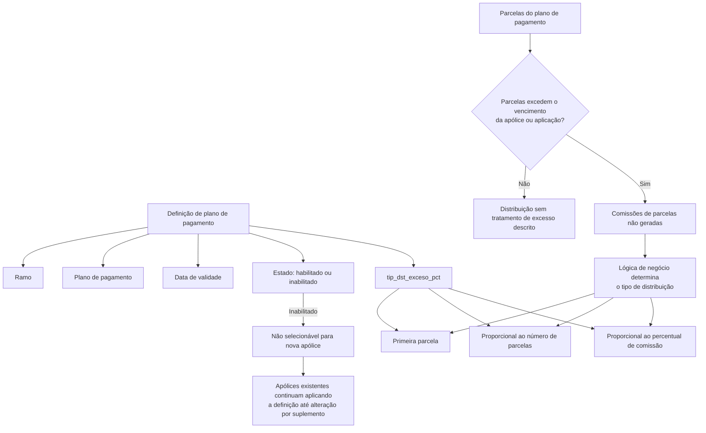

# Definição de Plano de Pagamento — Excesso de Comissões

## 1. Metadados do Documento
- **Arquivo de Origem:** Não identificado no conteúdo fornecido
- **Tipo de Documento:** Especificação Funcional
- **Domínio / Sistema:** Reef / Mapfre
- **Público-Alvo:** Desenvolvedores, analistas funcionais, arquitetos e operação de seguros
- **Data/Versão Identificada:** Não identificada

---

## 2. Resumo Executivo & Contexto de Negócio

O documento descreve a definição funcional de um plano de pagamento para tratar o **excesso de comissões** quando parcelas ultrapassam o vencimento de uma apólice ou aplicação. O objetivo é determinar como redistribuir o percentual de comissão que não pôde ser atribuído às parcelas não geradas.

A configuração está associada a um **ramo**, a um **plano de pagamento** e a uma **data de validade**. A data de validade possibilita manter o histórico das mudanças efetuadas na definição e controlar quando a configuração pode ser utilizada.

A definição pode ser marcada como inabilitada. Quando uma definição é inabilitada, ela não pode ser selecionada para novas apólices. Contudo, as apólices que já utilizam a definição continuam aplicando-a até que um suplemento altere essa configuração.

O parâmetro `tip_dst_exceso_pct` define uma entre três estratégias de distribuição: transferência integral para a primeira parcela, distribuição proporcional pela quantidade de parcelas geradas ou distribuição proporcional pelo percentual de comissão das parcelas geradas.

O conteúdo também define uma lógica de negócio responsável por retornar qual estratégia de distribuição deve ser utilizada para as comissões das parcelas não geradas. O documento não detalha critérios, entradas, contratos técnicos, métodos HTTP, persistência ou implementação dessa lógica de negócio.

---

## 3. Arquitetura, Componentes & Tecnologias Envolvidas

Os elementos identificados no documento são:

- **Reef:** Ambiente ou sistema de documentação referido como “DOCUMENTACIÓN Reef”.
- **Mapfre:** Contexto corporativo identificado no conteúdo de navegação e no proprietário `user:agonzalez_mapfre.com`.
- **Definição de plano de pagamento:** Configuração funcional que determina o tratamento de comissões de parcelas que excedem o vencimento.
- **Apólice / aplicação:** Entidade cujo vencimento limita a criação ou distribuição de parcelas.
- **Suplemento:** Mecanismo citado para alterar uma definição aplicada a uma apólice.
- **Lógica de negócio de distribuição:** Lógica que devolve o tipo de distribuição de comissão aplicável às parcelas não geradas.
- **`tip_dst_exceso_pct`:** Propriedade que seleciona o comportamento de distribuição de comissões excedentes.



> **Nota de Análise:** O documento descreve relações funcionais e não apresenta uma arquitetura técnica de serviços, banco de dados, APIs, contratos JSON, filas, servidores, ambientes ou tecnologias de implementação.

---

## 4. Regras de Negócio, Especificações Funcionais & Processos

### 4.1 Objetivo da definição

Quando as parcelas de um plano de pagamento excedem o vencimento da apólice, podem ser aplicadas diferentes opções de tratamento. A definição decide como serão distribuídas as comissões das parcelas que excedem o vencimento da apólice ou aplicação.

### 4.2 Propriedades da definição

1. **Ramo**
   - Aponta para o ramo afetado pela definição.

2. **Plano de pagamento**
   - Determina o plano de pagamento afetado pela definição.

3. **Data de validade**
   - Determina quando a definição estará disponível para utilização.
   - O uso correto da data de validade permite manter um registro histórico das alterações efetuadas na definição.

4. **Inabilitado**
   - Determina se a definição está ativa ou se não pode mais ser incluída em uma nova apólice.
   - Quando a definição é inabilitada, as apólices que já possuem essa definição continuam aplicando-a.
   - A definição continua sendo aplicada às apólices existentes até que seja alterada por meio de um suplemento.
   - Após a alteração por suplemento, a definição inabilitada não poderá ser novamente selecionada.

5. **`tip_dst_exceso_pct`**
   - Determina como atuar sobre as comissões quando parcelas excedem o vencimento da apólice ou aplicação.
   - As opções válidas são:
     1. Primeira parcela.
     2. Proporcional ao número de parcelas.
     3. Proporcional ao percentual de comissão.

### 4.3 Estratégia 1 — Primeira parcela

O percentual total das comissões que não pôde ser distribuído é transferido integralmente para a primeira parcela.

### 4.4 Estratégia 2 — Proporcional ao número de parcelas

O percentual total das comissões não distribuídas é repartido proporcionalmente entre o número de parcelas que puderam ser distribuídas ou criadas.

O documento apresenta o seguinte cenário:

- Não é possível distribuir **50%** das comissões.
- Existem **duas parcelas** que puderam ser criadas.
- Os **50%** não distribuídos são repartidos entre as duas parcelas criadas.

A fórmula apresentada no documento é:

```text
% de comissão de parcela =
% de comissão de parcela +
(soma de % de comissão que NÃO se pôde distribuir /
 Nº de parcelas que SIM se pôde distribuir)
```

### 4.5 Estratégia 3 — Proporcional ao percentual de comissão

O percentual das comissões não distribuídas é repartido conforme a representatividade do percentual de comissão de cada parcela que pôde ser distribuída.

O texto indica que a proporção considera o percentual de comissão de cada parcela distribuída em relação ao total do percentual de comissão não distribuído.

A fórmula apresentada no documento é:

```text
% de comissão de parcela =
% de comissão de parcela +
(% de comissão de parcela /
 soma de % de comissão que NÃO se pôde distribuir * 100)
```

> **Nota de Análise:** O documento apresenta as fórmulas textualmente, mas não detalha variáveis formais, precedência matemática, arredondamento, tratamento de divisões por zero, exemplo numérico completo ou critérios de validação para os resultados.

### 4.6 Lógica de negócio para determinação da estratégia

A lógica de negócio tem como objetivo devolver a forma pela qual serão distribuídas as comissões das parcelas não geradas.

A lógica deve devolver obrigatoriamente um dos seguintes tipos:

1. **Primeira parcela**
2. **Proporcional ao número de parcelas**
3. **Proporcional ao percentual de comissão**

> **Nota de Análise:** O documento não informa quais condições, parâmetros de entrada ou regras de decisão devem levar a lógica de negócio a retornar cada um dos três tipos.

---

## 5. Tabelas de Parâmetros, Ambientes e Estruturas de Dados

### 5.1 Propriedades da definição de plano de pagamento

| Item / Parâmetro | Descrição / Função | Tipo / Valores / Formato | Ambiente / Observações |
| :--- | :--- | :--- | :--- |
| Ramo | Aponta para o ramo afetado pela definição. | Não especificado | Associado à definição de plano de pagamento. |
| Plano de pagamento | Determina o plano de pagamento afetado pela definição. | Não especificado | Associado à definição de plano de pagamento. |
| Data de validade | Determina quando a definição estará disponível para uso. Permite manter histórico de alterações. | Data; formato não especificado | Não há detalhe sobre data inicial, final ou fuso horário. |
| Inabilitado | Define se a configuração está ativa ou se não pode mais ser incluída em uma nova apólice. | Estado habilitado/inabilitado; representação não especificada | Apólices existentes continuam aplicando a definição até uma alteração por suplemento. |
| `tip_dst_exceso_pct` | Determina o tratamento das comissões quando parcelas excedem o vencimento da apólice ou aplicação. | `Primeira parcela`; `Proporcional ao número de parcelas`; `Proporcional ao percentual de comissão` | O documento não informa codificação, enumeração técnica ou persistência do valor. |

### 5.2 Estratégias de redistribuição de comissão

| Estratégia | Descrição / Função | Tipo / Valores / Formato | Ambiente / Observações |
| :--- | :--- | :--- | :--- |
| Primeira parcela | Todo o percentual de comissão não distribuído passa para a primeira parcela. | Uma das opções de `tip_dst_exceso_pct` | Não há exemplo numérico detalhado. |
| Proporcional ao número de parcelas | O percentual não distribuído é repartido entre as parcelas que puderam ser criadas. | Uma das opções de `tip_dst_exceso_pct` | Exemplo textual: 50% não distribuído repartido entre duas parcelas criadas. |
| Proporcional ao percentual de comissão | O percentual não distribuído é repartido segundo a participação do percentual de comissão de cada parcela distribuída. | Uma das opções de `tip_dst_exceso_pct` | A fórmula é apresentada sem detalhamento de variáveis ou arredondamento. |

### 5.3 Fórmulas registradas no documento

| Item / Parâmetro | Descrição / Função | Tipo / Valores / Formato | Ambiente / Observações |
| :--- | :--- | :--- | :--- |
| Fórmula proporcional por número de parcelas | Atualiza o percentual de comissão de uma parcela com uma parcela igual do total não distribuído. | `% de comissão de parcela = % de comissão de parcela + (soma de % de comissão que NÃO se pôde distribuir / Nº de parcelas que SIM se pôde distribuir)` | Fórmula reproduzida conforme o documento. |
| Fórmula proporcional por percentual de comissão | Atualiza o percentual de comissão da parcela conforme uma relação apresentada entre a comissão da parcela e a soma não distribuída. | `% de comissão de parcela = % de comissão de parcela + (% de comissão de parcela / soma de % de comissão que NÃO se pôde distribuir * 100)` | Fórmula reproduzida conforme o documento; sem definição formal de precedência. |

### 5.4 Ambientes, URLs, rotas e logs

| Item / Parâmetro | Descrição / Função | Tipo / Valores / Formato | Ambiente / Observações |
| :--- | :--- | :--- | :--- |
| Ambiente técnico | Não identificado. | Não aplicável | O documento não contém URLs de ambiente, servidores, portas ou rotas técnicas. |
| Logs | Não identificados. | Não aplicável | O documento não define caminhos, níveis ou variáveis de log. |
| APIs | Não identificadas. | Não aplicável | O documento não especifica métodos HTTP, endpoints ou contratos de integração. |

---

## 6. Bateria de Perguntas & Respostas para RAG (FAQ Sintético)

### P1: Qual é o objetivo da definição de plano de pagamento para excesso de comissões?
**R:** A definição de plano de pagamento para excesso de comissões determina como distribuir as comissões das parcelas que excedem o vencimento de uma apólice ou aplicação. O tratamento é selecionado por meio da propriedade `tip_dst_exceso_pct`.

### P2: Quais estratégias podem ser retornadas pela lógica de negócio para distribuir comissões de parcelas não geradas?
**R:** A lógica de negócio deve retornar uma das três estratégias documentadas: **Primeira parcela**, **Proporcional ao número de parcelas** ou **Proporcional ao percentual de comissão**.

### P3: O que acontece quando a estratégia selecionada é “Primeira parcela”?
**R:** Quando a estratégia é **Primeira parcela**, o percentual total das comissões que não pôde ser distribuído é transferido para a primeira parcela.

### P4: Como funciona a distribuição proporcional ao número de parcelas?
**R:** Na estratégia **Proporcional ao número de parcelas**, o percentual total de comissão que não pôde ser distribuído é repartido entre as parcelas que puderam ser criadas. O documento exemplifica que, se 50% das comissões não puderem ser distribuídas e duas parcelas forem criadas, os 50% serão repartidos entre essas duas parcelas.

### P5: Qual fórmula o documento apresenta para a distribuição proporcional ao número de parcelas?
**R:** O documento apresenta a fórmula: `% de comissão de parcela = % de comissão de parcela + (soma de % de comissão que NÃO se pôde distribuir / Nº de parcelas que SIM se pôde distribuir)`. O conteúdo não detalha regras de arredondamento, precisão numérica ou tratamento de divisão por zero.

### P6: Como funciona a distribuição proporcional ao percentual de comissão?
**R:** A estratégia **Proporcional ao percentual de comissão** distribui a comissão não distribuída segundo a representatividade do percentual de comissão de cada parcela que pôde ser distribuída. O documento afirma que a distribuição considera a relação entre o percentual de comissão da parcela e o total de percentual de comissão não distribuído.

### P7: Qual fórmula o documento apresenta para a distribuição proporcional ao percentual de comissão?
**R:** O documento apresenta a fórmula: `% de comissão de parcela = % de comissão de parcela + (% de comissão de parcela / soma de % de comissão que NÃO se pôde distribuir * 100)`. Não há especificação adicional sobre parênteses operacionais, variáveis, arredondamento ou exemplo numérico completo.

### P8: Para que serve a data de validade na definição de plano de pagamento?
**R:** A data de validade determina quando a definição estará disponível para utilização. O documento informa que o uso correto dessa propriedade permite manter um registro histórico das alterações efetuadas na definição.

### P9: O que ocorre quando uma definição de plano de pagamento é inabilitada?
**R:** Uma definição inabilitada não pode ser incluída em uma nova apólice. Porém, as apólices que já utilizam a definição continuam aplicando-a até que ela seja alterada por meio de um suplemento. Depois dessa alteração, a definição inabilitada não poderá ser selecionada novamente.

### P10: O que representam as propriedades “Ramo” e “Plano de pagamento”?
**R:** A propriedade **Ramo** aponta para o ramo afetado pela definição. A propriedade **Plano de pagamento** determina qual plano de pagamento é afetado pela definição.

### P11: O documento especifica endpoints, APIs ou métodos HTTP para a lógica de negócio?
**R:** Não. O documento apenas descreve que existe uma lógica de negócio cuja finalidade é devolver uma das três formas de distribuição de comissões. Não são apresentados métodos HTTP, endpoints, contratos JSON, tecnologias de implementação ou interfaces técnicas.

### P12: O documento define critérios para escolher entre as três estratégias de `tip_dst_exceso_pct`?
**R:** Não. O documento lista as três estratégias possíveis e afirma que a lógica de negócio deve retornar uma delas, mas não informa condições, regras de decisão, prioridades ou parâmetros de entrada para selecionar cada estratégia.

---

## 7. Glossário de Termos, Siglas & Conceitos-Chave

- **Apólice:** Entidade mencionada como possuidora de um vencimento que pode limitar a geração de parcelas.
- **Aplicação:** Termo mencionado juntamente com apólice como contexto de vencimento; não possui detalhamento adicional no documento.
- **Data de validade:** Propriedade que determina a disponibilidade de uma definição para uso e apoia o histórico de mudanças.
- **Definição de plano de pagamento:** Configuração que determina o tratamento das comissões quando parcelas excedem o vencimento.
- **Excesso de comissões:** Comissão relacionada a parcelas que excedem o vencimento da apólice ou aplicação e que não pôde ser distribuída inicialmente.
- **Inabilitado:** Estado no qual uma definição deixa de poder ser incluída em novas apólices, preservando sua aplicação para apólices existentes até alteração por suplemento.
- **Parcela / quota:** Unidade do plano de pagamento à qual pode ser atribuído percentual de comissão.
- **Plano de pagamento:** Propriedade que identifica o plano afetado pela definição.
- **Ramo:** Propriedade que aponta para o ramo afetado pela definição.
- **Reef:** Nome do ambiente ou sistema de documentação citado no conteúdo.
- **Suplemento:** Mecanismo mencionado para alterar uma definição aplicada a uma apólice.
- **`tip_dst_exceso_pct`:** Propriedade que define como atuar sobre comissões quando parcelas excedem o vencimento; aceita três estratégias de distribuição.

---

## 8. Notas Críticas, Riscos & Limitações

- O documento não identifica o arquivo original, a data, a versão, o autor técnico ou o histórico de revisões.
- Não são apresentados contratos de API, métodos HTTP, estruturas JSON, modelo de dados, banco de dados, eventos, integrações ou detalhes de implementação.
- Não há ambientes, servidores, URLs, portas, credenciais, rotas de logs ou procedimentos operacionais definidos.
- A lógica de negócio deve retornar uma das três estratégias de distribuição, mas os critérios de escolha entre essas estratégias não são documentados.
- As fórmulas são apresentadas em formato textual e não definem explicitamente precedência matemática, variáveis formais, precisão, arredondamento, tratamento de valor nulo, divisão por zero ou validação de consistência.
- A descrição da distribuição proporcional ao percentual de comissão afirma uma proporcionalidade baseada na comissão de cada parcela, mas a fórmula apresentada deve ser validada funcionalmente antes de uma implementação, pois o documento não fornece um exemplo numérico completo.
- O comportamento do suplemento é citado somente para informar a continuidade da aplicação de uma definição inabilitada em apólices existentes; o fluxo operacional ou técnico do suplemento não é detalhado.
- O documento não explica a diferença de domínio entre “apólice” e “aplicação” no contexto do vencimento.

---

## 9. Conteúdo Bruto Estruturado (Referência Fiel)

```text
--- [PÁGINA 1 DE 2] ---

DEFINICIÓN de plan de pago - Exceso de comisiones
Objetivo
Cuando las cuotas de un plan de pago superan el vencimiento de la póliza, se puede actuar sobre estas en las que se ofrecen distintas
opciones. En esta denición, se decide como distribuir las comisiones de las cuotas que exceden el vencimiento de la póliza o aplicación.
-Propiedades
Propiedades
Ramo
Apunta al ramo al que afecta esta denición.
Plan de pago
Determina a qué plan de pago afectado por la denición.
Fecha de validez
Determina cuando la denición estará disponible para ser utilizado. Su correcto uso permite tener un registro histórico de los cambios
efectuados en la denición.
Inhabilitado
En este punto se determina si está activo o por el contrario ya no puede ser incluido en una nueva póliza. Es importante destacar que, aunque
inhabilite, todas las pólizas que dispongan de ello, seguirá aplicándose hasta que mediante un suplemento se cambie. En ese momento, al
estar inhabilitado ya no será posible seleccionarlo.
tip_dst_exceso_pct
En este punto se determina como actuar con las comisiones en caso que las cuota excedan el vencimiento de la póliza o aplicación. Existen
las opciones que se muestran a continuación:
1. Primera cuota
2. Proporcional al número de cuotas
3. Proporcional al porcentaje de comisión
Ejemplo:
Documentation / DOCUMENTACIÓN Reef
DOCUMENTACIÓN Reef
Mapfredocument
DOCUMENTACIÓN Reef
Owner
user:agonzalez_mapfre.com
Lifecycle
Approved Source
 / 
 VL
Buscar Inicio Soluciones Arquitecturas APIs Componentes Cloud Documentación Zeus Reef Ayuda
ES


--- [PÁGINA 2 DE 2] ---

1. Primera cuota
El porcentaje total de las comisiones que no se han podido distribuir pasan a la primera cuota.
1. Proporcional al número de cuotas
El porcentaje total de las comisiones que no se han podido distribuir pasan a repartirse de forma proporcional al número de cuotas que si
se han podido distribuir. En este caso no se puede distribuir el 50% de las comisiones, por lo que ese 50% se repartirán en las dos cuotas
que si se pudieron crear. Para este caso se aplica la siguiente fórmula:
1. Proporcional al porcentaje de comisión
El porcentaje de las comisiones no distribuidas se repartirán según lo que representa el porcentaje de comisión de cada cuota que si se
ha podido distribuir, sobre el total del porcentaje de comisión que no se han podido distribuir. Es decir, se aplica la siguiente fórmula:
Lógica de negocio que determina la forma en la que se distribuirá las comisiones de las cuotas no generadas
Corresponde con una lógica de negocio cuyo cometido es devolver cual es la forma en la que se debe distribuir las comisiones de las cuotas
que no se generaron. Debe devolver cualquiera de los tipos vistos anteriormente. Es decir:
1. Primera cuota
2. Proporcional al número de cuotas
3. Proporcional al porcentaje de comisión
Ejemplo:
1
% de comisión de cuota = % de comisión de cuota + (suma de % de comisión que NO se 
pudo distribuir / Nº de cuotas que SI se pudo distribuir)
Ejemplo:
1
% de comisión de cuota = % de comisión de cuota + (% de comisión de cuota / suma de % de comisión que NO se pudo distribuir * 
100)
Ejemplo:
```
