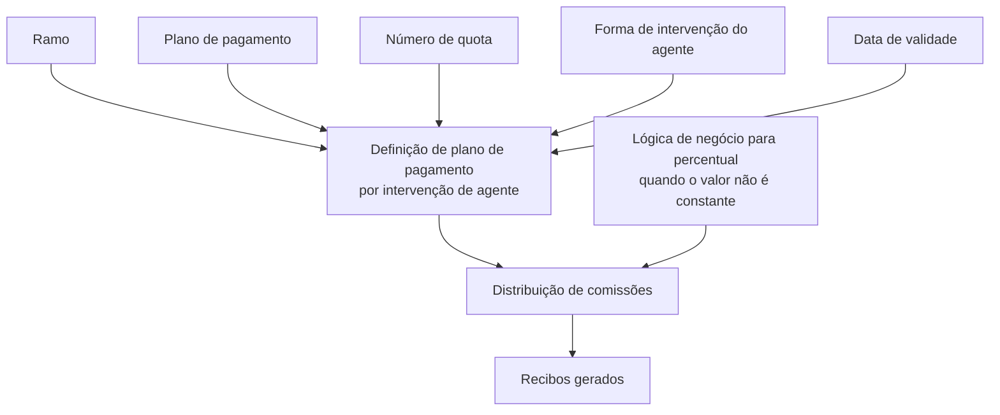

# Definição de Plano de Pagamento — Intervenção de Agente no Reef.core

## 1. Metadados do Documento
- **Arquivo de Origem:** Não identificado no conteúdo fornecido
- **Tipo de Documento:** Especificação Técnica
- **Domínio / Sistema:** Reef.core / DOCUMENTACIÓN Reef / Mapfre
- **Público-Alvo:** Desenvolvedores, analistas funcionais e equipes responsáveis pela configuração de planos de pagamento
- **Data/Versão Identificada:** Não identificada

---

## 2. Resumo Executivo & Contexto de Negócio

O documento descreve uma definição opcional de plano de pagamento associada à intervenção de agentes. A definição existe para alterar a distribuição de comissões nos recibos gerados por um plano de pagamento quando a configuração padrão não é suficiente.

A definição padrão do plano de pagamento já permite distribuir as comissões das diferentes figuras de agente nos recibos. A configuração descrita torna-se necessária quando determinadas intervenções de agente não devem receber a mesma distribuição de comissão aplicada às demais figuras participantes da apólice.

O exemplo apresentado diferencia o agente principal da apólice de outra figura, como o organizador. Nesse cenário, cada figura pode possuir uma distribuição de comissões distinta ao longo das quotas do plano de pagamento.

A configuração é relacionada a um ramo, a um plano de pagamento, a uma quota específica e à forma de intervenção do agente. O percentual de comissão aplicável pode ser informado diretamente ou determinado por uma lógica de negócio quando não for constante.

A data de validade permite controlar quando a definição estará disponível para uso e manter um histórico das alterações efetuadas na definição.

---

## 3. Arquitetura, Componentes & Tecnologias Envolvidas

| Componente / Conceito | Papel identificado no documento |
| :--- | :--- |
| Reef.core | Sistema no qual determinadas circunstâncias para cálculo variável de comissão não estão definidas. |
| Plano de pagamento | Elemento afetado pela definição; orienta a distribuição de comissões nos recibos gerados. |
| Recibos | Registros gerados nos quais são distribuídas as comissões das figuras de agente. |
| Figura de agente | Participante da apólice cuja distribuição de comissões pode ser configurada. |
| Agente principal | Exemplo de figura de agente que pode possuir distribuição de comissões distinta. |
| Organizador | Exemplo de outra figura da apólice que pode possuir distribuição de comissões distinta da do agente principal. |
| Lógica de negócio | Mecanismo que devolve o percentual de comissão a aplicar a uma quota definida quando esse percentual varia. |
| Ramo | Referência para o ramo ao qual a definição se aplica. |
| Data de validade | Controle de disponibilidade da definição e histórico de mudanças. |



> **Nota de Análise:** O documento não detalha métodos HTTP, contratos JSON, persistência de dados, interfaces de configuração ou algoritmos de cálculo implementados no Reef.core.

---

## 4. Regras de Negócio, Especificações Funcionais & Processos

1. A definição de plano de pagamento por intervenção de agente é **opcional**.
2. A definição padrão de plano de pagamento permite distribuir as comissões das distintas figuras de agente nos recibos que serão gerados.
3. A definição específica deve ser aplicada quando não se deseja que todas as intervenções de agente tenham a mesma distribuição de comissões nos recibos de um plano de pagamento.
4. O agente principal da apólice pode possuir uma distribuição de comissões totalmente distinta de outra figura da apólice, como o organizador.
5. A definição deve apontar para o **ramo** ao qual se aplica.
6. A definição deve determinar o **plano de pagamento** afetado.
7. A definição deve informar o **número de quota**, que determina como será configurada a quota indicada.
8. A definição deve determinar a **forma de intervenção do agente** cuja distribuição de comissões será alterada.
9. O campo de percentual determina qual percentual do importe total de comissão encontrado será aplicado à quota em definição.
10. Quando o percentual de comissão não for uma constante, uma lógica de negócio pode determinar o percentual aplicável à quota.
11. A lógica de negócio é utilizada quando o percentual varia em função de circunstâncias não definidas no Reef.core.
12. A data de validade determina quando a definição estará disponível para utilização.
13. O uso correto da data de validade permite manter um registro histórico das alterações realizadas na definição.

---

## 5. Tabelas de Parâmetros, Ambientes e Estruturas de Dados

| Item / Parâmetro | Descrição / Função | Tipo / Valores / Formato | Ambiente / Observações |
| :--- | :--- | :--- | :--- |
| Ramo | Aponta para o ramo afetado pela definição. | Não especificado | Aplicável à definição de plano de pagamento. |
| Plano de pagamento | Determina qual plano de pagamento é afetado pela definição. | Não especificado | Relacionado aos recibos que serão gerados. |
| Número de quota | Determina como será a definição da quota indicada no atributo. | Não especificado | Aplicável a uma quota do plano de pagamento. |
| Forma de intervenção do agente | Determina a forma de intervenção do agente cuja distribuição de comissões será alterada. | Não especificado | Diferencia figuras de agente, como agente principal e organizador. |
| Porcentagem da comissão total na quota | Determina, a partir do importe total de comissão calculado, qual percentual é aplicado à quota em definição. | Percentual; formato não especificado | Pode ser configurado como valor direto ou determinado por lógica de negócio. |
| Nome da lógica de negócio que determina a porcentagem de comissões | Identifica uma lógica de negócio que devolve o percentual de comissão a aplicar à quota definida. | Nome de lógica de negócio; formato não especificado | Utilizado quando o percentual não é constante e varia por circunstâncias não definidas no Reef.core. |
| Data de validade | Determina quando a definição estará disponível para utilização. | Data; formato não especificado | Permite histórico de mudanças efetuadas na definição. |
| Agente principal | Figura de agente usada como exemplo de distribuição de comissão distinta. | Figura de agente | Pode ter distribuição totalmente diferente da de outra figura da apólice. |
| Organizador | Figura da apólice usada como exemplo comparativo. | Figura de agente | Pode ter distribuição de comissão distinta da do agente principal. |

---

## 6. Bateria de Perguntas & Respostas para RAG (FAQ Sintético)

### P1: Qual é o objetivo da definição de plano de pagamento por intervenção de agente?
**R:** O objetivo é permitir uma distribuição de comissões diferente por forma de intervenção de agente nos recibos gerados por um plano de pagamento, quando a definição padrão não atende à necessidade de negócio.

### P2: A definição de plano de pagamento por intervenção de agente é obrigatória?
**R:** Não. O documento informa que a definição é opcional, pois a definição padrão do plano de pagamento já consegue distribuir as comissões das distintas figuras de agente nos recibos gerados.

### P3: Em qual situação essa definição específica deve ser usada?
**R:** A definição deve ser usada quando nem todas as intervenções de agente devem receber a mesma distribuição de suas comissões nos recibos de um plano de pagamento.

### P4: Qual exemplo de diferenciação entre figuras de agente é apresentado?
**R:** O documento apresenta o caso em que o agente principal da apólice possui uma distribuição de comissões totalmente distinta de outra figura da apólice, como o organizador.

### P5: Quais propriedades identificam o escopo da definição de plano de pagamento?
**R:** O escopo é identificado pelo ramo afetado, pelo plano de pagamento afetado, pelo número de quota e pela forma de intervenção do agente cuja distribuição de comissões será alterada.

### P6: Como é utilizado o percentual da comissão total na quota?
**R:** O percentual determina qual parte do importe total de comissão calculado será aplicada à quota que está sendo definida.

### P7: Quando deve ser utilizada uma lógica de negócio para determinar o percentual de comissão?
**R:** A lógica de negócio deve ser utilizada quando o percentual de comissão não é constante e varia conforme circunstâncias que não estão definidas no Reef.core.

### P8: Qual é a responsabilidade da lógica de negócio de percentual de comissões?
**R:** A responsabilidade da lógica de negócio é devolver qual percentual de comissão deve ser aplicado à quota definida.

### P9: Qual é a função da data de validade na definição?
**R:** A data de validade determina quando a definição estará disponível para uso. Seu uso correto também permite manter um registro histórico das alterações efetuadas na definição.

### P10: O documento define quais circunstâncias fazem o percentual de comissão variar?
**R:** Não. O documento afirma que a lógica de negócio é usada quando o percentual varia em função de circunstâncias não definidas no Reef.core, mas não especifica quais são essas circunstâncias.

---

## 7. Glossário de Termos, Siglas & Conceitos-Chave

- **Reef.core:** Sistema citado como não contendo a definição das circunstâncias que podem tornar variável o percentual de comissão.
- **Plano de pagamento:** Elemento que orienta a geração de recibos e a distribuição de comissões.
- **Recibo:** Registro gerado pelo plano de pagamento no qual são distribuídas as comissões das figuras de agente.
- **Figura de agente:** Papel ou participante de agente associado à apólice, sujeito à distribuição de comissões.
- **Agente principal:** Figura de agente utilizada como exemplo de participante com distribuição própria de comissões.
- **Organizador:** Outra figura da apólice utilizada como exemplo de participante com distribuição distinta da do agente principal.
- **Quota:** Unidade do plano de pagamento para a qual a distribuição de comissão pode ser definida.
- **Ramo:** Referência ao ramo afetado pela definição.
- **Forma de intervenção do agente:** Critério que identifica a participação do agente cuja distribuição de comissões será alterada.
- **Lógica de negócio:** Regra ou mecanismo responsável por devolver o percentual de comissão aplicável quando o percentual não é constante.
- **Data de validade:** Informação que controla a disponibilidade de utilização da definição e apoia o histórico de mudanças.

---

## 8. Notas Críticas, Riscos & Limitações

- O documento não informa o nome do arquivo de origem, data, versão ou autor técnico da especificação.
- O documento não detalha o formato, domínio de valores ou obrigatoriedade dos campos e propriedades apresentados.
- O documento não especifica como a lógica de negócio é implementada, cadastrada, executada ou validada.
- O documento não define as circunstâncias que podem variar o percentual de comissão; apenas informa que tais circunstâncias não estão definidas no Reef.core.
- Não há detalhamento sobre precedência entre definição padrão e definição específica por intervenção de agente.
- Não há exemplos numéricos de cálculo de comissão, percentuais ou distribuição entre quotas.
- O conteúdo menciona um enlace para maior detalhamento da propriedade de percentual no plano de pagamento, mas o endereço do enlace não foi fornecido.
- Não há detalhes sobre integração, persistência, APIs, permissões de acesso, auditoria ou tratamento de erros.

---

## 9. Conteúdo Bruto Estruturado (Referência Fiel)

```text
--- [PÁGINA 1 DE 2] ---

DEFINICIÓN de plan de pago - intervención agente
Objetivo
Esta denición es opcional ya que con la denición por defecto del plan de pago se consigue distribuir las comisiones de las distintas guras
de agente en los recibos que se generarán. Esta denición aplicaría cuando se desea que no todas las intervenciones de agente lleven la
misma distribución de sus comisiones en los recibos de un plan de pago. Esto quiere decir que, por ejemplo el agente principal de la póliza
tenga una distribución de sus comisiones totalmente distinta a otra gura de la póliza como podría ser el organizador.
-Propiedades
Propiedades
Ramo
Apunta al ramo al que afecta esta denición.
Plan de pago
Determina a qué plan de pago afectado por la denición.
Número de cuota
En este punto se determina como será la denición de la cuota indicada en este atributo
Forma en la que interviene el agente
En este punto se determina la forma en la que interviene el agente a la que se alterará la distribución de sus comisiones.
Porcentaje de la comisión total en la cuota
En esta propiedad se determina, del importe total de comisión hallado, qué porcentaje se aplica a la cuota que se está deniendo. Para
obtener un detalle mayor, el siguiente enlace muestra la denición de esta propiedad en el plan de pago-
Nombre de la lógica de negocio que determina el porcentaje de comisiones
Corresponde con una lógica de negocio cuyo cometido es devolver cual es el porcentaje de comisión a aplicar a la cuota denida. Se utiliza
cuando el porcentaje no es una constante y varía dependiendo de circunstancias que no están denidas en Reef.core.
Fecha de validez
Ejemplo:
Documentation / DOCUMENTACIÓN Reef
DOCUMENTACIÓN Reef
Mapfredocument
DOCUMENTACIÓN Reef
Owner
user:agonzalez_mapfre.com
Lifecycle
Approved Source
 /
VL
Buscar Inicio Soluciones Arquitecturas APIs Componentes Cloud Documentación Zeus Reef Ayuda
ES

--- [PÁGINA 2 DE 2] ---

Determina cuando la denición estará disponible para ser utilizado. Su correcto uso permite tener un registro histórico de los cambios
efectuados en la denición.
```
