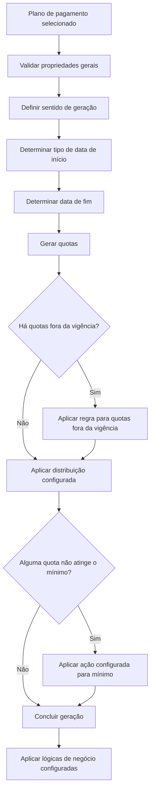
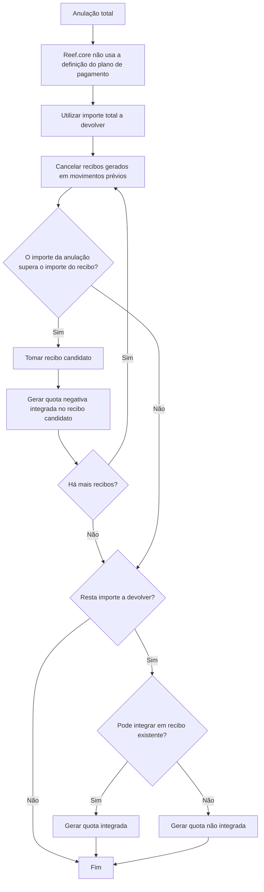

# Definição de Plano de Pagamento no Reef.core

## 1. Metadados do Documento
- **Arquivo de Origem:** Não identificado no conteúdo fornecido
- **Tipo de Documento:** Especificação Técnica / Documentação Funcional
- **Domínio / Sistema:** Reef.core / Planos de Pagamento / Apólices e Suplementos
- **Público-Alvo:** Desenvolvedores, Arquitetos, Analistas Funcionais, Operação e Negócio
- **Data/Versão Identificada:** Não identificada

---

## 2. Resumo Executivo & Contexto de Negócio

O documento define o comportamento geral de um **plano de pagamento** no contexto do Reef.core. O plano de pagamento estabelece os critérios que orientam a geração, a distribuição, a redução, a anulação e a reabilitação de quotas/recibos associados a apólices e suplementos.

A configuração do plano de pagamento reúne propriedades gerais, propriedades que afetam a geração de quotas e propriedades que contêm lógica de negócio. Entre os elementos configuráveis estão identificação, aplicabilidade em aplicações, pagamento único, número máximo de quotas, situação de inabilitação, sentido de geração, datas de início e fim, comportamento de valores abaixo do mínimo e tratamento de quotas fora da vigência da apólice.

O documento também descreve regras específicas para operações de anulação parcial e total, incluindo a geração de quotas por diferença, a possibilidade de integrar valores em recibos existentes e a distribuição proporcional sobre recibos já gerados. Para reabilitações, o sistema pode utilizar os recibos pendentes ou aplicar a definição do plano de pagamento.

As lógicas de negócio permitem alterar a data de partida, a data de fim, a distribuição de importes, os valores de quotas, as comissões e os juros por fracionamento. O documento ressalta que certas decisões de cálculo não retornam diretamente uma data ou valor: algumas lógicas retornam a opção de configuração que deve ser aplicada pelo plano de pagamento.

---

## 3. Arquitetura, Componentes & Tecnologias Envolvidas

### Componentes e conceitos identificados

| Componente / Conceito | Papel descrito no documento |
| :--- | :--- |
| Reef.core | Sistema que aplica a definição do plano de pagamento e trata regras específicas, incluindo anulações totais. |
| Plano de pagamento | Definição que determina critérios para geração e distribuição de quotas. |
| Apólice | Entidade cuja vigência, efeito, vencimento e recibos são utilizados pelas regras do plano de pagamento. |
| Suplemento | Movimento que pode possuir data de efeito, anulação, devolução e influência na geração de quotas. |
| Quota | Parcela gerada pelo plano de pagamento; pode conter importes, conceitos económicos, juros e comissões. |
| Recibo | Registro utilizado para cobrança, devolução, cancelamento ou integração de quotas. |
| Lógica de negócio | Configuração responsável por determinar opções de datas, distribuição de quotas, juros e outros comportamentos dinâmicos. |
| Movimento | Operação cuja totalidade pode ser distribuída entre quotas; o documento usa o conceito no cálculo da primeira quota. |
| Aplicação | Contexto adicional no qual um plano de pagamento pode ser aplicável, além de apólices. |
| Reabilitação | Operação que pode utilizar recibos em situação “emitido pendiente” ou a definição do plano de pagamento. |

### Fluxo funcional de geração de quotas



### Fluxo de anulação total descrito



> **Nota de Análise:** O documento descreve o Reef.core e seus comportamentos funcionais, mas não especifica tecnologias de implementação, contratos de API, métodos HTTP, bases de dados, URLs, portas, ambientes técnicos ou mecanismos de persistência.

---

## 4. Regras de Negócio, Especificações Funcionais & Processos

### 4.1. Propriedades gerais do plano de pagamento

Um plano de pagamento é identificado por uma chave e possui nome, abreviatura, aplicabilidade, condição de pagamento único, número de quotas e estado de inabilitação.

- **Plano de pagamento:** chave pela qual o plano é identificado.
- **Nome:** descrição atribuída para identificar o plano.
- **Abreviatura:** nome curto do plano.
- **Válido em Aplicações:** indica que o plano pode ser aplicado em aplicações além de apólices.
- **Pagamento único:** informa se o plano é único. O atributo diferencia pagamento único de pagamento anual, embora ambos sejam planos de uma única quota. O uso é referido para ramos com tratamento de vida.
- **Número de quotas:** quantidade máxima de quotas que serão geradas ao selecionar o plano. Dependendo das datas de emissão ou suplemento, uma ou mais quotas podem ultrapassar o período de vigência da apólice, reduzindo o número de quotas.
- **Inabilitado:** determina se o plano permanece ativo para novas apólices. Quando inabilitado, o plano não pode ser selecionado em uma nova apólice. As apólices que já utilizam o plano continuam aplicando-o até que um suplemento altere essa configuração; nesse momento, o plano inabilitado não pode ser selecionado.

### 4.2. Distribuição proporcional

A propriedade **Distribuição proporcional** determina que a distribuição dos importes do plano de pagamento não é realizada conforme a definição original, mas proporcionalmente à vigência de cada quota.

### 4.3. Sentido de geração de quotas

As quotas podem ser geradas em duas orientações:

1. **Do início ao fim da vigência**
   - A data de partida é o início da vigência, identificado no exemplo como “A”.
   - A data de chegada é o fim da vigência, identificado no exemplo como “B”.

2. **Do fim ao início da vigência**
   - A data de partida é o fim da vigência, identificado no exemplo como “B”.
   - A data de chegada é o início da vigência, identificado no exemplo como “A”.

### 4.4. Data de início da geração de quotas

Após definir o sentido de geração, o plano deve definir uma data concreta de partida. As opções disponíveis são:

1. Data de vencimento.
2. Data de efeito da apólice ou suplemento.
3. Data do dia.
4. Data maior entre o efeito da apólice/suplemento e o dia.
5. Lógica de negócio.

#### Data de vencimento

A data de partida corresponde ao vencimento da apólice. Essa opção é exclusiva da orientação **do fim ao início**.

#### Data de efeito da apólice ou suplemento

A data de partida corresponde ao efeito da apólice ou do suplemento:

- Em uma nova emissão, utiliza-se o efeito da apólice.
- Em um suplemento, utiliza-se o efeito do suplemento.

Essa opção é exclusiva da orientação **do início ao fim**.

#### Data do dia

A data de partida é a data registrada pelo equipamento. Essa opção costuma ser utilizada em emissões realizadas com atraso ou adiantamento, tomando como partida o dia em que o movimento é executado.

Essa opção é exclusiva da orientação **do início ao fim**.

#### Data maior entre efeito da apólice/suplemento e o dia

A data de partida é a maior data entre o efeito/vencimento da apólice e a data do dia.

Essa opção é exclusiva da orientação **do início ao fim**.

#### Lógica de negócio para data de início

A lógica de negócio não retorna uma data. A lógica de negócio retorna qual das opções anteriores deve ser aplicada:

- Data de vencimento.
- Data de efeito da apólice ou suplemento.
- Data do dia.
- Data maior entre efeito da apólice/suplemento e o dia.

O objetivo é tornar dinâmica a seleção da data de partida conforme as circunstâncias da apólice ou do suplemento.

Quando o tipo da data de início for determinado por lógica, deve ser informado o nome da lógica de negócio correspondente.

### 4.5. Data de fim da geração de quotas

A data de fim determina quando a geração de quotas será encerrada. As opções são:

1. Data de vencimento.
2. Data de efeito.
3. Lógica de negócio.

#### Data de vencimento

A data de fim corresponde ao vencimento do suplemento. Essa opção é exclusiva da orientação **do início ao fim**.

#### Data de efeito

A data de fim corresponde à data de efeito do suplemento. Essa opção é exclusiva da orientação **do fim ao início**.

#### Lógica de negócio para data de fim

A lógica de negócio não retorna uma data. A lógica retorna qual opção deve ser utilizada:

- Data de vencimento.
- Data de efeito.

A finalidade é tornar dinâmica a escolha da data de fim conforme as circunstâncias da apólice ou suplemento.

Quando o tipo da data de fim for determinado por lógica, deve ser informado o nome da lógica de negócio correspondente.

### 4.6. Quotas fora do período de vigência

Quando o plano de pagamento gera quotas e alguma quota fica fora do período de vigência, existem quatro comportamentos possíveis:

1. **Proporcional**
   - Os importes das quotas fora da vigência são distribuídos proporcionalmente entre as quotas que permanecem dentro da vigência.

2. **Primeira quota**
   - Os importes das quotas fora da vigência passam diretamente para a primeira quota.

3. **Gerar uma quota**
   - Gera uma única quota para o período de vigência da apólice.
   - O plano passa a operar com uma única quota.

4. **Ultrapassar período de vigência da apólice**
   - A distribuição é respeitada.
   - As quotas permanecem fora do período de vigência da apólice.

Uma lógica de negócio pode determinar dinamicamente qual dessas opções será utilizada para quotas fora do período de vigência.

### 4.7. Ações quando o importe não atinge o mínimo

Quando o importe de um ou mais recibos não atinge o mínimo declarado, o plano pode aplicar uma das seguintes ações:

1. **Sem quota mínima**
   - Nenhuma ação é tomada.
   - Recibos com importe inferior ao mínimo são criados mesmo assim.

2. **Reduzir o número de quotas**
   - O número inicial de recibos é reduzido em um.
   - A redução é repetida enquanto existir algum recibo abaixo do mínimo.
   - O processo pode continuar até restar um único recibo.
   - Se o único recibo restante não atingir o mínimo, é retornado um erro.

3. **Gerar uma quota**
   - Se algum recibo não atingir o mínimo, é gerado um único recibo.
   - Por exemplo, se quatro recibos foram gerados e um não atingir o mínimo, passam a existir um único recibo.
   - Se o recibo único não atingir o mínimo, é retornado um erro.

4. **Devolver erro**
   - Se algum recibo não atingir o mínimo, o sistema retorna erro.

5. **Reduzir o número de quotas / gerar uma quota**
   - O comportamento é igual a “Reduzir o número de quotas”.
   - A diferença é que, se a redução chegar a um recibo e esse recibo não atingir o mínimo, não é retornado erro.

### 4.8. Tratamento de decimais

Quando a propriedade **Todos os decimais passam à última quota** está ativada:

- Todas as quotas, exceto a última, não possuem decimais.
- As quotas anteriores à última são truncadas para zero casas decimais.
- A última quota recebe os decimais não distribuídos entre as quotas anteriores.

### 4.9. Comportamento em anulações parciais

Quando um suplemento gera uma devolução ao cliente, o plano de pagamento pode seguir uma das três opções:

1. **Plano de pagamento**
   - A devolução segue a definição do plano de pagamento.
   - São geradas tantas quotas quanto definido no plano.
   - Os importes das quotas correspondem à definição de quotas do plano.

2. **Anulação total**
   - O comportamento é equivalente à anulação de uma apólice.
   - O objetivo é cancelar recibos existentes com o montante resultante da anulação parcial.
   - Enquanto existir montante do suplemento, recibos pendentes são cancelados.
   - Quando o montante do suplemento não for suficiente para cancelar um recibo, é gerada uma quota com o importe restante.

3. **Proporcional sobre os recibos já gerados**
   - O importe a devolver calculado no suplemento é dividido entre as quotas já geradas.

### 4.10. Quota por diferença em uma anulação total

Em uma anulação total, o Reef.core não utiliza a definição do plano de pagamento. O Reef.core utiliza o importe total a devolver para anular recibos criados em movimentos anteriores.

A finalidade é gerar quotas que, integradas aos recibos existentes, resultem em soma igual a zero. Caso permaneça um importe a devolver e não existam recibos onde esse valor possa ser integrado, o Reef.core gera um recibo com o importe não distribuído. O efeito e o vencimento desse recibo correspondem ao dia de efeito da anulação.

O atributo permite dois valores:

1. **Quota por diferença NÃO integrada em recibo existente**
   - O importe restante é levado para um recibo novo.

2. **Quota por diferença integrada em recibo existente**
   - O importe restante é levado para um recibo existente.
   - O efeito do recibo existente pode não coincidir com o efeito da anulação.
   - O recibo existente deve possuir importe superior ao valor restante da anulação.

### 4.11. Geração do plano de pagamento em reabilitações

A geração em reabilitações possui duas opções:

1. **Reabilitação**
   - Utiliza todos os recibos com situação “emitido pendiente” para realizar a reabilitação.
   - Não utiliza a definição do plano de pagamento.
   - O comportamento é comparado ao suplemento de anulação de apólice, que também não utiliza a definição do plano.

2. **Plano de pagamento**
   - A reabilitação utiliza a definição do plano de pagamento para criar recibos.

### 4.12. Nova data em anulação de suplemento

O parâmetro determina, em uma anulação de suplemento, se devem ser utilizadas:

- As datas utilizadas na criação do suplemento que está sendo anulado; ou
- As datas atuais.

O parâmetro é relevante quando a data de partida é a data do dia, pois a anulação do suplemento pode ocorrer em data diferente da criação original.

### 4.13. Lógica de negócio que altera a distribuição de importes de uma quota

Essa lógica permite alterar os importes calculados conforme a definição do plano de pagamento.

A lógica pode alterar os importes de cada conceito económico que compõe cada quota. No caso de pagamento fracionado, a lógica pode alterar todas as quotas, exceto a primeira.

A primeira quota contém a diferença entre o total do movimento e a soma de todas as quotas posteriores:

```text
quota_1 = importe_del_movimiento - (quota_2 + ... + quota_n)
```

O documento indica como exemplo o processo de emissão em que se solicita o importe ou o percentual da primeira quota. A lógica permite determinar o importe da primeira quota nesse cenário.

### 4.14. Lógica que altera a distribuição das quotas

Essa lógica permite alterar a distribuição definida no plano de pagamento, modificando:

- Percentuais de importes.
- Percentuais de comissões.

A lógica é semelhante àquela que altera uma quota, mas altera a definição configurada, e não uma quota previamente gerada.

### 4.15. Lógica de negócio que calcula juros por fracionamento

Quando declarada, essa lógica calcula o importe aplicável como juros, também chamados de recargo por fraccionamiento. A lógica deve calcular:

- O importe dos juros.
- O importe do imposto correspondente, quando aplicável.

O cálculo de juros por fracionamento permite que o importe não esteja associado ao risco, mas ao recibo. Assim, uma alteração no fracionamento de pagamento da apólice pode ser feita sem gerar suplemento.

O documento informa que, antes dos planos de pagamento, a mudança no fracionamento de pagamento da apólice representava um suplemento impossível de anular. Sem a geração de suplemento, essa restrição deixa de ser aplicada.

Para países em que a autoridade exige que uma alteração de fracionamento seja um suplemento, o Reef.core gera um suplemento nominativo (**SM**), que pode ser anulado.

### 4.16. Lógica de negócio para juros por fracionamento em anulação de apólice/aplicação

Essa lógica é executada quando ocorre uma anulação total (**AT**) da apólice. A lógica determina qual parte dos juros gerados será devolvida, ou não será devolvida.

---

## 5. Tabelas de Parâmetros, Ambientes e Estruturas de Dados

### 5.1. Propriedades gerais

| Item / Parâmetro | Descrição / Função | Tipo / Valores / Formato | Ambiente / Observações |
| :--- | :--- | :--- | :--- |
| Plano de pagamento | Chave que identifica o plano de pagamento. | Chave de identificação | Não detalhado |
| Nome | Descrição usada para identificar o plano. | Texto | Não detalhado |
| Abreviatura | Nome curto do plano. | Texto | Não detalhado |
| Válido em Aplicações | Define se o plano pode ser aplicado em aplicações além de apólices. | Indicador | Aplicações e apólices |
| Pagamento único | Diferencia plano único de plano anual, ainda que ambos tenham uma quota. | Indicador | Usado em ramos com tratamento de vida |
| Número de quotas | Número máximo de quotas a gerar. | Número | Pode ser reduzido se quotas ultrapassarem a vigência |
| Inabilitado | Define se o plano pode ser selecionado para novas apólices. | Indicador | Apólices existentes mantêm o plano até alteração por suplemento |

### 5.2. Sentido de geração e compatibilidade com data de início

| Opção de data de início | Início ao fim | Fim ao início | Descrição |
| :--- | :---: | :---: | :--- |
| Data de vencimento | Não | Sim | Data de partida é o vencimento da apólice. |
| Data de efeito da apólice ou suplemento | Sim | Não | Nova emissão usa efeito da apólice; suplemento usa efeito do suplemento. |
| Data do dia | Sim | Não | Utiliza a data registrada pelo equipamento no movimento. |
| Data maior entre efeito da apólice/suplemento e o dia | Sim | Não | Utiliza a maior data entre efeito/vencimento e a data do dia. |
| Lógica de negócio | Sim | Sim | Retorna qual opção de data deve ser aplicada. |

### 5.3. Compatibilidade com data de fim

| Opção de data de fim | Início ao fim | Fim ao início | Descrição |
| :--- | :---: | :---: | :--- |
| Data de vencimento | Sim | Não | Corresponde ao vencimento do suplemento. |
| Data de efeito | Não | Sim | Corresponde à data de efeito do suplemento. |
| Lógica de negócio | Sim | Sim | Retorna qual opção de data deve ser aplicada. |

### 5.4. Regras para quotas fora da vigência

| Opção | Descrição / Função | Resultado |
| :--- | :--- | :--- |
| Proporcional | Distribui o importe de quotas fora da vigência entre quotas dentro da vigência. | Redistribuição proporcional. |
| Primeira quota | Transfere o importe de quotas fora da vigência para a primeira quota. | A primeira quota absorve o valor. |
| Gerar uma quota | Gera apenas uma quota para o período de vigência da apólice. | Plano passa a uma quota. |
| Ultrapassar período de vigência da apólice | Mantém a distribuição mesmo com quotas fora da vigência. | Quotas permanecem fora da vigência. |
| Lógica de negócio | Determina dinamicamente uma das opções anteriores. | Comportamento variável por lógica. |

### 5.5. Ações para importe abaixo do mínimo

| Opção | Descrição / Função | Resultado quando persiste importe abaixo do mínimo |
| :--- | :--- | :--- |
| Sem quota mínima | Não toma ação. | Recibos são criados abaixo do mínimo. |
| Reduzir o número de quotas | Reduz recibos até que todos atendam ao mínimo ou reste um recibo. | Retorna erro se o único recibo não atingir o mínimo. |
| Gerar uma quota | Substitui múltiplos recibos por um único recibo. | Retorna erro se o recibo único não atingir o mínimo. |
| Devolver erro | Interrompe o processo diante de qualquer recibo abaixo do mínimo. | Retorna erro. |
| Reduzir o número de quotas / gerar uma quota | Reduz quotas como na opção de redução. | Não retorna erro se restar um único recibo abaixo do mínimo. |

### 5.6. Tratamento de anulações parciais

| Opção | Descrição / Função | Resultado |
| :--- | :--- | :--- |
| Plano de pagamento | Aplica a definição do plano à devolução. | Gera quotas conforme quantidade e importes do plano. |
| Anulação total | Cancela recibos existentes com o montante da anulação parcial. | Gera quota com o valor restante quando necessário. |
| Proporcional sobre os recibos já gerados | Divide o importe a devolver entre quotas geradas. | Distribuição proporcional sobre quotas existentes. |

### 5.7. Quota por diferença em anulação total

| Opção | Descrição / Função | Resultado |
| :--- | :--- | :--- |
| Quota por diferença NÃO integrada em recibo existente | Não utiliza recibo existente para absorver o importe restante. | Cria recibo novo. |
| Quota por diferença integrada em recibo existente | Integra o importe restante em recibo existente candidato. | Utiliza recibo com importe superior ao restante da anulação. |

### 5.8. Reabilitações

| Opção | Descrição / Função | Resultado |
| :--- | :--- | :--- |
| Reabilitação | Usa recibos com situação “emitido pendiente”. | Não utiliza definição do plano de pagamento. |
| Plano de pagamento | Utiliza a configuração do plano para criar recibos. | Aplica definição do plano de pagamento. |

### 5.9. Lógicas de negócio

| Lógica de negócio | Descrição / Função | Resultado / Observações |
| :--- | :--- | :--- |
| Lógica que determina tipo de data de início | Seleciona qual opção de data de início deve ser aplicada. | Não retorna uma data diretamente. |
| Lógica que determina tipo de data de fim | Seleciona data de vencimento ou data de efeito. | Não retorna uma data diretamente. |
| Lógica para quotas fora da vigência | Seleciona a regra para quotas fora do período de vigência. | Retorna uma das opções configuráveis. |
| Lógica que altera a distribuição de importes de uma quota | Altera importes de conceitos económicos em quotas. | Pode alterar todas as quotas exceto a primeira em pagamento fracionado. |
| Lógica que altera a distribuição das quotas | Modifica percentuais de importes e/ou comissões da definição. | Altera a definição, não quota previamente gerada. |
| Lógica que calcula juros por fracionamento | Calcula juros e imposto aplicável. | Associa juros ao recibo, não ao risco. |
| Lógica para juros em AT | Determina quanto dos juros gerados será devolvido em anulação total. | Executada em anulação total da apólice. |

---

## 6. Bateria de Perguntas & Respostas para RAG (FAQ Sintético)

### P1: O que define um plano de pagamento no Reef.core?
**R:** Um plano de pagamento define os critérios para geração, distribuição, redução, anulação e reabilitação de quotas e recibos relacionados a apólices e suplementos. O plano possui propriedades gerais, regras de geração de quotas e lógicas de negócio.

### P2: O que acontece quando um plano de pagamento é inabilitado?
**R:** Um plano inabilitado não pode ser incluído em uma nova apólice. No entanto, apólices que já utilizam o plano continuam aplicando-o até que um suplemento altere o plano. Quando ocorre essa alteração, o plano inabilitado não pode ser selecionado.

### P3: Qual é a diferença entre pagamento único e pagamento anual?
**R:** Ambos são planos de pagamento com uma única quota. O atributo “Pagamento único” existe para diferenciar o pagamento único do pagamento anual e é utilizado em ramos com tratamento de vida.

### P4: Quais datas podem ser usadas como data de início para geração de quotas?
**R:** As opções são data de vencimento, data de efeito da apólice ou suplemento, data do dia, data maior entre efeito da apólice/suplemento e o dia, e lógica de negócio. A disponibilidade depende do sentido de geração de quotas.

### P5: Quando a data de vencimento pode ser usada como data de início?
**R:** A data de vencimento pode ser usada como data de início exclusivamente quando as quotas são geradas no sentido do fim para o início da vigência.

### P6: O que significa a lógica de negócio para data de início?
**R:** A lógica de negócio para data de início não retorna uma data. A lógica determina qual opção configurada deve ser utilizada, como data de vencimento, data de efeito, data do dia ou a maior data entre efeito e dia.

### P7: Como o plano trata quotas que ficam fora da vigência da apólice?
**R:** O plano pode redistribuir o importe proporcionalmente entre quotas dentro da vigência, transferir o importe para a primeira quota, gerar uma única quota para a vigência ou manter as quotas fora da vigência. Uma lógica de negócio também pode selecionar dinamicamente uma dessas opções.

### P8: O que ocorre se um recibo não atingir o importe mínimo?
**R:** O comportamento depende da configuração: o sistema pode aceitar o recibo abaixo do mínimo, reduzir o número de quotas, gerar uma única quota, retornar erro ou reduzir até uma quota sem retornar erro caso ela permaneça abaixo do mínimo.

### P9: Como os decimais podem ser distribuídos nas quotas?
**R:** Se a propriedade “Todos os decimais passam à última quota” estiver ativada, todas as quotas anteriores à última são truncadas para zero casas decimais, e a última quota recebe os decimais não distribuídos.

### P10: Como funciona a anulação parcial com a opção “Anulação total”?
**R:** O sistema atua como em uma anulação de apólice: utiliza o montante resultante da anulação parcial para cancelar recibos pendentes existentes. Se o montante não for suficiente para cancelar um recibo, uma quota é gerada com o importe restante.

### P11: O Reef.core usa o plano de pagamento em uma anulação total?
**R:** Não. Em uma anulação total, o Reef.core não utiliza a definição do plano de pagamento. O sistema utiliza o importe total a devolver para anular recibos criados em movimentos anteriores e gerar quotas que, integradas aos recibos existentes, somem zero.

### P12: O que é uma quota por diferença integrada em recibo existente?
**R:** É a opção em que o importe restante de uma anulação é levado para um recibo existente candidato. O recibo pode ter efeito diferente da data de anulação, desde que possua importe superior ao valor que resta devolver.

### P13: Como uma reabilitação pode gerar recibos?
**R:** A reabilitação pode usar todos os recibos com situação “emitido pendiente”, sem utilizar a definição do plano de pagamento, ou pode aplicar diretamente a definição do plano de pagamento para criar recibos.

### P14: Qual é o efeito da lógica de juros por fracionamento?
**R:** A lógica calcula o importe de juros por fracionamento e o imposto correspondente, se aplicável. Esse modelo associa o importe ao recibo, e não ao risco, permitindo alterar o fracionamento sem necessariamente gerar um suplemento.

### P15: Como é calculada a primeira quota quando uma lógica altera a distribuição dos importes?
**R:** Em pagamento fracionado, a lógica pode alterar todas as quotas exceto a primeira. A primeira quota corresponde à diferença entre o importe total do movimento e a soma das quotas da segunda até a última: `quota_1 = importe_del_movimiento - (quota_2 + ... + quota_n)`.

---

## 7. Glossário de Termos, Siglas & Conceitos-Chave

- **AT:** Anulación total; operação de anulação total da apólice.
- **SM:** Suplemento nominativo que, conforme o documento, pode ser anulado.
- **Apólice:** Entidade cujo período de vigência, data de efeito, vencimento e recibos participam das regras do plano de pagamento.
- **Efeito:** Data de efeito da apólice ou suplemento.
- **Importe:** Valor monetário de quota, recibo, devolução, juros ou movimento.
- **Lógica de negócio:** Lógica configurável que determina dinamicamente opções ou altera cálculos e distribuições.
- **Pagamento fracionado:** Situação em que o valor do movimento é distribuído entre múltiplas quotas.
- **Plano de pagamento:** Configuração que estabelece critérios para gerar e tratar quotas.
- **Quota:** Parcela gerada no âmbito do plano de pagamento.
- **Recargo por fraccionamiento:** Juros por fracionamento.
- **Recibo:** Registro utilizado para cobrança, cancelamento, integração de valores ou devolução.
- **Reabilitação:** Operação que pode reutilizar recibos pendentes ou gerar recibos pelo plano de pagamento.
- **Suplemento:** Movimento associado à apólice que pode influenciar datas, devoluções e geração de quotas.
- **Vencimento:** Data de término utilizada nas regras de geração de quotas e no período de vigência.

---

## 8. Notas Críticas, Riscos & Limitações

- O documento não identifica versão, data, autor técnico, repositório, URL, ambiente, porta, API, contrato JSON, tecnologia de implementação ou persistência do Reef.core.
- O documento menciona exemplos e figuras para diversas regras, mas o texto extraído não contém os conteúdos visuais dos exemplos.
- A regra “Data maior entre efeito da apólice/suplemento e o dia” descreve a comparação como “efeito/vencimento” em um trecho; a terminologia é reproduzida conforme o conteúdo fornecido, sem inferir qual data deve prevalecer em cada cenário.
- A descrição da lógica de negócio para a data de fim diz que retorna “qual das datas de início anteriores” será aplicada, mas lista as opções de data de vencimento e data de efeito. O relatório preserva o sentido funcional apresentado sem corrigir ou inferir a redação original.
- Não são detalhados os critérios de seleção de recibos candidatos para integração além de a existência de importe maior que o valor restante.
- Não são especificados os algoritmos de cálculo de juros, imposto, percentuais, comissões, mínimo declarado ou distribuição proporcional.
- Não são definidos os contratos, parâmetros de entrada, saídas, erros técnicos ou pontos de integração das lógicas de negócio.
- O documento afirma que determinados países podem exigir suplemento para alteração de fracionamento, mas não identifica quais países, autoridades ou regras regulatórias.

---

## 9. Conteúdo Bruto Estruturado (Referência Fiel)

```text
--- [PÁGINA 1 DE 8] ---

DEFINICIÓN de plan de pago
Objetivo
Denir el comportamiento general del plan de pago. Es decir, se establecen criterios que determinarán la pauta a seguir.
Propiedades generales
Propiedades que afectan al modo en el que se generan las cuotas
Propiedades que que contienen lógica de negocio
Propiedades generales
Plan de pago
Clave por la que se identica el plan de pago.
Nombre
Especica la descripción que se asigna con el n de identicarlo.
Abreviatura
Nombre corto.
Válido en Aplicaciones
Indica que el plan de pago es aplicable en aplicaciones además de en pólizas.
Pago único
Especica si el plan de pago es ÚNICO. Este atributo atributo existe para diferenciar del pago ANUAL, ya que ambos son planes de pago de
una sola cuota. Se utiliza en ramos con tratamiento de vida.
Número de cuotas
Número máximo de cuotas que se generarán al seleccionar el plan de pago. Es importante destacar que dependiendo de las fechas de la
emisión o suplemento puede ser que una o varias cuotas superen el periodo de vigencia de la póliza. En este caso, es posible que el número
de cuotas se reduzcan.
Inhabilitado
Ejemplo:
Documentation / DOCUMENTACIÓN Reef
DOCUMENTACIÓN Reef
Mapfredocument
DOCUMENTACIÓN Reef
Owner
user:agonzalez_mapfre.com
Lifecycle
Approved Source
 / 
 VL
Buscar Inicio Soluciones Arquitecturas APIs Componentes Cloud Documentación Zeus Reef Ayuda
ES


--- [PÁGINA 2 DE 8] ---

En este punto se determina si está activo o por el contrario ya no puede ser incluido en una nueva póliza. Es importante destacar que, aunque
inhabilite, todas las pólizas que dispongan de ello, seguirá aplicándose hasta que mediante un suplemento se cambie. En ese momento, al
estar inhabilitado ya no será posible seleccionarlo.
Propiedades que afectan al modo de generación de cuotas
Distribución proporcional
Determina que la distribución de importes del plan de pago no se realiza acorde a la denición, se realiza de forma proporcional atendiendo a
la vigencia de cada cuota.
Sentido en la generación de cuotas
Se puede determinar la orientación a la hora de crear las cuotas de un plan de pago. Es decir, las cuotas pueden generarse en sentido:
Desde el inicio hacia el n de vigencia
Desde el n hacia el inicio de vigencia
Es decir, tomando la póliza con vigencia:
Si se elige la primera opción (de inicio a n), la fecha de partida es "A" y la fecha de llegada es "B", tal y como se muestra en la siguiente gura:
En cambio, si se elige la segunda opción (de n a inicio), la fecha de partida es "B" y la fecha de llegada es "A"", tal y como se muestra en la
siguiente gura:
Fecha de inicio
Una vez que se ha elegido el sentido en el que se crean las cuotas en el plan de pago, se debe elegir cual será la fecha concreta de partida.
Existen las siguientes opciones:
1. Fecha de vencimiento
2. Fecha de efecto de la póliza o suplemento
3. Fecha del día
4. Fecha mayor entre efecto de la póliza/suplemento y el día
5. Lógica de negocio
1. Fecha de vencimiento
La fecha de partida es el vencimiento de la póliza. Esta opción es exclusiva en la orientación de n a inicio.
2. Fecha de efecto de la póliza o suplemento
Corresponde con el efecto de la póliza o el suplemento, dependiendo de si es una nueva emisión (toma efecto de póliza), o un
suplemento (toma efecto de suplemento). Esta opción es exclusiva en la orientación de inicio a n.
Ejemplo:
Ejemplo:


--- [PÁGINA 3 DE 8] ---

3. Fecha del día
Es la fecha que tenga el equipo registrada. Esta opción suele utilizarse para, en caso de emisiones con retraso o adelanto, tomaría como
partida el día en el que se realiza el movimiento.
Esta opción es exclusiva en la orientación de inicio a n.
1. Fecha mayor entre efecto de la póliza/suplemento y el día
Toma como fecha de partida aquella que sea la mayor comparando el efecto/vencimiento de la póliza con la fecha del día.
Esta opción es exclusiva en la orientación de inicio a n.
1. Lógica de negocio
Corresponde con una lógica de negocio cuyo cometido es devolver cual de las fechas de partida anteriores es la elegida. Es decir, la
lógica no devuelve una fecha, devuelve cual de las opciones anteriores se aplica (fecha de vencimiento, fecha de efecto de la póliza o
suplemento o fecha del día, fecha mayor entre efecto de la póliza/suplemento y el día). Su uso es para que la fecha de partida sea
dinámica dependiendo de las circunstancias de la póliza o suplemento que se está realizando.
Como resumen:
OPCIÓN INICIO A FIN FIN A INICIO
Fecha de vencimiento NO SI
Fecha de efecto de la póliza o suplemento SI NO
Fecha del día SI NO
Fecha mayor entre efecto de la póliza/suplemento y el día SI NO
Lógica de negocio SI SI
Nombre de la lógica de negocio que determina el tipo de fecha inicio
Cuando se ha elegido que el tipo de la fecha de inicio se determinará por una lógica, en este punto se ha de incluir el nombre de la lógica de
negocio.
Fecha de n
Ahora es el momento de determinar cual será la fecha en la que nalizará la generación de cuotas. Existen las siguientes opciones:
1. Fecha de vencimiento
2. Fecha de efecto
3. Lógica de negocio
1. Fecha de vencimiento
Es la fecha de vencimiento del suplemento. Esta opción es exclusiva en la orientación de inicio a n.
2. Fecha de efecto
Es la fecha de efecto del suplemento. Esta opción es exclusiva de la orientación de n a inicio.
Ejemplo:
Ejemplo:


--- [PÁGINA 4 DE 8] ---

3. Lógica de negocio
Corresponde con una lógica de negocio cuyo cometido es devolver cual de las fechas de inicio anteriores es la elegida. Es decir, la lógica
no devuelve una fecha, devuelve cual de las opciones anteriores se aplica (fecha de de vencimiento o fecha de efecto). Su uso es para
que la fecha de inicio pueda ser dinámica dependiendo de las circunstancias de la póliza o suplemento que se está realizando.
Como resumen:
OPCIÓN INICIO A FIN FIN A INICIO
Fecha de vencimiento SI NO
Fecha de efecto NO SI
Lógica de negocio SI SI
Nombre de la lógica de negocio que determina el tipo de fecha n
Cuando se ha elegido que el tipo de la fecha de n se determinará por una lógica, en este punto se ha de incluir el nombre de la lógica de
negocio.
Cuotas fuera del periodo de vigencia
En este punto se debe decidir que hacer si el plan de pago genera cuotas y alguna se encuentra fuera del periodo de vigencia.
Las posibilidades que existen son:
1. Proporcional
2. Primera cuota
3. Generar una cuota
4. Sobrepasar periodo de vigencia de póliza
1. Proporcional
El importe de las cuotas que quedaron fuera del periodo de vigencia se reparten de forma proporcional entre las cuotas que si entraron.
1. Primera cuota
El importe de las cuotas que quedaron fuera del periodo de vigencia pasan directamente a la primera cuota.
1. Generar una cuota
En este caso, se genera una única cuota por el periodo de vigencia de la póliza. Es decir, se pasa a una única cuota.
1. Sobrepasar periodo de vigencia de póliza
Hace que se respete la distribución y, aunque haya cuotas fuera del periodo de vigencia de la póliza, quedan fuera del periodo de
vigencia.
Ejemplo:
Ejemplo:
Ejemplo:
Ejemplo:


--- [PÁGINA 5 DE 8] ---

Nombre de la lógica de negocio que determina como se distribuyen las cuotas fuera del periodo de vigencia
Corresponde con una lógica de negocio cuyo cometido es devolver cual es la opción de las anteriores se utilizará con el n de determinar el
comportamiento de aquellas cuotas que no entran en el periodo de vigencia.
Acciones cuando el importe no llega al mínimo
En este punto se determina el comportamiento cuando el importe de uno o varios recibos no llegan al mínimo declarado. Ante esta situación
se dispone de las siguientes opciones:
1. Sin cuota minima
2. Reducir el número de cuotas
3. Generar una cuota
4. Devolver error
5. Reducir el número de cuotas / generar una cuota
1. Sin cuota mínima
Es decir, no se toma acción alguna. Si hay uno o varios recibos cuyo importe no llega al mínimo declarado, se crean sin llegar al importe
mínimo.
2. Reducir el número de cuotas
En caso de no llegar al importe mínimo, al número de recibos originalmente creados, se reduce en uno. Si algún recibo sigue sin llegar al
mínimo, se vuelve a reducir el número de recibos. Este proceso se repite hasta llegar a un recibo. Si el único recibo que queda no llega al
mínimo, se devuelve error.
3. Generar una cuota
Si algún recibo no llega al mínimo, se genera una único recibo. Es decir, si se han generado 4 recibos y alguno no llega al importe mínimo,
la consecuencia es generar un único recibo. Es decir, se pasa de 4 a 1. Si el recibo generado no llega al mínimo, se devuelve error.
4. Devolver error
En caso de que algún recibo no llegue al mínimo, se devuelve un error.
5. Reducir el número de cuotas / generar una cuota
Esta opción es exactamente igual que "Reducir el número de cuotas", salvo que si la reducción llega a un recibo y este no llega al importe
mínimo, no se devuelve error.
Todos los decimales pasan a la última cuota
Esta propiedad (si está activada), hace que todas las cuotas NO dispongan de decimales, salvo la ultima. Es decir, todas las cuotas irán
truncadas a cero decimales y la última cuota será la que albergue esos decimales no distribuidos entre las cuotas previas.
Comportamiento en anulaciones parciales
En este apartado se determina como se comportará el plan de pago cuando se realice un suplemento y el resultado sea que hay que realizar
una devolución al cliente. Las opciones disponibles son:
1. Plan de pago
2. Anulación total
3. Proporcional sobre los recibos ya generados
1. Plan de pago
Ejemplo:
Ejemplo:


--- [PÁGINA 6 DE 8] ---

Esta opción signica que la devolución se realizará según la denición del plan de pago, por lo que generará tantas cuotas como indique
el plan de pago y los importes de estas cuotas corresponderán a lo denido en apartado de cuotas del plan de pago.
2. Anulación total
En este caso, el comportamiento será exactamente igual que si se anulara una póliza. Es decir, el objetivo es cancelar aquellos recibos
que ya existen con el monto resultante de la anulación parcial. Mientras exista monto del suplemento, se irán cancelando recibos
pendientes, cuando no exista ya monto suciente del suplemento para cancelar un recibo, se genera una cuota con el importe que queda.
1. Proporcional sobre los recibos ya generados
En este caso, el importe a devolver calculado en el suplemento se divide entre las cuotas generadas.
La cuota por diferencia en una anulación total se integra en un recibo existente o no
Como se ha comentado, cuando se trata de una anulación total, Reef.core no utiliza la denición del plan de pago. En vez de la denición,
toma el importe total a devolver y lo utiliza para anular recibos ya generados en movimientos previos. Es decir, la función principal es la de
generar cuotas para que integradas con los recibos que ya existen, la suma sea cero (0). Hay veces que queda importe a devolver, y ya no
quedan recibos en los que se pueda integrar ese importe. En este caso, Reef.core no tiene más remedio que generar un recibo con este
importe no distribuido cuyo efecto y vencimiento corresponde con el día de efecto de la anulación.
Este atributo determina que hacer si queda importe y hay un recibo candidato donde se podría integrar.
El proceso es el siguiente:
SI
NO
SI
NO SI
NO
SI
NO
¿El importe de
la anulación
supera al
importe del
recibo?
TOMAR un recibo
que pueda ser
candidato para
generar una cuota
que integrada en
él, el importe
sea cero
GENERAR una cuota
con el importe
del recibo en
negativo que
se integre
en el recibo
candidato ¿Hay más
recibos?
¿Queda
importe a
devolver? ¿Se puede
integrar
en un
recibo
existente?
GENERAR
cuota
integrada
GENERAR cuota
NO integrada
FIN
Este atributo permite los siguientes valores:
1. Cuota por diferencia NO integrada en recibo existente
2. Cuota por diferencia integrada en recibo existente
1. Cuota por diferencia NO integrada en recibo existente
En este caso, el importe que resta se lleva a un recibo nuevo.
2. Cuota por diferencia integrada en recibo existente
En este caso, el importe se lleva a un recibo que, aunque el efecto no coincida con el efecto de la anulación, pero por el contrario tiene un
importe mayor que lo que queda de la anulación.
Generación del plan de pago en rehabilitaciones
Este atributo especica como se generará el plan de pago. Existen las siguientes opciones:
1. Rehabilitación
2. Plan de pago
Ejemplo:
Ejemplo:
Ejemplo:


--- [PÁGINA 7 DE 8] ---

1. Rehabilitación
El comportamiento es tomar todos los recibos con situación "emitido pendiente" y utilizarlos para realizar la rehabilitación. Es decir, al
igual que un suplemento de anulación de póliza que no toma la denición del plan de pago, esta opción en la rehabilitación, tampoco
toma la denición del plan de pago.
2. Plan de pago
Esta opción determina que la rehabilitación tomará la denición del plan de pago a la hora de crear los recibos.
Nueva fecha en anulación de suplemento
Esta opción permite en el caso se realice una anulación de suplemento que se tomen las fechas utilizadas en el momento de la creación del
suplemento que se está ahora anulando, o por el contrario, toma las fechas actuales. Este parámetro cobra importancia cuando la fecha de
partida es la del día, ya que es muy probable que la anulación de suplemento se realice en otra fecha distinta.
Propiedades que que contienen lógica de negocio
Lógica de negocio que altera la distribución de importes de una cuota
Es posible alterar los importes que han sido hallados según la denición del plan de pago. Es decir, sería posible alterar los importes de cada
uno de los conceptos económicos que forman cada una de las cuotas. Esta lógica podría alterar, en el caso que exista pago fraccionado
todas las cuotas menos la primera. La primera cuota contiene la diferencia entre el total del movimiento menos la suma de todas las cuotas
excepto la primera. Es decir:
Esta lógica se utiliza por ejemplo, cuando en el proceso de emisión, se solicita el importe o el porcentaje de la primera cuota. Esto es, en el
proceso de emisión es posible determinar cual será el importe de la primera cuota. En este caso, esta lógica es la que permite esto.
Lógica que altera la distribución de las cuotas
Esta lógica permite alterar la distribución que se ha denido en el plan de pago de las cuotas, modicando el porcentaje de importes y/o de
comisiones. Es parecido a la lógica que altera una cuota, salvo que aquí se altera la denición realizada, no la cuota generada previamente.
Lógica de negocio que halla intereses por fraccionamiento
Esta lógica (si se declara), se encarga de hallar el importe que se aplicará en concepto de interés (también conocido como recargo por
fraccionamiento). Esta lógica debe hallar el interés y el importe correspondiente al impuesto si aplicase.
El cálculo de los intereses (recargo por fraccionamiento) en este punto, posibilita que este importe no esté asociado al riesgo, sino está
asociado al recibo. Por lo tanto, un cambio en el fraccionamiento de pago de la póliza se puede realizar sin necesidad de generar un
suplemento. Algo que hasta la aparición de los planes de pago no era posible. Al no generarse un suplemento, implica que ya no existe la
restricción de la imposibilidad de anular un cambio en el fraccionamiento de pago. Es decir, hasta la llegada de los planes de pago, un cambio
en el fraccionamiento de pago de la póliza suponía un suplemento y este suplemento era imposible de anular. En la actualidad, al no ser un
suplemento, esta restricción deja de aplicarse.
Para aquellos países que la autoridad exija que un cambio en el fraccionamiento de pago sea un suplemento, Reef.core generará un
suplemento pero este será nominativo (SM) y si podrá ser anulado.
Lógica de negocio que halla intereses por fraccionamiento en caso de anulación de póliza/aplicación
Esta lógica se lanza cuando se realiza la anulación total (AT) de la póliza. Esta lógica se encarga de determinar cuanto de los intereses
generados se devuelve (o no).
Ejemplo:
1
cuota_1 = importe_del_movimiento - (cuota_2 + ... + cuota_n)
Ejemplo:
Ejemplo:


--- [PÁGINA 8 DE 8] ---

Checking links...
```
