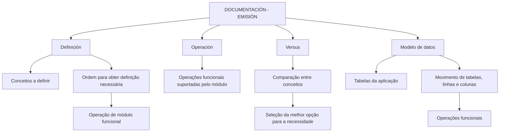

# Documentação Reef — Emissão, Operação, Versus e Modelo de Dados

## 1. Metadados do Documento
- **Arquivo de Origem:** Não identificado
- **Tipo de Documento:** Manual Operacional
- **Domínio / Sistema:** Reef
- **Público-Alvo:** Não identificado
- **Data/Versão Identificada:** Não identificada

---

## 2. Resumo Executivo & Contexto de Negócio

O documento apresenta a área **DOCUMENTACIÓN - EMISIÓN**, destinada à documentação da funcionalidade do sistema Reef. O conteúdo é organizado em quatro categorias: **Definición**, **Operación**, **Versus** e **Modelo de datos**.

A categoria **Definición** reúne documentos sobre os conceitos que devem ser definidos e a sequência necessária para obter a definição que permite operar um módulo funcional. A categoria **Operación** concentra documentos relacionados às operações funcionais suportadas pelo módulo.

A categoria **Versus** orienta usuários que possuem dúvidas entre diferentes conceitos e precisam identificar a alternativa mais adequada à sua necessidade. A categoria **Modelo de datos** é voltada às tabelas da aplicação e descreve o movimento de elementos como tabelas, linhas e colunas em função das operações funcionais.

O conteúdo também evidencia a navegação da documentação Reef dentro de um portal que contém áreas como Soluciones, Arquitecturas, APIs, Componentes, Cloud, Documentación, Zeus, Reef e Ayuda.

---

## 3. Arquitetura, Componentes & Tecnologias Envolvidas

O documento não descreve arquitetura de software, integrações, protocolos, tecnologias, microsserviços, bancos de dados, contratos de API ou ambientes técnicos. A estrutura identificável é exclusivamente organizacional, relacionada às categorias documentais do sistema Reef.



**Nota de Análise:** O documento cita Reef e Zeus como opções de navegação do portal, mas não detalha a função técnica, interfaces, integrações ou relação arquitetural entre esses elementos.

---

## 4. Regras de Negócio, Especificações Funcionais & Processos

### Estrutura de documentação da funcionalidade

1. A documentação relacionada à funcionalidade do sistema é dividida em quatro apartados:
   - Definición;
   - Operación;
   - Versus;
   - Modelo de datos.

2. Os documentos de **Definición** devem detalhar:
   - os conceitos que precisam ser definidos;
   - a ordem que deve ser seguida;
   - a definição necessária para que seja possível operar um módulo funcional.

3. Os documentos de **Operación** devem tratar das operações funcionais suportadas pelo módulo.

4. Os documentos de **Versus** devem auxiliar na comparação entre conceitos quando houver dúvida sobre qual alternativa atende melhor a uma necessidade.

5. Os documentos de **Modelo de datos** devem ser orientados às tabelas da aplicação e detalhar o movimento de:
   - tabelas;
   - linhas;
   - colunas;
   - elementos relacionados às operações funcionais.

**Nota de Análise:** O documento não apresenta regras de validação, fórmulas, condições de cálculo, fluxos transacionais, métodos HTTP, contratos JSON, permissões ou critérios de exceção.

---

## 5. Tabelas de Parâmetros, Ambientes e Estruturas de Dados

| Item / Parâmetro | Descrição / Função | Tipo / Valores / Formato | Ambiente / Observações |
| :--- | :--- | :--- | :--- |
| DOCUMENTACIÓN - EMISIÓN | Área documental relacionada à funcionalidade do sistema. | Seção documental | Associada à documentação Reef. |
| Definición | Documentos que descrevem conceitos a definir e a ordem para obter a definição necessária à operação de um módulo funcional. | Categoria documental | Não há detalhamento de documentos específicos. |
| Operación | Documentos relacionados às operações funcionais suportadas pelo módulo. | Categoria documental | Não há operações individualmente descritas. |
| Versus | Área para comparação entre conceitos e identificação da melhor opção para uma necessidade. | Categoria documental | Não há critérios comparativos detalhados. |
| Modelo de datos | Documentação orientada às tabelas da aplicação. | Categoria documental | Inclui descrição de movimentos de tabelas, linhas e colunas conforme operações funcionais. |
| Documentation / DOCUMENTACIÓN Reef | Identificação da documentação Reef no portal. | Texto de navegação | O documento apresenta a denominação em inglês e espanhol. |
| Owner | Proprietário exibido para o documento. | Metadado | `user:agonzalez_mapfre.com` |
| Lifecycle | Estado de ciclo de vida exibido. | Metadado | `Approved Source` |
| VL | Valor exibido junto ao ciclo de vida. | Sigla/valor não definido | O significado de VL não é informado. |
| Idioma | Idioma selecionado no portal. | Código de idioma | `ES` |
| Navegação do portal | Opções disponíveis no cabeçalho do portal. | Lista de navegação | Buscar, Inicio, Soluciones, Arquitecturas, APIs, Componentes, Cloud, Documentación, Zeus, Reef, Ayuda. |

---

## 6. Bateria de Perguntas & Respostas para RAG (FAQ Sintético)

### P1: Qual é o objetivo da seção DOCUMENTACIÓN - EMISIÓN?
**R:** A seção DOCUMENTACIÓN - EMISIÓN aborda conteúdos relacionados à funcionalidade do sistema. O documento informa que esse conteúdo é dividido nas categorias Definición, Operación, Versus e Modelo de datos.

### P2: O que a categoria Definición documenta no sistema Reef?
**R:** A categoria Definición contém documentos que detalham os conceitos que precisam ser definidos e a ordem que deve ser seguida para alcançar a definição necessária para operar um módulo funcional.

### P3: Que tipo de conteúdo deve ser consultado na categoria Operación?
**R:** A categoria Operación reúne documentos relacionados às operações funcionais que um módulo suporta. O documento não identifica quais operações funcionais específicas estão disponíveis.

### P4: Para que serve a categoria Versus?
**R:** A categoria Versus atende situações em que o usuário possui dúvidas entre vários conceitos e precisa determinar qual conceito ou alternativa é mais adequado à sua necessidade.

### P5: O que a documentação Modelo de datos descreve?
**R:** A documentação Modelo de datos é orientada às tabelas da aplicação. Além das tabelas, descreve detalhadamente o movimento de elementos como tabelas, linhas e colunas em relação às operações funcionais.

### P6: O documento informa quais são as tabelas, linhas ou colunas da aplicação Reef?
**R:** Não. O documento apenas declara que a categoria Modelo de datos é orientada às tabelas da aplicação e descreve movimentos de tabelas, linhas e colunas conforme operações funcionais; não apresenta nomes, esquemas ou campos específicos.

### P7: Quem é o proprietário identificado na documentação Reef?
**R:** O metadado Owner indica `user:agonzalez_mapfre.com` como proprietário identificado do documento.

### P8: Qual é o estado de ciclo de vida exibido para o documento?
**R:** O campo Lifecycle apresenta o valor `Approved Source`. O documento também exibe `VL`, sem definir seu significado.

### P9: Quais áreas estão disponíveis na navegação do portal de documentação?
**R:** A navegação exibida contém Buscar, Inicio, Soluciones, Arquitecturas, APIs, Componentes, Cloud, Documentación, Zeus, Reef e Ayuda.

### P10: O documento descreve APIs, arquiteturas ou integrações técnicas do Reef?
**R:** Não. Embora o portal apresente opções de navegação como Arquitecturas e APIs, o conteúdo fornecido não apresenta detalhes sobre APIs, integrações, tecnologias, microsserviços, URLs, portas ou diagramas técnicos.

---

## 7. Glossário de Termos, Siglas & Conceitos-Chave

- **DOCUMENTACIÓN - EMISIÓN:** Área de documentação relacionada à funcionalidade do sistema.
- **Definición:** Categoria documental destinada aos conceitos que devem ser definidos e à ordem necessária para permitir a operação de um módulo funcional.
- **Operación:** Categoria documental referente às operações funcionais suportadas por um módulo.
- **Versus:** Categoria destinada à comparação entre conceitos para identificar a alternativa mais adequada a uma necessidade.
- **Modelo de datos:** Categoria documental orientada às tabelas da aplicação e aos movimentos de tabelas, linhas e colunas em operações funcionais.
- **Reef:** Nome do sistema ou área documental identificado no conteúdo.
- **Zeus:** Nome apresentado na navegação do portal; o documento não fornece definição adicional.
- **VL:** Sigla ou valor exibido junto ao ciclo de vida; sem significado definido no documento.
- **Lifecycle:** Metadado que indica o estado de ciclo de vida do documento.
- **Approved Source:** Valor apresentado no campo Lifecycle.

---

## 8. Notas Críticas, Riscos & Limitações

- O arquivo de origem, data, versão e público-alvo não foram identificados no conteúdo fornecido.
- O documento não detalha a arquitetura técnica do Reef, incluindo componentes, integrações, tecnologias, protocolos, ambientes ou dependências.
- Não há especificação de tabelas, entidades, campos, tipos de dados, chaves, relacionamentos ou regras de persistência.
- A sigla `VL` é exibida, mas não é definida.
- A menção a Zeus ocorre somente na navegação; não há explicação sobre sua finalidade ou vínculo com Reef.
- Não há detalhamento adicional para operações funcionais, comparações Versus ou módulos funcionais específicos.

---

## 9. Conteúdo Bruto Estruturado (Referência Fiel)

```text
--- [PÁGINA 1 DE 1] ---

DOCUMENTACIÓN - EMISIÓN
 En este apartado se aborda todo aquello relacionado con la funcionalidad del sistema. La información se encuentra
dividida en los apartados siguientes:
Denición
Operación
Versus
Modelo de datos
DEFINICIÓN
Documentos que detallan aquellos conceptos que se han de denir y el orden que se ha de seguir para conseguir la denición necesaria con
lo que poder operar un módulo funcional.
OPERACIÓN
Documentos relacionados con las operaciones funcionales que el módulo soporta.
VERSUS
¿Tienes dudas entre varios conceptos y no sabes cual es el mejor para tu necesidad?
MODELO DE DATOS
Documentación orientada hacia las tablas de la aplicación. Adicionalmente, se describe con detalle el movimiento de distintos elementos
como tablas, las y columnas atendiendo a las operaciones funcionales.
Documentation / DOCUMENTACIÓN Reef
DOCUMENTACIÓN Reef
Mapfredocument
DOCUMENTACIÓN Reef
Owner
user:agonzalez_mapfre.com
Lifecycle
Approved Source
 / 
 VL
Buscar Inicio Soluciones Arquitecturas APIs Componentes Cloud Documentación Zeus Reef Ayuda
ES
```
