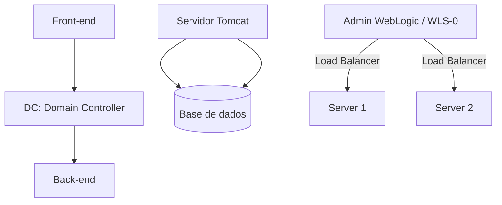
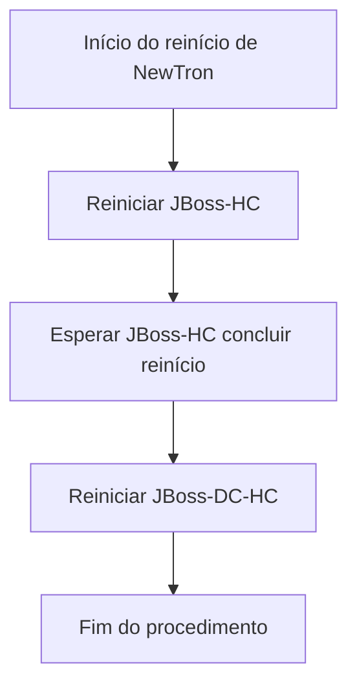
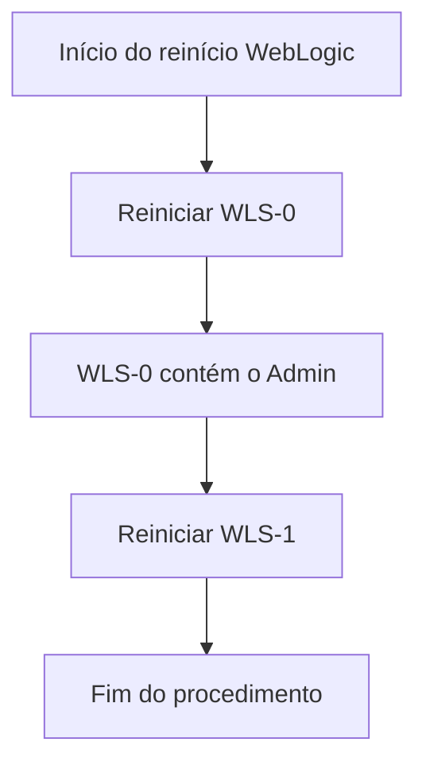

# Mapa de Infraestrutura REEF: Ambientes OCI, AWS, Azure e Diagramas de Servidores de Aplicação

## 1. Metadados do Documento
- **Arquivo de Origem:** Não identificado no conteúdo fornecido
- **Tipo de Documento:** Arquitetura de Software / Manual Operacional
- **Domínio / Sistema:** REEF, Core, NewTron, JBoss, WebLogic, Tomcat
- **Público-Alvo:** Arquitetos, Desenvolvedores e Operação
- **Data/Versão Identificada:** Não identificada

---

## 2. Resumo Executivo & Contexto de Negócio

O documento apresenta um mapa de infraestrutura associado ao ecossistema REEF. O conteúdo organiza ambientes distribuídos entre Oracle Cloud Infrastructure (OCI), AWS, Azure e Alcalá, além de listar referências de documentação, arquiteturas, APIs, componentes, cloud, Zeus, REEF e ajuda.

Na camada de ambientes OCI, o documento enumera Reef Panamá, Reef Honduras, ambientes de desenvolvimento de Core, Teide, Baru, Galeras, RLS-2, Reef-academy, Dispersión e Objerator. Em AWS, são mencionados Reef Uruguay e BPM. Em Azure, o único ambiente explicitamente listado é Activos Digitales.

O material também registra ambientes de Core em Alcalá: Integración Core, Preproducción Core e Integración Continua Core (IC Core). Entretanto, o conteúdo fornecido não especifica as responsabilidades, URLs, servidores, tecnologias ou fluxos internos desses ambientes.

A parte mais detalhada descreve relações operacionais entre Front-end, Back-end, Domain Controller (DC), Host Controller (HC), JBoss, WebLogic e Tomcat. O documento define sequências de reinício para NewTron e para a infraestrutura WebLogic, com dependências explícitas entre JBoss-HC, JBoss-DC-HC, WLS-0 e WLS-1.

---

## 3. Arquitetura, Componentes & Tecnologias Envolvidas

### Componentes, plataformas e ambientes identificados

| Componente / Tecnologia | Papel ou informação sustentada pelo documento |
| :--- | :--- |
| REEF | Sistema ou domínio central do mapa de infraestrutura. |
| OCI | Plataforma onde são listados vários ambientes REEF e de Core. |
| AWS | Plataforma onde são listados Reef Uruguay e BPM. |
| Azure | Plataforma onde é listado Activos Digitales. |
| Alcalá | Localidade ou agrupamento de ambientes de Core: Integración Core, Preproducción Core e IC Core. |
| JBoss | Servidor de aplicações referido nos diagramas e no procedimento de reinício do NewTron. |
| DC | Domain Controller. Permite comunicação entre Front-end e Back-end. |
| HC | Host Controller. Deve estar reiniciado antes do reinício de JBoss-DC-HC. |
| JBoss-HC | Componente cujo reinício pode ser suficiente ao reiniciar NewTron. |
| JBoss-DC-HC | Componente recomendado para reinício após JBoss-HC, visando evitar problemas futuros. |
| NewTron | Sistema associado ao procedimento de reinício de JBoss-HC e JBoss-DC-HC. |
| WebLogic | Servidor de aplicações cuja arquitetura detalhada é referenciada no documento. |
| Admin WebLogic | Atua como Load Balancer entre Server 1 e Server 2. |
| WLS-0 | Instância WebLogic que contém o Admin; deve ser reiniciada antes de WLS-1. |
| WLS-1 | Instância WebLogic que deve ser reiniciada após WLS-0. |
| Tomcat | Servidor independente de outros componentes, exceto da base de dados; é mantido para aproveitamento de espaço, entre outros motivos. |
| Base de dados | Dependência explícita do Tomcat. |
| BPM | Ambiente listado em AWS, sem detalhamento adicional. |
| Activos Digitales | Ambiente listado em Azure, sem detalhamento adicional. |







**Nota de Análise:** O documento referencia uma seção denominada “Arquitectura WebLogic” para detalhes adicionais sobre a arquitetura do servidor de aplicações WebLogic, mas o conteúdo dessa seção não foi incluído na extração fornecida.

**Nota de Análise:** O documento lista os ambientes e componentes, mas não detalha versões de JBoss, WebLogic, Tomcat, sistemas operacionais, portas, endpoints, topologias de rede, métodos HTTP ou contratos de integração.

---

## 4. Regras de Negócio, Especificações Funcionais & Processos

### Comunicação entre Front-end e Back-end

1. O Domain Controller (DC) permite a comunicação entre o Front-end e o Back-end.
2. Quando o Front-end necessita acessar o Back-end, o acesso é realizado por meio do DC.
3. O documento não detalha o protocolo, a autenticação, as portas, as rotas ou os contratos de dados utilizados nessa comunicação.

### Independência do servidor Tomcat

1. O servidor Tomcat é independente de todos os demais componentes, exceto da base de dados.
2. O documento informa que o Tomcat está presente para aproveitar espaço, entre outros motivos.
3. Não há detalhamento sobre aplicações implantadas no Tomcat, tipo de base de dados, mecanismos de conexão ou procedimento específico de reinício do Tomcat.

### Procedimento de reinício do NewTron

| Etapa | Ação | Regra / Justificativa |
| :--- | :--- | :--- |
| 1 | Reiniciar JBoss-HC | O reinício de JBoss-HC pode ser suficiente para reiniciar NewTron. |
| 2 | Aguardar conclusão do reinício de JBoss-HC | É necessário esperar JBoss-HC estar reiniciado antes de reiniciar JBoss-DC-HC. |
| 3 | Reiniciar JBoss-DC-HC | O documento recomenda reiniciar JBoss-DC-HC, pois o tempo adicional é pequeno e pode evitar maior demora na resolução de problemas futuros. |

### Procedimento de reinício do WebLogic

| Etapa | Ação | Regra / Justificativa |
| :--- | :--- | :--- |
| 1 | Reiniciar WLS-0 | WLS-0 deve ser reiniciado primeiro porque contém o Admin WebLogic. |
| 2 | Reiniciar WLS-1 | WLS-1 deve ser reiniciado somente após WLS-0. |

### Balanceamento de carga no WebLogic

1. O Admin WebLogic atua como Load Balancer entre Server 1 e Server 2.
2. O documento não especifica o algoritmo de balanceamento, os critérios de health check, afinidade de sessão, failover ou a identificação técnica dos servidores.

---

## 5. Tabelas de Parâmetros, Ambientes e Estruturas de Dados

### Ambientes por plataforma

| Item / Parâmetro | Descrição / Função | Tipo / Valores / Formato | Ambiente / Observações |
| :--- | :--- | :--- | :--- |
| Reef Panamá | Ambiente REEF listado no documento | Nome de ambiente | OCI |
| Reef Honduras | Ambiente REEF listado no documento | Nome de ambiente | OCI |
| Entornos de desarrollo de Core | Ambientes de desenvolvimento de Core | Nome de agrupamento de ambientes | OCI |
| Teide | Ambiente listado | Nome de ambiente | OCI |
| Baru | Ambiente listado | Nome de ambiente | OCI |
| Galeras | Ambiente listado | Nome de ambiente | OCI |
| RLS-2 | Ambiente listado | Nome de ambiente | OCI |
| Reef-academy | Ambiente listado | Nome de ambiente | OCI |
| Dispersión | Ambiente listado | Nome de ambiente | OCI |
| Objerator | Ambiente listado | Nome de ambiente | OCI |
| Reef Uruguay | Ambiente REEF listado | Nome de ambiente | AWS |
| BPM | Ambiente listado | Nome de ambiente | AWS |
| Activos Digitales | Ambiente listado | Nome de ambiente | Azure |
| Entorno Perú | Ambiente listado | Nome de ambiente | Plataforma não identificada no conteúdo |
| Integración Core | Ambiente de Core | Nome de ambiente | Alcalá |
| Preproducción Core | Ambiente de pré-produção de Core | Nome de ambiente | Alcalá |
| Integración Continua Core (IC Core) | Ambiente de integração contínua de Core | Nome de ambiente | Alcalá |

### Componentes de infraestrutura e operação

| Item / Parâmetro | Descrição / Função | Tipo / Valores / Formato | Ambiente / Observações |
| :--- | :--- | :--- | :--- |
| DC | Permite comunicação entre Front-end e Back-end | Sigla: Domain Controller | O Front-end acessa o Back-end através do DC |
| HC | Host Controller | Sigla: Host Controller | Deve estar reiniciado antes de JBoss-DC-HC |
| JBoss-HC | Componente JBoss usado no reinício de NewTron | Componente de infraestrutura | Pode ser suficiente para reiniciar NewTron |
| JBoss-DC-HC | Componente JBoss recomendado no reinício de NewTron | Componente de infraestrutura | Reiniciar após JBoss-HC |
| WLS-0 | Instância WebLogic que contém o Admin | Instância WebLogic | Deve ser reiniciada primeiro |
| WLS-1 | Instância WebLogic subsequente | Instância WebLogic | Deve ser reiniciada após WLS-0 |
| Admin WebLogic | Atua como Load Balancer | Componente administrativo / balanceamento | Distribui entre Server 1 e Server 2 |
| Server 1 | Servidor gerenciado pelo balanceamento do Admin | Servidor de aplicações | Associado ao WebLogic |
| Server 2 | Servidor gerenciado pelo balanceamento do Admin | Servidor de aplicações | Associado ao WebLogic |
| Tomcat | Servidor independente, exceto pela dependência da base de dados | Servidor de aplicações | Mantido para aproveitamento de espaço, entre outros motivos |
| Base de dados | Dependência do Tomcat | Camada de persistência | Tecnologia não identificada |

### Referência de documentação REEF

| Item / Parâmetro | Descrição / Função | Tipo / Valores / Formato | Ambiente / Observações |
| :--- | :--- | :--- | :--- |
| Documentation / DOCUMENTACIÓN Reef | Área de documentação REEF | Referência documental | Conteúdo extraído apresenta esse rótulo |
| Owner | Proprietário exibido na documentação | Usuário | `user:agonzalez_mapfre.com` |
| Lifecycle | Estado de ciclo de vida exibido | Valor textual | `Approved Source` |
| Navegação documental | Opções de navegação disponíveis | Lista textual | Buscar, Inicio, Soluciones, Arquitecturas, APIs, Componentes, Cloud, Documentación, Zeus, Reef, Ayuda |
| Idioma | Idioma exibido na documentação | Código de idioma | `ES` |

---

## 6. Bateria de Perguntas & Respostas para RAG (FAQ Sintético)

### P1: Qual é a função do Domain Controller (DC) na arquitetura descrita?
**R:** O DC significa Domain Controller e permite a comunicação entre o Front-end e o Back-end. Quando o Front-end precisa acessar o Back-end, o acesso é feito por meio do DC. O documento não detalha protocolos, rotas, portas ou mecanismos de autenticação dessa comunicação.

### P2: Qual é a sequência recomendada para reiniciar NewTron?
**R:** Para reiniciar NewTron, o documento informa que reiniciar JBoss-HC pode ser suficiente. Contudo, recomenda-se também reiniciar JBoss-DC-HC, pois o esforço adicional é pequeno e pode evitar demora maior caso surjam problemas futuros. Antes de reiniciar JBoss-DC-HC, é obrigatório esperar o reinício de JBoss-HC terminar.

### P3: Por que JBoss-DC-HC deve ser reiniciado mesmo quando JBoss-HC pode ser suficiente?
**R:** O documento afirma que JBoss-HC pode ser suficiente para o reinício de NewTron, mas recomenda reiniciar também JBoss-DC-HC. A justificativa apresentada é que o procedimento leva pouco tempo e pode prevenir maior tempo de resolução diante de problemas futuros.

### P4: Qual é a ordem correta de reinício das instâncias WebLogic?
**R:** A ordem correta é reiniciar WLS-0 primeiro e, após isso, reiniciar WLS-1. WLS-0 deve ser priorizado porque contém o Admin WebLogic.

### P5: Qual é o papel do Admin WebLogic na topologia apresentada?
**R:** O Admin WebLogic atua como Load Balancer entre Server 1 e Server 2. O documento não informa qual algoritmo de distribuição é utilizado, como são executados health checks ou quais critérios determinam failover.

### P6: O servidor Tomcat depende de quais componentes?
**R:** O servidor Tomcat é independente de todos os demais componentes, com exceção da base de dados. O documento também informa que o Tomcat está presente para aproveitar espaço, entre outros motivos, sem detalhar aplicações instaladas ou o tipo de base de dados.

### P7: Quais ambientes REEF são listados em OCI?
**R:** Em OCI, o documento lista Reef Panamá, Reef Honduras, ambientes de desenvolvimento de Core, Teide, Baru, Galeras, RLS-2, Reef-academy, Dispersión e Objerator.

### P8: Quais ambientes são listados em AWS e Azure?
**R:** Em AWS, o documento lista Reef Uruguay e BPM. Em Azure, o documento lista Activos Digitales. Não há detalhamento técnico adicional sobre esses ambientes na extração fornecida.

### P9: Quais ambientes de Core são citados em Alcalá?
**R:** Os ambientes de Core citados em Alcalá são Integración Core, Preproducción Core e Integración Continua Core (IC Core). O documento não detalha os objetivos operacionais, URLs, servidores ou pipelines associados a esses ambientes.

### P10: Onde consultar detalhes sobre a arquitetura do servidor WebLogic?
**R:** O documento orienta consultar o apartado “Arquitectura WebLogic” para conhecer a arquitetura do servidor de aplicações WebLogic com maior detalhe. Esse conteúdo detalhado não está presente na extração fornecida.

### P11: Quem é o proprietário identificado na documentação REEF?
**R:** O proprietário identificado na área de documentação REEF é `user:agonzalez_mapfre.com`. O conteúdo também apresenta o campo Lifecycle com o valor `Approved Source`.

---

## 7. Glossário de Termos, Siglas & Conceitos-Chave

- **AWS:** Plataforma identificada como hospedeira dos ambientes Reef Uruguay e BPM.
- **Azure:** Plataforma identificada como hospedeira do ambiente Activos Digitales.
- **Back-end:** Camada acessada pelo Front-end por meio do DC, conforme o documento.
- **BPM:** Ambiente listado em AWS. O significado da sigla não é detalhado no documento.
- **DC:** Domain Controller; componente que permite a comunicação entre Front-end e Back-end.
- **Front-end:** Camada que acessa o Back-end por meio do DC.
- **HC:** Host Controller.
- **IC Core:** Integración Continua Core.
- **JBoss:** Servidor de aplicações citado nos diagramas e procedimentos de reinício relacionados a NewTron.
- **JBoss-DC-HC:** Componente cujo reinício é recomendado após a conclusão do reinício de JBoss-HC.
- **JBoss-HC:** Componente que pode ser suficiente para o reinício de NewTron.
- **Load Balancer:** Papel exercido pelo Admin WebLogic entre Server 1 e Server 2.
- **NewTron:** Sistema associado ao procedimento de reinício de JBoss-HC e JBoss-DC-HC.
- **OCI:** Oracle Cloud Infrastructure; plataforma que contém os ambientes Reef Panamá, Reef Honduras e outros ambientes listados.
- **REEF:** Sistema ou domínio central referido no mapa de infraestrutura e na documentação.
- **Tomcat:** Servidor independente de outros componentes, exceto da base de dados.
- **WebLogic:** Servidor de aplicações cujo Admin atua como balanceador entre Server 1 e Server 2.
- **WLS-0:** Instância WebLogic que contém o Admin e deve ser reiniciada antes de WLS-1.
- **WLS-1:** Instância WebLogic que deve ser reiniciada após WLS-0.

---

## 8. Notas Críticas, Riscos & Limitações

- O documento possui marcadores pendentes: `// TODO Diagramas: 3 tipos de diagrama, kubernetes` e `// TODO → ¿QUÉ ES REEF?, ¿de que se compone?`. Portanto, a descrição do REEF, sua composição e os diagramas de Kubernetes não estão detalhados.
- A extração referencia “Arquitectura WebLogic”, porém não fornece o conteúdo arquitetural detalhado dessa seção.
- Não foram identificadas URLs de ambientes, endereços IP, portas, versões de software, credenciais, configurações de rede ou mecanismos de autenticação.
- Não foram identificados contratos de integração, métodos HTTP, esquemas JSON, filas, tópicos, bancos de dados específicos ou políticas de observabilidade.
- O procedimento de reinício de NewTron contém uma dependência operacional explícita: JBoss-HC precisa concluir o reinício antes do reinício de JBoss-DC-HC.
- O procedimento WebLogic depende da ordem WLS-0 antes de WLS-1, porque WLS-0 contém o Admin.
- Os ambientes listados em OCI, AWS, Azure e Alcalá são apenas nomes no conteúdo extraído; suas responsabilidades, criticidade, integração e ciclo de vida não estão descritos.
- O documento apresenta um caractere corrompido na palavra “suficiente” em “puede ser suciente”; a leitura semântica foi preservada como “suficiente”.

---

## 9. Conteúdo Bruto Estruturado (Referência Fiel)

```text
--- [PÁGINA 1 DE 4] ---

MAPA INFRAESTRUCTURA
Índice
Introducción
Entornos en OCI
- Reef Panamá
- Reef Honduras
- Entornos de desarrollo de Core
- Teide
- Baru
- Galeras
- RLS-2
- Reef-academy
- Dispersión
- Objerator
Entornos en AWS
- Reef Uruguay
- BPM
Entornos en Azure
- Activos Digitales
Diagramas
- JBoss
- WebLogic
// TODO Diagramas: 3 tipos de diagrama, kubernetes
Introducción
// TODO →  ¿QUÉ ES REEF?, ¿de que se compone?
Entornos en OCI
Reef Panamá
Documentation / DOCUMENTACIÓN Reef
DOCUMENTACIÓN Reef
Mapfredocument
DOCUMENTACIÓN Reef
Owner
user:agonzalez_mapfre.com
Lifecycle
Approved Source
 /
VL
Buscar Inicio Soluciones Arquitecturas APIs Componentes Cloud Documentación Zeus Reef Ayuda
ES


--- [PÁGINA 2 DE 4] ---

Si se desea conocer la arquitectura del servidor de aplicaciones WebLogic con detalle, se puede consultar el siguiente apartado:
Arquitectura WebLogic
Reef Honduras
Entornos de desarrollo de Core
Teide
Baru
Galeras
RLS-2
Reef-academy
Dispersión
Objerator
Entornos en AWS
Reef Uruguay


--- [PÁGINA 3 DE 4] ---

BPM
Entornos en Azure
Activos Digitales
Entorno Perú
Entornos en Alcalá
Integración Core
Preproducción Core
Integración Continua Core (IC Core)
Diagramas
Jboss
DC: Domain Controller
HC: Host Controller


--- [PÁGINA 4 DE 4] ---

DC permite la comunicación entre el Front-end y el Back-end, cuando el Front-end necesita acceder al Back-end lo hace mediante DC
El servidor Tomcat es independiente de todo (A excepción de la base de datos) , se encuentra ahí para aprovechar espacio entre otros
motivos.
A la hora de reiniciar NewTron, reiniciar Jboss-HC puede ser suciente, pero merece la pena reiniciar Jboss-DC-HC, ya que se tarda poco por
si hay problemas futuros, se tardaría más.
Hay que esperar a que esté reiniciado Jboss-HC para reiniciar Jboss-DC-HC
Weblogic
En este caso, el admin hace de Load Balancer entre el Server 1 y el Server 2, Tomcat también es independiente (a excepción de la base de
datos) y se encuentra ahí para ahorrar espacio entre otros motivos.
A la hora de reiniciar, reiniciar WLS-0 primero ya que contiene al Admin, y una vez reiniciado, reiniciar WLS-1
```
