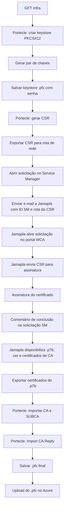

# Procedimento de Geração de Keystore PFX, CSR e Certificado PKI MAPFRE para NewTron

## 1. Metadados do Documento
- **Arquivo de Origem:** Não identificado no conteúdo extraído
- **Tipo de Documento:** Procedimento / Manual Operacional
- **Domínio / Sistema:** MAPFRE, Reef, NewTron, PKI MAPFRE, Service Manager, Azure
- **Público-Alvo:** Infraestrutura GFT, administradores de certificados, operação e equipes responsáveis pela instalação em Azure
- **Data/Versão Identificada:** Não identificada

---

## 2. Resumo Executivo & Contexto de Negócio

O documento descreve o procedimento operacional para gerar uma solicitação de assinatura de certificado, denominada CSR (*Certificate Signing Request*), criar e preservar um keystore no formato PFX/PKCS#12 e obter a assinatura de certificado pela PKI MAPFRE. O processo utiliza a ferramenta Portecle para criar o par de chaves, gerar o CSR, importar certificados de CA e incorporar a resposta assinada no keystore.

O fluxo envolve dependências organizacionais e ferramentas corporativas: GFT Infra cria o keystore e exporta o CSR; uma solicitação é aberta no Service Manager; Jamapla atua no portal WCA, ambiente para o qual o documento informa que somente Jamapla possui acesso; e, após a assinatura, Jamapla disponibiliza o certificado assinado e os certificados de CA na rota de rede definida para o CSR.

O documento diferencia certificados internos para Intranet dos certificados destinados à Internet. Para certificados internos, apresenta valores de exemplo para DN e SAN. Para Internet, o documento determina o uso de DIGICERT. Também especifica que solicitações para Produção devem selecionar DIGICERT como entidade emissora, enquanto os demais ambientes devem selecionar PKI MAPFRE.

O resultado final esperado é um arquivo `.pfx` contendo a chave privada, o certificado assinado e os certificados de CA/SubCA necessários. Esse arquivo fica pronto para carregamento no Azure. O procedimento enfatiza a preservação da senha do keystore, pois ela será necessária em etapas posteriores e na instalação do certificado no Azure.

---

## 3. Arquitetura, Componentes & Tecnologias Envolvidas

| Componente / Tecnologia | Papel no processo | Observações |
| :--- | :--- | :--- |
| GFT Infra | Gera keystore, exporta CSR e importa certificados assinados | Responsável pela montagem final do `.pfx` |
| Portecle | Ferramenta para criação de keystore, pares de chaves, CSR e importação de certificados | Opções citadas: `New Keystore`, `Generate Key Pair`, `Generate Certification Request`, `Import Trusted Certificate` e `Import CA Reply` |
| Keystore PFX / PKCS#12 | Contêiner seguro de certificados digitais e chaves privadas | Extensão indicada: `.pfx` |
| CSR | Solicitação de assinatura de certificado | Deve ser anexada obrigatoriamente para tipo de servidor Unix/Linux |
| Service Manager / SM | Canal de abertura e acompanhamento da solicitação de certificado | O documento fornece links para novo certificado e renovação |
| Portal WCA | Portal usado para subir CSR e obter certificado assinado | O documento informa que Jamapla possui acesso ao portal |
| Jamapla | Intermediário operacional para abrir solicitação no WCA, subir CSR e baixar certificado | Deve receber e-mails com o número da solicitação SM e a rota do CSR |
| PKI MAPFRE | Entidade emissora indicada para ambientes que não sejam Produção | Também aparece como emissora para certificado interno |
| DIGICERT | Entidade emissora para Produção e certificados para Internet | O documento não detalha o processo específico no DIGICERT |
| CA / SUBCA | Certificados da cadeia de confiança | Devem ser importados como certificados confiáveis no Portecle |
| Azure | Destino final do arquivo `.pfx` | A senha do keystore será necessária durante a instalação |
| Unidade de rede `/MAPFRE/GFT/` | Rota corporativa indicada inicialmente para exportação do CSR e recebimento dos arquivos assinados | Há também exemplo com rota UNC distinta |
| NewTron | Sistema citado como destino de instalação do certificado | O exemplo de solicitação menciona servidores NewTron em ambiente Des |
| Reef | Portal/documentação corporativa onde o documento foi publicado | Cabeçalho mostra “DOCUMENTACIÓN Reef” |



> **Nota de Análise:** O documento menciona o portal WCA, mas não detalha sua URL, suas telas, seus campos ou o procedimento interno para submissão e download do certificado.

> **Nota de Análise:** O documento cita Azure como destino do arquivo PFX, porém não detalha o serviço Azure específico, os passos de upload, a configuração de *binding* ou requisitos de implantação.

---

## 4. Regras de Negócio, Especificações Funcionais & Processos

### 4.1 Processo operacional completo

1. GFT Infra deve gerar o keystore, descrito como contêiner de certificados, e exportar o CSR.
2. O CSR deve ser exportado para uma rota da unidade de rede `/MAPFRE/GFT/`.
3. Deve ser aberto um ticket no Service Manager para solicitar a assinatura do certificado.
4. Deve ser enviado um e-mail a Jamapla contendo o número da solicitação SM para que Jamapla abra outra solicitação no portal WCA e envie o CSR para assinatura.
5. Após a assinatura, a solicitação SM deve receber comentário informando que o certificado foi assinado.
6. Deve ser enviado novo e-mail a Jamapla comunicando a conclusão e solicitando o certificado assinado. Segundo o documento, Jamapla é quem possui permissão para baixar o certificado no portal WCA.
7. Jamapla deve disponibilizar o certificado assinado e os certificados de CA na rota de rede em que o CSR havia sido exportado.
8. GFT Infra deve adicionar os certificados de CA e a resposta do CSR ao keystore criado anteriormente.

### 4.2 Definição e conteúdo do keystore PFX

Um keystore PFX, também chamado PKCS#12 ou arquivo `.pfx`, armazena certificados digitais e chaves privadas em formato cifrado e seguro.

O arquivo PFX pode conter:

- **Certificado digital:** certificado público utilizado para identificar uma entidade, como servidor ou usuário, assinado por uma Autoridade Certificadora.
- **Chave privada:** chave correspondente ao certificado, necessária para autenticação e criptografia. A chave privada deve permanecer secreta, pois seu comprometimento coloca em risco a segurança do certificado.
- **Certificados intermediários:** opcionalmente, uma cadeia de certificados intermediários para estabelecer confiança entre o certificado da entidade e a autoridade certificadora raiz.

### 4.3 Geração do keystore e par de chaves no Portecle

1. Abrir a aplicação **Portecle**.
2. Acessar a aba **File**.
3. Selecionar **New Keystore**.
4. Selecionar o tipo **PKCS #12**.
5. Confirmar a seleção.
6. Acessar **Tools**.
7. Selecionar **Generate Key Pair**.
8. Escolher o tamanho e o algoritmo de geração da chave.
9. Preencher os dados de certificação na janela exibida.
10. Preencher o campo de e-mail com o e-mail do responsável.
11. Confirmar os dados.

> **Nota de Análise:** O documento instrui selecionar tamanho e algoritmo de chave, mas não informa quais valores, algoritmos ou tamanhos devem ser usados.

### 4.4 Dados de certificado interno para Intranet

O documento apresenta os seguintes valores como referência para certificado interno destinado à Intranet:

| Campo | Valor de exemplo |
| :--- | :--- |
| CN | `tron-desa-ca.reef.mapfre.net` |
| OU | `MAPFRE` |
| O | `"MAPFRE, S.A."` |
| L | `Majadahonda` |
| ST | `Madrid` |
| C | `ES` |
| E | `jamapla@mapfre.com` |
| Subject Alternative DNS Name (SAN) | `tron-desa-ca.reef.mapfre.net` |

Regras associadas:

- Para certificados destinados à Internet, deve ser usado **DIGICERT**.
- O **CN** e o **SAN** podem ser diferentes conforme o certificado.
- Antes de criar o certificado, é necessário confirmar os valores corretos de CN e SAN.
- O alias da chave pode ser mantido com o valor padrão.
- A chave é gerada após a inserção do alias.

### 4.5 Armazenamento, senha, validade e backup do keystore

1. Após gerar a chave, acessar **File**.
2. Selecionar **Save Keystore As**.
3. Informar uma senha para o keystore.
4. Salvar o arquivo com extensão `.pfx` e nome correspondente ao alias do certificado.
5. Criar uma cópia adicional do arquivo como backup.

Regras e recomendações:

- A senha do keystore deve ser obrigatoriamente preservada.
- A senha será solicitada em etapas posteriores e na instalação do certificado no Azure.
- A senha pode ser guardada em um gestor de senhas.
- Recomenda-se guardar a senha junto com o alias do certificado.
- Recomenda-se registrar a data de expiração como um ano após a data de geração do certificado.
- Exemplo fornecido: certificado gerado em `30-11-2022` deve ser registrado como expirando em `30-11-2023`.

### 4.6 Geração do CSR

1. No Portecle, clicar com o botão direito sobre a chave gerada.
2. Selecionar **Generate Certification Request**.
3. Definir o local de salvamento do CSR.
4. Confirmar a geração.

Após a geração do CSR:

- Deve ser enviado e-mail a Jamapla para solicitar a abertura de uma *request* de assinatura pelo endereço `ca.mapfre@mapfre.com`.
- O documento determina que a *request* deve ser aberta antes da solicitação a Jamapla.

### 4.7 Abertura de solicitação no Service Manager

A criação de solicitação de certificados deve começar pelo portal Service Manager:

- Portal principal: `https://smaportal.mapfre.net/saw/ess?TENANTID=783319272`
- Solicitação de certificado novo: URL fornecida no conteúdo bruto.
- Solicitação de renovação de certificado: URL fornecida no conteúdo bruto.

Regras para o formulário:

- Para ambientes de **Produção**, selecionar **DIGICERT** como “Entidad emisora”.
- Para todos os demais ambientes, selecionar **PKI MAPFRE**.
- A lista de distribuição para o grupo D.A. de Administração deve ser sempre `LTRONPDDESARROLLO@mapfre.com`, independentemente do ambiente ou do sistema citado, incluindo TronWeb, Newtron e Finametrix.
- Para o tipo de servidor **Unix/Linux**, é obrigatório anexar o CSR.
- Os nomes de servidores devem ser ajustados conforme o ambiente solicitado.

### 4.8 Exemplo de preenchimento de solicitação

| Campo | Valor de exemplo |
| :--- | :--- |
| Entidade emissora | PKI MAPFRE |
| Nome do certificado | `tron-desa-ca.reef.mapfre.net` |
| Tipo de certificado | SSL |
| Autorizadores | `DAVIJIM ; asanc35` |
| Lista de distribuição para grupo D.A. de Administração | `LTRONPDDESARROLLO@mapfre.com` |
| Nome(s) alternativo(s) do certificado | `tron-desa-ca.reef.mapfre.net` |
| Tipo de servidor | Unix/Linux |
| CSR | Obrigatório anexar |
| Servidores de instalação | `wlDes-wls-0 ; wlDes-wls-1` |

### 4.9 Dados complementares da solicitação

| Campo | Valor de exemplo |
| :--- | :--- |
| Título | Solicitud certificado PKI Mapfre para instalar en servidores de NewTron |
| Descrição | Solicitud certificado PKI Mapfre para instalar en servidores de NewTron en entorno de Des, en máquinas Linux. |
| Impacto de usuário | `2 - Sitio/Dpto.` |
| Necessitado para | Selecionar data conveniente |
| Telefone temporário | `+34 973 28 40 52` |
| Horário de contato | `9:00-17:00h` |

Após o envio do formulário:

1. Enviar e-mail a `jamapla@mapfre.com`, `afizgar@mapfre.com` e `pabloh2@3p.mapfre.com`.
2. Colocar `mapfre.tron.cloud@gft.com` em cópia.
3. Informar a rota do CSR.
4. Informar no título do e-mail o número da solicitação criada.
5. Exemplo de título indicado: `Request con el CSR: Request Id is 12345678`.

### 4.10 Recebimento e importação do certificado assinado

Após a assinatura da solicitação, devem ser recebidos dois arquivos:

- `.p7b`
- `.cer`

Procedimento:

1. Abrir o arquivo `.p7b`.
2. Navegar pelas pastas até encontrar os certificados gerados.
3. Selecionar a opção **Export**.
4. Exportar todos os certificados.
5. Escolher formato e nome durante a exportação.
6. Abrir o Portecle.
7. Acessar **Tools**.
8. Selecionar **Import Trusted Certificate**.
9. Importar os certificados de **CA** e **SUBCA**.
10. Clicar com o botão direito sobre a chave criada.
11. Selecionar **Import CA Reply**.
12. Importar a resposta do certificado.
13. Salvar o keystore.

O resultado é um arquivo `.pfx` pronto para upload no Azure.

---

## 5. Tabelas de Parâmetros, Ambientes e Estruturas de Dados

| Item / Parâmetro | Descrição / Função | Tipo / Valores / Formato | Ambiente / Observações |
| :--- | :--- | :--- | :--- |
| Formato de keystore | Contêiner seguro para certificados e chaves privadas | PKCS#12 / PFX / `.pfx` | Deve ser criado no Portecle |
| Ferramenta de gestão | Criação de keystore, chave, CSR e importações | Portecle | Ferramenta central do procedimento |
| Chave privada | Material criptográfico associado ao certificado | Deve permanecer secreta | Comprometimento compromete a segurança do certificado |
| Certificado digital | Identificação pública de servidor ou usuário | Assinado por CA | Incluído no PFX |
| Certificados intermediários | Cadeia de confiança até CA raiz | Opcional no PFX; CA e SUBCA são importadas no processo | Exportar do `.p7b` quando recebidos |
| CSR | Solicitação de assinatura de certificado | Arquivo gerado no Portecle | Obrigatório anexar para Unix/Linux |
| Alias | Identificador da chave/certificado no keystore | Valor padrão pode ser mantido | Nome do arquivo `.pfx` deve usar o alias |
| Senha do keystore | Proteção do arquivo PFX | Não especificada | Necessária em etapas posteriores e no Azure |
| Validade recomendada | Registro de expiração do certificado | Um ano após a geração | Recomendação documental |
| CN | Nome comum do certificado | Exemplo: `tron-desa-ca.reef.mapfre.net` | Deve ser confirmado antes da criação |
| SAN | Nome DNS alternativo do certificado | Exemplo: `tron-desa-ca.reef.mapfre.net` | Pode ser diferente do CN |
| OU | Unidade organizacional | `MAPFRE` | Exemplo para certificado interno |
| O | Organização | `"MAPFRE, S.A."` | Exemplo para certificado interno |
| L | Localidade | `Majadahonda` | Exemplo para certificado interno |
| ST | Estado/Província | `Madrid` | Exemplo para certificado interno |
| C | País | `ES` | Exemplo para certificado interno |
| E | E-mail do certificado | `jamapla@mapfre.com` | Exemplo para certificado interno |
| Emissor para Produção | Entidade emissora para certificados de Produção | DIGICERT | Regra explícita |
| Emissor para não-Produção | Entidade emissora para outros ambientes | PKI MAPFRE | Regra explícita |
| Certificado para Internet | Certificado voltado à Internet | DIGICERT | Regra explícita |
| Tipo de certificado | Classificação apresentada no formulário | SSL | Exemplo fornecido |
| Tipo de servidor | Plataforma dos servidores de instalação | Unix/Linux | CSR obrigatório |
| Distribuição D.A. | Lista de distribuição administrativa | `LTRONPDDESARROLLO@mapfre.com` | Sempre a mesma, independentemente de ambiente ou aplicação |
| Autorizadores | Pessoas/grupos autorizadores | `DAVIJIM ; asanc35` | Exemplo fornecido |
| Servidores de exemplo | Hosts de instalação em ambiente Des | `wlDes-wls-0 ; wlDes-wls-1` | Ajustar ao ambiente solicitado |
| Rota de rede principal | Local indicado para CSR e arquivos assinados | `/MAPFRE/GFT/` | Indicada no fluxo inicial |
| Rota UNC de exemplo | Local do CSR no e-mail de exemplo | `\\Es.mapfre.net\mapgen\Comun\JAMAPLA\GFT\__Keys\_Certificados\ESPEJO-2` | Exemplo; não declarada como rota universal |
| Service Manager principal | Portal para iniciar solicitação | `https://smaportal.mapfre.net/saw/ess?TENANTID=783319272` | Tenant ID `783319272` |
| Impacto de usuário | Classificação do impacto na solicitação | `2 - Sitio/Dpto.` | Exemplo fornecido |
| Horário de contato | Período informado na solicitação | `9:00-17:00h` | Exemplo fornecido |
| Arquivos recebidos após assinatura | Artefatos da assinatura | `.p7b` e `.cer` | Exportar todos os certificados do `.p7b` |
| Importação de CA/SUBCA | Inclusão da cadeia de confiança no keystore | `Import Trusted Certificate` | Executada no Portecle |
| Importação da resposta assinada | Associação do certificado assinado à chave privada | `Import CA Reply` | Executada sobre a chave criada |
| Destino final | Plataforma de upload do PFX | Azure | O documento não detalha o serviço Azure |

---

## 6. Bateria de Perguntas & Respostas para RAG (FAQ Sintético)

### P1: Qual é o objetivo do procedimento de geração de CSR e keystore PFX?
**R:** O procedimento orienta a criação de um keystore PKCS#12/PFX, a geração de um par de chaves e de um CSR no Portecle, a abertura de uma solicitação de assinatura no Service Manager, a interação com Jamapla para assinatura via portal WCA e a importação da cadeia de certificados e da resposta assinada. O resultado final é um arquivo `.pfx` pronto para upload no Azure.

### P2: Qual ferramenta deve ser usada para criar o keystore e gerar o CSR?
**R:** O documento determina o uso da ferramenta Portecle. No Portecle, o keystore é criado por `File > New Keystore`, com formato `PKCS #12`; o par de chaves é gerado por `Tools > Generate Key Pair`; e o CSR é criado clicando com o botão direito na chave e selecionando `Generate Certification Request`.

### P3: O que um arquivo PFX contém segundo o documento?
**R:** Um arquivo PFX, também chamado PKCS#12 ou `.pfx`, armazena certificados digitais e chaves privadas em formato cifrado e seguro. Pode incluir o certificado digital público, a chave privada correspondente e, opcionalmente, certificados intermediários que formam a cadeia de confiança até a autoridade certificadora raiz.

### P4: Qual entidade emissora deve ser escolhida para certificados de Produção?
**R:** Para certificados destinados a ambientes de Produção, a entidade emissora deve ser selecionada como `DIGICERT`. Para todos os demais ambientes, a entidade emissora indicada é `PKI MAPFRE`.

### P5: Qual entidade deve ser usada para certificados destinados à Internet?
**R:** O documento informa que, para certificados destinados à Internet, deve ser utilizado `DIGICERT`. Não são apresentados detalhes adicionais sobre o fluxo específico para obtenção de certificados Internet.

### P6: O CSR é obrigatório para servidores Unix/Linux?
**R:** Sim. O documento registra que, ao preencher a solicitação no Service Manager, para o tipo de servidor `Unix/Linux` é obrigatório anexar o arquivo CSR.

### P7: Qual lista de distribuição deve ser usada para o grupo D.A. de Administração?
**R:** A lista de distribuição deve ser sempre `LTRONPDDESARROLLO@mapfre.com`. O documento estabelece que essa regra vale independentemente do ambiente e da aplicação, incluindo TronWeb, Newtron e Finametrix.

### P8: Como deve ser tratado o CN e o SAN do certificado?
**R:** O documento apresenta `tron-desa-ca.reef.mapfre.net` como exemplo de CN e SAN para certificado interno. Entretanto, estabelece que CN e SAN podem ser diferentes dependendo do certificado e que esses dados devem ser confirmados antes da criação.

### P9: Por que a senha do keystore PFX deve ser preservada?
**R:** A senha precisa ser guardada porque será solicitada em etapas posteriores e durante a instalação do certificado no Azure. O documento recomenda armazená-la em um gestor de senhas, junto ao alias do certificado e à anotação de validade.

### P10: Quais arquivos são recebidos depois que a assinatura do certificado é concluída?
**R:** Após a assinatura, o documento informa que são devolvidos dois arquivos: um arquivo `.p7b` e um arquivo `.cer`. Os certificados presentes no `.p7b` devem ser todos exportados, e os certificados CA e SUBCA devem ser importados no Portecle antes da importação da resposta assinada.

### P11: Como importar os certificados de CA e SUBCA no Portecle?
**R:** Os certificados de CA e SUBCA devem ser importados no Portecle através da aba `Tools`, usando a opção `Import Trusted Certificate`. Após essa etapa, a resposta assinada deve ser associada à chave por meio de `Import CA Reply`.

### P12: Qual é o fluxo de comunicação com Jamapla?
**R:** Depois de gerar o CSR e criar a solicitação no Service Manager, deve ser enviado e-mail a Jamapla com o número da solicitação e a rota do CSR. Jamapla abre uma solicitação no portal WCA, envia o CSR para assinatura e, após a conclusão, disponibiliza o certificado assinado e os certificados de CA na rota acordada. O documento informa que Jamapla possui acesso ao portal WCA para baixar o certificado.

### P13: Qual é a recomendação de validade registrada para o certificado?
**R:** O documento recomenda registrar a caducidade como um ano após a data de geração do certificado. O exemplo apresentado informa que um certificado gerado em `30-11-2022` deve ter expiração anotada como `30-11-2023`.

---

## 7. Glossário de Termos, Siglas & Conceitos-Chave

- **CA:** Autoridade Certificadora. Entidade que assina certificados digitais.
- **CN:** *Common Name*. Nome comum do certificado, usado no exemplo como `tron-desa-ca.reef.mapfre.net`.
- **CSR:** *Certificate Signing Request*. Solicitação de assinatura de certificado gerada a partir da chave criada no keystore.
- **DIGICERT:** Entidade emissora indicada pelo documento para Produção e certificados destinados à Internet.
- **D.A. de Administración:** Grupo administrativo para o qual deve ser usada a lista `LTRONPDDESARROLLO@mapfre.com`.
- **GFT Infra:** Equipe responsável por gerar keystore, CSR e integrar a resposta assinada ao arquivo PFX.
- **Keystore:** Contêiner de certificados e chaves, criado no procedimento no formato PKCS#12.
- **P7B:** Arquivo que contém certificados a serem exportados e importados no keystore.
- **PFX:** Arquivo PKCS#12 com extensão `.pfx`, contendo certificado(s) e chave privada.
- **PKCS#12:** Formato de arquivo seguro usado para armazenar certificados digitais e chaves privadas; no documento, equivalente ao PFX.
- **PKI MAPFRE:** Entidade emissora indicada para ambientes que não sejam Produção.
- **Portecle:** Aplicação utilizada para criar keystore, gerar chave, gerar CSR e importar certificados.
- **SAN:** *Subject Alternative Name*. Nome DNS alternativo do certificado.
- **Service Manager / SM:** Sistema de abertura e acompanhamento de solicitações de certificados.
- **SUBCA:** Autoridade Certificadora subordinada/intermediária, cuja cadeia deve ser importada como certificado confiável.
- **WCA:** Portal usado no fluxo de assinatura e download do certificado, acessível a Jamapla segundo o documento.

---

## 8. Notas Críticas, Riscos & Limitações

- A senha do keystore PFX é crítica: sua perda impede o uso do arquivo em etapas posteriores, incluindo a instalação no Azure.
- A chave privada deve permanecer secreta. O documento explicita que o comprometimento da chave privada coloca em risco a segurança do certificado.
- O CN e o SAN apresentados são exemplos; não devem ser reutilizados sem validação prévia para o certificado solicitado.
- O documento não define tamanho ou algoritmo criptográfico para geração da chave no Portecle.
- O documento não detalha a URL, os campos nem a operação interna do portal WCA.
- O documento afirma que Jamapla possui acesso ao portal WCA para baixar o certificado, criando dependência operacional dessa função/pessoa.
- A seleção incorreta da entidade emissora pode resultar em solicitação inadequada: DIGICERT é obrigatório para Produção, enquanto PKI MAPFRE deve ser usada nos demais ambientes.
- Para Unix/Linux, a ausência do CSR anexado viola uma exigência explícita do processo.
- O documento cita Azure apenas como destino do PFX; não há instruções de instalação, configuração ou validação no Azure.
- A rota `/MAPFRE/GFT/` é indicada no fluxo inicial, mas o exemplo de e-mail usa uma rota UNC diferente. O documento não esclarece se ambas representam locais equivalentes, alternativos ou específicos por equipe.
- Os links do Service Manager e os endereços de e-mail devem ser tratados como dados operacionais sujeitos a manutenção organizacional; o documento não apresenta processo de atualização ou contingência.
- A recomendação de validade de um ano é apresentada como orientação de registro, não como política técnica formal de validade emitida pela CA.

---

## 9. Conteúdo Bruto Estruturado (Referência Fiel)

```text
--- [PÁGINA 1 DE 11] ---

Generar solicitud de certicado (CSR)
Índice
Introducción
1. Generar las claves en un Keystore
- 1.1 Denición de Keystore
- 1.2 Pasos a seguir
2. Realizar la petición de certicación
Introducción
En este documento se explica de qué manera se debe realizar una solicitud de certicado (CSR).
Indice de los pasos a realizar:
1. GFT Infra va a generar la Keystore (contenedor de certicados) y exportar el CSR (certicado de petición de rma)
2. El CSR se exporta en una ruta de la unidad de red /MAPFRE/GFT/
3. Se abre ticket en SM para la petición de rma de certicado.
4. Se envia mail a Jamapla con el numero de petición SM para que abra otra petición en el portal WCA (que actualmente solo tiene acceso
jamapla) y sube el CSR a este portal para que se lo rmen.
5. Una vez rmado, nos aparece en nuestra SM el comentario de que ya se ha rmado.
6. Enviamos mail a Jamapla para informarle de que la petición de rma se ha completado y que nos envié el certicado rmado (lo va a
descargar del portal WCA donde solo el tiene los permisos para descargar el certicado)
7. Jamapla nos pasara el certicado rmado junto con los certicados de CA en la ruta donde hemos exportado el CSR antes (unidad de
red /MAPFRE/GFT/)
8. GFT Infra añade los certicado del CA y el certicado con la respuesta de CSR en la Keystore que se ha generado anteriormente.
1. Generar las claves en un Keystore y generar el certicado
1.1 Denición de keystore
Un keystore PFX (también conocido como PKCS#12 o .pfx le) es un archivo que almacena tanto certicados digitales como claves privadas
en un formato cifrado y seguro.
Un archivo PFX contiene: - Certicado Digital: Este es el certicado público que se utiliza para identicar una entidad (como un servidor o un
usuario) y es rmado por una autoridad de certicación (CA).
Clave Privada: La clave privada correspondiente al certicado, que es crucial para la autenticación y el cifrado. Esta clave debe
mantenerse en secreto, ya que su compromiso pone en riesgo la seguridad del certicado.
Certicados Intermedios (opcional): A veces, también incluye una cadena de certicados, que son los certicados intermedios utilizados
para crear una cadena de conanza desde el certicado de la entidad hasta la autoridad de certicación raíz.
Documentation / DOCUMENTACIÓN Reef
DOCUMENTACIÓN Reef
Mapfredocument
DOCUMENTACIÓN Reef
Owner
user:agonzalez_mapfre.com
Lifecycle
Approved Source
 /
VL
Buscar Inicio Soluciones Arquitecturas APIs Componentes Cloud Documentación Zeus Reef Ayuda
ES

--- [PÁGINA 2 DE 11] ---

1.2 Pasos a seguir
Para generar el certicado, primero tendremos que generar la clave, ejecutaremos la aplicación "Portecle" y en la pestaña "File", escogeremos
la opción "New Keystore".
En la ventana que se ha abierto marcaremos la opcion PKCS #12 y marcaremos el ok.
Una vez generada la KeyStore, iremos a la ventana Tools y marcaremos la opción "Generate Key Pair"

--- [PÁGINA 3 DE 11] ---

Escogeremos el tamaño y algoritmo con el que generaremos la clave.
Se nos abrirá una ventana nueva en la que se preguntará unos datos sobre la certicación. Los rellenaremos con la información adecuada y
en el email pondremos nuestro correo. Una vez los datos esten escritos le daremos al ok.
Utilizar la siguiente información para crear el Certicado, si es un certicado interno para la Intranet (para Internet se utiliza DIGIcert):
 1
 2
 3
 4
 5
 6
 7
 8
 9
10
11
12
13
14
15
CN = tron-desa-ca.reef.mapfre.net,
OU = MAPFRE,
O = "MAPFRE, S.A.",
L = Majadahonda,
ST = Madrid,
C = ES,
E = jamapla@mapfre.com,
Subject Alternative DNS Name (SAN): tron-desa-ca.reef.mapfre.net

--- [PÁGINA 4 DE 11] ---

Nota: El CN y el SAN pueden ser distintos dependiendo del certicado, preguntar antes esos datos antes de crear el certicado
Se nos pedira poner un alias a la clave, lo podemos dejar por defecto. Una vez introducido el alias se generará la clave.
Una vez creada la clave, la tendremos que guardar. En la ventana "File" y con la opción "Save Keystore As", se nos pedirá poner una
contraseña.
⚠  MUY IMPORTANTE: SE DEBE GUARDAR LA CONTRASEÑA !!!
La contraseña se nos pedirá en pasos siguientes y a la hora de instalar el certicado en Azure. Se puede guardar la contraseña en un gestor
de contraseñas.
Se recomienda guardarla junto al alias del certicado y anotar la caducidad como un año después del día que se ha generado el certicado
(por ejemplo, si se genera el 30-11-2022, hay que poner que caduca el 30-11-2023)

--- [PÁGINA 5 DE 11] ---

Una vez establecida la contraseña se nos pedirá marcar la dirección donde vamos a guardar la clave y el formato debe ser ".pfx" con el
nombre del alias del certicado.
Se recomienda hacer una copia extra del chero que acabamos de generar para tenerlo como backup.
2. Realizar la petición de certicación a través de Service Manager
Una vez generado el .pfx debemos generar la petición para la certicación.
2.1 Pasos a seguir
Seguimos con el programa Portecle. Damos click derecho sobre la clave que hemos generado y marcaremos la opción "Generate
Certification Request".

--- [PÁGINA 6 DE 11] ---

En la ventana que se nos ha abierto, decidiremos donde guardar el CSR y le daremos a ok.
Una vez generado el archivo tendremos que pedir por correo a Jamapla para que abra request para rmar el CSR por
"ca.mapfre@mapfre.com". Es necesario que abramos primero la request.
Creación de request para certicados
Para generar la request de los certicados hay que ir al siguiente enlace:
https://smaportal.mapfre.net/saw/ess?TENANTID=783319272
Y despues, entrar en uno de los siguientes links:
Peticion de Certicado Nuevo: https://smaportal.mapfre.net/sm/ess/offeringPage/IT SERVICES AND
SECURITY_L1%23SECURITY_L2%23CERTIFICATE MANAGEMENT AND CODED SIGNATURE (CM)_L3%23REQUEST A CERTIFICATE FROM PKI
(CM)_L4%23REQUEST A CERTIFICATE FROM PKI (CM)_L5_REQ?TENANTID=783319272

--- [PÁGINA 7 DE 11] ---

Peticion de Renovacion de Certicado: https://smaportal.mapfre.net/sm/ess/offeringPage/IT SERVICES AND
SECURITY_L1%23SECURITY_L2%23CERTIFICATE MANAGEMENT AND CODED SIGNATURE (CM)_L3%23CERTIFICATE RENEWAL OF PKI
(CM)_L4%23CERTIFICATE RENEWAL OF PKI (CM)_L5_REQ?TENANTID=783319272
Se nos abre la siguiente ventana para rellenar la request del certicado y se nos abre el siguiente formulario en el que tenemos que rellenar
los campos obligatorios con los datos expuestos abajo y le damos a continuar:
Nota: Para los certicados para entornos de Producción se tiene que seleccionar la “Entidad emisora” como “DIGICERT”, para todos los
demas entornos, seleccionar “PKI MAPFRE”.
Nota: Lista de distribución para grupo D.A. de Administración siempre es LTRONPDDESARROLLO@mapfre.com, da igual el entorno, da igual
que sea TronWeb, Newtron, Finametrix…
Entidad emisora: PKI MAPFRE
Nombre del certicado: tron-desa-ca.reef.mapfre.net
Tipo de certicado: SSL
Autorizadores: DAVIJIM ; asanc35
Lista de distribución para grupo D.A. de Administración: LTRONPDDESARROLLO@mapfre.com
Nombre/s alternativo/s del certicado: tron-desa-ca.reef.mapfre.net
Tipo de Servidor: Unix/Linux (*obligatorio adjuntar el csr)
Nombre/s servidor/es donde irá instalado el certicado (Cambiamos el nombre del servidor dependiendo del entorno que estemos
solicitando, ej: wlInt-wls-0 ; wlInt-wls-1): wlDes-wls-0 ; wlDes-wls-1

--- [PÁGINA 8 DE 11] ---

Se nos abre otra otra ventana donde rellenamos los datos como están expuestos abajo y nalmente enviamos el formulario:
Título: Solicitud certicado PKI Mapfre para instalar en servidores de NewTron
Descripción: Solicitud certicado PKI Mapfre para instalar en servidores de NewTron en entorno de Des, en máquinas Linux.
Impacto de usuario: 2 - Sitio/Dpto.
Necesitado para: Seleccionamos la fecha conveniente
Teléfono temporal: +34 973 28 40 52
Horario de Contacto: 9:00-17:00h
Enviar mail a Mapfre (jamapla@mapfre.com; azgar@mapfre.com; pabloh2@3p.mapfre.com) con copia a la lista mapfre.tron.cloud@gft.com
con la ruta del CSR para que abra una petición de rma. Recordar especicar en el titulo del mail, el nr de petición que se ha creado, por ej:
“Request con el CSR: Request Id is 12345678”
Ejemplo de correo para enviar:
1
2
3
4
5
6
7
Hola,
La petición del certificado de ESPEJO-2 es SD04857255
El CSR está en la ruta: \\Es.mapfre.net\mapgen\Comun\JAMAPLA\GFT\__Keys\_Certificados\ESPEJO-2
Saludos,

--- [PÁGINA 9 DE 11] ---

Cuando nos hayan rmado la petición nos devolverán dos archivos (.p7b y .cer)
Abrimos el archivo .p7b, y dentro navegaremos por las carpetas hasta llegar a los certicados que se han generado. Seleccionaremos la
opcion "Export". Se tienen que exportar todos
En la ventana que se nos abrirá le daremos a siguiente, escogeremos el formato en el que exportaremos y le daremos nombre.

--- [PÁGINA 10 DE 11] ---

Una vez exportados los certicados del archivo que nos han pasado lo tendremos que importar en Portecle.
Iremos a la pestaña "Tools" y en la opción "Import Trusted Certicate", importaremos los certicados CA y SUBCA.

--- [PÁGINA 11 DE 11] ---

Para el certicado le daremos click derecho en la clave que hemos creado antes y seleccionaremos la opción "Import CA Reply". Una vez
importado lo guardamos y tenemos el .pfx listo para subirlo a Azure.
YA TENEMOS EL CERTIFICADO FIRMADO GENERADO CORRECTAMENTE!
Información recuperada de:
https://mapfrealm.atlassian.net/wiki/spaces/PPQ/pages/8714739871320017212/CloudOpsGenerar+Keystore+PFX+y+Certicado+CSR+par
a+rma+de+PKI
```
