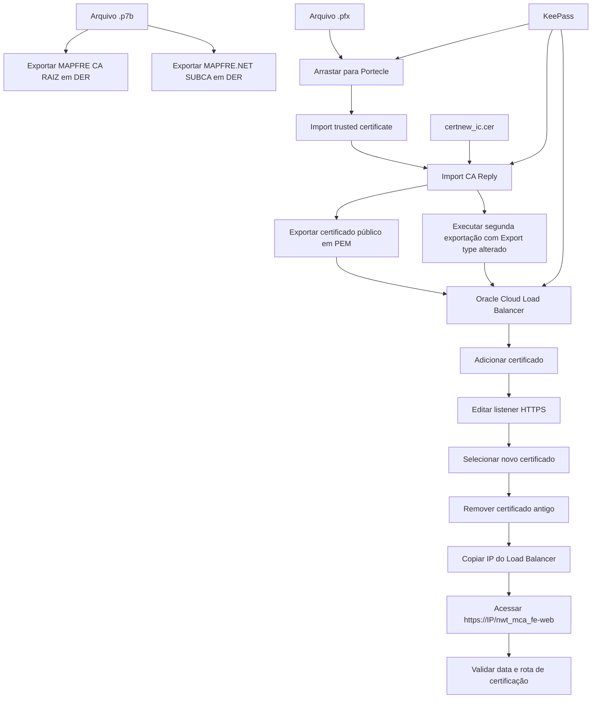

# Instalação e Verificação de Certificados em Load Balancer Oracle Cloud

## 1. Metadados do Documento
- **Arquivo de Origem:** Não identificado no conteúdo extraído
- **Tipo de Documento:** Procedimento
- **Domínio / Sistema:** Load Balancer Oracle Cloud; documentação Reef / Mapfre
- **Público-Alvo:** Operação, CloudOps e administradores de infraestrutura
- **Data/Versão Identificada:** Não identificada

---

## 2. Resumo Executivo & Contexto de Negócio

O documento descreve o procedimento para instalar certificados previamente gerados em um Load Balancer. O processo cobre a preparação dos certificados, a importação e exportação por meio da ferramenta Portecle, a instalação no console do Oracle Cloud Infrastructure e a validação posterior do certificado publicado.

A etapa de preparação exige exportar certificados de autoridade certificadora, especificamente `MAPFRE CA RAIZ` e `MAPFRE.NET SUBCA`, no formato DER. Em seguida, o certificado `.pfx` deve ser manipulado no Portecle usando uma senha armazenada no KeePass, com importação de certificados confiáveis e de uma resposta de CA.

O certificado público deve ser exportado em formato PEM, além de outra exportação com alteração do parâmetro `Export type`. Os artefatos gerados são utilizados para registrar o novo certificado no Load Balancer: o arquivo `.cer`, o nome associado ao arquivo `.pfx`, a senha do KeePass e o certificado privado exportado em PEM.

Após a instalação, o listener HTTPS deve ser atualizado para apontar para o novo certificado. Somente depois dessa alteração o certificado anterior configurado no Load Balancer deve ser removido. A validação consiste em acessar uma URL usando o endereço IP do Load Balancer e verificar tanto a data do certificado quanto o estado `Certificado Válido` na rota de certificação.

---

## 3. Arquitetura, Componentes & Tecnologias Envolvidas

### Componentes identificados

| Componente / Tecnologia | Função no procedimento |
| :--- | :--- |
| Load Balancer | Componente no qual o novo certificado é instalado e associado ao listener HTTPS. |
| Oracle Cloud | Console acessado para administrar o Load Balancer. |
| Portecle | Ferramenta usada para importar certificados, importar CA Reply e exportar certificados. |
| KeePass | Repositório indicado para obtenção da senha do certificado. |
| Certificado `.p7b` | Arquivo aberto inicialmente para exportação de certificados de autoridade. |
| Certificado `.pfx` | Arquivo arrastado para o Portecle; seu nome é usado no campo `Certificate Name`. |
| Certificado `.cer` | Certificado exportado e selecionado ao adicionar o certificado no Load Balancer. |
| Certificado PEM | Certificado privado exportado e adicionado ao Load Balancer. |
| `MAPFRE CA RAIZ` | Certificado de autoridade a ser exportado em formato DER. |
| `MAPFRE.NET SUBCA` | Segundo certificado de autoridade a ser exportado em formato DER. |
| `certnew_ic.cer` | Arquivo importado pela opção `import CA Reply`. |
| Listener HTTPS | Listener do Load Balancer que deve ser atualizado para usar o novo certificado. |
| Ambiente INT | Ambiente selecionado no exemplo apresentado no console do Oracle Cloud. |
| Endpoint `nwt_mca_fe-web` | Caminho utilizado para validar o certificado pelo endereço IP do Load Balancer. |



**Nota de Análise:** O documento não detalha o tipo exato de cada exportação posterior à mudança do parâmetro `Export type`, os algoritmos criptográficos, a validade esperada, o nome do Load Balancer, métodos de automação, APIs ou políticas de rotação de certificados.

---

## 4. Regras de Negócio, Especificações Funcionais & Processos

### Processo 1 — Guardar e preparar certificados

1. Abrir o arquivo `.p7b` com duplo clique.
2. Navegar até a pasta de certificados.
3. Clicar com o botão direito na pasta `MAPFRE CA RAIZ` e selecionar a opção de exportação.
4. Avançar pelas telas do assistente de exportação.
5. Manter o formato `DER`.
6. Usar a opção de procurar/localizar arquivo (`Examinar`).
7. Salvar o certificado com o nome `MAPFRE CA RAIZ.cer`.
8. Repetir a exportação para o certificado seguinte.
9. Atribuir ao segundo certificado o nome `MAPFRE.NET SUBCA`.
10. Na pasta dos certificados, selecionar o arquivo `.pfx` e arrastá-lo para o Portecle.
11. Fornecer ao Portecle a senha armazenada no KeePass.
12. Selecionar a opção `import trusted certificate`.
13. Importar o certificado selecionado e confirmar positivamente todas as janelas apresentadas.
14. Repetir a mesma ação para o outro certificado.
15. Selecionar a opção `import CA Reply`.
16. Importar o arquivo `certnew_ic.cer`.
17. Copiar novamente a senha do KeePass e fornecê-la ao Portecle.
18. Exportar o certificado público no formato PEM.
19. Salvar o arquivo com o mesmo nome, removendo a parte indicada na captura do documento.
20. Executar uma segunda exportação, alterando o parâmetro `Export type`.
21. Quando solicitado, informar a senha armazenada no KeePass.
22. Salvar o resultado removendo a parte indicada na captura do documento.

### Processo 2 — Instalar certificados no Load Balancer

1. Acessar o console de Load Balancers no Oracle Cloud pela URL indicada no documento.
2. Abrir o seletor de ambiente.
3. Selecionar o ambiente `INT`, conforme o exemplo documentado.
4. Selecionar o Load Balancer exibido.
5. Acessar a seção `certificates`.
6. Selecionar `Load Balancer certificate`.
7. Selecionar `Add certificate`.
8. Selecionar `Select one`.
9. Escolher o certificado `.cer` exportado anteriormente.
10. No campo `Certificate Name`, informar o nome do arquivo `.pfx`.
11. Garantir que o nome do novo certificado não seja igual ao nome do certificado atualmente configurado.
12. Informar a senha armazenada no KeePass.
13. Adicionar o certificado privado exportado anteriormente no formato PEM.
14. Selecionar `Add Certificate`.
15. Aguardar o aceite do certificado pelo Load Balancer e fechar a janela.

### Processo 3 — Atualizar o listener HTTPS e remover o certificado anterior

1. Acessar a aba `listeners`.
2. Localizar o listener cujo protocolo é `HTTPS`.
3. Editar o listener HTTPS.
4. Informar o novo certificado.
5. Salvar as alterações.
6. Retornar a `Load Balancer certificate`.
7. Remover o certificado antigo que estava configurado.

### Processo 4 — Verificar o certificado

1. Acessar o Load Balancer.
2. Copiar o endereço IP do Load Balancer.
3. Construir e acessar a URL no padrão `https://XX.XX.XX.XX/nwt_mca_fe-web`.
4. Após o carregamento, selecionar `No seguro`.
5. Acessar o alerta apresentado.
6. Abrir o certificado.
7. Confirmar que a data apresentada foi atualizada.
8. Na aba de rota de certificação, confirmar a indicação `Certificado Válido`.

### Restrições e dependências operacionais

- A senha necessária para operações no Portecle e no console do Load Balancer é obtida no KeePass.
- O nome inserido em `Certificate Name` não pode coincidir com o nome do certificado atual.
- A remoção do certificado antigo deve ocorrer após a associação do novo certificado ao listener HTTPS.
- A validação exige o endereço IP do Load Balancer e o caminho `/nwt_mca_fe-web`.
- O documento apresenta o ambiente `INT` como exemplo; não descreve procedimentos específicos para outros ambientes.

---

## 5. Tabelas de Parâmetros, Ambientes e Estruturas de Dados

| Item / Parâmetro | Descrição / Função | Tipo / Valores / Formato | Ambiente / Observações |
| :--- | :--- | :--- | :--- |
| `MAPFRE CA RAIZ` | Certificado de autoridade a ser exportado. | Exportação em formato DER; nome de saída `MAPFRE CA RAIZ.cer`. | Preparação dos certificados. |
| `MAPFRE.NET SUBCA` | Segundo certificado de autoridade a ser exportado. | Nome indicado: `MAPFRE.NET SUBCA`. | Preparação dos certificados. |
| Arquivo de origem | Arquivo aberto inicialmente. | `.p7b`. | Deve ser aberto com duplo clique. |
| Certificado de importação | Certificado manipulado no Portecle. | `.pfx`. | Arrastado para o Portecle; exige senha do KeePass. |
| `certnew_ic.cer` | Arquivo importado como resposta de CA. | `.cer`. | Usado na opção `import CA Reply`. |
| `Import trusted certificate` | Opção do Portecle para importar certificado confiável. | Ação no Portecle. | Confirmar todas as janelas apresentadas. |
| `Import CA Reply` | Opção do Portecle para importar resposta da autoridade certificadora. | Ação no Portecle. | Importar `certnew_ic.cer`. |
| Certificado público | Certificado exportado para instalação no Load Balancer. | Formato PEM. | O documento orienta remover uma parte do nome, não identificada no texto extraído. |
| Certificado privado | Certificado associado à criação do certificado no Load Balancer. | Formato PEM. | Adicionado juntamente com o certificado `.cer`. |
| `Export type` | Parâmetro modificado em uma segunda exportação. | Valor não identificado. | O documento não informa o valor selecionado. |
| `Certificate Name` | Nome atribuído ao certificado no Load Balancer. | Nome do arquivo `.pfx`. | Não pode ser igual ao nome do certificado atual. |
| Senha | Senha utilizada para importação e instalação. | Valor armazenado no KeePass. | Não exposta no documento. |
| Oracle Cloud Load Balancer | Console de administração do Load Balancer. | `https://cloud.oracle.com/load-balancer/load-balancers?region=us-ashburn-1` | URL indicada no procedimento. |
| Região Oracle Cloud | Região presente na URL do console. | `us-ashburn-1`. | Extraída da URL informada. |
| Ambiente | Ambiente escolhido no exemplo. | `INT`. | O documento não descreve outros ambientes. |
| Listener | Configuração de atendimento do Load Balancer. | Protocolo `HTTPS`. | Deve apontar para o novo certificado. |
| URL de validação | Endpoint para conferir a atualização do certificado. | `https://XX.XX.XX.XX/nwt_mca_fe-web`. | Substituir `XX.XX.XX.XX` pelo IP do Load Balancer. |
| Estado esperado | Resultado esperado na rota de certificação. | `Certificado Válido`. | Verificação final. |

---

## 6. Bateria de Perguntas & Respostas para RAG (FAQ Sintético)

### P1: Qual é o objetivo do procedimento documentado?
**R:** O procedimento descreve como preparar, instalar, associar e validar certificados em um Load Balancer. O fluxo inclui exportar certificados, utilizar o Portecle, registrar o certificado no Oracle Cloud, atualizar o listener HTTPS, remover o certificado anterior e verificar a validade da publicação.

### P2: Quais certificados de autoridade devem ser exportados no início do processo?
**R:** O documento orienta exportar os certificados `MAPFRE CA RAIZ` e `MAPFRE.NET SUBCA`. Para `MAPFRE CA RAIZ`, o formato indicado é DER e o nome de saída é `MAPFRE CA RAIZ.cer`.

### P3: Qual é o formato de exportação indicado para o certificado MAPFRE CA RAIZ?
**R:** O certificado `MAPFRE CA RAIZ` deve ser exportado em formato DER. O documento orienta salvar o arquivo como `MAPFRE CA RAIZ.cer`.

### P4: Onde deve ser obtida a senha usada no Portecle e no Load Balancer?
**R:** A senha deve ser obtida no KeePass. O documento informa que a senha é solicitada ao arrastar o arquivo `.pfx` para o Portecle, ao importar a resposta de CA, na exportação posterior e durante a adição do certificado no Load Balancer.

### P5: Qual arquivo deve ser importado usando a opção `import CA Reply` no Portecle?
**R:** A opção `import CA Reply` deve ser usada para importar o arquivo `certnew_ic.cer`. Depois da importação, o procedimento orienta copiar e informar novamente a senha armazenada no KeePass.

### P6: Qual certificado deve ser selecionado ao adicionar um certificado ao Load Balancer?
**R:** Deve ser selecionado o certificado `.cer` exportado anteriormente. Além disso, é necessário informar a senha do KeePass e adicionar o certificado privado exportado previamente no formato PEM.

### P7: Como deve ser preenchido o campo `Certificate Name` no Oracle Cloud?
**R:** O campo `Certificate Name` deve receber o nome do arquivo `.pfx`. O nome definido não pode ser igual ao nome do certificado atualmente configurado no Load Balancer.

### P8: Em qual ambiente o documento exemplifica a instalação do certificado?
**R:** O procedimento exemplifica a instalação no ambiente `INT`. O conteúdo não detalha diferenças, endereços ou regras para outros ambientes.

### P9: Qual configuração precisa ser atualizada após a inclusão do novo certificado?
**R:** O listener cujo protocolo é `HTTPS` precisa ser editado para utilizar o novo certificado. Após selecionar o novo certificado, as alterações devem ser salvas.

### P10: Quando o certificado antigo pode ser removido?
**R:** O certificado antigo deve ser removido após o novo certificado ser adicionado ao Load Balancer e associado ao listener HTTPS. O documento orienta retornar à opção `Load Balancer certificate` para remover o certificado anterior.

### P11: Qual URL deve ser usada para validar o certificado instalado?
**R:** A URL de validação segue o padrão `https://XX.XX.XX.XX/nwt_mca_fe-web`, substituindo `XX.XX.XX.XX` pelo endereço IP copiado do Load Balancer.

### P12: Quais evidências confirmam que o certificado foi atualizado corretamente?
**R:** A validação deve confirmar que a data do certificado está atualizada e que a aba de rota de certificação apresenta o estado `Certificado Válido`.

---

## 7. Glossário de Termos, Siglas & Conceitos-Chave

- **CA:** Autoridade certificadora. O documento apresenta certificados `MAPFRE CA RAIZ` e `MAPFRE.NET SUBCA`.
- **CA Reply:** Opção do Portecle usada para importar uma resposta de autoridade certificadora.
- **Certificate Name:** Campo do Oracle Cloud para nomear o certificado inserido no Load Balancer.
- **DER:** Formato de exportação utilizado para o certificado `MAPFRE CA RAIZ`.
- **INT:** Ambiente selecionado no exemplo de instalação no console Oracle Cloud.
- **KeePass:** Local indicado para armazenar e recuperar a senha do certificado.
- **Listener:** Configuração do Load Balancer que recebe tráfego; o documento instrui editar o listener HTTPS.
- **Load Balancer:** Componente de infraestrutura no qual os certificados são instalados e associados.
- **PEM:** Formato do certificado público exportado e do certificado privado adicionado ao Load Balancer.
- **PFX:** Arquivo de certificado importado no Portecle e cujo nome é utilizado no campo `Certificate Name`.
- **PKCS#7 / `.p7b`:** Arquivo aberto inicialmente para realizar a exportação de certificados.
- **Portecle:** Ferramenta usada para importar certificados, importar CA Reply e exportar certificados.
- **SUBCA:** Certificado de autoridade subordinada, representado no documento por `MAPFRE.NET SUBCA`.

---

## 8. Notas Críticas, Riscos & Limitações

- **Gestão de senha:** O procedimento depende da senha mantida no KeePass. A indisponibilidade, expiração ou uso incorreto da senha bloqueia a importação, a exportação e a instalação do certificado.
- **Conflito de nomenclatura:** O `Certificate Name` não pode ser igual ao nome do certificado atual; usar um nome repetido pode impedir ou confundir a substituição.
- **Ordem de troca:** O certificado antigo só deve ser removido após o novo certificado ser associado ao listener HTTPS. A remoção antecipada pode comprometer a disponibilidade do endpoint HTTPS.
- **Validação obrigatória:** A verificação deve incluir a data atualizada e o estado `Certificado Válido` na rota de certificação.
- **Ambientes não documentados:** O conteúdo mostra a seleção do ambiente `INT`, mas não descreve procedimentos, URLs ou nomes de Load Balancers para outros ambientes.
- **Detalhamento técnico incompleto:** O documento não especifica algoritmos criptográficos, cadeia completa, tamanho de chaves, prazos de validade, valores do segundo `Export type`, políticas de rollback, monitoramento ou automação.
- **Dependência de elementos visuais:** Algumas instruções dependem de trechos “selecionados” em capturas de tela, que não estão identificados textualmente na extração.

---

## 9. Conteúdo Bruto Estruturado (Referência Fiel)

```text
--- [PÁGINA 1 DE 16] ---

Instalación de certicados en Load Balanced
Índice
Introducción
Pasos a seguir
- 1. Guardar certicados
- 2. Instalar certicados
- 3. Vericar certicados
Introduccón
Este documento detalla los pasos necesarios para instalar certicados generados previamente en Load Balancers. Si aún no tiene el
certicado generado, consulte el siguiente documento:
Generar solicitud de certicado
Pasos a seguir
1. Guardar certicados
Abrimos el archivo .p7b con doble clic:
Hacemos clic en la siguiente ruta:
Documentation / DOCUMENTACIÓN Reef
DOCUMENTACIÓN Reef
Mapfredocument
DOCUMENTACIÓN Reef
Owner
user:agonzalez_mapfre.com
Lifecycle
Approved Source
 / 
 VL
Buscar Inicio Soluciones Arquitecturas APIs Componentes Cloud Documentación Zeus Reef Ayuda
ES


--- [PÁGINA 2 DE 16] ---

Vamos a carpeta certicados:
Clic derecho sobre la carpeta MAPFRE CA RAIZ y le damos a exportar:
Pinchar en Siguiente:
Pinchar en Siguiente, lo dejamos en formato DER:


--- [PÁGINA 3 DE 16] ---

Pinchar en Examinar:
Lo llamamos MAPFRE CA RAIZ.cer:
Pinchamos en Siguiente:


--- [PÁGINA 4 DE 16] ---

Hacemos lo mismo con el siguiente certicado:
Le ponemos el nombre de MAPFRE.NET SUBCA:
En la ruta de los certicados, seleccionamos el archivo .pfx y lo arrastramos al portecle, no pedirá una contraseña que estará almacenada en
el keepass:


--- [PÁGINA 5 DE 16] ---

Copiamos la pass
La pegamos en el Portecle:
Le damos a import trusted certicate :
Importamos el certicado seleccionado y le damos sí a todas las ventanas que nos salgan:


--- [PÁGINA 6 DE 16] ---

Repetimos la misma acción con el otro certicado:
Ahora vamos a la opción donde dice import CA Reply:
Importamos el certnew_ic.cer:
Copiamos y pegamos nuevamente la contraseña del keepass al portecle:


--- [PÁGINA 7 DE 16] ---

Exportamos el certicado:
Dejamos la siguiente conguración, se trata del certicado público en formato PEM:
Lo llamamos tal cual pero le quitamos la parte seleccionada:
Nuevamente hacemos otro export, pero esta vez cambiando el parámetro Export type:


--- [PÁGINA 8 DE 16] ---

Nos pide introducir la contraseña en la cual pondremos la que tenemos en el keepass:
Guardamos quitando la parte seleccionada:
2. Instalar certicados en el Load Balancer
Una vez hecho esto, se guarda e instalamos el certicado en el Load Balancer.
https://cloud.oracle.com/load-balancer/load-balancers?region=us-ashburn-1
Abrimos el desplegable y en este caso vamos a INT como se ve en la captura:


--- [PÁGINA 9 DE 16] ---

Hacemos click en el load balancer que nos sale:
Vamos a certicates:


--- [PÁGINA 10 DE 16] ---

Load Balancer certicate:
Add certicate:
Pulsamos en Select one:


--- [PÁGINA 11 DE 16] ---

Seleccionamos el certicado .cer que exportamos anteriormente:
En Certicate Name, le ponemos el nombre de archivo .pfx, teniendo en cuenta que no tenga el mismo nombre que el certicado actual:
Le guardamos la contraseña almacenada en el keepass:
Finalmente añadimos el certicado privado (el certicado que exportamos anteriormente en formato PEM) y pulsamos en Add Certicate:


--- [PÁGINA 12 DE 16] ---

Esperamos hasta que nos acepte el certicado y cerramos la ventana:
Vamos a la pestaña listeners:


--- [PÁGINA 13 DE 16] ---

En el de Protocolo HTTPS, lo editamos:
Introducimos el nuevo certicado y le damos a guardar cambios:


--- [PÁGINA 14 DE 16] ---

Ahora, tendremos que borrar el certicado que ya estaba congrado. Para ello, pinchamos de nuevo en Load Balancer certicate:
Borramos el viejo:


--- [PÁGINA 15 DE 16] ---

3. Vericar certicado
Para comprobar que el certicado esté bien vamos al Load Balancer y copiamos la IP:
La introducimos en la siguiente URL:
https://XX.XX.XX.XX/nwt_mca_fe-web
Una vez cargado, clicamos en “No seguro”, luego en la alerta:
Entramos en el certicado:


--- [PÁGINA 16 DE 16] ---

Para comprobar que el certicado se ha actualizado correctamente, vemos que la fecha está actualizada:
Y que en la pestaña de Ruta de Certicación ponga Certicado Válido:
Información recuperada de:
https://mapfrealm.atlassian.net/wiki/spaces/PPQ/pages/8714739871320019394/CloudOpsInstalar+Certicados+en+los+Load+Balancer
```
