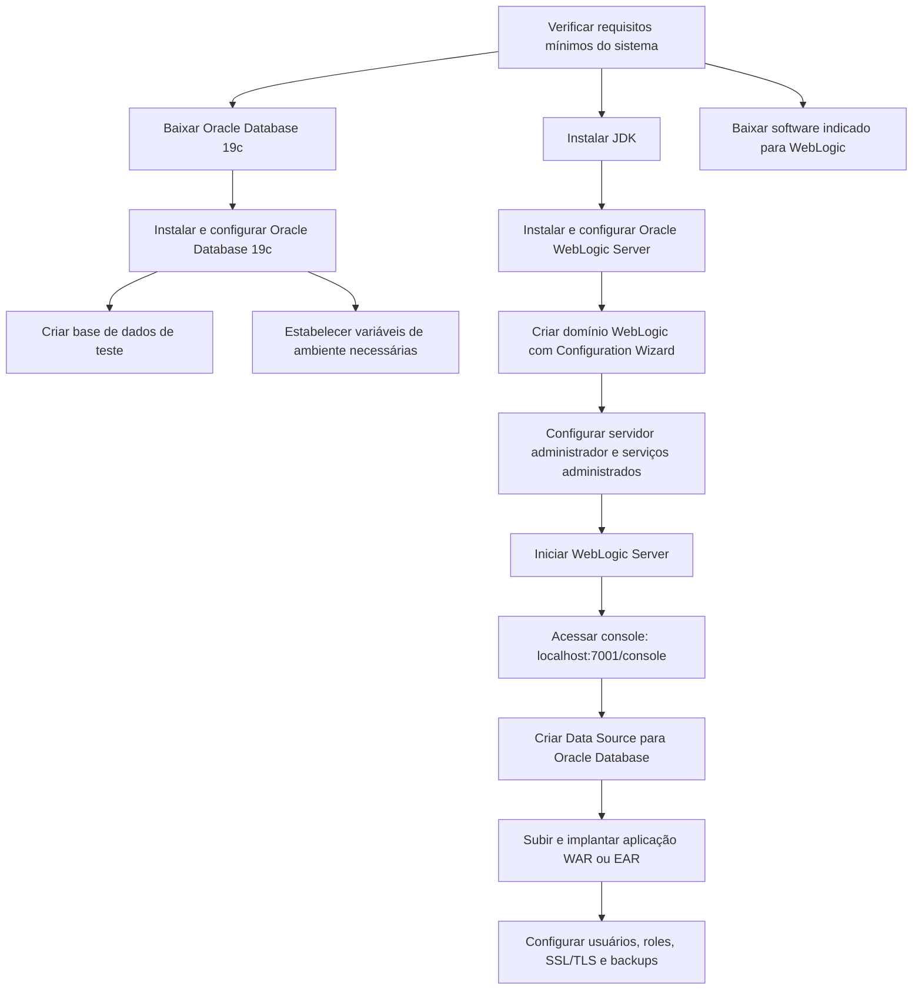
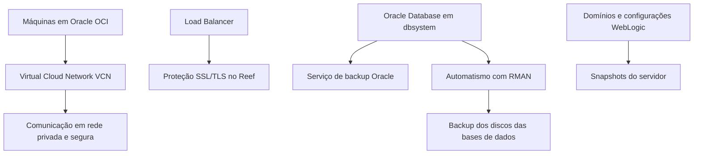

# Procedimento de Criação de Ambiente com Oracle Database 19c e Oracle WebLogic Server

## 1. Metadados do Documento
- **Arquivo de Origem:** Não identificado no conteúdo extraído
- **Tipo de Documento:** Procedimento
- **Domínio / Sistema:** Reef; Oracle OCI; Oracle Database; Oracle WebLogic Server
- **Público-Alvo:** Não identificado expressamente; o conteúdo é orientado à instalação, configuração, operação e segurança de ambiente Oracle
- **Data/Versão Identificada:** Não identificada
- **Proprietário identificado no conteúdo:** `user:agonzalez_mapfre.com`
- **Lifecycle identificado no conteúdo:** `Approved Source`

---

## 2. Resumo Executivo & Contexto de Negócio

O documento descreve um procedimento para montar um ambiente utilizando **Oracle Database 19c** como banco de dados e **Oracle WebLogic Server** como servidor de aplicações. O procedimento está dividido em cinco etapas: pré-requisitos, instalação do banco de dados, instalação do servidor de aplicações, configuração e implantação de aplicações, e segurança e backup.

No contexto do **Reef**, as instalações de bancos de dados e servidores de aplicações não são realizadas manualmente. O documento informa que o ambiente utiliza a nuvem **Oracle OCI**. Ainda assim, o material considera vital conhecer as etapas de instalação manual para cenários em que máquinas em nuvem não estejam disponíveis.

A implantação descrita inclui a validação de requisitos mínimos para Oracle Database e Oracle WebLogic Server, a instalação de um JDK necessário ao WebLogic Server, a criação de uma base de dados de teste e a configuração das variáveis de ambiente necessárias. Para WebLogic Server, o processo inclui a criação e configuração de um domínio por meio do **Configuration Wizard**.

A etapa de configuração e implantação orienta o acesso à console administrativa do WebLogic Server em `http://localhost:7001/console`, a criação de uma fonte de dados para conexão com Oracle Database e o deployment de uma aplicação de exemplo nos formatos WAR ou EAR. A segurança considera usuários, roles e SSL/TLS; no Reef, a terminação SSL/TLS ocorre no balanceador de carga.

O documento também descreve o modelo de backup do Reef em Oracle OCI. O backup de banco de dados é fornecido no nível de `dbsystem`, complementado por um automatismo baseado na ferramenta RMAN para discos das bases de dados. Para domínios e configurações WebLogic, os backups são realizados por meio de snapshots do servidor.

---

## 3. Arquitetura, Componentes & Tecnologias Envolvidas

### Componentes, plataformas e ferramentas identificadas

| Componente / Tecnologia | Papel descrito no documento | Observações |
| :--- | :--- | :--- |
| Oracle Database 19c | Base de dados do ambiente | Deve ser instalada, configurada e utilizada para criar uma base de dados de teste. |
| Oracle WebLogic Server | Servidor de aplicações | Deve ser instalado, configurado e ter um domínio criado pelo Configuration Wizard. |
| JDK | Pré-requisito de instalação | Necessário para instalar Oracle WebLogic Server. |
| Oracle OCI | Plataforma de nuvem utilizada pelo Reef | No Reef, bancos de dados e servidores de aplicações são disponibilizados na OCI, em vez de instalados manualmente. |
| Virtual Cloud Network (VCN) | Rede privada entre máquinas OCI | Máquinas OCI comunicam-se em uma rede privada e segura. |
| Load Balancer | Ponto de proteção SSL/TLS no Reef | A proteção SSL/TLS é realizada nesse componente. |
| WebLogic Administration Console | Console de administração do WebLogic | Acesso indicado por `http://localhost:7001/console`. |
| Data Source | Fonte de dados WebLogic | Configurada para conectar o WebLogic Server ao Oracle Database. |
| RMAN | Ferramenta integral de backup | Utilizada por automatismo para executar backups dos discos das bases de dados. |
| Serviço de backup Oracle | Serviço de backup de banco de dados | Utilizado no Reef, no nível de `dbsystem`. |
| Snapshots do servidor | Mecanismo de backup WebLogic | Utilizado para backups de domínios e configurações WebLogic. |
| WAR / EAR | Formatos de aplicação | O procedimento orienta o upload e deployment de uma aplicação de exemplo nesses formatos. |

### Fluxo de instalação, configuração e operação



### Fluxo de segurança e backup no contexto Reef



> **Nota de Análise:** O documento menciona Oracle Database 19c, Oracle WebLogic Server, JDK, OCI, VCN, Load Balancer, RMAN e snapshots, mas não especifica sistemas operacionais, topologia de cluster, versões do JDK, credenciais, nomes de domínio, nomes de Data Sources, contratos de aplicações ou comandos de instalação.

---

## 4. Regras de Negócio, Especificações Funcionais & Processos

### Etapa 1 — Pré-requisitos

#### Objetivos
1. Entender as necessidades do sistema.
2. Verificar que o sistema cumpre os requisitos.
3. Instalar as ferramentas necessárias.

#### Atividades
1. Verificar que o sistema cumpre os requisitos mínimos para instalar Oracle Database.
2. Consultar a checklist de instalação Oracle Database indicada no documento.
3. Verificar que o sistema cumpre os requisitos mínimos para instalar Oracle WebLogic Server.
4. Consultar os requisitos e especificações de sistema WebLogic indicados no documento.
5. Instalar o JDK necessário para a instalação do Oracle WebLogic Server.
6. Após a verificação dos requisitos mínimos, baixar Oracle Database 19c.
7. Após a verificação dos requisitos mínimos, baixar o software indicado na URL Oracle Fusion Middleware.

> **Nota de Análise:** A atividade 5 da extração afirma novamente “baixar Oracle Database 19c”, mas apresenta uma URL de downloads do Oracle Fusion Middleware. O documento não esclarece explicitamente a discrepância textual.

### Etapa 2 — Instalação de Oracle Database 19c

#### Objetivos
1. Instalar Oracle Database 19c.
2. Configurar Oracle Database 19c.

#### Atividades
1. Extrair o arquivo baixado e executar o instalador.
2. Seguir as instruções do instalador para configurar a base de dados.
3. Criar uma base de dados de teste.
4. Estabelecer as variáveis de ambiente necessárias.

> **Nota de Análise:** O procedimento não detalha os nomes das variáveis de ambiente, parâmetros de instalação, configurações do banco de dados ou características da base de dados de teste.

### Etapa 3 — Instalação de Oracle WebLogic Server

#### Objetivos
1. Instalar WebLogic Server.
2. Configurar WebLogic Server.

#### Atividades
1. Extrair o arquivo baixado e executar o instalador.
2. Criar um domínio WebLogic utilizando o **Configuration Wizard**.
3. Configurar o domínio WebLogic.
4. Configurar o servidor administrador e os serviços administrados conforme necessário.
5. Definir o nome do domínio e a rota de instalação.

> **Nota de Análise:** O documento não identifica os Managed Servers, nomes de domínio, rotas de instalação, portas administrativas adicionais ou configurações específicas do servidor administrador.

### Etapa 4 — Configuração e Deployment de Aplicações

#### Objetivos
1. Configurar o ambiente WebLogic.
2. Implantar uma aplicação de exemplo.

#### Atividades
1. Iniciar Oracle WebLogic Server.
2. Acessar a console de administração por `http://localhost:7001/console`.
3. Realizar login com as credenciais configuradas durante a criação do domínio.
4. Criar uma fonte de dados pela navegação `Services -> Data Sources -> New`.
5. Configurar a nova fonte de dados para conectar com Oracle Database.
6. Fazer upload e deployment de uma aplicação de exemplo nos formatos WAR ou EAR.

> **Nota de Análise:** O documento não define URL JDBC, driver, usuário de banco de dados, JNDI name, estratégia de pool de conexões, nome da aplicação de exemplo ou critérios de validação do deployment.

### Etapa 5 — Segurança e Backup

#### Objetivos
1. Configurar segurança básica.
2. Implementar procedimentos de backup e recuperação.

#### Atividades de segurança
1. Estabelecer usuários e roles no Oracle WebLogic.
2. Configurar SSL/TLS para Oracle WebLogic Server.
3. No Reef, aplicar proteção SSL/TLS no nível de Load Balancer.
4. Utilizar a VCN para comunicação entre máquinas OCI em rede privada e segura.
5. Consultar o documento “Generar solicitud certificado (CSR)” para solicitar certificado.
6. Consultar o documento “Instalar certificado en un Load Balancer” para instalar certificado no Load Balancer.

#### Atividades de backup
1. Configurar backup automático da base de dados.
2. No Reef, utilizar o serviço de backup Oracle no nível de `dbsystem`.
3. Utilizar o automatismo com RMAN para backups dos discos das bases de dados.
4. Configurar políticas de backup para domínios e configurações WebLogic.
5. No Reef, realizar backup de domínios e configurações WebLogic por snapshots do servidor.

> **Nota de Análise:** O documento não estabelece periodicidade, retenção, RPO, RTO, procedimento de restauração, procedimento de teste de recuperação, política de rotação de certificados ou requisitos de controle de acesso.

---

## 5. Tabelas de Parâmetros, Ambientes e Estruturas de Dados

| Item / Parâmetro | Descrição / Função | Tipo / Valores / Formato | Ambiente / Observações |
| :--- | :--- | :--- | :--- |
| Banco de dados | Base de dados utilizada no ambiente | Oracle Database 19c | Deve ser instalada e configurada; inclui criação de base de dados de teste. |
| Servidor de aplicações | Servidor utilizado para aplicações | Oracle WebLogic Server | Deve ter domínio criado e configurado. |
| Pré-requisito Java | Ferramenta necessária à instalação do WebLogic | JDK | O documento fornece URL Oracle para download. |
| URL da console WebLogic | Acesso administrativo ao WebLogic Server | `http://localhost:7001/console` | Requer credenciais configuradas durante a criação do domínio. |
| Criação de Data Source | Navegação na console administrativa | `Services -> Data Sources -> New` | A fonte de dados deve conectar ao Oracle Database. |
| Aplicação de exemplo | Artefato de deployment | WAR ou EAR | O documento não informa nome, versão ou conteúdo da aplicação. |
| Domínio WebLogic | Unidade de configuração WebLogic | Nome e rota de instalação definidos durante a configuração | Criado por meio do Configuration Wizard. |
| Servidor administrador | Componente administrativo do domínio | Configurado conforme necessário | Sem nome, porta ou parâmetros especificados. |
| Serviços administrados | Serviços administrados do domínio | Configurados conforme necessário | O documento não detalha quantidade ou configuração. |
| Proteção de transporte | Segurança de comunicação WebLogic | SSL/TLS | No Reef, implementada no Load Balancer. |
| Certificado | Artefato para SSL/TLS | CSR e certificado | O documento referencia procedimentos separados para geração de CSR e instalação em Load Balancer. |
| Rede OCI | Conectividade entre máquinas OCI | Virtual Cloud Network (VCN) | Comunicação em rede privada e segura. |
| Backup do banco de dados | Proteção de dados Oracle Database | Serviço Oracle no nível de `dbsystem` | Aplicável ao contexto Reef em OCI. |
| Backup de discos de banco | Backup dos discos das bases de dados | Automatismo com RMAN | O documento não apresenta agenda ou retenção. |
| Backup WebLogic | Backup de domínios e configurações | Snapshots do servidor | Modelo utilizado no Reef. |
| Requisitos Oracle Database | Checklist de instalação | URL Oracle | `https://docs.oracle.com/en/database/oracle/oracle-database/21/ntdbi/oracle-database-installation-checklist.html` |
| Requisitos WebLogic | Requisitos e especificações do sistema | URL Oracle | `https://docs.oracle.com/en/middleware/standalone/weblogic-server/14.1.1.0/sysrs/system-requirements-and-specifications.html#GUID-A077A2B4-5967-42E0-A063-0F7A0A2254FB` |
| Download JDK | Fonte de instalação do JDK | URL Oracle | `https://www.oracle.com/java/technologies/downloads/?er=221886` |
| Download Oracle Database | Fonte de download Oracle Database 19c | URL Oracle | `https://www.oracle.com/es/database/technologies/oracle-database-software-downloads.html` |
| Download Fusion Middleware | URL apresentada na atividade 5 dos pré-requisitos | URL Oracle | `https://www.oracle.com/es/middleware/technologies/fusionmiddleware-downloads.html` |

---

## 6. Bateria de Perguntas & Respostas para RAG (FAQ Sintético)

### P1: Qual é o objetivo do procedimento de criação de ambiente Oracle?
**R:** O procedimento descreve as etapas para montar um ambiente com Oracle Database 19c como base de dados e Oracle WebLogic Server como servidor de aplicações. As etapas abrangem pré-requisitos, instalação do banco, instalação do WebLogic, deployment de aplicações, segurança e backup.

### P2: As instalações de banco de dados e WebLogic são realizadas manualmente no Reef?
**R:** Não. O documento informa que, no Reef, as instalações de bases de dados e servidores de aplicações não são realizadas manualmente, porque é utilizada a nuvem Oracle OCI. O procedimento manual é apresentado para que as etapas sejam conhecidas caso não existam máquinas em nuvem disponíveis.

### P3: Quais verificações devem ser feitas antes de instalar Oracle Database e Oracle WebLogic Server?
**R:** Deve-se verificar se o sistema cumpre os requisitos mínimos para Oracle Database e para Oracle WebLogic Server. O documento fornece uma URL Oracle para a checklist de instalação do banco de dados e outra URL Oracle para os requisitos e especificações do WebLogic Server.

### P4: Por que o JDK deve ser instalado antes do Oracle WebLogic Server?
**R:** O documento estabelece que o JDK é necessário para a instalação do Oracle WebLogic Server. A etapa de pré-requisitos inclui uma URL Oracle para download do JDK.

### P5: Quais atividades são previstas na instalação do Oracle Database 19c?
**R:** O procedimento prevê extrair o arquivo baixado, executar o instalador, seguir suas instruções para configurar a base de dados, criar uma base de dados de teste e estabelecer as variáveis de ambiente necessárias.

### P6: Como o domínio Oracle WebLogic deve ser criado e configurado?
**R:** O domínio WebLogic deve ser criado utilizando o Configuration Wizard. Depois, o domínio deve ser configurado, incluindo o servidor administrador e os serviços administrados conforme necessário, além da definição do nome do domínio e da rota de instalação.

### P7: Qual URL deve ser usada para acessar a console de administração WebLogic?
**R:** A console de administração deve ser acessada por `http://localhost:7001/console`. O login deve utilizar as credenciais configuradas durante a criação do domínio WebLogic.

### P8: Como é criada uma fonte de dados para conectar WebLogic e Oracle Database?
**R:** Na console de administração WebLogic, deve-se navegar até `Services -> Data Sources -> New` e configurar uma nova fonte de dados para estabelecer conexão com Oracle Database.

### P9: Quais formatos de aplicação podem ser implantados como exemplo no WebLogic?
**R:** O documento indica que uma aplicação de exemplo pode ser carregada e implantada nos formatos WAR ou EAR.

### P10: Onde a proteção SSL/TLS é aplicada no ambiente Reef?
**R:** No Reef, a proteção SSL/TLS é realizada no nível do Load Balancer. As máquinas hospedadas em Oracle OCI comunicam-se por meio de uma Virtual Cloud Network, em uma rede privada e segura.

### P11: Como é realizado o backup da base de dados no Reef?
**R:** O documento informa que, por utilizar máquinas em Oracle OCI, o Reef usa um serviço de backup fornecido pela Oracle no nível de `dbsystem`. Além disso, existe um automatismo que utiliza a ferramenta RMAN para realizar backups dos discos das bases de dados.

### P12: Como são realizados backups de domínios e configurações WebLogic no Reef?
**R:** O backup de domínios e configurações WebLogic no Reef é realizado por meio de snapshots do servidor.

---

## 7. Glossário de Termos, Siglas & Conceitos-Chave

- **Oracle Database 19c:** Produto Oracle utilizado como base de dados no ambiente descrito.
- **Oracle WebLogic Server:** Servidor de aplicações utilizado para hospedar e administrar aplicações.
- **OCI:** Oracle Cloud Infrastructure; plataforma de nuvem Oracle utilizada no Reef.
- **JDK:** Java Development Kit; pré-requisito necessário para instalação do Oracle WebLogic Server.
- **VCN:** Virtual Cloud Network; rede que conecta as máquinas OCI em uma rede privada e segura.
- **SSL/TLS:** Protocolos de segurança utilizados para proteger comunicações; no Reef, a proteção ocorre no Load Balancer.
- **Load Balancer:** Componente no qual a proteção SSL/TLS é implementada no contexto Reef.
- **CSR:** Certificate Signing Request; solicitação de certificado referenciada no procedimento de implementação SSL/TLS.
- **RMAN:** Ferramenta integral utilizada pelo automatismo de backup dos discos das bases de dados.
- **dbsystem:** Nível no qual o serviço de backup Oracle é utilizado no Reef.
- **Configuration Wizard:** Ferramenta indicada para criação do domínio Oracle WebLogic.
- **Data Source:** Fonte de dados configurada no WebLogic para conexão com Oracle Database.
- **WAR:** Formato de aplicação web passível de upload e deployment no WebLogic.
- **EAR:** Formato de aplicação corporativa passível de upload e deployment no WebLogic.
- **Snapshot:** Mecanismo utilizado no Reef para backup de domínios e configurações WebLogic.
- **Servidor administrador:** Componente WebLogic a ser configurado durante a definição do domínio.
- **Serviços administrados:** Serviços WebLogic a serem configurados conforme necessário durante a definição do domínio.

---

## 8. Notas Críticas, Riscos & Limitações

- O documento declara que o Reef utiliza Oracle OCI e que instalações manuais de bancos de dados e servidores de aplicações não são a prática operacional normal.
- A atividade 5 dos pré-requisitos contém uma inconsistência textual: menciona novamente o download de Oracle Database 19c, mas fornece a URL de Oracle Fusion Middleware. O conteúdo não resolve essa divergência.
- Não foram identificadas versões de JDK, requisitos mínimos concretos de CPU, memória, armazenamento ou sistema operacional.
- Não foram informados parâmetros de Oracle Database, nomes de instância, schemas, credenciais, configurações de listener, URL JDBC, drivers ou nomes JNDI.
- Não foram informados nomes de domínio WebLogic, Managed Servers, portas além de `7001`, rotas de instalação ou parâmetros de cluster.
- O documento não fornece detalhes sobre usuários, roles, políticas de senha, controle de acesso, rotação de certificados ou configuração técnica de SSL/TLS.
- O documento não define frequência de backup, política de retenção, RPO, RTO, estratégia de recuperação, validação de backups ou testes de restauração.
- Os documentos “Generar solicitud certificado (CSR)” e “Instalar certificado en un Load Balancer” são referenciados, mas seu conteúdo não está presente na extração analisada.

---

## 9. Conteúdo Bruto Estruturado (Referência Fiel)

```text
--- [PÁGINA 1 DE 3] ---

CREACIÓN ENTORNO CON ORACLE DATABASE Y ORACLE WEBLOGIC
Índice
Introducción
Paso 1: Prerequisitos
- Objetivos
- Actividades
Paso 2: Instalacion de Oracle Database 19c
- Objetivos
- Actividades
Paso 3: Instalacion de Oracle WebLogic Server
- Objetivos
- Actividades
Paso 4: Configuración y despliegue de aplicaciones
- Objetivos
- Actividades
Paso 5: Seguridad y Backup
- Objetivos
- Actividades
Introducción
El presente documento indica los pasos necesarios para montar un entorno real utilizando Oracle Database 19c como base de datos y Oracle
Weblogic Server como servidor de aplicaciones.
Cabe mencionar que en reef las instalaciones de las bases de datos y los servidores de aplicaciones no se realizan manualmente, ya que se
hace uso de la nube de Oracle OCI. No obstante, es de vital importancia que se conozcan los pasos que habría que seguir en caso de que no
se disponga de máquinas en la nube.
Paso 1: Prerequisitos
Objetivos
Entender las necesidades del sistema
Verificar que el sistema cumple con estos requisitos
Instalar las herramientas necesarias
Actividades
Documentation / DOCUMENTACIÓN Reef
DOCUMENTACIÓN Reef
Mapfredocument
DOCUMENTACIÓN Reef
Owner
user:agonzalez_mapfre.com
Lifecycle
Approved Source
 / 
 VL
Buscar Inicio Soluciones Arquitecturas APIs Componentes Cloud Documentación Zeus Reef Ayuda
ES


--- [PÁGINA 2 DE 3] ---

1. Verificar que el sistema cumple con los requisitos mínimos para instalar Oracle Database. Se pueden encontrar estos requisitos en la
siguiente página web:
https://docs.oracle.com/en/database/oracle/oracle-database/21/ntdbi/oracle-database-installation-checklist.html
2. Verificar que el sistema cumple con los requisitos mínimos para instalar Oracle Weblogic Server. Se pueden encontrar estos requisitos en
la siguiente página web:
https://docs.oracle.com/en/middleware/standalone/weblogic-server/14.1.1.0/sysrs/system-requirements-and-specifications.html#GUID-
A077A2B4-5967-42E0-A063-0F7A0A2254FB
3. Instalar JDK, necesario para la instalación de Oracle Weblogic Server. Se puede instalar desde esta página web:
https://www.oracle.com/java/technologies/downloads/?er=221886
4. Una vez se haya verificado que el sistema cumple con los requisitos mínimos, descargar Oracle Database 19c. Se puede descargar desde
esta página web:
https://www.oracle.com/es/database/technologies/oracle-database-software-downloads.html
5. Una vez se haya verificado que el sistema cumple con los requisitos mínimos, descargar Oracle Database 19c. Se puede descargar desde
esta página web:
https://www.oracle.com/es/middleware/technologies/fusionmiddleware-downloads.html
Paso 2: Instalación de Oracle Database 19c
Objetivos
Instalar Oracle Database 19c
Configurar Oracle Database 19c
Actividades
1. Extraer el archivo descargado y ejecutar el instalador
2. Seguir las instrucciones del instalador para configurar la base de datos
3. Crear una base de datos de prueba
4. Establecer las variables de entorno necesarias
Paso 3: Instalación de Oracle WebLogic Server
Objetivos
Instalar WebLogic Server
Configurar WebLogic Server
Actividades
1. Extraer el archivo descargado y ejecutar el instalador
2. Crear un dominio de weblogic. Utiliza el Configuration Wizard
3. Configurar el dominio de weblogic
3.1 Configurar el servidor administrador y servicios administrados según sea necesario
3.2 Definir el nombre del dominio y la ruta de instalación
Paso 4: Configuración y despliegue de aplicaciones
Objetivos
Configurar el entorno WebLogic
Desplegar una aplicación de ejemplo
Actividades


--- [PÁGINA 3 DE 3] ---

1. Iniciar WebLogic Server
2. Acceder a la consola de administración a través de http://localhost:7001/console
3. Iniciar sesión con las credenciales configuradas durante la creación del dominio.
4. Crear una Fuente de Datos. En la consola de administración, ir a Services -> Data Sources -> New y configurar una nueva fuente de datos
para conectar a Oracle Database.
5. Subir y desplegar una aplicacion de ejemplo (WAR, EAR..)
Paso 5: Seguridad y Backup
Objetivos
Configurar seguridad básica
Implementar procedimientos de backup/recuperación
Actividades
1. Establecer usuarios y roles en Oracle WebLogic
2. Configurar protocolo SSL/TLS para WebLogic Server.
En reef, la protección SSL/TLS se realiza a nivel de balanceador de carga. Las máquinas que se encuentran en OCI, están conectadas entre sí
por medio de una Virtual Cloud Network (VCN), por lo que se comunican dentro de una red privada y segura.
Para solicitar un certificado y poder implementar SSL/TLS, consulte el siguiente documento:
Generar solicitud certificado (CSR)
Para instalar el certificado en un Load Balancer, consulte el siguiente documento:
Instalar certificado en un Load Balancer
3. Configurar backup automático de la base de datos.
En reef, al tener las máquinas en OCI, se hace uso de un servicio de backup que proporciona Oracle a nivel de dbsystem.
En cuanto al backup de los discos de las distintas bases de datos, se cuenta con un automatismo que, a través de la herramienta integral
RMAN, realiza backups de los discos de las bases de datos.
4. Configurar políticas de backup para los dominios y configuraciones de WebLogic.
En reef, la manera de realizar estos backups es tomando SNAPSHOTS del servidor.
```
