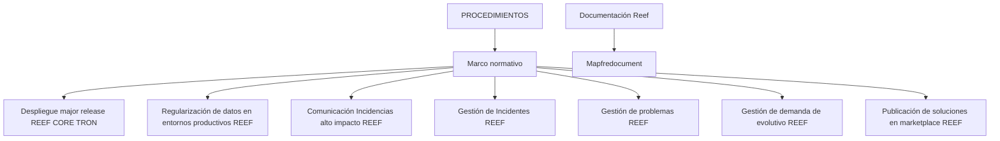

# Procedimentos, Documentação e Gestão Operacional do REEF CORE TRON

## 1. Metadados do Documento
- **Arquivo de Origem:** `Não identificado`
- **Tipo de Documento:** `Procedimento`
- **Domínio / Sistema:** `REEF CORE TRON`, `REEF`, `Mapfre`
- **Público-Alvo:** `Não identificado`
- **Data/Versão Identificada:** `Não identificada`

---

## 2. Resumo Executivo & Contexto de Negócio

O conteúdo apresenta uma seção denominada **PROCEDIMIENTOS**, associada a um contexto de documentação do ecossistema REEF. O texto informa que a seção de marco normativo cita procedimentos existentes, sem detalhar o conteúdo operacional de cada procedimento.

Os procedimentos listados abrangem implantação de *major release* do REEF CORE TRON, regularização de dados em ambientes produtivos REEF, comunicação de incidentes de alto impacto, gestão de incidentes, gestão de problemas, gestão de demanda evolutiva e publicação de soluções no marketplace REEF.

A origem aparenta ser uma página de documentação corporativa, contendo navegação para Soluções, Arquiteturas, APIs, Componentes, Cloud, Documentação, Zeus, Reef e Ajuda. Também são exibidas referências a “Documentation / DOCUMENTACIÓN Reef”, “Mapfredocument” e o estado de ciclo de vida “Approved Source”.

**Nota de Análise:** o conteúdo não descreve etapas, responsáveis, aprovações, critérios de entrada/saída, contratos técnicos, URLs operacionais ou parâmetros dos procedimentos listados.

---

## 3. Arquitetura, Componentes & Tecnologias Envolvidas

Os elementos explicitamente citados são:

| Elemento | Classificação no documento | Contexto identificado |
| :--- | :--- | :--- |
| REEF CORE TRON | Sistema / domínio | Associado ao procedimento de *Despliegue major release*. |
| REEF | Sistema / domínio | Associado aos procedimentos de dados produtivos, incidentes, problemas, demanda evolutiva, marketplace e documentação. |
| Zeus | Item de navegação | Exibido no menu de navegação. Não há descrição funcional. |
| Mapfredocument | Recurso / referência documental | Exibido junto a referências de documentação Reef. Não há descrição adicional. |
| Marketplace REEF | Canal ou área funcional | Associado à publicação de soluções. |
| Soluciones | Item de navegação | Não detalhado. |
| Arquitecturas | Item de navegação | Não detalhado. |
| APIs | Item de navegação | Não detalhado. |
| Componentes | Item de navegação | Não detalhado. |
| Cloud | Item de navegação | Não detalhado. |
| Documentación | Item de navegação | Associado às referências “Documentation / DOCUMENTACIÓN Reef”. |
| Ayuda | Item de navegação | Não detalhado. |



**Nota de Análise:** o diagrama representa exclusivamente a organização temática sugerida pela lista de procedimentos e referências documentais. O documento não descreve uma arquitetura de software, integrações, APIs, tecnologias de implementação ou fluxos de dados.

---

## 4. Regras de Negócio, Especificações Funcionais & Processos

### 4.1 Procedimentos citados

1. **Despliegue major release REEF CORE TRON**  
   O documento cita um procedimento de implantação de *major release* para REEF CORE TRON. Não apresenta critérios de implantação, ambientes envolvidos, janela de mudança, plano de reversão, responsáveis ou validações.

2. **Regularización de datos en entornos productivos REEF**  
   O documento cita um procedimento para regularização de dados em ambientes produtivos do REEF. Não detalha tipos de dados, mecanismos de regularização, autorizações, auditoria ou controles de segurança.

3. **Comunicación Incidencias alto impacto REEF**  
   O documento cita um procedimento de comunicação para incidentes de alto impacto no REEF. Não define classificação de impacto, canais de comunicação, destinatários, tempos de resposta ou escalonamento.

4. **Gestión de Incidentes REEF**  
   O documento cita a gestão de incidentes REEF. Não especifica ciclo de vida de incidentes, prioridades, SLAs, ferramentas ou papéis envolvidos.

5. **Gestión de problemas REEF**  
   O documento cita a gestão de problemas REEF. Não descreve análise de causa raiz, relação entre problemas e incidentes, *workarounds* ou critérios de encerramento.

6. **Gestión de demanda de evolutivo REEF**  
   O documento cita a gestão de demanda evolutiva REEF. Não detalha processo de solicitação, priorização, aprovação, desenvolvimento, testes ou entrega.

7. **Publicación de soluciones en marketplace REEF**  
   O documento cita a publicação de soluções no marketplace REEF. Não define requisitos de publicação, processo de revisão, critérios de aprovação ou formato das soluções.

### 4.2 Estado e origem documental

- O conteúdo exibe o campo **Lifecycle** com o valor **Approved Source**.
- O conteúdo exibe **Owner** com o identificador `user:agonzalez_mapfre.com`.
- O conteúdo contém a referência **VL**.
- O conteúdo está apresentado em espanhol, conforme a indicação de idioma `ES`.

---

## 5. Tabelas de Parâmetros, Ambientes e Estruturas de Dados

| Item / Parâmetro | Descrição / Função | Tipo / Valores / Formato | Ambiente / Observações |
| :--- | :--- | :--- | :--- |
| Lifecycle | Estado de ciclo de vida exibido para o conteúdo documental | `Approved Source` | Não há detalhamento do significado operacional desse estado. |
| Owner | Proprietário exibido no conteúdo | `user:agonzalez_mapfre.com` | O documento não informa nome, função ou responsabilidades do proprietário. |
| Idioma | Idioma exibido na navegação | `ES` | O texto principal está em espanhol. |
| Referência | Identificador ou marcador exibido | `VL` | Não detalhado. |
| Procedimento | Implantação de *major release* | `Despliegue major release REEF CORE TRON` | Sem ambientes, versões ou etapas descritas. |
| Procedimento | Regularização de dados produtivos | `Regularización de datos en entornos productivos REEF` | Refere-se explicitamente a ambientes produtivos. |
| Procedimento | Comunicação de incidente de alto impacto | `Comunicación Incidencias alto impacto REEF` | Sem critérios de alto impacto ou canais de comunicação. |
| Procedimento | Gestão de incidentes | `Gestión de Incidentes REEF` | Sem fluxo de gestão detalhado. |
| Procedimento | Gestão de problemas | `Gestión de problemas REEF` | Sem fluxo de gestão detalhado. |
| Procedimento | Gestão de demanda evolutiva | `Gestión de demanda de evolutivo REEF` | Sem regras de priorização ou aprovação. |
| Procedimento | Publicação de soluções | `Publicación de soluciones en marketplace REEF` | Sem requisitos ou fluxo de publicação. |
| Navegação | Áreas exibidas no portal | `Soluciones`, `Arquitecturas`, `APIs`, `Componentes`, `Cloud`, `Documentación`, `Zeus`, `Reef`, `Ayuda` | Itens de navegação; não são descritos funcionalmente. |
| Referência documental | Documentação Reef | `Documentation / DOCUMENTACIÓN Reef` | Exibida duas vezes no conteúdo. |
| Referência documental | Recurso documental | `Mapfredocument` | Sem detalhamento adicional. |

---

## 6. Bateria de Perguntas & Respostas para RAG (FAQ Sintético)

### P1: Quais procedimentos do REEF são listados no documento?
**R:** O documento lista os seguintes procedimentos: implantação de *major release* do REEF CORE TRON; regularização de dados em ambientes produtivos REEF; comunicação de incidentes de alto impacto REEF; gestão de incidentes REEF; gestão de problemas REEF; gestão de demanda evolutiva REEF; e publicação de soluções no marketplace REEF.

### P2: O documento descreve como executar uma implantação de major release do REEF CORE TRON?
**R:** Não. O conteúdo apenas lista o procedimento “Despliegue major release REEF CORE TRON”. Não há etapas de implantação, versão, ambiente, pré-requisitos, validações, plano de reversão ou responsáveis descritos.

### P3: Existe um procedimento mencionado para regularização de dados produtivos?
**R:** Sim. O conteúdo cita “Regularización de datos en entornos productivos REEF”. Entretanto, não especifica quais dados são regularizados, quais sistemas participam, quais aprovações são necessárias ou quais controles devem ser aplicados.

### P4: Como o documento define um incidente de alto impacto no REEF?
**R:** O documento não define incidente de alto impacto. Ele apenas cita o procedimento “Comunicación Incidencias alto impacto REEF”, sem apresentar critérios de classificação, severidade, SLA, público de comunicação ou mecanismos de escalonamento.

### P5: Quais práticas de gestão operacional do REEF aparecem no conteúdo?
**R:** As práticas de gestão operacional explicitamente citadas são gestão de incidentes, gestão de problemas e gestão de demanda evolutiva do REEF. O documento não fornece detalhes sobre seus respectivos fluxos operacionais.

### P6: O documento contém detalhes de APIs, contratos JSON ou métodos HTTP do REEF CORE TRON?
**R:** Não. Embora “APIs” apareça como item de navegação, o conteúdo não descreve APIs, endpoints, métodos HTTP, contratos JSON, autenticação ou integrações do REEF CORE TRON.

### P7: Existe menção a publicação de soluções no marketplace REEF?
**R:** Sim. O procedimento “Publicación de soluciones en marketplace REEF” é citado. O documento não informa critérios de elegibilidade, processo de revisão, responsáveis, formato de publicação ou ciclo de aprovação.

### P8: Quem é apresentado como proprietário do conteúdo documental?
**R:** O campo “Owner” apresenta o valor `user:agonzalez_mapfre.com`. O documento não fornece nome completo, área organizacional, função ou responsabilidades associadas a esse identificador.

### P9: Qual é o estado de ciclo de vida mostrado para a documentação?
**R:** O campo “Lifecycle” apresenta o valor “Approved Source”. O conteúdo não explica os critérios nem as implicações operacionais desse estado.

### P10: Quais áreas estão disponíveis na navegação exibida?
**R:** A navegação apresenta: Buscar, Inicio, Soluciones, Arquitecturas, APIs, Componentes, Cloud, Documentación, Zeus, Reef e Ayuda. O documento não explica a finalidade individual dessas áreas.

---

## 7. Glossário de Termos, Siglas & Conceitos-Chave

- **REEF:** nome de domínio, sistema ou contexto operacional citado em diversos procedimentos. O significado expandido da sigla não é informado.
- **REEF CORE TRON:** sistema ou domínio citado no procedimento de implantação de *major release*. O documento não define sua arquitetura ou composição.
- **Major release:** expressão usada no procedimento de implantação; o documento não define versão, escopo ou política de versionamento.
- **Marketplace REEF:** área ou canal citado para publicação de soluções. Não há definição adicional.
- **Lifecycle:** campo de ciclo de vida exibido no conteúdo.
- **Approved Source:** valor exibido para o campo Lifecycle; seu significado operacional não é detalhado.
- **Owner:** campo que identifica o proprietário do conteúdo.
- **VL:** referência exibida no conteúdo, sem definição.
- **Zeus:** item de navegação sem descrição funcional.
- **Mapfredocument:** referência documental exibida, sem definição adicional.

---

## 8. Notas Críticas, Riscos & Limitações

- O conteúdo é predominantemente uma lista de procedimentos e itens de navegação, sem documentação operacional detalhada.
- Não foram identificadas versões, datas, identificadores de documento, histórico de alterações ou autores além do valor exibido no campo **Owner**.
- Não foram identificados ambientes além da menção a “entornos productivos REEF”.
- Não foram identificadas URLs, servidores, portas, credenciais, rotas de log, ferramentas de monitoramento ou tecnologias de implementação.
- Não foram identificados critérios de classificação de incidente, SLA, matriz de escalonamento, matriz de responsabilidades ou fluxos de aprovação.
- Não foram identificados contratos de API, modelos de dados, parâmetros de entrada, regras de validação ou estruturas de integração.
- **Nota de Análise:** o documento lista procedimentos relevantes do REEF e REEF CORE TRON, mas não fornece detalhamento suficiente para executar os procedimentos sem consultar as fontes operacionais correspondentes.

---

## 9. Conteúdo Bruto Estruturado (Referência Fiel)

```text
--- [PÁGINA 1 DE 1] ---

Imagen LOGO
PROCEDIMIENTOS
Imagen MARCO NORMATIVO En este apartado se citan los procedimientos existentes
Despliegue major release REEF CORE TRON
Regularización de datos en entornos productivos REEF
Comunicación Incidencias alto impacto REEF
Gestión de Incidentes REEF
Gestión de problemas REEF
Gestión de demanda de evolutivo REEF
Publicación de soluciones en marketplace REEF
Documentation / DOCUMENTACIÓN Reef
DOCUMENTACIÓN Reef
Mapfredocument
DOCUMENTACIÓN Reef
Owner
user:agonzalez_mapfre.com
Lifecycle
Approved Source
 / 
 VL
Buscar Inicio Soluciones Arquitecturas APIs Componentes Cloud Documentación Zeus Reef Ayuda
ES
```
