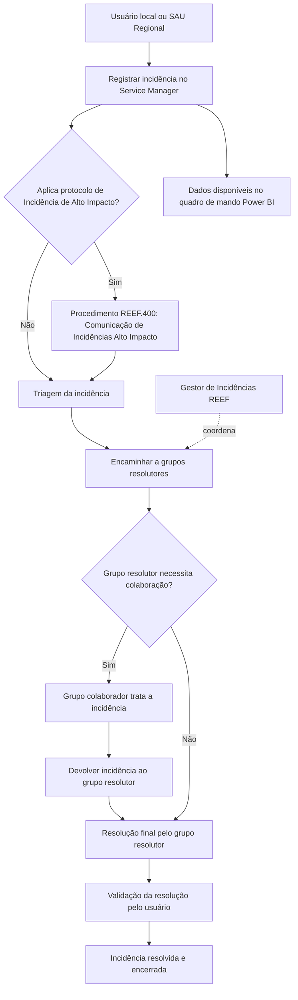

# Procedimento REEF.401 — Gestão de Incidentes na Plataforma REEF

## 1. Metadados do Documento
- **Arquivo de Origem:** Não identificado no conteúdo fornecido
- **Tipo de Documento:** Procedimento
- **Domínio / Sistema:** Plataforma REEF
- **Público-Alvo:** Usuários finais, Service Desk, grupos resolutores, grupos colaboradores e Gestor de Incidências REEF
- **Data/Versão Identificada:** V 0.1 — aprovação em 29/05/2024

---

## 2. Resumo Executivo & Contexto de Negócio

O procedimento REEF.401 estabelece a operação de Gestão de Incidentes na Plataforma REEF. O documento define o objetivo da gestão de incidentes, a ferramenta de suporte utilizada, o processo operacional e os papéis participantes.

No contexto do procedimento, um incidente ou incidência é um evento que não faz parte do funcionamento normal de um serviço e que causa, ou pode causar, interrupção ou redução da qualidade do serviço recebido pelo usuário. O objetivo operacional é resolver a incidência no menor tempo possível para restabelecer o serviço.

A ferramenta de registro e acompanhamento de incidentes é o Service Manager. A incidência pode ser aberta por um usuário local ou pelo SAU Regional e, quando aplicável, pode acionar o protocolo de Incidência de Alto Impacto.

O processo envolve triagem, encaminhamento aos grupos resolutores, colaboração de grupos colaboradores, resolução final, validação do usuário e encerramento. O Gestor de Incidências coordena os grupos resolutores.

O acompanhamento operacional ocorre por meio de um quadro de mando no Power BI, alimentado pelas incidências registradas no Service Manager. O quadro disponibiliza análises de incidentes ativos, resolvidos, evolução de backlog e evolução da atividade.

---

## 3. Arquitetura, Componentes & Tecnologias Envolvidas

| Componente / Entidade | Função identificada |
| :--- | :--- |
| Plataforma REEF | Plataforma objeto do procedimento de gestão de incidentes. |
| Service Manager | Ferramenta utilizada para abertura, registro e gestão das incidências. |
| SAU Regional | Origem possível para abertura de incidências. |
| Usuário local / usuário final | Pode abrir, reabrir, reclamar, validar solução, cancelar ou fechar uma incidência e fornecer informações adicionais. |
| Service Desk | Registra incidências e gerencia reaberturas, reclamações e rejeições. |
| Grupos resolutores | Realizam triagem, resolvem, rejeitam ou reatribuem incidências. |
| Grupos colaboradores | Colaboram no tratamento e devolvem a incidência aos grupos resolutores. |
| Gestor de Incidências REEF | Coordena os grupos resolutores. |
| Power BI | Plataforma do quadro de mando para acompanhamento de incidências REEF. |
| Excel | Formato disponível para exportação do detalhe das incidências incluídas nas medições. |
| Procedimento REEF.400 | Procedimento relacionado de comunicação de incidências de alto impacto. |



**Nota de Análise:** o documento identifica o Service Manager e o Power BI, mas não detalha integrações técnicas, interfaces, métodos HTTP, contratos de dados, autenticação, infraestrutura ou fluxos automatizados entre essas ferramentas.

---

## 4. Regras de Negócio, Especificações Funcionais & Processos

### 4.1 Definição de incidente

Uma incidência ou incidente é definido como um evento que:

1. Não faz parte do funcionamento normal de um serviço.
2. Causa, ou pode causar, interrupção do serviço.
3. Causa, ou pode causar, redução da qualidade do serviço recebido pelo usuário.

### 4.2 Objetivo da gestão de incidentes

A gestão de incidentes na Plataforma REEF busca resolver a incidência o mais rapidamente possível, com o objetivo de restabelecer o serviço no menor tempo possível.

### 4.3 Processo de gestão de incidências

#### Etapa 1 — Registro da incidência no Service Manager

1. A incidência é aberta pelo usuário local ou pelo SAU Regional.
2. A incidência fica registrada no Service Manager.
3. Quando aplicável, pode ser ativado o protocolo de Incidência de Alto Impacto.

#### Etapa 2 — Tratamento da incidência

1. É realizada a triagem da incidência.
2. A incidência é redirecionada aos grupos resolutores envolvidos.
3. Os grupos resolutores podem:
   - Resolver a incidência.
   - Rejeitar a incidência.
   - Reatribuir a incidência a outros grupos colaboradores.
4. Quando a incidência é atendida por grupos colaboradores, os grupos colaboradores devolvem a incidência aos grupos resolutores.
5. Os grupos resolutores realizam a resolução final.
6. Os grupos resolutores são coordenados pelo Gestor de Incidências.

#### Etapa 3 — Resolução e encerramento

1. A resolução é validada pelo usuário.
2. Após a validação do usuário, a incidência fica resolvida.

### 4.4 Papéis e responsabilidades

| Papel | Responsabilidades identificadas |
| :--- | :--- |
| Usuário final | Abrir incidência; reabrir incidência; reclamar; validar solução; cancelar ou fechar; fornecer informação adicional. |
| Service Desk | Registrar incidência; gerenciar reaberturas; gerenciar reclamações; gerenciar rejeições. |
| Grupos resolutores | Resolver; rejeitar; reatribuir. |
| Grupos colaboradores | Colaborar e devolver a incidência aos grupos resolutores. |
| Gestor de Incidências REEF | Coordenar os grupos resolutores. |

### 4.5 Regras de consulta do quadro de mando

Todas as vistas descritas exigem a seleção do serviço `REEF` e do país correspondente ao país da instância REEF.

| Vista | Aba no Power BI | Filtros obrigatórios | Informações disponibilizadas |
| :--- | :--- | :--- | :--- |
| Incidências ativas | `Service Desk Backlog` | Serviço = `REEF`; País = país da instância REEF | Total de incidências ativas; tempo médio em dias, referente à antiguidade das incidências; número de incidências por faixas de antiguidade; incidências por estado; incidências por grupos de escalonamento. |
| Incidências resolvidas | `Service Desk Resolución` | Serviço = `REEF`; País = país da instância REEF | Total de incidências resolvidas; tempo médio de resolução em dias; antiguidade por faixas de dias; incidências resolvidas por códigos de encerramento. |
| Evolução do backlog | `Evolución Backlog` | Serviço = `REEF`; País = país da instância REEF | Evolução das incidências ativas ao longo dos meses. |
| Evolução da atividade | `Evolución Actividad` | Serviço = `REEF`; País = país da instância REEF | Evolução das incidências nos estados ativo, resolvido, fechado sem resolução e backlog. |

### 4.6 Exportação de detalhe

Para as leituras do quadro de mando, é possível obter uma exportação para Excel contendo o detalhe das incidências consideradas na medição.

---

## 5. Tabelas de Parâmetros, Ambientes e Estruturas de Dados

### 5.1 Ferramentas, fonte de dados e URL

| Item / Parâmetro | Descrição / Função | Tipo / Valores / Formato | Ambiente / Observações |
| :--- | :--- | :--- | :--- |
| Service Manager | Registro e gestão de incidências REEF. | Ferramenta de suporte. | Fonte dos dados usados no quadro de mando. |
| Quadro de Mando de Incidências REEF | Acompanhamento de incidentes ativos, resolvidos e suas evoluções. | Relatório Power BI. | URL fornecida: `https://app.powerbi.com/groups/me/reports/7a8b6577-ec08-4745-aae1-d7517ff9d5f1/ReportSection5ec4ddebe02050ab7ca9?experience=power-bi` |
| Serviço | Filtro obrigatório nas vistas do quadro de mando. | Valor: `REEF`. | Aplicável às quatro vistas identificadas. |
| País | Filtro obrigatório nas vistas do quadro de mando. | País correspondente à instância REEF. | Aplicável às quatro vistas identificadas. |
| Exportação | Exportação do detalhe de incidências consideradas na medição. | Excel. | Disponível nas leituras do quadro de mando. |

### 5.2 Gestor de Incidências REEF

| Item / Parâmetro | Descrição / Função | Tipo / Valores / Formato | Ambiente / Observações |
| :--- | :--- | :--- | :--- |
| Gestor de Incidências REEF | Responsável identificado pela gestão de incidentes REEF. | Carolina Vázquez Rúa. | Coordena grupos resolutores. |
| Grupo / contato | Grupo associado ao Gestor de Incidências REEF. | `zzl Reef Core Soporte LREEFCORESOP@mapfre.com` | O texto não separa formalmente nome de grupo e endereço de e-mail. |

### 5.3 Papéis por instância REEF

| Instância / País | Grupos resolutores | Grupos colaboradores | Observações |
| :--- | :--- | :--- | :--- |
| REEF AC / Panamá | `PA_TS_REEF REGIONAL (*)`; `CM_TS_P_REEF TRON (*)`; `PA_TS_REEF WEB`; `PA_SS_WEB_SUPPORT`; `PA_TS_REEF ADMINISTRACION`; `PA_TS_REEF SUSCRIPCION`; `PA_TS_REEF PRESTACIONES`; `CM_TS_P-HP EXSTREAM MAINTENANCE_I`; `CM_TS_P-DOCUMENTUM ADMIN_I`; `CM_TS_P_REEF INFRA`; `PA_SS_TECHNICAL_SUPPORT`; `PA_SS_WEB_SUPPORT`; `Grupos Espacio MAPFRE` | O conteúdo extraído apresenta a estrutura em lista e não permite separar todos os grupos por coluna com total certeza. | Os grupos marcados com `(*)` são coordenados pelo Gestor de Incidências. |
| REEF VIDA / Uruguay | `UY_TS_SOLUCIONES-APLICATIVOS` | `CM_TS_P_REEF TRON`; `CM_TS_P-HP EXSTREAM MAINTENANCE_I`; `CM_TS_P-DOCUMENTUM ADMIN_I`; `CM_TS_P_REEF INFRA`; `Grupos Espacio MAPFRE` | O documento apresenta os grupos em tabela. |

**Nota de Análise:** a extração da página 6 apresenta desalinhamento visual entre as colunas de grupos resolutores e grupos colaboradores para a instância REEF AC / Panamá. A tabela acima preserva os nomes dos grupos, mas não atribui com certeza absoluta todos os grupos a uma única coluna quando o texto original não permite essa determinação.

### 5.4 Controle de mudanças, revisões e aprovações

| Versão | Data | Descrição | Autor |
| :--- | :--- | :--- | :--- |
| V 0.1 | 18/04/2024 | Descripción Procesos ACT | Gobierno REEF |
| V 0.1 | 12/04/2024 | Primera revisión | José de Abreu |
| V 0.1 | 29/05/2024 | Aprobación | Comité DST |

---

## 6. Bateria de Perguntas & Respostas para RAG (FAQ Sintético)

### P1: Qual é o objetivo do procedimento REEF.401?
**R:** O procedimento REEF.401 estabelece a operação de Gestão de Incidentes na Plataforma REEF. O objetivo é resolver as incidências no menor tempo possível para restabelecer o serviço o mais rapidamente possível.

### P2: O que é considerado um incidente na Plataforma REEF?
**R:** Um incidente ou incidência é um evento que não faz parte do funcionamento normal de um serviço e que causa, ou pode causar, interrupção ou redução na qualidade do serviço recebido pelo usuário.

### P3: Onde uma incidência REEF deve ser registrada?
**R:** A incidência deve ser registrada no Service Manager. A abertura pode ser realizada pelo usuário local ou pelo SAU Regional.

### P4: Quando o protocolo de Incidência de Alto Impacto pode ser acionado?
**R:** O protocolo de Incidência de Alto Impacto pode ser ativado quando aplicável durante o registro da incidência no Service Manager. O procedimento relacionado identificado é o REEF.400 — Procedimento de Comunicação de Incidências Alto Impacto REEF.

### P5: Quais são as atividades dos grupos resolutores no processo REEF?
**R:** Os grupos resolutores realizam a triagem e podem resolver, rejeitar ou reatribuir a incidência a outros grupos colaboradores. Quando grupos colaboradores participam do tratamento, os grupos resolutores devem realizar a resolução final após o retorno da incidência.

### P6: Quem coordena os grupos resolutores da Plataforma REEF?
**R:** Os grupos resolutores são coordenados pelo Gestor de Incidências REEF. O anexo identifica Carolina Vázquez Rúa como Gestora de Incidências REEF.

### P7: Qual é o papel dos grupos colaboradores em uma incidência REEF?
**R:** Os grupos colaboradores participam do tratamento da incidência quando acionados pelos grupos resolutores. Após a colaboração, os grupos colaboradores devolvem a incidência aos grupos resolutores para que seja realizada a resolução final.

### P8: Qual é a condição para que uma incidência seja considerada resolvida?
**R:** Após a resolução, o usuário deve validar a solução. Depois da validação pelo usuário, a incidência fica resolvida.

### P9: Quais filtros devem ser utilizados no quadro de mando de incidências REEF?
**R:** As vistas do quadro de mando exigem a seleção de `Servicio = "REEF"` e de `País = país de la instancia Reef`.

### P10: Quais informações a aba Service Desk Backlog disponibiliza?
**R:** A aba `Service Desk Backlog` apresenta incidências ativas REEF, incluindo total de incidências ativas, tempo médio em dias relacionado à antiguidade das incidências, quantidade de incidências por faixas de antiguidade, incidências por estado e incidências por grupos de escalonamento.

### P11: Onde são consultadas as métricas de incidentes resolvidos REEF?
**R:** As métricas de incidentes resolvidos são disponibilizadas na aba `Service Desk Resolución` do quadro de mando Power BI. A vista informa total de incidências resolvidas, tempo médio de resolução em dias, antiguidade por faixas de dias e incidências resolvidas por códigos de encerramento.

### P12: É possível exportar os dados de incidentes exibidos no quadro de mando?
**R:** Sim. Para cada leitura do quadro de mando, é possível obter uma exportação para Excel com o detalhe das incidências consideradas na medição.

---

## 7. Glossário de Termos, Siglas & Conceitos-Chave

- **REEF:** Plataforma à qual se aplica o procedimento de gestão de incidentes.
- **Incidente / Incidência:** Evento fora do funcionamento normal de um serviço que causa ou pode causar interrupção ou redução da qualidade do serviço.
- **Service Manager:** Ferramenta de suporte usada para registro e gestão de incidências REEF.
- **SAU Regional:** Entidade indicada como possível origem de abertura de incidência. O significado da sigla não é detalhado no documento.
- **Service Desk:** Papel responsável por registrar incidências e gerir reaberturas, reclamações e rejeições.
- **Grupo resolutor:** Grupo responsável por resolver, rejeitar ou reatribuir incidências.
- **Grupo colaborador:** Grupo que colabora no tratamento de uma incidência e a devolve ao grupo resolutor.
- **Gestor de Incidências:** Papel que coordena os grupos resolutores.
- **Triagem:** Atividade de análise e encaminhamento da incidência aos grupos envolvidos.
- **Quadro de Mando:** Painel de acompanhamento de incidências REEF no Power BI.
- **Backlog:** Estado ou visão relativa às incidências ativas; o documento também apresenta uma vista de evolução de backlog.
- **Power BI:** Plataforma utilizada para o quadro de mando de acompanhamento.
- **REEF.400:** Procedimento relacionado de Comunicação de Incidências Alto Impacto REEF.
- **ACT:** Termo presente no controle de mudanças na descrição “Descripción Procesos ACT”; não detalhado no documento.
- **DST:** Entidade presente como aprovadora “Comité DST”; a sigla não é expandida no documento.

---

## 8. Notas Críticas, Riscos & Limitações

- O procedimento não define prazos de atendimento, níveis de prioridade, SLA, métricas de cumprimento, escalonamentos temporais ou critérios objetivos para classificar uma incidência como de alto impacto.
- O documento informa que o protocolo de Incidência de Alto Impacto pode ser ativado, mas não descreve os critérios de ativação; essa informação deve ser consultada no procedimento relacionado REEF.400.
- Não são apresentados métodos HTTP, APIs, integrações técnicas, modelos de dados, contratos de interface, autenticação ou automações entre Service Manager e Power BI.
- A página 6 possui extração textual com provável perda de estrutura tabular, o que limita a atribuição inequívoca de todos os grupos da instância REEF AC / Panamá às colunas de grupos resolutores ou colaboradores.
- A resolução somente é considerada concluída após validação do usuário, mas o documento não detalha o comportamento em caso de ausência de validação, rejeição da solução ou prazo expirado.
- As siglas SAU, ACT e DST não são expandidas no conteúdo fornecido.
- O documento identifica exportação para Excel, mas não especifica permissões, formato de arquivo, colunas exportadas, retenção de dados ou restrições de acesso.

---

## 9. Conteúdo Bruto Estruturado (Referência Fiel)

```text
--- [PÁGINA 1 DE 7] ---

PROCEDIMIENTO REEF 401 Gestion de Incidentes REEF
Referencia PRO.ENT.013
Fecha de aprobación 29/05/2024
Nombre (REEF.401) Procedimiento Gestión de Incidentes REEF
Propósito
El presente documento tiene como objeto establecer la operativa relacionada con la Gestión de Incidentes en la Plataforma REEF.
Dene el objeto de la gestión de incidentes, la herramienta de soporte de esta gestión para REEF, el proceso y los roles que participan
en el mismo.
Alcance
El alcance del procedimiento es gestionar la operativa con relación a la gestión de un incidente en REEF.
Se entiende como Incidente / Incidencia aquel evento que no es parte del funcionamiento normal de un servicio y que causa, o puede
causar, una interrupción, o una reducción, en la calidad del servicio que recibe el usuario.
El objetivo es resolver lo antes posible la incidencia para restablecer el servicio lo antes posible.
Desarrollo
Proceso gestión incidencias
El proceso a seguir para la gestión de una incidencia en Reef es el siguiente:
1) Registro de la incidencia en Service Manager
Se abre la incidencia por el usuario local o desde el SAU Regional.
La incidencia queda registrada en Service Manager.
Si aplica, se puede activar el protocolo de Incidencia de Alto Impacto.
Documentation / DOCUMENTACIÓN Reef
DOCUMENTACIÓN Reef
Mapfredocument
DOCUMENTACIÓN Reef
Owner
user:agonzalez_mapfre.com
Lifecycle
Approved Source
 / 
 VL
Buscar Inicio Soluciones Arquitecturas APIs Componentes Cloud Documentación Zeus Reef Ayuda
ES


--- [PÁGINA 2 DE 7] ---

2) Tratamiento de la incidencia
Se realiza triaje de la incidencia y se redirige a los grupos resolutores involucrados, quienes se encargan de   resolver, rechazar o reasignar
la incidencia a otros grupos colaboradores.  
Si la incidencia es atendida por los grupos colaboradores, estos devuelven la incidencia a los grupos resolutores para que procedan a
la resolución nal.  
Los grupos resolutores están coordinados por el Gestor de Incidencias.  
3) Resolución de la incidencia y cierre
Tras la validación de la resolución por parte del usuario, la incidencia queda resuelta.
Roles del proceso
1) Usuario nal
 1
 2
 3
 4
 5
 6
 7
 8
 9
- Abrir incidencia
- Reabrir
- Reclamar
- Validar solución


--- [PÁGINA 3 DE 7] ---

2) Service Desk
3) Grupos resolutores
4) Grupos colaboradores
Seguimiento Incidencias – Cuadro de mando
Se dispone de un Cuadro de Mando para el seguimiento de las Incidencias REEF:
https://app.powerbi.com/groups/me/reports/7a8b6577-ec08-4745-aae1-d7517ff9d5f1/ReportSection5ec4ddebe02050ab7ca9?
experience=power-bi
La fuente de datos son las incidencias registradas en Service Manager.
Se ofrecen las siguientes vistas una vez se ha seleccionado el Servicio = “REEF”:
Incidencias activas (pestaña “Service Desk Backlog”)
Incidencias resueltas (pestaña “Service Desk Resolución)
Evolución Incidencias Activas (pestaña “Evolución Backlog”)
Evolución tickets (pestaña “Evolución Actividad”)
1) Incidencias activas REEF
10
11
- Cancelar / cerrar
- Aportar información adicional
1
2
3
4
5
6
7
- Registrar incidencia
- Gestionar reaperturas
- Gestionar reclamaciones
- Gestionar rechazos
1
2
3
4
5
- Resolver
- Rechazar
- Reasignar
1
- Colaborar y devolver


--- [PÁGINA 4 DE 7] ---

Selección:
Servicio = “REEF”
País = país de la instancia Reef
Se ofrece la información de:
Total de incidencias activas
Tiempo medio en días (antigüedad incidencias)
Número de incidencias por tramos de antigüedad
Incidencias por estado
Incidencias por grupos de escalado
Pudiéndose obtener en cada lectura un volcado a excel del detalle de las incidencias que están consideradas en la medición.
2) Incidencias resueltas
Selección:
Servicio = “REEF”
País = país de la instancia Reef


--- [PÁGINA 5 DE 7] ---

Se ofrece la información de:
Total incidencias resueltas
Tiempo medio de resolución (días)
Antigüedad por tramos de días
Incidencias resueltas / códigos de cierre
3) Evolución backlog
Selección:
Servicio = “REEF”
País = país de la instancia Reef
Se ofrece la información de la evolución de las incidencias activas a lo largo de los meses.
4) Evolución de la actividad
Selección:
Servicio = “REEF”
País = país de la instancia Reef
Se ofrece la información de la evolución de las incidencias en los distintos estados: activas, resueltas, cerradas sin resolución y backlog:


--- [PÁGINA 6 DE 7] ---

ANEXO
Gestor de Incidencias REEF:
Carolina Vázquez Rúa
zzl Reef Core Soporte LREEFCORESOP@mapfre.com
Roles Instancias REEF:
Instancia / País Grupos Resolutores Grupos Colaboradores
REEF AC / Panamá PA_TS_REEF REGIONAL (*)
CM_TS_P_REEF TRON (*)
PA_TS_REEF WEB
(*) Coordinados por el Gestor de incidencias
REEF
PA_SS_WEB_SUPPORT
PA_TS_REEF ADMINISTRACION
PA_TS_REEF SUSCRIPCION
PA_TS_REEF PRESTACIONES
CM_TS_P-HP EXSTREAM MAINTENANCE_I
CM_TS_P-DOCUMENTUM ADMIN_I
CM_TS_P_REEF INFRA
PA_SS_TECHNICAL_SUPPORT
PA_SS_WEB_SUPPORT
Grupos Espacio MAPFRE
REEF VIDA / Uruguay UY_TS_SOLUCIONES-APLICATIVOS CM_TS_P_REEF TRON
CM_TS_P-HP EXSTREAM MAINTENANCE_I
CM_TS_P-DOCUMENTUM ADMIN_I
CM_TS_P_REEF INFRA
Grupos Espacio MAPFRE
Relaciones (apartado opcional)
Procedimientos Procedimiento de Comunicación de Incidencias de Alto Impacto


--- [PÁGINA 7 DE 7] ---

Relaciones (apartado opcional)
(REEF.400) Procedimiento de Comunicación de Incidencias Alto Impacto REEF
Control de Cambios, Revisiones y Aprobaciones
Versión Fecha Descripción Autor
V 0.1 18/04/2024 Descripción Procesos ACT
Gobierno REEF
V 0.1 12/04/2024 Primera revisión José de Abreu
V 0.1 29/05/2024 Aprobación Comité DST
```
