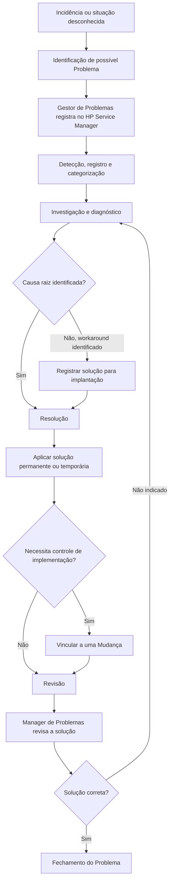

# Procedimento REEF.402 — Gestão de Problemas na Plataforma REEF

## 1. Metadados do Documento
- **Arquivo de Origem:** Não identificado no conteúdo bruto fornecido
- **Tipo de Documento:** Procedimento
- **Domínio / Sistema:** Plataforma REEF / Gestão de Problemas
- **Público-Alvo:** Gestor de Problemas, Analistas REEF, grupos técnicos, Manager de Problemas e equipes especializadas
- **Data/Versão Identificada:** V 0.1; aprovação em 29/05/2024; referência `PRO.ENT.014`

---

## 2. Resumo Executivo & Contexto de Negócio

O procedimento REEF.402 estabelece a operação de Gestão de Problemas na Plataforma REEF. O documento define o objetivo da gestão, a ferramenta usada para registro e acompanhamento, o processo operacional e os papéis envolvidos no ciclo de vida de um Problema.

No contexto do procedimento, um Problema é uma causa subjacente ainda não identificada associada a uma série de incidências ou a uma incidência de importância significativa. A Gestão de Problemas busca reduzir a probabilidade e o impacto de incidentes por meio da identificação de causas reais e potenciais.

A ferramenta definida para registrar e acompanhar Problemas é o HP Service Manager. O processo iniciado na ferramenta abrange o ciclo de vida do Problema e o ciclo de vida do Erro Conhecido; entretanto, o procedimento REEF.402 detalha exclusivamente a gestão do Problema, sem abordar a gestão do Erro Conhecido.

O fluxo operacional envolve detecção, registro, categorização, investigação, diagnóstico, resolução, revisão e fechamento. O processo exige colaboração entre o Gestor de Problemas, Analistas, grupos técnicos e, quando necessário, grupos especialistas adicionais. O acompanhamento dos Problemas em seus diferentes estados é disponibilizado por um quadro de comando no Power BI.

---

## 3. Arquitetura, Componentes & Tecnologias Envolvidas

| Componente / Entidade | Função no procedimento |
| :--- | :--- |
| Plataforma REEF | Ambiente corporativo no qual a Gestão de Problemas é aplicada. |
| HP Service Manager | Ferramenta utilizada para registro, acompanhamento, investigação e resolução de Problemas. |
| Power BI | Plataforma que hospeda o quadro de comando para acompanhamento dos Problemas em diferentes estados. |
| Gestor de Problemas REEF | Responsável por registrar o Problema, coordenar análise, diagnóstico, resolução e documentação. |
| Analista de Problemas | Executa atividades de investigação, busca soluções temporárias ou definitivas e pode implantar soluções. |
| Manager de Problemas | Revisa a solução implantada e encerra o Problema quando a solução estiver correta. |
| Incidência | Pode originar um Problema; quando vinculada, fornece informações principais herdadas pelo registro do Problema. |
| Mudança | Pode ser vinculada pelo Analista de Problemas para controlar implementações de soluções temporárias ou definitivas. |
| Erro Conhecido | Ciclo suportado pelo HP Service Manager, mas não detalhado no procedimento REEF.402. |



**Nota de Análise:** O conteúdo fornecido não descreve interfaces, contratos de integração, métodos HTTP, tecnologias de infraestrutura ou detalhes técnicos internos do HP Service Manager e do Power BI.

---

## 4. Regras de Negócio, Especificações Funcionais & Processos

### 4.1 Definição e objetivo da Gestão de Problemas

- Um Problema corresponde a uma causa subjacente, ainda não identificada, de:
  - uma série de incidências; ou
  - uma incidência com importância significativa.
- Diante de uma situação desconhecida que produza uma ou mais incidências, deve ser aberto um Problema.
- O objetivo da abertura e investigação de um Problema é encontrar a causa raiz responsável pela situação investigada.
- O objetivo geral da Gestão de Problemas é reduzir a probabilidade e o impacto de incidentes mediante identificação das causas reais e potenciais.

### 4.2 Ferramenta de gestão

- O registro e o acompanhamento de um Problema são realizados no **HP Service Manager**.
- O processo de investigação é iniciado no HP Service Manager e continua até a resolução.
- O HP Service Manager suporta:
  - ciclo de vida do Problema;
  - ciclo de vida do Erro Conhecido.
- O procedimento REEF.402 não entra na gestão do Erro Conhecido.

### 4.3 Papéis e responsabilidades operacionais

#### Gestor de Problemas — Grupo `CM_TS_REEF PROBLEMS`

O Gestor de Problemas:

1. Registra o Problema.
2. Gerencia a análise e o diagnóstico da causa raiz.
3. Gerencia os trabalhos de resolução.
4. Documenta a causa raiz.
5. Documenta workarounds e/ou soluções definitivas do Problema.

#### Analista — Grupo `CM_TS_REEF PROBLEMS`

O Analista:

1. Executa tarefas de investigação.
2. Busca uma solução para a causa raiz do Problema.
3. Pode buscar ou implantar uma solução temporária, denominada *workaround*.
4. Pode buscar ou implantar uma solução definitiva.
5. Pode vincular o Problema a uma Mudança para controlar implementações de soluções temporárias ou definitivas.

#### Manager — Grupo `CM_SS_PRB MANAGEMENT`

O Manager:

1. Revisa a solução implantada.
2. Fecha o Problema após confirmar que a solução está correta.

### 4.4 Ciclo de vida do Problema REEF

#### Fase 1 — Detecção, registro e categorização

1. Um Problema pode ser criado:
   - a partir de uma incidência; ou
   - diretamente pelo processo de Gestão de Problemas.
2. O Gestor de Problemas REEF realiza o cadastro do Problema na ferramenta.
3. O registro deve conter informações suficientes para gestão adequada pelos Analistas.
4. Quando o Problema for criado a partir de uma incidência, as informações principais são herdadas da incidência, incluindo:
   - título;
   - descrição;
   - prioridade;
   - categorização;
   - demais informações principais mencionadas como “etc.” no documento.
5. A informação do Problema deve ser completada no SM, usando a categorização REEF definida.
6. Deve ser marcado o campo de seleção **“Asignarme como coordinador”**.
7. A documentação relevante deve ser anexada no campo **“Adjuntar archivos”**.

#### Fase 2 — Investigação e diagnóstico

1. Após o registro do Problema, inicia-se a investigação multidisciplinar.
2. Os Analistas e grupos técnicos designados investigam o Problema para identificar sua causa raiz.
3. A análise e o diagnóstico podem exigir informações ou suporte de grupos especialistas adicionais.
4. As incidências associadas ao Problema podem ser vinculadas em **“Registros seleccionados”**.
5. As atividades realizadas podem ser registradas.
6. Caso a causa raiz seja identificada, o Problema avança para a fase de Resolução.
7. Caso seja identificado um *workaround*, a solução pode ser registrada para implantação mesmo sem identificação da causa raiz.

#### Fase 3 — Resolução

1. A fase de Resolução abrange as atividades que identificam e aplicam uma solução permanente para o Problema.
2. O Gestor de Problemas avalia, com o pessoal especializado, os meios necessários para resolver definitivamente o Problema.
3. O Analista de Problemas pode vincular o Problema a uma Mudança para controlar as implementações de soluções temporárias ou definitivas.

#### Fase 4 — Revisão e fechamento

1. A revisão busca assegurar que o Problema foi resolvido satisfatoriamente.
2. A revisão também busca melhorias no processo.
3. A revisão busca prevenir recorrência de incidências ou erros.
4. Após a resolução, o Manager de Problemas deve revisar o Problema.
5. O fechamento ocorre se o Manager de Problemas confirmar que a solução está correta.

### 4.5 Responsabilidades de solicitação, aprovação e comunicação

1. **Quem solicita:** Analistas REEF informam ao Gestor de Problemas sobre uma possível existência de Problema no REEF.
2. **Quem aprova:** Gestor de Problemas REEF, identificado como Ahmet Hakan Guzel; grupo `zzl ACT REEF Problemas`.
3. **Quem comunica:** Gestor de Problemas REEF, identificado como Ahmet Hakan Guzel.

---

## 5. Tabelas de Parâmetros, Ambientes e Estruturas de Dados

### 5.1 Categorização REEF para Problemas

| Item / Parâmetro | Descrição / Função | Tipo / Valores / Formato | Ambiente / Observações |
| :--- | :--- | :--- | :--- |
| Categoria REEF — Nível 1 | Primeiro nível de categorização do Problema | `SERVICIOS DE TECNOLOGIA Y SEGURIDAD` | REEF / HP Service Manager |
| Categoria REEF — Nível 2 | Segundo nível de categorização do Problema | `INFRAESTRUCTURA Y CLOUD` | REEF / HP Service Manager |
| Categoria REEF — Nível 3 | Terceiro nível de categorização do Problema | `REEF INFRA (CM)` | REEF / HP Service Manager |
| Categoria REEF — Nível 4 | Quarto nível de categorização do Problema | `REFF INFRA (CM)` | Grafia reproduzida fielmente do documento original |
| Categoria REEF — Nível 5 | Quinto nível de categorização do Problema | `PROBLEM IN REEF INFRA (CM)` | REEF / HP Service Manager |

### 5.2 Campos e registros operacionais no HP Service Manager

| Item / Parâmetro | Descrição / Função | Tipo / Valores / Formato | Ambiente / Observações |
| :--- | :--- | :--- | :--- |
| `Asignarme como coordinador` | Marca o responsável como coordenador do Problema | Campo de seleção | Deve ser marcado durante o registro/categorização |
| `Adjuntar archivos` | Anexa documentação e informações relevantes ao Problema | Área de anexos | Deve conter toda informação considerada relevante |
| `Registros seleccionados` | Relaciona incidências associadas ao Problema | Registros vinculados | Utilizado durante investigação e diagnóstico |
| Título | Identificação principal do Problema | Texto | Pode ser herdado da incidência de origem |
| Descrição | Descrição principal do Problema | Texto | Pode ser herdada da incidência de origem |
| Prioridade | Prioridade atribuída ao Problema | Valor não detalhado | Pode ser herdada da incidência de origem |
| Categorização | Classificação do Problema | Hierarquia REEF de níveis 1 a 5 | Deve ser completada no SM |
| Atividades realizadas | Registro das ações executadas na investigação | Registro de atividades | O documento informa que podem ser registradas |

### 5.3 Grupos e responsáveis

| Item / Parâmetro | Descrição / Função | Tipo / Valores / Formato | Ambiente / Observações |
| :--- | :--- | :--- | :--- |
| Gestor de Problemas | Registra, coordena análise, diagnóstico, resolução e documentação | Grupo `CM_TS_REEF PROBLEMS` | Gestão de Problemas REEF |
| Analista | Investiga e busca ou implanta soluções temporárias ou definitivas | Grupo `CM_TS_REEF PROBLEMS` | Gestão de Problemas REEF |
| Manager | Revisa solução e fecha o Problema | Grupo `CM_SS_PRB MANAGEMENT` | Gestão de Problemas REEF |
| Aprovador identificado | Aprova conforme seção de responsabilidades | Ahmet Hakan Guzel | Grupo `zzl ACT REEF Problemas` |
| Comunicador identificado | Comunica conforme seção de responsabilidades | Ahmet Hakan Guzel | Gestor de Problemas REEF |

### 5.4 Recursos e referências

| Item / Parâmetro | Descrição / Função | Tipo / Valores / Formato | Ambiente / Observações |
| :--- | :--- | :--- | :--- |
| Quadro de comando Gestão de Problemas | Acompanhamento de Problemas em diferentes estados | URL Power BI | `https://app.powerbi.com/groups/me/reports/266f7557-ce9a-4a94-b593-5d647380bb9a/ReportSection381fe40c4a861597b690?experience=power-bi` |
| Procedimento relacionado | Procedimento de Gestão de Incidentes REEF | `(REEF.401)` | Relação listada como opcional |
| Referência documental | Referência do procedimento | `PRO.ENT.014` | REEF.402 |
| Proprietário exibido | Informação de owner apresentada no documento | `user:agonzalez_mapfre.com` | Origem: documentação Reef |

### 5.5 Histórico de controle de mudanças, revisões e aprovações

| Versão | Data | Descrição | Autor / Responsável |
| :--- | :--- | :--- | :--- |
| V 0.1 | 18/04/2024 | Descripción | Ahmet Hakan Guzel |
| V 0.1 | 12/04/2024 | Primera revisión | José de Abreu |
| V 0.1 | 29/05/2024 | Aprobación | Comité DST |

---

## 6. Bateria de Perguntas & Respostas para RAG (FAQ Sintético)

### P1: O que é considerado um Problema no procedimento REEF.402?
**R:** Um Problema é uma causa subjacente ainda não identificada de uma série de incidências ou de uma incidência com importância significativa. A Gestão de Problemas busca identificar causas reais e potenciais para reduzir a probabilidade e o impacto de incidentes.

### P2: Quando deve ser aberto um Problema na Plataforma REEF?
**R:** Deve ser aberto um Problema diante de uma situação desconhecida que produza uma ou várias incidências. O objetivo é encontrar a causa raiz que está causando a situação investigada.

### P3: Qual ferramenta deve ser usada para registrar e acompanhar Problemas no REEF?
**R:** O registro e o acompanhamento de Problemas devem ser realizados no HP Service Manager. Nessa ferramenta começa o processo de investigação, que continua até a resolução do Problema.

### P4: Quem registra um Problema REEF no HP Service Manager?
**R:** O Gestor de Problemas REEF registra o Problema. O Gestor também gerencia a análise e o diagnóstico da causa raiz, os trabalhos de resolução e a documentação da causa raiz, dos workarounds e das soluções definitivas.

### P5: Quais informações são herdadas quando um Problema é criado a partir de uma incidência?
**R:** Quando um Problema é criado a partir de uma incidência, as informações principais do Problema são herdadas da incidência, incluindo título, descrição, prioridade e categorização. O documento também indica que outras informações principais podem ser herdadas.

### P6: Qual categorização deve ser usada para um Problema de infraestrutura REEF?
**R:** A categorização apresentada no procedimento possui cinco níveis: `SERVICIOS DE TECNOLOGIA Y SEGURIDAD`, `INFRAESTRUCTURA Y CLOUD`, `REEF INFRA (CM)`, `REFF INFRA (CM)` e `PROBLEM IN REEF INFRA (CM)`. A grafia `REFF INFRA (CM)` é reproduzida conforme o documento original.

### P7: O que deve ser documentado ao registrar um Problema?
**R:** Deve ser anexada, no campo “Adjuntar archivos”, toda informação considerada relevante para o Problema. O procedimento também determina que o Gestor de Problemas documente a causa raiz, os workarounds e/ou as soluções definitivas.

### P8: É possível implantar um workaround antes de identificar a causa raiz?
**R:** Sim. Se um workaround for identificado, a solução pode ser indicada para implantação mesmo que a causa raiz ainda não tenha sido identificada.

### P9: Como as incidências relacionadas a um Problema devem ser vinculadas?
**R:** As incidências associadas ao Problema podem ser relacionadas no campo “Registros seleccionados” durante a fase de investigação e diagnóstico.

### P10: Em que situação um Problema pode ser vinculado a uma Mudança?
**R:** O Analista de Problemas pode vincular o Problema a uma Mudança para controlar implementações de soluções temporárias ou definitivas.

### P11: Quem revisa e fecha um Problema REEF?
**R:** O Manager de Problemas, pertencente ao grupo `CM_SS_PRB MANAGEMENT`, revisa a solução implantada. Após verificar que a solução está correta, o Manager procede ao fechamento do Problema.

### P12: Qual é o objetivo da revisão de um Problema antes do fechamento?
**R:** A revisão busca assegurar a solução satisfatória do Problema, identificar melhorias de processo e prevenir a recorrência de incidências ou erros.

### P13: Como acompanhar os Problemas REEF em seus diferentes estados?
**R:** O procedimento informa que existe um quadro de comando de Gestão de Problemas hospedado no Power BI para acompanhamento dos Problemas em seus diferentes estados.

---

## 7. Glossário de Termos, Siglas & Conceitos-Chave

- **REEF:** Plataforma referenciada pelo procedimento para a qual a Gestão de Problemas é estabelecida. O significado expandido da sigla não é detalhado no conteúdo fornecido.
- **Problema:** Causa subjacente ainda não identificada de múltiplas incidências ou de uma incidência significativa.
- **Incidência:** Evento que pode originar um Problema e cujas informações principais podem ser herdadas pelo registro do Problema.
- **Causa raiz:** Causa responsável pela situação investigada, cuja identificação é objetivo central da investigação.
- **Workaround:** Solução temporária que pode ser indicada e implantada mesmo que a causa raiz não tenha sido identificada.
- **Solução definitiva:** Solução permanente aplicada para resolver o Problema.
- **HP Service Manager / SM:** Ferramenta usada para registrar, acompanhar, investigar e resolver Problemas.
- **Erro Conhecido:** Ciclo de vida suportado pelo HP Service Manager, mas não detalhado no procedimento REEF.402.
- **Mudança:** Entidade à qual um Problema pode ser vinculado para controlar implementação de soluções temporárias ou definitivas.
- **Power BI:** Plataforma usada pelo quadro de comando para acompanhar Problemas em diferentes estados.
- **CM_TS_REEF PROBLEMS:** Grupo atribuído aos papéis de Gestor de Problemas e Analista.
- **CM_SS_PRB MANAGEMENT:** Grupo atribuído ao papel de Manager.
- **Comité DST:** Responsável listado pela aprovação em 29/05/2024.
- **PRO.ENT.014:** Referência documental associada ao procedimento REEF.402.

---

## 8. Notas Críticas, Riscos & Limitações

- O procedimento não detalha a gestão do ciclo de vida de Erro Conhecido, apesar de informar que o HP Service Manager o suporta.
- O conteúdo não especifica critérios de prioridade, SLA, prazos de investigação, níveis de severidade ou condições formais de escalonamento.
- O documento não descreve métodos de integração, contratos de dados, APIs, tecnologias de infraestrutura, servidores ou ambientes técnicos.
- A investigação pode depender de informações e suporte de grupos especialistas adicionais, constituindo uma dependência operacional externa ao Gestor de Problemas e aos Analistas.
- A resolução definitiva depende de avaliação conjunta entre o Gestor de Problemas e pessoal especializado.
- A categorização de nível 4 aparece como `REFF INFRA (CM)`, diferente da grafia `REEF` usada em outras partes do documento. A grafia foi preservada fielmente e não foi corrigida.
- O fluxo visual citado como “Proceso Gestión de Problemas” não está presente no conteúdo bruto fornecido; o diagrama Mermaid deste relatório foi reconstruído exclusivamente a partir da descrição textual das fases.
- O quadro de comando Power BI é informado por URL, mas o procedimento não descreve indicadores, filtros, permissões, periodicidade de atualização ou métricas disponíveis.

---

## 9. Conteúdo Bruto Estruturado (Referência Fiel)

```text
--- [PÁGINA 1 DE 7] ---

PROCEDIMIENTO REEF 402 Gestion de problemas REEF
Referencia PRO.ENT.014
Fecha de aprobación 29/05/2024
Nombre (REEF.402) Procedimiento Gestión de Problemas REEF
Propósito
El presente documento tiene como objeto establecer la operativa relacionada con la Gestión de Problemas en la Plataforma REEF.
Dene el objeto de la gestión de problemas, la herramienta de soporte de esta gestión para REEF, el proceso y los roles que participan
en el mismo.
Alcance
El alcance del procedimiento es gestionar la operativa con relación a la gestión de un problema en REEF.
Se entiende como Problema aquella causa subyacente, aún no identicada, de una serie de incidencias o de una incidencia con
importancia signicativa.
El objetivo es reducir la probabilidad y el impacto de los incidentes mediante la identicación de las causas reales y potenciales de los
mismos.
Desarrollo
Ante una situación desconocida que produce una o varias incidencias, se debe abrir un Problema. El objetivo es encontrar la causa raíz que
está causando la situación investigada. 
La herramienta utilizada para el registro y seguimiento de un Problema es HP Service Manager, donde comienza el proceso de investigación
hasta su resolución.
El proceso de Gestión de Problemas que soporta la herramienta HP Service Manager comprende el ciclo de vida del Problema así como el
ciclo de vida del Error Conocido.
En este procedimiento se dene cómo se ha de gestionar un Problema, sin entrar en la gestión del Error Conocido.
Documentation / DOCUMENTACIÓN Reef
DOCUMENTACIÓN Reef
Mapfredocument
DOCUMENTACIÓN Reef
Owner
user:agonzalez_mapfre.com
Lifecycle
Approved Source
 / 
 VL
Buscar Inicio Soluciones Arquitecturas APIs Componentes Cloud Documentación Zeus Reef Ayuda
ES


--- [PÁGINA 2 DE 7] ---

Roles Gestión de Problemas
Se distinguen los siguientes roles:
Gestor de Problemas: Grupo CM_TS_REEF PROBLEMS
Registra el problema
Gestiona el análisis y diagnóstico de la causa raíz.
Gestiona los trabajos de resolución.
Documenta la causa raíz, los workarround y/o soluciones denitivas del problema.
Analista: Grupo CM_TS_REEF PROBLEMS
Aborda cualquier tarea de investigación
Busca una solución a la causa raíz del problema, pudiendo ser temporal (workarround) o denitiva.
Implantar una solución, temporal (workarround) o denitiva, al problema.
Manager: Grupo CM_SS_PRB MANAGEMENT
Revisa la solución implantada y cierra el problema
Ciclo de vida de un Problema REEF:
Se distinguen cuatro fases principales para la gestión de un Problema:
1. Detección, registro y Categorización:
Un problema puede ser creado desde una incidencia o directamente en el proceso de Gestión de Problemas.
El problema se dará de alta en la herramienta por el Gestor de Problemas REEF. Se proveerá la información suciente para que pueda ser
gestionado de forma adecuada por los analistas. Cuando el problema se crea a partir de una incidencia, la información principal del
problema (título, descripción, prioridad, categorización, etc.) se hereda de ésta.
Se completa la información del problema en SM, indicando la categorización para REEF siguiente:
Categoría REEF:
Nivel 1: SERVICIOS DE TECNOLOGIA Y SEGURIDAD
Nivel 2: INFRAESTRUCTURA Y CLOUD
Nivel 3: REEF INFRA (CM)
Nivel 4: REFF INFRA (CM)
Nivel 5: PROBLEM IN REEF INFRA (CM)
Se marcará el check “Asignarme como coordinador”


--- [PÁGINA 3 DE 7] ---

Es importante documentar bien el problema adjuntando toda la información que se considere relevante en el apartado “Adjuntar archivos”:
1. Investigación y diagnóstico:
Una vez registrado el problema, comienza el trabajo de investigación multidisciplinar entre los analistas/grupos técnicos asignados, con el
objetivo de identicar la causa raíz del problema.
Para el análisis y diagnóstico, se podrá requerir información o soporte de grupos especialistas adicionales.
Se podrán relacionar en “Registros seleccionados” todas las incidencias asociadas al problema.
Se podrán registrar las actividades llevadas a cabo:


--- [PÁGINA 4 DE 7] ---

Si se identica la causa raíz se avanzará el problema a la fase de Resolución.
Si se detecta un workaround, aunque no esté identicada la causa raíz, se podrá indicar la solución para su implantación.
1. Resolución:
La fase de Resolución abarca actividades que identican y aplican una solución permanente al problema.
El Gestor de Problemas evalúa los medios para resolver denitivamente el problema en colaboración con el personal especializado. El
Analista de Problemas puede vincularlo también a un Cambio para el control de las implementaciones de soluciones temporales o
denitivas.
1. Revisión y cierre:
El propósito de la revisión del problema es asegurar la solución satisfactoria de un problema, buscar mejoras del proceso y prevenir la
recurrencia de incidencias o errores.
Una vez resuelto el problema debe ser revisado por el Manager de Problemas para proceder a su cierre si la solución es correcta.


--- [PÁGINA 5 DE 7] ---

Cuadro de mando Gestión de Problemas
Se dispone de un cuadro de mando que permite hacer seguimiento de los Problemas en sus diferentes estados:
(Cuadro de mando: https://app.powerbi.com/groups/me/reports/266f7557-ce9a-4a94-b593-
5d647380bb9a/ReportSection381fe40c4a861597b690?experience=power-bi)
Proceso Gestión de Problemas:


--- [PÁGINA 6 DE 7] ---

Responsabilidades
1. Quién solicita: Analistas Reef informan al Gestor de Problemas sobre la posible existencia de un problema en REEF.
2. Quién aprueba: Gestor de Problemas REEF (Ahmet Hakan Guzel)
Grupo zzl ACT REEF Problemas
3. Quién comunica: Gestor de Problemas REEF (Ahmet Hakan Guzel)


--- [PÁGINA 7 DE 7] ---

Relaciones (apartado opcional)
Procedimientos (REEF.401) Procedimiento de Gestión de Incidentes REEF
Control de Cambios, Revisiones y Aprobaciones
Versión Fecha Descripción Autor
V 0.1 18/04/2024 Descripción Ahmet Hakan Guzel
Gobierno REEF
V 0.1 12/04/2024 Primera revisión José de Abreu
V 0.1 29/05/2024 Aprobación Comité DST
```
