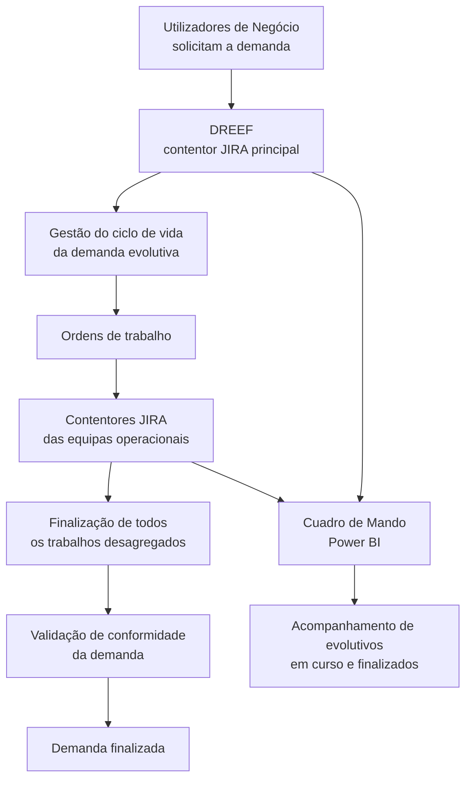
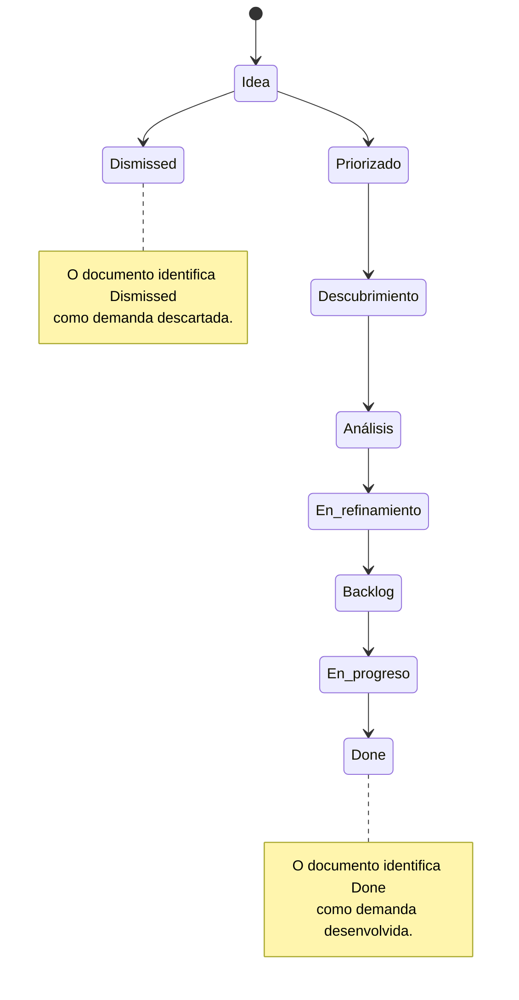

# Procedimento REEF.403 — Gestão da Demanda de Evolutivos na Plataforma REEF

## 1. Metadados do Documento
- **Arquivo de Origem:** Não identificado no conteúdo fornecido
- **Tipo de Documento:** Procedimento
- **Domínio / Sistema:** Plataforma REEF
- **Público-Alvo:** Usuários de Negócio, equipas operacionais, comités de aprovação e sponsors de solução
- **Data/Versão Identificada:** V 0.1, aprovada em 29/05/2024 pelo Comité DST
- **Referência:** PRO.ENT.015
- **Nome identificado:** REEF.403 — Procedimiento Gestión demanda de Evolutivo REEF

---

## 2. Resumo Executivo & Contexto de Negócio

O procedimento REEF.403 estabelece a operação de gestão da demanda de evolutivos na Plataforma REEF. O documento define o objeto da gestão, a ferramenta de suporte utilizada, o ciclo de vida da demanda e os participantes responsáveis pela solicitação e aprovação.

Um evolutivo é definido como um evento que aumenta, reduz ou altera funcionalidades do sistema. A necessidade pode decorrer de solicitações de utilizadores ou de outras causas, incluindo mudanças normativas. O objetivo do evolutivo é manter a Plataforma REEF alinhada às necessidades do Negócio.

A gestão ocorre no JIRA, utilizando o contentor específico **DREEF**. O DREEF é apresentado como o contentor único de toda a demanda evolutiva de REEF e oferece a visão completa do ciclo de vida de cada demanda. Uma demanda pode gerar ordens de trabalho para equipas operacionais envolvidas, sendo cada ordem gerida nos respetivos contentores JIRA das equipas.

O encerramento de uma demanda depende da finalização de todos os trabalhos desagregados e da validação de conformidade da demanda. O acompanhamento operacional é suportado por um Cuadro de Mando em Power BI, alimentado com informações do DREEF e dos contentores locais associados.

---

## 3. Arquitetura, Componentes & Tecnologias Envolvidas

| Componente / Tecnologia | Função documentada |
| :--- | :--- |
| Plataforma REEF | Plataforma na qual são geridas as necessidades de evolução funcional. |
| JIRA | Ferramenta de gestão da demanda de evolutivos e das ordens de trabalho. |
| DREEF | Contentor JIRA específico e único para a demanda evolutiva da Plataforma REEF; concentra a visão completa do ciclo de vida da demanda. |
| Contentores JIRA das equipas operacionais | Contentores onde cada ordem de trabalho gerada pela demanda é administrada. |
| Power BI | Tecnologia utilizada pelo Cuadro de Mando de acompanhamento da demanda de evolutivos. |
| Cuadro de Mando | Painel de acompanhamento de evolutivos em curso e finalizados. |
| Comité de aprovação da demanda regional / país | Instância identificada como responsável pela aprovação da demanda. |
| Sponsor da solução | Papel identificado como aprovador da demanda. |
| Comité DST | Instância que aprovou a versão V 0.1 em 29/05/2024. |





> **Nota de Análise:** O documento identifica os estados `Done` e `Dismissed`, mas não detalha os critérios operacionais, transições ou responsáveis específicos para esses dois estados.

---

## 4. Regras de Negócio, Especificações Funcionais & Processos

### 4.1 Definição de evolutivo

Um evolutivo corresponde a um evento que:

- Aumenta funcionalidades do sistema;
- Diminui funcionalidades do sistema;
- Altera funcionalidades do sistema;
- Pode ser motivado por necessidades do utilizador;
- Pode ser motivado por outras razões, incluindo mudanças normativas.

O objetivo de um evolutivo é fornecer ao sistema funcionalidades que permitam atender às necessidades do Negócio.

### 4.2 Gestão da demanda no JIRA

1. As demandas de evolutivos REEF são geridas no JIRA.
2. O registo das necessidades de evolução ocorre no contentor específico **DREEF**.
3. O DREEF recebe necessidades de evolução para qualquer componente da Plataforma REEF.
4. O DREEF é o contentor único para toda a demanda evolutiva da Plataforma REEF.
5. O DREEF mantém a visão completa do ciclo de vida da demanda.
6. A demanda gera ordens de trabalho para as equipas operacionais envolvidas.
7. Cada ordem de trabalho é gerida nos respetivos contentores JIRA das equipas operacionais.
8. A demanda termina somente quando:
   - Todos os trabalhos desagregados forem finalizados; e
   - A conformidade da demanda for validada.

### 4.3 Ciclo de vida da demanda evolutiva

| Estado JIRA | Descrição e critérios documentados |
| :--- | :--- |
| **Idea** | Definição da necessidade sob a perspetiva de Negócio. Deve conter todas as informações necessárias para identificar a necessidade, a oportunidade de negócio, a poupança de custos, o apoio à estratégia, entre outros elementos. |
| **Priorizado** | A ideia foi considerada e comparada com as restantes ideias, tendo sido considerada candidata à avaliação com maior detalhe. |
| **Descubrimiento** | Realiza-se o entendimento das propostas sob todos os pontos de vista possíveis. Inclui definição e declaração de hipóteses de trabalho, procura de alternativas para resolver a necessidade com proposta de valor, realização de Business Case para cada alternativa viável, cálculo de métricas de valor e análise de transversalidade. |
| **Análisis** | Realizam-se estudos e a preparação da execução. Inclui formalização da equipa e dos compromissos, distribuição de entregas, estabelecimento e habilitação do orçamento da iniciativa e elaboração do Plano de Trabalho. |
| **En refinamiento** | A alternativa mais viável e rentável foi selecionada. Inclui procura de financiamento e/ou distribuição de custos, com ajustes de acordo com as limitações aprovadas. |
| **Backlog** | A iniciativa está preparada para execução e aguarda a aprovação do comité de demanda correspondente. |
| **En progreso** | A demanda foi aprovada e está a ser gerida pelas equipas corporativas. São reportados indicadores de execução em relação aos compromissos e orçamentos. Também ocorre adaptação das necessidades ao resultado da execução. |
| **Done** | Estado identificado como demanda desenvolvida. O documento não apresenta detalhe adicional. |
| **Dismissed** | Estado identificado como demanda descartada. O documento não apresenta detalhe adicional. |

### 4.4 Acompanhamento da demanda

O Cuadro de Mando disponibiliza acompanhamento para demandas em curso e finalizadas.

#### Evolutivos em curso
- Número total de demandas ativas;
- Tempo total de execução;
- Número de demandas por estado;
- Tempos em cada estado;
- Lista com detalhe das demandas.

#### Evolutivos finalizados
- Número total de demandas finalizadas;
- Tempo total de execução;
- Tempos investidos em cada estado;
- Lista com detalhe das demandas.

### 4.5 Responsabilidades identificadas

| Responsabilidade | Papel identificado |
| :--- | :--- |
| Quem solicita | Usuários de Negócio |
| Quem aprova | Comité de aprovação da demanda regional / país |
| Quem aprova | Sponsor da solução |

> **Nota de Análise:** O documento possui os títulos “Visão processo” e “Roles del proceso”, mas o conteúdo fornecido não apresenta o respetivo detalhamento de fluxo nem uma matriz completa de papéis.

---

## 5. Tabelas de Parâmetros, Ambientes e Estruturas de Dados

| Item / Parâmetro | Descrição / Função | Tipo / Valores / Formato | Ambiente / Observações |
| :--- | :--- | :--- | :--- |
| Referência do procedimento | Identificador documental do procedimento | `PRO.ENT.015` | Documento REEF.403 |
| Nome do procedimento | Nome formal identificado | `REEF.403 — Procedimiento Gestión demanda de Evolutivo REEF` | Plataforma REEF |
| Contentor principal JIRA | Registo e gestão central da demanda evolutiva | `DREEF` | Contentor único da demanda evolutiva REEF |
| Ferramenta de gestão | Ferramenta que gere demandas e ordens de trabalho | JIRA | DREEF e contentores locais das equipas |
| Ferramenta de acompanhamento | Plataforma do painel de acompanhamento | Power BI | Cuadro de Mando de evolutivos REEF |
| Fonte de dados do painel | Informação utilizada pelo Cuadro de Mando | Dados do DREEF e dos contentores locais associados | Não são detalhados modelo de dados, frequência de atualização ou permissões |
| URL do Cuadro de Mando | Acesso ao painel Power BI identificado no documento | `https://app.powerbi.com/groups/me/reports/301d5078-528b-471a-b274-c035026632db/ReportSectionc0884390772008de21c7?ctid=5cc6c66d-ffb2-469f-9385-cda840e57836&experience=power-bi` | Power BI |
| Estado inicial identificado | Estado no qual a demanda é iniciada | `Idea` | Ciclo de vida JIRA |
| Estado de execução | Estado de demanda aprovada sob gestão das equipas corporativas | `En progreso` | Ciclo de vida JIRA |
| Estado de conclusão | Estado de demanda desenvolvida | `Done` | Sem critérios detalhados no documento |
| Estado de descarte | Estado de demanda descartada | `Dismissed` | Sem critérios detalhados no documento |
| Versão documental | Versão registada no controlo de alterações | `V 0.1` | Há três registos com a mesma versão |
| Data de aprovação | Data da aprovação pelo Comité DST | `29/05/2024` | Versão V 0.1 |

### Controlo de Alterações, Revisões e Aprovações

| Versão | Data | Descrição | Autor / Instância |
| :--- | :--- | :--- | :--- |
| V 0.1 | 01/04/2024 | Descripción Gobierno Reef | Não identificado |
| V 0.1 | 12/04/2024 | Primera revisión | José de Abreu |
| V 0.1 | 29/05/2024 | Aprobación | Comité DST |

---

## 6. Bateria de Perguntas & Respostas para RAG (FAQ Sintético)

### P1: Qual é o objetivo do procedimento REEF.403?
**R:** O procedimento REEF.403 estabelece a operação de gestão da demanda de evolutivos na Plataforma REEF. O documento define o objeto da gestão, a ferramenta de suporte para REEF, o processo e os papéis participantes.

### P2: O que é considerado um evolutivo na Plataforma REEF?
**R:** Um evolutivo é um evento que aumenta, diminui ou altera as funcionalidades do sistema. Pode surgir por necessidade de utilizadores ou por outras razões, como mudanças normativas. O objetivo é manter o sistema adequado às necessidades do Negócio.

### P3: Em que ferramenta e contentor JIRA são registadas as demandas de evolutivos REEF?
**R:** As demandas são geridas no JIRA, no contentor específico denominado `DREEF`. O DREEF é o contentor único de toda a demanda evolutiva de REEF e disponibiliza a visão completa do ciclo de vida da demanda.

### P4: Como são geridas as ordens de trabalho geradas por uma demanda REEF?
**R:** A demanda gera ordens de trabalho para as equipas operacionais envolvidas. Cada ordem de trabalho é gerida no contentor JIRA respetivo da equipa operacional responsável.

### P5: Quando uma demanda de evolutivo REEF é considerada finalizada?
**R:** Uma demanda é finalizada quando todos os trabalhos em que foi desagregada são concluídos e é validado que a demanda está conforme.

### P6: Que informação deve constar no estado `Idea` de uma demanda?
**R:** O estado `Idea` deve definir a necessidade sob a perspetiva de Negócio e conter toda a informação necessária para identificar a necessidade, a oportunidade de negócio, a poupança de custos, o apoio à estratégia, entre outros elementos.

### P7: Quais atividades são realizadas durante o estado `Descubrimiento`?
**R:** No estado `Descubrimiento`, ocorre o entendimento das propostas sob todos os pontos de vista possíveis, a definição e declaração de hipóteses de trabalho, a procura de alternativas com proposta de valor, a realização de Business Case para cada alternativa viável, o cálculo de métricas de valor e a análise de transversalidade.

### P8: O que caracteriza o estado `Análisis` no ciclo de vida de um evolutivo?
**R:** O estado `Análisis` abrange os estudos e a preparação da execução. Inclui formalização da equipa e dos compromissos, distribuição de entregas, estabelecimento e habilitação do orçamento da iniciativa e elaboração do Plano de Trabalho.

### P9: O que acontece no estado `En refinamiento`?
**R:** No estado `En refinamiento`, a alternativa considerada mais viável e rentável já foi selecionada. São procurados financiamento e/ou distribuição de custos, realizando-se ajustes conforme as limitações aprovadas.

### P10: O que significa uma demanda no estado `Backlog`?
**R:** Uma demanda em `Backlog` está pronta para execução, mas aguarda a aprovação do comité de demanda correspondente.

### P11: O que é acompanhado para evolutivos em curso no Cuadro de Mando?
**R:** Para evolutivos em curso, o Cuadro de Mando permite consultar o número total de demandas ativas, o tempo total de execução, o número de demandas por estado, os tempos em cada estado e uma lista detalhada das demandas.

### P12: Quais são as fontes de dados do Cuadro de Mando de evolutivos REEF?
**R:** O Cuadro de Mando utiliza informações existentes no contentor JIRA principal `DREEF` e nos contentores locais associados à demanda.

### P13: Quem solicita e quem aprova uma demanda evolutiva REEF?
**R:** A solicitação é efetuada por Usuários de Negócio. A aprovação é atribuída ao Comité de aprovação da demanda regional ou do país e ao Sponsor da solução.

---

## 7. Glossário de Termos, Siglas & Conceitos-Chave

- **REEF:** Plataforma REEF, contexto no qual o procedimento gere demandas de evolutivos. O significado expandido da sigla não é apresentado.
- **REEF.403:** Identificação do procedimento de gestão da demanda de evolutivos REEF.
- **PRO.ENT.015:** Referência documental associada ao procedimento REEF.403.
- **Evolutivo:** Evento que aumenta, diminui ou modifica funcionalidades do sistema para atender necessidades do Negócio.
- **Demanda evolutiva:** Necessidade de evolução de qualquer componente da Plataforma REEF, gerida no DREEF.
- **JIRA:** Ferramenta utilizada para gerir a demanda evolutiva e as ordens de trabalho das equipas.
- **DREEF:** Contentor JIRA específico, único e central para a demanda evolutiva da Plataforma REEF.
- **Business Case:** Análise a realizar para cada alternativa viável no estado `Descubrimiento`.
- **Cuadro de Mando:** Painel de acompanhamento da demanda de evolutivos, com visões de evolutivos em curso e finalizados.
- **Power BI:** Plataforma onde está disponibilizado o Cuadro de Mando.
- **Sponsor da solução:** Papel identificado como responsável pela aprovação da demanda.
- **Comité DST:** Instância que aprovou a versão V 0.1 em 29/05/2024.
- **Idea:** Estado inicial identificado para a demanda no JIRA.
- **Priorizado:** Estado em que uma ideia é considerada candidata para avaliação detalhada.
- **Descubrimiento:** Estado de compreensão das propostas, hipóteses, alternativas, Business Case, métricas de valor e transversalidade.
- **Análisis:** Estado de preparação da execução, equipa, compromissos, entregas, orçamento e Plano de Trabalho.
- **En refinamiento:** Estado de seleção da alternativa viável e rentável, financiamento e distribuição de custos.
- **Backlog:** Estado de iniciativa preparada para execução e pendente de aprovação.
- **En progreso:** Estado de demanda aprovada e gerida pelas equipas corporativas.
- **Done:** Estado identificado como demanda desenvolvida.
- **Dismissed:** Estado identificado como demanda descartada.

---

## 8. Notas Críticas, Riscos & Limitações

- O documento não identifica o nome do ficheiro de origem.
- O significado expandido de `REEF`, `DST` e `DREEF` não é detalhado.
- O documento menciona um fluxo de processo e papéis do processo, mas o conteúdo fornecido não apresenta o detalhamento correspondente.
- Os critérios de entrada, saída, transição e responsabilidade por estado não são especificados para todo o ciclo de vida.
- Os estados `Done` e `Dismissed` são mencionados, mas não possuem descrição operacional detalhada.
- Não são detalhados métodos HTTP, contratos de integração, modelos de dados, permissões JIRA, SLAs, métricas de orçamento ou mecanismos de validação de conformidade.
- O acesso ao Cuadro de Mando depende do URL Power BI fornecido e, potencialmente, das permissões de acesso associadas; o documento não detalha o modelo de autorização.
- O controlo de alterações apresenta três registos com a mesma versão `V 0.1`; o documento não explica a regra de versionamento utilizada.

---

## 9. Conteúdo Bruto Estruturado (Referência Fiel)

```text
--- [PÁGINA 1 DE 3] ---

PROCEDIMIENTO REEF 403 Gestion de demanda de evolutivo REEF
Referencia PRO.ENT.015
Fecha de aprobación 29/05/2024
Nombre (REEF.403) Procedimiento Gestión demanda de Evolutivo REEF
Propósito
El presente documento tiene como objeto establecer la operativa relacionada con la Gestión de la demanda de evolutivos en la
Plataforma REEF.
Dene el objeto de la gestión de la demanda, la herramienta de soporte de esta gestión para REEF, el proceso y los roles que participan
en el mismo.
Alcance
El alcance del procedimiento es gestionar la operativa con relación a la gestión de un evolutivo en la Plataforma REEF en cada una de
las fases de su ciclo de vida:
Se entiende como Evolutivo aquel evento que aumenta, disminuye o cambia las funcionalidades del sistema, ya sea por necesidades
del usuario o por otras razones, como por ejemplo cambios normativos. El objetivo de un evolutivo, en resumen, es dotar al sistema de
toda aquella funcionalidad que le hace estar a la altura de las necesidades del Negocio.
Desarrollo
1. Gestión de la demanda de evolutivos:
La demanda de evolutivos REEF se gestiona en la herramienta JIRA, en un contenedor especíco (DREEF), donde se registran las
necesidades de evolución para cualquier componente de la Plataforma REEF.
DREEF es el contenedor único de toda la demanda evolutiva de REEF, y tiene la visión completa del ciclo de vida de la demanda.
Documentation / DOCUMENTACIÓN Reef
DOCUMENTACIÓN Reef
Mapfredocument
DOCUMENTACIÓN Reef
Owner
user:agonzalez_mapfre.com
Lifecycle
Approved Source
 / 
 VL
Buscar Inicio Soluciones Arquitecturas APIs Componentes Cloud Documentación Zeus Reef Ayuda
ES


--- [PÁGINA 2 DE 3] ---

La demanda genera órdenes de trabajo a los equipos operativos involucrados. Cada orden de trabajo se gestiona en los respectivos
contenedores JIRA de los equipos operativos.
La demanda naliza cuando nalizan todos los trabajos que se hayan desglosado y se valida que la demanda sea conforme.
1. Ciclo de vida de un evolutivo: estados en JIRA
Se han establecido distintos estados por los que circula una demanda a lo largo de su ciclo de vida, desde el momento en que se inicia como
“Idea” hasta que naliza por estar desarrollada (Done) o descartada (Dismissed).
Detalle de los estados:
Idea:
Denición desde el punto de vista de Negocio de la necesidad. Se debe completar con toda la información necesaria para identicar
dicha necesidad, oportunidad de negocio, ahorro de costes, apoyo a la estrategia, entre otros.
Priorizado:
La idea ha sido considerada y ha competido con el resto de ideas de tal manera que se considera que es candidata a ser evaluada
con mayor detalle.
Descubrimiento:
Entendimiento desde todos los puntos de vista posibles de las propuestas.
Establecimiento y declaración de hipótesis de trabajo.
Búsqueda de alternativas para solucionar la necesidad con propuesta de valor.
Realización del Business Case por cada una de las alternativas viables.
Cálculo de métricas de valor.
Análisis de transversalidad.
Análisis:
Estudios y preparación de la ejecución.
Formalización de equipo y compromisos, distribución de entregas.
Establecimiento y habilitación de presupuesto de la iniciativa y elaboración del Plan de Trabajo.
En renamiento:
Se ha seleccionado la alternativa más viable y rentable.
Búsqueda de nanciación y/o distribución de costes con ajustes según las limitaciones aprobadas.
Backlog:
La iniciativa está lista para su ejecución esperando la aprobación del comité de la demanda correspondiente.
En progreso:
Se ha aprobado la demanda y se está gestionando en los equipos corporativos.
Se reportan indicadores de ejecución con respecto a los compromisos y presupuestos.
Adaptabilidad de necesidades respecto al resultado de la ejecución.
1. Gestión de la demanda evolutivo. Visión proceso
1. Roles del proceso
1. Seguimiento de la demanda - Cuadro de mando


--- [PÁGINA 3 DE 3] ---

Se dispone de un Cuadro de Mando para el seguimiento de la demanda de evolutivos en REEF:
Acceso:
https://app.powerbi.com/groups/me/reports/301d5078-528b-471a-b274-c035026632db/ReportSectionc0884390772008de21c7?
ctid=5cc6c66d-ffb2-469f-9385-cda840e57836&experience=power-bi
Fuente de datos: información existente en el contenedor principal JIRA (DREEF) y en contenedores locales asociados a la demanda.
Vistas: el cuadro de mando permite conocer:
Evolutivos en curso:
Número total demandas activas y tiempo total de ejecución
Número de demandas por estado y tiempos en cada estado.
Lista (detalle de demandas)
Evolutivos nalizados:
Número total demandas nalizadas y tiempo total de ejecución
Tiempos invertidos en cada estado.
Lista (detalle de demandas)
Responsabilidades
1. Quién solicita: Usuarios de Negocio
2. Quién aprueba: Comité aprobación Demanda Regional / país. Sponsor de la solución
Control de Cambios, Revisiones y Aprobaciones
Versión Fecha Descripción Autor
V 0.1 01/04/2024 Descripción Gobierno Reef
V 0.1 12/04/2024 Primera revisión José de Abreu
V 0.1 29/05/2024 Aprobación Comité DST
```
