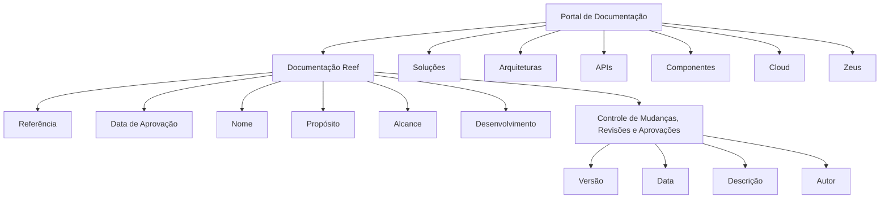

# Procedimento de Documentação Reef — Referência Estruturada

## 1. Metadados do Documento
- **Arquivo de Origem:** Não identificado
- **Tipo de Documento:** Procedimento
- **Domínio / Sistema:** Reef / Mapfre
- **Público-Alvo:** Não identificado
- **Data/Versão Identificada:** Não identificada

---

## 2. Resumo Executivo & Contexto de Negócio

O conteúdo apresenta um modelo de referência para documentação de procedimentos no contexto de **Reef**, com menções a **Mapfre** e à área de documentação. A estrutura indica campos mínimos para registrar referência, data de aprovação, nome, propósito, alcance, desenvolvimento e controle de mudanças, revisões e aprovações.

O procedimento orienta que a data de aprovação seja informada no formato `dd/mm/aaaa`. Também estabelece que o nome do procedimento, seu propósito e seu alcance devem ser explicitamente preenchidos, mas não fornece valores concretos para esses campos.

A referência inclui elementos de navegação e classificação documental, como “Documentación / DOCUMENTACIÓN Reef”, “Owner”, “Lifecycle” e “Approved Source”. Há ainda uma identificação de proprietário apresentada como `user:agonzalez_mapfre.com`.

O material não detalha arquitetura de software, integrações, métodos HTTP, contratos de API, servidores, ambientes, controles de acesso ou regras operacionais adicionais. Portanto, o conteúdo deve ser interpretado como um template ou estrutura de documentação, e não como uma especificação técnica completa.

---

## 3. Arquitetura, Componentes & Tecnologias Envolvidas

Os componentes e termos explicitamente citados são:

- **Reef:** contexto ou sistema associado à documentação.
- **Mapfre:** organização ou domínio mencionado no material.
- **Zeus:** item disponível na navegação apresentada.
- **Cloud:** categoria disponível na navegação apresentada.
- **APIs:** categoria disponível na navegação apresentada.
- **Componentes:** categoria disponível na navegação apresentada.
- **Arquitecturas:** categoria disponível na navegação apresentada.
- **Soluciones:** categoria disponível na navegação apresentada.
- **Documentación:** categoria de navegação e classificação.
- **Owner:** campo de propriedade do documento.
- **Lifecycle:** campo de ciclo de vida documental.
- **Approved Source:** indicação de fonte aprovada.



**Nota de Análise:** o conteúdo não descreve relações técnicas, interfaces, integrações, tecnologias de implementação ou fluxos de dados entre Reef, Mapfre, Zeus, APIs, componentes e Cloud.

---

## 4. Regras de Negócio, Especificações Funcionais & Processos

1. O procedimento deve possuir uma **referência**.
2. A **data de aprovação** deve ser informada no formato `dd/mm/aaaa`.
3. O campo **nome** deve registrar o nome atribuído ao procedimento.
4. O campo **propósito** deve especificar o objetivo do procedimento.
5. O campo **alcance** deve indicar a abrangência do procedimento.
6. A seção **desenvolvimento** deve conter o conteúdo do procedimento.
7. O documento deve conter uma seção de **controle de mudanças, revisões e aprovações**.
8. O controle de mudanças deve incluir, no mínimo, os campos:
   - Versão;
   - Data;
   - Descrição;
   - Autor.
9. O conteúdo apresenta a documentação como associada a **Reef** e identifica o ciclo de vida como **Approved**.
10. O material apresenta o proprietário como `user:agonzalez_mapfre.com`.

**Nota de Análise:** o documento não especifica critérios para aprovação, responsáveis por revisão, periodicidade de atualização, regras de versionamento, fluxo de publicação ou permissões de edição.

---

## 5. Tabelas de Parâmetros, Ambientes e Estruturas de Dados

| Item / Parâmetro | Descrição / Função | Tipo / Valores / Formato | Ambiente / Observações |
| :--- | :--- | :--- | :--- |
| Referência | Campo para informar a referência do procedimento | Não detalhado | O texto informa que a referência é registrada neste ponto |
| Data de aprovação | Data associada à aprovação do procedimento | Formato `dd/mm/aaaa` | Formato explicitamente requerido |
| Nome | Nome atribuído ao procedimento | Texto | Deve indicar o nome que recebe o procedimento |
| Propósito | Objetivo do procedimento | Texto | Deve especificar o propósito |
| Alcance | Abrangência do procedimento | Texto | Deve indicar o alcance |
| Desenvolvimento | Conteúdo do procedimento | Texto estruturado | Seção destinada ao desenvolvimento do conteúdo |
| Controle de mudanças, revisões e aprovações | Registro de evolução, revisões e aprovações | Tabela ou estrutura equivalente | Deve conter versão, data, descrição e autor |
| Versão | Identificador da versão documental | Não detalhado | Campo do controle de mudanças |
| Data | Data do evento de mudança, revisão ou aprovação | Não detalhado | Campo do controle de mudanças |
| Descrição | Descrição da mudança, revisão ou aprovação | Texto | Campo do controle de mudanças |
| Autor | Autor do registro ou alteração | Texto | Campo do controle de mudanças |
| Owner | Proprietário identificado no conteúdo | `user:agonzalez_mapfre.com` | Apresentado como proprietário |
| Lifecycle | Estado do ciclo de vida | `Approved` | Estado explicitamente exibido |
| Source | Fonte do conteúdo | `VL` | Apresentado junto de “Approved Source” |
| Idioma | Idioma exibido na navegação | `ES` | Interface ou contexto em espanhol |
| Domínio documental | Classificação exibida | `DOCUMENTACIÓN Reef` | Associada a Mapfre e Reef |

---

## 6. Bateria de Perguntas & Respostas para RAG (FAQ Sintético)

### P1: Quais são os campos obrigatórios apresentados para documentar um procedimento Reef?
**R:** O conteúdo apresenta os campos Referência, Data de Aprovação, Nome, Propósito, Alcance, Desenvolvimento e Controle de Mudanças, Revisões e Aprovações.

### P2: Qual formato deve ser utilizado para a data de aprovação do procedimento?
**R:** A data de aprovação deve ser informada no formato `dd/mm/aaaa`.

### P3: O que deve ser registrado no campo “Nome” do procedimento?
**R:** O campo “Nome” deve indicar o nome que recebe o procedimento.

### P4: Qual é a finalidade do campo “Propósito”?
**R:** O campo “Propósito” deve especificar o objetivo do procedimento documentado.

### P5: O que deve constar na seção “Alcance”?
**R:** A seção “Alcance” deve indicar a abrangência do procedimento. O conteúdo não define critérios adicionais para delimitar esse alcance.

### P6: Quais informações devem estar no controle de mudanças, revisões e aprovações?
**R:** O controle de mudanças, revisões e aprovações deve conter os campos Versão, Data, Descrição e Autor.

### P7: Qual é o estado de ciclo de vida identificado para a documentação?
**R:** O campo “Lifecycle” é apresentado com o valor `Approved`.

### P8: Quem é identificado como proprietário da documentação?
**R:** O conteúdo apresenta `user:agonzalez_mapfre.com` no campo “Owner”.

### P9: O documento especifica como aprovações devem ser realizadas?
**R:** Não. O documento menciona data de aprovação e uma seção de controle de mudanças, revisões e aprovações, mas não detalha etapas, responsáveis, critérios ou workflow de aprovação.

### P10: O documento descreve APIs, contratos técnicos ou integrações de Reef?
**R:** Não. “APIs”, “Componentes”, “Cloud”, “Arquitecturas”, “Soluciones” e “Zeus” aparecem como itens de navegação, sem descrição técnica, endpoints, métodos, contratos ou integrações.

---

## 7. Glossário de Termos, Siglas & Conceitos-Chave

- **Reef:** nome associado à documentação e ao contexto do procedimento.
- **Mapfre:** nome presente na identificação “Mapfredocument”.
- **Owner:** campo que identifica o proprietário do conteúdo.
- **Lifecycle:** campo que representa o ciclo de vida do documento.
- **Approved:** valor apresentado para o ciclo de vida documental.
- **Approved Source:** expressão exibida no conteúdo; não há detalhamento adicional sobre sua semântica operacional.
- **VL:** valor exibido junto de “Approved Source”; seu significado não é definido no texto.
- **APIs:** item de navegação citado; não há detalhamento de interfaces ou contratos.
- **Cloud:** item de navegação citado; não há detalhamento de ambiente ou tecnologia.
- **Zeus:** item de navegação citado; não há detalhamento funcional ou técnico.
- **Documentación / DOCUMENTACIÓN Reef:** classificação ou caminho de navegação da documentação relacionada a Reef.

---

## 8. Notas Críticas, Riscos & Limitações

- O arquivo de origem, a data, a versão e o público-alvo não foram identificados no conteúdo fornecido.
- O conteúdo não detalha arquitetura de software, componentes internos, protocolos, integrações, APIs, URLs, ambientes, portas, tecnologias ou mecanismos de autenticação.
- O termo `VL` é apresentado, mas não é definido.
- O material não estabelece regras para criação, aprovação, revisão, publicação, expiração ou arquivamento de documentos.
- As entradas “Soluciones”, “Arquitecturas”, “APIs”, “Componentes”, “Cloud” e “Zeus” aparecem somente como opções de navegação.
- **Nota de Análise:** o documento fornece uma estrutura de procedimento, mas não contém conteúdo operacional preenchido para referência, nome, propósito, alcance ou desenvolvimento.

---

## 9. Conteúdo Bruto Estruturado (Referência Fiel)

```text
--- [PÁGINA 1 DE 1] ---

REFERENCIA
En este punto se informa de la referencia

FECHA DE APROBACIÓN
indicar la fecha con formato dd/mm/aaaa

NOMBRE
Indicar el nombre que recibe el procedimiento

PROPÓSITO
Especicar el propósito del procedimiento

ALCANCE
Indicar el alcance del procedimiento

DESARROLLO
En este punto se desarrolla el contenido del procedimiento

CONTROL DE CAMBIOS, REVISIONES Y APROBACIONES
VERSIÓN FECHA DESCRIPCIÓN AUTOR

Documentation / DOCUMENTACIÓN Reef
DOCUMENTACIÓN Reef
Mapfredocument
DOCUMENTACIÓN Reef
Owner
user:agonzalez_mapfre.com
Lifecycle
Approved Source
 /
 VL
Buscar Inicio Soluciones Arquitecturas APIs Componentes Cloud Documentación Zeus Reef Ayuda
ES
```
