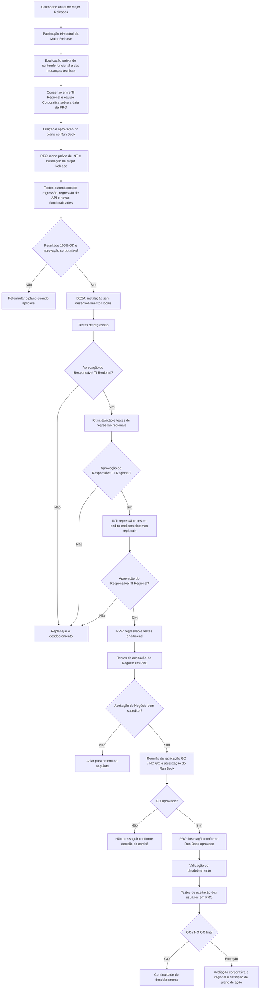

# Procedimento REEF.100 — Desdobramento de Major Releases do REEF CORE TRON em Produção

## 1. Metadados do Documento
- **Arquivo de Origem:** `Não identificado no conteúdo extraído`
- **Tipo de Documento:** `Procedimento`
- **Domínio / Sistema:** `REEF CORE TRON`
- **Público-Alvo:** `Equipes corporativas, equipes regionais de TI, equipes locais de TI, Qualidade e Negócio`
- **Data/Versão Identificada:** `Referência PRO.ENT.010; aprovação em 29/05/2024; versão V 0.1`

---

## 2. Resumo Executivo & Contexto de Negócio

O procedimento REEF.100 estabelece a operação de desdobramento de software das Major Releases do REEF CORE TRON para o ambiente de Produção dos países que operam com REEF. O propósito declarado é assegurar validade, qualidade, segurança e operacionalidade das instalações, reduzindo o risco de indisponibilidade dos ambientes.

Uma Major Release do CORE TRON pode conter evolutivos de projetos, grandes evolutivos, novas funcionalidades, correções de vulnerabilidades e nivelamento de correções. O documento determina um calendário anual para planejar as publicações, com data de abertura, encerramento de conteúdo e publicação para cada release. A cadência prevista é trimestral, totalizando quatro Major Releases por ano.

Após a publicação corporativa, a Major Release percorre uma sequência de ambientes para instalação, testes, certificação e aprovações antes de chegar à Produção: REC, DESA, IC, INT, PRE e PRO. O processo envolve responsabilidades compartilhadas entre as equipes Corporativa, Regional de TI, Local de TI, Qualidade e Negócio.

O planejamento para Produção deve considerar o impacto funcional e técnico da release. As equipes técnicas dos países recebem previamente a explicação do conteúdo e das mudanças técnicas. A data de subida à Produção é consensuada entre a equipe Regional de TI e a equipe Corporativa, e o plano é formalizado no Run Book de desdobramento.

O fluxo de aprovação possui gates explícitos. Resultados de testes não satisfatórios demandam reformulação, replanejamento, suspensão ou adiamento do desdobramento, conforme o ambiente e a fase. A decisão final de avanço é registrada como GO / NO GO e depende dos resultados de aceitação, análise de exceções e conformidade do Run Book, incluindo plano de rollback.

---

## 3. Arquitetura, Componentes & Tecnologias Envolvidas

### Componentes, sistemas e equipes identificados

| Componente / Entidade | Papel identificado no procedimento |
| :--- | :--- |
| REEF CORE TRON | Sistema central cujas Major Releases são promovidas até Produção. |
| Core TRON | Componente integrado com sistemas regionais nos testes de INT e PRE. |
| REEF Corporativo | Contexto corporativo que utiliza o ambiente REC e participa de testes, aprovações e autorizações. |
| Sistemas regionais | Sistemas locais ou regionais integrados ao Core TRON durante testes end-to-end. |
| Desenvolvimentos locais | Desenvolvimentos sob responsabilidade regional; não devem ser incluídos na instalação em DESA. |
| Ambiente REC | Ambiente corporativo de recepção, clonado previamente a partir de INT. |
| Ambiente DESA | Ambiente regional de desenvolvimento. |
| Ambiente IC | Ambiente regional de Integração Contínua. |
| Ambiente INT | Ambiente regional de integração. |
| Ambiente PRE | Ambiente regional de pré-produção. |
| Ambiente PRO | Ambiente local ou regional de Produção. |
| Run Book de desdobramento | Registro do plano, atividades, horários, responsáveis, testes, estados, rollback e autorizações. |
| Comitê GO / NO GO | Instância de decisão sobre continuidade do desdobramento para Produção. |
| Equipe Corporativa | Executa ou participa de testes corporativos, aprovações, planejamento e autorizações. |
| Equipe Regional de TI | Executa testes regionais, aprova continuidade do processo e coordena com Negócio. |
| Equipe de Qualidade Corporativa | Executa testes no ambiente REC junto à equipe Corporativa. |
| Equipe de Negócio | Executa testes de aceitação em PRE e PRO. |

### Fluxo de promoção e aprovação



### Nota de análise

O documento não detalha tecnologias de infraestrutura, linguagens de programação, protocolos de integração, métodos HTTP, contratos JSON, ferramentas de CI/CD ou mecanismos técnicos de execução de scripts. O documento menciona testes de regressão de API, mas não especifica as APIs, contratos ou ferramentas utilizadas.

---

## 4. Regras de Negócio, Especificações Funcionais & Processos

### Escopo do procedimento

1. O procedimento aplica-se aos desdobramentos de Major Releases do CORE TRON em Produção nos países que operam com REEF.
2. Major Releases podem incluir evolutivos de projetos, grandes evolutivos, novas funcionalidades, correções de vulnerabilidades e nivelamento de correções.
3. Deve existir um calendário anual de planejamento das publicações.
4. Para cada Major Release, o calendário deve especificar:
   - Data de abertura.
   - Data de fechamento do conteúdo.
   - Data de publicação.
5. A periodicidade de publicação é trimestral, com quatro Major Releases ao ano.
6. Após publicada, a release inicia instalações sucessivas pelos ambientes prévios, com testes e certificação até a chegada a Produção.

### Planejamento prévio para Produção

1. Antes da publicação da Major Release, os times técnicos dos países REEF devem receber apresentação e explicação:
   - Do conteúdo funcional da release.
   - Das mudanças técnicas associadas.
   - Do impacto esperado do desdobramento em Produção.
2. A data de subida a Produção deve ser consensuada entre a equipe Regional de TI e a equipe Corporativa.
3. Deve ser estabelecido um calendário de atividades para equipes técnicas e de Negócio.
4. O plano normalmente começa três semanas antes da data de subida a Produção.
5. O período de três semanas pode ser inferior ou superior conforme o plano elaborado.
6. O plano de desdobramento deve ser registrado no Run Book.
7. O estabelecimento do plano envolve a equipe Corporativa e a equipe Regional de TI.
8. As autorizações do plano são atribuídas aos responsáveis de TI Regional e Corporativo.
9. Apenas após aprovação do plano devem começar as atividades de promoção pelos ambientes.

### Semana 0 — Ambiente REC

1. O ambiente REC deve ter sido previamente clonado a partir da situação existente no ambiente INT do REEF.
2. A Major Release deve ser instalada sobre o cenário clonado.
3. Devem ser resolvidos todos os problemas derivados da instalação da release, incluindo inválidos de Core e locais.
4. Devem ser executados:
   - Testes automáticos de regressão, incluindo regressão de API.
   - Testes de novas funcionalidades de acordo com os novos casos de teste disponibilizados.
5. A execução dos testes é responsabilidade da equipe Corporativa e da equipe de Qualidade Corporativa.
6. Os resultados da execução devem ser registrados.
7. O resultado dos testes de regressão deve ser **100% OK**.
8. A continuação do processo depende da aprovação do Responsável da equipe Corporativa.
9. Caso não exista conformidade com os resultados dos testes em REC, o plano deve ser reformulado quando aplicável.

### Semana 1 — Ambientes DESA, IC e INT

#### DESA

1. A release é instalada em DESA.
2. A instalação deve excluir os desenvolvimentos locais, pois esses desenvolvimentos devem ficar descartados.
3. Devem ser executados scripts de testes de regressão.
4. Se os testes não forem bem-sucedidos, o processo de desdobramento deve ser replanejado.
5. O Responsável TI Regional aprova a continuidade do processo em função dos resultados.

#### IC

1. A release é instalada no ambiente IC.
2. A equipe Regional de TI deve executar testes de regressão.
3. Se os testes não forem bem-sucedidos, o processo deve ser replanejado.
4. O Responsável TI Regional aprova ou não a continuidade de acordo com os resultados.

#### INT

1. A instalação em INT ocorre de quarta-feira a sexta-feira, no plano de três semanas apresentado.
2. Devem ser executados:
   - Scripts de testes de regressão.
   - Testes end-to-end.
   - Testes que incluam a integração entre Core TRON e sistemas regionais.
3. A equipe Regional de TI executa os testes.
4. Se os testes não forem bem-sucedidos, o processo deve ser replanejado.
5. Após a aprovação de continuidade pelo Responsável TI Regional, o plano de testes com os usuários deve ser ratificado para a semana seguinte.

### Semana 2 — Ambiente PRE, aceitação de Negócio e decisão GO / NO GO

#### PRE

1. A instalação em PRE ocorre na segunda-feira.
2. Devem ser executados scripts de regressão e testes end-to-end.
3. Os testes devem incluir a integração entre Core TRON e sistemas regionais.
4. A equipe Regional de TI executa os testes.
5. Caso os testes não sejam bem-sucedidos, o processo de desdobramento fica suspenso e o prazo é estendido por uma semana.
6. O Responsável TI Regional aprova a continuidade de acordo com os resultados.
7. Deve ser confirmado ao Negócio o início das provas de Negócio no dia seguinte, incluindo horário e duração.

#### Aceitação de Negócio em PRE

1. As provas de aceitação são executadas por Negócio de segunda-feira a quarta-feira.
2. Caso o resultado não seja bem-sucedido, o processo é adiado para a próxima semana.
3. Os resultados dos casos de teste devem ser detalhados como:
   - `OK`
   - `NO OK`
4. Para cada caso `NO OK`, deve ser identificada uma das classificações:
   - **Incidência Bloqueante:** paralisa a operação ou funcionalidade afetada, sem alternativa ou workaround.
   - **Incidência não Bloqueante:** paralisa a operação ou funcionalidade afetada, mas existe alternativa para operar a funcionalidade.
5. O Run Book deve ser atualizado com o estado final dos testes de Negócio.
6. Em caso de êxito, a aprovação é atribuída ao Responsável da equipe de Negócio e ao Responsável TI Regional.

#### Ratificação da aprovação e atualização do Run Book

1. Na quinta-feira deve ocorrer reunião de decisão GO / NO GO.
2. O comitê toma a decisão de continuar ou não com o desdobramento com base em:
   - Resultados dos testes de aceitação.
   - Análise de exceções, caso existam.
   - Conformidade do Run Book, incluindo atividades, tempos e plano de rollback.
3. O Run Book deve registrar:
   - Ratificação do GO pelos responsáveis Corporativos.
   - Processo completo de desdobramento com tempos de instalação.
   - Minutograma no horário local e no horário corporativo.
   - Testes de regressão e de operação a realizar.
   - Procedimento de rollback para reversão da instalação, se necessário.
   - Comunicação e aprovação do Run Book.
4. A responsabilidade indicada para esta etapa é do Responsável da equipe TI Regional e do Responsável da Equipe Corporativa de Desdobramentos.

### Instalação e aceitação em Produção

1. A instalação em PRO ocorre no sábado.
2. As atividades de instalação em PRO devem seguir o Run Book aprovado.
3. Devem ser executados testes de validação do desdobramento.
4. No domingo, usuários de Negócio executam os testes de aceitação definidos para Produção.
5. Após os testes de usuários em PRO, deve ser tomada decisão GO / NO GO conforme os resultados.
6. Em caso de êxito, os responsáveis são:
   - Responsável da equipe de Negócio.
   - Responsável TI Regional.
7. Em caso de exceção, os responsáveis Corporativos e Regionais devem:
   - Avaliar a gravidade e a importância dos resultados dos testes.
   - Determinar a continuidade do desdobramento.
   - Estabelecer planos de ação para resolução no tempo e forma definidos.

---

## 5. Tabelas de Parâmetros, Ambientes e Estruturas de Dados

### Ambientes de desdobramento

| Item / Parâmetro | Descrição / Função | Tipo / Valores / Formato | Ambiente / Observações |
| :--- | :--- | :--- | :--- |
| REC | Ambiente de recepção REEF Corporativo. | Ambiente de desdobramento. | Deve ser previamente clonado a partir da situação de INT; uso exclusivo das equipes Corporativas. |
| DESA | Ambiente de desenvolvimento REEF regional. | Ambiente de desdobramento. | Contém desenvolvimentos sob responsabilidade das equipes regionais de TI. |
| IC | Ambiente de Integração Contínua REEF regional. | Ambiente de desdobramento. | Resolve conflitos de integração com desenvolvimentos regionais. |
| INT | Ambiente de Integração REEF regional. | Ambiente de desdobramento. | Realiza testes de integração entre Core TRON e sistemas locais. |
| PRE | Ambiente de Pré-Produção REEF regional. | Ambiente de desdobramento. | Utilizado antes de Produção para provas de Negócio. |
| PRO | Ambiente local ou regional de Produção. | Ambiente de desdobramento. | Destino final do fluxo de instalação e aceitação de usuários. |

### Planejamento e cronograma

| Item / Parâmetro | Descrição / Função | Tipo / Valores / Formato | Ambiente / Observações |
| :--- | :--- | :--- | :--- |
| Calendário anual | Planeja as publicações das Major Releases. | Anual. | Especifica abertura, fechamento de conteúdo e publicação de cada release. |
| Cadência de publicação | Frequência das Major Releases. | Trimestral; 4 Major Releases/ano. | Aplicável ao CORE TRON. |
| Antecedência do plano | Período previsto para iniciar atividades antes da Produção. | Três semanas, podendo ser menor ou maior. | Depende do plano de desdobramento elaborado. |
| Semana 0 | Instalação e testes no REC. | Terça-feira a segunda-feira; 5 dias. | Inclui regressão automática, regressão de API e testes de novas funcionalidades. |
| Semana 1 | Promoção por DESA, IC e INT. | Terça-feira a sexta-feira. | INT ocorre de quarta-feira a sexta-feira. |
| Semana 2 | PRE, testes de Negócio, GO / NO GO e PRO. | Segunda-feira a domingo. | Instalação em PRO no sábado; aceitação de usuários em PRO no domingo. |

### Critérios de teste, resultado e tratamento

| Item / Parâmetro | Descrição / Função | Tipo / Valores / Formato | Ambiente / Observações |
| :--- | :--- | :--- | :--- |
| Regressão em REC | Validação automática da Major Release. | Inclui regressão de API. | Resultado deve ser 100% OK. |
| Novas funcionalidades em REC | Validação das funcionalidades introduzidas. | Conforme novos casos de teste. | Executada por equipe Corporativa e Qualidade Corporativa. |
| Regressão em DESA | Validação após instalação sem desenvolvimentos locais. | Scripts de testes de regressão. | Falha exige replanejamento. |
| Regressão em IC | Validação regional após instalação em IC. | Testes de regressão. | Falha exige replanejamento. |
| Regressão e end-to-end em INT | Validação da integração regional. | Scripts de regressão e testes end-to-end. | Deve incluir integração do Core TRON com sistemas regionais. |
| Regressão e end-to-end em PRE | Validação prévia à aceitação de Negócio. | Scripts de regressão e testes end-to-end. | Falha suspende o processo e estende prazo por uma semana. |
| Aceitação de Negócio em PRE | Aceitação funcional pela área de Negócio. | Resultado por caso: OK ou NO OK. | Falha adia o processo para a semana seguinte. |
| Incidência Bloqueante | Falha sem alternativa operacional. | Classificação de caso NO OK. | Paralisa a operação ou funcionalidade afetada sem workaround. |
| Incidência não Bloqueante | Falha com alternativa operacional disponível. | Classificação de caso NO OK. | Paralisa a funcionalidade afetada, mas existe alternativa de operação. |
| Validação em PRO | Validação após instalação produtiva. | Testes de validação do desdobramento. | Executada conforme Run Book aprovado. |
| Aceitação de usuários em PRO | Aceitação produtiva por usuários de Negócio. | Base para GO / NO GO final. | Executada no domingo, conforme plano apresentado. |

### Estrutura obrigatória do Run Book

| Item / Parâmetro | Descrição / Função | Tipo / Valores / Formato | Ambiente / Observações |
| :--- | :--- | :--- | :--- |
| Data | Data da atividade. | Data. | Campo do Run Book. |
| Hora local | Intervalo da atividade no horário local. | Desde / até. | Campo do Run Book. |
| Hora Espanha | Intervalo da atividade no horário da Espanha. | Desde / até. | Campo do Run Book. |
| Atividade a realizar | Descrição da ação prevista. | Texto. | Campo do Run Book. |
| Responsável pela atividade | Pessoa ou área responsável. | Pessoa ou área. | Campo do Run Book. |
| Duração da atividade | Tempo previsto ou registrado. | Duração. | Campo do Run Book. |
| Observações | Informações complementares. | Texto. | Campo do Run Book. |
| Estado | Situação de execução da atividade. | Pendente, em curso, completado, cancelado. | Campo do Run Book. |
| Rollback | Procedimento de reversão da instalação. | Procedimento. | Deve ser utilizado caso seja necessário reverter a instalação. |
| Minutograma | Tempos de instalação do processo completo. | Horário local e corporativo. | Deve ser incluído na ratificação do GO. |
| Testes a realizar | Testes previstos durante o desdobramento. | Regressão e operação. | Deve constar no Run Book. |

### Autorizações corporativas

| Autorizador | Função / Autorização | Tipo / Valores / Formato | Ambiente / Observações |
| :--- | :--- | :--- | :--- |
| Carolina Vázquez | Publicação de Linha Base de Major Release / Patches. | Autorização corporativa. | Equipes Corporativas. |
| Antonio Sánchez | Execução de desdobramento. | Autorização corporativa. | Equipes Corporativas. |
| David Jiménez | Execução de desdobramento. | Autorização corporativa. | Equipes Corporativas. |
| José de Abreu | Autorização final GO / NO GO. | Autorização corporativa. | Equipes Corporativas. |
| Nuno Simoes | Autorização final GO / NO GO. | Autorização corporativa. | Equipes Corporativas. |

### Autorizações regionais e locais

| Instância REEF | Autorizador | Tipo / Valores / Formato | Ambiente / Observações |
| :--- | :--- | :--- | :--- |
| REEF CA | Rubén Aristizabal | Responsável REEF TI Regional. | Autorizações Equipes Regional / Local. |
| REEF Vida | Marcelo Trigo | Responsável REEF TI Local. | Autorizações Equipes Regional / Local. |

### Histórico de controle de mudanças, revisões e aprovações

| Versão | Data | Descrição | Autor(es) |
| :--- | :--- | :--- | :--- |
| V 0.1 | 04/03/2024 | Descrição. | Miguel Ángel Muñoz; Carolina Vázquez Rúa; Ahmet Hakan Guzel. |
| V 0.1 | 18/04/2024 | Primeira revisão. | Miguel Ángel Muñoz; Carolina Vázquez Rúa; Ahmet Hakan Guzel; Rubén Aristizabal. |
| V 0.1 | 29/05/2024 | Aprovação Comitê DST. | Não identificado no trecho de controle de mudanças. |

---

## 6. Bateria de Perguntas & Respostas para RAG (FAQ Sintético)

### P1: Qual é o objetivo do procedimento REEF.100?
**R:** O procedimento REEF.100 estabelece a operação de desdobramento das Major Releases do REEF CORE TRON para Produção nos países que utilizam REEF. O objetivo é garantir validade, qualidade, segurança e operacionalidade das instalações, minimizando o risco de indisponibilidade dos ambientes.

### P2: O que caracteriza uma Major Release do CORE TRON?
**R:** Uma Major Release do CORE TRON pode conter evolutivos de projetos, grandes evolutivos, novas funcionalidades, correções de vulnerabilidades e nivelamento de correções.

### P3: Qual é a frequência de publicação das Major Releases de CORE TRON?
**R:** A publicação é trimestral, com quatro Major Releases por ano. O planejamento anual deve definir, para cada release, as datas de abertura, fechamento de conteúdo e publicação.

### P4: Quais ambientes fazem parte do fluxo de desdobramento da Major Release?
**R:** O fluxo envolve os ambientes REC, DESA, IC, INT, PRE e PRO. A sequência promove a Major Release desde a recepção corporativa até Produção, com testes e aprovações em cada etapa.

### P5: Como o ambiente REC deve ser preparado e quais testes são exigidos?
**R:** O ambiente REC deve ser previamente clonado a partir da situação existente em INT. A Major Release é instalada nesse cenário e devem ser resolvidos problemas derivados da instalação, incluindo inválidos de Core e locais. Devem ser executados testes automáticos de regressão, incluindo regressão de API, e testes das novas funcionalidades. O resultado da regressão deve ser 100% OK.

### P6: Por que os desenvolvimentos locais não devem ser incluídos na instalação em DESA?
**R:** O procedimento determina que a release seja instalada em DESA com a precaução de não incluir desenvolvimentos locais, pois esses desenvolvimentos devem ficar descartados nessa instalação.

### P7: Quais testes são realizados no ambiente INT?
**R:** Em INT, a equipe Regional de TI executa scripts de testes de regressão e testes end-to-end. Os testes end-to-end devem incluir a integração entre o Core TRON e os sistemas regionais.

### P8: O que acontece se os testes em PRE não forem bem-sucedidos?
**R:** Caso os testes de regressão e end-to-end em PRE não sejam bem-sucedidos, o processo de desdobramento fica suspenso e o prazo é estendido por uma semana.

### P9: Como devem ser classificados os casos de teste de Negócio com resultado NO OK?
**R:** Casos NO OK devem ser classificados como Incidência Bloqueante ou Incidência não Bloqueante. Uma Incidência Bloqueante paralisa a operação ou funcionalidade sem alternativa ou workaround. Uma Incidência não Bloqueante também paralisa a funcionalidade afetada, mas existe uma alternativa para operar com ela.

### P10: Quais informações o Run Book de desdobramento deve conter?
**R:** O Run Book deve conter data, horário local, horário da Espanha, atividade, responsável, duração, observações, estado e rollback. Na etapa de ratificação também deve registrar o GO corporativo, o minutograma em horário local e corporativo, testes de regressão e operação, procedimento de rollback, comunicação e aprovação.

### P11: Quais critérios são usados na reunião de decisão GO / NO GO antes de Produção?
**R:** O comitê avalia os resultados dos testes de aceitação, as exceções existentes e a conformidade do Run Book, incluindo atividades, tempos e plano de marcha atrás ou rollback.

### P12: Quando é realizada a instalação em PRO e quando ocorre a aceitação dos usuários?
**R:** No plano de três semanas descrito, a instalação em PRO ocorre no sábado, conforme o Run Book aprovado. Os testes de aceitação dos usuários de Negócio em PRO ocorrem no domingo, seguidos da decisão GO / NO GO.

### P13: Quem possui autorização final corporativa para GO / NO GO?
**R:** José de Abreu e Nuno Simoes possuem a autorização final corporativa para GO / NO GO, conforme a tabela de autorizações das equipes Corporativas.

---

## 7. Glossário de Termos, Siglas & Conceitos-Chave

- **CORE TRON:** Sistema ou componente central mencionado no procedimento de Major Releases REEF.
- **DESA:** Ambiente de desenvolvimento REEF regional.
- **GO / NO GO:** Decisão de continuar ou não o desdobramento, tomada com base em testes, exceções e conformidade do Run Book.
- **IC:** Ambiente de Integração Contínua REEF regional.
- **INT:** Ambiente de Integração REEF regional.
- **Major Release:** Publicação que pode incluir evolutivos, grandes evolutivos, novas funcionalidades, correções de vulnerabilidades e nivelamento de correções.
- **NO OK:** Resultado de caso de teste que requer classificação e tratamento de incidência.
- **OK:** Resultado positivo de caso de teste.
- **PRE:** Ambiente de Pré-Produção REEF regional.
- **PRO:** Ambiente de Produção local ou regional.
- **REC:** Ambiente de recepção REEF Corporativo.
- **REEF:** Contexto ou sistema corporativo/regional em que ocorre o procedimento descrito.
- **Rollback / marcha atrás:** Procedimento para reverter a instalação quando necessário.
- **Run Book:** Registro do plano de desdobramento, com atividades, horários, responsáveis, duração, estados, testes, autorizações e rollback.
- **Teste end-to-end:** Teste que inclui a integração entre Core TRON e sistemas regionais.
- **TI:** Tecnologia da Informação.
- **DST:** Comitê responsável pela aprovação identificada em 29/05/2024. O documento não expande a sigla.

---

## 8. Notas Críticas, Riscos & Limitações

- O ambiente REC deve ser clonado previamente a partir de INT. Falhas nessa preparação podem comprometer a validade dos testes corporativos.
- O resultado da regressão no ambiente REC deve ser 100% OK; o procedimento estabelece esse critério explícito para continuidade.
- Falhas em DESA, IC ou INT exigem replanejamento do processo de desdobramento.
- Falhas em PRE suspendem o processo e estendem o prazo por uma semana.
- Falhas de aceitação de Negócio em PRE adiam o processo para a semana seguinte.
- O processo depende de alinhamento entre equipes Corporativas, Regionais de TI, Locais, Qualidade e Negócio.
- A decisão GO / NO GO depende da conformidade do Run Book, incluindo tempos, atividades e procedimento de rollback.
- Exceções em Produção exigem avaliação conjunta de responsáveis Corporativos e Regionais e definição de planos de ação.
- O documento não especifica ferramentas de automação, tecnologias de implantação, versionamento, infraestrutura, protocolos, critérios quantitativos adicionais de qualidade, nem contratos técnicos das integrações.
- O documento não detalha o significado expandido das siglas REEF, TRON e DST.

---

## 9. Conteúdo Bruto Estruturado (Referência Fiel)

```text
--- [PÁGINA 1 DE 6] ---

PROCEDIMIENTO REEF 100 Despliegue major release REEF CORE
TRON ORIGINAL
Referencia PRO.ENT.010
Fecha de aprobación 29/05/2024
Nombre (REEF.100) Procedimiento de despliegue Major Releases de REEF CORE TRON
Propósito
Este documento tiene por finalidad establecer el procedimiento para llevar a cabo la operativa de despliegue de software de REEF CORE
TRON en la producción de los países.
El objetivo es asegurar la validez, calidad, seguridad y operatividad de las actividades a desarrollar para realizar las instalaciones en los
entornos, y minimizar el riesgo de indisponibilidad de estos.
Alcance
El procedimiento se circunscribe a los despliegues de las Major Releases de CORE TRON en el entorno de Producción en los países que
operan con REEF.
Una Major Release se caracteriza por contener evolutivos de proyectos, grandes evolutivos, nuevas funcionalidades, corrección a
vulnerabilidades y nivelación de correctivos.
Desarrollo
De forma anual, se establece un calendario para la planificación de las publicaciones de las Major Releases de CORE TRON, quedando
especificadas para cada release la fecha de apertura, la fecha de cierre del contenido y la fecha de publicación.
La publicación es trimestral (4 Major Releases/año).
Una vez publicada la release, ésta quedará lista para comenzar el proceso de despliegue en el país, que le llevará a realizar instalaciones
sucesivas por los distintos entornos previos donde será probada y certificada hasta llegar a Producción.
Documentation / DOCUMENTACIÓN Reef
DOCUMENTACIÓN Reef
Mapfredocument
DOCUMENTACIÓN Reef
Owner
user:agonzalez_mapfre.com
Lifecycle
Approved Source
 / 
 VL
Buscar Inicio Soluciones Arquitecturas APIs Componentes Cloud Documentación Zeus Reef Ayuda
ES


--- [PÁGINA 2 DE 6] ---

ENTORNOS DE DESPLIEGUE REEF CORE
Los entornos involucrados en el despliegue de la Major Release de Core TRON son:
REC DESA IC INT PRE PRO
Recepción Desarrollo Integración Continua Integración Pre-Producción Producción
1. Entorno REC: Entorno de recepción REEF Corporativo. Previamente se clona con la situación existente en el entorno de INT de REEF y
sobre este escenario se instala el software de la Major Release. Es un entorno de uso exclusivo para los equipos Corporativos.
2. Entorno DESA: Entorno de desarrollo de REEF regional. Contiene los desarrollos que son responsabilidad de los equipos de TI regionales.
3. Entorno IC: Entorno de Integración Continua REEF regional. Se resuelven conflictos de integración con desarrollos regionales.
4. Entorno INT: Entorno de Integración REEF regional. Se realizan las pruebas de integración entre Core TRON y sistemas locales.
5. Entorno PRE: Entorno de Pre-Producción REEF regional. Previo a producción para realizar pruebas de Negocio.
6. Entorno PRO: Entorno de Producción local / regional.
PLANIFICACIÓN DESPLIEGUE A PRO
ACCIONES PREVIAS
Con antelación a la publicación de la Major Release se presentará y explicará a los equipos técnicos de los países Reef (equipos de TI), el
contenido funcional de la misma, así como los cambios técnicos que conlleva, de tal manera que se conozca con suficiente antelación el
impacto que va a suponer el despliegue de la release en producción y estén preparados para ello.
En función de este impacto se consensuará entre el equipo de TI Regional y el equipo Corporativo la fecha de subida a Producción de la Major
Release de CORE TRON.
Siguientes acciones:
Se establecerá el calendario de actividades a realizar por los equipos técnicos y de negocio. Las actividades comenzarán tres semanas antes
de la fecha de subida a producción. No obstante, este periodo de tres semanas podrá ser inferior o superior dependiendo del plan que se
confeccione.
El plan de despliegue quedará recogido en el Run Book de despliegue.
Establecimiento Plan de despliegue
Intervinientes Autorizaciones
Equipo Corporativo + Equipo TI Regional Responsables TI Regional + Corporativo
Conforme al plan aprobado se dará comienzo a las actividades de promoción de la Major Release por los entornos correspondientes.
En base a un plan de tres semanas, se exponen a continuación las acciones a llevar a cabo.
SEMANA 0
Día Actividad Pruebas Aprobación
Martes a
lunes
(semana 1)
(5 días)
Entorno REC
El entorno de Recepción
deberá haberse clonado
previamente del entorno
de Integración de REEF.
Sobre este escenario se
instala la versión de
Se realizarán pruebas de regresión
automáticas (incluyendo regresión de API).
Se realizarán las pruebas de las nuevas
funcionalidades conforme a los nuevos casos
de prueba que estas aporten.
Las pruebas serán ejecutadas por el equipo
Corporativo y el equipo de Calidad Corporativo.
Los resultados de la ejecución
de las pruebas deberán ser
registrados.
En función de estos resultados,
se deberá realizar la
aprobación por parte del
Responsable del equipo


--- [PÁGINA 3 DE 6] ---

Día Actividad Pruebas Aprobación
software de la Major
Release.
Se resolverán todos los
problemas derivados de la
instalación de la release
(inválidos de Core y
Locales).
El resultado de las pruebas de regresión debe
ser 100% OK.
Corporativo para continuar con
el proceso.
En caso de no haber
conformidad con los
resultados de las pruebas
ejecutadas en este entorno, se
deberá reformular el plan si se
da el caso.
SEMANA 1
Día Actividad Pruebas Aprobación
Martes Instalación en DESA
Se instala la release con la
precaución de no incluir
los desarrollos locales, ya
que estos deberán
quedarán descartados.
Se ejecutan los scripts de pruebas de
regresión.
En el caso de no tener éxito en el resultado de
las pruebas, el proceso de despliegue se
deberá replanificar.
Responsable TI Regional.
En función de los resultados de
las pruebas, aprobará la
continuación del proceso.
Martes Instalación en IC Se ejecutarán pruebas de regresión por el
equipo de TI Regional.
En el caso de no tener éxito en el resultado de
las pruebas, el proceso de despliegue se
deberá replanificar.
Responsable TI Regional.
En función de los resultados de
las pruebas, aprobará la
continuación del proceso.
Miércoles,
jueves y
viernes
Instalación en INT Se ejecutan los scripts de pruebas de
regresión y pruebas end to end, que incluirán la
integración del Core TRON con los sistemas
regionales.
Las pruebas serán ejecutadas por el equipo TI
Regional.
En el caso de no tener éxito en el resultado de
las pruebas, el proceso de despliegue se
deberá replanificar.
Responsable TI Regional.
Una vez aprobada la
continuación del proceso de
despliegue, se ratificará el plan
de pruebas con los usuarios
para la semana próxima.
SEMANA 2
Día Actividad Pruebas Aprobación
Lunes Instalación en PRE Se ejecutan los scripts de pruebas de
regresión y pruebas end to end, incluyendo la
integración del Core TRON con los sistemas
regionales.
Las pruebas serán ejecutadas por el equipo TI
Regional.
En el caso de no tener éxito en el resultado de
las pruebas, el proceso de despliegue quedará
suspendido extendiéndose el plazo por una
semana.
Responsable TI Regional.
En función de los resultados de
las pruebas, aprobará la
continuación del proceso.
Se confirma a Negocio el inicio
de las pruebas de Negocio al
día siguiente, horario y
duración de las mismas.


--- [PÁGINA 4 DE 6] ---

Día Actividad Pruebas Aprobación
Lunes,
martes y
miércoles
Pruebas aceptación
Negocio en PRE
Se ejecutarán las pruebas de aceptación por
parte de Negocio.
En el caso de no tener éxito en el resultado de
las pruebas, el proceso de despliegue quedará
emplazado a la próxima semana.
Se detallarán los resultados de los casos de
prueba (OK / NO OK).
Para los casos de prueba NO OK se deberá
identificar:
Incidencia Bloqueante (paraliza la
operativa / funcionalidad afectada por la
incidencia no habiendo ninguna otra
alternativa o work arround).
Incidencia no Bloqueante (paraliza la
operativa/funcionalidad afectada por la
incidencia, pero existe alternativa para
operar con dicha funcionalidad).
Se actualizará el Run Book con el estado final
de las pruebas de negocio.
En caso de éxito de las
pruebas:
Responsable equipo Negocio y
Responsable TI Regional.
Jueves Ratificación de la
aprobación + actualización
RUN BOOK despliegue
Reunión decisión GO / NO GO.
El comité tomará la decisión de continuar
adelantes con el despliegue en función de:
resultados de las pruebas de aceptación,
analizará las excepciones (en caso de
haberlas)
conformidad con el Run Book (actividades,
tiempos y plan de marcha atrás)
Se recoge en el Run Book:
Ratificación del GO por parte de los
responsables del Corporativo.
Proceso completo del despliegue con los
tiempos de instalación (minutograma en
horario local y corporativo).
Pruebas a realizar (regresión y de
operación).
Procedimiento de marcha atrás (rollback)
a seguir en caso de tener que revertir la
instalación.
Comunicación y aprobación del Run Book.
Responsable equipo TI
Regional y
Responsable Equipo
Corporativo Despliegues.
Sábado Instalación en PRO Comienzo actividades de instalación en PRO
conforme al Run Book aprobado.
Pruebas de validación del despliegue.


--- [PÁGINA 5 DE 6] ---

Día Actividad Pruebas Aprobación
Domingo Pruebas aceptación de
usuarios en PRO
Se ejecutarán las pruebas establecidas para
ejecutar y aceptar por parte de los usuarios de
Negocio.
Finalizadas las pruebas, y en función de los
resultados, se decidirá el GO / NO GO.
En caso de éxito: Responsable
equipo Negocio y Responsable
TI Regional.
En caso de excepción:
Responsables Corporativos y
Regional, quienes
determinarán continuar con el
despliegue una vez evaluado la
gravedad / importancia de los
resultados de las pruebas y
estableciendo planes de
acción para su resolución en
tiempo y forma.
RUN BOOK DESPLIEGUES
Detalle:
Fecha
Hora local (desde /hasta)
Hora España (desde/hasta)
Actividad a realizar
Responsable actividad (persona o área)
Duración actividad
Observaciones
Estado (pendiente, en curso, completado, cancelado)
Rollback (marcha atrás instalación):
Autorizaciones Equipos Corporativos
Autorizador Componentes
Carolina Vázquez Publicación Línea Base Major Release /
Parches
Antonio Sánchez Ejecución despliegue
David Jiménez Ejecución despliegue
José de Abreu Autorización final GO / NO GO
Nuno Simoes Autorización final GO / NO GO


--- [PÁGINA 6 DE 6] ---

Autorizaciones Equipos Regional / Local
Instancia Reef Autorizador
REEF CA Rubén Aristizabal Responsable REEF TI
Regional
REEF Vida Marcelo Trigo Responsable REEF TI
Local
Control de Cambios, Revisiones y Aprobaciones
Versión Fecha Descripción Autor
V 0.1 04/03/2024 Descripción Miguel Ángel Muñoz
Carolina Vázquez Rúa
Ahmet Hakan Guzel
V 0.1 18/04/2024 Primera revisión Miguel Ángel Muñoz
Carolina Vázquez Rúa
Ahmet Hakan Guzel
Rubén Aristizabal
V 0.1 29/05/2024 Aprobación Comité DST
```
