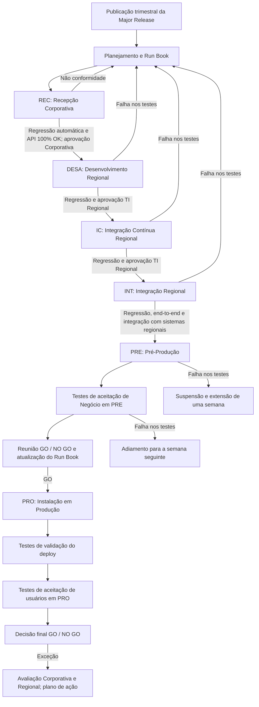

# Procedimento de Deploy de Major Releases do REEF CORE TRON em Produção

## 1. Metadados do Documento
- **Arquivo de Origem:** Não informado no conteúdo fornecido
- **Tipo de Documento:** Procedimento
- **Domínio / Sistema:** REEF CORE TRON
- **Público-Alvo:** Equipes Corporativas, TI Regional/Local, Qualidade, Negócio e responsáveis por deploy
- **Data/Versão Identificada:** V 0.1 — aprovação em 29/05/2024

---

## 2. Resumo Executivo & Contexto de Negócio

O documento PRO.ENT.010 define o procedimento para realizar o deploy de *Major Releases* do REEF CORE TRON nos ambientes de Produção dos países que operam com REEF. O propósito declarado é assegurar validade, qualidade, segurança e operabilidade das atividades de instalação, reduzindo o risco de indisponibilidade dos ambientes.

Uma *Major Release* pode conter evoluções de projetos, grandes evoluções, novas funcionalidades, correções de vulnerabilidades e nivelamento de corretivos. A publicação ocorre trimestralmente, totalizando quatro *Major Releases* por ano. Após a publicação, cada país inicia instalações sucessivas nos ambientes prévios até alcançar Produção.

O processo envolve os ambientes REC, DESA, IC, INT, PRE e PRO. Cada ambiente possui objetivo, responsáveis, testes e aprovações específicos. O avanço entre ambientes depende da aprovação dos responsáveis designados e dos resultados dos testes de regressão, integração, *end to end*, aceitação de negócio e validação de deploy.

O planejamento é registrado em um Run Book de deploy. O Run Book consolida atividades, responsáveis, horários locais e da Espanha, durações, estado de execução, testes, procedimento de rollback e o minutograma de instalação. A decisão de avançar para Produção é tomada em uma reunião formal de GO / NO GO.

---

## 3. Arquitetura, Componentes & Tecnologias Envolvidas

O procedimento descreve a promoção controlada de uma Major Release do REEF CORE TRON entre ambientes corporativos e regionais/locais. O texto não detalha tecnologias de infraestrutura, linguagens, protocolos, portas, APIs específicas, ferramentas de CI/CD ou contratos de integração.

### Componentes, ambientes e equipes citadas

| Componente / Entidade | Papel no procedimento |
| :--- | :--- |
| REEF CORE TRON | Sistema cujo software recebe as Major Releases e é promovido até Produção. |
| Major Release | Release trimestral contendo evoluções, novas funcionalidades, correções de vulnerabilidades e nivelamento de corretivos. |
| REC | Ambiente corporativo de recepção, previamente clonado do INT de REEF. |
| DESA | Ambiente regional de desenvolvimento com desenvolvimentos sob responsabilidade da TI regional. |
| IC | Ambiente regional de Integração Contínua, destinado à resolução de conflitos com desenvolvimentos regionais. |
| INT | Ambiente regional de integração para testes entre Core TRON e sistemas locais. |
| PRE | Ambiente regional de Pré-Produção para testes de Negócio. |
| PRO | Ambiente local/regional de Produção. |
| Equipe Corporativa | Executa testes em REC, participa do planejamento e possui responsabilidades de aprovação e autorização. |
| Equipe de Qualidade Corporativa | Executa testes em REC em conjunto com a equipe Corporativa. |
| Equipe TI Regional | Executa testes e atividades em DESA, IC, INT e PRE; participa de aprovações. |
| Equipe de Negócio | Executa testes de aceitação em PRE e em PRO. |
| Run Book de deploy | Registro formal do plano, minutograma, testes, responsáveis, estados e rollback. |
| Comitê GO / NO GO | Instância que decide a continuidade do deploy após avaliação das provas de aceitação, exceções e Run Book. |



> **Nota de Análise:** o documento menciona regressão de API em REC, mas não detalha APIs, métodos HTTP, contratos JSON, ferramentas de automação ou critérios técnicos adicionais além de resultado 100% OK.

---

## 4. Regras de Negócio, Especificações Funcionais & Processos

### 4.1 Escopo e periodicidade

1. O procedimento aplica-se aos deploys de Major Releases de CORE TRON no ambiente de Produção dos países que operam com REEF.
2. A publicação de Major Releases é trimestral: quatro Major Releases por ano.
3. Para cada release, existe calendário anual com:
   - Data de abertura;
   - Data de fechamento do conteúdo;
   - Data de publicação.
4. Após publicada, a release é instalada e certificada progressivamente nos ambientes anteriores à Produção.
5. Uma Major Release pode incluir:
   - Evolutivos de projetos;
   - Grandes evolutivos;
   - Novas funcionalidades;
   - Correções de vulnerabilidades;
   - Nivelamento de corretivos.

### 4.2 Planejamento prévio de Produção

1. Antes da publicação da Major Release, o conteúdo funcional e as mudanças técnicas devem ser apresentados aos times técnicos dos países REEF.
2. O objetivo da apresentação prévia é antecipar o impacto do deploy produtivo e preparar as equipes.
3. A data de subida para Produção deve ser consensuada entre a equipe de TI Regional e a equipe Corporativa, considerando o impacto da Major Release.
4. Deve ser estabelecido um calendário de atividades para as equipes técnicas e de Negócio.
5. As atividades normalmente começam três semanas antes da data de subida a Produção.
6. O período de três semanas pode ser menor ou maior conforme o plano definido.
7. O plano de deploy deve ser registrado no Run Book de deploy.
8. O estabelecimento do plano envolve:
   - **Intervenientes:** Equipe Corporativa e Equipe TI Regional;
   - **Autorizações:** Responsáveis de TI Regional e Corporativo.

### 4.3 Semana 0 — Ambiente REC

| Critério | Regra |
| :--- | :--- |
| Período | De terça-feira a segunda-feira da semana 1, durante cinco dias. |
| Atividade | Instalação da Major Release em REC. |
| Pré-condição | O ambiente REC deve ter sido previamente clonado a partir da situação existente no ambiente INT de REEF. |
| Responsáveis pelos testes | Equipe Corporativa e Equipe de Qualidade Corporativa. |
| Testes | Testes automáticos de regressão, incluindo regressão de API; testes das novas funcionalidades conforme os novos casos de teste. |
| Tratamento de problemas | Devem ser resolvidos todos os problemas decorrentes da instalação, incluindo inválidos de Core e locais. |
| Critério de aprovação | O resultado das provas de regressão deve ser 100% OK. |
| Evidência | Os resultados da execução dos testes devem ser registrados. |
| Aprovador | Responsável da equipe Corporativa. |
| Falha / não conformidade | O plano deve ser reformulado quando não houver conformidade com os resultados dos testes. |

### 4.4 Semana 1 — Ambientes DESA, IC e INT

| Dia / Período | Ambiente | Atividade | Testes | Aprovação | Tratamento de falha |
| :--- | :--- | :--- | :--- | :--- | :--- |
| Terça-feira | DESA | Instalar a release sem incluir desenvolvimentos locais, que devem ser descartados. | Scripts de testes de regressão. | Responsável TI Regional aprova a continuidade conforme os resultados. | O processo de deploy deve ser replanejado. |
| Terça-feira | IC | Instalação em Integração Contínua. | Testes de regressão pela equipe TI Regional. | Responsável TI Regional aprova a continuidade conforme os resultados. | O processo de deploy deve ser replanejado. |
| Quarta, quinta e sexta-feira | INT | Instalação em Integração regional. | Scripts de regressão e testes *end to end*, incluindo integração do Core TRON com sistemas regionais. | Responsável TI Regional aprova a continuidade. Após aprovação, o plano de testes da semana seguinte deve ser ratificado com os usuários. | O processo de deploy deve ser replanejado. |

### 4.5 Semana 2 — Ambiente PRE, testes de Negócio e decisão GO / NO GO

#### Instalação em PRE

| Critério | Regra |
| :--- | :--- |
| Dia | Segunda-feira. |
| Atividade | Instalação em PRE. |
| Testes | Scripts de regressão e testes *end to end*, incluindo integração entre Core TRON e sistemas regionais. |
| Responsável pela execução | Equipe TI Regional. |
| Aprovador | Responsável TI Regional. |
| Falha nos testes | O processo fica suspenso e o prazo é estendido por uma semana. |
| Comunicação a Negócio | Após aprovação, deve ser confirmado a Negócio o início, horário e duração dos testes de Negócio no dia seguinte. |

#### Testes de aceitação de Negócio em PRE

| Critério | Regra |
| :--- | :--- |
| Período | Segunda, terça e quarta-feira. |
| Responsável pela execução | Negócio. |
| Evidência | Os resultados dos casos de teste devem ser detalhados como OK ou NO OK. |
| Incidência bloqueante | Paralisa a operação ou a funcionalidade afetada, sem alternativa ou *work around*. |
| Incidência não bloqueante | Paralisa a operação ou funcionalidade afetada, mas existe alternativa para operar a funcionalidade. |
| Atualização documental | O Run Book deve ser atualizado com o estado final dos testes de Negócio. |
| Falha nos testes | O processo de deploy é adiado para a semana seguinte. |
| Aprovadores em caso de sucesso | Responsável da equipe de Negócio e Responsável TI Regional. |

#### Ratificação e reunião GO / NO GO

| Critério | Regra |
| :--- | :--- |
| Dia | Quinta-feira. |
| Atividade | Ratificação da aprovação e atualização do Run Book de deploy. |
| Decisão | Reunião GO / NO GO. |
| Critérios da decisão | Resultados dos testes de aceitação, análise de exceções e conformidade com Run Book, atividades, tempos e plano de rollback. |
| Responsáveis | Responsável da equipe TI Regional e Responsável da Equipe Corporativa de Deploys. |
| Registro obrigatório | Ratificação do GO pelos responsáveis Corporativos; processo completo de deploy; tempos de instalação; minutograma local e corporativo; testes de regressão e operação; procedimento de rollback; comunicação e aprovação do Run Book. |

### 4.6 Deploy e validação em PRO

| Dia | Atividade | Testes / Decisão | Responsáveis |
| :--- | :--- | :--- | :--- |
| Sábado | Instalação em PRO. | Início das atividades conforme Run Book aprovado; testes de validação do deploy. | Não especificado para a instalação no trecho fornecido. |
| Domingo | Testes de aceitação de usuários em PRO. | Execução dos testes definidos para aceitação pelo Negócio; decisão GO / NO GO após os testes. | Em sucesso: Responsável da equipe de Negócio e Responsável TI Regional. |
| Domingo — exceção | Avaliação das exceções. | Os responsáveis Corporativos e Regionais determinam a continuidade após avaliar gravidade/importância dos resultados e estabelecer planos de ação para resolução. | Responsáveis Corporativos e Regionais. |

---

## 5. Tabelas de Parâmetros, Ambientes e Estruturas de Dados

### 5.1 Ambientes de deploy REEF CORE

| Item / Parâmetro | Descrição / Função | Tipo / Valores / Formato | Ambiente / Observações |
| :--- | :--- | :--- | :--- |
| REC | Recepção REEF Corporativo. | Ambiente de recepção. | Clonado previamente do INT de REEF; uso exclusivo das equipes Corporativas. |
| DESA | Contém desenvolvimentos sob responsabilidade das equipes de TI regionais. | Ambiente de desenvolvimento regional. | Desenvolvimentos locais não devem ser incluídos durante a instalação da release. |
| IC | Resolve conflitos de integração com desenvolvimentos regionais. | Ambiente de Integração Contínua regional. | Testes de regressão executados pela TI Regional. |
| INT | Permite testes de integração entre Core TRON e sistemas locais. | Ambiente de Integração regional. | Inclui testes de regressão e *end to end*. |
| PRE | Ambiente prévio à Produção para testes de Negócio. | Ambiente de Pré-Produção regional. | Inclui regressão, testes *end to end* e aceitação de Negócio. |
| PRO | Ambiente produtivo local ou regional. | Ambiente de Produção. | Instalação realizada conforme Run Book aprovado. |

### 5.2 Campos obrigatórios do Run Book

| Item / Parâmetro | Descrição / Função | Tipo / Valores / Formato | Ambiente / Observações |
| :--- | :--- | :--- | :--- |
| Data | Data da atividade de deploy. | Data. | Parte do detalhamento do Run Book. |
| Hora local | Horário local de início e fim. | Desde / até. | Deve ser registrado. |
| Hora Espanha | Horário na Espanha de início e fim. | Desde / até. | Deve ser registrado. |
| Atividade a realizar | Atividade planejada ou executada. | Texto descritivo. | Deve constar no Run Book. |
| Responsável da atividade | Pessoa ou área responsável. | Pessoa ou área. | Deve constar no Run Book. |
| Duração da atividade | Duração prevista ou registrada. | Duração. | Deve constar no Run Book. |
| Observações | Informações adicionais relevantes. | Texto. | Deve constar no Run Book. |
| Estado | Situação de execução da atividade. | Pendente, em curso, completado, cancelado. | Valores explicitamente previstos. |
| Rollback | Procedimento de marcha atrás da instalação. | Procedimento. | Deve estar definido para eventual reversão. |
| Minutograma | Tempos de instalação em horário local e corporativo. | Cronograma detalhado. | Deve constar após ratificação do GO. |
| Testes | Provas de regressão e operação. | Plano de testes. | Deve constar após ratificação do GO. |

### 5.3 Autorizações de equipes Corporativas

| Autorizador | Componentes / Responsabilidade | Tipo / Valores / Formato | Ambiente / Observações |
| :--- | :--- | :--- | :--- |
| Carolina Vázquez | Publicação de Linha Base Major Release / Patches. | Autorização de publicação. | Equipes Corporativas. |
| Antonio Sánchez | Execução de deploy. | Autorização de execução. | Equipes Corporativas. |
| David Jiménez | Execução de deploy. | Autorização de execução. | Equipes Corporativas. |
| José de Abreu | Autorização final GO / NO GO. | Autorização final. | Equipes Corporativas. |
| Nuno Simoes | Autorização final GO / NO GO. | Autorização final. | Equipes Corporativas. |

### 5.4 Autorizações de equipes Regionais / Locais

| Item / Parâmetro | Descrição / Função | Tipo / Valores / Formato | Ambiente / Observações |
| :--- | :--- | :--- | :--- |
| REEF CA | Rubén Aristizabal — Responsável REEF TI Regional. | Instância REEF e autorizador. | Regional / Local. |
| REEF Vida | Marcelo Trigo — Responsável REEF TI Local. | Instância REEF e autorizador. | Regional / Local. |

### 5.5 Histórico de mudanças, revisões e aprovações

| Versão | Data | Descrição | Autor |
| :--- | :--- | :--- | :--- |
| V 0.1 | 04/03/2024 | Descrição | Miguel Ángel Muñoz; Carolina Vázquez Rúa; Ahmet Hakan Guzel |
| V 0.1 | 18/04/2024 | Primeira revisão | Miguel Ángel Muñoz; Carolina Vázquez Rúa; Ahmet Hakan Guzel |
| V 0.1 | 29/05/2024 | Aprovação Comitê DST | Não informado |

---

## 6. Bateria de Perguntas & Respostas para RAG (FAQ Sintético)

### P1: Qual é o objetivo do procedimento PRO.ENT.010?
**R:** O procedimento PRO.ENT.010 estabelece a operação de deploy de software do REEF CORE TRON em Produção nos países. O objetivo é assegurar validade, qualidade, segurança e operabilidade das atividades de instalação, minimizando o risco de indisponibilidade.

### P2: O que caracteriza uma Major Release de CORE TRON?
**R:** Uma Major Release pode conter evoluções de projetos, grandes evoluções, novas funcionalidades, correções de vulnerabilidades e nivelamento de corretivos.

### P3: Com qual frequência são publicadas as Major Releases de REEF CORE TRON?
**R:** A publicação é trimestral, com quatro Major Releases por ano. O calendário anual especifica a data de abertura, a data de fechamento do conteúdo e a data de publicação de cada release.

### P4: Quais ambientes participam do fluxo de deploy do REEF CORE TRON?
**R:** O fluxo usa REC, DESA, IC, INT, PRE e PRO. REC é o ambiente corporativo de recepção; DESA é o desenvolvimento regional; IC é a integração contínua regional; INT é a integração regional; PRE é a pré-produção regional; e PRO é a produção local ou regional.

### P5: Qual é o requisito de aprovação para avançar após os testes em REC?
**R:** Os testes de regressão em REC, incluindo regressão de API, precisam ter resultado 100% OK. Os resultados devem ser registrados e o Responsável da equipe Corporativa deve aprovar a continuidade. Em caso de não conformidade, o plano deve ser reformulado.

### P6: O que deve ocorrer durante a instalação em DESA?
**R:** A release deve ser instalada em DESA sem incluir os desenvolvimentos locais, que devem ser descartados. Devem ser executados scripts de regressão. Se os testes não tiverem sucesso, o processo deve ser replanejado; o Responsável TI Regional aprova ou não a continuidade.

### P7: Que testes são obrigatórios no ambiente INT?
**R:** Em INT devem ser executados scripts de testes de regressão e testes *end to end*. Os testes *end to end* devem incluir a integração entre o Core TRON e os sistemas regionais.

### P8: O que acontece se os testes em PRE falharem?
**R:** Se os testes de regressão e *end to end* em PRE não tiverem sucesso, o processo de deploy fica suspenso e o prazo é estendido por uma semana.

### P9: Como o documento diferencia uma incidência bloqueante de uma não bloqueante?
**R:** Uma incidência bloqueante paralisa a operação ou funcionalidade afetada e não possui alternativa ou *work around*. Uma incidência não bloqueante também paralisa a operação ou funcionalidade afetada, mas existe uma alternativa para operar essa funcionalidade.

### P10: Quais fatores são avaliados na reunião GO / NO GO antes de Produção?
**R:** O comitê avalia os resultados dos testes de aceitação, possíveis exceções, a conformidade do Run Book, as atividades, os tempos e o plano de marcha atrás ou rollback.

### P11: Quais informações devem ser registradas no Run Book de deploy?
**R:** O Run Book deve registrar data, hora local, hora da Espanha, atividade, responsável, duração, observações, estado, rollback, processo completo de deploy, minutograma em horário local e corporativo, testes de regressão e operação e comunicações/aprovações aplicáveis.

### P12: Quem autoriza a decisão final de GO / NO GO pelas equipes Corporativas?
**R:** José de Abreu e Nuno Simoes são indicados como autorizadores da decisão final GO / NO GO nas equipes Corporativas.

---

## 7. Glossário de Termos, Siglas & Conceitos-Chave

- **CORE TRON:** Sistema REEF cuja Major Release é promovida entre ambientes até Produção.
- **DESA:** Ambiente de Desenvolvimento REEF regional.
- **GO / NO GO:** Decisão formal para continuar ou não o processo de deploy.
- **IC:** Ambiente de Integração Contínua REEF regional.
- **INT:** Ambiente de Integração REEF regional.
- **Major Release:** Release trimestral que pode incluir evoluções, novas funcionalidades, vulnerabilidades corrigidas e nivelamento de corretivos.
- **PRE:** Ambiente de Pré-Produção REEF regional.
- **PRO:** Ambiente de Produção local ou regional.
- **REC:** Ambiente de Recepção REEF Corporativo.
- **REEF:** Nome do contexto/sistema corporativo referido no procedimento.
- **Rollback / marcha atrás:** Procedimento para reverter a instalação caso seja necessário.
- **Run Book:** Documento que registra o plano detalhado e a execução do deploy.
- **TI:** Tecnologia da Informação.
- **Work around:** Alternativa disponível para operar uma funcionalidade afetada por uma incidência.

---

## 8. Notas Críticas, Riscos & Limitações

- O procedimento exige resultado de regressão 100% OK em REC; resultados não conformes exigem reformulação do plano.
- Falhas em DESA, IC ou INT exigem replanejamento do processo de deploy.
- Falhas em PRE suspendem o deploy e estendem o prazo em uma semana.
- Falhas nas provas de aceitação de Negócio em PRE adiam o processo para a semana seguinte.
- O rollback deve estar documentado no Run Book antes da instalação em PRO.
- Exceções identificadas nos testes de Produção exigem avaliação dos responsáveis Corporativos e Regionais, incluindo gravidade, importância e plano de ação.
- O documento não especifica ferramentas de deploy, ferramentas de automação de testes, repositórios, pipelines, critérios quantitativos de aprovação fora de REC, SLAs, janelas horárias fixas, tecnologias de infraestrutura ou mecanismos técnicos de rollback.
- O texto cita “inválidos de Core e Locais”, mas não define esse conceito nem o processo técnico para tratá-los.

---

## 9. Conteúdo Bruto Estruturado (Referência Fiel)

```text
--- [PÁGINA 1 DE 6] ---

REFERENCIA
PRO.ENT.010
FECHA DE APROBACIÓN
29/05/2024
NOMBRE
(REEF.100) Procedimiento de despliegue Major Releases de REEF CORE TRON
PROPÓSITO
Este documento tiene por finalidad establecer el procedimiento para llevar a cabo la operativa de despliegue de software de REEF CORE
TRON en la producción de los países.
El objetivo es asegurar la validez, calidad, seguridad y operatividad de las actividades a desarrollar para realizar las instalaciones en los
entornos, y minimizar el riesgo de indisponibilidad de estos
ALCANCE
El procedimiento se circunscribe a los despliegues de las Major Releases de CORE TRON en el entorno de Producción en los países que
operan con REEF.
Una Major Release se caracteriza por contener evolutivos de proyectos, grandes evolutivos, nuevas funcionalidades, corrección a
vulnerabilidades y nivelación de correctivos.
ENTORNOS DE DESPLIEGUE REEF CORE
De forma anual, se establece un calendario para la planificación de las publicaciones de las Major Releases de CORE TRON, quedando
especificadas para cada release la fecha de apertura, la fecha de cierre del contenido y la fecha de publicación.
Documentation / DOCUMENTACIÓN Reef
DOCUMENTACIÓN Reef
Mapfredocument
DOCUMENTACIÓN Reef
Owner
user:agonzalez_mapfre.com
Lifecycle
Approved Source
 /
 VL
Buscar Inicio Soluciones Arquitecturas APIs Componentes Cloud Documentación Zeus Reef Ayuda
ES

--- [PÁGINA 2 DE 6] ---

La publicación es trimestral (4 Major Releases/año).
Una vez publicada la release, ésta quedará lista para comenzar el proceso de despliegue en el país, que le llevará a realizar instalaciones
sucesivas por los distintos entornos previos donde será probada y certificada hasta llegar a Producción.
ENTORNOS DE DESPLIEGUE REEF CORE
Los entornos involucrados en el despliegue de la Major Release de Core TRON son:
REC DESA IC INT PRE PRO
Recepción Desarrollo Integración Continua Integración Pre-Producción Producción
1. Entorno REC: Entorno de recepción REEF Corporativo. Previamente se clona con la situación existente en el entorno de INT de REEF y
sobre este escenario se instala el software de la Major Release. Es un entorno de uso exclusivo para los equipos Corporativos.
2. Entorno DESA: Entorno de desarrollo de REEF regional. Contiene los desarrollos que son responsabilidad de los equipos de TI regionales.
3. Entorno IC: Entorno de Integración Continua REEF regional. Se resuelven conflictos de integración con desarrollos regionales.
4. Entorno INT: Entorno de Integración REEF regional. Se realizan las pruebas de integración entre Core TRON y sistemas locales.
5. Entorno PRE: Entorno de Pre-Producción REEF regional. Previo a producción para realizar pruebas de Negocio.
6. Entorno PRO: Entorno de Producción local / regional.
PLANIFICACIÓN DESPLIEGUE A PRO
ACCIONES PREVIAS
Con antelación a la publicación de la Major Release se presentará y explicará a los equipos técnicos de los países Reef (equipos de TI), el
contenido funcional de la misma, así como los cambios técnicos que conlleva, de tal manera que se conozca con suficiente antelación el
impacto que va a suponer el despliegue de la release en producción y estén preparados para ello.
En función de este impacto se consensuará entre el equipo de TI Regional y el equipo Corporativo la fecha de subida a Producción de la Major
Release de CORE TRON.
Siguientes acciones:
Se establecerá el calendario de actividades a realizar por los equipos técnicos y de negocio. Las actividades comenzarán tres semanas antes
de la fecha de subida a producción. No obstante, este periodo de tres semanas podrá ser inferior o superior dependiendo del plan que se
confeccione.

--- [PÁGINA 3 DE 6] ---

El plan de despliegue quedará recogido en el Run Book de despliegue.
Establecimiento Plan de despliegue
Intervinientes Autorizaciones
Equipo Corporativo + Equipo TI Regional Responsables TI Regional + Corporativo
Conforme al plan aprobado se dará comienzo a las actividades de promoción de la Major Release por los entornos correspondientes. En base
a un plan de tres semanas, se exponen a continuación las acciones a llevar a cabo.
SEMANA 0
DÍA ACTIVIDAD PRUEBAS APROBACIÓN
Martes a
lunes
(semana 1)
(5 días)
Entorno REC
El entorno de Recepción deberá
haberse clonado previamente del
entorno de Integración de REEF. Sobre
este escenario se instala la versión de
software de la Major Release.
Se resolverán todos los problemas
derivados de la instalación de la
release (inválidos de Core y Locales).
Se realizarán pruebas de
regresión automáticas
(incluyendo regresión de API).
Se realizarán las pruebas de las
nuevas funcionalidades
conforme a los nuevos casos de
prueba que estas aporten.
Las pruebas serán ejecutadas
por el equipo Corporativo y el
equipo de Calidad Corporativo.
El resultado de las pruebas de
regresión debe ser 100% OK.
Los resultados de la ejecución de
las pruebas deberán ser
registrados.
En función de estos resultados, se
deberá realizar la aprobación por
parte del Responsable del equipo
Corporativo para continuar con el
proceso.
En caso de no haber conformidad
con los resultados de las pruebas
ejecutadas en este entorno, se
deberá reformular el plan si se da el
caso.
SEMANA 1
DÍA ACTIVIDAD PRUEBAS APROBACIÓN
Martes Instalación en DESA.
Se instala la release con la
precaución de no incluir los
desarrollos locales, ya que estos
deberán quedarán descartados.
Se ejecutan los scripts de pruebas
de regresión.
En el caso de no tener éxito en el
resultado de las pruebas, el
proceso de despliegue se deberá
replanificar.
Responsable TI Regional.
En función de los resultados de las
pruebas, aprobará la continuación
del proceso.
Martes Instalación en IC Se ejecutarán pruebas de regresión
por el equipo de TI Regional.
En el caso de no tener éxito en el
resultado de las pruebas, el
proceso de despliegue se deberá
replanificar.
Responsable TI Regional.
En función de los resultados de las
pruebas, aprobará la continuación
del proceso.

--- [PÁGINA 4 DE 6] ---

DÍA ACTIVIDAD PRUEBAS APROBACIÓN
Miércoles,
jueves y
viernes
Instalación en INT Se ejecutan los scripts de pruebas
de regresión y pruebas end to end,
que incluirán la integración del Core
TRON con los sistemas regionales.
Las pruebas serán ejecutadas por
el equipo TI Regional.
En el caso de no tener éxito en el
resultado de las pruebas, el
proceso de despliegue se deberá
replanificar.
Responsable TI Regional.
Una vez aprobada la continuación
del proceso de despliegue, se
ratificará el plan de pruebas con los
usuarios para la semana próxima.
SEMANA 2
DÍA ACTIVIDAD PRUEBAS APROBACIÓN
Lunes Instalación en PRE Se ejecutan los scripts de pruebas de
regresión y pruebas end to end,
incluyendo la integración del Core TRON
con los sistemas regionales.
Las pruebas serán ejecutadas por el
equipo TI Regional.
En el caso de no tener éxito en el
resultado de las pruebas, el proceso de
despliegue quedará suspendido
extendiéndose el plazo por una
semana.
Responsable TI Regional.
En función de los resultados de las pruebas,
aprobará la continuación del proceso.
Se confirma a Negocio el inicio de las pruebas
de Negocio al día siguiente, horario y duración
de las mismas.
Lunes,
martes y
miércoles
Pruebas aceptación
Negocio en PRE
Se ejecutarán las pruebas de
aceptación por parte de Negocio.
En el caso de no tener éxito en el
resultado de las pruebas, el proceso de
despliegue quedará emplazado a la
próxima semana.
Se detallarán los resultados de los
casos de prueba (OK / NO OK).
Para los casos de prueba NO OK se
deberá identificar:
- Incidencia Bloqueante (paraliza la
operativa / funcionalidad afectada por
la incidencia no habiendo ninguna otra
alternativa o work arround).
- Incidencia no Bloqueante (paraliza la
operativa/funcionalidad afectada por la
incidencia, pero existe alternativa para
operar con dicha funcionalidad).
Se actualizará el Run Book con el
estado final de las pruebas de negocio.
En caso de éxito de las pruebas:
- Responsable equipo Negocio
- Responsable TI Regional.
Jueves Ratificación de la
aprobación +
actualización RUN
BOOK despliegue
Reunión decisión GO / NO GO.
El comité tomará la decisión de
continuar adelantes con el despliegue
en función de:
- resultados de las pruebas de
aceptación, analizará las excepciones
(en caso de haberlas)
- conformidad con el Run Book
(actividades, tiempos y plan de marcha
Responsable equipo TI Regional y
Responsable Equipo Corporativo Despliegues.

--- [PÁGINA 5 DE 6] ---

DÍA ACTIVIDAD PRUEBAS APROBACIÓN
atrás)
Se recoge en el Run Book:
- Ratificación del GO por parte de los
responsables del Corporativo.
- Proceso completo del despliegue con
los tiempos de instalación
(minutograma en horario local y
corporativo).
- Pruebas a realizar (regresión y de
operación).
- Procedimiento de marcha atrás
(rollback) a seguir en caso de tener que
revertir la instalación. Comunicación y
aprobación del Run Book.
Sábado Instalación en PRO Comienzo actividades de instalación en
PRO conforme al Run Book aprobado.
Pruebas de validación del despliegue.
Domingo Pruebas aceptación
de usuarios en PRO
Se ejecutarán las pruebas establecidas
para ejecutar y aceptar por parte de los
usuarios de Negocio.
Finalizadas las pruebas, y en función de
los resultados, se decidirá el GO / NO
GO.
En caso de éxito: Responsable equipo
Negocio y Responsable TI Regional.
En caso de excepción: Responsables
Corporativos y Regional, quienes
determinarán continuar con el despliegue una
vez evaluado la gravedad / importancia de los
resultados de las pruebas y estableciendo
planes de acción para su resolución en
tiempo y forma.
RUN BOOK DESPLIEGUES
Detalle:
Fecha
Hora local (desde /hasta)
Hora España (desde/hasta)
Actividad a realizar
Responsable actividad (persona o área)
Duración actividad
Observaciones
Estado (pendiente, en curso, completado, cancelado)
Rollback (marcha atrás instalación):

--- [PÁGINA 6 DE 6] ---

AUTORIZACIONES EQUIPOS CORPORATIVOS
AUTORIZADOR COMPONENTES
Carolina Vázquez Publicación Línea Base Major Release / Parches
Antonio Sánchez Ejecución despliegue
David Jiménez Ejecución despliegue
José de Abreu Autorización final GO / NO GO
Nuno Simoes Autorización final GO / NO GO
AUTORIZACIONES EQUIPOS REGIONAL / LOCAL
INSTANCIA REEF AUTORIZADOR
REEF CA Rubén Aristizabal Responsable REEF TI Regional
REEF Vida Marcelo Trigo Responsable REEF TI Local
CONTROL DE CAMBIOS, REVISIONES Y APROBACIONES
VERSIÓN FECHA DESCRIPCIÓN AUTOR
V 0.1 04/03/2024 Descripción - Miguel Ángel Muñoz
- Carolina Vázquez Rúa
- Ahmet Hakan Guzel
V 0.1 18/04/2024 Primera revisión - Miguel Ángel Muñoz
- Carolina Vázquez Rúa
- Ahmet Hakan Guzel
V 0.1 29/05/2024 Aprobación Comité DST
```
