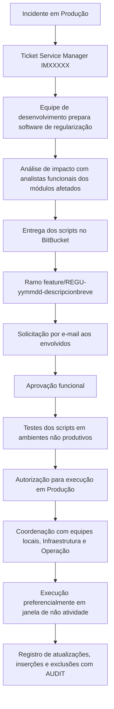

# Procedimento REEF.101 — Regularização de Dados em Ambientes Produtivos REEF

## 1. Metadados do Documento
- **Arquivo de Origem:** Não identificado no conteúdo fornecido
- **Tipo de Documento:** Procedimento
- **Domínio / Sistema:** REEF
- **Público-Alvo:** Desenvolvimento, analistas funcionais, DevOps, Infraestrutura, Operação, responsáveis de TI e aprovadores de execução
- **Data/Versão Identificada:** V 0.1 — aprovação em 29/05/2024; referência `PRO.ENT.011`

---

## 2. Resumo Executivo & Contexto de Negócio

O procedimento REEF.101 estabelece a operação para regularização de dados em ambientes produtivos do sistema REEF. O documento define regularização de dados como uma atuação sobre dados operacionais que precisam ser corrigidos em consequência de mau funcionamento do software instalado.

A regularização deve estar vinculada a um incidente de Produção registrado no Service Manager, identificado pelo padrão de ticket `IMXXXXX`. O processo abrange as diferentes instâncias existentes de REEF e exige que a equipe de desenvolvimento programe o ajuste de dados necessário.

O procedimento exige análise prévia de impacto com os analistas funcionais dos módulos afetados, entrega dos scripts em repositório BitBucket e aprovação funcional. Antes da execução produtiva, os scripts devem ser testados em ambientes não produtivos.

A execução produtiva depende de um segundo nível de autorização, específico para a instância REEF envolvida. A operação deve ser coordenada entre equipes locais, Infraestrutura e Operação, sendo preferencialmente executada em janela de inatividade.

O controle de auditoria é obrigatório: o usuário que realiza a operação deve ser atribuído na base de dados com `AUDIT`, para registrar atualizações, inserções e exclusões executadas durante a regularização.

---

## 3. Arquitetura, Componentes & Tecnologias Envolvidas

### Componentes, sistemas e grupos citados

| Componente / Entidade | Papel no procedimento |
| :--- | :--- |
| REEF | Sistema cujos dados operacionais podem ser regularizados em Produção. |
| REEF AC | Instância REEF identificada no anexo. |
| REEF Vida / REEF VIDA | Instância REEF identificada no anexo. |
| Service Manager | Sistema no qual deve existir o ticket de incidente de Produção que motiva a regularização. |
| `IMXXXXX` | Padrão de identificação do ticket de incidente no Service Manager. |
| BitBucket | Repositório para entrega do software e scripts de regularização. |
| Equipe de desenvolvimento | Programa o ajuste de dados a executar. |
| Analistas funcionais | Analisam o impacto e aprovam funcionalmente o software de regularização. |
| DevOps — `zzl Reef Infra` | Lista de distribuição destinatária da solicitação de regularização. |
| Core — `zzl Reef Core Soporte` | Lista de distribuição em cópia na solicitação de regularização. |
| Infraestrutura e Operação | Serviços que devem ser coordenados com as equipes locais para a execução. |
| Base de dados | Registra as operações de atualização, inserção e exclusão por meio de `AUDIT`. |
| AUDIT | Mecanismo ou atribuição de usuário na base de dados para registrar operações executadas. |



> **Nota de Análise:** O documento não detalha métodos HTTP, contratos de integração, tecnologia da base de dados, formato dos scripts nem mecanismos técnicos específicos de autenticação ou auditoria além da exigência de `AUDIT`.

---

## 4. Regras de Negócio, Especificações Funcionais & Processos

### 4.1 Condição inicial obrigatória

1. Toda regularização de dados deve referenciar um incidente em Produção.
2. Deve existir um ticket de incidente no Service Manager que tenha provocado a necessidade de regularização.
3. O identificador do ticket é apresentado no padrão `IMXXXXX`.

### 4.2 Preparação do software de regularização

1. A equipe de desenvolvimento deve programar o ajuste de dados a realizar.
2. O impacto do ajuste deve ser analisado previamente com os analistas funcionais responsáveis pelos módulos afetados pelo incidente.
3. Os scripts devem ser testados em ambientes não produtivos antes da execução no ambiente de Produção.

### 4.3 Entrega dos scripts no BitBucket

1. O software de regularização deve ser entregue no repositório BitBucket.
2. A ramificação criada para os scripts deve seguir o padrão:

```text
feature/REGU-yymmdd-descripcionbreve
```

### 4.4 Solicitação da regularização

A solicitação deve ser enviada por e-mail e conter os elementos definidos no procedimento.

| Campo do e-mail | Regra / Conteúdo obrigatório |
| :--- | :--- |
| Assunto | `Fecha + “REGU” + descripción breve + país` |
| Solicitado por | Analista da equipe de TI que solicita a regularização de dados. |
| Destinatário | Lista DevOps `zzl Reef Infra`; aprovadores funcionais da instância REEF; aprovadores de execução da instância REEF. |
| Cópia | José de Abreu Freitas; Ahmet Hakan Guzel; responsável corporativo da instância REEF; responsável local de TI; lista `zzl Reef Core Soporte`. |
| Corpo | Nome da ramificação criada para a regularização; descrição da regularização; autorização do responsável de TI Regional / Local. |

### 4.5 Autorização funcional

1. Os responsáveis funcionais devem verificar se o software de ajuste de dados está correto.
2. Os responsáveis funcionais devem aprovar o software de regularização elaborado.
3. O primeiro nível de autorização é funcional e envolve especialistas dos módulos afetados.
4. As autorizações funcionais variam por país e instância, conforme anexo.

### 4.6 Autorização para execução da regularização

1. É exigida aprovação dos autorizadores de execução da instância REEF relacionada.
2. O segundo nível de autorização corresponde à execução da regularização no ambiente de Produção.
3. Conforme a criticidade, o momento de execução deve ser acordado com a equipe local.
4. Deve haver coordenação entre equipes locais, Infraestrutura e Operação.
5. Em regra, a regularização deve ser executada na janela de não atividade, coordenada com os demais trabalhos operacionais.
6. Em casos excepcionais, a execução poderá ser acordada para outras janelas alternativas.

### 4.7 Controle e auditoria

1. As regularizações devem permanecer identificadas para permitir acompanhamento e controle.
2. No nível de base de dados, o usuário que executa a operação deve ser atribuído com `AUDIT`.
3. O registro deve abranger todas as atualizações, inserções e exclusões realizadas durante a regularização.

---

## 5. Tabelas de Parâmetros, Ambientes e Estruturas de Dados

| Item / Parâmetro | Descrição / Função | Tipo / Valores / Formato | Ambiente / Observações |
| :--- | :--- | :--- | :--- |
| Referência documental | Identificador do procedimento | `PRO.ENT.011` | Documento REEF.101 |
| Nome do procedimento | Regularização de dados em ambientes produtivos REEF | `REEF.101` | REEF |
| Incidente de origem | Evento que justifica a regularização de dados | Incidente em Produção | Obrigatório |
| Ticket de incidente | Registro do incidente no Service Manager | `IMXXXXX` | Deve existir antes da regularização |
| Repositório | Local de entrega do software de regularização | BitBucket | Scripts de regularização |
| Nome da ramificação | Convenção de nome da ramificação de scripts | `feature/REGU-yymmdd-descripcionbreve` | BitBucket |
| Assunto do e-mail | Assunto da solicitação de regularização | `Fecha + “REGU” + descripción breve + país` | Solicitação por e-mail |
| Solicitante | Responsável pela solicitação | Analista da equipe TI | Solicita a regularização |
| Lista DevOps | Lista de distribuição destinatária | `zzl Reef Infra` | Destinatário |
| Lista Core | Lista de distribuição copiada | `zzl Reef Core Soporte` | Cópia |
| Autorização TI | Autorização a incluir no corpo do e-mail | Responsável TI Regional / Local | Obrigatória no e-mail |
| Teste prévio | Validação dos scripts antes da Produção | Ambientes não produtivos | Obrigatório |
| Auditoria | Registro das operações de dados | `AUDIT` | Base de dados |
| Operações auditadas | Operações que devem ser registradas | Atualizações, inserções e exclusões | Durante a regularização |
| Janela de execução | Período prioritário de execução | Janela de não atividade | Coordenada com trabalhos operacionais |
| Janela alternativa | Exceção para execução | Outra janela acordada | Apenas em casos excepcionais |

### Responsáveis corporativos por instância

| Instância | Responsável Corporativo |
| :--- | :--- |
| REEF AC | Pablo Guerra |
| REEF Vida | David de Francisco |

### Aprovação funcional por instância e módulo

| Instância | Aprovador funcional | Módulo Comunes y Terceros | Módulo Emisión | Módulo Prestaciones / siniestros | Módulo Tesorería |
| :--- | :--- | :--- | :--- | :--- | :--- |
| REEF AC | Margarita Bolumar | Javier Brau | Margarita Bolumar | María Martínez | David Robledo |
| REEF VIDA | Freddy Prieto | Javier Brau | Margarita Bolumar | María Martínez | David Robledo |

### Aprovação de execução por instância

| Instância | Autorização de execução da regularização | Autorizador país / instalação | Equipe Corporativa |
| :--- | :--- | :--- | :--- |
| REEF AC | Panamá | Rubén Aristizabal | Pablo Guerra |
| REEF VIDA | Uruguay | Maryorie Montilla | David de Francisco |

### Controle de mudanças, revisões e aprovações

| Versão | Data | Descrição | Autor / Aprovador |
| :--- | :--- | :--- | :--- |
| V 0.1 | 18/04/2024 | Primera revisión | Miguel Ángel Muñoz; Carolina Vázquez Rúa; Ahmet Hakan Guzel |
| V 0.1 | 29/05/2024 | Aprobación Comité DST | Comitê DST |

---

## 6. Bateria de Perguntas & Respostas para RAG (FAQ Sintético)

### P1: Qual condição deve existir antes de iniciar uma regularização de dados no REEF?
**R:** Deve existir um incidente em Produção que justifique a regularização e um ticket correspondente no Service Manager, identificado no documento pelo padrão `IMXXXXX`.

### P2: Quem prepara o software para regularização de dados no REEF?
**R:** A equipe de desenvolvimento deve programar o ajuste de dados a realizar. Antes da entrega, o impacto do ajuste deve ser analisado com os analistas funcionais responsáveis pelos módulos afetados.

### P3: Qual padrão de nome deve ser usado para a ramificação dos scripts de regularização no BitBucket?
**R:** A ramificação deve usar o padrão `feature/REGU-yymmdd-descripcionbreve`.

### P4: Os scripts podem ser executados diretamente em Produção?
**R:** Não. O documento determina que os scripts sejam testados previamente em ambientes não produtivos antes da execução da regularização no ambiente de Produção.

### P5: Quais informações precisam constar no corpo do e-mail de solicitação da regularização?
**R:** O corpo do e-mail deve indicar o nome da ramificação criada para a regularização, a descrição da regularização e a autorização do responsável de TI Regional ou Local.

### P6: Quem deve receber a solicitação de regularização de dados?
**R:** A solicitação deve ser destinada à lista DevOps `zzl Reef Infra`, aos aprovadores funcionais da instância REEF e aos aprovadores de execução da instância REEF. O e-mail também deve copiar José de Abreu Freitas, Ahmet Hakan Guzel, o responsável corporativo da instância REEF, o responsável local de TI e a lista `zzl Reef Core Soporte`.

### P7: Quais são os níveis de autorização para uma regularização em Produção?
**R:** Existem dois níveis: a autorização funcional, realizada por especialistas dos módulos afetados, e a autorização para execução da regularização no ambiente de Produção, conforme a instância REEF e o país ou instalação envolvidos.

### P8: Quando uma regularização deve ser executada?
**R:** Em princípio, a regularização deve ocorrer na janela de não atividade, coordenada com os demais trabalhos operacionais. Em casos excepcionais, a execução pode ser acordada para outras janelas alternativas.

### P9: Como o procedimento exige o controle das alterações realizadas na base de dados?
**R:** O usuário que executa a operação deve ser atribuído com `AUDIT` na base de dados, permitindo registrar atualizações, inserções e exclusões realizadas durante a regularização.

### P10: Quem é o responsável corporativo da instância REEF AC?
**R:** O responsável corporativo da instância REEF AC é Pablo Guerra.

### P11: Quem autoriza a execução de regularizações da instância REEF VIDA no Uruguai?
**R:** Para REEF VIDA no Uruguai, a autorização de execução é atribuída a Maryorie Montilla, e a equipe corporativa indicada é David de Francisco.

---

## 7. Glossário de Termos, Siglas & Conceitos-Chave

- **REEF:** Sistema ou domínio ao qual se aplica o procedimento de regularização de dados.
- **REEF AC:** Instância REEF listada no anexo.
- **REEF Vida / REEF VIDA:** Instância REEF listada no anexo.
- **Regularização de dados:** Atuação sobre dados operacionais que necessitam ser regularizados devido a mau funcionamento do software instalado.
- **Service Manager:** Sistema em que deve existir o ticket do incidente de Produção associado à regularização.
- **IMXXXXX:** Padrão apresentado para o ticket de incidente no Service Manager.
- **BitBucket:** Repositório no qual deve ser entregue o software ou scripts de regularização.
- **DevOps:** Grupo destinatário da solicitação por meio da lista `zzl Reef Infra`.
- **AUDIT:** Atribuição ou mecanismo exigido para registrar atualizações, inserções e exclusões na base de dados.
- **DST:** Sigla presente na aprovação pelo “Comité DST”; o documento não apresenta sua expansão.
- **TI:** Tecnologia da Informação, conforme referências a equipes e responsáveis de TI.
- **Produção:** Ambiente no qual a regularização é executada após testes não produtivos e autorizações.
- **Ambientes não produtivos:** Ambientes nos quais os scripts devem ser testados antes da execução em Produção.

---

## 8. Notas Críticas, Riscos & Limitações

- A execução de regularização depende de um incidente de Produção e de ticket no Service Manager; o procedimento não prevê regularizações sem essa vinculação.
- A ausência de análise de impacto pelos analistas funcionais pode comprometer a validação do ajuste sobre os módulos afetados.
- A execução em Produção requer autorização funcional e autorização de execução; ambas são condições necessárias no fluxo apresentado.
- A coordenação com equipes locais, Infraestrutura e Operação é exigida, especialmente para definição da janela de execução.
- A auditoria com `AUDIT` é obrigatória para atualizações, inserções e exclusões; falhas nesse registro prejudicam acompanhamento e controle.
- O documento não detalha os procedimentos técnicos de rollback, backup, validação pós-execução, conteúdo dos scripts, tecnologia de banco de dados ou critérios objetivos de criticidade.
- **Nota de Análise:** O documento apresenta aprovadores por instância, módulos e países/instalações, mas não descreve suplentes, prazos de aprovação, mecanismo de evidência da aprovação nem regras para ausência dos aprovadores indicados.
- **Nota de Análise:** A sigla `DST` aparece no histórico de aprovação, porém não é expandida no conteúdo fornecido.

---

## 9. Conteúdo Bruto Estruturado (Referência Fiel)

```text
--- [PÁGINA 1 DE 4] ---

PROCEDIMIENTO REEF 101 Regularizacion de datos en entornos
productivos REEF ORIGINAL
Referencia PRO.ENT.011
Fecha de aprobación 29/05/2024
Nombre (REEF.101) REGULARIZACIÓN DE DATOS EN ENTORNOS PRODUCTIVOS REEF
Propósito
Este procedimiento tiene por finalidad establecer la operativa a seguir con relación a las regularizaciones de datos en entornos
productivos de REEF.
Alcance
El alcance del procedimiento se corresponde con las distintas instancias de REEF existentes.
Se entiende como “Regularización de datos” aquella actuación sobre los datos operacionales que necesitan ser regularizados por un
mal funcionamiento del software instalado.
Desarrollo
Proceso:
1. Previo:
El proceso de regularización de datos deberá hacer referencia a un incidente en Producción, por lo que deberá existir un ticket en Service
Manager (IMXXXXX) de la incidencia que provoca la regularización.
1. Preparación del software que regulariza los datos afectados.
El equipo de desarrollo deberá programar el arreglo de datos a realizar.
Documentation / DOCUMENTACIÓN Reef
DOCUMENTACIÓN Reef
Mapfredocument
DOCUMENTACIÓN Reef
Owner
user:agonzalez_mapfre.com
Lifecycle
Approved Source
 / 
 VL
Buscar Inicio Soluciones Arquitecturas APIs Componentes Cloud Documentación Zeus Reef Ayuda
ES


--- [PÁGINA 2 DE 4] ---

Previamente, el impacto del arreglo deberá ser analizado junto con los analistas funcionales responsables de los módulos afectados por el
incidente.
1. Entrega del software de regularización en el repositorio de BitBucket.
Nombre de la rama para recoger los scripts en BitBucket:
“feature/REGU-yymmdd-descripcionbreve”
1. Solicitud de la regularización a equipos involucrados
La solicitud de la regularización se realizará mediante correo conforme al siguiente cuerpo:
Asunto:
Fecha + “REGU” + descripción breve + país
Solicitado por:
Analista del equipo TI que solicita la regularización de datos.
Destinatario:
Lista distribución equipo DevOps: “zzl Reef Infra”
Aprobadores funcionales de la instancia Reef (ver anexo)
Aprobadores de ejecución de la instancia Reef instancia (ver anexo)
Copia a:
José de Abreu Freitas (joseabreu@mapfre.com)
Ahmet Hakan Guzel (hakangu@mapfre.com)
Responsable Corporativo de la instancia Reef Corporativo (ver anexo)
Responsable TI local
Lista distribución equipo Core: “zzl Reef Core Soporte”
Cuerpo del correo:
Indicar nombre de la rama que se ha creado para la regularización de datos.
Descripción de la regularización
Incluir la autorización del responsable TI Regional / Local
1. Autorización funcional.
El/los responsables funcionales comprobarán que el software de arreglo de datos es correcto y darán su aprobación al software de
regularización elaborado.
1. Autorización ejecución de la regularización.
- Se requiere la aprobación de los autorizadores de la ejecución de la instancia Reef relacionada.
- En función de la criticidad, se acuerda con el equipo local el momento de proceder a la ejecución de la regularización.
- Es necesaria la coordinación entre los equipos locales y los servicios de Infraestructura y Operación.
Sistema de Controles:
Con el fin de poder realizar seguimiento y control de las regularizaciones de datos, deben quedar identificadas las mismas.
A nivel de base de datos, deberá quedar asignado el usuario de la operación con AUDIT para registro de todas las actualizaciones,
inserciones, borrados que se ejecuten.
1
2
3
- En principio, las regularizaciones se ejecutarán en la ventana de no actividad coordinando con el resto de los trabajos 
de la operación.
- En casos excepcionales, se acordará la ejecución en otras ventanas alternativas.


--- [PÁGINA 3 DE 4] ---

Sistema de autorizaciones
Se establecerá un sistema de autorizaciones para llevar a cabo la ejecución de las regularizaciones.
En un primer nivel, existirá una autorización a nivel funcional con expertos de los módulos afectados, quienes darán el visto bueno
a la regularización a realizar.
Ver en anexo las autorizaciones por país/instancia
En un segundo nivel, existirá una autorización para la ejecución de la regularización en el ambiente de Producción
Previamente, los scripts se deben probar en entornos No productivos.
Ver en anexo las autorizaciones por país/instancia
ANEXO
1. INSTANCIAS – RESPONSABLES
Instancia Responsable Corporativo
REEF AC Pablo Guerra
REEF Vida David de Francisco
1. APROBACIÓN FUNCIONAL
Instancia Aprobador
funcional
Módulo Comunes y
Terceros
Módulo
Emisión
Módulo Prestaciones /
siniestros
Módulo
Tesorería
REEF AC Margarita
Bolumar
Javier Brau Margarita
Bolumar
María Martínez David Robledo
REEF
VIDA
Freddy Prieto Javier Brau Margarita
Bolumar
María Martínez David Robledo
1. APROBACIÓN EJECUCIÓN
Instancia Autorización ejecución regularización Autorizador país/instalación Equipo Corporativo
REEF AC Panamá Rubén Aristizabal Pablo Guerra
REEF VIDA Uruguay Maryorie Montilla David de Francisco
Control de Cambios, Revisiones y Aprobaciones
Versión Fecha Descripción Autor
V 0.1 18/04/2024 Primera revisión Miguel Ángel Muñoz, Carolina
Vázquez Rúa,
Ahmet Hakan Guzel


--- [PÁGINA 4 DE 4] ---

Control de Cambios, Revisiones y Aprobaciones
V 0.1 29/05/2024 Aprobación Comité DST
```
