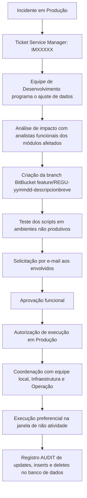
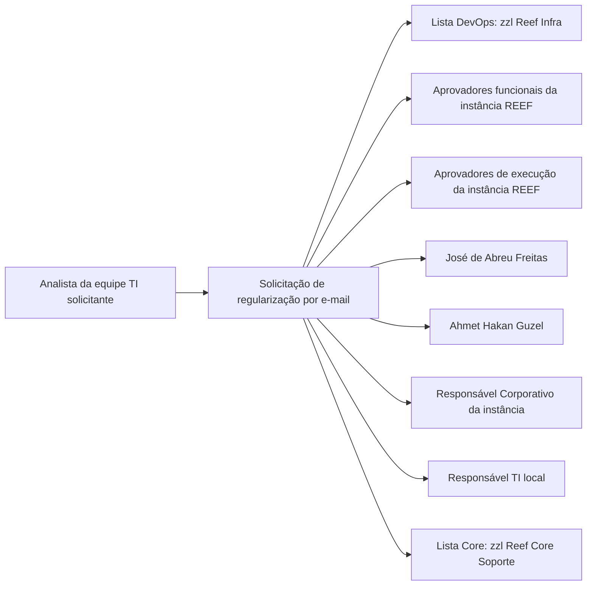

# Procedimento REEF.101 — Regularização de Dados em Ambientes Produtivos REEF

## 1. Metadados do Documento
- **Arquivo de Origem:** Não informado; conteúdo bruto fornecido no prompt.
- **Tipo de Documento:** Procedimento.
- **Domínio / Sistema:** REEF — regularização de dados operacionais em produção.
- **Público-Alvo:** Desenvolvimento, analistas funcionais, DevOps, Infraestrutura, Operação, responsáveis de TI locais/regionais e aprovadores REEF.
- **Data/Versão Identificada:** Referência `PRO.ENT.011`; aprovação em `29/05/2024`; versão `V 0.1`.

---

## 2. Resumo Executivo & Contexto de Negócio

O procedimento `(REEF.101) Regularización de datos en entornos productivos REEF` estabelece a operativa para regularizações de dados nos ambientes produtivos das diferentes instâncias REEF. Uma regularização de dados é definida como uma atuação sobre dados operacionais que precisam ser corrigidos devido a mau funcionamento do software instalado.

Toda regularização deve estar vinculada a um incidente de Produção registrado no Service Manager, identificado no documento pelo padrão de ticket `IMXXXXX`. A existência do incidente é uma condição prévia para iniciar o processo de regularização de dados.

O processo exige que a equipe de desenvolvimento programe o ajuste de dados e que o impacto do ajuste seja analisado previamente com os analistas funcionais responsáveis pelos módulos afetados. Os scripts de regularização devem ser entregues no BitBucket em uma branch padronizada e testados em ambientes não produtivos antes da execução em Produção.

A execução produtiva depende de duas camadas de autorização: aprovação funcional do software de ajuste e autorização de execução da regularização. A execução deve ocorrer, em princípio, durante uma janela de não atividade coordenada com os demais trabalhos operacionais; janelas alternativas só são previstas para casos excepcionais acordados.

O procedimento também estabelece controles de rastreabilidade em banco de dados. As operações de atualização, inserção e exclusão executadas durante a regularização devem ser registradas com o usuário da operação associado a `AUDIT`.

---

## 3. Arquitetura, Componentes & Tecnologias Envolvidas

Os componentes, equipes e mecanismos explicitamente citados são:

- **REEF:** Sistema cujas instâncias produtivas são objeto da regularização.
- **Service Manager:** Sistema de gestão de incidentes; deve conter o ticket do incidente que originou a regularização.
- **BitBucket:** Repositório no qual a branch com os scripts de regularização deve ser entregue.
- **Ambientes não produtivos:** Ambientes obrigatórios para teste prévio dos scripts.
- **Produção:** Ambiente no qual a regularização poderá ser executada após as aprovações exigidas.
- **Banco de dados:** Camada em que atualizações, inserções e exclusões devem ter registro associado a `AUDIT`.
- **Equipe de Desenvolvimento:** Programa o ajuste de dados.
- **Analistas Funcionais:** Analisam o impacto e aprovam funcionalmente o software de regularização.
- **Equipe DevOps:** Recebe a solicitação por meio da lista `zzl Reef Infra`.
- **Equipe Core:** Recebe cópia por meio da lista `zzl Reef Core Soporte`.
- **Infraestrutura e Operação:** Devem coordenar a execução com as equipes locais.
- **Equipe local:** Participa da definição do momento de execução conforme criticidade.



### Fluxo de comunicação e aprovação



> **Nota de Análise:** O documento menciona REEF, Service Manager, BitBucket, `AUDIT`, DevOps, Infraestrutura, Operação e equipes locais, mas não descreve versões, URLs, métodos HTTP, contratos de integração, esquema de banco de dados ou detalhes técnicos dos scripts.

---

## 4. Regras de Negócio, Especificações Funcionais & Processos

### 4.1. Condição prévia obrigatória

1. A regularização de dados deve fazer referência a um incidente em Produção.
2. Deve existir no Service Manager um ticket da incidência que provocou a regularização.
3. O padrão de identificação do ticket apresentado é `IMXXXXX`.

### 4.2. Preparação do software de regularização

1. A equipe de desenvolvimento deve programar o ajuste de dados necessário.
2. O impacto do ajuste deve ser analisado previamente.
3. A análise de impacto deve ser conduzida com os analistas funcionais responsáveis pelos módulos afetados pelo incidente.

### 4.3. Entrega dos scripts no BitBucket

1. Os scripts de regularização devem ser disponibilizados no repositório BitBucket.
2. A branch deve respeitar a convenção:

```text
feature/REGU-yymmdd-descripcionbreve
```

3. O nome da branch deve ser informado no corpo do e-mail de solicitação da regularização.

### 4.4. Solicitação formal de regularização

A solicitação deve ser realizada por e-mail e conter, no mínimo:

- Assunto conforme o padrão `Data + "REGU" + descrição breve + país`.
- Identificação do analista da equipe TI que solicita a regularização.
- Nome da branch criada no BitBucket.
- Descrição da regularização.
- Autorização do responsável TI Regional ou Local.

A solicitação deve ser encaminhada à lista de distribuição DevOps, aos aprovadores funcionais e aos aprovadores de execução da instância REEF. Cópias devem ser enviadas aos destinatários indicados no procedimento.

### 4.5. Autorização funcional

1. Os responsáveis funcionais devem verificar se o software de ajuste de dados está correto.
2. Os responsáveis funcionais devem aprovar o software de regularização elaborado.
3. A autorização funcional é o primeiro nível do sistema de autorizações.
4. Os especialistas dos módulos afetados são responsáveis por emitir o visto de aprovação funcional.
5. As autorizações variam conforme país e instância, conforme anexo do documento.

### 4.6. Autorização de execução

1. A regularização requer aprovação dos autorizadores de execução da instância REEF relacionada.
2. A autorização de execução em Produção é o segundo nível do sistema de autorizações.
3. Antes da execução em Produção, os scripts devem ser testados em ambientes não produtivos.
4. Conforme a criticidade, o momento de execução deve ser acordado com a equipe local.
5. A execução deve ocorrer, em princípio, na janela de não atividade.
6. A janela de não atividade deve ser coordenada com os demais trabalhos de operação.
7. Em situações excepcionais, a execução pode ocorrer em janelas alternativas acordadas.
8. A coordenação entre equipes locais, Infraestrutura e Operação é necessária.

### 4.7. Controles e auditoria

1. As regularizações de dados devem ser identificadas para permitir acompanhamento e controle.
2. No nível de banco de dados, o usuário da operação deve ser associado a `AUDIT`.
3. O registro `AUDIT` deve cobrir todas as atualizações, inserções e exclusões realizadas durante a regularização.

---

## 5. Tabelas de Parâmetros, Ambientes e Estruturas de Dados

### 5.1. Identificação e convenções

| Item / Parâmetro | Descrição / Função | Tipo / Valores / Formato | Ambiente / Observações |
| :--- | :--- | :--- | :--- |
| Referência do procedimento | Identificador documental | `PRO.ENT.011` | Documento REEF.101 |
| Nome do procedimento | Regularização de dados em ambientes produtivos REEF | `(REEF.101) Regularización de datos en entornos productivos REEF` | Documento aprovado |
| Ticket de incidente | Evidência da incidência que provoca a regularização | `IMXXXXX` | Obrigatório; Service Manager; incidente em Produção |
| Branch BitBucket | Branch que contém scripts da regularização | `feature/REGU-yymmdd-descripcionbreve` | Deve ser informada no e-mail |
| Prefixo de solicitação | Identificador de regularização no assunto do e-mail | `REGU` | Com data, descrição breve e país |
| Controle de banco de dados | Registro de operações realizadas | `AUDIT` | Deve registrar updates, inserts e deletes |

### 5.2. Estrutura do e-mail de solicitação

| Item / Parâmetro | Descrição / Função | Tipo / Valores / Formato | Ambiente / Observações |
| :--- | :--- | :--- | :--- |
| Assunto | Identificar a solicitação de regularização | `Fecha + "REGU" + descripción breve + país` | Formato obrigatório apresentado |
| Solicitado por | Identificar o solicitante | Analista da equipe TI solicitante | Campo obrigatório |
| Destinatário DevOps | Distribuir solicitação à equipe DevOps | `zzl Reef Infra` | Lista de distribuição |
| Destinatários funcionais | Obter aprovação funcional | Aprovadores funcionais da instância REEF | Consultar anexo por instância |
| Destinatários de execução | Obter autorização de execução | Aprovadores de execução da instância REEF | Consultar anexo por instância |
| Cópia | Incluir José de Abreu Freitas | `joseabreu@mapfre.com` | Cópia obrigatória indicada |
| Cópia | Incluir Ahmet Hakan Guzel | `hakangu@mapfre.com` | Cópia obrigatória indicada |
| Cópia | Incluir responsável corporativo | Responsável Corporativo da instância REEF | Consultar anexo |
| Cópia | Incluir responsável TI local | Responsável TI local | Cópia obrigatória indicada |
| Cópia Core | Distribuir à equipe Core | `zzl Reef Core Soporte` | Lista de distribuição |
| Corpo do e-mail | Identificar scripts | Nome da branch de regularização | Campo obrigatório |
| Corpo do e-mail | Explicar alteração | Descrição da regularização | Campo obrigatório |
| Corpo do e-mail | Evidenciar autorização TI | Autorização do responsável TI Regional / Local | Campo obrigatório |

### 5.3. Instâncias e responsáveis corporativos

| Instância REEF | Responsável Corporativo |
| :--- | :--- |
| REEF AC | Pablo Guerra |
| REEF Vida | David de Francisco |

### 5.4. Aprovadores funcionais por instância e módulo

| Instância REEF | Aprovador funcional | Módulo Comunes y Terceros | Módulo Emisión | Módulo Prestaciones / siniestros | Módulo Tesorería |
| :--- | :--- | :--- | :--- | :--- | :--- |
| REEF AC | Margarita Bolumar | Javier Brau | Margarita Bolumar | María Martínez | David Robledo |
| REEF VIDA | Freddy Prieto | Javier Brau | Margarita Bolumar | María Martínez | David Robledo |

> **Nota de Análise:** A tabela original apresenta uma coluna denominada `Aprobador funcional` e colunas de módulos. O documento não explica detalhadamente se o primeiro nome de cada linha representa um aprovador geral, responsável funcional da instância ou outra função específica.

### 5.5. Autorizações de execução

| Instância REEF | Autorização de execução da regularização | Autorizador país/instalação | Equipe Corporativa |
| :--- | :--- | :--- | :--- |
| REEF AC | Panamá | Rubén Aristizabal | Pablo Guerra |
| REEF VIDA | Uruguay | Maryorie Montilla | David de Francisco |

### 5.6. Ambientes e condições operacionais

| Item / Parâmetro | Descrição / Função | Tipo / Valores / Formato | Ambiente / Observações |
| :--- | :--- | :--- | :--- |
| Ambiente de teste | Validar scripts antes de Produção | Ambientes não produtivos | Teste obrigatório antes da execução produtiva |
| Ambiente de execução | Executar a regularização aprovada | Produção | Exige autorização de execução |
| Janela padrão | Executar com menor interferência operacional | Janela de não atividade | Deve ser coordenada com outros trabalhos |
| Janela excepcional | Alternativa à janela padrão | Outra janela acordada | Permitida somente em casos excepcionais |
| Coordenação operacional | Sincronizar execução | Equipes locais, Infraestrutura e Operação | Obrigatória |

### 5.7. Controle de mudanças, revisões e aprovações

| Versão | Data | Descrição | Autor / Responsável |
| :--- | :--- | :--- | :--- |
| V 0.1 | 18/04/2024 | Descripción | Miguel Ángel Muñoz; Carolina Vázquez Rúa; Ahmet Hakan Guzel |
| V 0.1 | 18/04/2024 | Primera revisión | Miguel Ángel Muñoz; Carolina Vázquez Rúa; Ahmet Hakan Guzel |
| V 0.1 | 29/05/2024 | Aprobación Comité DST | Não identificado na tabela |

---

## 6. Bateria de Perguntas & Respostas para RAG (FAQ Sintético)

### P1: Qual é a finalidade do procedimento REEF.101?
**R:** O procedimento REEF.101 estabelece a operativa para regularizações de dados em ambientes produtivos das diferentes instâncias REEF. A regularização é aplicável quando dados operacionais precisam ser corrigidos devido a mau funcionamento do software instalado.

### P2: É possível iniciar uma regularização de dados REEF sem incidente em Produção?
**R:** Não. A regularização deve estar associada a um incidente em Produção e deve existir no Service Manager um ticket da incidência que provoca a regularização. O documento apresenta o padrão de ticket `IMXXXXX`.

### P3: Qual padrão de branch deve ser usado para scripts de regularização no BitBucket?
**R:** Os scripts devem ser disponibilizados em uma branch BitBucket nomeada conforme o padrão `feature/REGU-yymmdd-descripcionbreve`. O nome da branch deve constar no corpo do e-mail de solicitação.

### P4: Quem deve desenvolver o software de ajuste de dados?
**R:** A equipe de desenvolvimento deve programar o ajuste de dados necessário. Antes disso, o impacto do ajuste deve ser analisado com os analistas funcionais responsáveis pelos módulos afetados pelo incidente.

### P5: Quais informações devem constar no assunto do e-mail de solicitação de regularização?
**R:** O assunto deve seguir o formato `Fecha + "REGU" + descripción breve + país`. O documento não especifica um formato adicional para a data além do termo `Fecha`.

### P6: Quais informações obrigatórias devem constar no corpo do e-mail de regularização?
**R:** O corpo do e-mail deve informar o nome da branch criada para a regularização de dados, a descrição da regularização e a autorização do responsável TI Regional ou Local.

### P7: Quem recebe a solicitação de regularização por e-mail?
**R:** A solicitação deve ser enviada à lista DevOps `zzl Reef Infra`, aos aprovadores funcionais da instância REEF e aos aprovadores de execução da instância REEF. Devem receber cópia José de Abreu Freitas, Ahmet Hakan Guzel, o responsável corporativo da instância REEF, o responsável TI local e a lista Core `zzl Reef Core Soporte`.

### P8: Quais são os dois níveis de autorização exigidos para uma regularização REEF?
**R:** O primeiro nível é a autorização funcional, emitida por especialistas dos módulos afetados que validam o software de regularização. O segundo nível é a autorização de execução da regularização em Produção, concedida pelos autorizadores da instância REEF relacionada.

### P9: Os scripts podem ser executados diretamente em Produção?
**R:** Não. O documento determina que os scripts sejam testados previamente em ambientes não produtivos antes de serem executados em Produção.

### P10: Quando uma regularização de dados deve ser executada?
**R:** Em princípio, a regularização deve ser executada na janela de não atividade, coordenada com os demais trabalhos de operação. Em casos excepcionais, a execução pode ser acordada para outras janelas alternativas.

### P11: Que equipes precisam estar coordenadas para executar a regularização?
**R:** A execução requer coordenação entre as equipes locais e os serviços de Infraestrutura e Operação. O momento da execução também deve ser acordado com a equipe local de acordo com a criticidade.

### P12: Como o procedimento exige rastreabilidade das alterações em banco de dados?
**R:** O usuário da operação deve ficar associado a `AUDIT` no banco de dados, permitindo o registro de todas as atualizações, inserções e exclusões executadas durante a regularização.

---

## 7. Glossário de Termos, Siglas & Conceitos-Chave

- **REEF:** Sistema ou conjunto de instâncias REEF abrangido pelo procedimento de regularização de dados.
- **REEF AC:** Instância REEF identificada no anexo.
- **REEF Vida / REEF VIDA:** Instância REEF identificada no anexo.
- **Regularização de dados:** Atuação sobre dados operacionais que precisam ser regularizados por mau funcionamento do software instalado.
- **Service Manager:** Sistema no qual deve existir o ticket do incidente de Produção associado à regularização.
- **IMXXXXX:** Padrão apresentado para o ticket de incidente no Service Manager.
- **BitBucket:** Repositório mencionado para entrega dos scripts de regularização.
- **REGU:** Prefixo utilizado na branch BitBucket e no assunto do e-mail de solicitação.
- **DevOps:** Equipe destinatária da solicitação por meio da lista `zzl Reef Infra`.
- **Core:** Equipe incluída em cópia por meio da lista `zzl Reef Core Soporte`.
- **AUDIT:** Mecanismo ou identificação de auditoria exigido para registrar atualizações, inserções e exclusões no banco de dados.
- **Ambiente não produtivo:** Ambiente no qual os scripts devem ser testados antes da execução produtiva.
- **Janela de não atividade:** Período preferencial para execução da regularização, coordenado com trabalhos operacionais.
- **Comité DST:** Entidade indicada como responsável pela aprovação em `29/05/2024`.

---

## 8. Notas Críticas, Riscos & Limitações

- A regularização não pode ser tratada como uma alteração independente: ela depende de um incidente de Produção formalmente registrado no Service Manager.
- A ausência de análise prévia com os analistas funcionais dos módulos afetados aumenta o risco de correção inadequada ou impacto não avaliado nos dados operacionais.
- A execução em Produção depende de aprovações funcionais e de execução; a ausência de qualquer uma dessas autorizações impede a conformidade com o procedimento.
- Os scripts devem ser testados em ambientes não produtivos antes da execução em Produção. O documento não detalha critérios de aceite, evidências de teste ou plano de reversão.
- A execução fora da janela de não atividade é excepcional e exige acordo; o documento não detalha o processo de escalonamento para aprovar janelas alternativas.
- A rastreabilidade depende da associação do usuário operacional a `AUDIT`; o documento não descreve retenção de logs, mecanismo técnico de auditoria ou consulta desses registros.
- O documento cita aprovadores por módulo e instância, mas não detalha substitutos, regras para indisponibilidade de aprovadores ou vigência dessas designações.
- O documento não apresenta detalhes sobre conteúdo de scripts, comandos SQL, tecnologias de banco de dados, URLs de ambientes, credenciais, tempos de execução ou procedimentos de rollback.

---

## 9. Conteúdo Bruto Estruturado (Referência Fiel)

```text
--- [PÁGINA 1 DE 4] ---

REFERENCIA
PRO.ENT.011

FECHA DE APROBACIÓN
29/05/2024

NOMBRE
(REEF.101) Regularización de datos en entornos productivos REEF

PROPÓSITO
Este procedimiento tiene por finalidad establecer la operativa a seguir con relación a las regularizaciones de datos en entornos productivos de REEF.

ALCANCE
El alcance del procedimiento se corresponde con las distintas instancias de REEF existentes.

Se entiende como "Regularización de datos" aquella actuación sobre los datos operacionales que necesitan ser regularizados por un mal funcionamiento del software instalado.

Desarrollo

1. Previo: El proceso de regularización de datos deberá hacer referencia a un incidente en Producción, por lo que deberá existir un ticket en Service Manager (IMXXXXX) de la incidencia que provoca la regularización.

Documentation / DOCUMENTACIÓN Reef
DOCUMENTACIÓN Reef
Mapfredocument
DOCUMENTACIÓN Reef
Owner
user:agonzalez_mapfre.com
Lifecycle
Approved Source
/
VL
Buscar Inicio Soluciones Arquitecturas APIs Componentes Cloud Documentación Zeus Reef Ayuda
ES

--- [PÁGINA 2 DE 4] ---

2. Preparación del software que regulariza los datos afectados: El equipo de desarrollo deberá programar el arreglo de datos a realizar.
Previamente, el impacto del arreglo deberá ser analizado junto con los analistas funcionales responsables de los módulos afectados por el incidente.

3. Entrega del software de regularización en el repositorio de BitBucket: Nombre de la rama para recoger los scripts en BitBucket:
“feature/REGU-yymmdd-descripcionbreve”

4. Solicitud de la regularización a equipos involucrados: La solicitud de la regularización se realizará mediante correo conforme al siguiente cuerpo:

Asunto:
Fecha + “REGU” + descripción breve + país

Solicitado por:
Analista del equipo TI que solicita la regularización de datos.

Destinatario:
Lista distribución equipo DevOps: “zzl Reef Infra”
Aprobadores funcionales de la instancia Reef (ver anexo)
Aprobadores de ejecución de la instancia Reef instancia (ver anexo)

Copia a:
José de Abreu Freitas (joseabreu@mapfre.com)
Ahmet Hakan Guzel (hakangu@mapfre.com)
Responsable Corporativo de la instancia Reef Corporativo (ver anexo)
Responsable TI local
Lista distribución equipo Core: “zzl Reef Core Soporte”

Cuerpo del correo:
Indicar nombre de la rama que se ha creado para la regularización de datos.
Descripción de la regularización
Incluir la autorización del responsable TI Regional / Local

5. Autorización funcional: El/los responsables funcionales comprobarán que el software de arreglo de datos es correcto y darán su aprobación al software de regularización elaborado.

6. Autorización ejecución de la regularización.
Se requiere la aprobación de los autorizadores de la ejecución de la instancia Reef relacionada.
En función de la criticidad, se acuerda con el equipo local el momento de proceder a la ejecución de la regularización.
En principio, las regularizaciones se ejecutarán en la ventana de no actividad coordinando con el resto de los trabajos de la operación.
En casos excepcionales, se acordará la ejecución en otras ventanas alternativas.
Es necesaria la coordinación entre los equipos locales y los servicios de Infraestructura y Operación.

Sistema de Controles:
Con el fin de poder realizar seguimiento y control de las regularizaciones de datos, deben quedar identificadas las mismas.
A nivel de base de datos, deberá quedar asignado el usuario de la operación con AUDIT para registro de todas las actualizaciones, inserciones, borrados que se ejecuten.

--- [PÁGINA 3 DE 4] ---

SISTEMA DE AUTORIZACIONES

Se establecerá un sistema de autorizaciones para llevar a cabo la ejecución de las regularizaciones.

En un primer nivel, existirá una autorización a nivel funcional con expertos de los módulos afectados, quienes darán el visto bueno a la regularización a realizar.
Ver en anexo las autorizaciones por país/instancia.

En un segundo nivel, existirá una autorización para la ejecución de la regularización en el ambiente de Producción.
Previamente, los scripts se deben probar en entornos No productivos.
Ver en anexo las autorizaciones por país/instancia.

ANEXO

1. INSTANCIAS – RESPONSABLES

Instancia | Responsable Corporativo
REEF AC | Pablo Guerra
REEF Vida | David de Francisco

1. APROBACIÓN FUNCIONAL

Instancia | Aprobador funcional | Módulo Comunes y Terceros | Módulo Emisión | Módulo Prestaciones / siniestros | Módulo Tesorería
REEF AC | Margarita Bolumar | Javier Brau | Margarita Bolumar | María Martínez | David Robledo
REEF VIDA | Freddy Prieto | Javier Brau | Margarita Bolumar | María Martínez | David Robledo

1. APROBACIÓN EJECUCIÓN

Instancia | Autorización ejecución regularización | Autorizador país/instalación | Equipo Corporativo
REEF AC | Panamá | Rubén Aristizabal | Pablo Guerra
REEF VIDA | Uruguay | Maryorie Montilla | David de Francisco

CONTROL DE CAMBIOS, REVISIONES Y APROBACIONES

VERSIÓN | FECHA | DESCRIPCIÓN | AUTOR
V 0.1 | 18/04/2024 | Descripción | Miguel Ángel Muñoz - Carolina Vázquez Rúa - Ahmet Hakan Guzel
V 0.1 | 18/04/2024 | Primera revisión | Miguel Ángel Muñoz - Carolina Vázquez Rúa - Ahmet Hakan Guzel
V 0.1 | 29/05/2024 | Aprobación Comité DST |

--- [PÁGINA 4 DE 4] ---

[Página em branco ou apenas elementos visuais/imagem]
```
