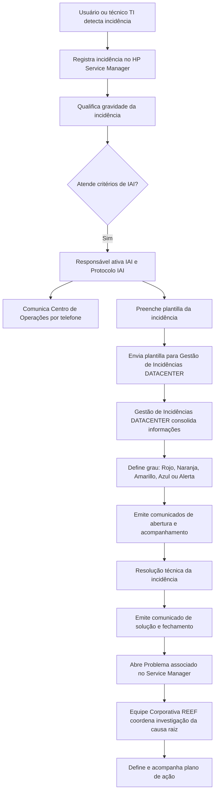

# Procedimento REEF.400 — Comunicação de Incidências de Alto Impacto na Plataforma REEF

## 1. Metadados do Documento
- **Arquivo de Origem:** Não identificado no texto extraído
- **Tipo de Documento:** Procedimento
- **Domínio / Sistema:** Plataforma REEF / Gestão de Incidências de Alto Impacto
- **Público-Alvo:** Operação, equipes de TI, responsáveis locais por instância/país, Equipe Corporativa REEF e equipes de gestão de problemas
- **Data/Versão Identificada:** Referência `PRO.ENT.012`; aprovação em `29/05/2024`; versão `V 0.1`

---

## 2. Resumo Executivo & Contexto de Negócio

O procedimento REEF.400 padroniza os critérios e as atuações para comunicar incidências de alto impacto (IAI) na Plataforma REEF. Uma IAI é definida como uma incidência com impacto crítico no negócio. O documento abrange a comunicação durante todas as fases do ciclo do incidente: identificação, comunicação e acompanhamento até a resolução.

A abertura de uma IAI começa quando um usuário ou técnico de TI registra a incidência no HP Service Manager (HPSM). A gravidade é então avaliada com base na catalogação do serviço ou aplicação — ORO, PLATA ou BRONCE —, no volume de usuários afetados e na sintomatologia, incluindo tempos elevados de resposta e indisponibilidade total ou parcial de funcionalidades.

O responsável pela ativação da IAI deve contatar o Centro de Operações por telefone, preencher uma plantilla com informações operacionais da incidência e encaminhá-la ao grupo de Gestão de Incidências DATACENTER. Esse grupo centraliza as informações e define o grau operacional da IAI: Rojo, Naranja, Amarillo, Azul ou Alerta.

A comunicação ocorre em paralelo à resolução técnica da incidência. O processo prevê comunicados de abertura, acompanhamento, solução, reabertura e plano de ação. Incidentes Rojo, Naranja e Amarillo exigem comunicados a cada hora, enquanto incidentes Azul e Alerta exigem três comunicados diários.

Além da resolução imediata, o procedimento exige a identificação da causa raiz e a abertura de um Problema associado ao incidente no Service Manager. A Gestão de Problemas é governada e coordenada pela equipe Corporativa REEF, com o objetivo de definir e acompanhar um plano de ação até a eliminação da causa raiz.

---

## 3. Arquitetura, Componentes & Tecnologias Envolvidas

| Componente / Entidade | Função no procedimento |
| :--- | :--- |
| Plataforma REEF | Plataforma abrangida pelo procedimento de comunicação de IAI. |
| HP Service Manager / HPSM | Ferramenta na qual a incidência é registrada e onde o Problema associado é aberto. |
| Centro de Operações | Equipe contatada por telefone para comunicação inicial da IAI. |
| Gestão de Incidências DATACENTER | Agregador das informações e comunicações recebidas sobre a IAI. |
| Equipe Corporativa REEF | Equipe que governa e coordena a Gestão de Problemas. |
| `zzl ACT REEF-Problemas` | Equipe de Gestão de Problemas indicada no documento. |
| `zzd DCTP IT Gestion de Incidencias DATACENTER` | Destinatário do e-mail da plantilla de incidência. |
| Instâncias REEF por país | Ambientes que devem possuir configuração específica do protocolo IAI. |
| REEF Panamá | Instância da América Central configurada no anexo. |
| REEF Uruguay | Instância REEF VIDA configurada no anexo. |



> **Nota de Análise:** O texto não descreve interfaces técnicas, métodos HTTP, integrações de dados, contratos JSON ou detalhes de infraestrutura da Plataforma REEF, do HP Service Manager ou do Centro de Operações.

---

## 4. Regras de Negócio, Especificações Funcionais & Processos

### 4.1 Definição e escopo da Incidência de Alto Impacto

Uma Incidência de Alto Impacto é uma incidência com impacto crítico no negócio. O procedimento regula a comunicação da incidência para as áreas e pessoas envolvidas nas seguintes fases:

1. Identificação do incidente.
2. Comunicação do incidente.
3. Acompanhamento do incidente.
4. Solução e encerramento da incidência.
5. Reabertura, quando a incidência voltar a ocorrer.
6. Gestão do problema e plano de ação para eliminação da causa raiz.

A comunicação de uma IAI ocorre em paralelo à resolução da incidência de alto impacto.

### 4.2 Identificação do incidente

O usuário ou técnico de TI que detecta a incidência deve registrá-la no HP Service Manager. Em seguida, a gravidade deve ser qualificada.

Uma incidência é considerada IAI com base nas seguintes premissas:

- Serviço ou aplicação catalogado como **ORO**, **PLATA** ou **BRONCE**.
- Impacto em coletivos, considerando o volume de usuários afetados.
- Sintomatologia identificada, incluindo:
  - tempos de resposta elevados;
  - indisponibilidade total de funcionalidades;
  - indisponibilidade parcial de funcionalidades.

### 4.3 Comunicação inicial do incidente

O responsável por ativar a Incidência de Alto Impacto e o Protocolo de Comunicação deve executar as seguintes ações:

1. Comunicar o incidente ao Centro de Operações.
   - Canal: telefone.
   - Número: `+34 915 811 901`.
   - Atendimento: `24 X 7`.

2. Preencher a plantilla de comunicação da incidência com as informações obrigatórias.

3. Enviar a plantilla ao endereço informado para Gestão de Incidências DATACENTER:
   - `APP-DCTPITGINCDC@mapfre.com`.

A Gestão de Incidências DATACENTER é a responsável por agregar as informações e comunicações relacionadas à IAI.

### 4.4 Critérios de classificação do grau da IAI

| Grau | Critérios de classificação |
| :--- | :--- |
| **ROJO** | Indisponibilidade total em mais de um serviço com catalogação ORO. |
| **NARANJA** | Indisponibilidade total em um serviço com catalogação ORO. |
| **AMARILLO** | Indisponibilidade parcial em alguma funcionalidade; lentidão ou degradação em serviço ORO; ou indisponibilidade total em serviço PLATA. |
| **AZUL** | Indisponibilidade parcial em alguma funcionalidade; lentidão ou degradação em serviço PLATA; ou indisponibilidade total em serviço BRONCE. |
| **ALERTA** | Os critérios anteriores não são atendidos, mas existe afetação considerável. |

### 4.5 Acompanhamento e frequência de comunicados

Após a declaração de uma IAI e até sua resolução, devem ser emitidos comunicados aos grupos predefinidos.

| Tipo de comunicado | Conteúdo obrigatório ou finalidade |
| :--- | :--- |
| **Apertura IAI** | Informa serviços afetados, coletivos afetados, hora de início, impacto e ações em curso. |
| **Seguimiento IAI** | Apresenta a situação das ações em curso. |
| **Solución IAI** | Comunica o encerramento da incidência, a causa e as ações realizadas. |
| **Reapertura IAI** | Deve ser emitido se a incidência voltar a ocorrer. |
| **Plan de acción** | Estabelece o plano para erradicar a causa raiz e acompanha sua execução até o fim. |

| Grau da IAI | Periodicidade de comunicados |
| :--- | :--- |
| Rojo | A cada hora |
| Naranja | A cada hora |
| Amarillo | A cada hora |
| Azul | Três comunicados por dia |
| Alerta | Três comunicados por dia |

### 4.6 Gestão de Problemas e causa raiz

A gestão de uma IAI inclui a identificação da causa raiz que originou o incidente. O objetivo é encontrar uma solução definitiva para a causa raiz identificada e implantá-la.

O processo de Gestão de Problemas exige:

1. Associar o incidente a um Problema no Service Manager.
2. Abrir o Problema na mesma ferramenta.
3. Iniciar o período de investigação para identificar:
   - causa raiz;
   - resolução do erro;
   - plano de ação correspondente.
4. Acompanhar o plano de ação até a conclusão de sua execução.

A Gestão de Problemas é governada e coordenada pela Equipe Corporativa REEF. A equipe indicada para Gestão de Problemas é `zzl ACT REEF-Problemas`.

### 4.7 Configuração do Protocolo IAI por instância ou país

O procedimento de Incidências de Alto Impacto para REEF é único para todas as instâncias da Plataforma REEF. Contudo, o protocolo deve ser configurado especificamente para cada instância ou país em que REEF esteja em produção.

Cada configuração por instância ou país deve informar:

1. **Coletivo afetado**
   - volume potencial de usuários afetados;
   - afetação total;
   - afetação parcial.

2. **Serviço REEF**
   - tipo de serviço REEF na instância ou país;
   - de forma geral, REEF é considerado serviço crítico ORO;
   - horários de prestação do serviço por dia da semana;
   - horários de pico;
   - horários de vale.

3. **Responsáveis por ativar a IAI e o Protocolo IAI**
   - nome;
   - e-mail.

4. **Responsáveis pela manutenção da lista de distribuição**
   - responsáveis locais pela lista de envio de comunicados.

---

## 5. Tabelas de Parâmetros, Ambientes e Estruturas de Dados

### 5.1 Plantilla de informação da incidência

| Item / Parâmetro | Descrição / Função | Tipo / Valores / Formato | Ambiente / Observações |
| :--- | :--- | :--- | :--- |
| Aplicación / Elemento afectado | Aplicação ou elemento de infraestrutura afetado. | Texto | Obrigatório na plantilla. |
| Descripción de la incidencia | Descrição do problema. | Texto | Obrigatório na plantilla. |
| Comentarios del usuario | Sintoma do problema percebido pelo usuário. | Texto | Obrigatório na plantilla. |
| Fecha/hora de notificación | Data de registro da incidência. | Data e hora | Obrigatório na plantilla. |
| Id. Incidencia | Número registrado no HPSM. | Formato `IMXXXX` | Obrigatório na plantilla. |
| Colectivos afectados | Relação de usuários impactados ou alcance. | Texto | Obrigatório na plantilla. |
| Alternativa gestión | Indica se há alternativa de gestão. | `SI` / `NO` | Obrigatório na plantilla. |
| Acciones realizadas | Ações em realização para solucionar a incidência. | Texto | Obrigatório na plantilla. |

### 5.2 Canais de comunicação

| Item / Parâmetro | Descrição / Função | Tipo / Valores / Formato | Ambiente / Observações |
| :--- | :--- | :--- | :--- |
| Centro de Operações | Destinatário da comunicação telefônica inicial da IAI. | Telefone `+34 915 811 901` | Atendimento `24 X 7`. |
| Gestão de Incidências DATACENTER | Grupo agregador de informações e comunicações. | `zzd DCTP IT Gestion de Incidencias DATACENTER` | E-mail: `APP-DCTPITGINCDC@mapfre.com`. |
| Equipe de Gestão de Problemas | Equipe indicada para gestão de problemas associados a IAI. | `zzl ACT REEF-Problemas` | Governança e coordenação da Equipe Corporativa REEF. |

### 5.3 Lista de distribuição — Equipe Corporativa REEF

| Grupo / Item | Participantes / Endereço | Critério de comunicação |
| :--- | :--- | :--- |
| `zzl DCTP Alto Impacto REEF Dirección` | Nuno Simoes (`nsimoes@mapfre.com`); Eduardo Cuesta (`educues@mapfre.com`); Raúl Tejado (`rtejado@mapfre.com`); Consuelo Cobb (`ccobbdi@mapfre.com`); Fidel Moreno (`fidel@mapfre.com`) | Comunicação apenas se a IAI for grau Rojo ou Naranja. |
| `zzl DCTP Alto Impacto REEF Corporativo` | `zzl TECH Operación Infra Reef` — `LTESENOOPINRE@mapfre.com` | Comunicação ativada em todos os graus. |
| `zzl DCTP Alto Impacto REEF Implantaciones` | José de Abreu (`jdabreu@mapfre.com`); Pablo Guerra (`pablo.guerra@mapfre.com`); Ahmet Hakan Guzel (`hakangu@mapfre.com`); David de Francisco (`dadefra@mapfre.com`); Freddy Eliecer Prieto Vega (`fepriet@mapfre.com`); Jordanys Javier Alves Sebastiani (`asjorda@mapfre.com`); Sonia Rodriguez del Cerro Garcia (`srodr6@mapfre.com`); Juan Jesus Sanchez Dominguez (`juanje6@3p.mapfre.com`); Carolina Vázquez Rua (`cavazqu@mapfre.com`); Juan Manuel Prieto Caballero (`prietju@mapfre.com`); Pilar Ruiz (`mruizm@mapfre.com`) | Comunicação ativada em todos os graus. |

### 5.4 Configuração — Instância REEF América Central / Reef Panamá

| Item / Parâmetro | Descrição / Função | Tipo / Valores / Formato | Ambiente / Observações |
| :--- | :--- | :--- | :--- |
| Instância | Reef Panamá | Texto | Instância REEF América Central. |
| Afetação total potencial | Usuários potencialmente afetados em caso de afetação total. | `300 usuarios Reef + 900 usuarios web` | Configuração local. |
| Afetação parcial potencial | Usuários potencialmente afetados em caso de afetação parcial. | `900 usuarios web` | Configuração local. |
| Serviço REEF | Classificação do serviço. | Serviço crítico, categoria ORO | Configuração local. |
| Horário de pico | Horário de maior prestação/uso declarado. | L-V: `8:00 - 12:30` e `13:30 – 17:00`; S: `8:00 – 12:30` | Configuração local. |
| Horário de vale | Demais horários. | Resto do horário | Configuração local. |
| Responsável por ativar IAI | Francisco Flores | `FRANCISCO.FLORES@mapfre.com.pa` | Responsável por ativar IAI e Protocolo IAI. |
| Responsável por ativar IAI | Rubén Aristizabal | `RARISTI@mapfre.com` | Responsável por ativar IAI e Protocolo IAI. |
| Manutenção da lista local | Rubén Aristizabal | `RARISTI@mapfre.com` | Responsável pela manutenção da lista de distribuição. |

| Grupo de distribuição Panamá | Participantes / Endereço | Critério de comunicação |
| :--- | :--- | :--- |
| `zzl DCTP Alto Impacto Panamá Dirección` | Jorge Thomas Curras (`jthomas@mapfre.com`); Victor Bonilla (`vbonill@mapfre.com`); Moira Romero (`moira.romero@mapfre.com`); Francisco Gómez (`fjgomeza@mapre.com.pa`) | Comunicação apenas para IAI Rojo ou Naranja. |
| `zzl DCTP Alto Impacto Panamá` | Francisco Flores (`francisco.flores@mapre.com.pa`); Rubén Aristizabal (`raristi@mapre.com.pa`); Erika Quintana (`equint@mapfre.com.pa`) | Comunicação ativada em todos os graus. |
| Espacio Mapfre Infraestructura | Andre Conde Caselli (`acaselli@mapfre.com.br`); Carlos Rivera (`carivera@mapfre.com`); EM SMO (`em.smo.br@telefonica.com`) | Comunicação ativada em todos os graus. |

> **Nota de Análise:** O texto extraído apresenta domínios de e-mail distintos para alguns contatos de Panamá, incluindo `mapfre.com.pa` e `mapre.com.pa`. Esta divergência foi preservada fielmente e deve ser validada antes do uso operacional.

### 5.5 Configuração — Instância REEF VIDA / Reef Uruguay

| Item / Parâmetro | Descrição / Função | Tipo / Valores / Formato | Ambiente / Observações |
| :--- | :--- | :--- | :--- |
| Instância | Reef Uruguay | Texto | Instância REEF VIDA. |
| Afetação de usuários potenciais | Volume potencial de usuários afetados. | `pendiente` | Informação pendente no documento. |
| Serviço REEF | Classificação do serviço. | Serviço crítico, categoria ORO | Configuração local. |
| Horário de pico | Horário de maior prestação/uso declarado. | L-V: `8:00 - 12:30` e `13:30 – 17:00`; S: `8:00 – 12:30` | Configuração local. |
| Horário de vale | Demais horários. | Resto do horário | Configuração local. |
| Responsável por ativar IAI | Maryorie Montilla | `mmontilla@mapfre.com.uy` | Responsável por ativar IAI e Protocolo IAI. |
| Responsável por ativar IAI | Marcelo Trigo | `mtrigo@mapfre.com.uy` | Responsável por ativar IAI e Protocolo IAI. |
| Responsável por ativar IAI | Tomas Porto | `tporto@mapfre.com.uy` | Responsável por ativar IAI e Protocolo IAI. |
| Manutenção da lista local | Marcelo Trigo | `mtrigo@mapfre.com.uy` | Responsável pela manutenção da lista de distribuição. |
| Manutenção da lista local | Tomas Porto | `tporto@mapfre.com.uy` | Responsável pela manutenção da lista de distribuição. |

| Grupo de distribuição Uruguay | Participantes / Endereço | Critério de comunicação |
| :--- | :--- | :--- |
| `zzl DCTP Alto Impacto Uruguay Dirección` | Jorge Thomas Curras (`jthomas@mapfre.com`); Victor Bonilla (`vbonill@mapfre.com`); Enrique de la Torre (`etorre1@mapfre.com`); Sebastián Uribe Paez (`suribe1@mapfre.com`); Hugo Machado (`hamachd@mapfre.com`) | Comunicação apenas para IAI Rojo ou Naranja. |
| `zzl DCTP Alto Impacto Uruguay` | Florencia Santiñaque (`fsantinaque@mapfre.com.uy`); Fernando Mascazini (`fmascazini@mapfre.com.uy`); Maryorie Montilla (`mmontilla@mapfre.com.uy`); Marcelo Trigo (`mtrigo@mapfre.com.uy`); Tomas Porto (`tporto@mapfre.com.uy`) | Comunicação ativada em todos os graus. |
| Espacio Mapfre Infraestructura | Andre Conde Caselli (`acaselli@mapfre.com.br`); Carlos Rivera (`carivera@mapfre.com`); EM SMO (`em.smo.br@telefonica.com`) | Comunicação ativada em todos os graus. |

### 5.6 Relações processuais e controle de mudanças

| Item / Parâmetro | Descrição / Função | Tipo / Valores / Formato | Ambiente / Observações |
| :--- | :--- | :--- | :--- |
| Processo afetado | Gestão de Incidências | Processo | Relacionado ao procedimento REEF.400. |
| Processo afetado | Gestão de Problemas | Processo | Relacionado ao procedimento REEF.400. |
| Procedimento relacionado | Procedimento de Comunicação de Incidências de Alto Impacto | REEF.400 | Documento analisado. |
| Procedimento relacionado | Procedimento de Gestão de Incidentes REEF | REEF.401 | Relação documentada. |
| Procedimento relacionado | Procedimento de Gestão de Problemas REEF | REEF.402 | Relação documentada. |
| Versão | V 0.1 | Versão | `10/04/2024`: Descrição Governo REEF. |
| Versão | V 0.1 | Versão | `10/04/2024`: Primeira revisão, José de Abreu. |
| Versão | V 0.1 | Versão | `29/05/2024`: Aprovação, Comité AST. |

---

## 6. Bateria de Perguntas & Respostas para RAG (FAQ Sintético)

### P1: O que caracteriza uma Incidência de Alto Impacto na Plataforma REEF?
**R:** Uma Incidência de Alto Impacto é uma incidência com impacto crítico no negócio. A classificação considera a catalogação do serviço ou aplicação como ORO, PLATA ou BRONCE, o volume de usuários afetados e a sintomatologia, como lentidão, degradação ou indisponibilidade parcial ou total de funcionalidades.

### P2: Onde uma incidência REEF deve ser registrada antes da ativação do protocolo IAI?
**R:** O usuário ou técnico de TI que detecta a incidência deve registrá-la no HP Service Manager, também referido como HPSM. O identificador da incidência registrado nessa ferramenta deve constar na plantilla no formato `IMXXXX`.

### P3: Qual é o canal de comunicação inicial com o Centro de Operações em uma IAI?
**R:** O responsável pela ativação da IAI deve comunicar o Centro de Operações por telefone, no número `+34 915 811 901`. O atendimento informado pelo procedimento é `24 X 7`.

### P4: Quais informações precisam constar na plantilla de comunicação de uma IAI?
**R:** A plantilla deve conter aplicação ou elemento afetado, descrição da incidência, comentários do usuário sobre os sintomas, data e hora de notificação, identificador HPSM da incidência, coletivos afetados, indicação de alternativa de gestão (`SI/NO`) e ações realizadas para resolver a incidência.

### P5: Como a Gestão de Incidências DATACENTER classifica uma IAI como Rojo?
**R:** Uma IAI é classificada como Rojo quando existe indisponibilidade total em mais de um serviço com catalogação ORO.

### P6: Quando uma IAI é classificada como Amarillo?
**R:** Uma IAI é classificada como Amarillo se houver indisponibilidade parcial em alguma funcionalidade, lentidão ou degradação em um serviço catalogado como ORO, ou indisponibilidade total em um serviço catalogado como PLATA.

### P7: Com que frequência devem ser enviados comunicados para incidentes Azul e Alerta?
**R:** Para IAI classificadas como Azul ou Alerta, devem ser emitidos três comunicados por dia. Para incidentes Rojo, Naranja e Amarillo, a frequência estabelecida é de um comunicado por hora.

### P8: O que deve ser informado no comunicado de abertura de uma IAI?
**R:** O comunicado de abertura deve informar os serviços afetados, os coletivos afetados, a hora de início do incidente, o impacto identificado e as ações que estão em curso.

### P9: O que acontece após a solução de uma IAI?
**R:** Após a solução, deve ser emitido o comunicado de Solución IAI, incluindo o encerramento da incidência, a informação sobre a causa e as ações executadas. O procedimento também exige a identificação da causa raiz, a abertura de um Problema associado no Service Manager e a definição de um plano de ação até sua conclusão.

### P10: Quem governa e coordena o processo de Gestão de Problemas para IAI REEF?
**R:** O processo de Gestão de Problemas é governado e coordenado pela Equipe Corporativa REEF. O documento identifica a equipe de Gestão de Problemas como `zzl ACT REEF-Problemas`.

### P11: Como o Protocolo IAI deve ser configurado para cada instância REEF?
**R:** Embora o procedimento seja único para todas as instâncias REEF, cada país ou instância em produção deve configurar o volume de usuários afetados em cenários totais e parciais, o tipo e a catalogação do serviço REEF, horários de pico e vale, responsáveis pela ativação do protocolo e responsáveis pela manutenção da lista local de distribuição.

### P12: Qual é a configuração de afetação e criticidade do Reef Panamá?
**R:** Para Reef Panamá, a afetação total configurada é de `300 usuarios Reef + 900 usuarios web`, e a afetação parcial é de `900 usuarios web`. O serviço é classificado como crítico, categoria ORO.

### P13: Quais informações de afetação de usuários estão configuradas para Reef Uruguay?
**R:** O documento indica que a afetação de usuários potenciais para Reef Uruguay está `pendiente`. O serviço REEF Uruguay é classificado como serviço crítico, categoria ORO.

---

## 7. Glossário de Termos, Siglas & Conceitos-Chave

- **IAI:** Incidencia de Alto Impacto; incidência com impacto crítico no negócio.
- **REEF:** Plataforma REEF, sistema abrangido pelo procedimento.
- **HPSM:** HP Service Manager; ferramenta para registro da incidência e abertura do Problema associado.
- **HP Service Manager:** Ferramenta utilizada para registrar incidências e gerir Problemas associados.
- **ORO:** Categoria de serviço utilizada nos critérios de gravidade; REEF é considerado, de forma geral, um serviço crítico ORO.
- **PLATA:** Categoria de serviço utilizada nos critérios de gravidade.
- **BRONCE:** Categoria de serviço utilizada nos critérios de gravidade.
- **ROJO:** Grau de IAI para indisponibilidade total em mais de um serviço ORO.
- **NARANJA:** Grau de IAI para indisponibilidade total em um serviço ORO.
- **AMARILLO:** Grau de IAI associado a indisponibilidade parcial, degradação em serviço ORO ou indisponibilidade total de serviço PLATA.
- **AZUL:** Grau de IAI associado a indisponibilidade parcial, degradação em serviço PLATA ou indisponibilidade total de serviço BRONCE.
- **ALERTA:** Grau de IAI para afetação considerável que não cumpre os critérios dos demais graus.
- **Gestión de Incidencias DATACENTER:** Grupo que agrega informações e comunicações sobre a IAI.
- **Gestión de Problemas:** Processo de investigação de causa raiz, resolução do erro e acompanhamento do plano de ação.
- **Causa raíz:** Origem identificada do incidente, cuja eliminação é o objetivo do plano de ação.
- **Colectivo afectado:** Grupo ou volume de usuários impactados por uma incidência.
- **Horario pico:** Horário de maior prestação do serviço indicado para a instância.
- **Horario valle:** Horário restante fora do horário de pico.

---

## 8. Notas Críticas, Riscos & Limitações

- A classificação de severidade depende de informações corretas sobre catalogação do serviço, impacto em usuários e sintomatologia. Dados incompletos na plantilla podem comprometer a classificação da IAI.
- O procedimento exige que o Protocolo IAI seja configurado localmente para cada instância ou país, mesmo sendo único para a Plataforma REEF. Configurações não atualizadas podem comprometer os destinatários e a efetividade da comunicação.
- A informação de afetação potencial de usuários para Reef Uruguay está marcada como `pendiente`, o que limita a avaliação operacional de impacto nessa instância.
- O documento extraído contém possíveis inconsistências de domínios de e-mail em contatos de Panamá, especialmente endereços com `mapre.com.pa` em vez de `mapfre.com.pa`. A validade operacional desses endereços não é confirmada pelo documento.
- O texto não detalha os mecanismos técnicos de integração entre REEF, HP Service Manager, Centro de Operações e listas de distribuição.
- O procedimento referencia REEF.401 e REEF.402, mas o conteúdo funcional desses documentos não foi fornecido no texto analisado.
- A distribuição para grupos de Dirección é restrita a IAI Rojo ou Naranja; para o restante das listas, a comunicação é ativada em todos os graus.

---

## 9. Conteúdo Bruto Estruturado (Referência Fiel)

```text
--- [PÁGINA 1 DE 6] ---

PROCEDIMIENTO REEF 400 Comunicacion Incidencias alto impacto
REEF ORIGINAL
Referencia PRO.ENT.012
Fecha de aprobación 29/05/2024
Nombre (REEF.400) Procedimiento Comunicación de Incidencias de Alto Impacto REEF
Propósito
El presente documento tiene como objeto unicar los criterios y actuaciones relativas a la comunicación de la aparición, gestión,
tratamiento y cierre de incidencias de alto impacto (IAI) en la Plataforma REEF.
Denimos Incidencia de Alto Impacto aquella con impacto crítico en el negocio.
Alcance
El alcance del documento es gestionar la comunicación de una incidencia de alto impacto en la Plataforma REEF a las áreas / personas
implicadas, y en cada una de las fases de la vida del incidente:
Identicación del incidente -> Comunicación del incidente -> Seguimiento del incidente 
Desarrollo
La comunicación de un incidente transcurre de forma paralela a la resolución de la incidencia de alto impacto.
Identicación del incidente
El usuario y/ técnico TI que detecta la incidencia, procede a darla de alta en la herramienta HP Service Manager.
A continuación, se deberá calicar la gravedad de la incidencia.
Se considerará Incidencia de Alto Impacto atendiendo a las siguientes premisas:
Servicio o aplicación catalogado como ORO, PLATA o BRONCE
Documentation / DOCUMENTACIÓN Reef
DOCUMENTACIÓN Reef
Mapfredocument
DOCUMENTACIÓN Reef
Owner
user:agonzalez_mapfre.com
Lifecycle
Approved Source
 / 
 VL
Buscar Inicio Soluciones Arquitecturas APIs Componentes Cloud Documentación Zeus Reef Ayuda
ES


--- [PÁGINA 2 DE 6] ---

Impacto a colectivos (volumen de usuarios afectados)
Sintomatología (tiempos altos de respuesta y/o indisponibilidad total o parcial de funcionalidades).
Comunicación del incidente
El responsable de activar la incidencia de Alto Impacto, así como el Protocolo de Comunicación, deberá realizar tres acciones:
1. Comunicar el incidente al Equipo de Centro de Operaciones:
- Vía telefónica al número +34 915 811 901
- Atención horario 24 X 7
2. Cumplimentar la información de la incidencia conforme a la plantilla:
Aplicación / Elemento afectado: aplicación o elemento de Infraestructura
Descripción de la incidencia: descripción del problema
Comentarios del usuario: síntoma del problema percibido por el usuario
Fecha/hora de noticación: fecha de registro de la incidencia
Id. Incidencia: número registrado en HPSM (IMXXXX)
Colectivos afectados: relación de usuarios impactados o alcance
Alternativa gestión (SI/NO): si la hubiera
Acciones realizadas: acciones que se están realizando para solucionar la incidencia.
1. Enviar la plantilla al correo:
zzd DCTP IT Gestion de Incidencias DATACENTER APP-DCTPITGINCDC@mapfre.com
Gestión de Incidencias DATACENTER será el aglutinador de la información y comunicación.
Con la información aportada se procederá a asignar el grado de la incidencia conforme a los siguientes criterios:
ROJO Indisponibilidad total en más de un servicio con catalogación ORO
NARANJA Indisponibilidad total en un servicio con catalogación ORO
AMARILLO Indisponibilidad parcial en alguna funcionalidad
Lentitud o degradación en servicio con catalogación ORO
Indisponibilidad total en servicio con catalogación PLATA
AZUL Indisponibilidad parcial en alguna funcionalidad
Lentitud o degradación en servicio con catalogación PLATA
Indisponibilidad total en servicio con catalogación BRONCE
ALERTA No se cumplen los baremos anteriores, pero tienen afectación considerable
Seguimiento del incidente
Una vez declarada la Incidencia de Alto Impacto y hasta su resolución, se emitirán los siguientes comunicados a los
grupos predenidos.
Apertura IAI: se envía correo informando los servicios y colectivos afectados, hora inicio, impacto y acciones en curso
Seguimiento IAI: informe de situación de las acciones en curso.
Comunicados cada hora: incidencias Rojo / Naranja / Amarillo
Tres comunicados al día: incidencias Azul / Alerta


--- [PÁGINA 3 DE 6] ---

Solución IAI: Cierre de la incidencia. Información de la causa y acciones llevadas a cabo.
Reapertura IAI: si la incidencia se vuelve a producir, la IAI se reapertura.
Plan de acción: establecimiento del plan de acción para erradicar la causa raíz del incidente. Seguimiento del plan de acción hasta el n
de su ejecución.
La gestión de un incidente de alto impacto lleva consigo la identicación de la causa raíz que lo ha originado, con el objetivo de encontrar la
solución denitiva a la causa raíz identicada e implantar la misma.
Gestión del problema:
Asociado al incidente en Service Manager, se abre en dicha herramienta un Problema. Se inicia el periodo de investigación para encontrar la
causa raíz y la resolución del error correspondientes junto con la aplicación del plan de acción que corresponda.
El proceso de “Gestión del problema” está gobernado y coordinado por el equipo Corporativo REEF.
Equipo gestión de Problemas: zzl ACT REEF-Problemas
Proceso IAI
Conguración Protocolo Incidencias Alto Impacto en instancias/países REEF
El procedimiento de Incidenicas de Alto Impacto para REEF es único para todas las instancias de la Plataforma.
No obstante, se debe congurar el protocolo de manera especíca para cada instancia / país donde REEF esté en producción.
Datos de conguración:
1) Colectivo afectado
Se deberá indicar el volúmen de usuarios potenciales afectados por una IAI distinguiendo los casos:
Afectación total
Afectación parcial
2) Servicio REEF
Tipo de servicio:
Se deberá indicar el tipo de servicio de REEF en la instancia / país. De forma general se considerará REEF como servicio crítico ORO.
Prestación del servicio:
Se deberá indicar los horarios de prestación del servicio REEF por días de la semana, asó como horarios pico y valle.
3) Responsables por instancia / país de activar una incidencia de Alto Impacto y activar el Protocolo IAI en REEF
Se deberá indicar la/s persona/s responsables (Nombre y email).
4) Responsables del mantenimiento de la lista de distribución para envío de comunicados (instancia / país)
NOTA:
Ver en anexo las conguraciones de las instancias REEF.
ANEXO
CONFIGURACIÓN PROTOCOLO EQUIPO CORPORATIVO REEF


--- [PÁGINA 4 DE 6] ---

Lista distribución para el envío de
comunicados a Equipo Corporativo
zzl DCTP Alto Impacto REEF Dirección (*)
Nuno Simoes (nsimoes@mapfre.com)
Eduardo Cuesta (educues@mapfre.com)
Raúl Tejado (rtejado@mapfre.com)
Consuelo Cobb (ccobbdi@mapfre.com)
Fidel Moreno (del@mapfre.com)
(*) Comunicación si es IAI de grado Rojo o Naranja. Para resto de la lista la comunicación
se activa en todos los grados
zzl DCTP Alto Impacto REEF Corporativo:
zzl TECH Operación Infra Reef LTESENOOPINRE@mapfre.com
zzl DCTP Alto Impacto REEF Implantaciones:
José de Abreu (jdabreu@mapfre.com)
Pablo Guerra (pablo.guerra@mapfre.com)
Ahmet Hakan Guzel (hakangu@mapfre.com)
David de Francisco (dadefra@mapfre.com)
Freddy Eliecer Prieto Vega (fepriet@mapfre.com)
Jordanys Javier Alves Sebastiani (asjorda@mapfre.com)
Sonia Rodriguez del Cerro Garcia (srodr6@mapfre.com)
Juan Jesus Sanchez Dominguez (juanje6@3p.mapfre.com)
Carolina Vázquez Rua (cavazqu@mapfre.com)
Juan Manuel Prieto Caballero (prietju@mapfre.com)
Pilar Ruiz (mruizm@mapfre.com)
CONFIGURACIÓN PROTOCOLO INSTANCIA REEF AMÉRICA CENTRAL
Reef Panamá
Afectación usuarios potenciales Afectación total: 300 usuarios Reef + 900 usuarios web
Afectación parcial: 900 usuarios web
Servicio Reef Servicio crítico. Categoría ORO
Prestación del servicio Horario pico: L-V: 8:00 - 12:30 y 13:30 – 17:00; S: 8:00 – 12:30
Horario valle: resto horario
Responsable activar IAI y
Protocolo IAI
Francisco Flores (FRANCISCO.FLORES@mapfre.com.pa)
Rubén Aristizabal (RARISTI@mapfre.com)  
Responsables del
mantenimiento lista de
distribución para envío de
comunicados (local)
Rubén Aristizabal (RARISTI@mapfre.com)  
Lista distribución para el envío
de comunicados
zzl DCTP Alto Impacto Panamá Dirección (*):
Jorge Thomas Curras (jthomas@mapfre.com)
Victor Bonilla (vbonill@mapfre.com)


--- [PÁGINA 5 DE 6] ---

Afectación usuarios potenciales Afectación total: 300 usuarios Reef + 900 usuarios web
Afectación parcial: 900 usuarios web
Moira Romero (moira.romero@mapfre.com)
Francisco Gómez (fjgomeza@mapre.com.pa)
zzl DCTP Alto Impacto Panamá:
Francisco Flores (francisco.ores@mapre.com.pa)
Rubén Aristizabal (raristi@mapre.com.pa)
Erika Quintana (equint@mapfre.com.pa)
Espacio Mapfre Infraestructura:
Andre Conde Caselli (acaselli@mapfre.com.br)
Carlos Rivera (carivera@mapfre.com)
EM SMO (em.smo.br@telefonica.com)
(*) Comunicación si es IAI de grado Rojo o Naranja. Para resto de la lista la comunicación se
activa en todos los grados
CONFIGURACIÓN PROTOCOLO INSTANCIA REEF VIDA
Reef Uruguay
Afectación usuarios potenciales pendiente
Servicio Reef Servicio crítico. Categoría ORO
Prestación del servicio Horario pico: L-V: 8:00 - 12:30 y 13:30 – 17:00; S: 8:00 – 12:30
Horario valle: resto horario
Responsable activar IAI y
Protocolo IAI
Maryorie Montilla mmontilla@mapfre.com.uy
Marcelo Trigo <mtrigo@mapfre.com.uy>
Tomas Porto: <tporto@mapfre.com.uy>
Responsables del
mantenimiento lista de
distribución para envío de
comunicados (local)
Marcelo Trigo <mtrigo@mapfre.com.uy>
Tomas Porto: <tporto@mapfre.com.uy>
Lista distribución para el envío
de comunicados
zzl DCTP Alto Impacto Uruguay Dirección (*):
Jorge Thomas Curras (jthomas@mapfre.com)
Victor Bonilla (vbonill@mapfre.com)
Enrique de la Torre (etorre1@mapfre.com)
Sebastián Uribe Paez (suribe1@mapfre.com)
Hugo Machado (hamachd@mapfre.com)
zzl DCTP Alto Impacto Uruguay:
Florencia Santiñaque (fsantinaque@mapfre.com.uy)
Fernando Mascazini (fmascazini@mapfre.com.uy)
Maryorie Montilla (mmontilla@mapfre.com.uy)


--- [PÁGINA 6 DE 6] ---

Afectación usuarios potenciales pendiente
Marcelo Trigo (mtrigo@mapfre.com.uy)
Tomas Porto: (tporto@mapfre.com.uy)
Espacio Mapfre Infraestructura:
Andre Conde Caselli (acaselli@mapfre.com.br)
Carlos Rivera (carivera@mapfre.com)
EM SMO (em.smo.br@telefonica.com)
(*) Comunicación si es IAI de grado Rojo o Naranja. Para resto de la lista la comunicación se
activa en todos los grados
Relaciones
Procesos afectados Proceso Gestión Incidencias
Proceso Gestión de Problemas
Procedimientos Procedimiento de Comunicación de Incidencias de Alto Impacto
(REEF.401) Procedimiento de Gestión de Incidentes REEF
(REEF.402) Procedimiento de Gestión de Problemas REEF
Control de Cambios, Revisiones y Aprobaciones
Versión Fecha Descripción Autor
V 0.1 10/04/2024 Descripción Gobierno REEF
V 0.1 10/04/2024 Primera revisión José de Abreu
V 0.1 29/05/2024 Aprobación Comité AST
```
