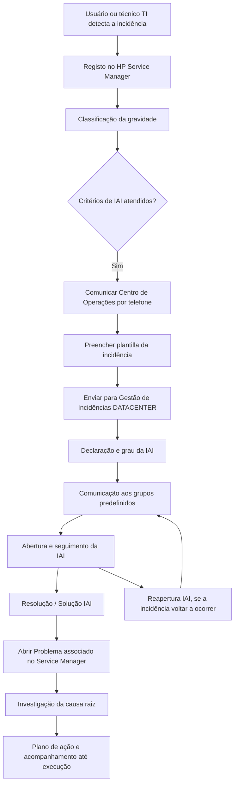

# (REEF.400) Procedimento de Comunicação de Incidências de Alto Impacto REEF

## 1. Metadados do Documento
- **Arquivo de Origem:** `Não identificado — texto bruto extraído fornecido`
- **Tipo de Documento:** `Procedimento`
- **Domínio / Sistema:** `Plataforma REEF`
- **Público-Alvo:** `Equipes de operação, Centro de Operações, responsáveis por instância/país, equipes corporativas REEF e gestão de problemas`
- **Data/Versão Identificada:** `Aprovação em 29/05/2024; versão V 0.1`

---

## 2. Resumo Executivo & Contexto de Negócio

O procedimento REEF.400 unifica os critérios e as ações para comunicação de Incidências de Alto Impacto (IAI) na Plataforma REEF. Uma IAI é definida como uma incidência com impacto crítico no negócio, cuja comunicação ocorre paralelamente às atividades de resolução técnica.

A classificação de uma ocorrência como IAI considera a categoria do serviço ou aplicação — ORO, PLATA ou BRONCE —, o volume de usuários afetados e a sintomatologia observada, incluindo tempos elevados de resposta ou indisponibilidade total ou parcial de funcionalidades.

O processo exige registro inicial no HP Service Manager, notificação telefônica ao Centro de Operações, preenchimento de uma plantilla de incidente e envio para a área Gestão de Incidências DATACENTER. Essa área centraliza informações e comunicações associadas ao incidente.

Após a declaração da IAI, o procedimento define comunicações de abertura, acompanhamento, solução, reabertura e plano de ação. A cadência de atualizações depende do grau da incidência: Rojo, Naranja e Amarillo recebem comunicados a cada hora; Azul e Alerta recebem três comunicados por dia.

Além da resolução do incidente, o procedimento exige gestão do problema e identificação da causa raiz. Um Problema deve ser aberto no Service Manager e associado ao incidente, sob governança e coordenação do equipo Corporativo REEF.

---

## 3. Arquitetura, Componentes & Tecnologias Envolvidas

O documento descreve uma arquitetura operacional e de governança de incidentes, não uma arquitetura técnica detalhada de aplicações, APIs, servidores ou integrações. Os elementos explicitamente citados são:

| Componente / Entidade | Papel descrito |
| :--- | :--- |
| Plataforma REEF | Plataforma na qual ocorre a IAI e para a qual o protocolo é aplicado. |
| Usuário ou técnico TI | Identifica a incidência e realiza o registro inicial. |
| HP Service Manager / HPSM | Ferramenta utilizada para registrar a incidência e abrir o Problema associado. |
| Centro de Operações | Recebe a comunicação telefônica da incidência. |
| Gestão de Incidências DATACENTER | Centraliza informações e comunicações da IAI. |
| Equipo Corporativo REEF | Governa e coordena o processo de Gestão do Problema. |
| Responsáveis por instância/país | Ativam a IAI e o protocolo local. |
| Listas de distribuição | Destinatários dos comunicados corporativos e locais. |



> **Nota de Análise:** o procedimento não detalha métodos HTTP, contratos de integração, topologia de infraestrutura, bases de dados, portas, URLs de ambientes ou tecnologias de implementação da Plataforma REEF.

---

## 4. Regras de Negócio, Especificações Funcionais & Processos

### 4.1 Identificação e classificação da IAI

1. O usuário ou técnico TI que identifica a incidência deve registrá-la na ferramenta HP Service Manager.
2. Após o registro, a gravidade da incidência deve ser qualificada.
3. A incidência será considerada uma Incidência de Alto Impacto quando forem consideradas as seguintes premissas:
   - Serviço ou aplicação catalogado como **ORO**, **PLATA** ou **BRONCE**.
   - Impacto a coletivos, considerando o volume de usuários afetados.
   - Sintomatologia, como tempos altos de resposta e/ou indisponibilidade total ou parcial de funcionalidades.

### 4.2 Ativação do protocolo de comunicação

O responsável por ativar a IAI e o Protocolo de Comunicação deve executar as seguintes ações:

1. Comunicar a incidência ao Equipo de Centro de Operaciones por telefone, no número `+34 915 811 901`.
2. Preencher a informação da incidência conforme a plantilla definida.
3. Enviar a plantilla para `APP-DCTPITGINCDC@mapfre.com`, destinada a `zzd DCTP IT Gestion de Incidencias DATACENTER`.

A Gestão de Incidências DATACENTER atua como aglutinadora da informação e comunicação. Com base na informação recebida, realiza-se a atribuição do grau da incidência conforme critérios mencionados no documento, porém os critérios completos de graduação não foram apresentados no conteúdo extraído.

### 4.3 Comunicações durante o ciclo de vida da IAI

| Tipo de comunicado | Regra / conteúdo |
| :--- | :--- |
| Abertura IAI | Correio com serviços e coletivos afetados, hora de início, impacto e ações em curso. |
| Seguimento IAI | Informe de situação das ações em curso. |
| Incidências Rojo / Naranja / Amarillo | Comunicados a cada hora. |
| Incidências Azul / Alerta | Três comunicados por dia. |
| Solução IAI | Fechamento da incidência, incluindo informação da causa e ações realizadas. |
| Reapertura IAI | Emitida quando a incidência volta a ocorrer. |
| Plano de ação | Estabelecido para erradicar a causa raiz; deve ser acompanhado até o fim da execução. |

### 4.4 Gestão do problema e causa raiz

A gestão de uma IAI inclui identificação da causa raiz com o objetivo de encontrar e implantar uma solução definitiva. Para isso:

1. Deve ser aberto um **Problema** no Service Manager associado ao incidente.
2. Inicia-se a investigação para identificar a causa raiz e a resolução do erro.
3. Deve ser aplicado o plano de ação correspondente.
4. O processo de Gestão do Problema é governado e coordenado pelo equipo Corporativo REEF.
5. O grupo de gestão de problemas indicado é `zzl ACT REEF-Problemas`.

### 4.5 Configuração por instância ou país

O procedimento de IAI é único para todas as instâncias da Plataforma REEF. Entretanto, cada instância ou país em produção deve configurar especificamente:

1. **Coletivo afetado**
   - Volume potencial de usuários afetados.
   - Distinção entre afetação total e afetação parcial.

2. **Serviço REEF**
   - Tipo de serviço na instância ou país.
   - De forma geral, REEF deve ser considerado serviço crítico da categoria ORO.
   - Horários de prestação por dia da semana.
   - Horários de pico e vale.

3. **Responsáveis pela ativação**
   - Pessoas responsáveis por ativar uma IAI e o Protocolo IAI.
   - Nome e e-mail devem ser informados.

4. **Responsáveis pela manutenção de listas**
   - Pessoas responsáveis pela manutenção da lista local de distribuição dos comunicados.

---

## 5. Tabelas de Parâmetros, Ambientes e Estruturas de Dados

### 5.1 Plantilla obrigatória da incidência

| Item / Parâmetro | Descrição / Função | Tipo / Valores / Formato | Ambiente / Observações |
| :--- | :--- | :--- | :--- |
| Aplicação / Elemento afetado | Identifica a aplicação ou elemento de infraestrutura afetado. | Texto | Obrigatório na plantilla. |
| Descrição da incidência | Descreve o problema ocorrido. | Texto | Obrigatório na plantilla. |
| Comentários do usuário | Registra o sintoma percebido pelo usuário. | Texto | Obrigatório na plantilla. |
| Data/hora de notificação | Data de registro da incidência. | Data e hora | Obrigatório na plantilla. |
| Id. Incidência | Número da incidência registada no HPSM. | Formato `IMXXXX` | Obrigatório na plantilla. |
| Coletivos afetados | Relação ou alcance dos usuários impactados. | Texto / relação de usuários | Obrigatório na plantilla. |
| Alternativa gestão | Indica se há alternativa de gestão. | `SI/NO` | Preencher se aplicável. |
| Ações realizadas | Ações em execução para solucionar a incidência. | Texto | Obrigatório na plantilla. |

### 5.2 Canais operacionais

| Item / Parâmetro | Descrição / Função | Tipo / Valores / Formato | Ambiente / Observações |
| :--- | :--- | :--- | :--- |
| Telefone do Centro de Operações | Canal de comunicação inicial da incidência. | `+34 915 811 901` | Atendimento `24 X 7`. |
| E-mail Gestão de Incidências DATACENTER | Destino da plantilla de IAI. | `APP-DCTPITGINCDC@mapfre.com` | Grupo `zzd DCTP IT Gestion de Incidencias DATACENTER`. |
| Ferramenta de incidências | Registro de incidência e Problema associado. | HP Service Manager / HPSM | Utilizada no ciclo de incidente e problema. |
| Grupo de gestão de problemas | Grupo identificado para gestão do problema. | `zzl ACT REEF-Problemas` | Processo governado pelo equipo Corporativo REEF. |

### 5.3 Configuração corporativa REEF

| Item / Parâmetro | Descrição / Função | Tipo / Valores / Formato | Ambiente / Observações |
| :--- | :--- | :--- | :--- |
| Lista corporativa de direção | Lista de destinatários de direção. | `zzl DCTP Alto Impacto REEF Dirección` | Comunicação para IAI Rojo ou Naranja. |
| Nuno Simoes | Destinatário corporativo. | `nsimoes@mapfre.com` | Lista de direção. |
| Eduardo Cuesta | Destinatário corporativo. | `educues@mapfre.com` | Lista de direção. |
| Raúl Tejado | Destinatário corporativo. | `rtejado@mapfre.com` | Lista de direção. |
| Consuelo Cobb | Destinatária corporativa. | `ccobbdi@mapfre.com` | Lista de direção. |
| Fidel Moreno | Destinatário corporativo. | `del@mapfre.com` conforme extração | O texto extraído contém caractere ilegível no endereço. |
| Lista corporativa REEF | Lista corporativa de alto impacto. | `zzl DCTP Alto Impacto REEF Corporativo` | O documento não detalha os membros nessa linha. |
| Operação Infra Reef | Grupo de operação de infraestrutura. | `LTESENOOPINRE@mapfre.com` | `zzl TECH Operación Infra Reef`. |
| Lista de implantações | Lista corporativa de implantação. | `zzl DCTP Alto Impacto REEF Implantaciones` | Destinatários listados a seguir. |
| José de Abreu | Destinatário de implantações. | `jdabreu@mapfre.com` |  |
| Pablo Guerra | Destinatário de implantações. | `pablo.guerra@mapfre.com` |  |
| Ahmet Hakan Guzel | Destinatário de implantações. | `hakangu@mapfre.com` |  |
| David de Francisco | Destinatário de implantações. | `dadefra@mapfre.com` |  |
| Freddy Eliecer Prieto Vega | Destinatário de implantações. | `fepriet@mapfre.com` |  |
| Jordanys Javier Alves Sebastiani | Destinatário de implantações. | `asjorda@mapfre.com` |  |
| Sonia Rodriguez del Cerro Garcia | Destinatária de implantações. | `srodr6@mapfre.com` |  |
| Juan Jesus Sanchez Dominguez | Destinatário de implantações. | `juanje6@3p.mapfre.com` |  |
| Carolina Vázquez Rua | Destinatária de implantações. | `cavazqu@mapfre.com` |  |
| Juan Manuel Prieto Caballero | Destinatário de implantações. | `prietju@mapfre.com` |  |
| Pilar Ruiz | Destinatária de implantações. | `mruizm@mapfre.com` |  |

### 5.4 Instância REEF América Central — Reef Panamá

| Item / Parâmetro | Descrição / Função | Tipo / Valores / Formato | Ambiente / Observações |
| :--- | :--- | :--- | :--- |
| Instância | Instância REEF configurada. | Reef Panamá | América Central. |
| Afetação total | Usuários potencialmente afetados em caso total. | `300 usuários Reef + 900 usuários web` |  |
| Afetação parcial | Usuários potencialmente afetados em caso parcial. | `900 usuários web` |  |
| Categoria de serviço | Classificação do serviço REEF. | Serviço crítico, categoria ORO |  |
| Horário pico | Horário de maior prestação. | `L-V: 8:00 - 12:30 e 13:30 – 17:00; S: 8:00 – 12:30` |  |
| Horário vale | Horário de menor prestação. | Resto do horário |  |
| Responsável por ativar IAI | Responsável local. | Francisco Flores — `FRANCISCO.FLORES@mapfre.com.pa` |  |
| Responsável por ativar IAI | Responsável local. | Rubén Aristizabal — `RARISTI@mapfre.com` |  |
| Manutenção da lista local | Responsável identificado. | Rubén Aristizabal — `RARISTI@mapfre.com` |  |
| Lista Panamá Dirección | Destinatários de direção. | `zzl DCTP Alto Impacto Panamá Dirección` | Apenas IAI Rojo ou Naranja. |
| Jorge Thomas Curras | Destinatário. | `jthomas@mapfre.com` | Panamá Dirección. |
| Victor Bonilla | Destinatário. | `vbonill@mapfre.com` | Panamá Dirección. |
| Moira Romero | Destinatária. | `moira.romero@mapfre.com` | Panamá Dirección. |
| Francisco Gómez | Destinatário. | `fjgomeza@mapre.com.pa` | Endereço reproduzido conforme extração. |
| Lista Panamá | Destinatários locais. | `zzl DCTP Alto Impacto Panamá` | Todos os graus. |
| Francisco Flores | Destinatário local. | `francisco.ores@mapre.com.pa` conforme extração | O texto extraído contém caractere ilegível no endereço. |
| Rubén Aristizabal | Destinatário local. | `raristi@mapre.com.pa` | Endereço reproduzido conforme extração. |
| Erika Quintana | Destinatária local. | `equint@mapfre.com.pa` |  |
| Espaço Mapfre Infraestrutura | Destinatário de infraestrutura. | Andre Conde Caselli — `acaselli@mapfre.com.br` |  |
| Espaço Mapfre Infraestrutura | Destinatário de infraestrutura. | Carlos Rivera — `carivera@mapfre.com` |  |
| EM SMO | Destinatário de infraestrutura. | `em.smo.br@telefonica.com` |  |

### 5.5 Instância REEF Vida — Reef Uruguay

| Item / Parâmetro | Descrição / Função | Tipo / Valores / Formato | Ambiente / Observações |
| :--- | :--- | :--- | :--- |
| Instância | Instância REEF configurada. | Reef Uruguay | REEF Vida. |
| Afetação de usuários potenciais | Informação de usuários impactados. | `pendiente` | Não configurada no documento. |
| Categoria de serviço | Classificação do serviço REEF. | Serviço crítico, categoria ORO |  |
| Horário pico | Horário de maior prestação. | `L-V: 8:00 - 12:30 e 13:30 – 17:00; S: 8:00 – 12:30` |  |
| Horário vale | Horário de menor prestação. | Resto do horário |  |
| Responsável por ativar IAI | Responsável local. | Marcelo Trigo — `mtrigo@mapfre.com.uy` |  |
| Responsável por ativar IAI | Responsável local. | Tomás Porto — `tporto@mapfre.com.uy` |  |
| Manutenção da lista local | Responsável identificado. | Marcelo Trigo — `mtrigo@mapfre.com.uy` |  |
| Manutenção da lista local | Responsável identificado. | Tomás Porto — `tporto@mapfre.com.uy` |  |
| Lista indicada como Panamá Dirección | Destinatários de direção no bloco Uruguay. | `zzl DCTP Alto Impacto Panamá Dirección` | Nome reproduzido conforme documento. |
| Jorge Thomas Curras | Destinatário. | `jthomas@mapfre.com` |  |
| Victor Bonilla | Destinatário. | `vbonill@mapfre.com` |  |
| Enrique de la Torre | Destinatário. | `eotrre1@mapfre.com` |  |
| Sebastián Uribe Paez | Destinatário. | `fsuribe1@mapre.com` | Endereço reproduzido conforme extração. |
| Hugo Machado | Destinatário. | `hamachd@mapre.com` | Endereço reproduzido conforme extração. |
| Lista Uruguay | Destinatários locais. | `zzl DCTP Alto Impacto Uruguay` |  |
| Marcelo Trigo | Destinatário local. | `mtrigo@mapfre.com.uy` |  |
| Tomás Porto | Destinatário local. | `tporto@mapfre.com.uy` |  |
| Fernando Mascazini | Destinatário local. | `fmascazini@mapfre.com.uy` |  |
| Florencia Santiñaque | Destinatária local. | `fsantinaque@mapfre.com.uy` |  |
| Espaço Mapfre Infraestrutura | Destinatário de infraestrutura. | Andre Conde Caselli — `acaselli@mapfre.com.br` |  |
| Espaço Mapfre Infraestrutura | Destinatário de infraestrutura. | Carlos Rivera — `carivera@mapfre.com` |  |
| EM SMO | Destinatário de infraestrutura. | `em.smo.br@telefonica.com` |  |

---

## 6. Bateria de Perguntas & Respostas para RAG (FAQ Sintético)

### P1: O que caracteriza uma Incidência de Alto Impacto na Plataforma REEF?
**R:** Uma Incidência de Alto Impacto é uma incidência com impacto crítico no negócio. A qualificação considera se o serviço ou aplicação é catalogado como ORO, PLATA ou BRONCE, o volume de usuários afetados e sintomas como tempos altos de resposta ou indisponibilidade total ou parcial de funcionalidades.

### P2: Onde uma incidência REEF deve ser registrada antes de ativar o protocolo de alto impacto?
**R:** A incidência deve ser registrada na ferramenta HP Service Manager. O identificador da incidência deve ser incluído na plantilla no formato indicado como `IMXXXX`.

### P3: Qual é o contato telefônico do Centro de Operações para comunicar uma IAI?
**R:** A comunicação telefônica ao Equipo de Centro de Operaciones deve ser realizada pelo número `+34 915 811 901`. O atendimento indicado pelo procedimento é `24 X 7`.

### P4: Para qual e-mail deve ser enviada a plantilla de uma IAI REEF?
**R:** A plantilla deve ser enviada ao grupo `zzd DCTP IT Gestion de Incidencias DATACENTER`, no endereço `APP-DCTPITGINCDC@mapfre.com`. A Gestão de Incidências DATACENTER centraliza a informação e a comunicação da IAI.

### P5: Quais informações são obrigatórias na plantilla de comunicação de uma IAI?
**R:** A plantilla deve registrar aplicação ou elemento afetado, descrição da incidência, comentários do usuário, data/hora de notificação, identificador da incidência HPSM, coletivos afetados, alternativa de gestão — quando existir — e ações realizadas para solucionar a incidência.

### P6: Com que frequência são enviados comunicados de acompanhamento de uma IAI?
**R:** Incidências classificadas como Rojo, Naranja ou Amarillo devem receber comunicados a cada hora. Incidências Azul ou Alerta devem receber três comunicados por dia.

### P7: O que deve conter o comunicado de Abertura IAI?
**R:** O comunicado de Abertura IAI deve informar os serviços e coletivos afetados, a hora de início, o impacto identificado e as ações em curso.

### P8: O que ocorre após a solução de uma Incidência de Alto Impacto?
**R:** Deve ser emitido o comunicado de Solução IAI, com o fechamento da incidência, a causa e as ações realizadas. Além disso, deve ser aberto um Problema associado no Service Manager para investigar a causa raiz, definir a resolução definitiva e acompanhar o plano de ação até sua execução.

### P9: Quem coordena o processo de Gestão do Problema associado a uma IAI REEF?
**R:** O processo de Gestão do Problema é governado e coordenado pelo equipo Corporativo REEF. O grupo indicado para gestão de problemas é `zzl ACT REEF-Problemas`.

### P10: Como uma incidência solucionada deve ser tratada se voltar a ocorrer?
**R:** Caso a incidência volte a ocorrer, a IAI deve ser reaberta por meio do comunicado de Reapertura IAI.

### P11: Qual é a categoria de serviço da instância Reef Panamá?
**R:** A instância Reef Panamá é descrita como serviço crítico, categoria ORO. O documento informa afetação total potencial de 300 usuários Reef mais 900 usuários web e afetação parcial de 900 usuários web.

### P12: Qual informação está pendente na configuração de Reef Uruguay?
**R:** Na configuração da instância Reef Uruguay, o campo de afetação de usuários potenciais está indicado como `pendiente`. O procedimento não fornece números de usuários afetados para essa instância.

---

## 7. Glossário de Termos, Siglas & Conceitos-Chave

- **IAI:** Incidencia de Alto Impacto; incidência com impacto crítico no negócio.
- **REEF:** Plataforma REEF, objeto do procedimento de comunicação de IAI.
- **HPSM:** Sigla utilizada para o número de incidência registrado em HP Service Manager.
- **HP Service Manager:** Ferramenta usada para registrar incidências e abrir Problemas associados.
- **ORO / PLATA / BRONCE:** Categorias de serviço ou aplicação consideradas na classificação de uma IAI.
- **Rojo / Naranja / Amarillo / Azul / Alerta:** Graus de incidência usados para definir a cadência dos comunicados.
- **Gestão do Problema:** Processo de investigação da causa raiz, resolução do erro e execução do plano de ação.
- **Causa raiz:** Origem identificada da incidência, cuja solução definitiva deve ser implantada.
- **Coletivo afetado:** Conjunto ou volume de usuários potencialmente impactados pela incidência.
- **Horário pico:** Faixa horária de maior prestação do serviço REEF.
- **Horário vale:** Restante do horário fora dos períodos classificados como pico.
- **DCTP:** Prefixo presente em listas e grupos de comunicação; o documento não apresenta sua expansão.

---

## 8. Notas Críticas, Riscos & Limitações

- O documento afirma que a Gestão de Incidências DATACENTER atribui o grau da IAI conforme critérios, mas os critérios detalhados para os graus Rojo, Naranja, Amarillo, Azul e Alerta não aparecem no conteúdo extraído.
- A configuração de afetação de usuários potenciais da instância **Reef Uruguay** está pendente.
- O procedimento exige configuração específica em cada instância ou país em produção, incluindo coletivos afetados, horários, responsáveis de ativação e responsáveis pelas listas locais.
- A comunicação à lista de direção é acionada somente para IAI de grau Rojo ou Naranja; para o restante da lista, a comunicação é ativada em todos os graus.
- Alguns e-mails do conteúdo extraído apresentam caracteres ilegíveis ou domínios grafados como `mapre.com`, devendo ser validados na fonte controlada antes de uso operacional.
- O documento não detalha tempos de resolução, SLA, matriz completa de severidade, critérios de escalonamento, modelo de plantilla ou procedimento técnico de resolução.
- Não há detalhamento de APIs, integrações técnicas, contratos de dados, topologia de infraestrutura ou mecanismos de monitoramento da Plataforma REEF.

---

## 9. Conteúdo Bruto Estruturado (Referência Fiel)

```text
--- [PÁGINA 1 DE 7] ---

REFERENCIA
PRO.ENT.012
FECHA DE APROBACIÓN
29/05/2024
NOMBRE
(REEF.400) Procedimiento Comunicación de Incidencias de Alto Impacto REEF
PROPÓSITO
El presente documento tiene como objeto unicar los criterios y actuaciones relativas a la comunicación de la aparición, gestión,
tratamiento y cierre de incidencias de alto impacto (IAI) en la Plataforma REEF.
Denimos Incidencia de Alto Impacto aquella con impacto crítico en el negocio.
ALCANCE
El alcance del documento es gestionar la comunicación de una incidencia de alto impacto en la Plataforma REEF a las áreas / personas
implicadas, y en cada una de las fases de la vida del incidente:
Documentation / DOCUMENTACIÓN Reef
DOCUMENTACIÓN Reef
Mapfredocument
DOCUMENTACIÓN Reef
Owner
user:agonzalez_mapfre.com
Lifecycle
Approved Source
 / 
 VL
Buscar Inicio Soluciones Arquitecturas APIs Componentes Cloud Documentación Zeus Reef Ayuda
ES


--- [PÁGINA 2 DE 7] ---

DESARROLLO
La comunicación de un incidente transcurre de forma paralela a la resolución de la incidencia de alto impacto.
Identicación del incidente
El usuario y/ técnico TI que detecta la incidencia, procede a darla de alta en la herramienta HP Service Manager.
A continuación, se deberá calicar la gravedad de la incidencia.
Se considerará Incidencia de Alto Impacto atendiendo a las siguientes premisas:
Servicio o aplicación catalogado como ORO, PLATA o BRONCE
Impacto a colectivos (volumen de usuarios afectados)
Sintomatología (tiempos altos de respuesta y/o indisponibilidad total o parcial de funcionalidades).
Comunicación del incidente
El responsable de activar la incidencia de Alto Impacto, así como el Protocolo de Comunicación, deberá realizar tres acciones:
1. Comunicar el incidente al Equipo de Centro de Operaciones:
- Vía telefónica al número +34 915 811 901
- Atención horario 24 X 7
2. Cumplimentar la información de la incidencia conforme a la plantilla:
Aplicación / Elemento afectado: aplicación o elemento de Infraestructura
Descripción de la incidencia: descripción del problema
Comentarios del usuario: síntoma del problema percibido por el usuario
Fecha/hora de noticación: fecha de registro de la incidencia
Id. Incidencia: número registrado en HPSM (IMXXXX)
Colectivos afectados: relación de usuarios impactados o alcance
Alternativa gestión (SI/NO): si la hubiera
Acciones realizadas: acciones que se están realizando para solucionar la incidencia
1. Enviar la plantilla al correo:
zzd DCTP IT Gestion de Incidencias DATACENTER APP-DCTPITGINCDC@mapfre.com
Gestión de Incidencias DATACENTER será el aglutinador de la información y comunicación.
Con la información aportada se procederá a asignar el grado de la incidencia conforme a los siguientes criterios:


--- [PÁGINA 3 DE 7] ---

Seguimiento del incidente
Una vez declarada la Incidencia de Alto Impacto y hasta su resolución, se emitirán los siguientes comunicados a los grupos predenidos.
Apertura IAI: se envía correo informando los servicios y colectivos afectados, hora inicio, impacto y acciones en curso
Seguimiento IAI: informe de situación de las acciones en curso.
Comunicados cada hora: incidencias Rojo / Naranja / Amarillo
Tres comunicados al día: incidencias Azul / Alerta
Solución IAI: Cierre de la incidencia. Información de la causa y acciones llevadas a cabo.
Reapertura IAI: si la incidencia se vuelve a producir, la IAI se reapertura.
Plan de acción: establecimiento del plan de acción para erradicar la causa raíz del incidente. Seguimiento del plan de acción hasta el n
de su ejecución.


--- [PÁGINA 4 DE 7] ---

La gestión de un incidente de alto impacto lleva consigo la identicación de la causa raíz que lo ha originado, con el objetivo de encontrar la
solución denitiva a la causa raíz identicada e implantar la misma.
Gestión del problema:
Asociado al incidente en Service Manager, se abre en dicha herramienta un Problema. Se inicia el periodo de investigación para encontrar la
causa raíz y la resolución del error correspondientes junto con la aplicación del plan de acción que corresponda.
El proceso de “Gestión del problema” está gobernado y coordinado por el equipo Corporativo REEF.
Equipo gestión de Problemas: zzl ACT REEF-Problemas
Conguración Protocolo Incidencias Alto Impacto en instancias/países REEF
El procedimiento de Incidencias de Alto Impacto para REEF es único para todas las instancias de la Plataforma.
No obstante, se debe congurar el protocolo de manera especíca para cada instancia o país donde REEF esté en producción.
Datos de conguración:
1) Colectivo afectado
Se deberá indicar el volúmen de usuarios potenciales afectados por una IAI distinguiendo los casos:
Afectación total
Afectación parcial
2) Servicio REEF
Tipo de servicio:
Se deberá indicar el tipo de servicio de REEF en la instancia / país. De forma general se considerará REEF como servicio crítico ORO.
Prestación del servicio:
Se deberá indicar los horarios de prestación del servicio REEF por días de la semana, asó como horarios pico y valle.
3) Responsables por instancia / país de activar una incidencia de Alto Impacto y activar el Protocolo IAI en REEF


--- [PÁGINA 5 DE 7] ---

Se deberá indicar la/s persona/s responsables (Nombre y email).
4) Responsables del mantenimiento de la lista de distribución para envío de comunicados (instancia / país)
NOTA:
Ver en anexo las conguraciones de las instancias REEF.
ANEXO
CONFIGURACIÓN PROTOCOLO EQUIPO CORPORATIVO REEF
Lista distribución para el envío de comunicados a Equipos Corporativos:
zzl DCTP Alto Impacto REEF Dirección (*)
Nuno Simoes (nsimoes@mapfre.com)
Eduardo Cuesta (educues@mapfre.com)
Raúl Tejado (rtejado@mapfre.com)
Consuelo Cobb (ccobbdi@mapfre.com)
Fidel Moreno (del@mapfre.com)
(*) Comunicación si es IAI de grado Rojo o Naranja. Para resto de la lista la comunicación se activa en todos los grados.
zzl DCTP Alto Impacto REEF Corporativo
zzl TECH Operación Infra Reef LTESENOOPINRE@mapfre.com
zzl DCTP Alto Impacto REEF Implantaciones:
José de Abreu (jdabreu@mapfre.com)
Pablo Guerra (pablo.guerra@mapfre.com)
Ahmet Hakan Guzel (hakangu@mapfre.com)
David de Francisco (dadefra@mapfre.com)
Freddy Eliecer Prieto Vega (fepriet@mapfre.com)
Jordanys Javier Alves Sebastiani (asjorda@mapfre.com)
Sonia Rodriguez del Cerro Garcia (srodr6@mapfre.com)
Juan Jesus Sanchez Dominguez (juanje6@3p.mapfre.com)
Carolina Vázquez Rua (cavazqu@mapfre.com)
Juan Manuel Prieto Caballero (prietju@mapfre.com)
Pilar Ruiz (mruizm@mapfre.com)
CONFIGURACIÓN PROTOCOLO INSTANCIA REEF AMÉRICA CENTRAL
Reef Panamá
Afectación usuarios potenciales
Afectación total: 300 usuarios Reef + 900 usuarios web
Afectación parcial: 900 usuarios web
Servicio Reef: Servicio crítico. Categoría ORO
Prestación del servicio
Horario pico: L-V: 8:00 - 12:30 y 13:30 – 17:00; S: 8:00 – 12:30
Horario valle: resto horario
Responsable activar IAI y Protocolo IAI
Francisco Flores (FRANCISCO.FLORES@mapfre.com.pa)
Rubén Aristizabal (RARISTI@mapfre.com)
Responsables del mantenimiento lista de distribución para envío de comunicados (local)


--- [PÁGINA 6 DE 7] ---

Rubén Aristizabal (RARISTI@mapfre.com)
Lista distribución para el envío de comunicados
zzl DCTP Alto Impacto Panamá Dirección (*):
Jorge Thomas Curras (jthomas@mapfre.com)
Victor Bonilla (vbonill@mapfre.com)
Moira Romero (moira.romero@mapfre.com)
Francisco Gómez (fjgomeza@mapre.com.pa)
zzl DCTP Alto Impacto Panamá:
Francisco Flores (francisco.ores@mapre.com.pa)
Rubén Aristizabal (raristi@mapre.com.pa)
Erika Quintana (equint@mapfre.com.pa)
Espacio Mapfre Infraestructura:
Andre Conde Caselli (acaselli@mapfre.com.br)
Carlos Rivera (carivera@mapfre.com)
EM SMO (em.smo.br@telefonica.com)
(*) Comunicación si es IAI de grado Rojo o Naranja. Para resto de la lista la comunicación se activa en todos los grados.
CONFIGURACIÓN PROTOCOLO INSTANCIA REEF VIDA
Reef Uruguay
Afectación usuarios potenciales
pendiente
Servicio Reef: Servicio crítico. Categoría ORO
Prestación del servicio
Horario pico: L-V: 8:00 - 12:30 y 13:30 – 17:00; S: 8:00 – 12:30
Horario valle: resto horario
Responsable activar IAI y Protocolo IAI
Marcelo Trigo (mtrigo@mapfre.com.uy)
Tomás Porto (tporto@mapfre.com.uy)
Responsables del mantenimiento lista de distribución para envío de comunicados (local)
Marcelo Trigo (mtrigo@mapfre.com.uy)
Tomás Porto (tporto@mapfre.com.uy)
Lista distribución para el envío de comunicados
zzl DCTP Alto Impacto Panamá Dirección (*):
Jorge Thomas Curras (jthomas@mapfre.com)
Victor Bonilla (vbonill@mapfre.com)
Enrique de la Torre (eotrre1@mapfre.com)
Sebastián Uribe Paez (fsuribe1@mapre.com)
Hugo Machado (hamachd@mapre.com)
zzl DCTP Alto Impacto Uruguay:
Marcelo Trigo (mtrigo@mapfre.com.uy)
Tomás Porto (tporto@mapfre.com.uy)


--- [PÁGINA 7 DE 7] ---

Fernando Mascazini (fmascazini@mapfre.com.uy)
Florencia Santiñaque (fsantinaque@mapfre.com.uy)
Espacio Mapfre Infraestructura:
Andre Conde Caselli (acaselli@mapfre.com.br)
Carlos Rivera (carivera@mapfre.com)
EM SMO (em.smo.br@telefonica.com)
(*) Comunicación si es IAI de grado Rojo o Naranja. Para resto de la lista la comunicación se activa en todos los grados
RELACIONES
Procesos afectados Procedimientos
Proceso Gestión Incidencias Procedimiento de Comunicación de Alto Impacto
Proceso de Problemas (REEF.401) Procedimiento de Gestión de Incidentes REEF
(REEF.402) Procedimiento de Gestión de Problemas REEF
CONTROL DE CAMBIOS, REVISIONES Y APROBACIONES
VERSIÓN FECHA DESCRIPCIÓN AUTOR
V 0.1 10/04/2024 Descripción Gobierno REEF
V 0.1 10/04/2024 Primera revisión José de Abreu
V 0.1 29/05/2024 Aprobación Comité AST
```
