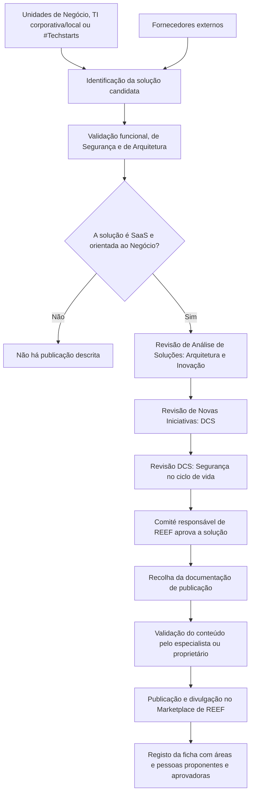

# Procedimiento REEF.500: Publicación de Soluciones en el Marketplace de REEF

## 1. Metadados do Documento
- **Arquivo de Origem:** `PRO.ENT.016 — PROCEDIMIENTO REEF 500 Publicacion de soluciones en marketplace`
- **Tipo de Documento:** Procedimento
- **Domínio / Sistema:** REEF Marketplace / Plataforma REEF / MAPFRE
- **Público-Alvo:** CIOs, Diretores, proprietários de soluções de Negócio, Unidades de Negócio, equipas de TI corporativas e locais
- **Data/Versão Identificada:** Aprovado em 29/05/2024; versão `V 0.1`

---

## 2. Resumo Executivo & Contexto de Negócio

O procedimento REEF.500 define o processo estabelecido para publicar soluções no Marketplace de REEF. A finalidade declarada é assegurar que cada solução disponibilizada no Marketplace de REEF cumpra os requisitos definidos antes da publicação.

O Marketplace de REEF é uma plataforma na qual as Unidades de Negócio podem consumir, em modalidade de serviço, soluções seguradoras oferecidas pela Plataforma REEF. O utilizador acede a um website interno para explorar soluções expostas, os seus objetivos, características, custos, modelos de integração e contactos.

O Marketplace de REEF visa reduzir custos, reforçar o alinhamento com a Plataforma Tecnológica Corporativa (PTC), tornar visíveis ativos locais, prevenir desenvolvimentos duplicados, evitar dispersão, facilitar a governação, identificar oportunidades de integração, harmonizar iniciativas locais e aumentar auditabilidade, rastreabilidade e versionamento.

Uma solução candidata pode ter origem interna ou externa. No âmbito interno, as soluções são criadas por áreas globais ou países; no âmbito externo, são apresentadas por fornecedores. A publicação depende de validação funcional, de Segurança e de Arquitetura, da natureza SaaS e da orientação ao Negócio, além da aprovação pelo comité responsável de REEF.

---

## 3. Arquitetura, Componentes & Tecnologias Envolvidas

O documento não descreve uma arquitetura técnica detalhada de aplicações, servidores, APIs, protocolos, bases de dados ou microsserviços. A arquitetura funcional identificada é composta pelo Marketplace de REEF, pelas Unidades de Negócio, pelas equipas de TI corporativas e locais, pelas áreas globais e países, pelos fornecedores e pelos órgãos de revisão e aprovação.

Componentes, equipas e referências citados:

- **Marketplace de REEF:** plataforma para consumo de soluções seguradoras em modalidade de serviço.
- **Plataforma REEF:** plataforma que oferece as soluções seguradoras publicadas.
- **Plataforma Tecnológica Corporativa (PTC):** referência corporativa para alinhamento tecnológico.
- **Comité de Arquitetura:** órgão cuja aprovação é requerida para publicação.
- **Arquitetura e Inovação:** responsável pela Revisão de Análise de Soluções.
- **DCS:** realiza Revisão de Novas Iniciativas e revisão adicional de Segurança no ciclo de vida.
- **ACT:** equipa cuja catalogação deve ser confirmada pelo respetivo equipa corporativa quando uma função for desempenhada por equipa de ACT.
- **#Techstarts de Innovación Tecnológica:** uma das fontes possíveis para identificação de soluções candidatas.
- **Website interno do Marketplace:** `https://internos.mapfre.com/marketplace-reef/`



> **Nota de Análise:** O documento apresenta o fluxo de publicação e os intervenientes de governação, mas não detalha contratos de integração, métodos HTTP, formatos JSON, mecanismos de autenticação, infraestrutura, ambientes técnicos ou ferramentas de deployment.

---

## 4. Regras de Negócio, Especificações Funcionais & Processos

### Objetivo do procedimento

O procedimento deve garantir que uma solução oferecida no Marketplace de REEF cumpre os requisitos estabelecidos para a publicação.

### Critérios obrigatórios para publicação

Uma solução deve cumprir os seguintes requisitos para estar publicada no Marketplace de REEF:

1. A solução deve ser uma solução **SaaS**.
2. A solução deve estar **orientada ao Negócio (REEF)**.
3. A solução deve ter sido **aprovada pelo Comité de Arquitetura**.
   - Deve existir Revisão de Análise de Soluções por Arquitetura e Inovação.
   - Deve existir Revisão de Novas Iniciativas por DCS.
   - Deve existir revisão adicional de DCS relativa a Segurança no ciclo de vida.
4. Quando uma função for desempenhada por uma equipa de **ACT**:
   - Deve ser verificado que a equipa corporativa concorda com a catalogação da solução.
   - A equipa local deve indicar os casos de uso que possui em curso, visando a aplicação em outras geografias.

### Origem das soluções

As soluções podem ter origem:

- Em Unidades de Negócio dos países.
- Em equipas de TI corporativas e locais.
- Nos Talleres `#Techstarts` de Innovación Tecnológica.
- Em áreas globais ou países, no caso de soluções internas.
- Em fornecedores, no caso de soluções externas.

### Processo de publicação

1. **Identificação da solução candidata**
   - A solução candidata é identificada a partir de Unidades de Negócio, equipas de TI corporativas e locais ou Talleres `#Techstarts` de Innovación Tecnológica.

2. **Validação da solução**
   - A solução deve cumprir requisitos funcionais.
   - A solução deve cumprir requisitos de Segurança.
   - A solução deve cumprir requisitos de Arquitetura.
   - A solução deve ser SaaS.
   - A solução deve estar orientada ao Negócio.

3. **Aprovação da solução**
   - O documento repete que a solução deve cumprir requisitos funcionais, de Segurança e de Arquitetura, além de ser SaaS e orientada ao Negócio.
   - O comité responsável de REEF analisa a informação associada e determina se a solução cumpre os requisitos necessários.

4. **Documentação da solução**
   - Deve ser reunida toda a documentação que será publicada no Marketplace de REEF.

5. **Validação do conteúdo**
   - O especialista ou proprietário da solução deve validar o conteúdo a publicar.

6. **Publicação e divulgação**
   - A solução é publicada e divulgada no Marketplace de REEF.
   - Todas as soluções ficam registadas numa ficha.
   - A ficha deve indicar as áreas e pessoas que forneceram a solução.
   - A ficha deve indicar as áreas e pessoas que participaram na aprovação da solução.

### Responsabilidades

- **Solicitante:** qualquer pessoa do grupo MAPFRE que tenha conhecimento da solução proposta.
- **Aprovador:** comité responsável de REEF, que analisa a informação associada e determina se os requisitos necessários são cumpridos.

---

## 5. Tabelas de Parâmetros, Ambientes e Estruturas de Dados

| Item / Parâmetro | Descrição / Função | Tipo / Valores / Formato | Ambiente / Observações |
| :--- | :--- | :--- | :--- |
| Referência documental | Identificador do procedimento | `PRO.ENT.016` | Documento REEF.500 |
| Nome do procedimento | Procedimento de publicação de soluções | `REEF.500` | Marketplace de REEF |
| Finalidade | Recolher o procedimento estabelecido para publicação de soluções | Procedimento corporativo | A publicação deve cumprir requisitos definidos |
| Plataforma | Consumo de soluções seguradoras em modalidade de serviço | Marketplace de REEF | Soluções oferecidas pela Plataforma REEF |
| URL do Marketplace | Endereço interno citado para o Marketplace | `https://internos.mapfre.com/marketplace-reef/` | Website interno |
| Origem interna | Soluções criadas por áreas globais ou países | Origem de solução | Interna |
| Origem externa | Soluções apresentadas por fornecedores | Origem de solução | Externa |
| Requisito SaaS | Solução deve ser disponibilizada como serviço | Obrigatório | Pré-requisito de publicação |
| Orientação ao Negócio | Solução deve estar orientada ao Negócio | Obrigatório | Associado a REEF |
| Aprovação arquitetural | Aprovação pelo Comité de Arquitetura | Obrigatório | Inclui revisão de Arquitetura e Inovação |
| Revisão de Novas Iniciativas | Revisão realizada por DCS | Obrigatório | Parte do processo de aprovação |
| Segurança no ciclo de vida | Revisão adicional por DCS | Obrigatório | Segurança |
| Regra para ACT | Confirmação da catalogação pela equipa corporativa | Condicional | Aplicável se a função for desempenhada por equipa ACT |
| Casos de uso locais | Casos em marcha devem ser indicados pela equipa local | Condicional | Aplicável a equipas ACT; visa outras geografias |
| Logo da solução | Identificação visual da solução | Documento / ativo gráfico | Obrigatório na documentação a publicar |
| Nome da solução | Identificação nominal da solução | Texto | Obrigatório na documentação a publicar |
| Descrição breve | Explica o que a solução faz e a funcionalidade principal | Texto | Obrigatório na documentação a publicar |
| Descrição longa | Detalha o que a solução faz, processos resolvidos e casos de uso reais | Texto | Pode incluir vídeo explicativo de utilizador de negócio |
| Integração | Descrição da camada de integração com outros sistemas | Texto | O documento não detalha formatos ou contratos |
| Vídeo ou capturas | Material visual da solução | Vídeo ou ecrãs de captura | Documentação a publicar |
| Faturação da ferramenta | Informação económica sobre uso e comercialização, quando aplicável | Informação económica | “Se procede” conforme texto original |
| Pessoas de contacto | Product Owner ou especialista na solução | Contacto | Para interessados na solução |
| Ficha de solução | Registo das áreas e pessoas que forneceram e aprovaram a solução | Registo | Criada após publicação |
| Solicitante | Pessoa que propõe a solução | Qualquer pessoa do grupo MAPFRE | Deve ter conhecimento da solução |
| Aprovador | Analisa e determina conformidade da solução | Comité responsável de REEF | Responsável pela aprovação |
| Versão | Registo de controlo de alterações | `V 0.1` | Três entradas apresentadas |
| Aprovação final identificada | Aprovação pelo Comité DST | `29/05/2024` | Entrada de controlo de alterações |

---

## 6. Bateria de Perguntas & Respostas para RAG (FAQ Sintético)

### P1: Qual é a finalidade do procedimento REEF.500?
**R:** O procedimento REEF.500 recolhe o processo estabelecido para publicar soluções no Marketplace de REEF. A finalidade é garantir que cada solução disponibilizada no Marketplace cumpre os requisitos definidos para publicação.

### P2: Que tipo de soluções podem ser publicadas no Marketplace de REEF?
**R:** A solução deve ser SaaS, estar orientada ao Negócio e cumprir requisitos funcionais, de Segurança e de Arquitetura. Além disso, a solução deve ter aprovação no processo de governação descrito, incluindo Comité de Arquitetura, Arquitetura e Inovação e DCS.

### P3: Quem pode solicitar a publicação de uma solução no Marketplace de REEF?
**R:** Qualquer pessoa do grupo MAPFRE que tenha conhecimento da solução proposta pode solicitar a publicação.

### P4: Quem aprova uma solução candidata para o Marketplace de REEF?
**R:** O comité responsável de REEF aprova a solução. Esse comité analisa a informação associada à solução e determina se a solução cumpre os requisitos necessários.

### P5: Quais revisões são citadas antes da publicação de uma solução?
**R:** O documento cita a Revisão de Análise de Soluções por Arquitetura e Inovação, a Revisão de Novas Iniciativas por DCS e uma revisão adicional de DCS relativa à Segurança no ciclo de vida. Também requer aprovação pelo Comité de Arquitetura.

### P6: O que acontece quando uma função é desempenhada por uma equipa de ACT?
**R:** Deve ser verificado se a equipa corporativa concorda com a catalogação da solução. A equipa local também deve indicar os casos de uso que tem em marcha para avaliar a aplicação da solução em outras geografias.

### P7: Que documentação deve ser preparada para publicar uma solução no Marketplace de REEF?
**R:** Deve ser preparado o logo, nome, descrição breve, descrição longa, descrição de integração com outros sistemas, vídeo ou capturas de ecrã, informação de faturação quando aplicável e pessoas de contacto, como o Product Owner ou especialista na solução.

### P8: Quem valida o conteúdo que será publicado no Marketplace de REEF?
**R:** O especialista ou proprietário da solução deve validar o conteúdo antes da publicação.

### P9: Que dados ficam registados após a publicação de uma solução?
**R:** Todas as soluções ficam registadas numa ficha que indica as áreas e pessoas que forneceram a solução e as áreas e pessoas que participaram na sua aprovação.

### P10: Quais são os objetivos de negócio do Marketplace de REEF?
**R:** Os objetivos são reduzir custos, reforçar o alinhamento com a Plataforma Tecnológica Corporativa, dar visibilidade a ativos locais, prevenir desenvolvimentos duplicados, evitar dispersão, facilitar a governação, identificar oportunidades de integração, harmonizar iniciativas locais e aumentar auditabilidade, rastreabilidade e versionamento.

### P11: Quais são as origens possíveis de uma solução candidata?
**R:** A solução pode ser proveniente das Unidades de Negócio dos países, de equipas de TI corporativas e locais, dos Talleres `#Techstarts` de Innovación Tecnológica, de áreas globais ou países no âmbito interno, ou de fornecedores no âmbito externo.

### P12: O documento especifica APIs, protocolos ou contratos de integração para as soluções?
**R:** Não. O documento exige uma descrição da camada de integração com outros sistemas, mas não especifica APIs, métodos HTTP, protocolos, formatos de payload, contratos JSON ou mecanismos de autenticação.

---

## 7. Glossário de Termos, Siglas & Conceitos-Chave

- **ACT:** Sigla citada para equipas cuja catalogação deve ser validada pelo respetivo equipa corporativa. O significado expandido não é informado no documento.
- **Comité de Arquitetura:** órgão cuja aprovação é exigida para publicação de soluções.
- **Comité DST:** comité indicado como aprovador na entrada de controlo de alterações de 29/05/2024. O significado expandido não é informado.
- **DCS:** entidade responsável pela Revisão de Novas Iniciativas e por uma revisão adicional de Segurança no ciclo de vida. O significado expandido não é informado.
- **Marketplace de REEF:** plataforma interna para explorar e consumir soluções seguradoras oferecidas pela Plataforma REEF em modalidade de serviço.
- **Product Owner:** pessoa de contacto da solução, juntamente com especialistas, para interessados na solução.
- **PTC:** Plataforma Tecnológica Corporativa.
- **REEF:** plataforma e contexto de governação associados ao Marketplace de REEF. O significado expandido da sigla não é informado.
- **SaaS:** “Software as a Service” ou solução “As a Service”, conforme referência do documento.
- **#Techstarts de Innovación Tecnológica:** fonte possível de soluções candidatas para publicação.

---

## 8. Notas Críticas, Riscos & Limitações

- O documento não detalha o significado expandido das siglas **REEF**, **DCS**, **ACT** e **DST**.
- O procedimento não descreve critérios objetivos de aprovação, evidências exigidas, responsáveis nominais, prazos, SLAs, estados de rejeição ou mecanismo de recurso.
- A exigência de requisitos funcionais, de Segurança e de Arquitetura é explícita, mas não são fornecidos checklists, matrizes de conformidade ou critérios de aceite mensuráveis.
- A descrição da integração é obrigatória como conteúdo de publicação, mas não são apresentados contratos técnicos, APIs, protocolos, formatos de dados ou padrões de autenticação.
- Não são descritos custos, modelo de faturação, processo de comercialização ou regras de precificação; apenas é solicitada informação económica “se procede”.
- O documento afirma que a solução deve ser SaaS e orientada ao Negócio, mas não define tecnicamente como esses critérios são comprovados.
- Não são informados mecanismos de atualização, despublicação, gestão de ciclo de vida, gestão de incidentes ou revisão periódica das soluções publicadas.
- A versão `V 0.1` aparece em três entradas de controlo de alterações, incluindo “Descripción”, “Primera revisión” e “Aprobación Comité DST”, sem diferenciação de subversões.

---

## 9. Conteúdo Bruto Estruturado (Referência Fiel)

```text
--- [PÁGINA 1 DE 3] ---

PROCEDIMIENTO REEF 500 Publicacion de soluciones en marketplace
REEF ORIGINAL
Referencia PRO.ENT.016
Fecha de aprobación 29/05/2024
Nombre (REEF.500) Procedimiento de publicación de Soluciones en el Marketplace de REEF
Propósito
Este documento tiene por nalidad recoger el procedimiento establecido para la publicación de soluciones en el Marketplace de REEF.
El procedimiento debe garantizar que la solución que se ofrece en el Marketplace cumple con los requisitos establecidos para tal n.
Alcance
El Marketplace es una plataforma donde las Unidades de Negocio podrán consumir, en modalidad de servicio, las soluciones
aseguradoras ofrecidas por la Plataforma REEF.
Está dirigido a los CIOs, Directores, y/o propietarios de las soluciones de Negocio.
Objetivo Marketplace REEF:
Reducción de costes
Potenciar alineamiento con la Plataforma Tecnológica Corporativa (PTC)
Dar visibilidad a activos ocultos en el ámbito local
Prevenir desarrollos duplicados
Evitar la dispersión
Facilitar el Gobierno
Detectar oportunidades de integración
Armonización de las iniciativas locales
Mayor auditabilidad, trazabilidad y versionado
Se accede a un website interno donde el usuario puede explorar las diferentes soluciones expuestas para conocer sus objetivos,
características, costes, modelos de integración e información de contacto.
Documentation / DOCUMENTACIÓN Reef
DOCUMENTACIÓN Reef
Mapfredocument
DOCUMENTACIÓN Reef
Owner
user:agonzalez_mapfre.com
Lifecycle
Approved Source
 / 
 VL
Buscar Inicio Soluciones Arquitecturas APIs Componentes Cloud Documentación Zeus Reef Ayuda
ES

--- [PÁGINA 2 DE 3] ---

Alcance
También puede proponer soluciones.
https://internos.mapfre.com/marketplace-reef/
El origen de las Soluciones puede ser interno o externo:
En el ámbito interno son soluciones creadas en las áreas globales o en los países.
En el ámbito externo, son soluciones aportadas por proveedores
Desarrollo
Existen unos requisitos que toda solución debe cumplir para estar publicada en el Marketplace de REEF. Estos son:
1.- Que sean soluciones SaaS
2.- Que estén orientadas a negocio (REEF)
3.- Que hayan sido aprobadas por el Comité de Arquitectura
Revisión de Análisis de Soluciones (Arquitectura e Innovación).
Revisión de Nuevas Iniciativas (DCS).
Adicionalmente, revisión DCS (Seguridad en el ciclo de vida).
4.- Si la función está desempeñada por un equipo de ACT:
vericar que el equipo corporativo está conforme con su catalogación
el equipo local debe indicar los casos de uso que tiene en marcha para ver su aplicación a otras geografías.
Los pasos a seguir para concluir que una solución “candidata” se pueda publicar en el Marketplace de REEF son:
Identicación de la solución candidata
La solución puede venir aportada por las unidades de Negocio de los países, por los equipos de las TI´s Corporativas y locales, o bien por
los Talleres #Techstarts de Innovación Tecnológica.
Validación de la solución
La solución debe cumplir con requisitos funcionales, de Seguridad y de Arquitectura. Además, debe ser SaaS (solución As a Service) y
orientada a Negocio.
Aprobación de la solución
La solución debe cumplir con requisitos funcionales, de Seguridad y de Arquitectura. Además, debe ser SaaS (solución As a Service) y
orientada a Negocio.
Documentación de la solución
Se debe recopilar toda aquella documentación que va a aparecer publicada en el Marketplace:
Logo de la solución para una mejor identicación.
Nombre de la solución.
Descripción breve: explicar qué hace la solución, cuál es su funcionalidad principal.
Descripción larga: explicar con más detalle qué hace la solución, qué procesos resuelve, casos de uso reales. Opcionalmente, se puede
aportar un vídeo explicativo por parte de un usuario de negocio.
Integración: Descripción de la capa de integración con otros sistemas.

--- [PÁGINA 3 DE 3] ---

Vídeo o pantallas de captura de la solución.
Facturación de la herramienta: información económica acerca del uso de la solución (como se comercializa, si procede)
Personas de contacto: El Product Owner o un experto en la solución para que se ponga en contacto con esa persona si alguien está
interesado.
Validación del contenido
El experto / propietario de la solución deberá validar el contenido a publicar.
Publicación de la solución en el Marketplace y divulgación
Todas las soluciones quedarán registradas (cha) indicando las áreas y personas que han proporcionado la solución, así como las áreas y
personas que han participado en la aprobación de la misma.
Responsabilidades
1. Quién solicita: cualquier persona del grupo Mapfre que tenga conocimiento de la solución que se propone.
2. Quién aprueba: el comité responsable de REEF, quien analiza la información asociada a la solución y determina que cumple con los
requisitos necesarios.
Control de Cambios, Revisiones y Aprobaciones
Versión Fecha Descripción Autor
V 0.1 Agosto 2023 Descripción Gobierno REEF
V 0.1 Agosto 2023 Primera revisión Gobierno REEF
V 0.1 29/05/2024 Aprobación Comité DST
```
