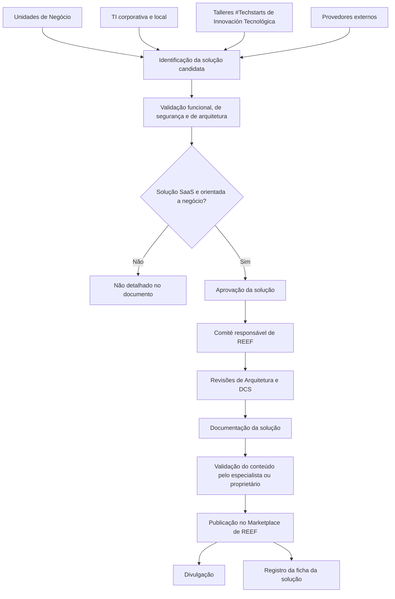

# Procedimento de Publicação de Soluções no Marketplace de REEF — PRO.ENT.016

## 1. Metadados do Documento
- **Arquivo de Origem:** Não informado no conteúdo extraído
- **Tipo de Documento:** Procedimento
- **Domínio / Sistema:** REEF Marketplace / Plataforma REEF
- **Público-Alvo:** CIOs, Diretores, proprietários de soluções de negócio, Unidades de Negócio, equipes de TI corporativas e locais, Arquitetura e Inovação, DCS e equipes ACT
- **Data/Versão Identificada:** V 0.1 — 29/05/2024; aprovação pelo Comité DST

---

## 2. Resumo Executivo & Contexto de Negócio

O documento PRO.ENT.016 define o procedimento para publicação de soluções no Marketplace de REEF. O propósito declarado é garantir que toda solução disponibilizada no Marketplace de REEF cumpra os requisitos previamente estabelecidos para publicação.

O Marketplace de REEF é apresentado como uma plataforma na qual as Unidades de Negócio podem consumir soluções de seguros oferecidas pela Plataforma REEF na modalidade de serviço. O acesso ocorre por um website interno que permite explorar soluções, conhecer objetivos, características, custos, modelos de integração e contatos, além de propor novas soluções.

O procedimento busca reduzir custos, aumentar o alinhamento com a Plataforma Tecnológica Corporativa (PTC), dar visibilidade a ativos locais, prevenir desenvolvimentos duplicados, evitar dispersão, facilitar governança, detectar oportunidades de integração, harmonizar iniciativas locais e ampliar auditabilidade, rastreabilidade e versionamento.

As soluções candidatas podem ter origem interna — áreas globais ou países — ou externa, quando fornecidas por provedores. A publicação depende de identificação, validação funcional, de segurança e de arquitetura, aprovação pelos responsáveis de REEF, preparação da documentação, validação do conteúdo e divulgação no Marketplace.

---

## 3. Arquitetura, Componentes & Tecnologias Envolvidas

| Componente / Entidade | Papel identificado no documento |
| :--- | :--- |
| Marketplace de REEF | Plataforma para consumo, consulta e proposição de soluções de seguros em modalidade de serviço. |
| Plataforma REEF | Plataforma que oferece as soluções disponibilizadas no Marketplace. |
| Plataforma Tecnológica Corporativa (PTC) | Referência corporativa cujo alinhamento é promovido pelo Marketplace de REEF. |
| Website interno do Marketplace | Canal de acesso para exploração, consulta de informações e proposta de soluções. |
| Comité responsável de REEF | Instância que analisa a solução e determina se ela atende aos requisitos necessários. |
| Comité de Arquitectura | Participa da aprovação mediante revisão de Análise de Soluções. |
| Arquitectura e Innovación | Área associada à revisão de Análise de Soluções. |
| DCS | Realiza revisão de Novas Iniciativas e revisão adicional de Segurança no ciclo de vida. |
| Equipe ACT | Equipe cuja catalogação deve ter concordância da equipe corporativa; a equipe local deve informar casos de uso em andamento. |
| Unidades de Negócio | Podem consumir soluções e aportar soluções candidatas. |
| TI corporativa e local | Pode aportar soluções candidatas para publicação. |
| Talleres #Techstarts de Innovación Tecnológica | Fonte potencial de soluções candidatas. |
| Provedores | Fonte externa de soluções candidatas. |
| Product Owner / especialista da solução | Pessoa de contato e responsável pela validação do conteúdo a publicar. |



**Nota de Análise:** O documento não detalha integrações técnicas, protocolos, APIs, métodos HTTP, contratos JSON, infraestrutura, autenticação, ambientes, URLs adicionais ou tecnologias de implementação do Marketplace de REEF.

---

## 4. Regras de Negócio, Especificações Funcionais & Processos

### Requisitos obrigatórios para publicação

Toda solução publicada no Marketplace de REEF deve cumprir os seguintes requisitos:

1. A solução deve ser uma solução **SaaS**.
2. A solução deve ser orientada a negócio no contexto de **REEF**.
3. A solução deve ter aprovação do **Comité de Arquitectura**, incluindo:
   - Revisão de Análise de Soluções por Arquitectura e Innovación.
   - Revisão de Novas Iniciativas por DCS.
   - Revisão adicional de DCS relacionada à Segurança no ciclo de vida.
4. Quando a função for desempenhada por uma equipe **ACT**:
   - Deve-se verificar se a equipe corporativa concorda com a catalogação.
   - A equipe local deve indicar os casos de uso em andamento para avaliar aplicação em outras geografias.

### Processo de publicação

1. **Identificação da solução candidata**
   - A solução pode ser aportada pelas Unidades de Negócio dos países.
   - A solução pode ser aportada pelas equipes de TI corporativas e locais.
   - A solução pode ser aportada pelos Talleres #Techstarts de Innovación Tecnológica.

2. **Validação da solução**
   - A solução deve cumprir requisitos funcionais.
   - A solução deve cumprir requisitos de Segurança.
   - A solução deve cumprir requisitos de Arquitetura.
   - A solução deve ser SaaS, ou seja, uma solução “As a Service”.
   - A solução deve ser orientada a Negócio.

3. **Aprovação da solução**
   - O conteúdo repete que a solução deve cumprir requisitos funcionais, de Segurança e de Arquitetura.
   - A solução aprovada deve ser SaaS e orientada a Negócio.
   - O comité responsável de REEF analisa a informação associada e determina se os requisitos necessários foram atendidos.

4. **Documentação da solução**
   - Deve-se reunir toda a documentação que será publicada no Marketplace de REEF.
   - A documentação deve incluir identificação, descrições, integração, conteúdo visual, informações econômicas quando aplicável e contatos.

5. **Validação do conteúdo**
   - O especialista ou proprietário da solução deve validar o conteúdo antes da publicação.

6. **Publicação e divulgação**
   - A solução é publicada no Marketplace de REEF.
   - O procedimento prevê a divulgação da solução publicada.

7. **Registro da solução**
   - Todas as soluções devem possuir uma ficha de registro.
   - A ficha deve identificar áreas e pessoas que forneceram a solução.
   - A ficha deve identificar áreas e pessoas que participaram da aprovação.

### Responsabilidades

| Papel | Responsabilidade |
| :--- | :--- |
| Solicitante | Qualquer pessoa do grupo Mapfre que tenha conhecimento da solução proposta. |
| Aprovador | Comité responsável de REEF, que analisa as informações associadas à solução e determina se ela atende aos requisitos necessários. |
| Especialista / proprietário da solução | Valida o conteúdo que será publicado. |
| Product Owner / especialista da solução | Atua como pessoa de contato para interessados na solução. |
| Equipe corporativa ACT | Deve concordar com a catalogação quando a função for desempenhada por uma equipe ACT. |
| Equipe local ACT | Deve informar os casos de uso em andamento para análise de aplicação em outras geografias. |

---

## 5. Tabelas de Parâmetros, Ambientes e Estruturas de Dados

| Item / Parâmetro | Descrição / Função | Tipo / Valores / Formato | Ambiente / Observações |
| :--- | :--- | :--- | :--- |
| Código do procedimento | Identificador documental do procedimento de publicação. | `PRO.ENT.016` | Referência apresentada na página 1. |
| Nome do procedimento | Nome oficial do procedimento. | `(REEF.500) Procedimiento de publicación de Soluciones en el Marketplace de REEF` | Referência apresentada na página 1. |
| Data de aprovação | Data de aprovação identificada. | `29/05/2024` | Também associada à aprovação pelo Comité DST no controle de mudanças. |
| Marketplace de REEF | Plataforma para consumo de soluções de seguros em modalidade de serviço. | Plataforma / Marketplace | Destinada a Unidades de Negócio. |
| URL interna | Endereço de acesso ao Marketplace de REEF. | `https://internos.mapfre.com/marketplace-reef/` | Website interno citado no documento. |
| Modelo obrigatório da solução | Condição para publicação. | SaaS / As a Service | A solução deve ser SaaS. |
| Orientação obrigatória | Condição para publicação. | Orientada a Negócio / REEF | Requisito explícito para publicação. |
| Revisão de arquitetura | Avaliação necessária para publicação. | Revisão de Análise de Soluções | Associada a Arquitectura e Innovación. |
| Revisão DCS | Avaliação necessária para publicação. | Revisão de Novas Iniciativas | Inclui revisão adicional de Segurança no ciclo de vida. |
| Catalogação ACT | Validação adicional para funções desempenhadas por equipe ACT. | Concordância da equipe corporativa | A equipe local deve informar casos de uso em andamento. |
| Logo da solução | Material de identificação para publicação. | Logo | Obrigatório como item de documentação. |
| Nome da solução | Identificação da solução publicada. | Texto | Obrigatório como item de documentação. |
| Descrição breve | Explica o que a solução faz e sua funcionalidade principal. | Texto descritivo | Obrigatório como item de documentação. |
| Descrição longa | Detalha a solução, processos resolvidos e casos de uso reais. | Texto descritivo; vídeo opcional | Pode incluir vídeo explicativo por usuário de negócio. |
| Integração | Descrição da camada de integração com outros sistemas. | Texto descritivo | O documento não detalha padrões ou contratos de integração. |
| Vídeo ou capturas de tela | Material visual da solução. | Vídeo ou imagens | Item previsto na documentação. |
| Faturamento da ferramenta | Informação econômica sobre uso e comercialização. | Informação econômica | Aplicável quando houver comercialização. |
| Pessoas de contato | Referência para interessados na solução. | Product Owner ou especialista | Deve permitir contato de interessados. |
| Ficha da solução | Registro de proveniência e aprovação. | Registro documental | Identifica áreas e pessoas que forneceram e aprovaram a solução. |
| Origem interna | Fonte possível de uma solução. | Áreas globais ou países | Soluções criadas internamente. |
| Origem externa | Fonte possível de uma solução. | Provedores | Soluções aportadas por fornecedores. |

### Controle de mudanças, revisões e aprovações

| Versão | Data | Descrição | Autor / Instância identificada |
| :--- | :--- | :--- | :--- |
| V 0.1 | Agosto 2023 | Descripción Gobierno REEF | Gobierno REEF |
| V 0.1 | Agosto 2023 | Primera revisión Gobierno REEF | Gobierno REEF |
| V 0.1 | 29/05/2024 | Aprobación Comité DST | Comité DST |

---

## 6. Bateria de Perguntas & Respostas para RAG (FAQ Sintético)

### P1: Qual é o propósito do procedimento PRO.ENT.016?
**R:** O procedimento PRO.ENT.016 estabelece o processo para publicação de soluções no Marketplace de REEF. O objetivo é garantir que cada solução disponibilizada no Marketplace de REEF cumpra os requisitos definidos para publicação.

### P2: O que é o Marketplace de REEF?
**R:** O Marketplace de REEF é uma plataforma em que Unidades de Negócio podem consumir, na modalidade de serviço, soluções de seguros oferecidas pela Plataforma REEF. O Marketplace possui um website interno para explorar soluções, consultar objetivos, características, custos, modelos de integração e informações de contato, além de propor soluções.

### P3: Quem pode propor uma solução para o Marketplace de REEF?
**R:** Qualquer pessoa do grupo Mapfre que tenha conhecimento da solução proposta pode solicitar a publicação. As soluções candidatas podem ser aportadas por Unidades de Negócio dos países, equipes de TI corporativas e locais ou pelos Talleres #Techstarts de Innovación Tecnológica.

### P4: Quais requisitos uma solução precisa cumprir para ser publicada no Marketplace de REEF?
**R:** A solução deve ser SaaS, orientada a negócio e cumprir requisitos funcionais, de Segurança e de Arquitetura. Também deve passar pelas revisões de Análise de Soluções de Arquitectura e Innovación, de Novas Iniciativas da DCS e pela revisão adicional da DCS relativa à Segurança no ciclo de vida.

### P5: Qual é o papel do comité responsável de REEF no processo?
**R:** O comité responsável de REEF atua como aprovador. O comité analisa as informações associadas à solução candidata e determina se a solução atende aos requisitos necessários para publicação no Marketplace de REEF.

### P6: Quais documentos e informações devem ser preparados para publicar uma solução?
**R:** A documentação deve incluir logo, nome, descrição breve, descrição longa, descrição da integração com outros sistemas, vídeo ou capturas de tela, informações de faturamento quando aplicável e pessoas de contato. A descrição longa pode incluir um vídeo explicativo fornecido por um usuário de negócio.

### P7: Quem valida o conteúdo antes da publicação?
**R:** O especialista ou proprietário da solução deve validar o conteúdo a ser publicado no Marketplace de REEF antes da publicação e divulgação.

### P8: O que deve acontecer quando uma função é desempenhada por uma equipe ACT?
**R:** Deve-se verificar se a equipe corporativa concorda com a catalogação. Além disso, a equipe local deve indicar os casos de uso que possui em andamento para avaliar a aplicação da solução em outras geografias.

### P9: Quais informações são registradas na ficha de uma solução publicada?
**R:** A ficha deve registrar as áreas e pessoas que forneceram a solução, bem como as áreas e pessoas que participaram da aprovação da solução.

### P10: Quais são as origens possíveis das soluções do Marketplace de REEF?
**R:** As soluções podem ter origem interna ou externa. Soluções internas são criadas por áreas globais ou por países. Soluções externas são aportadas por provedores.

### P11: Quais benefícios corporativos o Marketplace de REEF pretende gerar?
**R:** O Marketplace de REEF busca reduzir custos, promover alinhamento com a Plataforma Tecnológica Corporativa, dar visibilidade a ativos ocultos locais, prevenir desenvolvimentos duplicados, evitar dispersão, facilitar governança, detectar oportunidades de integração, harmonizar iniciativas locais e elevar auditabilidade, rastreabilidade e versionamento.

### P12: Qual URL é informada para acesso ao Marketplace de REEF?
**R:** O documento informa o website interno `https://internos.mapfre.com/marketplace-reef/` como endereço de acesso ao Marketplace de REEF.

---

## 7. Glossário de Termos, Siglas & Conceitos-Chave

- **ACT:** Sigla citada para uma equipe cuja catalogação exige concordância da equipe corporativa e indicação, pela equipe local, dos casos de uso em andamento. O significado expandido da sigla não é informado.
- **As a Service:** Modelo citado para caracterizar soluções SaaS.
- **Comité de Arquitectura:** Instância associada à aprovação mediante revisão de Análise de Soluções.
- **Comité DST:** Instância identificada no controle de mudanças como responsável pela aprovação em 29/05/2024.
- **DCS:** Entidade responsável pela revisão de Novas Iniciativas e por revisão adicional de Segurança no ciclo de vida. O significado expandido da sigla não é informado.
- **Marketplace de REEF:** Plataforma interna para consumo, consulta e proposição de soluções de seguros da Plataforma REEF.
- **Product Owner:** Pessoa de contato da solução, juntamente com o especialista, para atender interessados.
- **PTC:** Plataforma Tecnológica Corporativa.
- **REEF:** Plataforma associada ao Marketplace de REEF e ao consumo de soluções de seguros. O significado expandido da sigla não é informado.
- **SaaS:** Solução “As a Service”, requisito obrigatório para publicação no Marketplace de REEF.
- **Talleres #Techstarts de Innovación Tecnológica:** Fonte potencial de soluções candidatas.
- **Unidades de Negócio:** Unidades que podem consumir soluções e aportar soluções candidatas.

---

## 8. Notas Críticas, Riscos & Limitações

- O documento exige validações funcionais, de Segurança e de Arquitetura, mas não especifica critérios mensuráveis, checklists, evidências, prazos, responsáveis detalhados ou critérios de reprovação.
- O documento menciona revisão de Segurança no ciclo de vida pela DCS, porém não descreve controles técnicos, avaliações de risco, mecanismos de autenticação, testes de segurança ou requisitos de conformidade.
- A descrição da “camada de integração com outros sistemas” é obrigatória na documentação, mas não há detalhamento de APIs, protocolos, contratos, tecnologias, padrões ou mecanismos de integração.
- O procedimento não descreve o fluxo para solução rejeitada, pendente, incompleta, despublicada, substituída ou com conteúdo desatualizado.
- A numeração de versão apresentada no controle de mudanças permanece como `V 0.1` em todas as três entradas, incluindo aprovação de 29/05/2024.
- O significado expandido das siglas REEF, DCS, ACT e DST não é informado no texto.
- Não são identificados SLAs, responsáveis operacionais pela publicação, workflow de aprovação, ferramenta de registro, campos completos da ficha ou processo de auditoria.
- A página 4 é identificada como página em branco ou contendo apenas elementos visuais/imagem; não há conteúdo textual recuperável adicional.

---

## 9. Conteúdo Bruto Estruturado (Referência Fiel)

```text
--- [PÁGINA 1 DE 4] ---

REFERENCIA
PRO.ENT.016
FECHA DE APROBACIÓN
29/05/2024
NOMBRE
(REEF.500) Procedimiento de publicación de Soluciones en el Marketplace de REEF
PROPÓSITO
Este documento tiene por finalidad recoger el procedimiento establecido para la publicación de soluciones en el Marketplace de REEF.
El procedimiento debe garantizar que la solución que se ofrece en el Marketplace cumple con los requisitos establecidos para tal fin.
| ALCANCE | | :--- | |El Marketplace es una plataforma donde las Unidades de Negocio podrán consumir, en modalidad de servicio, las
soluciones aseguradoras ofrecidas por la Plataforma REEF.
Está dirigido a los CIOs, Directores, y/o propietarios de las soluciones de Negocio. Objetivo Marketplace REEF:
Reducción de costes
Potenciar alineamiento con la Plataforma Tecnológica Corporativa (PTC)
Dar visibilidad a activos ocultos en el ámbito local
Prevenir desarrollos duplicados
Evitar la dispersión
Facilitar el Gobierno
Detectar oportunidades de integración
Armonización de las iniciativas locales
Mayor auditabilidad, trazabilidad y versionado
Se accede a un website interno donde el usuario puede explorar las diferentes soluciones expuestas para conocer sus objetivos,
características, costes, modelos de integración e información de contacto. También puede proponer soluciones.
https://internos.mapfre.com/marketplace-reef/ El origen de las Soluciones puede ser interno o externo:
En el ámbito interno son soluciones creadas en las áreas globales o en los países. En el ámbito externo, son soluciones aportadas por
proveedores. |
DESARROLLO
Documentation / DOCUMENTACIÓN Reef
DOCUMENTACIÓN Reef
Mapfredocument
DOCUMENTACIÓN Reef
Owner
user:agonzalez_mapfre.com
Lifecycle
Approved Source
 /
VL
Buscar Inicio Soluciones Arquitecturas APIs Componentes Cloud Documentación Zeus Reef Ayuda
ES

--- [PÁGINA 2 DE 4] ---

Existen unos requisitos que toda solución debe cumplir para estar publicada en el Marketplace de REEF. Estos son:
1. Que sean soluciones SaaS>
2. Que estén orientadas a negocio (REEF)>
3. Que hayan sido aprobadas por el Comité de Arquitectura - Revisión de Análisis de Soluciones (Arquitectura e Innovación). - Revisión de
Nuevas Iniciativas (DCS). - Adicionalmente, revisión DCS (Seguridad en el ciclo de vida).
4. Si la función está desempeñada por un equipo de ACT: - verificar que el equipo corporativo está conforme con su catalogación - el equipo
local debe indicar los casos de uso que tiene en marcha para ver su aplicación a otras geografías.
Los pasos a seguir para concluir que una solución “candidata” se pueda publicar en el Marketplace de REEF son:
Identificación de la solución candidata
La solución puede venir aportada por las unidades de Negocio de los países, por los equipos de las TI´s Corporativas y locales, o bien por los
Talleres #Techstarts de Innovación Tecnológica.
Validación de la solución
La solución debe cumplir con requisitos funcionales, de Seguridad y de Arquitectura. Además, debe ser SaaS (solución As a Service) y
orientada a Negocio.
Aprobación de la solución
La solución debe cumplir con requisitos funcionales, de Seguridad y de Arquitectura. Además, debe ser SaaS (solución As a Service) y
orientada a Negocio.
Documentación de la solución
Se debe recopilar toda aquella documentación que va a aparecer publicada en el Marketplace: - Logo de la solución para una mejor
identificación. - Nombre de la solución. - Descripción breve: explicar qué hace la solución, cuál es su funcionalidad principal. - Descripción
larga: explicar con más detalle qué hace la solución, qué procesos resuelve, casos de uso reales. Opcionalmente, se puede aportar un vídeo
explicativo por parte de un usuario de negocio. - Integración: Descripción de la capa de integración con otros sistemas. - Vídeo o pantallas de
captura de la solución. - Facturación de la herramienta: información económica acerca del uso de la solución (como se comercializa, si
procede) - Personas de contacto: El Product Owner o un experto en la solución para que se ponga en contacto con esa persona si alguien
está interesado.
Validación del contenido
El experto / propietario de la solución deberá validar el contenido a publicar.
Publicación de la solución en el Marketplace y divulgación

--- [PÁGINA 3 DE 4] ---

Todas las soluciones quedarán registradas (ficha) indicando las áreas y personas que han proporcionado la solución, así como las áreas y
personas que han participado en la aprobación de la misma.
RESPONSABILIDADES
1. Quién solicita: cualquier persona del grupo Mapfre que tenga conocimiento de la solución que se propone.
2. Quién aprueba: el comité responsable de REEF, quien analiza la información asociada a la solución y determina que cumple con los
requisitos necesarios.
CONTROL DE CAMBIOS, REVISIONES Y APROBACIONES
VERSIÓN FECHA DESCRIPCIÓN AUTOR
V 0.1 Agosto 2023 Descripción Gobierno REEF
V 0.1 Agosto 2023 Primera revisión Gobierno REEF
V 0.1 29/05/2024 Aprobación Comité DST

--- [PÁGINA 4 DE 4] ---

[Página em branco ou apenas elementos visuais/imagem]
```
