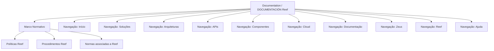

# Documentação Reef — Marco Normativo, Políticas, Procedimentos e Normas

## 1. Metadados do Documento
- **Arquivo de Origem:** `Não identificado no conteúdo fornecido`
- **Tipo de Documento:** `Não identificado no conteúdo fornecido`
- **Domínio / Sistema:** `Reef / Mapfredocument`
- **Público-Alvo:** `Usuários da documentação Reef; público específico não identificado`
- **Data/Versão Identificada:** `Não identificada`

---

## 2. Resumo Executivo & Contexto de Negócio

O conteúdo apresenta a área **Marco Normativo** da documentação Reef. Essa área reúne normas, procedimentos e políticas associados ao domínio Reef, organizando os três tipos de conteúdo como categorias explícitas de consulta.

A categoria **Políticas** é descrita como o espaço reservado às distintas políticas Reef. A categoria **Procedimentos** é indicada como o local em que os procedimentos Reef podem ser encontrados. A categoria **Normas** contém as normas associadas a Reef.

O texto também registra elementos de uma interface de documentação identificada como **Documentation / DOCUMENTACIÓN Reef**, com navegação para itens como Início, Soluções, Arquiteturas, APIs, Componentes, Cloud, Documentação, Zeus, Reef e Ajuda.

Não há detalhamento adicional sobre o conteúdo das políticas, procedimentos ou normas. O material não descreve regras operacionais, fluxos de aprovação, contratos de API, tecnologias, ambientes ou responsáveis técnicos além do campo de proprietário exibido.

---

## 3. Arquitetura, Componentes & Tecnologias Envolvidas

Os elementos identificados são:

| Componente / Elemento | Descrição sustentada pelo conteúdo |
| :--- | :--- |
| Reef | Domínio associado ao Marco Normativo, às políticas, aos procedimentos e às normas. |
| Marco Normativo | Seção que contém normas, procedimentos e políticas Reef. |
| Políticas | Área reservada às distintas políticas Reef. |
| Procedimentos | Local indicado para consulta dos procedimentos Reef. |
| Normas | Área que contém normas associadas a Reef. |
| Documentation / DOCUMENTACIÓN Reef | Identificação da área ou portal de documentação Reef. |
| Mapfredocument | Termo exibido no conteúdo, sem explicação adicional. |
| Zeus | Item disponível na navegação, sem explicação adicional. |
| Owner | Campo apresentado com o valor `user:agonzalez_mapfre.com`. |
| Lifecycle | Campo apresentado com o valor `Approved Source`. |
| VL | Termo exibido junto ao ciclo de vida, sem definição adicional. |



> **Nota de Análise:** O conteúdo não detalha arquitetura de software, integrações, microsserviços, tecnologias, protocolos ou fluxos de dados.

---

## 4. Regras de Negócio, Especificações Funcionais & Processos

1. O apartado **Marco Normativo** contém as normas, os procedimentos e as políticas de Reef.
2. A seção **Políticas** é reservada às distintas políticas Reef.
3. A seção **Procedimentos** é o local onde os procedimentos Reef podem ser encontrados.
4. A seção **Normas** reúne as normas associadas a Reef.
5. A interface apresentada disponibiliza navegação para: Buscar, Início, Soluções, Arquiteturas, APIs, Componentes, Cloud, Documentação, Zeus, Reef e Ajuda.
6. O idioma exibido na interface é `ES`.
7. O conteúdo mostra o proprietário como `user:agonzalez_mapfre.com`.
8. O ciclo de vida exibido é `Approved Source`, acompanhado do termo `VL`.

> **Nota de Análise:** O documento não especifica critérios de aprovação, regras de versionamento, etapas de publicação, permissões de acesso ou procedimentos operacionais para as categorias apresentadas.

---

## 5. Tabelas de Parâmetros, Ambientes e Estruturas de Dados

| Item / Parâmetro | Descrição / Função | Tipo / Valores / Formato | Ambiente / Observações |
| :--- | :--- | :--- | :--- |
| Marco Normativo | Área que reúne normas, procedimentos e políticas Reef. | Seção documental | Associada a Reef. |
| Políticas | Espaço reservado às distintas políticas Reef. | Categoria documental | Sem políticas individuais detalhadas. |
| Procedimentos | Local de consulta dos procedimentos Reef. | Categoria documental | Sem procedimentos individuais detalhados. |
| Normas | Área que contém normas associadas a Reef. | Categoria documental | Sem normas individuais detalhadas. |
| Owner | Proprietário exibido para a documentação. | `user:agonzalez_mapfre.com` | Campo exibido na interface. |
| Lifecycle | Estado de ciclo de vida exibido. | `Approved Source` | O significado operacional não é detalhado. |
| VL | Termo exibido junto ao lifecycle. | `VL` | Sigla ou marcador sem definição no conteúdo. |
| Idioma | Idioma indicado na interface. | `ES` | Interface apresentada em espanhol. |
| Navegação | Itens de acesso apresentados no portal. | Buscar; Início; Soluções; Arquiteturas; APIs; Componentes; Cloud; Documentação; Zeus; Reef; Ajuda | Não há descrição funcional de cada item. |
| Mapfredocument | Termo exibido na área de documentação. | `Mapfredocument` | Sem explicação adicional. |

---

## 6. Bateria de Perguntas & Respostas para RAG (FAQ Sintético)

### P1: Qual é o objetivo da seção Marco Normativo em Reef?
**R:** A seção Marco Normativo reúne as normas, os procedimentos e as políticas associados a Reef.

### P2: Onde estão localizadas as políticas Reef?
**R:** As políticas Reef estão na categoria **Políticas**, descrita como o apartado reservado às distintas políticas Reef.

### P3: Onde um usuário deve procurar procedimentos Reef?
**R:** Um usuário deve consultar a categoria **Procedimentos**, descrita como o local onde é possível encontrar os procedimentos Reef.

### P4: O que a seção Normas contém?
**R:** A seção **Normas** contém as normas associadas a Reef. O conteúdo fornecido não lista normas específicas.

### P5: Quais são as três categorias disponíveis dentro do Marco Normativo?
**R:** As três categorias apresentadas no Marco Normativo são **Políticas**, **Procedimentos** e **Normas**.

### P6: Quem é exibido como proprietário da documentação Reef?
**R:** O campo **Owner** apresenta o valor `user:agonzalez_mapfre.com`.

### P7: Qual é o ciclo de vida mostrado para a documentação?
**R:** O campo **Lifecycle** mostra o valor `Approved Source`. O documento não explica os critérios, estados anteriores ou implicações operacionais desse ciclo de vida.

### P8: Qual idioma é indicado na interface da documentação Reef?
**R:** A interface apresenta o código de idioma `ES`, e os textos exibidos estão em espanhol.

### P9: Quais itens de navegação aparecem na documentação Reef?
**R:** Os itens apresentados são Buscar, Início, Soluções, Arquiteturas, APIs, Componentes, Cloud, Documentação, Zeus, Reef e Ajuda.

### P10: O documento descreve APIs, métodos HTTP ou contratos técnicos de Reef?
**R:** Não. Embora exista um item de navegação chamado **APIs**, o conteúdo fornecido não descreve APIs, métodos HTTP, endpoints, contratos JSON ou integrações.

---

## 7. Glossário de Termos, Siglas & Conceitos-Chave

- **Reef:** Domínio ou sistema ao qual estão associadas as políticas, os procedimentos e as normas apresentados.
- **Marco Normativo:** Seção que reúne normas, procedimentos e políticas Reef.
- **Políticas:** Apartado reservado às distintas políticas Reef.
- **Procedimentos:** Local onde podem ser encontrados os procedimentos Reef.
- **Normas:** Conteúdo normativo associado a Reef.
- **Owner:** Campo que identifica o proprietário exibido como `user:agonzalez_mapfre.com`.
- **Lifecycle:** Campo de ciclo de vida apresentado com o valor `Approved Source`.
- **Approved Source:** Valor exibido para o campo Lifecycle; não possui definição adicional no conteúdo.
- **VL:** Termo exibido junto ao Lifecycle; significado não identificado.
- **ES:** Código de idioma exibido na interface.
- **Mapfredocument:** Termo exibido na documentação; significado não detalhado.
- **Zeus:** Item de navegação exibido; significado não detalhado.

---

## 8. Notas Críticas, Riscos & Limitações

- O conteúdo fornecido é limitado a uma única página ou trecho de interface documental.
- Não foram identificados nome de arquivo, data, versão, autor documental ou classificação formal do documento.
- Não há descrição de políticas, procedimentos ou normas individuais.
- Não há regras de negócio detalhadas, critérios de validação, cálculos, parâmetros técnicos ou matrizes de responsabilidade.
- Não há detalhes sobre APIs, componentes, integrações, infraestrutura, ambientes, URLs, logs, tecnologias ou contratos de dados.
- Os termos `VL`, `Mapfredocument` e `Zeus` são exibidos, mas não possuem definição no conteúdo.
- **Nota de Análise:** O conteúdo apresenta a estrutura de navegação e categorização da documentação Reef, porém não fornece detalhamento adicional para implementação, operação ou governança técnica.

---

## 9. Conteúdo Bruto Estruturado (Referência Fiel)

```text
--- [PÁGINA 1 DE 1] ---

MARCO NORMATIVO
 En este apartado se encuentra todas las normas, procedimientos y políticas de Reef
Políticas
Procedimientos
Normas
POLÍTICAS
Este es el apartado reservado a las distintas políticas Reef.
PROCEDIMIENTOS
Lugar donde podrás encontrar los procedimientos de Reef.
NORMAS
Aquí se encuentran las normas asociadas a Reef.
Documentation / DOCUMENTACIÓN Reef
DOCUMENTACIÓN Reef
Mapfredocument
DOCUMENTACIÓN Reef
Owner
user:agonzalez_mapfre.com
Lifecycle
Approved Source
 / 
 VL
Buscar Inicio Soluciones Arquitecturas APIs Componentes Cloud Documentación Zeus Reef Ayuda
ES
```
