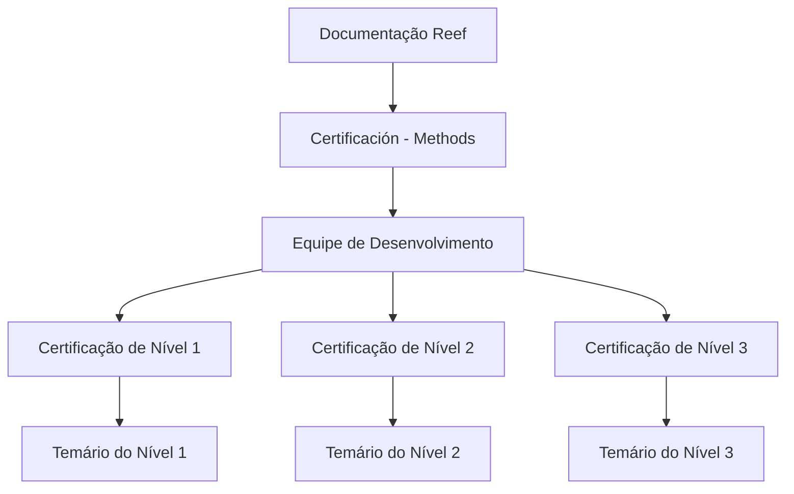

# Certificación Methods — Equipo de Desarrollo y Documentación Reef

## 1. Metadados do Documento
- **Arquivo de Origem:** Não identificado no conteúdo fornecido
- **Tipo de Documento:** Procedimento / documentação de certificação
- **Domínio / Sistema:** Methods, Reef e Mapfredocument
- **Público-Alvo:** Equipe de Desenvolvimento
- **Data/Versão Identificada:** Não identificada

---

## 2. Resumo Executivo & Contexto de Negócio

O documento apresenta a área de certificação do **Methods** destinada à **Equipe de Desenvolvimento**. O objetivo explícito é disponibilizar os conteúdos programáticos necessários para certificação em três níveis distintos.

A estrutura de certificação está dividida em **Nível 1**, **Nível 2** e **Nível 3**. Para cada nível, o documento informa que existe um temário que deve ser conhecido para obtenção da respectiva certificação.

O conteúdo está referenciado dentro de uma área de documentação denominada **Reef**, associada a **Mapfredocument**. A interface exibida também contém navegação para soluções, arquiteturas, APIs, componentes, cloud, documentação, Zeus, Reef e ajuda.

Não há detalhamento dos temas, critérios de aprovação, método de avaliação, duração, pré-requisitos, responsáveis pela certificação ou relações de dependência entre os níveis. O documento apenas estabelece a existência dos três níveis e seus respectivos temários.

---

## 3. Arquitetura, Componentes & Tecnologias Envolvidas

Os elementos identificados são:

- **Methods:** Contexto da certificação apresentada.
- **Equipe de Desenvolvimento:** Público para o qual os temários de certificação são destinados.
- **Reef:** Área ou sistema de documentação em que o conteúdo é disponibilizado.
- **Mapfredocument:** Nome apresentado na interface de documentação.
- **Zeus:** Item de navegação citado, sem detalhamento funcional.
- **Owner:** `user:agonzalez_mapfre.com`
- **Lifecycle:** `Approved`
- **Source:** `VL`



> **Nota de Análise:** O documento não descreve arquitetura de software, integrações, APIs, tecnologias de implementação ou fluxos de dados entre Reef, Mapfredocument, Methods e Zeus.

---

## 4. Regras de Negócio, Especificações Funcionais & Processos

1. A certificação é direcionada à **Equipe de Desenvolvimento**.
2. A estrutura de certificação possui três níveis:
   - Certificação de Nível 1.
   - Certificação de Nível 2.
   - Certificação de Nível 3.
3. Cada nível possui um temário próprio que deve ser conhecido para obtenção da certificação correspondente:
   - O temário do Nível 1 é necessário para obter o primeiro nível de certificação Methods.
   - O temário do Nível 2 é necessário para obter o segundo nível de certificação Methods.
   - O temário do Nível 3 é necessário para obter o terceiro nível de certificação Methods.
4. O documento não informa se a conclusão do Nível 1 é pré-requisito para o Nível 2, nem se o Nível 2 é pré-requisito para o Nível 3.
5. O documento não informa os conteúdos efetivos dos temários, mecanismos de avaliação, notas mínimas, formatos de prova ou critérios de aprovação.
6. O conteúdo possui status de ciclo de vida **Approved**.

---

## 5. Tabelas de Parâmetros, Ambientes e Estruturas de Dados

| Item / Parâmetro | Descrição / Função | Tipo / Valores / Formato | Ambiente / Observações |
| :--- | :--- | :--- | :--- |
| Certificación - Methods | Área de certificação destinada ao time de desenvolvimento | Documentação de certificação | Apresentada em Reef |
| Certificação de Nível 1 | Primeiro nível de certificação Methods | Nível de certificação | Exige conhecimento do temário correspondente |
| Certificação de Nível 2 | Segundo nível de certificação Methods | Nível de certificação | Exige conhecimento do temário correspondente |
| Certificação de Nível 3 | Terceiro nível de certificação Methods | Nível de certificação | Exige conhecimento do temário correspondente |
| Reef | Área identificada como documentação | Sistema ou área de documentação | Também aparece como item de navegação |
| Mapfredocument | Nome exibido na interface | Sistema ou identificação documental | Não há descrição adicional |
| Owner | Proprietário registrado do conteúdo | `user:agonzalez_mapfre.com` | Valor literal exibido |
| Lifecycle | Situação do ciclo de vida documental | `Approved` | Valor literal exibido |
| Source | Origem registrada do conteúdo | `VL` | Significado não detalhado |
| Idioma | Idioma exibido na navegação | `ES` | Interface em espanhol |

---

## 6. Bateria de Perguntas & Respostas para RAG (FAQ Sintético)

### P1: Qual é o objetivo da documentação “Certificación - Methods - Equipo Desarrollo”?
**R:** A documentação apresenta os temários necessários para os níveis de certificação Methods destinados à Equipe de Desenvolvimento.

### P2: Quantos níveis de certificação Methods são mencionados?
**R:** São mencionados três níveis: Certificação de Nível 1, Certificação de Nível 2 e Certificação de Nível 3.

### P3: O que é necessário para obter a certificação Methods de Nível 1?
**R:** É necessário conhecer o temário correspondente ao primeiro nível de certificação Methods. O documento não detalha quais assuntos compõem esse temário.

### P4: O documento descreve o conteúdo do temário da Certificação de Nível 2?
**R:** Não. O documento informa apenas que existe um temário a ser conhecido para obter o segundo nível de certificação Methods.

### P5: Há informação sobre pré-requisitos entre os níveis de certificação Methods?
**R:** Não. O conteúdo não informa se a Certificação de Nível 1 é requisito para o Nível 2, nem se o Nível 2 é requisito para o Nível 3.

### P6: Em qual área documental a certificação Methods está apresentada?
**R:** A certificação é apresentada em uma área identificada como documentação Reef, com referência também a Mapfredocument.

### P7: Qual é o status de ciclo de vida da documentação?
**R:** O campo `Lifecycle` está registrado como `Approved`.

### P8: Quem é o proprietário registrado do documento?
**R:** O campo `Owner` apresenta o valor literal `user:agonzalez_mapfre.com`.

### P9: O documento apresenta critérios de aprovação ou nota mínima para as certificações?
**R:** Não. Não há critérios de aprovação, notas mínimas, avaliações, duração ou formato de prova descritos no conteúdo fornecido.

---

## 7. Glossário de Termos, Siglas & Conceitos-Chave

- **Methods:** Nome do contexto de certificação citado no documento.
- **Reef:** Área ou sistema de documentação citado na interface.
- **Mapfredocument:** Nome apresentado na interface de documentação.
- **Lifecycle:** Campo de ciclo de vida documental; o valor apresentado é `Approved`.
- **Owner:** Campo que identifica o proprietário do conteúdo.
- **Source:** Campo de origem documental; o valor apresentado é `VL`.
- **ES:** Indicador de idioma exibido na interface, associado ao espanhol.
- **Zeus:** Item de navegação citado, sem definição adicional no documento.

---

## 8. Notas Críticas, Riscos & Limitações

- O documento não apresenta o conteúdo programático efetivo de nenhum dos três níveis de certificação.
- Não há critérios de elegibilidade, avaliação, aprovação, validade ou renovação das certificações.
- Não são descritos pré-requisitos entre Nível 1, Nível 2 e Nível 3.
- Não há informações sobre responsáveis operacionais, canais de suporte ou processo de inscrição.
- **Nota de Análise:** Reef, Mapfredocument e Zeus são citados, mas o documento não detalha suas responsabilidades, integrações ou funcionalidades.
- O texto extraído contém o caractere de controle exibido em `certicación`; a transcrição bruta abaixo preserva essa extração literal.

---

## 9. Conteúdo Bruto Estruturado (Referência Fiel)

```text
--- [PÁGINA 1 DE 1] ---

CERTIFICACIÓN - METHODS - EQUIPO DESARROLLO
 En este apartado se encuentran los temarios de cada uno de los niveles de certicación necesario para el Equipo de
Desarrollo.
CERTIFICACIÓN DE NIVEL 1
En este apartado se encuentra el temario
que se necesita conocer para obtener el
primer nivel de certicación de Methods.
CERTIFICACIÓN DE NIVEL 2
En este apartado se encuentra el temario
que se necesita conocer para obtener el
segundo nivel de certicación de
Methods.
CERTIFICACIÓN DE NIVEL 3
En este apartado se encuentra el temario
que se necesita conocer para obtener el
tercer nivel de certicación de Methods.
Documentation / DOCUMENTACIÓN Reef
DOCUMENTACIÓN Reef
Mapfredocument
DOCUMENTACIÓN Reef
Owner
user:agonzalez_mapfre.com
Lifecycle
Approved Source
 / 
 VL
Buscar Inicio Soluciones Arquitecturas APIs Componentes Cloud Documentación Zeus Reef Ayuda
ES
```
