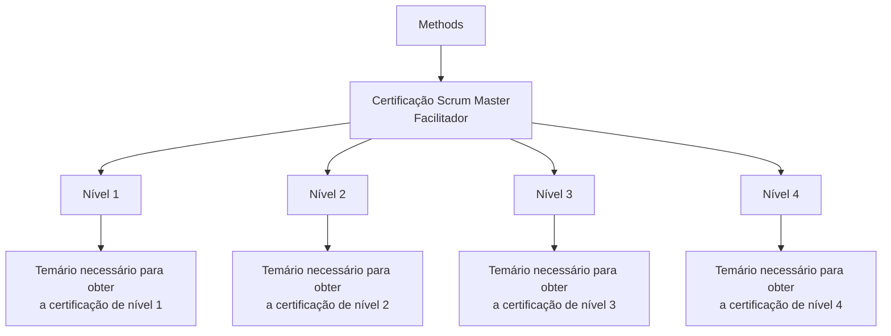

# Certificação Methods — Scrum Master (Facilitador)

## 1. Metadados do Documento
- **Arquivo de Origem:** Não identificado no conteúdo fornecido
- **Tipo de Documento:** Procedimento / Documentação de certificação
- **Domínio / Sistema:** Methods, Scrum Master (Facilitador), Reef
- **Público-Alvo:** Scrum Masters (Facilitadores) e usuários da documentação Reef
- **Data/Versão Identificada:** Não identificada

---

## 2. Resumo Executivo & Contexto de Negócio

O documento apresenta os temários associados à certificação Methods para o papel de **Scrum Master (Facilitador)**. A certificação está organizada em quatro níveis progressivos: nível 1, nível 2, nível 3 e nível 4.

Cada nível possui um temário próprio que deve ser conhecido para a obtenção da respectiva certificação. O conteúdo fornecido não descreve os assuntos, critérios de aprovação, avaliações, pré-requisitos ou duração de cada nível.

A documentação está associada ao ambiente ou repositório documental **Reef**, identificado também por referências a “DOCUMENTACIÓN Reef”, “Mapfredocument” e um ciclo de vida aprovado.

A interface textual exibida inclui opções de navegação para Soluções, Arquiteturas, APIs, Componentes, Cloud, Documentação, Zeus, Reef e Ajuda. Não há detalhamento no conteúdo sobre a relação funcional entre essas opções e a certificação Methods.

---

## 3. Arquitetura, Componentes & Tecnologias Envolvidas

Os elementos identificados são:

- **Methods:** contexto das certificações descritas.
- **Scrum Master (Facilitador):** papel ao qual os temários de certificação se destinam.
- **Certificação de Nível 1 a 4:** níveis de certificação com temários específicos.
- **Reef:** referência à documentação e à interface de navegação.
- **Mapfredocument:** termo apresentado no conteúdo bruto, sem detalhamento adicional.
- **Lifecycle Approved:** indicação de ciclo de vida aprovado.
- **Owner:** `user:agonzalez_mapfre.com`.



> **Nota de Análise:** O conteúdo não detalha uma arquitetura de software, integrações, APIs, tecnologias de implementação ou fluxos operacionais além da estrutura de níveis de certificação.

---

## 4. Regras de Negócio, Especificações Funcionais & Processos

1. A certificação Methods para **Scrum Master (Facilitador)** possui quatro níveis identificados: nível 1, nível 2, nível 3 e nível 4.
2. Para obter cada nível de certificação, é necessário conhecer o temário correspondente ao respectivo nível.
3. O documento afirma que os temários de todos os níveis estão disponíveis na seção de certificação para Scrum Master (Facilitador).
4. Não foram informados critérios de pontuação, método de avaliação, necessidade de aprovação em nível anterior, validade da certificação, responsáveis pela aplicação ou processo de inscrição.
5. Não foram apresentados conteúdos programáticos detalhados para nenhum dos quatro níveis.

---

## 5. Tabelas de Parâmetros, Ambientes e Estruturas de Dados

| Item / Parâmetro | Descrição / Função | Tipo / Valores / Formato | Ambiente / Observações |
| :--- | :--- | :--- | :--- |
| Certificação Methods | Estrutura de certificação descrita para Scrum Master (Facilitador). | Quatro níveis | Não há detalhamento dos critérios ou conteúdos. |
| Certificação de Nível 1 | Primeiro nível de certificação Methods. | Nível 1 | Exige conhecimento do temário correspondente. |
| Certificação de Nível 2 | Segundo nível de certificação Methods. | Nível 2 | Exige conhecimento do temário correspondente. |
| Certificação de Nível 3 | Terceiro nível de certificação Methods. | Nível 3 | Exige conhecimento do temário correspondente. |
| Certificação de Nível 4 | Quarto nível de certificação Methods. | Nível 4 | Exige conhecimento do temário correspondente. |
| Documentação Reef | Referência de documentação exibida no conteúdo. | `DOCUMENTACIÓN Reef` | Sem detalhamento funcional. |
| Mapfredocument | Termo exibido no conteúdo bruto. | Texto livre | Não definido pelo documento. |
| Owner | Proprietário identificado na documentação. | `user:agonzalez_mapfre.com` | Apresentado na área documental. |
| Lifecycle | Estado de ciclo de vida exibido. | `Approved` | O documento não explica o processo de aprovação. |
| Idioma da interface | Idioma indicado na navegação. | `ES` | Interface em espanhol. |
| Navegação disponível | Opções exibidas na interface documental. | Buscar, Inicio, Soluciones, Arquitecturas, APIs, Componentes, Cloud, Documentación, Zeus, Reef, Ayuda | Sem descrição de comportamento ou permissões. |

---

## 6. Bateria de Perguntas & Respostas para RAG (FAQ Sintético)

### P1: Qual papel profissional é coberto pela certificação Methods apresentada?
**R:** A certificação Methods apresentada é destinada ao papel de **Scrum Master (Facilitador)**.

### P2: Quantos níveis de certificação Methods para Scrum Master são mencionados?
**R:** O documento menciona quatro níveis: **Certificação de Nível 1**, **Certificação de Nível 2**, **Certificação de Nível 3** e **Certificação de Nível 4**.

### P3: O que é necessário conhecer para obter a Certificação de Nível 1?
**R:** Para obter a Certificação de Nível 1, é necessário conhecer o temário correspondente ao primeiro nível de certificação Methods.

### P4: O documento detalha os assuntos do temário da Certificação de Nível 2?
**R:** Não. O documento informa apenas que existe um temário necessário para obter o segundo nível de certificação Methods, sem listar seus assuntos.

### P5: Qual é a condição descrita para obter a Certificação de Nível 3?
**R:** A condição descrita é conhecer o temário necessário para obter o terceiro nível de certificação Methods.

### P6: Existe detalhamento de pré-requisitos entre os níveis de certificação?
**R:** Não. O conteúdo não informa se é obrigatório concluir um nível anterior antes de realizar a certificação do nível seguinte.

### P7: O documento informa como a certificação Methods é avaliada?
**R:** Não. Não há informação sobre provas, avaliações, notas mínimas, critérios de aprovação ou formato de certificação.

### P8: Quem está identificado como proprietário da documentação?
**R:** O proprietário identificado no conteúdo é `user:agonzalez_mapfre.com`.

### P9: Qual é o estado de ciclo de vida apresentado para a documentação?
**R:** O estado de ciclo de vida exibido é **Approved**.

### P10: Quais áreas de navegação aparecem na interface documental?
**R:** A interface apresenta as opções Buscar, Inicio, Soluciones, Arquitecturas, APIs, Componentes, Cloud, Documentación, Zeus, Reef e Ayuda.

---

## 7. Glossário de Termos, Siglas & Conceitos-Chave

- **Methods:** contexto ou programa de certificação mencionado para Scrum Master (Facilitador).
- **Scrum Master:** papel identificado pelo documento como “Facilitador”.
- **Facilitador:** designação associada ao Scrum Master no título da certificação.
- **Certificação de Nível 1:** primeiro nível de certificação Methods.
- **Certificação de Nível 2:** segundo nível de certificação Methods.
- **Certificação de Nível 3:** terceiro nível de certificação Methods.
- **Certificação de Nível 4:** quarto nível de certificação Methods.
- **Reef:** referência à documentação e à navegação documental exibida.
- **Lifecycle:** campo de ciclo de vida apresentado com o valor `Approved`.
- **Approved:** estado de ciclo de vida exibido no documento.
- **Owner:** campo que identifica o proprietário da documentação.

---

## 8. Notas Críticas, Riscos & Limitações

- O conteúdo fornecido apresenta somente descrições resumidas dos quatro níveis de certificação.
- Não há detalhamento dos temários de certificação Methods.
- Não há informações sobre pré-requisitos, avaliações, critérios de aprovação, validade, instrutores, calendário ou processo de inscrição.
- Não são descritas integrações, APIs, componentes técnicos, ambientes, URLs ou parâmetros operacionais.
- **Nota de Análise:** O documento cita “Mapfredocument”, “Reef”, “Zeus” e áreas como Arquiteturas e APIs, mas não explica seus papéis, relações ou funcionalidades.
- **Nota de Análise:** O estado `Approved` é exibido como ciclo de vida, porém o documento não especifica quem aprovou a documentação, quando ocorreu a aprovação ou quais regras governam esse estado.

---

## 9. Conteúdo Bruto Estruturado (Referência Fiel)

```text
--- [PÁGINA 1 DE 1] ---

CERTIFICACIÓN - METHODS - SCRUM MASTER (FACILITADOR)
 En este apartado se encuentran los temarios de cada uno de los niveles de certicación necesarios para el Scrum
Master (Facilitador).
CERTIFICACIÓN DE NIVEL 1
En este apartado se encuentra el temario
que se necesita conocer para obtener el
primer nivel de certicación de Methods.
CERTIFICACIÓN DE NIVEL 2
En este apartado se encuentra el temario
que se necesita conocer para obtener el
segundo nivel de certicación de
Methods.
CERTIFICACIÓN DE NIVEL 3
En este apartado se encuentra el temario
que se necesita conocer para obtener el
tercer nivel de certicación de Methods.
CERTIFICACIÓN DE NIVEL 4
En este apartado se encuentra el temario
que se necesita conocer para obtener el
cuarto nivel de certicación de Methods.
Documentation / DOCUMENTACIÓN Reef
DOCUMENTACIÓN Reef
Mapfredocument
DOCUMENTACIÓN Reef
Owner
user:agonzalez_mapfre.com
Lifecycle
Approved Source
 / 
 VL
Buscar Inicio Soluciones Arquitecturas APIs Componentes Cloud Documentación Zeus Reef Ayuda
ES
```
