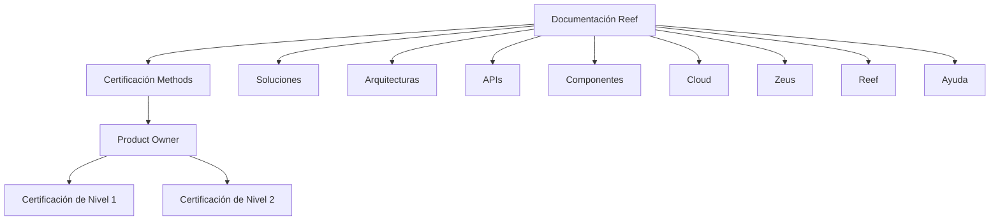

# Certificación Methods para Product Owner — Documentación Reef

## 1. Metadados do Documento
- **Arquivo de Origem:** Não identificado
- **Tipo de Documento:** Documentação / página de referência de certificação
- **Domínio / Sistema:** Methods, Product Owner, Reef, Mapfre
- **Público-Alvo:** Product Owners e usuários da documentação Reef
- **Data/Versão Identificada:** Não identificada

---

## 2. Resumo Executivo & Contexto de Negócio

O documento apresenta uma página de documentação intitulada “CERTIFICACIÓN - METHODS - PRODUCT OWNER”. O propósito explícito é concentrar os temários necessários para os níveis de certificação Methods voltados ao papel de Product Owner.

A página descreve dois níveis de certificação: **Certificación de Nivel 1** e **Certificación de Nivel 2**. Para cada nível, o conteúdo informa apenas que existe um temário a ser conhecido para obtenção da respectiva certificação; não são apresentados tópicos programáticos, critérios de aprovação, carga horária, avaliação ou pré-requisitos.

O conteúdo está inserido no contexto de “DOCUMENTACIÓN Reef”, com referências de navegação para áreas como Soluciones, Arquitecturas, APIs, Componentes, Cloud, Documentación, Zeus, Reef e Ayuda. A origem também registra o proprietário ou usuário como `agonzalez_mapfre.com` e o ciclo de vida como “Approved Source”.

> **Nota de Análise:** O documento não detalha o conteúdo dos temários de certificação Methods, nem explica a relação funcional ou técnica entre Methods, Reef, Mapfre e Zeus.

---

## 3. Arquitetura, Componentes & Tecnologias Envolvidas

Os elementos identificados no conteúdo são:

| Componente / Termo | Papel identificado no documento |
| :--- | :--- |
| Methods | Contexto da certificação para Product Owner. |
| Product Owner | Papel profissional ao qual a certificação se destina. |
| Certificación de Nivel 1 | Primeiro nível de certificação Methods. |
| Certificación de Nivel 2 | Segundo nível de certificação Methods. |
| Reef | Área ou sistema de documentação mencionado na página. |
| Mapfredocument | Termo exibido na navegação ou identificação documental. |
| Zeus | Item de navegação citado, sem detalhamento. |
| APIs | Área de navegação citada, sem APIs específicas identificadas. |
| Cloud | Área de navegação citada, sem ambiente ou tecnologia detalhados. |



> **Nota de Análise:** O diagrama representa exclusivamente a estrutura de navegação e a hierarquia conceitual visíveis no texto. O documento não fornece arquitetura de software, integrações, protocolos, endpoints, servidores ou fluxos de dados.

---

## 4. Regras de Negócio, Especificações Funcionais & Processos

1. A certificação Methods é apresentada para o papel de **Product Owner**.
2. O documento identifica dois níveis de certificação:
   - **Nível 1:** requer conhecimento de um temário para obtenção do primeiro nível de certificação Methods.
   - **Nível 2:** requer conhecimento de um temário para obtenção do segundo nível de certificação Methods.
3. O conteúdo está classificado como documentação Reef.
4. O ciclo de vida exibido é **Approved Source**.
5. O texto não informa:
   - tópicos ou módulos dos temários;
   - processo de inscrição;
   - critérios de elegibilidade;
   - nota mínima ou método de avaliação;
   - validade da certificação;
   - responsáveis pela aplicação ou aprovação;
   - relação de dependência entre os níveis 1 e 2.

---

## 5. Tabelas de Parâmetros, Ambientes e Estruturas de Dados

| Item / Parâmetro | Descrição / Função | Tipo / Valores / Formato | Ambiente / Observações |
| :--- | :--- | :--- | :--- |
| Certificación de Nivel 1 | Primeiro nível de certificação Methods para Product Owner. | Nível de certificação | O temário é mencionado, mas não detalhado. |
| Certificación de Nivel 2 | Segundo nível de certificação Methods para Product Owner. | Nível de certificação | O temário é mencionado, mas não detalhado. |
| Documentation / DOCUMENTACIÓN Reef | Identificação da área documental. | Área de documentação | Sem descrição funcional adicional. |
| Mapfredocument | Termo exibido na página. | Identificador ou item de navegação | Sem definição no documento. |
| Owner | Campo de propriedade exibido. | Metadado | Valor mostrado: `user:agonzalez_mapfre.com`. |
| Lifecycle | Campo de ciclo de vida exibido. | Metadado | Valor mostrado: `Approved Source`. |
| Idioma | Indicador de idioma na interface. | Código exibido | Valor mostrado: `ES`. |
| VL | Sigla ou indicador exibido na interface. | Valor textual | Sem definição no documento. |
| Soluciones | Item de navegação. | Seção | Sem detalhamento adicional. |
| Arquitecturas | Item de navegação. | Seção | Sem detalhamento adicional. |
| APIs | Item de navegação. | Seção | Nenhuma API é especificada. |
| Componentes | Item de navegação. | Seção | Nenhum componente é descrito. |
| Cloud | Item de navegação. | Seção | Nenhum ambiente cloud é identificado. |
| Zeus | Item de navegação. | Seção | Sem detalhamento adicional. |
| Reef | Item de navegação e referência documental. | Seção / domínio | Sem detalhamento adicional. |
| Ayuda | Item de navegação. | Seção de suporte | Sem detalhamento adicional. |

---

## 6. Bateria de Perguntas & Respostas para RAG (FAQ Sintético)

### P1: Qual é o objetivo da página “CERTIFICACIÓN - METHODS - PRODUCT OWNER”?
**R:** A página reúne referências aos temários necessários para os níveis de certificação Methods destinados ao papel de Product Owner.

### P2: Quantos níveis de certificação Methods são apresentados?
**R:** O documento apresenta dois níveis: Certificación de Nivel 1 e Certificación de Nivel 2.

### P3: O que é necessário para obter a Certificación de Nivel 1?
**R:** O documento informa que é necessário conhecer o temário correspondente ao primeiro nível de certificação Methods. Os tópicos desse temário não são fornecidos.

### P4: O que é necessário para obter a Certificación de Nivel 2?
**R:** O documento informa que é necessário conhecer o temário correspondente ao segundo nível de certificação Methods. O conteúdo programático não é detalhado.

### P5: O documento informa se o Nível 1 é pré-requisito para o Nível 2?
**R:** Não. Embora existam dois níveis de certificação, o documento não estabelece dependência, sequência obrigatória ou pré-requisitos entre eles.

### P6: Qual área documental é associada à certificação Methods para Product Owner?
**R:** A página está associada a “Documentation / DOCUMENTACIÓN Reef” e contém a referência “DOCUMENTACIÓN Reef”.

### P7: Quem é identificado como proprietário ou usuário da página?
**R:** O campo Owner apresenta o valor `user:agonzalez_mapfre.com`.

### P8: Qual é o ciclo de vida registrado para o conteúdo?
**R:** O campo Lifecycle apresenta o valor “Approved Source”.

### P9: O documento descreve APIs, componentes ou ambientes cloud?
**R:** Não. APIs, Componentes e Cloud aparecem apenas como itens de navegação; não há especificações técnicas, URLs, contratos, tecnologias ou ambientes detalhados.

### P10: O que significa a sigla VL exibida na página?
**R:** O documento exibe “VL”, mas não define seu significado no contexto da certificação Methods, da documentação Reef ou da interface.

---

## 7. Glossário de Termos, Siglas & Conceitos-Chave

- **APIs:** Termo exibido como item de navegação; o documento não apresenta a expansão ou APIs específicas.
- **Approved Source:** Valor exibido no campo Lifecycle, indicando o estado de ciclo de vida mostrado para o conteúdo.
- **Certificación de Nivel 1:** Primeiro nível de certificação Methods mencionado para Product Owner.
- **Certificación de Nivel 2:** Segundo nível de certificação Methods mencionado para Product Owner.
- **ES:** Código exibido na interface; o documento não explicita seu significado.
- **Methods:** Nome do contexto ou programa de certificação apresentado para Product Owner.
- **Product Owner:** Papel ao qual se destinam os níveis de certificação Methods.
- **Reef:** Nome associado à documentação e à navegação da página.
- **VL:** Sigla exibida sem definição no conteúdo.
- **Zeus:** Item de navegação citado sem explicação adicional.

---

## 8. Notas Críticas, Riscos & Limitações

- O documento não contém os temários efetivos da Certificación de Nivel 1 ou da Certificación de Nivel 2.
- Não há critérios de aprovação, pré-requisitos, processo de avaliação, duração, pontuação, certificador responsável ou validade das certificações.
- A relação entre Methods, Reef, Mapfredocument e Zeus não é explicada.
- APIs, Componentes, Cloud e Arquitecturas aparecem exclusivamente como navegação, sem conteúdo técnico correspondente.
- Alguns termos de interface, como `ES` e `VL`, não são definidos.
- A extração contém o caractere `` em “certicación”; a transcrição abaixo preserva fielmente o texto bruto fornecido.

---

## 9. Conteúdo Bruto Estruturado (Referência Fiel)

```text
--- [PÁGINA 1 DE 1] ---

CERTIFICACIÓN - METHODS - PRODUCT OWNER
 En este apartado se encuentran los temarios de cada uno de los niveles de certicación necesarios para el Product
Owner.
CERTIFICACIÓN DE NIVEL 1
En este apartado se encuentra el temario que se necesita conocer
para obtener el primer nivel de certicación de Methods.
CERTIFICACIÓN DE NIVEL 2
En este apartado se encuentra el temario que se necesita conocer
para obtener el segundo nivel de certicación de Methods.
Documentation / DOCUMENTACIÓN Reef
DOCUMENTACIÓN Reef
Mapfredocument
DOCUMENTACIÓN Reef
Owner
user:agonzalez_mapfre.com
Lifecycle
Approved Source
 / 
 VL
Buscar Inicio Soluciones Arquitecturas APIs Componentes Cloud Documentación Zeus Reef Ayuda
ES
```
