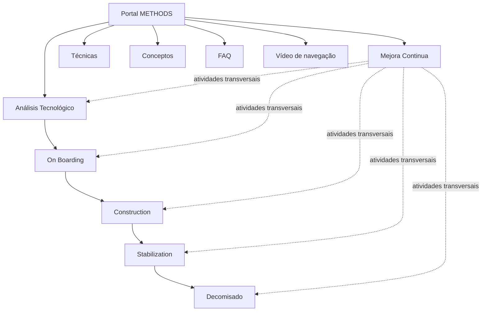

# Portal METHODS — Certificación Methods Nivel 1

## 1. Metadados do Documento
- **Arquivo de Origem:** Não informado
- **Tipo de Documento:** Apresentação Executiva / Material de Certificação
- **Domínio / Sistema:** Portal METHODS / Metodologia de Desenvolvimento MAPFRE
- **Público-Alvo:** Equipes de Desenvolvimento, TI, Negócio e Product Owners
- **Data/Versão Identificada:** “Certificación - Methods Nivel 1”; demais data/versão não identificada

---

## 2. Resumo Executivo & Contexto de Negócio

O documento apresenta o **METHODS**, definido como o Portal de Metodologia de Desenvolvimento que centraliza as informações necessárias para equipes de Desenvolvimento, TI e Negócio. O portal organiza atividades relevantes para o desenvolvimento de produtos, aplicações e serviços.

A metodologia METHODS busca conectar a definição metodológica às ferramentas usadas diariamente pelas equipes de TI e pelos Product Owners. O objetivo declarado é disponibilizar um modelo prático para desenvolvimento de software, facilitando o trabalho operacional com ferramentas corporativas.

O portal integra ferramentas corporativas MAPFRE e menciona a aplicação de marcos de trabalho e técnicas como **Scrum**, **Kanban**, **DevOps** e automatizações. O conteúdo é estruturado por fases do ciclo de vida de desenvolvimento, permitindo navegação com maior ou menor nível de detalhe conforme a necessidade do usuário.

As fases identificadas abrangem desde a análise da viabilidade tecnológica até o descomissionamento da aplicação, incluindo melhoria contínua de forma transversal. Além do conteúdo metodológico, o METHODS oferece técnicas, conceitos e perguntas frequentes como apoio às atividades do dia a dia.

---

## 3. Arquitetura, Componentes & Tecnologias Envolvidas

O documento não descreve uma arquitetura técnica de infraestrutura, integrações, protocolos, APIs, servidores, bancos de dados ou contratos de comunicação. A arquitetura identificável é uma estrutura metodológica e de navegação do Portal METHODS.

### Componentes e elementos citados

| Componente / Tecnologia | Papel descrito no documento |
| :--- | :--- |
| Portal METHODS | Portal de Metodologia de Desenvolvimento com informações para Desenvolvimento, TI e Negócio. |
| Ferramentas corporativas MAPFRE | Ferramentas integradas às etapas e atividades do desenvolvimento. |
| Scrum | Marco de trabalho citado como aplicável à metodologia. |
| Kanban | Marco de trabalho citado como aplicável à metodologia. |
| DevOps | Marco de trabalho citado como aplicável à metodologia. |
| Automatizações | Técnicas ou práticas citadas como parte da abordagem do portal. |
| Product Owners | Público para o qual a metodologia busca facilitar o trabalho com ferramentas do dia a dia. |
| Reef | Referência de documentação exibida na extração. |
| Mapfredocument | Referência exibida na extração, sem detalhamento funcional. |
| Zeus | Item de navegação exibido na extração, sem detalhamento adicional. |



> **Nota de Análise:** O documento descreve fases metodológicas e conteúdos de suporte, mas não detalha arquitetura de software, microsserviços, métodos HTTP, contratos JSON, endpoints, autenticação ou fluxos técnicos entre sistemas.

---

## 4. Regras de Negócio, Especificações Funcionais & Processos

### Objetivo da metodologia METHODS

A metodologia METHODS deve fornecer um modelo prático para o desenvolvimento de software. Esse modelo deve estabelecer conexão entre a definição metodológica e as ferramentas utilizadas pelas equipes de TI e Product Owners no trabalho diário.

### Estrutura metodológica do ciclo de vida

1. **Análisis Tecnológico**
   - É a fase inicial.
   - Estuda necessidades tecnológicas a partir de uma ideia.
   - Busca determinar a viabilidade tecnológica.
   - Busca identificar o potencial de êxito da iniciativa.

2. **On Boarding**
   - É a fase de planejamento e coordenação.
   - Envolve os times participantes.
   - Busca disponibilizar os recursos necessários para abordar o projeto.

3. **Construction**
   - É a fase de desenvolvimento.
   - Inclui validação dos elementos do produto.
   - Prossegue até a obtenção de uma versão funcional.

4. **Stabilization**
   - Ocorre no período final do ciclo de vida de desenvolvimento de software, antes do lançamento em produção.
   - Deve garantir que o produto atende aos requisitos especificados.
   - Deve garantir funcionamento estável.
   - Deve confirmar que o produto está pronto para uso por usuários finais sem erros.

5. **Decomisado**
   - É a última atividade da vida útil de uma aplicação.
   - Deve garantir que a aplicação não continue ativa no portfólio de aplicações.
   - Deve garantir que a aplicação não continue consumindo recursos.
   - Deve garantir que a aplicação não continue gerando gastos.

6. **Mejora Continua**
   - É um conjunto de atividades transversais.
   - É orientada à gestão de mudanças de escopo.
   - É orientada à melhoria da qualidade do produto final.

### Navegação e conteúdos de suporte

- A página principal do Portal METHODS apresenta um vídeo com opções de navegação.
- A página principal contém informações detalhadas relacionadas às fases metodológicas.
- O portal disponibiliza técnicas aplicáveis à execução das tarefas metodológicas.
- O portal disponibiliza conceitos em formato de glossário.
- O portal disponibiliza uma seção de perguntas frequentes com conteúdos mais demandados.

---

## 5. Tabelas de Parâmetros, Ambientes e Estruturas de Dados

| Item / Parâmetro | Descrição / Função | Tipo / Valores / Formato | Ambiente / Observações |
| :--- | :--- | :--- | :--- |
| METHODS | Portal de Metodologia de Desenvolvimento. | Portal corporativo. | Direcionado a equipes de Desenvolvimento, TI e Negócio. |
| Análisis Tecnológico | Estudo inicial de necessidades tecnológicas, viabilidade e potencial de êxito. | Fase metodológica. | Início do ciclo de desenvolvimento. |
| On Boarding | Planejamento e coordenação para disponibilização dos recursos do projeto. | Fase metodológica. | Envolve equipes implicadas. |
| Construction | Desenvolvimento e validação dos elementos do produto. | Fase metodológica. | Produz uma versão funcional. |
| Stabilization | Garantia de requisitos, estabilidade e preparação para uso final. | Fase metodológica. | Período anterior ao lançamento em produção. |
| Decomisado | Retirada da aplicação do portfólio, recursos e custos. | Fase metodológica. | Última atividade da vida útil da aplicação. |
| Mejora Continua | Gestão de mudanças de escopo e melhoria da qualidade final. | Atividade transversal. | Abrange o ciclo metodológico. |
| Técnicas | Conteúdos de suporte para realização das tarefas metodológicas. | Conteúdo de apoio. | Referência “[Técnicas]” com URL truncada na extração. |
| Conceptos | Glossário de conceitos citados na metodologia. | Conteúdo de apoio. | O detalhe é indicado como disponível em “Conceptos”. |
| FAQ | Conteúdos mais demandados em formato de perguntas frequentes. | Conteúdo de apoio. | O detalhe é indicado como disponível em “FAQ”. |
| Vídeo de navegação | Explica as opções de navegação do Portal METHODS. | Recurso multimídia. | Disponível na página principal. |
| Owner | `user:agonzalez_mapfre.com` | Identificador exibido na extração. | Não há explicação do papel ou responsabilidade. |
| Lifecycle | `Approved Source` | Estado exibido na extração. | Não há detalhamento do ciclo de aprovação. |
| Idioma exibido | `ES` | Código apresentado na navegação. | O documento extraído está predominantemente em espanhol. |

---

## 6. Bateria de Perguntas & Respostas para RAG (FAQ Sintético)

### P1: O que é o Portal METHODS?
**R:** O Portal METHODS é o Portal de Metodologia de Desenvolvimento que reúne informações necessárias para equipes de Desenvolvimento, TI e Negócio. O portal organiza etapas e atividades relevantes para o desenvolvimento de produtos, aplicações e serviços.

### P2: Qual é o objetivo da metodologia METHODS?
**R:** O objetivo da metodologia METHODS é fornecer um modelo prático para desenvolvimento de software, conectando a definição metodológica às ferramentas utilizadas diariamente pelas equipes de TI e pelos Product Owners.

### P3: Quais marcos de trabalho e técnicas são citados no Portal METHODS?
**R:** O documento cita Scrum, Kanban, DevOps e automatizações como marcos de trabalho e técnicas aplicados no contexto da metodologia METHODS.

### P4: O que acontece na fase Análisis Tecnológico?
**R:** A fase Análisis Tecnológico é a etapa inicial em que as necessidades tecnológicas são estudadas a partir de uma ideia, com o objetivo de determinar a viabilidade e o potencial de êxito da iniciativa.

### P5: Qual é a finalidade da fase On Boarding?
**R:** On Boarding é a fase de planejamento e coordenação com as equipes envolvidas, destinada a garantir a disponibilidade dos recursos necessários para abordar o projeto.

### P6: Qual resultado é esperado da fase Construction?
**R:** A fase Construction compreende o desenvolvimento e a validação dos elementos do produto até a obtenção de uma versão funcional.

### P7: O que deve ser garantido durante Stabilization?
**R:** Durante Stabilization, antes do lançamento do produto em produção, deve-se garantir que o produto cumpre os requisitos especificados, funciona de forma estável e está pronto para ser utilizado pelos usuários finais sem erros.

### P8: O que significa Decomisado no ciclo de vida de uma aplicação?
**R:** Decomisado é a última atividade da vida útil de uma aplicação. Essa fase deve garantir que a aplicação não permaneça ativa no portfólio, não continue consumindo recursos e não siga gerando gastos.

### P9: Como a Mejora Continua se relaciona com as demais fases?
**R:** Mejora Continua é composta por atividades transversais voltadas à gestão de mudanças de escopo e à melhoria da qualidade do produto final. O documento a apresenta como uma atividade que atravessa o ciclo metodológico.

### P10: Quais conteúdos adicionais o Portal METHODS oferece?
**R:** O Portal METHODS oferece técnicas aplicáveis às tarefas metodológicas, um glossário de conceitos citados na metodologia e uma seção de perguntas frequentes com conteúdos mais demandados.

### P11: Onde o usuário encontra detalhes sobre a navegação do Portal METHODS?
**R:** A página principal do Portal METHODS apresenta um vídeo que detalha as opções de navegação. O documento também informa que a página principal contém informações detalhadas relacionadas às fases apresentadas.

### P12: O documento especifica APIs, URLs completas, métodos HTTP ou contratos de integração do METHODS?
**R:** Não. O documento menciona o Portal METHODS, ferramentas corporativas MAPFRE e itens de navegação, mas não detalha APIs, métodos HTTP, contratos JSON, protocolos, portas ou URLs completas. A única URL visível está truncada na extração.

---

## 7. Glossário de Termos, Siglas & Conceitos-Chave

- **METHODS:** Portal de Metodologia de Desenvolvimento que concentra informações para Desenvolvimento, TI e Negócio.
- **MAPFRE:** Referência às ferramentas corporativas MAPFRE integradas ao contexto metodológico. O documento não expande a sigla.
- **TI:** Tecnologia da Informação.
- **Product Owner:** Papel citado como usuário da metodologia e das ferramentas do dia a dia; não há definição adicional no documento.
- **Scrum:** Marco de trabalho citado como aplicável à metodologia METHODS.
- **Kanban:** Marco de trabalho citado como aplicável à metodologia METHODS.
- **DevOps:** Marco de trabalho citado como aplicável à metodologia METHODS.
- **Análisis Tecnológico:** Fase inicial para estudo de necessidades tecnológicas, viabilidade e potencial de êxito.
- **On Boarding:** Fase de planejamento e coordenação para obtenção de recursos do projeto.
- **Construction:** Fase de desenvolvimento e validação até uma versão funcional.
- **Stabilization:** Etapa final antes da produção para assegurar requisitos, estabilidade e prontidão para usuários finais.
- **Decomisado:** Atividade final de retirada de uma aplicação do portfólio, consumo de recursos e geração de gastos.
- **Mejora Continua:** Atividades transversais para gestão de mudanças de escopo e qualidade do produto final.
- **FAQ:** Seção de perguntas frequentes com conteúdos mais demandados.
- **Reef:** Referência de documentação exibida no conteúdo extraído, sem definição adicional.
- **Mapfredocument:** Referência apresentada no conteúdo extraído, sem detalhamento adicional.
- **Zeus:** Item de navegação exibido na extração, sem descrição adicional.

---

## 8. Notas Críticas, Riscos & Limitações

- O texto extraído possui caracteres corrompidos ou ausentes, por exemplo em “denición”, “planicación”, “nal” e “faciltar”.
- A URL associada a **[Técnicas]** está truncada: `https://marketplace.mapfre.com/do`. Não é possível inferir o endereço completo.
- O documento não apresenta detalhes técnicos de implementação, tais como arquitetura de infraestrutura, ambientes, servidores, APIs, microsserviços, contratos, autenticação, logs, monitoramento ou procedimentos de operação.
- O status `Approved Source`, o campo `Lifecycle`, o `Owner` e as referências a Reef, Mapfredocument e Zeus aparecem na extração, porém não são explicados.
- Não foi identificada data de publicação, número de versão, autor formal, escopo de governança ou responsáveis por cada fase.
- Não há detalhamento adicional sobre critérios mensuráveis de conclusão, aprovações, entradas, saídas ou responsáveis para as fases metodológicas.

---

## 9. Conteúdo Bruto Estruturado (Referência Fiel)

```text
--- [PÁGINA 1 DE 2] ---

CERTIFICACIÓN - METHODS NIVEL 1
CERTIFICACIÓN METHODS NIVEL 1
INTRODUCCIÓN A METHODS
METHODS es el Portal de Metodología de
Desarrollo que contiene toda la
información necesaria para los Equipos de
Desarrollo, TI y Negocio.
Está implementado en un esquema con
las etapas y actividades más importantes
a realizar en el desarrollo de productos,
aplicaciones y servicios, integrando las
herramientas corporativas MAPFRE, y
aplicando marcos de trabajo y técnicas de
desarrollo como Scrum, Kanban, DevOps o
automatizaciones.
OBJETIVOS
El objetivo de la metodología METHODS
es proporcionar un modelo práctico para
el desarrollo de software, estableciendo la
conexión entre la denición metodológica
y las herramientas, de manera que se
facilite a los equipos de TI y Product
Owners el trabajo con las herramientas
que se utilizan en el día a día.
ESTRUCTURA
El Portal METHODS muestra un esquema
de las etapas y actividades más
importantes a realizar durante el
desarrollo, entre las que se puede navegar,
mostrando mayor o menor detalle en
función de las necesidades del usuario.
Las principales fases de la metodología
son:
- Análisis Tecnológico: fase inicial donde
se estudian las necesidades tecnológicas
a partir de la idea para determinar su
viabilidad y potencial éxito.
- On Boarding: fase de planicación y
coordinación con los equipos implicados
para disponer de los recursos necesarios
para abordar el proyecto.
- Construction: fase de dearrollo y
validación de los elementos del producto
hasta obtener una versión funcional.
Documentation / DOCUMENTACIÓN Reef
DOCUMENTACIÓN Reef
Mapfredocument
DOCUMENTACIÓN Reef
Owner
user:agonzalez_mapfre.com
Lifecycle
Approved Source
 /
 VL
Buscar Inicio Soluciones Arquitecturas APIs Componentes Cloud Documentación Zeus Reef Ayuda
ES

--- [PÁGINA 2 DE 2] ---

- Stabilization: período nal en el ciclo de
vida del desarrollo de software, antes del
lanzamiento del producto en producción,
donde se garantiza que cumple con los
requisitos especicados, funciona de
manera estable, y está listo para ser
utlizado por los usuarios nales sin
errores.
- Decomisado: última actividad en la vida
útil de una aplicación, en la que se
garantiza que no continuará activa en el
portfolio de aplicaciones, ni consumiendo
recursos, ni generando gasto.
- Mejora Continua: conjunto de
actividades transversales orientadas a
gestionar o cambios al alcance, y a
mejorar la calidad del producto nal.
NAVEGACIÓN
En la página principal del Portal METHODS
se muestra un vídeo detallando las
opciones de navegación.
La información detallada relacionada con los
puntos anteriores se encuentra en la página
principal del Portal METHODS
OTROS CONTENIDOS
Con el n de faciltar la labor a los equipos,
METHODS también ofrece otros tipos de
contenidos de soporte a las actividades
del día a dia, como son:
- Técnicas aplicables para llevar a cabo las
tareas de la metodología.
- Conceptos: glosario en el que se explican
los conceptos mencionados en la
metodología. El detalle se muestra en:
Conceptos
- Preguntas frecuentes: sección con los
contenidos más demandados. El detalle
se muestra en: FAQ
1
  El detalle se muestra en:
[Técnicas]
(https://marketplace.mapfre.com/do
```
