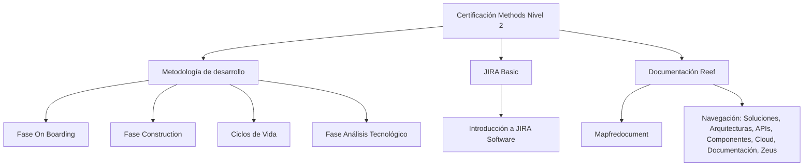

# Certificación Methods Nivel 2 — Temario de Metodología de Desarrollo

## 1. Metadados do Documento
- **Arquivo de Origem:** Não identificado no conteúdo fornecido
- **Tipo de Documento:** Material de certificação / apresentação de temário
- **Domínio / Sistema:** Methods Nivel 2; metodologia de desenvolvimento; Reef; Mapfredocument
- **Público-Alvo:** Participantes da certificação Methods Nivel 2
- **Data/Versão Identificada:** Não identificada

---

## 2. Resumo Executivo & Contexto de Negócio

O conteúdo apresenta a estrutura temática da **Certificación Methods Nivel 2**, relacionada a uma metodologia de desenvolvimento. O material organiza o temário em quatro áreas principais: fase **On Boarding**, fase **Construction**, ciclos de vida aplicáveis e fase de **Análisis Tecnológico**.

Cada área é descrita como uma seção que contém conteúdo programático da metodologia de desenvolvimento. O material também inclui uma introdução à ferramenta **JIRA Software**, identificada como “JIRA Basic”.

A referência à documentação ocorre no contexto de **Reef**, com indicação de navegação por categorias como Soluciones, Arquitecturas, APIs, Componentes, Cloud, Documentación e Zeus. O conteúdo também menciona **Mapfredocument** e um proprietário identificado como `user:agonzalez_mapfre.com`.

O documento é predominantemente um índice ou página de entrada de conteúdos. Não detalha procedimentos operacionais, tecnologias de implementação, contratos de integração, regras de aprovação, fluxos de JIRA ou critérios específicos de cada fase da metodologia.

---

## 3. Arquitetura, Componentes & Tecnologias Envolvidas

Os elementos identificados no conteúdo são:

- **Certificación Methods Nivel 2:** Estrutura de certificação apresentada pelo documento.
- **Metodología de desarrollo:** Contexto metodológico das fases e ciclos de vida.
- **Fase On Boarding:** Área temática da metodologia.
- **Fase Construction:** Área temática da metodologia.
- **Ciclos de Vida:** Conteúdo sobre ciclos de vida aplicáveis à metodologia.
- **Fase Análisis Tecnológico:** Área temática da metodologia.
- **JIRA Software / JIRA Basic:** Ferramenta e conteúdo introdutório mencionados.
- **Reef:** Contexto de documentação citado.
- **Mapfredocument:** Termo citado na área de documentação.
- **Zeus:** Categoria de navegação citada.



> **Nota de Análise:** O conteúdo não descreve integrações técnicas, microsserviços, protocolos, ambientes, linguagens de programação, métodos HTTP ou contratos de dados.

---

## 4. Regras de Negócio, Especificações Funcionais & Processos

1. A certificação apresentada é denominada **Methods Nivel 2**.
2. A fase **On Boarding** possui um temário dentro da metodologia de desenvolvimento.
3. A fase **Construction** possui um temário dentro da metodologia de desenvolvimento.
4. Os **Ciclos de Vida** possuem um temário correspondente aos ciclos de vida aplicáveis dentro da metodologia de desenvolvimento.
5. A fase **Análisis Tecnológico** possui um temário dentro da metodologia de desenvolvimento.
6. O módulo **JIRA Basic** contém conteúdo introdutório sobre a ferramenta **JIRA Software**.
7. A documentação é referenciada como **Documentation / DOCUMENTACIÓN Reef** e **DOCUMENTACIÓN Reef**.
8. O conteúdo identifica o status de ciclo de vida como **Approved Source**.
9. O proprietário informado é `user:agonzalez_mapfre.com`.

> **Nota de Análise:** O documento não apresenta regras de transição entre fases, critérios de entrada ou saída, responsáveis por etapa, aprovações, SLAs, fluxos de exceção ou parâmetros de configuração.

---

## 5. Tabelas de Parâmetros, Ambientes e Estruturas de Dados

| Item / Parâmetro | Descrição / Função | Tipo / Valores / Formato | Ambiente / Observações |
| :--- | :--- | :--- | :--- |
| Certificación Methods Nivel 2 | Certificação apresentada no documento | Título de certificação | Sem data ou versão identificada |
| Fase On Boarding | Contém temário da fase On Boarding | Área da metodologia de desenvolvimento | Sem detalhamento do temário |
| Fase Construction | Contém temário da fase Construction | Área da metodologia de desenvolvimento | Sem detalhamento do temário |
| Ciclos de Vida | Contém temário sobre ciclos de vida aplicáveis | Área da metodologia de desenvolvimento | Sem ciclos específicos identificados |
| Fase Análisis Tecnológico | Contém temário de análise tecnológica | Área da metodologia de desenvolvimento | Sem detalhamento adicional |
| JIRA Basic | Conteúdo de introdução à ferramenta JIRA Software | Módulo ou seção de treinamento | Sem detalhamento de funcionalidades |
| Documentation / DOCUMENTACIÓN Reef | Área de documentação mencionada | Recurso documental | Associada a Reef |
| Mapfredocument | Termo citado no conteúdo | Nome não detalhado | Sem definição no documento |
| Owner | Proprietário registrado | `user:agonzalez_mapfre.com` | Conforme conteúdo bruto |
| Lifecycle | Estado de ciclo de vida registrado | `Approved Source` | Conforme conteúdo bruto |
| Navegação Reef | Categorias exibidas na navegação | Buscar, Inicio, Soluciones, Arquitecturas, APIs, Componentes, Cloud, Documentación, Zeus, Reef, Ayuda | Idioma indicado: `ES` |
| VL | Valor exibido próximo ao estado de ciclo de vida | `VL` | Significado não informado |

---

## 6. Bateria de Perguntas & Respostas para RAG (FAQ Sintético)

### P1: Qual é o objetivo do conteúdo “Certificación Methods Nivel 2”?
**R:** O conteúdo apresenta a estrutura temática de uma certificação denominada **Methods Nivel 2**, organizada no contexto de uma metodologia de desenvolvimento.

### P2: Quais fases da metodologia de desenvolvimento são mencionadas?
**R:** O documento menciona as fases **On Boarding**, **Construction** e **Análisis Tecnológico**, além de uma seção dedicada aos **Ciclos de Vida** aplicáveis à metodologia de desenvolvimento.

### P3: O documento detalha o conteúdo da fase On Boarding?
**R:** Não. O documento informa somente que existe um temário da fase **On Boarding** dentro da metodologia de desenvolvimento, sem listar tópicos, atividades, critérios ou responsáveis.

### P4: O que é abordado na fase Construction?
**R:** O material informa que a fase **Construction** possui um temário dentro da metodologia de desenvolvimento. Não são apresentados conteúdos específicos, artefatos, fluxos ou regras dessa fase.

### P5: Quais ciclos de vida são aplicáveis à metodologia?
**R:** O documento afirma que há um temário correspondente aos ciclos de vida aplicáveis dentro da metodologia de desenvolvimento, mas não identifica os nomes, etapas ou critérios desses ciclos de vida.

### P6: Qual é o conteúdo de JIRA Basic?
**R:** **JIRA Basic** é apresentado como uma seção de introdução à ferramenta **JIRA Software**. O documento não detalha funcionalidades, projetos, workflows, permissões ou configurações de JIRA.

### P7: Qual sistema de documentação é citado no material?
**R:** O material cita **Documentation / DOCUMENTACIÓN Reef** e **DOCUMENTACIÓN Reef**, além do termo **Mapfredocument**. Não há descrição funcional desses recursos no conteúdo fornecido.

### P8: Quem é o proprietário registrado na documentação Reef?
**R:** O proprietário identificado no conteúdo é `user:agonzalez_mapfre.com`.

### P9: Qual é o estado de ciclo de vida registrado para o conteúdo?
**R:** O campo **Lifecycle** está registrado com o valor **Approved Source**.

### P10: Quais categorias de navegação são exibidas na documentação Reef?
**R:** As categorias exibidas são: Buscar, Inicio, Soluciones, Arquitecturas, APIs, Componentes, Cloud, Documentación, Zeus, Reef e Ayuda.

### P11: O documento apresenta arquitetura técnica ou integrações entre sistemas?
**R:** Não. O conteúdo não apresenta arquitetura de software detalhada, integrações, endpoints, bancos de dados, protocolos, ambientes ou contratos técnicos.

### P12: O que significa o valor “VL” exibido no conteúdo?
**R:** O valor **VL** aparece próximo ao campo Lifecycle, mas o documento não define seu significado. Não é possível atribuir interpretação adicional sem evidência no conteúdo original.

---

## 7. Glossário de Termos, Siglas & Conceitos-Chave

- **Methods Nivel 2:** Nome da certificação apresentada no documento.
- **On Boarding:** Fase da metodologia de desenvolvimento citada no material.
- **Construction:** Fase da metodologia de desenvolvimento citada no material.
- **Análisis Tecnológico:** Fase da metodologia de desenvolvimento citada no material.
- **Ciclos de Vida:** Conjunto de ciclos aplicáveis dentro da metodologia de desenvolvimento; não detalhados.
- **JIRA Basic:** Seção de introdução à ferramenta JIRA Software.
- **JIRA Software:** Ferramenta mencionada no conteúdo; funcionalidades não detalhadas.
- **Reef:** Contexto ou área de documentação citada no material.
- **Mapfredocument:** Termo citado na documentação; significado não definido.
- **Lifecycle:** Campo de ciclo de vida exibido com o valor `Approved Source`.
- **Approved Source:** Valor apresentado para o campo Lifecycle.
- **VL:** Termo exibido no conteúdo sem definição.
- **Zeus:** Categoria de navegação citada, sem detalhamento.

---

## 8. Notas Críticas, Riscos & Limitações

- O conteúdo é um resumo de temário e não fornece detalhamento operacional das fases da metodologia.
- Não há critérios formais de entrada, saída, aprovação, transição ou exceção para On Boarding, Construction ou Análisis Tecnológico.
- Não há explicação dos ciclos de vida aplicáveis.
- O termo `VL` não possui definição no documento.
- **Mapfredocument**, **Reef** e **Zeus** são citados sem descrição funcional, técnica ou de responsabilidade.
- Não foram identificados ambientes, URLs, servidores, portas, APIs, contratos de integração ou configurações de segurança.
- Não foram identificadas versões, datas de publicação ou autoria documental além do campo Owner informado.

---

## 9. Conteúdo Bruto Estruturado (Referência Fiel)

```text
--- [PÁGINA 1 DE 1] ---

CERTIFICACIÓN - METHODS NIVEL 2
CERTIFICACIÓN METHODS NIVEL 2
FASE ON BOARDING
En este apartado se encuentra el temario
de la fase ON BOARDING, dentro de la
metodología de desarrollo.
FASE CONSTRUCTION
En este apartado se encuentra el temario
de la fase CONSTRUCTION, dentro de la
metodología de desarrollo.
CICLOS DE VIDA
En este apartado se encuentra el temario
correspondiente a los ciclos de vida
aplicables dentro de la metodología de
desarrollo.
FASE ANÁLISIS TECNOLÓGICO
En este apartado se encuentra el temario
de la fase ANÁLISIS TECNOLÓGICO,
dentro de la metodología de desarrollo.
JIRA BASIC
En este apartado se encuentra el temario
de introducción a la herramienta JIRA
Software.
Documentation / DOCUMENTACIÓN Reef
DOCUMENTACIÓN Reef
Mapfredocument
DOCUMENTACIÓN Reef
Owner
user:agonzalez_mapfre.com
Lifecycle
Approved Source
 / 
 VL
Buscar Inicio Soluciones Arquitecturas APIs Componentes Cloud Documentación Zeus Reef Ayuda
ES
```
