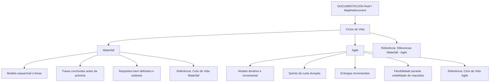

# Ciclos de Vida de Desenvolvimento de Software: Waterfall, Agile e Documentação Reef

## 1. Metadados do Documento
- **Arquivo de Origem:** Não identificado no conteúdo fornecido
- **Tipo de Documento:** Apresentação Executiva / Material de Documentação
- **Domínio / Sistema:** Documentação Reef / Mapfredocument
- **Público-Alvo:** Desenvolvedores, Arquitetos, Equipes de Produto e Gestão de Projetos
- **Data/Versão Identificada:** Não identificada

---

## 2. Resumo Executivo & Contexto de Negócio

O documento apresenta os ciclos de vida de desenvolvimento de software **Waterfall** e **Agile**, descrevendo suas características fundamentais, contextos recomendados de aplicação e diferenças conceituais. O conteúdo está publicado no contexto de **DOCUMENTACIÓN Reef**, identificado também como **Mapfredocument**.

O ciclo de vida **Waterfall** é descrito como um modelo sequencial e linear. O desenvolvimento é organizado em fases sucessivas, nas quais cada fase deve ser concluída antes do início da etapa seguinte. O documento associa esse modelo a contextos com requisitos bem definidos desde o início e baixa expectativa de mudanças durante o desenvolvimento.

O ciclo de vida **Agile** é apresentado como iterativo e incremental, estruturado em sprints curtos. Cada sprint contém as fases de desenvolvimento e produz entregas incrementais de software até a conclusão do produto final. O material vincula Agile a produtos incrementais, equipes multifuncionais e cenários com volatilidade de requisitos.

O documento referencia conteúdos complementares para detalhar cada ciclo de vida — “Ciclo de Vida Waterfall”, “Ciclo de Vida Agile” e “Diferencias Waterfall - Agile” —, porém não fornece o conteúdo desses materiais relacionados. Não há detalhamento de tecnologias, arquitetura de software, integrações, contratos de API, ambientes técnicos ou parâmetros operacionais.

---

## 3. Arquitetura, Componentes & Tecnologias Envolvidas

Os componentes e elementos explicitamente citados no conteúdo são:

| Componente / Elemento | Descrição sustentada pelo documento |
| :--- | :--- |
| DOCUMENTACIÓN Reef | Área ou contexto documental no qual o conteúdo sobre ciclos de vida é apresentado. |
| Mapfredocument | Nome exibido no conteúdo associado à documentação Reef. |
| Waterfall | Modelo de ciclo de vida sequencial e linear para desenvolvimento de software. |
| Agile | Modelo de ciclo de vida iterativo e incremental para desenvolvimento de software. |
| Ciclo de Vida Waterfall | Referência documental para detalhamento do modelo Waterfall. |
| Ciclo de Vida Agile | Referência documental para detalhamento do modelo Agile. |
| Diferencias Waterfall - Agile | Referência documental para comparação entre Waterfall e Agile. |
| Owner | Campo exibido com o valor `user:agonzalez_mapfre.com`. |
| Lifecycle | Campo de navegação ou classificação exibido sem valor detalhado. |
| Approved Source | Campo de navegação ou classificação exibido sem valor detalhado. |
| VL | Termo exibido na interface sem definição adicional. |
| Zeus | Item citado na navegação da documentação, sem detalhamento funcional. |
| Reef | Item citado na navegação e no contexto documental. |



> **Nota de Análise:** O documento não descreve uma arquitetura tecnológica, microsserviços, bancos de dados, APIs, protocolos, servidores, linguagens ou mecanismos de integração. O diagrama representa exclusivamente as relações conceituais entre os ciclos de vida descritos.

---

## 4. Regras de Negócio, Especificações Funcionais & Processos

### 4.1. Características do ciclo de vida Waterfall

1. Waterfall é um modelo de desenvolvimento de software com abordagem **sequencial e linear**.
2. Waterfall possui poucas entregas finais.
3. Waterfall é composto por um conjunto de fases sequenciais.
4. Cada fase do modelo Waterfall deve ser concluída antes que a próxima fase seja iniciada.
5. Waterfall é aplicável quando os requisitos estão bem definidos desde o início.
6. Waterfall é aplicável quando não se espera que os requisitos mudem significativamente durante o desenvolvimento.
7. Waterfall não oferece muita flexibilidade diante de mudanças.
8. O detalhamento adicional do modelo é referenciado pelo documento “Ciclo de Vida Waterfall”.

### 4.2. Características do ciclo de vida Agile

1. Agile é um modelo de desenvolvimento de software com abordagem **iterativa e incremental**.
2. Agile é estruturado em sprints de curta duração.
3. Cada sprint contém as fases do desenvolvimento.
4. A estrutura em sprints permite múltiplas entregas incrementais de software.
5. As entregas incrementais continuam até a conclusão do produto final.
6. O documento associa o modelo Agile ao aumento de produtividade.
7. Agile é aplicável ao desenvolvimento de um produto incremental.
8. Agile é aplicável a equipes multifuncionais.
9. Agile permite adaptar a forma de trabalho às condições do produto ou da aplicação.
10. Agile oferece flexibilidade em situações de volatilidade nos requisitos.
11. O detalhamento adicional do modelo é referenciado pelo documento “Ciclo de Vida Agile”.

### 4.3. Critérios comparativos identificados

| Critério | Waterfall | Agile |
| :--- | :--- | :--- |
| Abordagem | Sequencial e linear | Iterativa e incremental |
| Organização do trabalho | Fases sequenciais | Sprints de curta duração |
| Progressão | Uma fase é concluída antes da seguinte | Cada sprint contém as fases do desenvolvimento |
| Entregas | Poucas entregas finais | Múltiplas entregas incrementais |
| Requisitos | Bem definidos no início e com pouca mudança esperada | Adequado a volatilidade de requisitos |
| Flexibilidade | Baixa flexibilidade diante de mudanças | Flexibilidade para adaptar a forma de trabalho |
| Equipe | Não detalhada | Equipes multifuncionais |
| Referência adicional | Ciclo de Vida Waterfall | Ciclo de Vida Agile |

> **Nota de Análise:** O documento anuncia uma comparação intitulada “Diferencias Waterfall - Agile”, mas não contém o detalhamento dessa comparação além das descrições individuais dos dois modelos.

---

## 5. Tabelas de Parâmetros, Ambientes e Estruturas de Dados

| Item / Parâmetro | Descrição / Função | Tipo / Valores / Formato | Ambiente / Observações |
| :--- | :--- | :--- | :--- |
| Owner | Campo exibido no conteúdo da documentação. | `user:agonzalez_mapfre.com` | Não há explicação sobre responsabilidade, perfil ou mecanismo de autenticação. |
| Lifecycle | Campo exibido na interface documental. | Não informado | Sem detalhamento adicional. |
| Approved Source | Campo exibido na interface documental. | Não informado | Sem detalhamento adicional. |
| VL | Termo exibido próximo aos campos de documentação. | `VL` | Não definido no conteúdo. |
| Idioma | Idioma exibido na navegação. | `ES` | O conteúdo principal está em espanhol. |
| Navegação documental | Opções de navegação apresentadas. | Buscar; Inicio; Soluciones; Arquitecturas; APIs; Componentes; Cloud; Documentación; Zeus; Reef; Ayuda | Não são descritas funcionalidades, URLs ou permissões. |
| Ambiente técnico | Servidores, URLs, portas, credenciais ou configurações. | Não informado | O documento não apresenta dados de ambiente. |
| Logs | Caminhos, níveis, variáveis ou retenção de logs. | Não informado | O documento não apresenta dados de logs. |
| APIs | Métodos, contratos, endpoints ou payloads. | Não informado | Embora “APIs” apareça na navegação, não há especificação técnica de API. |

---

## 6. Bateria de Perguntas & Respostas para RAG (FAQ Sintético)

### P1: O que é o ciclo de vida Waterfall segundo a documentação Reef?
**R:** Waterfall é um modelo de desenvolvimento de software com abordagem sequencial e linear. O modelo é composto por fases sequenciais, e cada fase deve ser concluída antes de iniciar a próxima.

### P2: Em quais condições o modelo Waterfall é indicado?
**R:** O modelo Waterfall é indicado quando os requisitos estão bem definidos desde o início do desenvolvimento e quando não se espera que esses requisitos mudem significativamente durante a execução do projeto.

### P3: Como o documento caracteriza a flexibilidade do ciclo Waterfall?
**R:** O documento informa que Waterfall não oferece muita flexibilidade diante de mudanças. Essa característica está associada à sua estrutura sequencial, em que cada fase é finalizada antes do avanço para a fase seguinte.

### P4: O que é o ciclo de vida Agile no conteúdo analisado?
**R:** Agile é um modelo de desenvolvimento de software com abordagem iterativa e incremental. O modelo é estruturado em sprints de curta duração, que contêm as fases de desenvolvimento e permitem entregas incrementais até a conclusão do produto final.

### P5: Qual é o papel dos sprints no modelo Agile descrito?
**R:** Os sprints são períodos de curta duração que estruturam o modelo Agile. Cada sprint contém as fases de desenvolvimento e permite realizar múltiplas entregas incrementais de software até a conclusão do produto final.

### P6: Que tipo de equipe é associado ao ciclo de vida Agile?
**R:** O documento associa o modelo Agile ao trabalho com equipes multifuncionais, no contexto de desenvolvimento de um produto incremental.

### P7: Como o modelo Agile trata mudanças nos requisitos?
**R:** O modelo Agile permite adaptar a forma de trabalho às condições do produto ou da aplicação. O documento destaca que Agile oferece flexibilidade em situações de volatilidade nos requisitos.

### P8: Qual modelo é mais adequado quando os requisitos são estáveis?
**R:** Segundo o conteúdo, Waterfall é aplicável quando os requisitos estão bem definidos desde o início e não se espera que mudem muito durante o desenvolvimento.

### P9: Qual modelo suporta entregas incrementais de software?
**R:** Agile suporta múltiplas entregas incrementais de software. O documento informa que os sprints curtos permitem entregar incrementos até a conclusão do produto final.

### P10: Onde o documento indica que é possível encontrar mais detalhes sobre Waterfall e Agile?
**R:** O documento referencia “Ciclo de Vida Waterfall” para detalhamento do Waterfall, “Ciclo de Vida Agile” para detalhamento do Agile e “Diferencias Waterfall - Agile” para as diferenças entre os dois ciclos de vida.

### P11: O documento especifica tecnologias, APIs ou ambientes de implantação?
**R:** Não. O conteúdo apresenta conceitos de ciclo de vida de desenvolvimento e itens de navegação documental, mas não especifica tecnologias, APIs, servidores, URLs, portas, ambientes ou contratos técnicos.

### P12: Quem aparece como Owner no conteúdo da documentação?
**R:** O campo Owner é exibido com o valor `user:agonzalez_mapfre.com`. O documento não detalha a função, a responsabilidade ou o significado operacional desse identificador.

---

## 7. Glossário de Termos, Siglas & Conceitos-Chave

- **Agile:** Modelo de desenvolvimento de software iterativo e incremental, estruturado em sprints curtos e voltado a entregas incrementais.
- **Approved Source:** Campo exibido na documentação sem definição adicional.
- **Cloud:** Item de navegação exibido no conteúdo, sem descrição adicional.
- **DOCUMENTACIÓN Reef:** Contexto ou área documental em que o material é apresentado.
- **ES:** Indicador de idioma exibido na interface; o conteúdo apresentado está em espanhol.
- **Incremental:** Característica atribuída ao Agile, na qual o software é entregue em incrementos até o produto final.
- **Iterativo:** Característica atribuída ao Agile, associada à repetição de ciclos de desenvolvimento em sprints.
- **Lifecycle:** Campo exibido na documentação sem valor ou definição detalhada.
- **Mapfredocument:** Nome exibido no conteúdo em associação com DOCUMENTACIÓN Reef.
- **Owner:** Campo de propriedade exibido com o valor `user:agonzalez_mapfre.com`.
- **Reef:** Termo presente no título da documentação e na navegação; não é definido no conteúdo.
- **Sprint:** Período de curta duração usado para estruturar o trabalho no modelo Agile.
- **VL:** Termo exibido sem definição adicional.
- **Waterfall:** Modelo de desenvolvimento de software sequencial e linear, composto por fases sucessivas.

---

## 8. Notas Críticas, Riscos & Limitações

- O conteúdo não identifica o arquivo de origem, versão, data de publicação ou autoria formal, exceto pelo campo Owner exibido como `user:agonzalez_mapfre.com`.
- O documento referencia materiais complementares — “Ciclo de Vida Waterfall”, “Ciclo de Vida Agile” e “Diferencias Waterfall - Agile” —, mas não inclui seus conteúdos.
- Não há especificação de tecnologias, arquitetura de implementação, integrações, APIs, banco de dados, infraestrutura, ambientes, URLs, portas ou procedimentos operacionais.
- Não há definição para os termos **VL**, **Lifecycle**, **Approved Source**, **Zeus**, **Reef** e **Mapfredocument** além de sua exibição no conteúdo.
- A extração contém caracteres de codificação corrompidos, como `nales`, `exibilidad` e `adptar`; estes foram preservados no conteúdo bruto para manter fidelidade à fonte.
- O material descreve os modelos em nível conceitual e não estabelece uma regra corporativa obrigatória para selecionar Waterfall ou Agile.

---

## 9. Conteúdo Bruto Estruturado (Referência Fiel)

```text
--- [PÁGINA 1 DE 2] ---

CICLOS DE VIDA
WATERFALL
El ciclo de vida WATERFALL es un
modelo de desarrollo de software
que presenta un enfoque
secuencial y lineal con pocas
entregas nales, es decir, consta
de un conjunto de fases
secuenciales, cada una de las
cuales se completa antes de
pasar a la siguiente.
Es aplicable cuando los requisitos están bien
denidos desde el inicio, y no se espera que
cambien mucho durante el desarrollo, puesto
que no ofrece mucha exibilidad ante los
cambios.
Este ciclo de vida se detalla en: Ciclo de Vida
Waterfall
AGILE
El ciclo de vida AGILE es un modelo
de desarrollo de software que
presenta un enfoque iterativo e
incremental para el desarrollo. Este
modelo se estructura en sprints de
corta duración, cada uno de los
cuales contiene las fases del
desarrollo, lo que hace posible tener
múltiples entregas de software
incrementales hasta llegar a
completar el producto nal
aumentando la productividad.
Es aplicable cuando se trabaja con orientación
al desarrollo de un producto incremental, con
equipos multifuncionales. Se trata de un
modelo que permite adptar la forma de
trabajo a las condiciones del
producto/aplicación, lo aporta mucha
exibilidad en situaciones de volatilidad en los
requisitos.
Este ciclo de vida se detalla en: Ciclo de Vida
Agile

Documentation / DOCUMENTACIÓN Reef
DOCUMENTACIÓN Reef
Mapfredocument
DOCUMENTACIÓN Reef
Owner
user:agonzalez_mapfre.com
Lifecycle
Approved Source
 / 
 VL
Buscar Inicio Soluciones Arquitecturas APIs Componentes Cloud Documentación Zeus Reef Ayuda
ES


--- [PÁGINA 2 DE 2] ---

DIFERENCIAS: AGILE
vs. WATERFALL
Las diferencias entre los ciclos de vida se
detallan en: Diferencias Waterfall - Agile
```
