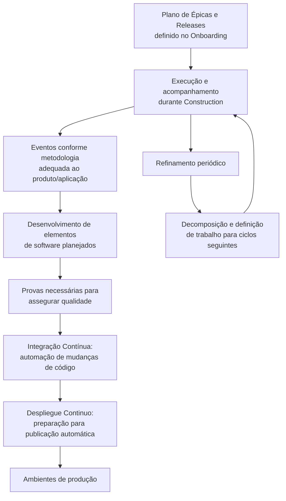

# Fase Construction — Documentação Reef sobre Execução de Sprints, CI/CD e Entregas de Software

## 1. Metadados do Documento
- **Arquivo de Origem:** Nome do arquivo não informado no conteúdo extraído.
- **Tipo de Documento:** Procedimento / documentação de processo de desenvolvimento.
- **Domínio / Sistema:** Reef / Documentación Reef / Mapfredocument.
- **Público-Alvo:** Desenvolvedores, equipes de entrega, operação e responsáveis por produtos ou aplicações.
- **Data/Versão Identificada:** Não identificada.
- **Owner Identificado:** `agonzalez_mapfre.com`
- **Lifecycle Identificado:** `Approved Source`

---

## 2. Resumo Executivo & Contexto de Negócio

O documento descreve a fase **Construction** do processo apresentado na documentação Reef. Durante essa fase, são gerados os elementos da aplicação por meio da execução dos sprints e da aplicação de uma estratégia de **CI/CD**, com o objetivo de facilitar a evolução do software desenvolvido até uma versão funcional.

A fase Construction determina que a execução deve acompanhar o Plano de Épicas e Releases previamente definido durante a fase de Onboarding. Esse plano pode ser adaptado conforme a evolução do produto ou da aplicação, indicando que o planejamento de entrega permanece sujeito a revisão durante a construção.

O processo também prevê a realização dos eventos metodológicos mais adequados ao produto ou aplicação, a geração dos elementos de software planejados e a execução das provas necessárias para assegurar a qualidade da entrega. O conteúdo associa essas atividades, respectivamente, às áreas de Eventos e Desenvolvimento.

A automação é um aspecto central da fase Construction. O documento cita a automação das mudanças de código para favorecer a colaboração de múltiplos contribuidores em um único produto ou aplicação, além da identificação e preparação de um modelo de implantação apropriado para publicação automática em ambientes de produção.

Por fim, a etapa inclui refinamento periódico durante toda a construção. Esse refinamento envolve decompor e definir elementos de trabalho que serão abordados em ciclos posteriores, mantendo o backlog ou conjunto de atividades preparado para os próximos sprints.

---

## 3. Arquitetura, Componentes & Tecnologias Envolvidas

O conteúdo não descreve uma arquitetura de software detalhada, como microsserviços, APIs, bancos de dados, protocolos, URLs de ambiente, portas ou contratos de integração. A arquitetura identificável é exclusivamente a arquitetura processual da fase Construction.

Os elementos explicitamente citados são:

| Componente / Conceito | Papel identificado no documento |
| :--- | :--- |
| Construction | Fase em que são gerados os elementos da aplicação mediante execução do sprint e estratégia CI/CD. |
| Sprint | Mecanismo de execução usado para gerar os elementos da aplicação. |
| CI/CD | Estratégia aplicada para facilitar a passagem do software desenvolvido para uma versão funcional. |
| Plano de Épicas e Releases | Plano previsto na fase Onboarding, que deve ser executado, acompanhado e adaptado à evolução do produto ou aplicação. |
| Eventos | Eventos previstos conforme a metodologia que melhor se adapte ao produto ou aplicação. |
| Desenvolvimento | Atividade de geração dos elementos de software planejados, incluindo provas necessárias para qualidade. |
| Integração Contínua | Atividade de automação das mudanças de código para colaboração de vários contribuidores. |
| Despliegue Continuo | Atividade de identificar e preparar o tipo de implantação adequado para publicação automática em produção. |
| Refinamento | Decomposição e definição periódica dos elementos de trabalho para ciclos seguintes. |
| Reef | Contexto de documentação onde a fase Construction é apresentada. |
| Mapfredocument | Nome exibido no conteúdo de navegação da documentação. |



> **Nota de Análise:** O documento menciona CI/CD, Integração Contínua e Despliegue Continuo, mas não detalha ferramentas, pipelines, repositórios, gatilhos, ambientes não produtivos, critérios de aprovação ou mecanismos técnicos de rollback.

---

## 4. Regras de Negócio, Especificações Funcionais & Processos

### 4.1. Objetivo da fase Construction

Durante a fase Construction, devem ser gerados todos os elementos da aplicação mediante:

1. Execução do sprint.
2. Aplicação da estratégia CI/CD.
3. Evolução do software desenvolvido para uma versão funcional.

### 4.2. Execução, acompanhamento e adaptação do Plano de Épicas e Releases

A fase Construction exige executar e acompanhar o Plano de Épicas e Releases previsto na fase de Onboarding.

A fase Construction também exige adaptar o Plano de Épicas e Releases à evolução do produto ou aplicação. O documento não define critérios objetivos, responsáveis, periodicidade ou processo formal de aprovação para essa adaptação.

- **Atividade relacionada no documento:** Plan de Épicas.
- **Entrada identificada:** Plano de Épicas e Releases previsto no Onboarding.
- **Ação requerida:** Executar, acompanhar e adaptar o plano.
- **Condição de adaptação:** Evolução do produto ou aplicação.

### 4.3. Realização de eventos metodológicos

Devem ser realizados os eventos previstos conforme a metodologia que melhor se adapte ao produto ou aplicação.

O conteúdo não identifica quais metodologias podem ser adotadas, não lista os eventos obrigatórios e não informa participantes, frequência, duração ou artefatos gerados.

- **Atividade relacionada no documento:** Eventos.
- **Critério apresentado:** Adequação da metodologia ao produto ou aplicação.

### 4.4. Desenvolvimento e qualidade da entrega

A fase Construction exige gerar os elementos de software planejados. Esses elementos devem incluir as provas necessárias para assegurar a qualidade da entrega.

O documento estabelece a necessidade das provas, mas não define tipos de teste, ferramentas, cobertura, critérios de aceite, métricas de qualidade ou responsáveis pela aprovação.

- **Atividade relacionada no documento:** Desarrollo.
- **Resultado esperado:** Elementos de software planejados com provas necessárias para assegurar a qualidade da entrega.

### 4.5. Integração Contínua

A fase Construction exige assegurar a automação das mudanças de código. A finalidade explicitamente indicada é favorecer a colaboração de vários contribuidores em um único produto ou aplicação.

- **Atividade relacionada no documento:** Integración Continua.
- **Objeto automatizado:** Mudanças de código.
- **Objetivo operacional:** Favorecer colaboração entre vários contribuidores.
- **Escopo declarado:** Um único produto ou aplicação.

### 4.6. Despliegue Continuo

A fase Construction exige identificar e preparar o tipo de implantação adequado para publicação automática em ambientes de produção.

O documento não especifica quais modelos de implantação podem ser utilizados, nem detalha ambientes, pipelines, janelas de publicação, controles de segurança, autorização de produção ou estratégias de reversão.

- **Atividade relacionada no documento:** Despliegue Continuo.
- **Ação requerida:** Identificar e preparar o tipo de implantação adequado.
- **Resultado esperado:** Publicação automática em ambientes de produção.

### 4.7. Refinamento contínuo

Durante toda a etapa de construção, deve ser realizado periodicamente o refinamento, incluindo:

1. Decomposição dos elementos de trabalho.
2. Definição dos elementos de trabalho.
3. Preparação dos elementos de trabalho para abordagem nos ciclos seguintes.

- **Atividade relacionada no documento:** Refinamiento.
- **Periodicidade declarada:** Periodicamente e durante toda a etapa de construção.
- **Finalidade:** Abordar os elementos de trabalho nos ciclos seguintes.

---

## 5. Tabelas de Parâmetros, Ambientes e Estruturas de Dados

| Item / Parâmetro | Descrição / Função | Tipo / Valores / Formato | Ambiente / Observações |
| :--- | :--- | :--- | :--- |
| Fase | Etapa descrita pelo documento. | `Construction` | Geração dos elementos da aplicação. |
| Mecanismo de execução | Forma pela qual os elementos da aplicação são gerados. | Execução do sprint | Não há detalhamento de duração, cadência ou metodologia do sprint. |
| Estratégia de entrega | Estratégia que facilita o avanço do software para uma versão funcional. | `CI/CD` | Ferramentas e configuração não informadas. |
| Plano de Épicas e Releases | Plano a executar, acompanhar e adaptar. | Plano previsto no Onboarding | Deve ser adaptado à evolução do produto ou aplicação. |
| Eventos | Eventos previstos pela metodologia adotada. | Metodologia mais adequada ao produto ou aplicação | Tipos de eventos não informados. |
| Elementos de software | Artefatos de software planejados a serem gerados. | Não especificado | Devem conter as provas necessárias para qualidade da entrega. |
| Provas | Evidências ou testes necessários para assegurar qualidade. | Não especificado | Tipos, cobertura e critérios não detalhados. |
| Automação de código | Automação das mudanças de código. | Integração Contínua | Visa colaboração de vários contribuidores em um único produto ou aplicação. |
| Tipo de implantação | Modelo de implantação a identificar e preparar. | Não especificado | Deve permitir publicação automática em ambientes de produção. |
| Publicação automática | Publicação resultante da preparação de implantação. | Automática | Ambientes de produção; nomes e URLs não informados. |
| Refinamento | Decomposição e definição de trabalho futuro. | Processo periódico | Deve ocorrer durante toda a etapa de construção. |
| Owner | Responsável exibido na documentação. | `agonzalez_mapfre.com` | O texto não esclarece se o valor representa usuário, e-mail ou identificador corporativo. |
| Lifecycle | Estado exibido na documentação. | `Approved Source` | O documento não define o significado operacional desse estado. |
| Plataforma documental | Contexto de navegação exibido no conteúdo bruto. | Reef / Mapfredocument | Menus exibidos: Soluciones, Arquitecturas, APIs, Componentes, Cloud, Documentación, Zeus, Reef e Ayuda. |

---

## 6. Bateria de Perguntas & Respostas para RAG (FAQ Sintético)

### P1: Qual é o objetivo da fase Construction na documentação Reef?
**R:** A fase Construction tem como objetivo gerar todos os elementos da aplicação por meio da execução dos sprints e da aplicação de uma estratégia CI/CD. Segundo o documento, essa estratégia facilita a passagem do software desenvolvido para uma versão funcional.

### P2: O que deve acontecer com o Plano de Épicas e Releases durante a fase Construction?
**R:** O Plano de Épicas e Releases, previsto na fase de Onboarding, deve ser executado e acompanhado durante a fase Construction. O plano também deve ser adaptado conforme a evolução do produto ou aplicação.

### P3: A documentação define qual metodologia ágil deve ser usada na fase Construction?
**R:** Não. O documento determina que sejam celebrados os eventos previstos segundo a metodologia que melhor se adapte ao produto ou aplicação, mas não nomeia metodologias específicas nem define seus ritos.

### P4: Como a qualidade da entrega deve ser tratada na fase Construction?
**R:** Os elementos de software planejados devem ser gerados com as provas necessárias para assegurar a qualidade da entrega. O documento não detalha quais provas ou testes são obrigatórios, nem define métricas de qualidade.

### P5: Qual é a finalidade da Integração Contínua no processo descrito?
**R:** A Integração Contínua deve assegurar a automação das mudanças de código para favorecer a colaboração de vários contribuidores em um único produto ou aplicação.

### P6: O que o documento exige em relação ao Despliegue Continuo?
**R:** O documento exige identificar e preparar o tipo de implantação adequado para permitir a publicação automática nos ambientes de produção. Não são informadas ferramentas, estratégias de implantação ou nomes dos ambientes.

### P7: O que é feito durante o Refinamento na fase Construction?
**R:** Durante toda a etapa de construção, o Refinamento deve ser realizado periodicamente para decompor e definir os elementos de trabalho que serão abordados nos ciclos seguintes.

### P8: Quais são as atividades explicitamente detalhadas como parte da fase Construction?
**R:** O documento relaciona as atividades de Plano de Épicas, Eventos, Desenvolvimento, Integração Contínua, Despliegue Continuo e Refinamento.

### P9: O documento informa ferramentas específicas de CI/CD?
**R:** Não. O texto apenas menciona a aplicação de uma estratégia CI/CD e a automação das mudanças de código no contexto de Integração Contínua. Nenhuma ferramenta, servidor, repositório ou configuração técnica é identificada.

### P10: Existem URLs, servidores, portas ou nomes de ambientes de produção no documento?
**R:** Não. O documento menciona publicação automática em ambientes de produção, mas não fornece URLs, servidores, portas, nomes de ambientes ou dados de acesso.

### P11: Quem é o owner identificado no conteúdo extraído?
**R:** O campo Owner exibido no conteúdo é `agonzalez_mapfre.com`. O documento não explica se esse valor representa um usuário, um endereço de e-mail ou outro identificador corporativo.

### P12: Qual estado de ciclo de vida aparece na documentação?
**R:** O conteúdo exibe o campo Lifecycle com o valor `Approved Source`. O significado detalhado desse estado não é definido no texto fornecido.

---

## 7. Glossário de Termos, Siglas & Conceitos-Chave

- **CI/CD:** Estratégia citada como facilitadora da passagem do software desenvolvido para uma versão funcional. O documento não expande formalmente a sigla.
- **Construction:** Fase em que são gerados os elementos da aplicação mediante execução do sprint e aplicação da estratégia CI/CD.
- **Sprint:** Unidade de execução mencionada para geração dos elementos da aplicação.
- **Plano de Épicas e Releases:** Plano previsto durante Onboarding, que deve ser executado, acompanhado e adaptado conforme a evolução do produto ou aplicação.
- **Épicas:** Termo presente no nome do plano; o documento não apresenta definição adicional.
- **Releases:** Termo presente no nome do plano; o documento não apresenta definição adicional.
- **Onboarding:** Fase em que o Plano de Épicas e Releases é previsto.
- **Eventos:** Eventos a serem realizados conforme a metodologia mais adequada ao produto ou aplicação.
- **Desarrollo / Desenvolvimento:** Atividade de geração dos elementos de software planejados, com provas para qualidade da entrega.
- **Integración Continua / Integração Contínua:** Atividade de automação das mudanças de código para favorecer a colaboração de vários contribuidores.
- **Despliegue Continuo:** Atividade de identificação e preparação do tipo de implantação adequado à publicação automática em produção.
- **Refinamiento / Refinamento:** Decomposição e definição periódica de elementos de trabalho para ciclos seguintes.
- **Reef:** Contexto da documentação apresentada no conteúdo extraído.
- **Mapfredocument:** Nome exibido no conteúdo de navegação da documentação.
- **Approved Source:** Valor exibido para Lifecycle; não definido adicionalmente no documento.

---

## 8. Notas Críticas, Riscos & Limitações

- O conteúdo apresenta um processo de alto nível e não detalha a implementação técnica da estratégia CI/CD.
- Não há identificação de ferramentas de versionamento, integração contínua, entrega contínua, testes, observabilidade, gestão de artefatos ou automação de infraestrutura.
- Não foram informados critérios objetivos de qualidade, cobertura de testes, tipos de prova, aprovações, responsáveis, métricas ou Definition of Done.
- O documento cita publicação automática em ambientes de produção, mas não define ambientes, URLs, servidores, permissões, políticas de mudança, validações de segurança ou procedimentos de rollback.
- O processo de adaptação do Plano de Épicas e Releases à evolução do produto ou aplicação não possui, no conteúdo fornecido, regras de governança, responsáveis ou mecanismo de aprovação.
- A documentação não lista eventos concretos, metodologias permitidas ou obrigatórias, participantes ou periodicidade dos eventos.
- O texto extraído contém caracteres aparentando corrupção de codificação, como `planicados`, `Identicar`, `denición` e `Renamiento`. Esses trechos foram preservados na referência fiel.
- **Nota de Análise:** O documento lista Integração Contínua e Despliegue Continuo, porém não detalha pipeline, métodos de disparo, contratos, ferramentas, repositórios, artefatos ou fluxos de aprovação.

---

## 9. Conteúdo Bruto Estruturado (Referência Fiel)

```text
--- [PÁGINA 1 DE 1] ---

FASE CONSTRUCTION
CONSTRUCTION
Durante la fase de Contruction se generan todos los
elementos de la aplicación mediante la ejecución
del sprint, y aplicando la estrategia CI/CD, que
facilita el paso del software desarrollado a una
versión funcional.
Las actividades que se realizan en esta fase son:
Ejecutar y seguir el Plan de Épicas y
Releases previsto en la fase de
Onboarding y adaptar el Plan a la
evolución del producto / aplicación.
Esta actividad se detalla en: Plan de
Épicas
Celebrar los eventos previstos según la
metodología que mejor se adapte al
producto / aplicación.
Esta actividad se detalla en: Eventos
Generar los elementos de software
planicados con las pruebas necesarias
para asegurar la Calidad de la entrega.
Esta actividad se detalla en: Desarrollo
Asegurar la automatización de los
cambios de código para favorecer la
colaboración de varios contribuidores en
un único producto / aplicación.
Esta actividad se detalla en: Integración
Continua
Identicar y preparar el tipo de
despliegue adecuado para la publicación
automática en los entornos de
producción.
Esta actividad se detalla en: Despliegue
Continuo
Realizar periódicamente y durante toda la
etapa de construcción la descomposición
y denición de los elementos de trabajo
para abordarlos en los siguientes ciclos
Esta actividad se detalla en: Renamiento
Documentation / DOCUMENTACIÓN Reef
DOCUMENTACIÓN Reef
Mapfredocument
DOCUMENTACIÓN Reef
Owner
user:agonzalez_mapfre.com
Lifecycle
Approved Source
 / 
 VL
Buscar Inicio Soluciones Arquitecturas APIs Componentes Cloud Documentación Zeus Reef Ayuda
ES
```
