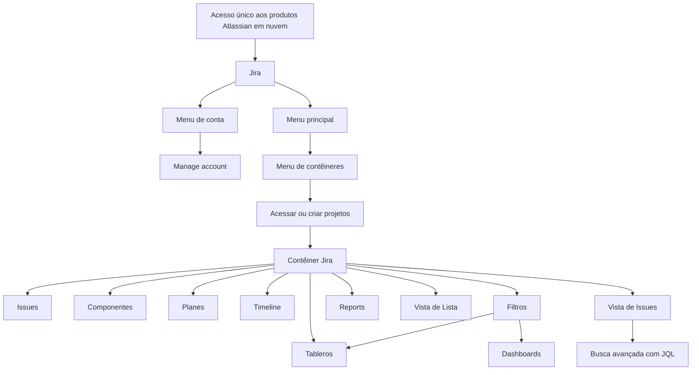

# Guia Básico de Jira na MAPFRE: Acesso, Contêineres, Issues, Visualizações e Recursos de Gestão

## 1. Metadados do Documento
- **Arquivo de Origem:** `Não informado no conteúdo fornecido`
- **Tipo de Documento:** `Procedimento / Guia de uso`
- **Domínio / Sistema:** `Jira na MAPFRE`
- **Público-Alvo:** `Usuários de Jira, equipes de produto, desenvolvedores, gestores e operação`
- **Data/Versão Identificada:** `Não identificada`

---

## 2. Resumo Executivo & Contexto de Negócio

O documento apresenta conhecimento básico sobre o uso de Jira na MAPFRE. O conteúdo cobre a estrutura de contêineres, a criação e o tratamento de issues, o acesso à plataforma, menus de navegação e recursos para organização, acompanhamento e consulta do trabalho.

O acesso a Jira é descrito como único para todos os produtos Atlassian em nuvem. Após o acesso, o usuário pode utilizar o menu de conta para configurar a ferramenta de acordo com suas necessidades, incluindo o acesso à opção **“Manage account”** por meio do ícone de perfil.

A documentação destaca que as guias de uso de Jira na MAPFRE são adaptadas às diferentes tipologias de projetos. Essas guias detalham tipos de issues, criação de issues, regras, campos obrigatórios, fluxos, restrições de transição, papéis, permissões e notificações.

O documento também registra a atualização da licença para **Jira Enterprise** durante o ano referido, indicando que novas funcionalidades passam a aparecer por padrão, sem necessidade de atualização pelos usuários. Não há detalhamento adicional sobre quais funcionalidades Enterprise foram disponibilizadas.

Por fim, o material descreve recursos para gestão e visualização do trabalho em contêineres Jira, incluindo componentes, planos, Timeline, tableros, filtros, relatórios, vista de lista e vista de issues com pesquisa avançada por JQL.

---

## 3. Arquitetura, Componentes & Tecnologias Envolvidas

O documento não descreve uma arquitetura técnica de software, integração entre sistemas, APIs, infraestrutura, servidores ou contratos de dados. O conteúdo apresenta uma arquitetura funcional de navegação e organização do trabalho dentro de Jira na MAPFRE.

Os elementos funcionais citados são:

- **Jira:** ferramenta utilizada para trabalhar atividades e incidências denominadas issues.
- **Produtos Atlassian em nuvem:** contexto de acesso único mencionado para Jira.
- **Jira Enterprise:** licença atualizada que disponibiliza novas funcionalidades por padrão.
- **Contêineres Jira:** estruturas nas quais usuários acessam e/ou criam projetos.
- **Issues:** atividades ou incidências trabalhadas nos contêineres Jira.
- **Componentes:** mecanismo para agrupar e classificar issues de um contêiner.
- **Planes:** recurso para monitorar capacidade da equipe e visualizar status do trabalho em tempo real.
- **Timeline:** visualização para organizar hierarquias das issues de projetos.
- **Tableros de contenedor / boards:** fonte principal de informação para visualizar o avanço dos trabalhos.
- **Filtros:** consultas salvas que podem ser aplicadas a boards ou dashboards.
- **Reports:** modelos de informes dependentes do tipo de tablero.
- **List view:** visualização única em lista para explorar, ordenar, criar, editar e visualizar issues.
- **Issues view:** visualização de todas as issues ou filtros predefinidos, com compartilhamento, exportação, detalhamento e buscas avançadas com JQL.



> **Nota de Análise:** O documento cita Jira Enterprise, produtos Atlassian em nuvem, dashboards e JQL, mas não detalha versões, URLs, métodos de acesso, configurações, permissões técnicas, contratos de API ou mecanismos internos de integração.

---

## 4. Regras de Negócio, Especificações Funcionais & Processos

### 4.1 Acesso à plataforma

1. O acesso a Jira é único para todos os produtos Atlassian na nuvem.
2. O documento referencia informações adicionais por meio do item **“Acceso a Jira”**.
3. Não são fornecidos URL, método de autenticação, fluxo de login, grupos de acesso ou regras de provisionamento.

### 4.2 Configuração da conta

1. O menu de conta permite configurar a ferramenta conforme as necessidades do usuário.
2. O acesso ao menu de conta ocorre ao selecionar o ícone de perfil.
3. Após selecionar o ícone de perfil, o usuário deve selecionar **“Manage account”**.
4. O documento referencia o item **“Menú de cuenta”** para informações adicionais.

### 4.3 Guias de uso de Jira na MAPFRE

As guias de uso de Jira na MAPFRE são adaptadas às diferentes tipologias de projetos. Para cada tipologia, as guias detalham:

- Tipos de issues utilizados.
- Criação de cada tipo de issue.
- Regras de cada tipo de issue.
- Campos obrigatórios de cada tipo de issue.
- Fluxo de cada tipo de issue.
- Restrições das transições no fluxo de cada tipo de issue.
- Papéis envolvidos.
- Permissões.
- Notificações.

As guias identificadas no documento são:

1. **Guía de uso Jira para Orientación a Producto**
2. **Guía de uso de Jira para España**
3. **Guía de uso de Jira para Iniciativas y Dual Track**

> **Nota de Análise:** O documento lista as guias de uso, mas não apresenta o conteúdo das regras, os campos obrigatórios, os tipos de issue, os fluxos, as transições, os papéis, as permissões ou as notificações de cada guia.

### 4.4 Jira Enterprise

1. A licença foi atualizada para **Jira Enterprise** durante o ano mencionado no documento.
2. A atualização permitirá a disponibilidade de novas funcionalidades.
3. As novas opções aparecerão por padrão.
4. Não será necessária atualização por parte dos usuários.

> **Nota de Análise:** O documento não identifica o ano da atualização, a edição anterior, as funcionalidades Enterprise adicionadas, nem eventuais impactos em projetos já existentes.

### 4.5 Navegação e gestão de contêineres

1. Ao acessar Jira, o menu principal é exibido na parte superior da tela.
2. O menu principal permite navegar por diferentes partes da ferramenta.
3. O menu de contêineres permite acessar e/ou criar projetos.
4. O documento apresenta os tipos de contêineres mais utilizados, porém não enumera esses tipos no conteúdo fornecido.
5. As atividades e incidências trabalhadas em contêineres Jira são denominadas **issues**.

### 4.6 Organização e acompanhamento de issues

1. Componentes ajudam a agrupar e classificar issues de um contêiner.
2. A classificação por componentes organiza o conteúdo e facilita a filtragem.
3. Planes permitem monitorar a capacidade da equipe.
4. Planes fornecem visualização do status do trabalho em tempo real.
5. Timeline ajuda a visualizar os dados de projetos organizando as hierarquias das issues.
6. O tablero Jira é a fonte principal de informação para visualizar o progresso dos trabalhos.
7. Filtros permitem salvar consultas de interesse.
8. Filtros podem ser aplicados a boards ou dashboards.
9. Reports variam conforme o tipo de tablero do contêiner.

### 4.7 Visualizações de trabalho

#### Vista de Lista

1. A vista de lista ordena todo o trabalho de um contêiner em uma única lista.
2. A lista pode ser explorada rapidamente.
3. A lista pode ser ordenada por campos.
4. A vista de lista permite criar issues.
5. A vista de lista permite editar issues.
6. A vista de lista permite visualizar issues do contêiner.

#### Vista de Issues

1. A vista de issues permite visualizar todas as issues do contêiner.
2. A vista de issues permite acessar filtros predefinidos.
3. A vista de issues permite compartilhar.
4. A vista de issues permite exportar.
5. A vista de issues permite mudar para a visualização detalhada e consultar o resumo de cada issue.
6. A vista de issues permite buscas avançadas utilizando JQL.

---

## 5. Tabelas de Parâmetros, Ambientes e Estruturas de Dados

| Item / Parâmetro | Descrição / Função | Tipo / Valores / Formato | Ambiente / Observações |
| :--- | :--- | :--- | :--- |
| Acesso a Jira | Acesso único para todos os produtos Atlassian em nuvem. | Fluxo de acesso | URL, autenticação e regras de provisionamento não informados. |
| Menu de conta | Permite configurar a ferramenta conforme necessidades do usuário. | Menu de interface | Acesso pelo ícone de perfil e pela opção “Manage account”. |
| Jira Enterprise | Licença atualizada durante o ano mencionado. | Licença / edição | Novas funcionalidades aparecem por padrão; recursos específicos não detalhados. |
| Menu principal | Permite navegar por diferentes partes da ferramenta. | Menu de navegação | Exibido na parte superior da tela ao acessar Jira. |
| Menu de contêineres | Permite acessar e/ou criar projetos. | Menu de navegação | Tipos de contêineres são mencionados, mas não listados no conteúdo fornecido. |
| Contêiner Jira | Estrutura na qual são trabalhadas atividades e incidências. | Estrutura organizacional | Associada a projetos. |
| Issue | Denominação para atividades ou incidências trabalhadas nos contêineres Jira. | Entidade funcional | Tipos, regras, campos e fluxos dependem das guias aplicáveis. |
| Componentes | Agrupam e classificam issues do contêiner. | Mecanismo de organização | Facilitam a organização de conteúdo e a filtragem. |
| Planes | Monitoram a capacidade da equipe e mostram o status do trabalho. | Recurso de planejamento | Status exibido em tempo real, conforme descrito. |
| Timeline | Organiza hierarquias de issues de projetos para visualização dos dados. | Visualização | Sem detalhamento de campos ou configurações. |
| Tablero Jira / Board | Fonte principal de informação para visualizar o avanço dos trabalhos. | Visualização de acompanhamento | O documento usa os termos tablero e boards. |
| Filtros | Salvam consultas de interesse. | Consulta reutilizável | Podem ser aplicados a boards ou dashboards. |
| Dashboards | Destino possível para aplicação de filtros. | Painel | Não detalhado adicionalmente. |
| Reports | Representam dados do contêiner. | Relatórios | Existem modelos distintos conforme o tipo de tablero. |
| Vista de Lista | Exibe trabalho de um contêiner em lista única. | Visualização | Permite explorar, ordenar por campos, criar, editar e ver issues. |
| Vista de Issues | Exibe issues ou filtros predefinidos. | Visualização | Permite compartilhar, exportar, detalhar issues e pesquisar com JQL. |
| JQL | Recurso utilizado para buscas avançadas na vista de issues. | Linguagem ou mecanismo de consulta citado | A sigla não é expandida no documento fornecido. |

### Guias de uso de Jira identificadas

| Guia | Escopo indicado pelo nome | Conteúdo detalhado no documento |
| :--- | :--- | :--- |
| Guía de uso Jira para Orientación a Producto | Orientação a Produto | Apenas citada; conteúdo não fornecido. |
| Guía de uso de Jira para España | Espanha | Apenas citada; conteúdo não fornecido. |
| Guía de uso de Jira para Iniciativas y Dual Track | Iniciativas e Dual Track | Apenas citada; conteúdo não fornecido. |

### Elementos que as guias de uso devem detalhar

| Item | Descrição |
| :--- | :--- |
| Tipos de issues | Tipos de atividades ou incidências utilizados na tipologia de projeto. |
| Criação de issue | Processo de criação de cada tipo de issue. |
| Regras de issue | Regras aplicáveis a cada tipo de issue. |
| Campos obrigatórios | Campos mandatórios de cada tipo de issue. |
| Fluxo de issue | Fluxo de cada tipo de issue. |
| Restrições de transição | Restrições aplicáveis às transições do fluxo. |
| Papéis | Papéis que intervêm no processo. |
| Permissões | Permissões relacionadas aos papéis e às operações. |
| Notificações | Notificações relacionadas às tipologias de projeto e issues. |

---

## 6. Bateria de Perguntas & Respostas para RAG (FAQ Sintético)

### P1: Como é realizado o acesso ao Jira na MAPFRE?
**R:** O documento informa que o acesso a Jira é único para todos os produtos Atlassian na nuvem. Não são apresentados URL de acesso, método de autenticação, critérios de provisionamento ou grupos de usuários.

### P2: Como um usuário acessa as configurações de conta no Jira?
**R:** O usuário deve selecionar o ícone de perfil e, em seguida, selecionar a opção **“Manage account”**. O menu de conta permite configurar a ferramenta de acordo com as necessidades do usuário.

### P3: O que as guias de uso de Jira na MAPFRE detalham?
**R:** As guias detalham tipos de issues, criação de cada tipo de issue, regras, campos obrigatórios, fluxos, restrições de transições nos fluxos, papéis envolvidos, permissões e notificações. O conteúdo fornecido não apresenta as regras específicas de cada guia.

### P4: Quais guias de uso de Jira são citadas no documento?
**R:** O documento cita a **Guía de uso Jira para Orientación a Producto**, a **Guía de uso de Jira para España** e a **Guía de uso de Jira para Iniciativas y Dual Track**.

### P5: O que muda com a atualização para Jira Enterprise?
**R:** O documento informa que a licença foi atualizada para Jira Enterprise e que novas funcionalidades estarão disponíveis. As novas opções aparecerão por padrão, sem necessidade de atualização pelos usuários. As funcionalidades específicas não são identificadas.

### P6: Para que serve o menu de contêineres no Jira?
**R:** O menu de contêineres é utilizado para acessar e/ou criar projetos. O documento menciona tipos de contêineres mais utilizados, mas não lista quais são esses tipos no conteúdo disponível.

### P7: O que são issues no contexto dos contêineres Jira?
**R:** Issues são as diferentes atividades ou incidências trabalhadas nos contêineres Jira. O documento não apresenta uma lista de tipos de issue nem seus respectivos campos obrigatórios ou fluxos.

### P8: Como os componentes ajudam na organização de um contêiner Jira?
**R:** Componentes ajudam a agrupar e classificar as issues de um contêiner. Essa organização facilita a estruturação do conteúdo e a filtragem de issues.

### P9: Qual é a finalidade dos Planes no Jira?
**R:** Planes permitem monitorar a capacidade da equipe e fornecem uma visualização do status do trabalho em tempo real.

### P10: Qual é a diferença entre Timeline, tablero e vista de lista?
**R:** Timeline ajuda a organizar hierarquias de issues de projetos para visualizar dados. O tablero Jira é a fonte principal de informação para acompanhar o avanço dos trabalhos. A vista de lista organiza todo o trabalho de um contêiner em uma única lista, permitindo explorar, ordenar por campos, criar, editar e visualizar issues.

### P11: Como os filtros podem ser reutilizados no Jira?
**R:** Os filtros permitem salvar consultas de interesse e aplicá-las a tableros, também chamados boards, ou a dashboards.

### P12: Quais operações são possíveis na vista de issues?
**R:** A vista de issues permite visualizar todas as issues de um contêiner ou filtros predefinidos. Também permite compartilhar, exportar, alterar para a visualização detalhada do resumo de cada issue e realizar buscas avançadas utilizando JQL.

---

## 7. Glossário de Termos, Siglas & Conceitos-Chave

- **Atlassian:** conjunto de produtos em nuvem mencionado como contexto do acesso único a Jira.
- **Board / Tablero:** visualização descrita como fonte principal de informação para acompanhar o avanço dos trabalhos em Jira.
- **Componente:** mecanismo para agrupar e classificar issues de um contêiner.
- **Contêiner:** estrutura Jira utilizada para acessar e/ou criar projetos e trabalhar issues.
- **Dashboard:** painel ao qual filtros salvos podem ser aplicados.
- **Dual Track:** termo presente no nome de uma das guias de uso de Jira; não definido adicionalmente no documento.
- **Issue:** atividade ou incidência trabalhada em contêineres Jira.
- **Jira:** ferramenta abordada pelo documento para gestão de atividades e incidências.
- **Jira Enterprise:** licença de Jira citada como atualização que disponibiliza novas funcionalidades.
- **JQL:** mecanismo citado para realizar buscas avançadas na vista de issues; a expansão da sigla não é fornecida no documento.
- **List view / Vista de Lista:** visualização única que reúne o trabalho de um contêiner em uma lista.
- **Manage account:** opção utilizada para acessar configurações de conta.
- **Planes:** recurso para monitorar capacidade da equipe e visualizar status do trabalho em tempo real.
- **Reports:** modelos de informes para representar dados de um contêiner conforme o tipo de tablero.
- **Timeline:** visualização que organiza hierarquias de issues de projetos.

---

## 8. Notas Críticas, Riscos & Limitações

- O conteúdo é introdutório e não apresenta configurações técnicas, URLs, ambientes, servidores, APIs, integrações, versões de software, portas ou contratos de dados.
- As guias de uso de Jira na MAPFRE são citadas, mas os respectivos conteúdos não foram incluídos na extração fornecida.
- Os tipos de contêineres mais utilizados são mencionados, mas não são enumerados.
- Não há detalhamento dos tipos de issues, fluxos específicos, campos obrigatórios, regras de transição, matrizes de permissão, papéis ou notificações.
- Jira Enterprise é mencionado sem identificação das funcionalidades adicionadas, da data da atualização ou da versão anterior.
- O termo JQL é citado exclusivamente como recurso de busca avançada; sua definição ou sintaxe não está presente no documento.
- A extração contém caracteres corrompidos ou não renderizados, representados por ``, em termos como “filtros”, “flujo”, “configurar” e “notificaciones”. A interpretação semântica foi limitada ao contexto textual fornecido.
- Não há notas do apresentador disponíveis no conteúdo fornecido.

---

## 9. Conteúdo Bruto Estruturado (Referência Fiel)

```text
--- [PÁGINA 1 DE 3] ---

JIRA BASIC
JIRA BASIC
Conocimiento básico de Jira: estructura del contenedor, creación de issues, uso de ltros...
Acceso a Jira
El acceso será único para todos los
productos Atlassian en la nube.
Mas información en: Acceso a Jira
Menú de cuenta
El menú de cuenta permite congurar
la herramienta según las necesidades
del usuario. Se accede pulsando el
icono del perl y pulsando en
"Manage account": Menú de cuenta
Jira
Guías de uso de Jira en MAPFRE
Las guías de uso de Jira están adaptadas
a las distintas tipologías de proyectos que
se abordan en MAPFRE. En ellas se detalla
para cada tipología: - tipos de issues
utlizados - creación de cada tipo de issue -
reglas de cada tipo de issue - campos
obligatorios de cada tipo de issue - ujo
de cada tipo de issue - restricciones de las
transiciones en el ujo de cada tipo de
issue - roles que intervienen, permisos y
noticaciones
Las guías de uso de Jira en MAPFRE son:
Guía de uso Jira para Orientación a
Producto
Guía de uso de Jira para España
Guía de uso de Jira para Iniciativas y
Dual Track
Jira Enterprise
Durante este año se ha actualizado la
licencia a Jira Enterprise, lo que nos
permitirá disponer de nuevas
funcionalidades. Las nuevas opciones
aparecerán por defecto, es decir, será
necesaria ninguna actualización por parte
de los usuarios.
Menú principal
Al acceder al Jira, el menú principal se
muestra en la parte superior de la
pantalla. En este menú podemos
navegar por distintas partes de la
herramienta: Menú principal Jira
Menú de contenedor
En el menú de contenedores es donde
vamos acceder y/o crear proyectos:
Menú contenedor Jira
Tipos de contenedor
En esta sección se presentan los tipos
de contenedores más utlizados en
Documentation / DOCUMENTACIÓN Reef
DOCUMENTACIÓN Reef
Mapfredocument
DOCUMENTACIÓN Reef
Owner
user:agonzalez_mapfre.com
Lifecycle
Approved Source
 / 
 VL
Buscar Inicio Soluciones Arquitecturas APIs Componentes Cloud Documentación Zeus Reef Ayuda
ES


--- [PÁGINA 2 DE 3] ---

MAPFRE: Tipos de contenedor
Tipos de issues
Las distintas actividades/incidencias
que vamos a trabajar en los
contenedores Jira se denominan
Issues: Tipos de issues Jira
Componentes
Trabajar con componentes ayuda a
agrupar y clasicar las issues del
contenedor para organizar el
contenido y facilitar el ltrado.
Componentes Jira
Planes
Los planes permiten monitorizar la
capacidad del equipo y proporcionan
la visualización del status del trabajo
en tiempo real. Planes Jira
Timeline
La vista de Timeline de los proyectos
ayuda en la manera que vemos los
datos, organizando las jerarquías de
las issues: Timeline Jira
Tableros de contenedor
El tablero Jira es la fuente principal de
información para visualizar el avance
de los trabajos en Jira: Tableros de
contenedor
Filtros
Utilizando los ltros podemos guardar
las consultas que más nos interesen y
aplicarlas a tableros (boards) o
dashboards: Filtros Jira
Reports
Según el tipo de tablero dentro del
contenedor, hay modelos de informes
distintos para representar los datos
del contenedor: Reports Jira
Vista de Lista


--- [PÁGINA 3 DE 3] ---

Esta vista ordena todo el trabajo de un
contenedor en una única lista que se
puede explorar rápidamente y ordenar
por campos. También se puede
utilizar para crear, editar y ver issues
del contenedor. List view Jira
Vista de Issues
En ese Menú se pueden visualizar
todas las issues del contenedor, o
acceder a alguno de los ltros
predeterminados. También permite
compartir, exportar, cambiar la vista a
detallada para ver el resumen de cada
issue, y hacer búsquedas avanzadas
utilizando JQL. Issues view
```
