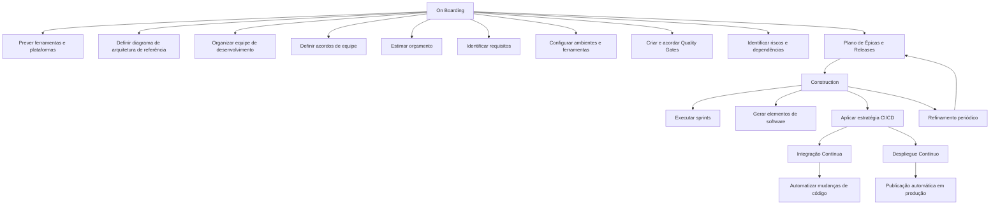

# Fases de On Boarding e Construction para Desenvolvimento de Produtos/Aplicações MAPFRE

## 1. Metadados do Documento
- **Arquivo de Origem:** Não identificado no conteúdo fornecido
- **Tipo de Documento:** Procedimento
- **Domínio / Sistema:** MAPFRE — documentação Reef
- **Público-Alvo:** Desenvolvedores, Arquitetos, Operação e equipes envolvidas no produto/aplicação
- **Data/Versão Identificada:** Não identificada
- **Owner identificado:** `user:agonzalez_mapfre.com`
- **Lifecycle identificado:** Approved
- **Fonte identificada:** Source / VL

---

## 2. Resumo Executivo & Contexto de Negócio

O documento descreve duas fases do ciclo de criação de produtos ou aplicações: **On Boarding** e **Construction**. A fase de On Boarding prepara as condições organizacionais, técnicas e operacionais necessárias para iniciar o desenvolvimento de uma solução.

Durante o On Boarding, as equipes devem prever ferramentas e plataformas, definir um diagrama de arquitetura de referência, organizar a equipe de desenvolvimento e estabelecer acordos de equipe sob um orçamento estimado. O processo também exige entrevistas com equipes envolvidas para identificar necessidades, ambientes e ferramentas.

A fase de Construction trata da geração dos elementos da aplicação por meio da execução de sprints e da aplicação de uma estratégia de CI/CD. O objetivo declarado é facilitar a passagem do software desenvolvido para uma versão funcional e preparar a publicação automática nos ambientes de produção.

O documento posiciona qualidade, automação, planejamento de épicas e releases, refinamento contínuo, identificação de riscos e gestão de dependências como aspectos permanentes do ciclo de desenvolvimento. Não apresenta detalhamento adicional sobre ferramentas específicas, contratos técnicos, ambientes nomeados, indicadores de qualidade ou processos de aprovação.

---

## 3. Arquitetura, Componentes & Tecnologias Envolvidas

O documento não especifica microsserviços, linguagens de programação, bancos de dados, provedores de nuvem, URLs, servidores ou ferramentas concretas. Os elementos técnicos e organizacionais explicitamente mencionados são:

- Produto / aplicação.
- Ferramentas e plataformas necessárias ao desenvolvimento.
- Diagrama de arquitetura de referência.
- Equipes de desenvolvimento.
- Ambientes de execução.
- Quality Gates.
- Plano de épicas e releases.
- Sprints.
- Estratégia de CI/CD.
- Integração Contínua.
- Despliegue Contínuo.
- Ambientes de produção.
- Refinamento de elementos de trabalho.
- Documentação Reef e plataforma MAPFRE.



**Nota de Análise:** O documento menciona uma estratégia de CI/CD, mas não detalha pipeline, ferramentas, repositórios, gatilhos, políticas de branch, testes automatizados, mecanismos de rollback ou configurações de ambientes.

---

## 4. Regras de Negócio, Especificações Funcionais & Processos

### 4.1. Fase de On Boarding

Durante a fase de On Boarding devem ser realizadas as seguintes atividades:

1. Prever as ferramentas e plataformas necessárias para desenvolver o produto.
2. Definir o diagrama de arquitetura de referência.
3. Organizar a equipe de desenvolvimento.
4. Definir os acordos de equipe sob um orçamento estimado.
5. Realizar entrevistas com as equipes envolvidas.
6. Identificar necessidades, ambientes ou ferramentas para a criação da solução.
7. Conhecer o nível de maturidade da equipe participante do projeto.
8. Identificar requisitos.
9. Documentar, validar e priorizar os requisitos identificados.
10. Definir equipes de desenvolvimento e ferramentas necessárias.
11. Conhecer e utilizar as plataformas disponíveis na MAPFRE.
12. Configurar e preparar todos os ambientes e ferramentas para execução da aplicação ou produto.
13. Criar e acordar Quality Gates para assegurar a qualidade da aplicação ou produto.
14. Identificar riscos.
15. Identificar dependências entre equipes.

### 4.2. Referências internas da fase de On Boarding

| Atividade | Referência indicada pelo documento |
| :--- | :--- |
| Entrevistas com equipes e identificação de necessidades | Primeros pasos |
| Identificação, documentação, validação e priorização de requisitos | Plan, Requisitos, Aplicaciones, Backlog y Releases |
| Definição de equipes e ferramentas | Recursos |
| Uso de plataformas MAPFRE | Plataformas |
| Preparação de ambientes e ferramentas | Configuración |
| Criação e acordo de Quality Gates | Quality Gates |
| Identificação de riscos e dependências | Identificar Riesgos y Dependencias |

### 4.3. Fase de Construction

Durante a fase de Construction, são gerados os elementos da aplicação por meio da execução do sprint. A estratégia de CI/CD deve ser aplicada para facilitar a passagem do software desenvolvido para uma versão funcional.

As atividades declaradas para Construction são:

1. Executar e acompanhar o Plano de Épicas e Releases previsto na fase de On Boarding.
2. Adaptar o Plano de Épicas e Releases à evolução do produto ou aplicação.
3. Realizar os eventos previstos segundo a metodologia mais adequada ao produto ou aplicação.
4. Gerar os elementos de software planejados.
5. Executar as provas necessárias para assegurar a qualidade da entrega.
6. Automatizar as mudanças de código.
7. Favorecer a colaboração de múltiplos contribuidores em um único produto ou aplicação.
8. Identificar e preparar o tipo de despliegue apropriado.
9. Preparar a publicação automática nos ambientes de produção.
10. Realizar periodicamente a decomposição e definição dos elementos de trabalho.
11. Preparar os elementos de trabalho para abordagem nos ciclos seguintes.

### 4.4. Referências internas da fase de Construction

| Atividade | Referência indicada pelo documento |
| :--- | :--- |
| Execução e acompanhamento do plano | Plan de Épicas |
| Realização de eventos de metodologia | Eventos |
| Desenvolvimento e testes necessários | Desarrollo |
| Automação de mudanças de código | Integración Continua |
| Preparação de publicação automática em produção | Despliegue Continuo |
| Decomposição e definição periódica do trabalho | Refinamiento |

---

## 5. Tabelas de Parâmetros, Ambientes e Estruturas de Dados

| Item / Parâmetro | Descrição / Função | Tipo / Valores / Formato | Ambiente / Observações |
| :--- | :--- | :--- | :--- |
| On Boarding | Fase de preparação do desenvolvimento do produto ou aplicação | Fase do ciclo de trabalho | Antecede a fase de Construction |
| Construction | Fase de geração dos elementos da aplicação | Fase do ciclo de trabalho | Inclui execução de sprints e estratégia CI/CD |
| Ferramentas | Recursos necessários para desenvolver o produto | Não detalhado | Devem ser previstas no On Boarding |
| Plataformas | Plataformas disponíveis para uso na MAPFRE | Não detalhado | Devem ser conhecidas e utilizadas |
| Arquitetura de referência | Diagrama de arquitetura a ser definido | Diagrama | Deve ser definido no On Boarding |
| Equipe de desenvolvimento | Equipe responsável pelo desenvolvimento | Organização de pessoas | Deve ser organizada e definida |
| Acordos de equipe | Acordos para execução do trabalho | Não detalhado | Definidos sob orçamento estimado |
| Orçamento estimado | Base financeira associada aos acordos de equipe | Não detalhado | Mencionado no On Boarding |
| Requisitos | Necessidades a serem documentadas, validadas e priorizadas | Requisitos de produto/aplicação | Referência: Plan, Requisitos, Aplicaciones, Backlog y Releases |
| Ambientes | Ambientes necessários para execução da aplicação ou produto | Não detalhado | Devem ser configurados e preparados |
| Quality Gates | Gates acordados para assegurar a qualidade | Critérios de qualidade não detalhados | Devem ser criados e acordados |
| Riscos | Riscos do projeto ou produto | Não detalhado | Devem ser identificados |
| Dependências entre equipes | Relações de dependência entre equipes | Não detalhado | Devem ser identificadas |
| Plano de Épicas e Releases | Plano executado, acompanhado e adaptado durante Construction | Plano de trabalho | Previsto inicialmente no On Boarding |
| Sprint | Mecanismo de execução para gerar elementos da aplicação | Ciclo de trabalho | Executado durante Construction |
| Estratégia CI/CD | Estratégia que facilita a transição para versão funcional | Integração e despliegue contínuos | Não há ferramentas ou pipeline especificados |
| Integração Contínua | Automação das mudanças de código para colaboração entre contribuidores | Prática de CI | Referência: Integración Continua |
| Despliegue Contínuo | Preparação de publicação automática em produção | Prática de CD | Referência: Despliegue Continuo |
| Ambientes de produção | Destino da publicação automática | Ambiente | Sem nomes, URLs ou configurações |
| Refinamento | Decomposição e definição periódica dos elementos de trabalho | Atividade contínua | Prepara ciclos seguintes |
| Owner | Proprietário registrado na documentação | `user:agonzalez_mapfre.com` | Metadado da documentação Reef |
| Lifecycle | Estado do ciclo de vida do documento | Approved | Metadado da documentação Reef |
| Source | Fonte registrada no documento | VL | Metadado da documentação Reef |

---

## 6. Bateria de Perguntas & Respostas para RAG (FAQ Sintético)

### P1: Qual é o objetivo da fase de On Boarding no processo descrito?
**R:** A fase de On Boarding prepara as condições necessárias para desenvolver um produto ou aplicação. Essa preparação inclui prever ferramentas e plataformas, definir o diagrama de arquitetura de referência, organizar a equipe de desenvolvimento, definir acordos de equipe com base em um orçamento estimado, identificar requisitos, configurar ambientes, estabelecer Quality Gates e identificar riscos e dependências entre equipes.

### P2: Como os requisitos devem ser tratados durante o On Boarding?
**R:** Os requisitos devem ser identificados, documentados, validados e priorizados. O documento aponta como referência interna os temas Plan, Requisitos, Aplicaciones, Backlog y Releases, mas não especifica um formato documental, ferramenta de backlog ou critérios de priorização.

### P3: Por que são realizadas entrevistas com equipes envolvidas durante o On Boarding?
**R:** As entrevistas servem para identificar necessidades, ambientes e ferramentas necessárias para a criação da solução. Também permitem conhecer o nível de maturidade da equipe que participará do projeto.

### P4: O que deve ser definido em relação à arquitetura do produto ou aplicação?
**R:** Deve ser definido um diagrama de arquitetura de referência durante a fase de On Boarding. O documento não apresenta componentes, padrões arquiteturais, tecnologias, integrações ou detalhes do conteúdo desse diagrama.

### P5: Qual é a finalidade dos Quality Gates mencionados no documento?
**R:** Os Quality Gates devem ser criados e acordados para assegurar a qualidade da aplicação ou produto a ser realizado. O documento não define métricas, critérios de aprovação, responsáveis, ferramentas de análise ou consequências para falhas nos Quality Gates.

### P6: O que ocorre na fase de Construction?
**R:** Na fase de Construction são gerados os elementos da aplicação por meio da execução do sprint. A fase inclui seguir e adaptar o Plano de Épicas e Releases, realizar eventos conforme a metodologia mais adequada, gerar software planejado com as provas necessárias, automatizar mudanças de código, preparar o despliegue e realizar refinamento periódico do trabalho.

### P7: Como o documento caracteriza a estratégia de CI/CD?
**R:** A estratégia de CI/CD é apresentada como um mecanismo que facilita a passagem do software desenvolvido para uma versão funcional. A Integração Contínua automatiza mudanças de código para favorecer a colaboração de vários contribuidores, enquanto o Despliegue Contínuo prepara a publicação automática nos ambientes de produção.

### P8: Qual é o papel da Integração Contínua no processo?
**R:** A Integração Contínua deve assegurar a automação das mudanças de código, favorecendo a colaboração de vários contribuidores em um único produto ou aplicação. O documento não detalha ferramentas, repositórios, branches, pipelines, validações ou gatilhos de integração.

### P9: Qual é o objetivo do Despliegue Contínuo?
**R:** O Despliegue Contínuo tem como objetivo identificar e preparar o tipo de despliegue adequado para a publicação automática nos ambientes de produção. Não há informações sobre estratégias de implantação, ferramentas, janelas de mudança, rollback ou ambientes específicos.

### P10: Como o Plano de Épicas e Releases é tratado durante Construction?
**R:** O Plano de Épicas e Releases previsto na fase de On Boarding deve ser executado e acompanhado durante Construction. Esse plano também deve ser adaptado à evolução do produto ou aplicação.

### P11: O que é esperado da atividade de refinamento?
**R:** Durante toda a etapa de Construction, o refinamento deve ocorrer periodicamente. A atividade consiste em decompor e definir elementos de trabalho para que possam ser abordados nos ciclos seguintes.

### P12: Quais riscos devem ser identificados no On Boarding?
**R:** O documento determina a identificação de qualquer tipo de risco e de dependências entre equipes. Contudo, não classifica os riscos, não informa critérios de probabilidade ou impacto e não define um processo de mitigação.

---

## 7. Glossário de Termos, Siglas & Conceitos-Chave

- **CI/CD:** Estratégia mencionada para facilitar a passagem do software desenvolvido para uma versão funcional. O documento associa CI à automação de mudanças de código e CD à publicação automática em produção.
- **Construction:** Fase em que são gerados os elementos da aplicação mediante execução de sprints e estratégia CI/CD.
- **Despliegue Continuo:** Atividade de identificar e preparar o tipo de implantação adequado para publicação automática em ambientes de produção.
- **Épicas:** Elementos do Plano de Épicas e Releases que devem ser executados, acompanhados e adaptados durante Construction.
- **Integração Contínua:** Automação das mudanças de código para favorecer colaboração entre contribuidores.
- **MAPFRE:** Organização mencionada como disponibilizadora de plataformas a serem conhecidas e utilizadas.
- **On Boarding:** Fase de preparação de ferramentas, plataformas, arquitetura, equipe, requisitos, ambientes, qualidade, riscos e dependências.
- **Quality Gates:** Gates criados e acordados para assegurar a qualidade da aplicação ou produto.
- **Refinamento:** Decomposição e definição periódica de elementos de trabalho para ciclos seguintes.
- **Reef:** Contexto de documentação indicado no conteúdo, incluindo “DOCUMENTACIÓN Reef”.
- **Releases:** Elementos de planejamento incluídos no Plano de Épicas e Releases.
- **Sprint:** Ciclo cuja execução gera elementos da aplicação durante Construction.

---

## 8. Notas Críticas, Riscos & Limitações

- O documento não identifica o arquivo de origem, a data, a versão ou o autor editorial do conteúdo.
- O conteúdo apresenta referências a páginas ou seções internas, como “Primeros pasos”, “Recursos”, “Plataformas” e “Configuración”, mas não inclui o conteúdo dessas referências.
- Não foram informadas tecnologias, linguagens, frameworks, repositórios, servidores, URLs, portas, credenciais, configurações de pipeline ou nomes de ambientes.
- Os Quality Gates são mencionados como necessários, porém não possuem critérios, métricas, responsáveis ou mecanismos de aprovação descritos.
- A estratégia de CI/CD é mencionada de forma conceitual. O documento não detalha ferramentas, estágios, gatilhos, políticas de promoção, rollback ou aprovação de deployment.
- O documento determina a identificação de riscos e dependências entre equipes, mas não informa processo de registro, classificação, responsáveis ou planos de mitigação.
- **Nota de Análise:** Não é possível inferir metodologia ágil específica, ferramenta de gestão, ferramenta de CI/CD ou plataforma de nuvem a partir do texto fornecido.

---

## 9. Conteúdo Bruto Estruturado (Referência Fiel)

```text
--- [PÁGINA 1 DE 2] ---

FASES ON BOARDING Y CONSTRUCTION
Imagen ONBOARDING-CONSTRUCTION
ON BOARDING
Durante la fase de On Boarding se
lleva a cabo la previsión de las
herramientas y plataformas
necesarias para desarrollar el
producto, se dene el diagrama de
arquitectura de referencia, se
organiza el equipo de desarrollo y se
denen los acuerdos de equipo bajo
un presupuesto estimado.
Las actividades que se realizan en esta fase
son:
Celebrar entrevistas con los equipos
involucrados para identicar sus
necesidades, entornos o herramientas de
cara a la creación de la solución.
De este modo, conoceremos el nivel de
madurez del equipo que participará en el
proyecto.
Esta actividad se detalla en: Primeros
pasos
Identicar los requisitos, que deberán ser
documentados, validados y priorizados.
Esta actividad se detalla en: Plan,
Requisitos, Aplicaciones, Backlog y
Releases
Denir los equipos de desarrollo junto
con las herramientas necesarias.
Esta actividad se detalla en: Recursos
Conocer y utilizar las plataformas
disponibles en MAPFRE.
Esta actividad se detalla en: Plataformas
Congurar y preparar todos los entornos
y herramientas para la ejecución de la
aplicación / producto.
Esta actividad se detalla en: Conguración
Crear y acordar los Quality Gates que
asegurarán la Calidad de la aplicación /
producto a realizar.
Esta actividad se detalla en: Quality Gates
Identicar cualquier tipo de riesgo y/o
dependencia entre equipos.
Esta actividad se detalla en: Identicar
Riesgos y Dependencias
CONSTRUCTION
Durante la fase de Contruction se
generan todos los elementos de
Ejecutar y seguir el Plan de Épicas y
Releases previsto en la fase de
Onboarding y adaptar el Plan a la
evolución del producto / aplicación.
Documentation / DOCUMENTACIÓN Reef
DOCUMENTACIÓN Reef
Mapfredocument
DOCUMENTACIÓN Reef
Owner
user:agonzalez_mapfre.com
Lifecycle
Approved Source
 / 
 VL
Buscar Inicio Soluciones Arquitecturas APIs Componentes Cloud Documentación Zeus Reef Ayuda
ES

--- [PÁGINA 2 DE 2] ---

la aplicación mediante la
ejecución del sprint, y aplicando
la estrategia CI/CD, que facilita el
paso del software desarrollado a
una versión funcional.
Las actividades que se realizan en esta fase
son:
Esta actividad se detalla en: Plan de
Épicas
Celebrar los eventos previstos según la
metodología que mejor se adapte al
producto / aplicación.
Esta actividad se detalla en: Eventos
Generar los elementos de software
planicados con las pruebas necesarias
para asegurar la Calidad de la entrega.
Esta actividad se detalla en: Desarrollo
Asegurar la automatización de los
cambios de código para favorecer la
colaboración de varios contribuidores en
un único producto / aplicación.
Esta actividad se detalla en: Integración
Continua
Identicar y preparar el tipo de
despliegue adecuado para la publicación
automática en los entornos de
producción.
Esta actividad se detalla en: Despliegue
Continuo
Realizar periódicamente y durante toda la
etapa de construcción la descomposición
y denición de los elementos de trabajo
para abordarlos en los siguientes ciclos
Esta actividad se detalla en: Renamiento
```
